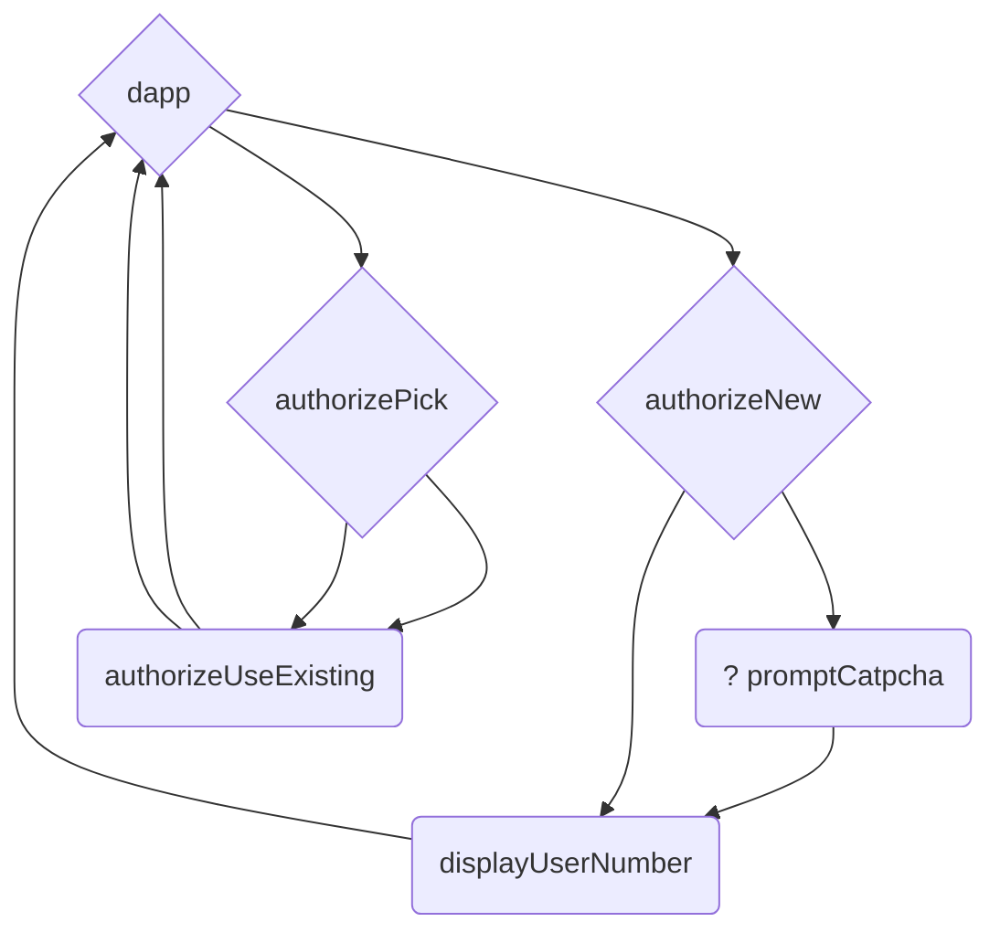
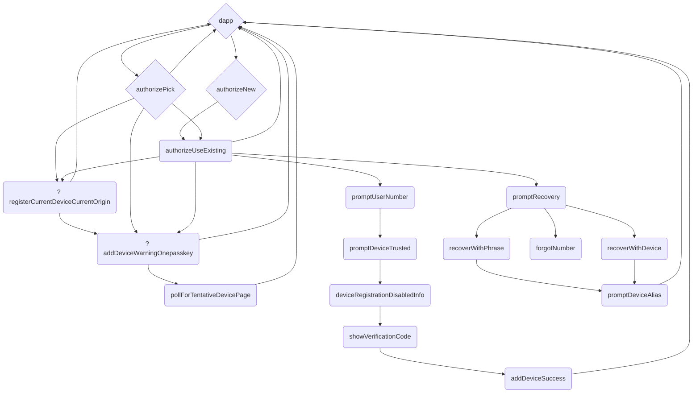
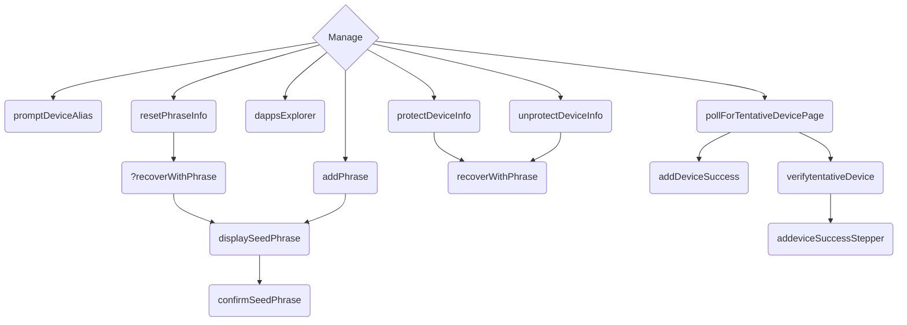
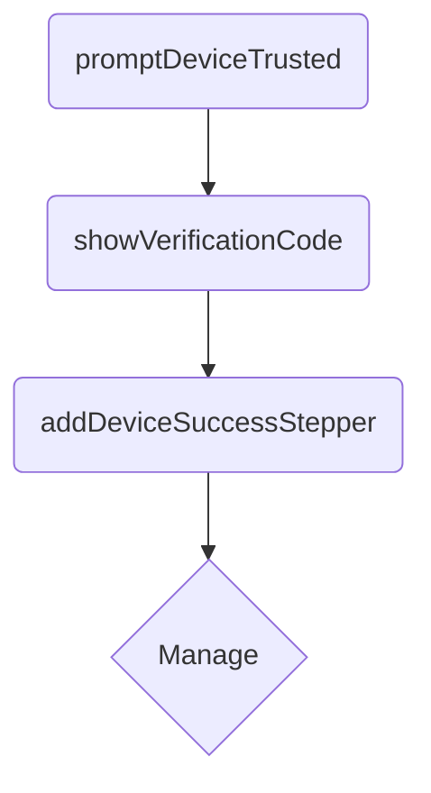
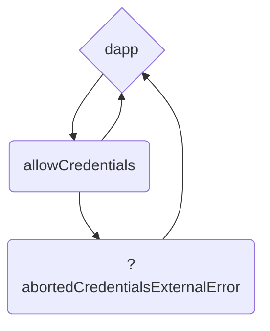

# Flows

The following diagrams describe all the user flows available in Internet Identity (II).

Ths diagram use some conventions:

- A diamond `{}` node means that this can be an entry point for a user.
- A question mark `?` in the beginning of the screen's name means that the screen depends on the user's or II's state.
- The name of the screens are the same names used in the [showcase](https://dfinity.github.io/internet-identity/).

The following flows only take into account the II screens. Not the Webauthn flows. Those depend on the OS, password manager and device of the user.

## Registration

There are three different entry points:

- dapp. The user starts in a dapp like Open Chat and decides to register with Internet Identity.
- [authorizePick](https://dfinity.github.io/internet-identity/authorizePick/). The user visits the main II page directly.
  - This screen is shown if the user already has identities used in that browser.
- [authorizeNew](https://dfinity.github.io/internet-identity/authorizeNew/). The user visits the main II page directly.
  - This screen is shown if the user has NO identities in that browser.

These are all the possible paths that a user might take:

## Login

The user wants to log in to a dapp (like Open Chat) or log in directly to II.

There are the same entry points as in the registration flows:

- dapp. The user starts in a dapp like Open Chat and decides to log in with Internet Identity.
- [authorizePick](https://dfinity.github.io/internet-identity/authorizePick/). The user visits the main II page directly.
  - This screen is shown if the user already has identities used in that browser.
- [authorizeNew](https://dfinity.github.io/internet-identity/authorizeNew/). The user visits the main II page directly.
  - This screen is shown if the user has NO identities in that browser.

There are four main groups of flows:

- Recovery flow. The flow below [promptRecovery](https://dfinity.github.io/internet-identity/promptRecovery/).
- User another device. The flow below [promptUserNumber](https://dfinity.github.io/internet-identity/promptUserNumber/) which comes from clicking "Continue with another device" in [authorizeUseExisting](https://dfinity.github.io/internet-identity/authorizeUseExisting/).
- Warning screens. There are two possible warning screens [registerCurrentDeviceCurrentOrigin](https://dfinity.github.io/internet-identity/registerCurrentDeviceCurrentOrigin/) and [addDeviceWarningOnePasskey](https://dfinity.github.io/internet-identity/addDeviceWarningOnePasskey/).
- Normal flow. Using the [authorizePick](https://dfinity.github.io/internet-identity/authorizePick/), and [authorizeUseExisting](https://dfinity.github.io/internet-identity/authorizeUseExisting/) to authenticate.

These are all the posible paths that a user might take when logging in:

## Manage Identity

This flows are triggered after the user arrives to the [displayManage](https://dfinity.github.io/internet-identity/displayManage/) page and performs different actions.

This is not an exhaustive list of actions that the user might take in the manage page. There are some actions that do not trigger other screens and therefore are not included in here.

The actions listed here are:

- [promptDeviceAlias](https://dfinity.github.io/internet-identity/promptDeviceAlias/): Rename a passkey.
- [addPhrase](https://dfinity.github.io/internet-identity/addPhrase/): Create a seed phrase.
- [resetPhraseInfo](https://dfinity.github.io/internet-identity/resetPhraseInfo/): Reset seed phrase.
- [dappsExplorer](https://dfinity.github.io/internet-identity/dappsExplorer/): Visit list of dapps that integrate with II.
- [protectDeviceInfo](https://dfinity.github.io/internet-identity/protectDeviceInfo/): Lock seed phrase.
- [unprotectDeviceInfo](https://dfinity.github.io/internet-identity/unprotectDeviceInfo/): Unlock seed phrase.
- [pollForTentativeDevicePage](https://dfinity.github.io/internet-identity/pollForTentativeDevicePage/): Add new passkey.

The entry point is the [displayManage](https://dfinity.github.io/internet-identity/displayManage/) page.

The following are all the possible flows from the manage page:

## Add Device

Adding a device needs two flows:

- Authenticated flow. Which will allow adding the device to an identity. Done with the device already added to the identity.
- Adding device flow. The flow the new device needs to complete to be added.

The user can start with either flow.

If the user starts "Adding device flow" by selecting "Continue with another device" in [authorizeUseExisting](https://dfinity.github.io/internet-identity/authorizeUseExisting/). Then, the user needs to log in with the authenticated device and go to [pollForTentativeDevicePage](https://dfinity.github.io/internet-identity/pollForTentativeDevicePage/) from the manage page.

If the user starts from the manage page, then the user needs to perform the following flows in the new device:

When the user visits the URL, it sees the screen [promptDeviceTrusted](https://dfinity.github.io/internet-identity/promptDeviceTrusted/), which is the entry point of the flow.

## Verifiable Credentials

There is one final flow possible in II: Sharing verifiable credentials with a relying party from an issuer.

This flow is triggered by a dapp when requests to present a credential from the user.

