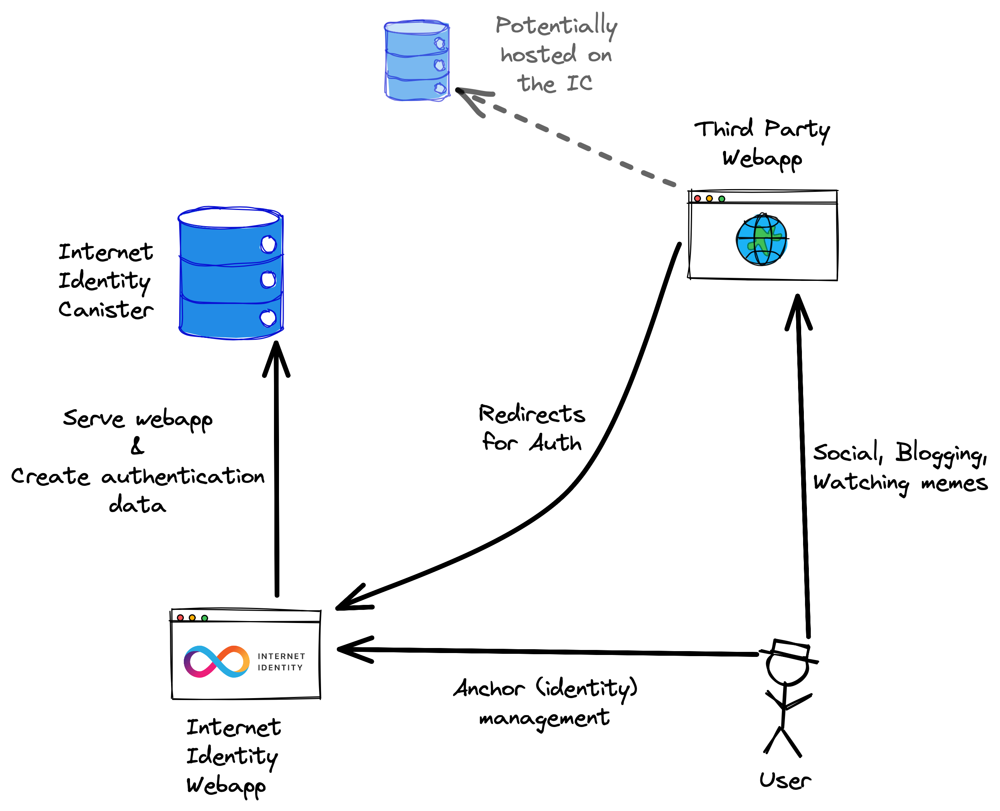

<p align="center"><a href="https://identity.internetcomputer.org" target="_blank" rel="noopener noreferrer"></a></p>

<p align="center">
    <a href="https://github.com/dfinity/internet-identity/actions/workflows/canister-tests.yml"></a>
    <a href="https://github.com/dfinity/internet-identity/actions/workflows/rust.yml"></a>
    <a href="https://github.com/dfinity/internet-identity/actions/workflows/frontend-checks.yml"></a>
    <a href="https://github.com/dfinity/internet-identity/releases"></a>
</p>

<p align="center">
    🔗 <a href="https://identity.internetcomputer.org">https://identity.internetcomputer.org</a> • 📜 <a href="https://internetcomputer.org/docs/current/references/ii-spec">Specification</a> <br/> ― <br/>📚 <a href="https://forum.dfinity.org/c/internet-identity/32">Forum</a> • 🚑 <a href="https://github.com/dfinity/internet-identity/issues/new">Report an Issue</a> • 📞 <a href="https://discord.internetcomputer.org">Discord</a>
</p>

---

Internet Identity is an authentication service for the [Internet Computer][ic]. It is the authentication system that allows hundreds of thousands of users to log in to Dapps like [Distrikt], [DSCVR] and more.

Internet Identity is:

- **Simple**: It uses some of the [WebAuthn] API to allow users to register and authenticate without passwords, using TouchID, FaceID, Windows Hello, and more.
- **Flexible**: Integrating Internet Identity in a Dapp (or even Web 2 app) is as simple as opening the Internet Identity's HTTP interface, https://identity.internetcomputer.org, in a new tab. No need to interact with the canister smart contract directly.
- **Secure**: Different identities are issued for each app a user authenticates to and cannot be linked back to the user.

For more information, see [What is Internet Identity?](https://internetcomputer.org/docs/current/tokenomics/identity-auth/what-is-ic-identity) on [internetcomputer.org](https://internetcomputer.org).

### Table of Contents

- [Getting Started](#getting-started)
  - [Local Replica](#local-replica)
  - [Architecture Overview](#architecture-overview)
  - [Building with Docker](#building-with-docker)
  - [Integration with Internet Identity](#integration-with-internet-identity)
- [Build Features](#build-features-and-flavors)
  - [Features](#features)
- [Stable Memory Compatibility](#stable-memory-compatibility)
- [Getting Help](#getting-help)
- [Links](#links)

## Getting Started

This section gives an overview of Internet Identity's architecture, instructions on how to build the Wasm module (canister), and finally pointers for integrating Internet Identity in your own applications.

### Local Replica

Use the Internet Identity canister in your local dfx project by adding the following code snippet to your `dfx.json` file:

```json
{
  "canisters": {
    "internet_identity": {
      "type": "custom",
      "candid": "https://github.com/dfinity/internet-identity/releases/download/release-2025-04-04-v3/internet_identity.did",
      "wasm": "https://github.com/dfinity/internet-identity/releases/download/release-2025-04-04-v3/internet_identity_dev.wasm.gz",
      "init_arg": "(opt record { captcha_config = opt record { max_unsolved_captchas= 50:nat64; captcha_trigger = variant {Static = variant {CaptchaDisabled}}}})",
      "remote": {
        "id": {
          "ic": "rdmx6-jaaaa-aaaaa-aaadq-cai"
        }
      },
      "frontend": {}
    }
  }
}
```

To deploy, run `dfx deploy`.

To access Internet Identity or configure it for your dapp, use one of the following URLs:

- Chrome, Firefox: `http://<canister_id>.localhost:4943`
- Safari: `http://localhost:4943?canisterId=<canister_id>`

#### Note on Apple Silicon

If you are running into build issues on Apple Silicon (specifically, if rollup is trying to access @rollup/rollup-darwin-x64), try using nvm to install node.

### Architecture Overview

Internet Identity is an authentication service for the [Internet Computer][ic]. All programs on the Internet Computer are Wasm modules, or canisters (canister smart contracts).

 <!-- this is an excalidraw.com image, source is ii-architecture.excalidraw -->

Internet Identity runs as a single canister which both serves the frontend application code, and handles the requests sent by the frontend application code.

> 💡 The canister (backend) interface is specified by the [internet_identity.did](./src/internet_identity/internet_identity.did) [candid] interface. The (backend) canister code is located in [`src/internet_identity`](./src/internet_identity), and the frontend application code (served by the canister through the `http_request` method) is located in [`src/frontend`](./src/frontend).

The Internet Identity authentication service works indirectly by issuing "delegations" on the user's behalf; basically attestations signed with some private cryptographic material owned by the user. The private cryptographic material never leaves the user's device. The Internet Identity frontend application uses the [WebAuthn] API to first create the private cryptographic material, and then the [WebAuthn] API is used again to sign delegations.

For information on how Internet Identity works in more detail, please refer to the following:

- [Internet Identity presentation 📼](https://youtu.be/oxEr8UzGeBo), streamed during the Genesis Event
- [Internet Identity Specification][spec], the official Internet Identity Specification

### Building with Docker

To get the canister (Wasm module) for Internet Identity, you can either **download a release** from the [releases] page, or build the code yourself. The simplest way to build the code yourself is to use [Docker] and the [`docker-build`](./scripts/docker-build) script:

```bash
$ ./scripts/docker-build
```

The [`Dockerfile`](./Dockerfile) specifies build instructions for Internet Identity. Building the `Dockerfile` will result in a scratch container that contains the Wasm module at `/internet_identity.wasm.gz`.

> 💡 The build can be customized with [build features](#build-features-and-flavors).

We recommend using the [`docker-build`](./scripts/docker-build) script. It simplifies the usage of [build features](#build-features-and-flavors) and extracts the Wasm module from the final scratch container.

> 💡 You can find instructions for building the code without Docker in the [HACKING] document.

### Integration with Internet Identity

The [`using-dev-build`](./demos/using-dev-build) demo shows a documented example project that integrates Internet Identity. For more, please refer to the [Client Authentication Protocol section](https://internetcomputer.org/docs/current/references/ii-spec#client-authentication-protocol) of the [Internet Identity Specification][spec] to integration Internet Identity in your app from scratch. For a just-add-water approach using the [agent-js](https://github.com/dfinity/agent-js) library (also used by `using-dev-build`), check out Kyle Peacock's [blogpost](http://kyle-peacock.com/blog/dfinity/integrating-internet-identity/).

If you're interested in the infrastructure of how to get the Internet Identity canister and how to test it within your app, check out [`using-dev-build`](./demos/using-dev-build), which uses the Internet Identity development canister.

## Stable Memory Compatibility

Internet Identity requires data in stable memory to have a specific layout in order to be upgradeable. The layout has been changed multiple times in the past. This is why II stable memory is versioned and each version of II is only compatible to some stable memory versions.

If on upgrade II traps with the message `stable memory layout version ... is no longer supported` then the stable memory layout has changed and is no longer compatible.

The easiest way to address this is to reinstall the canister (thus wiping stable memory). A canister can be reinstalled by executing `dfx deploy <canister> --mode reinstall`.

## Getting Help

We're here to help! Here are some ways you can reach out for help if you get stuck:

- [Internet Identity Bug Tracker](https://github.com/dfinity/internet-identity/issues): Create a new ticket if you encounter a bug using Internet Identity, or if an issue arises when you try to build the code.
- [DFINITY Forum](https://forum.dfinity.org/c/internet-identity/32): The forum is a great place to look for information and to ask for help.
- [Support](https://support.dfinity.org/hc/en-us/requests/new): Create a support request if you'd like to keep things private.

## Links

- [Internet Identity Specification][spec], the official Internet Identity Specification
- [Integration with Internet Identity](http://kyle-peacock.com/blog/dfinity/integrating-internet-identity/) by Kyle Peacock
- [What is Internet Identity?](https://internetcomputer.org/docs/current/tokenomics/identity-auth/what-is-ic-identity) on [internetcomputer.org](https://internetcomputer.org)
- [Internet Identity presentation 📼](https://youtu.be/oxEr8UzGeBo) on YouTube, streamed during the Genesis Event
- [Excalidraw](https://excalidraw.com), used to make diagrams

[distrikt]: https://distrikt.io
[webauthn]: https://webauthn.guide
[dscvr]: https://dscvr.one
[hacking]: ./HACKING.md#running-locally
[ic]: https://internetcomputer.org
[spec]: https://internetcomputer.org/docs/current/references/ii-spec
[releases]: https://github.com/dfinity/internet-identity/releases
[docker]: https://docker.io
[links]: #links
[candid]: https://internetcomputer.org/docs/current/developer-docs/build/languages/candid/candid-concepts/
