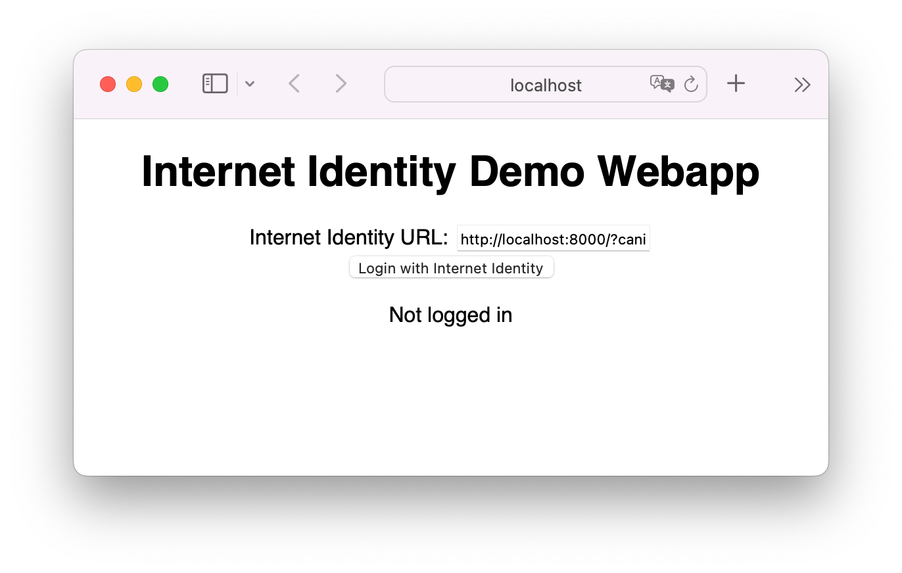

[comment]: # This document is mainly written to be viewed on https://internetcomputer.org/docs/current/developer-docs/integrations/internet-identity/integrate-identity/

# Integrating with Internet Identity

This guide shows how to integrate and test a project with Internet Identity. The complete code example can be found [here](https://github.com/dfinity/internet-identity/tree/main/demos/using-dev-build). It uses the development [build flavor](https://github.com/dfinity/internet-identity/blob/main/README.md#build-features-and-flavors) of Internet Identity and the [agent-js](https://github.com/dfinity/agent-js) library.

This is a standalone project that you can copy to your own project.

## Prerequisites

- [dfx](https://internetcomputer.org/docs/current/developer-docs/build/install-upgrade-remove)
- Node.js v16+

This tutorial assumes that you are already familiar with the [basic concepts of the IC](https://internetcomputer.org/docs/current/developer-docs/ic-overview) (canisters, how to use `dfx`, etc.).

## Usage

The following commands will start a replica, install the development Internet Identity canister, and run the test suite:

```bash
# After checking out dfinity/internet-identity, run this in `./demos/using-dev-build`:
$ dfx start --background --clean
$ npm ci
$ dfx deploy --no-wallet
```

At this point, the replica (for all practical matters, a local version of the Internet Computer) is running and three canisters have been deployed:

- `internet_identity`: The development version of Internet Identity (downloaded from the [latest release](https://github.com/dfinity/internet-identity/releases/latest), see [`dfx.json`](./dfx.json)).
- `webapp`: A tiny webapp that calls out to the `internet_identity` canister for authentication, and that then calls the `whoami` canister (see below) to show that the identity is valid. You'll find the source of the webapp in [`index.html`](./webapp/index.html) and [`index.ts`](./webapp/index.ts).
- `whoami`: A simple canister that checks that calls are authenticated, and that returns the "principal of the caller". The implementation is terribly simple:
  ```motoko
  actor {
      public query ({caller}) func whoami() : async Principal {
          return caller;
      };
  };
  ```
  On the IC, a principal is the identifier of someone performing a request or "call" (hence "caller"). Every call must have a valid principal. There is also a special principal for anonymous calls. When using Internet Identity you are using [self-authenticating principals](https://smartcontracts.org/docs/interface-spec/index.html#principal), which is a very fancy way of saying that you have a private key on your laptop (hidden behind TouchID, Windows Hello, etc) that your browser uses to sign and prove that you are indeed the person issuing the calls to the IC.

If the IC actually lets the call (request) through to the `whoami` canister, it means that everything checked out, and the `whoami` canister just responds with the information the IC adds to requests, namely your identity (principal).

### Adding Internet Identity to your Local Project

This section explains how to add Internet Identity to your (local) project. Add the following snippet to the `canister` section in your `dfx.json` file (see full example [here](https://github.com/dfinity/internet-identity/blob/main/demos/using-dev-build/dfx.json)):

```json
"internet_identity": {
  "type": "custom",
  "candid": "https://github.com/dfinity/internet-identity/releases/latest/download/internet_identity.did",
  "wasm": "https://github.com/dfinity/internet-identity/releases/latest/download/internet_identity_dev.wasm.gz",
  "remote": {
    "id": {
      "ic": "rdmx6-jaaaa-aaaaa-aaadq-cai"
    }
  }
}
```

The `remote` property makes sure that your project will _not_ create a copy of Internet Identity on the IC when deploying to production.

> Note: The wasm URL points to the [dev build](https://github.com/dfinity/internet-identity#flavors) of Internet Identity. It is recommended to use the dev build locally because it has modifications that make test automation easy.

### Using the Auth-Client Library To Log In With Internet Identity

DFINITY provides an [easy-to-use library (agent-js)](https://github.com/dfinity/agent-js) to log in with Internet Identity.

These are the steps required to log in and use the obtained identity for canister calls:

```js
// First we have to create and AuthClient.
const authClient = await AuthClient.create();

// Call authClient.login(...) to login with Internet Identity. This will open a new tab
// with the login prompt. The code has to wait for the login process to complete.
// We can either use the callback functions directly or wrap in a promise.
await new Promise((resolve, reject) => {
  authClient.login({
    onSuccess: resolve,
    onError: reject,
  });
});
```

Once the user has been authenticated with Internet Identity we have access to the identity:

```js
// Get the identity from the auth client:
const identity = authClient.getIdentity();
// Using the identity obtained from the auth client, we can create an agent to interact with the IC.
const agent = new HttpAgent({ identity });
// Using the interface description of our webapp, we create an Actor that we use to call the service methods.
const webapp = Actor.createActor(webapp_idl, {
  agent,
  canisterId: webapp_id,
});
// Call whoami which returns the principal (user id) of the current user.
const principal = await webapp.whoami();
```

See [`index.js`](./webapp/index.ts) for the full working example.
A detailed description of what happens behind the scenes is available in the [client auth protocol specification](https://github.com/dfinity/internet-identity/blob/main/docs/internet-identity-spec.adoc#client-auth-protocol).

### Getting the Canister IDs

Let's now use those canisters.

In order to talk to those canisters (for instance to view the webapp in your browser) you need to figure the ID of each canister and then use an URL of the form `https://localhost:4943/?canisterId=<canister ID>` (where `4943` is the port used by `dfx` to proxy calls to the replica; that port is usually specified in the `dfx.json`). You can find the canister IDs in the output of the `dfx command`, or by checking `dfx`'s "internal" (read: non-documented) state:

```
~/internet-identity/demos/using-dev-build$ cat .dfx/local/canister_ids.json
{
  "__Candid_UI": {
    "local": "r7inp-6aaaa-aaaaa-aaabq-cai"
  },
  "internet_identity": {
    "local": "rwlgt-iiaaa-aaaaa-aaaaa-cai"
  },
  "webapp": {
    "local": "rrkah-fqaaa-aaaaa-aaaaq-cai"
  },
  "whoami": {
    "local": "ryjl3-tyaaa-aaaaa-aaaba-cai"
}
```

You might get different canister IDs (and that's totally fine). If the `webapp` canister ID is `rrkah-fqaaa-aaaaa-aaaaq-cai`, you should be able to point your browser to [`http://localhost:4943/?canisterId=rrkah-fqaaa-aaaaa-aaaaq-cai`](http://localhost:4943/?canisterId=rrkah-fqaaa-aaaaa-aaaaq-cai) to see the webapp. Hurray!



_If you actually use the webapp, make sure that the "Internet Identity URL" field points to one of these URLS_:

- Chrome, Firefox: `http://<canister ID of the internet_identity canister>.localhost:4943/`.
- Safari: `http://localhost:4943/?canisterId=<canister ID of the internet_identity canister>`.

## Local Development

Run `npm run dev` to build the app and serve it on `localhost:5173` with hot reload on code changes, ideal for hacking on the webapp.

## Running Tests

Run `npm run test` to run browser tests against the `internet_identity` canister.

## More Information

For more information, check the [`dfx.json`](./dfx.json) file, the [Genesis talk on Internet Identity](https://youtu.be/oxEr8UzGeBo) and the [Internet Computer documentation](https://internetcomputer.org/).
