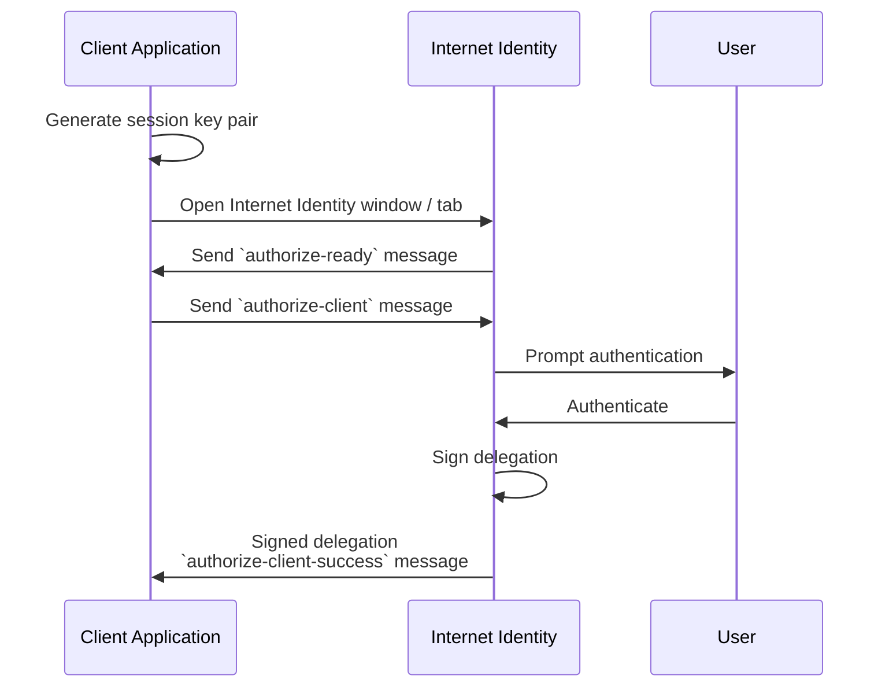

import CodeBlock from "@theme/CodeBlock";
import IICandidInterface from "!!raw-loader!./internet_identity.did";

# The Internet Identity Specification

## Introduction

This document describes and specifies Internet Identity from various angles and at various levels of abstraction, namely:

- High level goals, requirements and use cases.

- Overview of the security and identity machinery, including the interplay of identities, keys, and delegations.

- Interface as used by client applications frontends, i.e., our [client authentication protocol](#client-authentication-protocol).

- The interface of the Internet Identity Service _backend_, i.e., describing its contract at the Candid layer, as used by its frontend.

- Important implementation notes about the Internet Identity Service backend.

The Internet Identity service consists of:

- Its backend, a canister on ICP. More precisely, a canister on a dedicated subnet with a _well-known_ canister id, and

- its frontend, a web application served by the backend canister.

Similarly, the client applications consist of a frontend (served by a canister) and (typically) one or more backend canisters. Only the frontend interacts with the Internet Identity Service directly (via the [client authentication protocol](#client-authentication-protocol) described below).

## Goals, requirements and use cases

The Internet Identity service allows users to

- maintain identities on the Internet Computer

- log in with these identities using one out of a set of security devices

- manage their set of security devices

Some functional requirements are

- users have separate identities (or "pseudonyms") per client application (more precisely, per client application frontend "hostname", though see [Alternative Frontend Origins](#alternative-frontend-origins) for caveat about `.raw` domains)

- these identities are stable, i.e., do not depend on a user's security devices

- the client frontends interact with any canister on the Internet Computer under the user's identity with that frontend

- users do not need ever to remember secret information (but possibly per-user non-secret information)

- a security device does not need to be manually touched upon every interaction with a client application; a login is valid for a certain amount of time per identity

Some security requirements are

- The separate identities of a single user cannot be related merely based on their public key or principal ids, to impede user tracking.

- The security of the identities does not depend on the privacy of data stored on canisters, or transmitted to and from canisters. In particular, the delegations handed out by the backend canister must not be sensitive information.

- (many more, of course; apply common sense)

Some noteworthy security assumptions are:

- The delivery of frontend applications is secure. In particular, a user accessing the Internet Identity Service Frontend through a TLS-secured HTTP connection cannot be tricked into running another web application.

:::note
Just for background: At launch this meant we relied on the trustworthiness of the boundary nodes as well as the replica the boundary nodes happens to fetch the assets from. After launch, certification of our HTTP Gateway protocol and trustworthy client-side code (browser extensions, proxies, etc.) have improved this situation.
:::

- The security devices only allow the use of their keys from the same web application that created the key (in our case, the Internet Identity Service Frontend).

- The user's browser is trustworthy, `postMessage` communication between different origins is authentic.

- For user privacy, we also assume the Internet Identity Service backend can keep a secret (but since data is replicated, we do not rely on this assumption for other security properties).

## Identity design and data model

The Internet Computer serves this frontend under hostnames `https://identity.internetcomputer.org` (official) and `https://identity.ic0.app` (legacy).

The canister maintains a salt (in the following the `salt`), a 32 byte long blob that is obtained via the Internet Computer's source of secure randomness.

:::note
Due to replication of data in canisters, the salt should not be considered secret against a determined attacker. However, the canister will not reveal the salt directly and to the extent it is unknown to an attacker it helps maintain privacy of user identities.
:::

A user Identity is identified by a unique _Identity Anchor_, a natural number chosen by the canister.

A client application frontend is identified by its origin (e.g., `https://abcde-efg.ic0.app`, `https://nice-name.com`). Frontend applications can be served by canisters or by websites that are not hosted on the Internet Computer.

A user has a separate _user identity_ for each client application frontend (i.e., per origin). This identity is a [_self-authenticating id_](https://internetcomputer.org/docs/current/references/ic-interface-spec#id-classes) of the [DER encoded canister signature public key](https://internetcomputer.org/docs/current/references/ic-interface-spec/#canister-signatures) which has the form

```
user_id = SHA-224(DER encoded public key) · 0x02` (29 bytes)
```

and the `BIT STRING` field of the DER encoded public key has the form

```
bit_string = |ii_canister_id| · ii_canister_id · seed
```

where the `seed` is derived as follows

```
seed = H(|salt| · salt · |user_number| · user_number · |frontend_origin| · frontend_origin)
```

where `H` is SHA-256, `·` is concatenation, `|…|` is a single byte representing the length of `…` in bytes, `user_number` is the ASCII-encoding of the Identity Anchor as a decimal number, and `frontend_origin` is the ASCII-encoding of the client application frontend's origin (at most 255 bytes).

:::note
A `frontend_origin` of the form `https://<canister id>.icp0.io` will be rewritten to `https://<canister id>.ic0.app` before being used in the seed. This ensures transparent pseudonym transfer between apps hosted on `ic0.app` and `icp0.io` domains.
:::

When a client application frontend wants to authenticate as a user, it uses a _session key_ (e.g., Ed25519 or ECDSA), and by way of the authentication flow (details below) obtains a [_delegation chain_](https://internetcomputer.org/docs/current/references/ic-interface-spec#authentication) that allows the session key to sign for the user's main identity.

The delegation chain consists of one delegation, called the _client delegation_. It delegates from the user identity (for the given client application frontend) to the session key. This delegation is created by the Internet Identity Service Canister, and signed using a [canister signature](https://internetcomputer.org/docs/current/references/ic-interface-spec/#canister-signatures). This delegation is unscoped (valid for all canisters) and has a maximum lifetime of 30 days, with a default of 30 minutes.

The Internet Identity service frontend also manages an _identity frontend delegation_, delegating from the security device's public key to a session key managed by this frontend, so that it can interact with the backend without having to invoke the security device for each signature.

## Client authentication protocol

This section describes the Internet Identity service from the point of view of a client application frontend.



1.  The client application frontend creates a session key pair (e.g., Ed25519).

2.  It installs a `message` event handler on its own `window`.

3.  It loads the url `https://identity.internetcomputer.org/#authorize` in a separate tab. Let `identityWindow` be the `Window` object returned from this.

4.  In the `identityWindow`, the user logs in, and the `identityWindow` invokes

    ```ts
    window.opener.postMessage(msg, "*");
    ```

    where `msg` is

    ```ts
    interface InternetIdentityReady {
      kind: "authorize-ready";
    }
    ```

5.  The client application, after receiving the `InternetIdentityReady`, invokes

    ```ts
    identityWindow.postMessage(msg, "https://identity.internetcomputer.org");
    ```

    where `msg` is a value of type

    ```ts
    interface InternetIdentityAuthRequest {
      kind: "authorize-client";
      sessionPublicKey: Uint8Array;
      maxTimeToLive?: bigint;
      allowPinAuthentication?: boolean;
      derivationOrigin?: string;
      autoSelectionPrincipal?: string;
    }
    ```

    where

    - the `sessionPublicKey` contains the public key of the session key pair.

    - the `maxTimeToLive`, if present, indicates the desired time span (in nanoseconds) until the requested delegation should expire. The Identity Provider frontend is free to set an earlier expiry time, but should not create a one larger.

    - the `allowPinAuthentication` (EXPERIMENTAL), if present, indicates whether or not the Identity Provider should allow the user to authenticate and/or register using a temporary key/PIN identity. Authenticating dapps may want to prevent users from using Temporary keys/PIN identities because Temporary keys/PIN identities are less secure than Passkeys (webauthn credentials) and because Temporary keys/PIN identities generally only live in a browser database (which may get cleared by the browser/OS).

    - the `derivationOrigin`, if present, indicates an origin that should be used for principal derivation instead of the client origin. Internet Identity will validate the `derivationOrigin` by checking that it lists the client application origin in the `/.well-known/ii-alternative-origins` file (see [Alternative Frontend Origins](#alternative-frontend-origins)).

    - the `autoSelectionPrincipal`, if present, indicates the textual representation of this dapp's principal for which the delegation is requested. If it is known to Internet Identity and the corresponding identity has been the most recently used for the client application origin, it will skip the identity selection and immediately prompt for authentication. This feature can be used to streamline re-authentication after a session expiry.

6.  Now the client application window expects a message back, with data `event`.

7.  If `event.origin` is not either `"https://identity.ic0.app"` or `"https://identity.internetcomputer.org"` (depending on which endpoint you are using), ignore this message.

8.  The `event.data` value is a JS object with the following type:

    ```ts
    interface InternetIdentityAuthResponse {
      kind: "authorize-client-success";
      delegations: [
        {
          delegation: {
            pubkey: Uint8Array;
            expiration: bigint;
            targets?: Principal[];
          };
          signature: Uint8Array;
        },
      ];
      userPublicKey: Uint8Array;
      authnMethod: "passkey";
    }
    ```

    where the `userPublicKey` is the user's Identity on the given frontend and `delegations` corresponds to the CBOR-encoded delegation chain as used for [_authentication on the IC_](https://internetcomputer.org/docs/current/references/ic-interface-spec#authentication) and `authnMethod` is the method used by the user to authenticate (`passkey` for webauthn, `pin` for temporary key/PIN identity, and `recovery` for recovery phrase or recovery device).

9.  It could also receive a failure message of the following type

    ```ts
    interface InternetIdentityAuthResponse {
      kind: "authorize-client-failure";
      text: string;
    }
    ```

    The client application frontend needs to be able to detect when any of the delegations in the chain has expired, and re-authorize the user in that case.

The [`@dfinity/auth-client`](https://www.npmjs.com/package/@dfinity/auth-client) NPM package provides helpful functionality here.

The client application frontend should support delegation chains of length more than one, and delegations with `targets`, even if the present version of this spec does not use them, to be compatible with possible future versions.

:::note
The Internet Identity frontend will use `event.origin` as the "Frontend URL" to base the user identity on. This includes protocol, full hostname and port. This means

- Changing protocol, hostname (including subdomains) or port will invalidate all user identities.
  - However, multiple different frontend URLs can be mapped back to the canonical frontend URL, see [Alternative Frontend Origins](#alternative-frontend-origins).
  - Frontend URLs on `icp0.io` are mapped to `ic0.app` automatically, see [Identity design and data model](#identity-design-and-data-model).
- The frontend application must never allow any untrusted JavaScript code to be executed, on any page on that origin. Be careful when implementing a JavaScript playground on the Internet Computer.
  :::

## Alternative frontend origins

To allow flexibility regarding the canister frontend URL, the client may choose to provide another URL as the `derivationOrigin` (see [Client authentication protocol](#client-authentication-protocol)). This means that Internet Identity will issue the same principals to the frontend (which uses a different origin) as it would if it were using the `derivationOrigin` directly.
This feature works for `canisterId` based URLs and [ICP custom domains](https://internetcomputer.org/docs/current/developer-docs/web-apps/custom-domains/using-custom-domains) (backed by canisters) as `derivationOrigin`.

:::caution
This feature is intended to allow more flexibility with respect to the origins of a _single_ service. Do _not_ use this feature to allow _third party_ services to use the same principals. Only add origins you fully control to `/.well-known/ii-alternative-origins` and never set origins you do not control as `derivationOrigin`!
:::

:::note
`https://<canister_id>.ic0.app` and `https://<canister_id>.raw.ic0.app` do _not_ issue the same principals by default . However, this feature can also be used to map `https://<canister_id>.raw.ic0.app` to `https://<canister_id>.ic0.app` principals or vice versa.
:::

In order for Internet Identity to accept the `derivationOrigin` the origin of the client application must be listed in the JSON object served on the URL `https://<canister_id>.icp0.io/.well-known/ii-alternative-origins` (i.e. the file must be hosted by an ICP canister that must implement the `http_request` query call as specified [here](https://internetcomputer.org/docs/current/references/http-gateway-protocol-spec)).

### JSON Schema {#alternative-frontend-origins-schema}

```json
{
  "$schema": "https://json-schema.org/draft/2020-12/schema",
  "title": "II Alternative Origins Principal Derivation Origins",
  "description": "An object containing the alternative frontend origins of the given canister, which are allowed to use the URL this document is hosted on for principal derivation.",
  "type": "object",
  "properties": {
    "alternativeOrigins": {
      "description": "List of allowed alternative frontend origins",
      "type": "array",
      "items": {
        "type": "string"
      },
      "minItems": 0,
      "maxItems": 10,
      "uniqueItems": true
    }
  },
  "required": ["alternativeOrigins"]
}
```

### Example

```json
{
  "alternativeOrigins": [
    "https://alternative-1.com",
    "https://www.nice-frontend-name.org"
  ]
}
```

:::note
The path `/.well-known/ii-alternative-origins` will always be requested using the non-raw `https://<canister_id>.ic0.app` domain (even if the `derivationOrigin` uses a `.raw`) and _must_ be delivered as a certified asset. Requests to `/.well-known/ii-alternative-origins` _must_ be answered with a `200` HTTP status code. More specifically Internet Identity _will not_ follow redirects and fail with an error instead. These measures are required in order to prevent malicious boundary nodes or replicas from tampering with `ii-alternative-origins`.
:::

:::note
To prevent misuse of this feature, the number of alternative origins _must not_ be greater than 10.
:::

:::note
In order to allow Internet Identity to read the path `/.well-known/ii-alternative-origins`, the CORS response header [`Access-Control-Allow-Origin`](https://developer.mozilla.org/en-US/docs/Web/HTTP/Headers/Access-Control-Allow-Origin) must be set and allow the Internet Identity origin `https://identity.internetcomputer.org`.
:::

## The Internet Identity Service Backend interface

This section describes the interface that the backend canister provides.

Note that the interface is split into 4 categories:

- Identity management API, i.e. APIs for end-users to manage their identity.
  - Legacy API.
  - API v2 (experimental, incomplete).
    - The aim of the API v2 is to introduce changes that cannot be made without breaking existing clients of the legacy API. While the API v2 has feature parity with the legacy API, the desired changes are not fully implemented yet:
      - Methods should return proper results with meaningful errors.
      - Adding explicit WebAuthn signatures to security critical operations.
- HTTP gateway protocol, required to serve `https://identity.internetcomputer.org`.
- Auth protocol, for creating signed delegations.
- Verifiable credentials protocol, for creating id alias credentials.
- Internal methods, not intended to be called by external clients.
  - These are methods related to initialization of II itself and integration with its archive.

The summary is given by the Candid interface:

<CodeBlock language="candid">{IICandidInterface}</CodeBlock>

### Identity management (legacy API)

#### The `create_challenge` and `register` methods

**Authorization**: This `register` request must be sent to the canister with `caller` that is the self-authenticating id derived from the given `DeviceKey`.

The `register` method is used to create a new user. The Internet Identity Service backend creates a _fresh_ Identity Anchor, creates the Identity record, and adds the given device as the first device.

In order to protect the Internet Computer from too many "free" update calls, and to protect the Internet Identity Service from too many user registrations, this call is protected using a CAPTCHA challenge. The `register` call can only succeed if the `ChallengeResult` contains a `key` for a challenge that was created with `create_challenge` (see below) in the last 5 minutes _and_ if the `chars` match the characters that the Internet Identity Service has stored internally for that `key`.

#### The `add` method

:::note
API V2: `authn_method_add`
:::

**Authorization**: This request must be sent to the canister with `caller` that is the self-authenticating id derived from any of the public keys of devices associated with the user before this call.

The `add` method appends a new device to the given user's record.

The Internet Identity Service backend rejects the call if the user already has a device on record with the given public key.

This may also fail (with a _reject_) if the user is registering too many devices.

#### The `remove` method

:::note
API V2: `authn_method_remove`
:::

**Authorization**: This request must be sent to the canister with `caller` that is the self-authenticating id derived from any of the public keys of devices associated with the user before this call.

The `remove` method removes a device, identified by its public key, from the list of devices a user has.

It is allowed to remove the key that is used to sign this request. This can be useful for a panic button functionality.

It is allowed to remove the last key, to completely disable a user. The canister may forget that user completely then, assuming the Identity Anchor generation algorithm prevents new users from getting the same Identity Anchor.

It is the responsibility of the frontend UI to protect the user from doing these things accidentally.

:::note
If the device has the `protected` flag, then the request must be sent to the canister with `caller` that is the self-authenticating id derived from the public key of that particular device.
:::

#### The `replace` method

:::note
API V2: `authn_method_replace`
:::

**Authorization**: This request must be sent to the canister with `caller` that is the self-authenticating id derived from any of the public keys of devices associated with the user before this call.

The `replace` method atomically replaces a device, identified by its public key from the list of devices a user has with another one supplied as an argument.

It is allowed to replace the key that is used to sign this request. The replace method is useful to replace the recovery phrase with another one, making sure that at all times there is exactly one recovery phrase associated with the identity.

It is the responsibility of the frontend UI to protect the user from doing these things accidentally.

:::note
If the device has the `protected` flag, then the request must be sent to the canister with `caller` that is the self-authenticating id derived from the public key of that particular device.
:::

#### The `enter_device_registration_mode` method

:::note
API V2: `authn_method_registration_mode_enter`
:::

**Authorization**: This request must be sent to the canister with `caller` that is the self-authenticating id derived from any of the public keys of devices associated with the user before this call.

Enables device registration mode for the given identity anchor. When device registration mode is active, new devices can be added using `add_tentative_device` and `verify_tentative_device`. Device registration mode stays active for at most 15 minutes or until the flow is either completed or aborted.

#### The `exit_device_registration_mode` method

:::note
API V2: `authn_method_registration_mode_exit`
:::

**Authorization**: This request must be sent to the canister with `caller` that is the self-authenticating id derived from any of the public keys of devices associated with the user before this call.

Exits device registration mode immediately. Any non verified tentative devices are discarded.

#### The `add_tentative_device` method

:::note
API V2: `authn_method_register`
:::

**Authorization**: Anyone can call this

Tentatively adds a new device to the supplied identity anchor and returns a verification code. This code has to be used with the `verify_tentative_device` method to verify this device. If the flow is aborted or not completed within 15 minutes, the tentative device is discarded.

Tentatively added devices cannot be used to login into the management view or authorize authentications for other dApps.

#### The `verify_tentative_device` method

:::note
API V2: `authn_method_confirm`
:::

**Authorization**: This request must be sent to the canister with `caller` that is the self-authenticating id derived from any of the public keys of devices associated with the user before this call.

For an anchor in device registration mode: if called with a valid verification code, adds the tentative device as a regular device to the anchor and exits registration mode. The registration flow is aborted if this method is called five times with invalid verification codes.

Returns an error if called for a device not in registration mode.

#### The `lookup` query method

:::note
API V2: `identity_authn_info`
:::

**Authorization**: Anyone can call this

Fetches all device data associated with a user. Since this method can be called by anyone, the information returned is limited. In particular, any fields containing potentially personal information are stripped away (such as the metadata or alias fields).

#### The `get_anchor_info` method

:::note
API V2: `identity_info`
:::

**Authorization**: This request must be sent to the canister with `caller` that is the self-authenticating id derived from any of the public keys of devices associated with the user before this call.

Fetches all data associated with an anchor including registration mode and tentatively registered devices.

#### The `get_principal` query method

**Authorization**: This request must be sent to the canister with `caller` that is the self-authenticating id derived from any of the public keys of devices associated with the user before this call.

Fetches the principal for a given user and front end.

### Identity management (API V2 only)

#### The `identity_registration_start` method

**Authorization**: Any non-anonymous identity can call this

Initiates the registration of a new identity. Identity registration is a multistep process:

1. Start the registration (this call).
2. Solve the captcha, if any. Whether this step is required is indicated by the result of the first (this) call.
3. Provide an authentication method to authenticate with in the future.

The `sender` principal must be the same in all subsequent calls. After successfully completing the registration flow, this principal is authorized to make additional calls for a short amount of time (e.g. `prepare_delegation` to initiate a session with a dapp).

#### The `check_captcha` method

**Authorization**: Only `sender` principals that have previously called `identity_registration_start` are authorized to call this method.

This call is used to supply a solution to the captcha challenge returned from `identity_registration_start`, if any.

#### The `identity_registration_finish` method

**Authorization**: Only `sender` principals that have previously called `identity_registration_start` are authorized to call this method.

Supply an authentication method to complete the process of creating a new identity. If successful, the identity number of the newly created identity is returned.

#### The `authn_method_metadata_replace` method

**Authorization**: This request must be sent to the canister with `caller` that is the self-authenticating id derived from any of the public keys of devices associated with the user before this call.

Replaces the `metadata` map of the given authn_method.

#### The `authn_method_security_settings_replace` method

**Authorization**: This request must be sent to the canister with `caller` that is the self-authenticating id derived from any of the public keys of devices associated with the user before this call.

Replaces the `authn_method_security_settings_replace` map of the given authn_method. This method is split from `authn_method_metadata_replace` in order to be able to introduce different security requirements for security relevant changes to authn_methods while not impeding non-critical changes (such as e.g. changing the authn_method alias).

#### The `identity_metadata_replace` method

**Authorization**: This request must be sent to the canister with `caller` that is the self-authenticating id derived from any of the public keys of devices associated with the user before this call.

Replaces the `metadata` map associated with the given identity.

### Account Management

Internet Identity supports Accounts. Accounts are subordinate entities to an Identity and allow a user to appear to any given dApp as a completely different user/principal while using the same Identity and authentication methods. Accounts are separated per origin - in practice this means that you will have one set of accounts for each dapp.

Accounts can be renamed. They can currently not be deleted. There is a limit to how many accounts can be created per Identity. Unnamed ('Primary') accounts do not count towards the account limit, making sure a user can always log in to any dApp.

The following endpoints relate to Account Management:

#### The `create_account` method

**Authorization**: This request must be sent to the canister with `caller` that is the self-authenticating id derived from any of the public keys of devices associated with the user before this call.

The `create_account` method causes the Internet Identity Service backend to create a new account for the user for a specific origin. This is counted against the accounts limit.

#### The `update_account` method

**Authorization**: This request must be sent to the canister with `caller` that is the self-authenticating id derived from any of the public keys of devices associated with the user before this call. Only Account numbers associated with the caller Identity may be used.

The `update_account` method causes the Internet Identity Service backend to update an existing account for the user. Currently, only account names can be updated. Updating the name of a previously unnamed ('Primary') account means it is now counted against the accounts limit. Updating has no influence on the principal of the account.

#### The `get_accounts` query method

**Authorization**: This request must be sent to the canister with `caller` that is the self-authenticating id derived from any of the public keys of devices associated with the user before this call.

The `get_accounts` method causes the Internet Identity Service backend to return a list of all accounts for a given origin.

### Authentication protocol

#### The `prepare_delegation` method

**Authorization**: This request must be sent to the canister with `caller` that is the self-authenticating id derived from any of the public keys of devices associated with the user before this call.

The `prepare_delegation` method causes the Internet Identity Service backend to prepare a delegation from the user identity associated with the given Identity Anchor and Client Application Frontend Hostname to the given session key.

This method returns the user's identity that's associated with the given Client Application Frontend Hostname. By returning this here, and not in the less secure `get_delegation` query, we prevent attacks that trick the user into using a wrong identity.

The expiration timestamp is determined by the backend, but no more than `maxTimeToLive` (if present) nanoseconds in the future.

The method returns the expiration timestamp of the delegation. This is returned purely so that the client can feed it back to the backend in `get_delegation`.

The actual delegation can be fetched using `get_delegation` immediately afterwards.

#### The `get_delegation` query method

**Authorization**: This request must be sent to the canister with `caller` that is the self-authenticating id derived from any of the public keys of devices associated with the user before this call.

For a certain amount of time after a call to `prepare_delegation`, a query call to `get_delegation` with the same arguments, plus the timestamp returned from `prepare_delegation`, actually fetches the delegation.

Together with the `UserKey` returned by `prepare_delegation`, the result of this method is used by the Frontend to pass to the client application as per the [client authentication protocol](#client-authentication-protocol).

#### Account Delegations

Account Delegations function like regular delegations, but the resultant principal is based on the account number and frontend hostname.

#### The `prepare_account_delegation` method

**Authorization**: This request must be sent to the canister with `caller` that is the self-authenticating id derived from any of the public keys of devices associated with the user before this call. Only Account numbers associated with the caller Identity may be used.

The `prepare_account_delegation` method causes the Internet Identity Service backend to prepare a delegation from the user identity associated with the given Identity Anchor, Account Number and Client Application Frontend Hostname to the given session key. The account number is an Option parameter. If a named account is to be used, the Option should be `Some(account_number)`. If an unnamed ('Primary') account is to be used, the parameter should be `None`. When passing `None`, this endpoint is functionally equivalent to `prepare_delegation`.

This method returns the user's identity that's associated with the given Client Application Frontend Hostname. By returning this here, and not in the less secure `get_account_delegation` query, we prevent attacks that trick the user into using a wrong identity. It also returns the expiration timestamp of the delegation. This is returned purely so that the client can feed it back to the backend in `get_account_delegation`.

This method needs to be called before the delegation can be fetched using `get_account_delegation`.

#### The `get_account_delegation` query method

**Authorization**: This request must be sent to the canister with `caller` that is the self-authenticating id derived from any of the public keys of devices associated with the user before this call. Only Account numbers associated with the caller Identity may be used.

The `get_account_delegation` method causes the Internet Identity Service backend to return a delegation from the user identity associated with the given Identity Anchor, Account Number and Client Application Frontend Hostname to the given session key, if it has been prepared using `prepare_account_delegation`. The account number is an Option parameter. If a named account is to be used, the Option should be `Some(account_number)`. If an unnamed ('Primary') account is to be used, the parameter should be `None`. When passing `None`, this endpoint is functionally equivalent to `get_delegation`

For a certain amount of time after a call to `prepare_account_delegation`, a query call to `get_account_delegation` with the same arguments, plus the timestamp returned from `prepare_account_delegation`, actually fetches the delegation.

Together with the `UserKey` returned by `prepare_account_delegation`, the result of this method is used by the Frontend to pass to the client application as per the [client authentication protocol](#client-authentication-protocol).

This method needs to be called after the delegation has been prepared using `prepare_account_delegation`.

### OpenID Connect Protocol

Internet Identity supports authentication using OpenID Connect credentials. This allows users to authenticate using credentials from supported OpenID Connect providers.

#### The `openid_identity_registration_finish` method

**Authorization**: Any non-anonymous identity can call this

Completes the registration of a new identity using OpenID Connect credentials. This is part of the identity registration flow that starts with `identity_registration_start`. The salt needs to match the salt that was used to anonymize the principal when fetching the JWT from the frontend (in this case an anonymous principal).

#### The `openid_credential_add` method

**Authorization**: This request must be sent to the canister with `caller` that is the self-authenticating id derived from any of the public keys of devices associated with the user before this call.

Adds a new OpenID Connect credential to an existing identity. The credential is identified by a JWT token and a salt value. The salt needs to match the salt that was used to anonymize the principal when fetching the JWT from the frontend.

#### The `openid_credential_remove` method

**Authorization**: This request must be sent to the canister with `caller` that is the self-authenticating id derived from any of the public keys of devices associated with the user before this call.

Removes an OpenID Connect credential from an identity.

#### The `openid_prepare_delegation` method

**Authorization**: This request must be sent to the canister with `caller` that is the self-authenticating id derived from any of the public keys of devices associated with the user before this call.

Prepares a delegation for authentication using OpenID Connect credentials. Similar to the regular `prepare_delegation` method, but uses OpenID Connect credentials for authentication.

This delegation is only used to authenticate to Internet Identity. When authenticating to a third-party dApp, the OpenID-based delegation is then used to prepare and get a regular delegation.

Must be called before `openid_get_delegation`.

#### The `openid_get_delegation` method

**Authorization**: This request must be sent to the canister with `caller` that is the self-authenticating id derived from any of the public keys of devices associated with the user before this call.

Retrieves a prepared delegation for OpenID Connect authentication. This is used in conjunction with `openid_prepare_delegation` to complete the authentication flow.

Must be called immediately after `openid_prepare_delegation`.

### Verifiable Credentials Protocol

See [here](vc-spec.md) for the specification of the verifiable credentials protocol.

### HTTP gateway protocol

The methods `http_request` and `http_request_update` serve the front-end assets to browesers. See [here](https://internetcomputer.org/docs/current/references/http-gateway-protocol-spec) for additional details.

### Internal APIs

#### The `init_salt` method

**Authorization**: Can only be called by anyone.

The `init_salt` method initialises the [salt](#salt). Traps if the salt is already initialised.

#### The `stats` method

**Authorization**: Can only be called by anyone.

Reports statistics and configuration values of Internet Identity.

#### The `deploy_archive` method

**Authorization**: Can only be called by anyone.

The `deploy_archive` method deploys the supplied wasm to the archive canister, given it matches the configured archive wasm hash.

#### The `fetch_entries` and `acknowledge_entries` methods

**Authorization**: Can only be called by the archive canister.

API for the archive canister to fetch archive entries from the Internet Identity canister and to trigger pruning of archived entries within Internet Identity.

## The Internet Identity service backend internals

This section, which is to be expanded, describes interesting design choices about the internals of the Internet Identity Service Canister. In particular

### Salt

The `salt` used to blind the hashes that form the `seed` of the Canister Signature "public keys" is obtained via a call to `aaaaa-aa.raw_rand()`. The resulting 32 byte sequence is used as-is.

Since this cannot be done during `canister_init` (no calls from canister init), the randomness is fetched by someone triggering the `init_salt()` method explicitly, or just any other update call. More concretely:

- Anyone can invoke `init_salt()`

- `init_salt()` traps if `salt != EMPTY_SALT`

- Else, `init_salt()` calls `aaaaa-aa.raw_rand()`. When that comes back successfully, and _still_ `salt == EMPTY_SALT`, it sets the salt. Else, it traps (so that even if it is run multiple times concurrently, only the first to write the salt has an effect).

- _all_ other update methods, at the beginning, if `salt == EMPTY_SALT`, they await `self.init_salt()`, ignoring the result (even if it is an error). Then they check if we still have `salt == EMPTY_SALT` and trap if that is the case.

### Why we do not use `canister_inspect_message`

The system allows canisters to inspect ingress messages before they are actually ingressed, and decide if they want to pay for them (see [the interface spec](https://internetcomputer.org/docs/current/references/ic-interface-spec/#system-api-inspect-message)). Because the Internet Identity canisters run on a system subnet, cycles are not actually charged, but we still want to avoid wasting resources.

It seems that this implies that we should use `canister_inspect_message` to reject messages that would, for example, not pass authentication.

But upon closer inspection (heh), this is not actually useful.

- One justification for this mechanism would be if we expect a high number of accidentally invalid calls. But we have no reason to expect them at the moment.

- Another is to protect against a malicious actor. But that is only useful if the malicious actor doesn't have an equally effective attack vector anyways, and in our case they do: If they want to flood the NNS with calls, they can use calls that do authenticate (e.g. keeping removing and adding devices, or preparing delegations); these calls would pass message inspection.

On the flip side, implementing `canister_inspect_message` adds code, and thus a risk for bugs. In particular, it increases the risk that some engineer might wrongly assume that the authentication check in `canister_inspect_message` is sufficient and will not do it again in the actual method, which could lead to a serious bug.

Therefore, the Internet Identity Canister intentionally does not implement `canister_inspect_message`.
