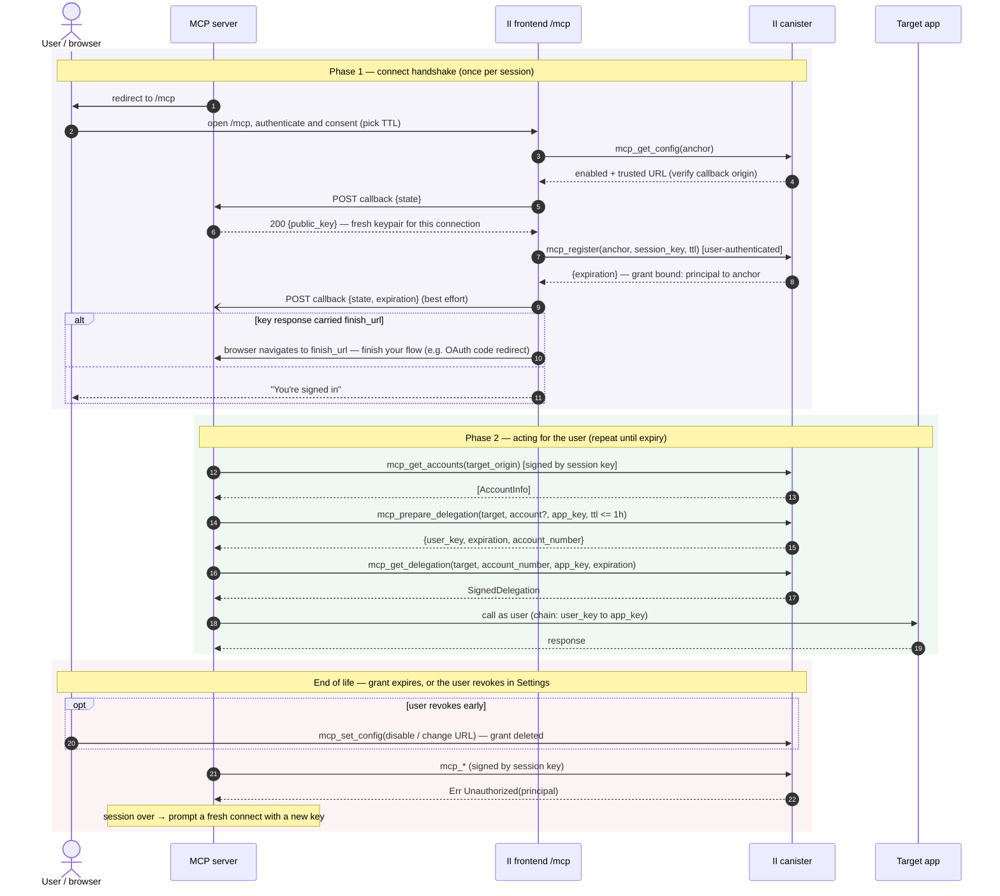

# MCP server guide: connecting to Internet Identity

This documents the protocol an MCP server implements to act on an Internet
Identity user's behalf. The user registers the server's **session key** with
the II canister (a _grant_, up to 30 days, revocable in II Settings at any
time); the server then signs `mcp_*` canister calls with that key — no
delegation chains are delivered or handled. Per-app delegations (up to 1 hour)
are minted on demand through `mcp_prepare_delegation` / `mcp_get_delegation`.

## Lifecycle at a glance



## 1. Connect link

Send the user's browser to:

```
https://<II_ORIGIN>/mcp#callback=<https URL on your origin>&state=<opaque>&ttl=<seconds>
```

- `callback` — an https URL on your origin. The user must have set your origin
  as their trusted MCP server in II Settings (matching is by **origin**).
- `state` — unguessable, single-use, bound server-side to this pending
  connection. Treat a mismatch as a hard reject.
- `ttl` — optional requested grant lifetime in seconds. Default 3600, clamped
  to [600, 2 592 000] (10 min – 30 days). The user can override it in the
  consent UI, so treat it as a suggestion; the authoritative value arrives in
  the completion notification.

No key material travels in the link: II never registers anything taken from
the (attacker-craftable) fragment.

## 2. Callback endpoint

Your callback answers JSON POSTs from the II frontend. Enable CORS: answer
`OPTIONS` preflights and set `Access-Control-Allow-Origin: <II origin>` (or
`*`; no credentials are used), `Access-Control-Allow-Headers: content-type`,
`Access-Control-Allow-Methods: POST`.

**a) Key request** — after user consent, II's frontend asks for your session
public key:

```
POST <callback>            Content-Type: application/json
{"state": "<state>"}
```

Respond:

```
200 {"public_key": "<base64url, unpadded, DER-encoded public key>",
     "finish_url": "<optional: absolute https URL on your origin>"}
```

Generate a **fresh keypair per user-connection** — Ed25519 recommended (e.g.
agent-js `Ed25519KeyIdentity`). The registered principal is
`self_authenticating(DER)`; one principal serves at most one identity, so a
key reused across users makes the second registration fail. An unknown,
already-used, or expired `state` must get a non-2xx response — the connect
flow then errors out and **nothing is registered**.

`finish_url` asks II to hand the connecting tab back to you once the session
is registered (see (c) below). It must be an **absolute https URL on the same
origin as the callback** — anything else fails the connect before anything is
registered. Omit it (`null` and `""` also count as omitted) and the II tab
simply shows its own success screen.

**b) Completion notification** — best effort, after II registers the key
(distinguish from (a) by the `expiration` field):

```
POST <callback>
{"state": "<state>", "expiration": "<grant expiry, ns since epoch, decimal string>"}
```

Respond with any 2xx; mark the connection live and store `expiration` (a
string because u64 nanoseconds overflow JSON numbers). You must tolerate never
receiving this call (e.g. network failure after registration succeeded): fall
back to attempting a signed call — success means you are registered.

**c) Finish redirect** — only if your key response carried `finish_url`:
after registering the session and sending (b), II navigates the connecting
tab to your `finish_url`. Use it to complete a flow of your own around the
connect; without it the II tab finishes on its own and never redirects.

- **Ordering:** II awaits (b) before navigating, so you normally hear about
  the registration first — but (b) is best effort, so the browser can arrive
  without it. Treat arrival at `finish_url` as a UX signal, not as proof of
  registration: verify via (b), or by making a signed `mcp_get_accounts` call
  and checking for the `Ok` variant. (Check the candid result, not the
  transport status: an unregistered key gets `Err Unauthorized(principal)`
  delivered inside a _successful_ query response.)
- Tie the request to the pending connection yourself (e.g. an unguessable id
  in the `finish_url` query — II passes the URL through untouched).

### Serving MCP clients over OAuth

Real-world remote MCP clients (claude.ai, Claude Desktop, Cursor, VS Code,
the MCP Inspector) authenticate per the MCP auth spec: **OAuth 2.1
authorization code + PKCE**, discovered via RFC 9728 protected-resource
metadata and RFC 8414 AS metadata, with RFC 7591 dynamic client registration.
The device grant is not part of that profile — clients won't use it. The II
connect slots into the code flow as your "identity provider" leg, with
`finish_url` closing the loop:

1. `GET /oauth/authorize` — validate `client_id` + exact `redirect_uri`,
   store a pending auth `{code_challenge, state, resource}`, and 302 the
   browser to the II connect link (§1) with a fresh server-side `state`.
2. Your callback (§2a) answers the key request with a fresh keypair **and a
   `finish_url`** carrying the pending-auth id.
3. `GET <finish_url>` — confirm the session registered (see (c)), mint the
   authorization code, and 302 to the client's `redirect_uri` with
   `code` + the client's original `state`.
4. `POST /oauth/token` — exchange code + PKCE verifier for tokens. Issue
   short-lived access tokens plus a refresh token: refresh succeeds while the
   II grant lives, and once it expires or the user revokes (§4) the refresh
   failure makes the client cleanly re-prompt.

Advertise what you actually implement (`authorization_endpoint`,
`response_types_supported: ["code"]`, `grant_types_supported` including
`authorization_code` and `refresh_token`), don't rewrite clients' requested
grant types at registration, persist DCR client registrations across deploys
(clients cache their `client_id`), exempt `/oauth/*` and `/.well-known/*`
from bearer-token middleware, and return proper AS error codes
(`invalid_client`, `invalid_request`) from the authorize endpoint.

### Read-only sessions

At consent the user picks an access level (the connect screen defaults to
**read-only**). II records it on the grant and applies it to _every_ per-app
delegation your session mints: a read-only session's delegations carry
`permissions = "queries"`, so the IC rejects update calls made through them —
enforcement is protocol-level, not up to the target app. You don't choose this
per call and can't widen it; it's fixed for the session's lifetime. If your
server needs to make update calls on the user's behalf, surface that so the
user leaves read-only off. (This is set via the `permissions` argument to
`mcp_register`, which the II frontend fills from the consent screen — your
server never passes it.)

## 3. Calling Internet Identity

Sign directly with the session key (a plain identity, no `DelegationChain`):

```candid
mcp_get_accounts : (target_origin : text)
  -> (variant { Ok : vec AccountInfo; Err : AccountDelegationError }) query;

mcp_prepare_delegation : (
    target_origin : text,
    account_number : opt nat64,   // from mcp_get_accounts; null = default account
    session_key : blob,           // per-app key YOU generate for this target app
    max_ttl : opt nat64           // ns; default and cap: 1 hour
  ) -> (variant { Ok : McpPrepareDelegation; Err : AccountDelegationError });

mcp_get_delegation : (
    target_origin : text,
    account_number : opt nat64,   // echo the value returned by prepare
    session_key : blob,
    expiration : nat64            // echo the value returned by prepare
  ) -> (variant { Ok : SignedDelegation; Err : AccountDelegationError }) query;
```

Per-app delegations are capped at 1 hour and never outlive the grant.

## 4. Session lifecycle

- **One active session per user identity.** A new connect (any agent, any
  device) replaces the previous grant immediately; the old key starts getting
  `Unauthorized`.
- **Expiry:** at the grant's `expiration` every call returns
  `Unauthorized(<your principal>)`. Reconnect via a fresh connect link with a
  fresh keypair.
- **Revocation:** the user can revoke at any time in II Settings (toggling MCP
  off or changing the trusted URL). Indistinguishable from expiry on your
  side. Treat any `Unauthorized` as "session over → offer reconnect"; do not
  retry-loop.
