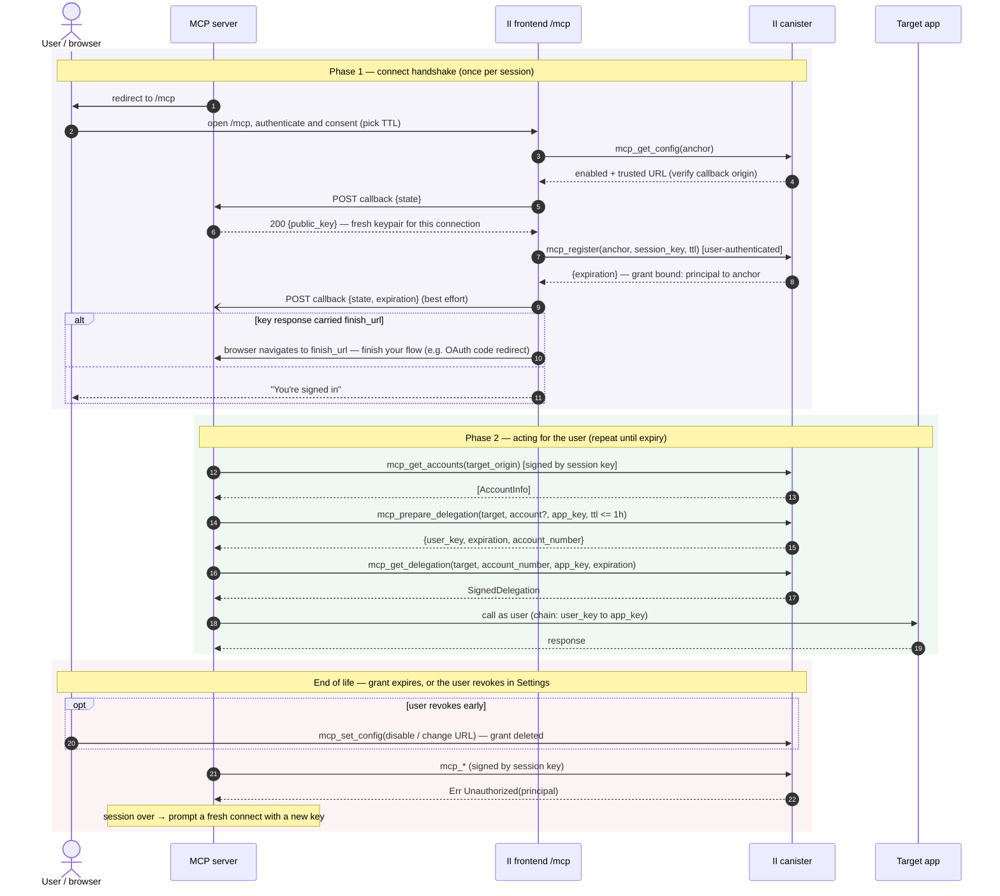

# MCP server guide: connecting to Internet Identity

This documents the protocol an MCP server implements to act on an Internet
Identity user's behalf. The user registers the server's **session key** with
the II canister (a _grant_, up to 30 days, revocable in II Settings at any
time); the server then signs `mcp_*` canister calls with that key — no
delegation chains are delivered or handled. Per-app delegations (up to 1 hour)
are minted on demand through `mcp_prepare_delegation` / `mcp_get_delegation`.

## Lifecycle at a glance



## 1. Connect link

Send the user's browser to:

```
https://<II_ORIGIN>/mcp#callback=<https URL on your origin>&state=<opaque>&ttl=<seconds>
```

- `callback` — an https URL on your origin. The user must have set your origin
  as their trusted MCP server in II Settings (matching is by **origin**).
- `state` — unguessable, single-use, bound server-side to this pending
  connection. Treat a mismatch as a hard reject.
- `ttl` — optional requested grant lifetime in seconds. Default 3600, clamped
  to [600, 2 592 000] (10 min – 30 days). The user can override it in the
  consent UI, so treat it as a suggestion; the authoritative value arrives in
  the completion notification.

No key material travels in the link: II never registers anything taken from
the (attacker-craftable) fragment.

## 2. Callback endpoint

Your callback answers JSON POSTs from the II frontend. Enable CORS: answer
`OPTIONS` preflights and set `Access-Control-Allow-Origin: <II origin>` (or
`*`; no credentials are used), `Access-Control-Allow-Headers: content-type`,
`Access-Control-Allow-Methods: POST`.

**a) Key request** — after user consent, II's frontend asks for your session
public key:

```
POST <callback>            Content-Type: application/json
{"state": "<state>"}
```

Respond:

```
200 {"public_key": "<base64url, unpadded, DER-encoded public key>",
     "finish_url": "<optional: absolute https URL on your origin>"}
```

Generate a **fresh keypair per user-connection** — Ed25519 recommended (e.g.
agent-js `Ed25519KeyIdentity`). The registered principal is
`self_authenticating(DER)`; one principal serves at most one identity, so a
key reused across users makes the second registration fail. An unknown,
already-used, or expired `state` must get a non-2xx response — the connect
flow then errors out and **nothing is registered**.

`finish_url` asks II to hand the connecting tab back to you once the session
is registered (see (c) below). It must be an **absolute https URL on the same
origin as the callback** — anything else fails the connect before anything is
registered. Omit it (`null` and `""` also count as omitted) and the II tab
simply shows its own success screen.

**b) Completion notification** — best effort, after II registers the key
(distinguish from (a) by the `expiration` field):

```
POST <callback>
{"state": "<state>",
 "expiration": "<grant expiry, ns since epoch, decimal string>",
 "permissions": "queries" | "all"}
```

Respond with any 2xx; mark the connection live and store `expiration` (a
string because u64 nanoseconds overflow JSON numbers) and `permissions` (the
session's access level — `"queries"` = read-only, `"all"` = full; see
[Read-only sessions](#read-only-sessions)). You must tolerate never receiving
this call (e.g. network failure after registration succeeded): fall back to
attempting a signed call — success means you are registered — and to reading
the access level off any minted delegation's `permissions` field.

**c) Finish redirect** — only if your key response carried `finish_url`:
after registering the session and sending (b), II navigates the connecting
tab to your `finish_url`. Use it to complete a flow of your own around the
connect; without it the II tab finishes on its own and never redirects.

- **Ordering:** II awaits (b) before navigating, so you normally hear about
  the registration first — but (b) is best effort, so the browser can arrive
  without it. Treat arrival at `finish_url` as a UX signal, not as proof of
  registration: verify via (b), or by making a signed `mcp_get_accounts` call
  and checking for the `Ok` variant. (Check the candid result, not the
  transport status: an unregistered key gets `Err Unauthorized(principal)`
  delivered inside a _successful_ query response.)
- Tie the request to the pending connection via the `finish_url` query — II
  passes the URL through untouched, which is exactly how the one-time
  `finish_secret` reaches `/oauth/finish` (see "Consent-Bound Completion").

### Serving MCP clients over OAuth

Real-world remote MCP clients (claude.ai, Claude Desktop, Cursor, VS Code,
the MCP Inspector) authenticate per the MCP auth spec: **OAuth 2.1
authorization code + PKCE**, discovered via RFC 9728 protected-resource
metadata and RFC 8414 AS metadata, with RFC 7591 dynamic client registration.
The RFC 8628 device grant is **not** part of that profile — no current client
uses it, and it adds a device-code phishing surface with none of the PKCE
binding the rest of the flow relies on, so prefer to omit it. The II connect
slots into the code flow as your "identity provider" leg, with `finish_url`
closing the loop:

1. `GET /oauth/authorize` — validate `client_id` + exact `redirect_uri` +
   PKCE, create a pending auth `{code_challenge, oauth_state, resource}`, set
   an initiator cookie (`sid`, `HttpOnly; Secure; SameSite=Lax`) referencing
   it, and 302 the browser to the II connect link (§1) with a fresh,
   single-use `connect_state` as the link's `state`.
2. Your callback (§2a) answers the key request with a fresh keypair **and a
   `finish_url` carrying a one-time `finish_secret` in its query** (see
   "Consent-Bound Completion" below). Mint the keypair and `finish_secret`
   and mark `connect_state` consumed in one atomic step, on the _first_ POST
   for that `connect_state`; reject any later POST for it.
3. `GET <finish_url>` — mint the authorization code only once the browser
   proves it is both the initiator (the `sid` cookie) and the consenter (the
   matching `finish_secret`), and the session is provably registered (see
   (c)); then 302 to the client's `redirect_uri` with `code` + the client's
   original `state`.
4. `POST /oauth/token` — exchange code + PKCE verifier for a bearer token.
   Bound its lifetime by the grant — never issue a token that outlives the
   grant. Refresh tokens are **optional**: they enable silent renewal but only
   pay off alongside server-side persistence (a restart wipes them too) and add
   no security over the grant, which is the hard, user-revocable ceiling either
   way. Without them the client re-runs the browser flow when the token
   expires; the `error="invalid_token"` challenge (below) lets it prompt inline.

**Consent-Bound Completion: bind the code to whoever actually consented.** The
`connect_state` in the II link travels back to the client in the redirect, and
a cookie alone binds only `authorize`↔`finish` to one browser — neither binds
the code to the browser that performed the II consent. Without that binding a
split-browser takeover remains: an attacker registers a client (open DCR) with
their own `redirect_uri` + PKCE, starts `/oauth/authorize`, lifts the resulting
II connect link, and phishes it to a victim who already trusts your origin —
II's consent screen names only **your server's origin**, never the OAuth
client, so nothing warns the victim. The victim consents (registering _their_
session under the attacker's pending auth); the attacker, still holding the
`sid` cookie, completes `/oauth/finish` and redeems a token for the victim's
identity.

Close it by requiring **two independent proofs** at `/oauth/finish` before
minting a code: the `sid` cookie (proves _initiator_) **and** the
`finish_secret` (proves _consenter_ — it is disclosed only in the key-request
response, which runs in the consenting browser, and rides through to
`/oauth/finish` inside `finish_url`). Because `connect_state` is single-use, the
key request — and thus the `finish_secret` — reaches exactly one browser; only
in the legitimate same-browser flow can one user-agent hold both proofs, so a
code can never be minted for an identity other than the one operating the
initiating client. This rests on II issuing **exactly one key request per
connect and never auto-retrying it**: II drops the link's `state` after parsing
and issues a single, non-retried `fetch`, so a failed connect must restart at
`/oauth/authorize` with a new `connect_state` — never re-drive the same one. Do
not add a client- or server-side retry of the key request.

Two supporting requirements keep the proof intact. Treat the session as
**registered only on proof of an on-chain grant** — a signed `mcp_get_accounts`
returning `Ok` (see (c)), never a bare completion POST, which any
`connect_state`-knower can forge. And keep `finish_secret` **leak-free**: carry
it in the query string (not a path segment), set `Referrer-Policy: no-referrer`
on `/oauth/finish`, and keep it out of logs, metrics, and error bodies.

Consent-Bound Completion closes this for every client transport, including
loopback. It does **not** by itself close the _same-browser_ variant (the
attacker induces the victim's own browser to both initiate and consent) toward
a **hosted** `redirect_uri`; that residual needs hosted-redirect allow-listing.
Loopback/native clients — whose redirect resolves on the consenter's own
machine — are safe either way. (II cannot help with any of this: its trust
model only ever identifies your origin, not the OAuth client.)

Advertise what you actually implement (`authorization_endpoint`,
`response_types_supported: ["code"]`, `grant_types_supported` containing
`authorization_code`, plus `refresh_token` only if you issue them), don't
rewrite clients' requested grant types at registration, persist DCR client
registrations across deploys (clients cache their `client_id`), exempt
`/oauth/*` and `/.well-known/*` from bearer-token middleware, and return proper
AS error codes (`invalid_client`, `invalid_request`) from the authorize
endpoint.

### Read-only sessions

At consent the user picks an access level, and **the connect screen defaults to
read-only** — so unless the user deliberately opts out, you get a read-only
session. II records the level on the grant and applies it to _every_ per-app
delegation your session mints: a read-only session's delegations carry
`permissions = "queries"`, so the IC rejects update calls made through them at
ingress — enforcement is protocol-level, not up to the target app. This
includes **every management-canister call** (create/install/start/stop/
uninstall/delete, and even `canister_status` and cycles reads are update
calls), so that entire class of tools is inert under the default session. You
don't choose this per call and can't widen it; it's fixed for the session.

To know the level up front — rather than discovering it through an opaque
ingress rejection — read the `permissions` field of the completion notification
(§2b): `"queries"` = read-only, `"all"` = full. That POST is best-effort, so if
it never arrives, fall back to inspecting the `permissions` field on the first
`SignedDelegation` you mint (`queries` = read-only, absent = full). Either way,
if your server needs update access and the session is read-only, tell the user
to reconnect with read-only off instead of surfacing raw IC rejections. (You
never pass the level yourself — `mcp_register` takes it as an `opt permissions`
argument the II frontend fills from the consent screen.)

## 3. Calling Internet Identity

Sign directly with the session key (a plain identity, no `DelegationChain`):

```candid
mcp_get_accounts : (target_origin : text)
  -> (variant { Ok : vec AccountInfo; Err : AccountDelegationError }) query;

mcp_prepare_delegation : (
    target_origin : text,
    account_number : opt nat64,   // from mcp_get_accounts; null = the anchor's default there
    session_key : blob,           // per-app key YOU generate for this target app
    max_ttl : opt nat64           // ns; default and cap: 1 hour
  ) -> (variant { Ok : McpPrepareDelegation; Err : AccountDelegationError });

mcp_get_delegation : (
    target_origin : text,
    account_number : opt nat64,   // echo the value returned by prepare
    session_key : blob,
    expiration : nat64            // echo the value returned by prepare
  ) -> (variant { Ok : SignedDelegation; Err : AccountDelegationError }) query;
```

Per-app delegations are capped at 1 hour and never outlive the grant.

`account_number = null` selects the anchor's **current default account** at the
origin (the user can change which account that is; it is not a fixed identity).
Because the default is mutable, `prepare` returns the `account_number` it
actually resolved — echo that exact value into `get`; re-deriving your own would
risk `NoSuchDelegation` if the default changed in between.

### Account principals and `target_origin`

The principal a per-app delegation acts as is derived from `target_origin` — a
**domain**, not an account you name. Pass a bare `https://<host>` (no path,
port, or trailing slash). II applies one internal remap before deriving:
`*.icp0.io` and `*.icp.net` gateway origins fold to the legacy `*.ic0.app` (so a
dapp reached through either gateway gets one stable principal); every other
origin is used as-is. A non-bare origin (with a path/port/trailing slash)
bypasses the remap and derives a _different_ principal, so normalize to the bare
origin yourself.

Because derivation is domain-based, the resulting principal is **not guaranteed
to equal the one the same user gets signing into the app in a browser.** A dapp
can declare a custom _derivation origin_ via
`/.well-known/ii-alternative-origins` — e.g. `app.example.com` deriving
principals as `<canister>.ic0.app`.
A browser honors that; the `mcp_*` methods don't expose it, so from
`target_origin` alone the server derives from the visible domain and lands on a
different principal — `mcp_get_accounts` then shows only the default/empty set,
and delegations act as an identity the user has never used there. If a user says
"this account/balance isn't what I see in my browser," this is the likely cause:
the app uses a custom derivation origin the server can't discover from the
domain. Surface that explanation, and offer to reconcile it — e.g. look up the
app's `ii-alternative-origins` (a web search or a direct fetch) and retry with
the declared derivation origin as `target_origin`. Resolving it automatically is
a planned enhancement, not current behavior.

## 4. Session lifecycle

- **One active session per user identity.** A new connect (any agent, any
  device) replaces the previous grant immediately; the old key starts getting
  `Unauthorized`.
- **Expiry:** at the grant's `expiration` every call returns
  `Unauthorized(<your principal>)`. Reconnect via a fresh connect link with a
  fresh keypair.
- **Revocation:** the user can revoke at any time in II Settings (toggling MCP
  off or changing the trusted URL). Indistinguishable from expiry on your
  side. Treat any `Unauthorized` as "session over → offer reconnect"; do not
  retry-loop.
