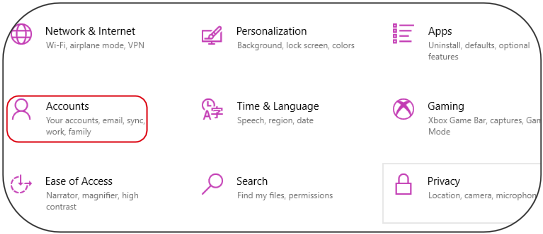
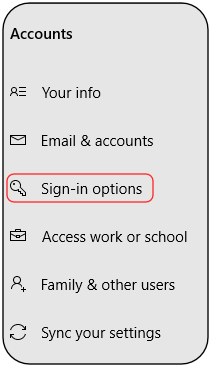
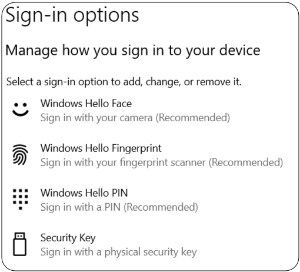
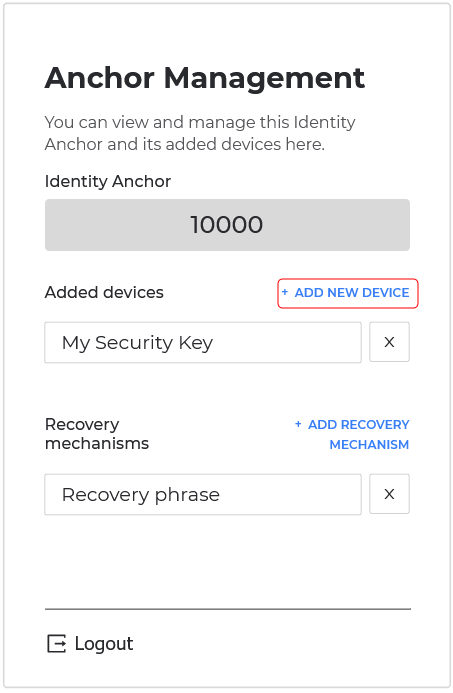
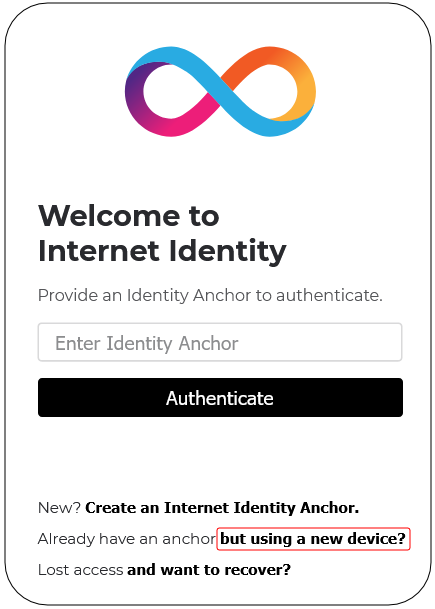
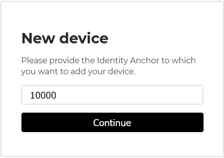
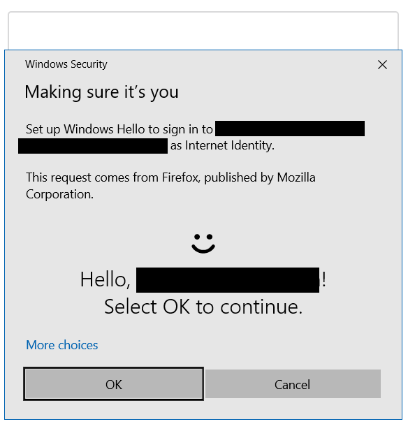
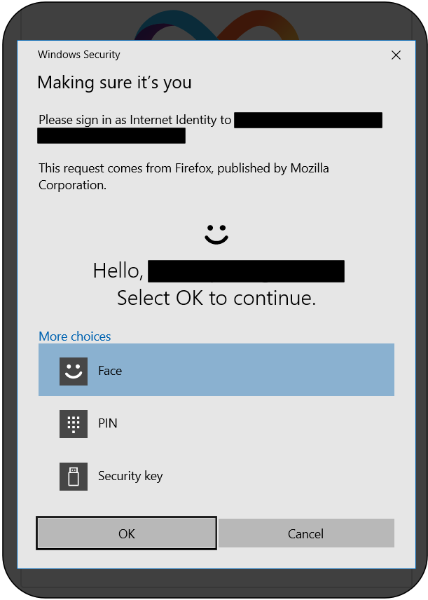
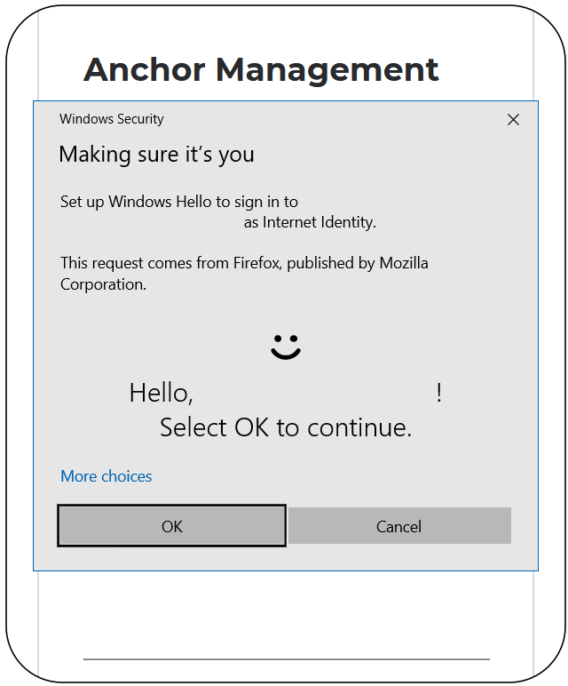
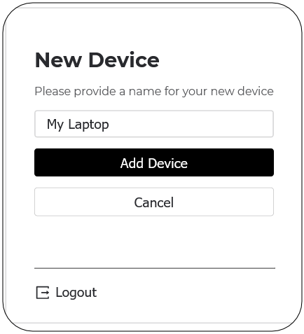

# Windows Hello Guide for Internet Identity

Internet Identity supports Windows Hello as an authentication method. This guide explains how to set up Windows Hello authentication for an existing Identity Anchor that was set up either on your phone or using a security key. The setup is explained below in Options A and B, respectively.

## Checking if your Windows machine supports Windows Hello

Open your Windows Settings, and select "Accounts"

Then select "Sign-in options"

and check your device supports Windows Hello for signing in

If your device supports Windows Hello we can continue. Follow Option A if you've set-up an Identity Anchor using your phone or Option B if you've used a security key.

## Option A: Adding Windows Hello to an Identity Anchor that uses your phone as authentication method

On your phone go to <https://identity.ic0.app> and log in

Select "Remote Device"

image::hello-guide/add-remote-device.png[]

Now switch to your Windows computer and go to <https://identity.ic0.app> and click on "Already have an Anchor but using a new device?"

Enter your Identity Anchor

Enter a name for the Windows device

image::hello-guide/enter-alias.png[]

Complete the Windows Hello dialog by authenticating using Windows Hello

A verification code will be displayed

image::hello-guide/display-verification-code.png[]

Switch back to your phone and enter the verification code

image::hello-guide/enter-verifiction-code.png[]

After verifying the Windows computer on your phone you should be able to authenticate on your Windows machine using Windows Hello

## Option B: Adding Windows Hello to an Identity Anchor that uses your security key as authentication method

On your Windows computer go to <https://identity.ic0.app> and authenticate using your security key to reach the Anchor Management page. Once you're there click on "+ ADD NEW DEVICE".

Select "Local Device"

image::hello-guide/add-local-device.png[]

Complete the Windows Hello dialog

and choose a name for your Windows machine

If you refresh the page, you should now be able to authenticate with Windows Hello

