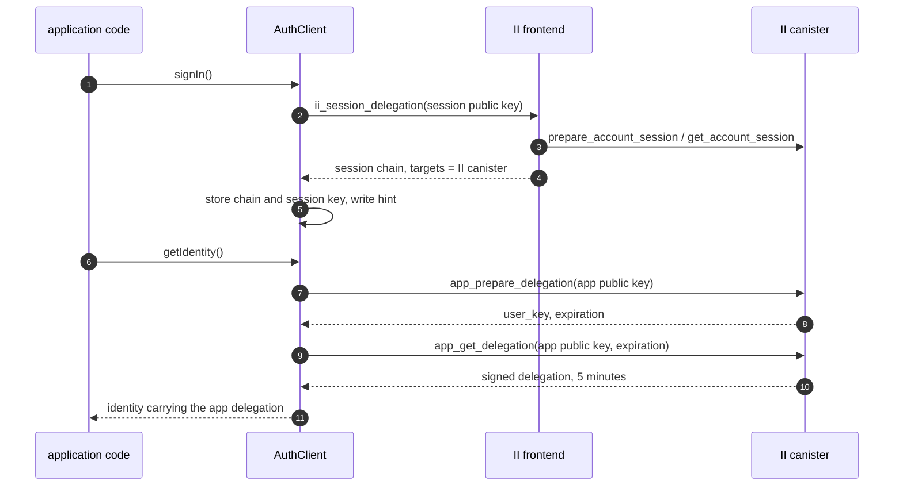

# App sessions in the client library: specification

**Design:** [client-app-sessions.md](client-app-sessions.md) covers what this builds and why. This document assumes it and does not repeat it.

**Depends on:** [revocable-app-sessions-spec.md](revocable-app-sessions-spec.md) for the session record, the chain that authenticates a call as that session, and the account principal a ceremony returns.

## Constants

| Value                   | Where it comes from                               | Setting                                      |
| ----------------------- | ------------------------------------------------- | -------------------------------------------- |
| App delegation lifetime | `APP_DELEGATION_TTL_NS`, enforced by the canister | 5 minutes, not requestable                   |
| Session lifetime        | chosen at consent, clamped by the canister        | 10 minutes to 30 days                        |
| Re-mint margin          | this library                                      | 30 seconds before the app delegation expires |

The margin is 30 seconds because a delegation handed to a caller has to outlive the request it is about to be used for, and because anything much larger spends a noticeable fraction of a five-minute delegation not using it.

## Sequence

## Acquiring a session

**ACQ-1.**
`signIn()` requests a session with `ii_session_delegation` when the provider's scopes include that method.

**ACQ-2.**
The request carries a session public key and, where the application configured one, a derivation origin. It carries no access level and no lifetime, both of which the user decides at consent.

**ACQ-3.**
The returned chain is rejected unless its `targets` name the II canister and nothing else. A chain without that restriction is not a session chain, and treating one as a session would give the library something it could sign arbitrary calls with.

**ACQ-4.**
The session chain is persisted through `DelegationStorage`.

**ACQ-5.**
The app delegation is never persisted, by any path.

## Keys

**KEY-1.**
The session key is persisted through `IdentityStorage`, so it is the key that survives a reload and it inherits whatever non-extractable backing the configured store provides.

**KEY-2.**
The app key is generated per `AuthClient` instance and held in memory only. A reload therefore mints against a fresh app key, which costs one round trip and leaves nothing on disk that can sign for the app.

**KEY-3.**
No public export returns the session key, the session chain, or a handle from which either can be recovered.

## Minting an app delegation

**MINT-1.**
`getIdentity()` resolves to an identity carrying an app delegation minted from the session.

**MINT-2.**
A delegation whose remaining lifetime is below the re-mint margin is replaced before it is handed to a caller.

**MINT-3.**
At most one mint is in flight. Callers arriving while one is running await that one rather than starting another.

**MINT-4.**
`app_get_delegation` is called with the exact `expiration` that `app_prepare_delegation` returned. A mismatch is a failed mint, not a retry with a different value.

**MINT-5.**
A mint that fails leaves the stored session chain and session key exactly as they were, except where ERR-1 applies.

## Failure

**ERR-1.**
`NoMatchingSession` is terminal. The library discards the session chain, the session key and the hint, notifies subscribers, and reports the user as not authenticated.

**ERR-2.**
`InternalCanisterError`, a transport failure, and an unreachable boundary node are transient. The library retains the session, propagates the failure to the caller, and does not report a sign-out.

**ERR-3.**
`check_session` returning `false` is treated as ERR-1. It exists so the library can reach that conclusion without minting, for instance when deciding on load whether a stored chain is worth keeping.

**ERR-4.**
No failure path leaves a session chain stored without its key, or a key without its chain.

## The cross-subdomain hint

**HINT-1.**
The hint cookie carries the signed-in principal and the **session's** expiry.

**HINT-2.**
The hint is written when a session is acquired and removed when one is discarded, whether by sign-out or by ERR-1.

**HINT-3.**
Minting does not write the hint. An app delegation's expiry is five minutes away and says nothing about whether a sibling has a session to re-issue from.

## Signing out

**END-1.**
`signOut()` calls `app_revoke_session` before clearing local state.

**END-2.**
Local state is cleared whether or not that call succeeded. A user who pressed sign out must not remain signed in on the device in front of them.

**END-3.**
`app_revoke_session` returns nothing and always succeeds, so there is no error to surface and a repeated sign-out needs no special case.

## Providers without session support

**COMPAT-1.**
Where the provider's scopes do not include `ii_session_delegation`, `signIn()` uses `icrc34_delegation`.

**COMPAT-2.**
The fallback path behaves as the library does today, including what it stores and what `isAuthenticated()` reports.

**COMPAT-3.**
An application cannot select between the two paths. Which one runs is a property of the provider, not a configuration option.

## Public surface

**API-1.**
`signIn()`, `getIdentity()`, `signOut()`, `isAuthenticated()` and `subscribe()` keep their current signatures. Sessions add no public type, option or method.

**API-2.**
`isAuthenticated()` reports whether a session is held and unexpired, not whether an app delegation is currently valid. A held session with a lapsed delegation is authenticated, because the next call mints.
