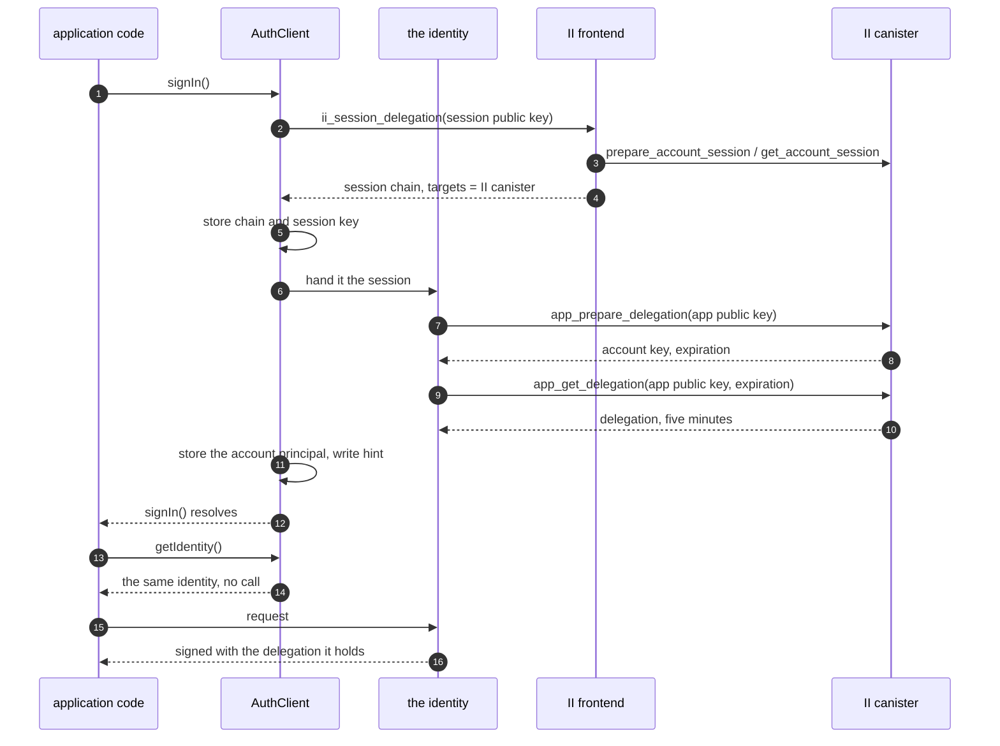
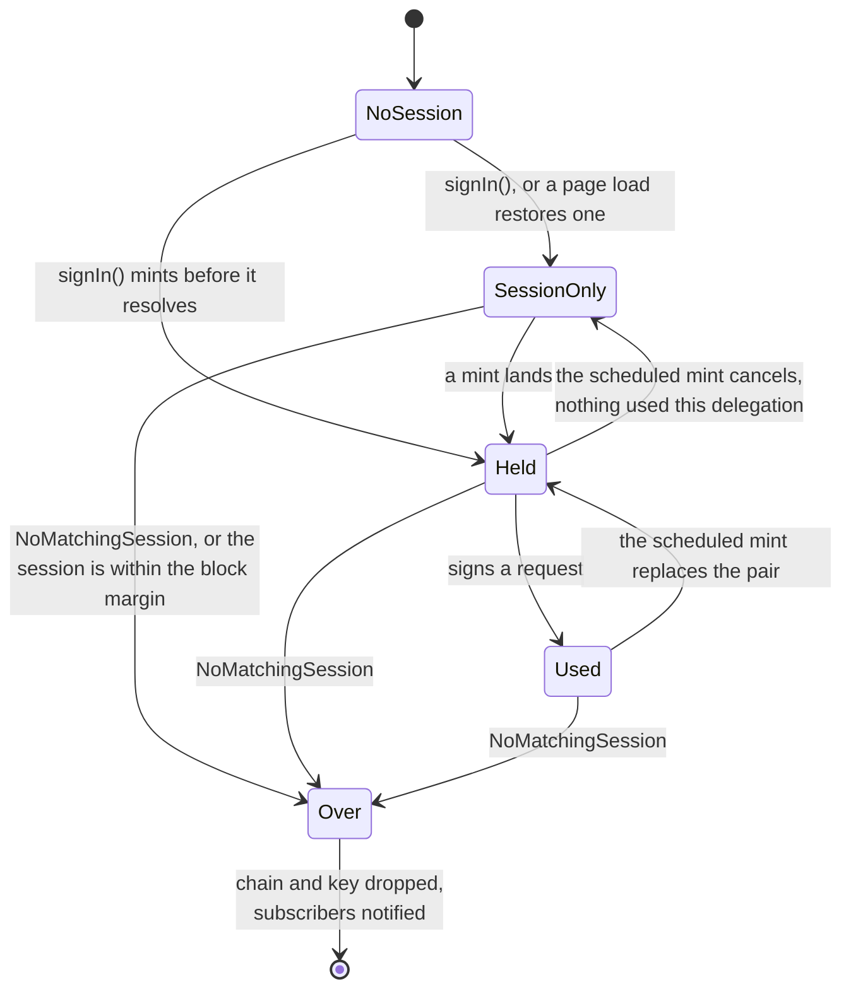
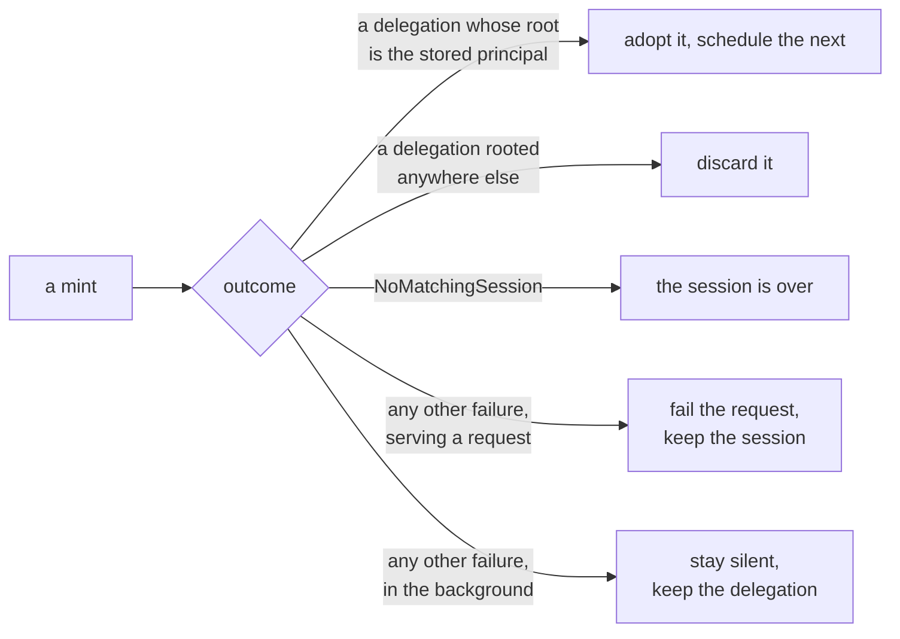

# App sessions in the client library: specification

**Design:** [client-app-sessions.md](client-app-sessions.md) covers what this builds and why. This document assumes it and does not repeat it.

**Depends on:** [revocable-app-sessions-spec.md](revocable-app-sessions-spec.md) for the session record, the chain that authenticates a call as that session, and the account principal a ceremony returns.

## Constants

| Constant                | Value                      | Set by                                             |
| ----------------------- | -------------------------- | -------------------------------------------------- |
| App delegation lifetime | 5 minutes, not requestable | `APP_DELEGATION_TTL_NS`, enforced by the canister  |
| Session lifetime        | 10 minutes to 30 days      | requested as a ceiling, chosen at consent, clamped |
| Block margin            | 10 seconds                 | this library                                       |
| Pre-mint threshold      | 15 seconds                 | this library                                       |
| Inherit window          | 200 milliseconds           | this library                                       |

These names are the identifiers the rest of the document uses, and no requirement
below restates a value. Four more are fixed strings rather than durations, and a
requirement that cannot be audited without them says so here:

| Name                   | Value                                                            | Used by |
| ---------------------- | ---------------------------------------------------------------- | ------- |
| Session channel        | `ic-session-sync`                                                | TAB-1   |
| Mint lock              | `ic-session-mint`                                                | TAB-7   |
| Default authorize URL  | `https://id.ai/authorize`                                        | AGENT-2 |
| Default II canister id | `rdmx6-jaaaa-aaaaa-aaadq-cai`                                    | AGENT-2 |
| Hint cookie name       | `ic-delegation`, `Path=/`, `SameSite=Lax`, `Secure` off loopback | HINT-1  |

The block margin covers a request's flight time, because the delegation has to still be valid when the replica verifies the request it was attached to.

The pre-mint threshold covers one mint and nothing else, because a refresh is scheduled for the moment it is needed rather than waiting for a request to arrive inside a window. Minting before a delegation expires discards the rest of its life, so an active session consumes lifetime at `TTL / (TTL - threshold)`: at 15 seconds it refreshes about every four and three quarter minutes against a floor of five. A threshold wide enough to catch a passing request would have to be several times larger, and every second of it becomes update calls and stable writes on every active session for as long as it lives.

## Sequence

`getIdentity()` makes no call and returns the same object every time. The mint at sign-in is step 7 onwards, and after that the identity replaces its own delegation on the schedule and the request paths of the section below. An application that calls `getIdentity()` a thousand times mints nothing; one that makes a thousand requests over an hour mints about twelve times.

## Acquiring a session

**ACQ-1.**
`signIn()` requests a session with `ii_session_delegation`. Nothing checks first whether the provider offers it: this library is for Internet Identity, and a provider that cannot answer is a failed sign-in rather than a case to fall back from.

**ACQ-2.**
The request carries a session public key, a `maxTimeToLive` where the application sets one, and a derivation origin where it configured one. It carries no access level, which is the user's alone to decide at consent.

**ACQ-3.**
`maxTimeToLive` is sent as the requested ceiling where an application set one. What is granted is decided by the canister, within the session lifetime above. An application asking for less than the minimum therefore gets the minimum, and one asking for more than it is offered gets what it is offered.

**ACQ-4.**
The returned chain is rejected unless its `targets` name the configured II canister and nothing else, per AGENT-5. A chain without that restriction is not a session chain, and treating one as a session would give the library something it could sign arbitrary calls with. Acquisition mints before it resolves, so the check runs there too.

**ACQ-5.**
The session is persisted through `SessionStorage`, which holds the chain and the account key together as one record.

**ACQ-6.**
The app delegation is never persisted, by any path.

**ACQ-7.**
The account key is part of the stored session, not a second thing stored beside it. It is not derivable from the chain, which is rooted at the session's own key, and the transport result carries only the chain, so it is taken from the `user_key` of the first mint, which MINT-12 makes part of signing in.

## Keys

Five things are held, and the requirements below say so one at a time. Together
they are:

| Thing          | Where                                     | Lifetime       | Requirement    |
| -------------- | ----------------------------------------- | -------------- | -------------- |
| Session chain  | `SessionStorage`                          | the session    | ACQ-5, KEY-4   |
| Account key    | `SessionStorage`, in the same record      | the session    | ACQ-7, MINT-17 |
| Session key    | `IdentityStorage`                         | the session    | KEY-1, KEY-4   |
| App key        | memory, and the channel within one origin | one delegation | KEY-2, TAB-1   |
| App delegation | memory, and the channel within one origin | one delegation | ACQ-6, TAB-1   |

**KEY-1.**
The session key is persisted through `IdentityStorage`, so it is the key that survives a reload and it inherits whatever non-extractable backing the configured store provides.

**KEY-2.**
The app key is held in memory, never persisted, and generated by the mint that gets a delegation for it. A key and its delegation are one thing with one lifetime: five minutes, after which both are replaced, because a key that outlives its delegation carries no authority. Rotation therefore falls out of refreshing rather than needing a rule of its own.

It is a non-extractable key rather than one whose private bytes are readable, because it crosses a channel to other tabs and should arrive as something that signs and cannot be copied.

**KEY-3.**
Replacing the pair does not disturb a request already in flight, because a request is signed and its delegation attached in the same act.

**KEY-4.**
No public export returns the session key, the session chain, or a handle from which either can be recovered.

## Minting an app delegation

A request arriving finds one of four situations:

| Life left in the held delegation        | Served from         | Mint       | Requirement |
| --------------------------------------- | ------------------- | ---------- | ----------- |
| more than the pre-mint threshold        | the held delegation | none       | MINT-1      |
| within the threshold, above the margin  | the held delegation | background | MINT-6      |
| within the block margin, or none held   | the mint's result   | blocking   | MINT-3      |
| the session itself is within the margin | nothing             | none       | MINT-11     |

What an identity can be doing at any moment is a small machine, and the middle
state is a legitimate resting place rather than an exception: a restored page load
sits there, answering for its principal, until something needs a delegation.

Whatever reached it, a mint ends one of five ways:

Sign-in and a restored session reach a mint directly, without the questions above. No mint starts at all while the session itself has less than the block margin left, and if one is already running an arrival joins it rather than starting a second.

**MINT-1.**
`getIdentity()` resolves to an identity that obtains an app delegation when one is needed. It does not promise to be holding one: signing in leaves it with the delegation minted during the ceremony, while a session restored on a page load starts with none and mints on its first request.

**MINT-2.**
Before a delegation is held, the identity still answers for its principal, since that comes from the stored account key rather than from a delegation. Its delegation chain reports the account key and no delegations, which is what "no authority yet" looks like rather than a chain that could be presented.

**MINT-3.**
A request arriving when the held delegation has less than the block margin left, or when none is held, waits for a mint.

**MINT-4.**
Adopting a delegation schedules one mint for the moment that delegation reaches the pre-mint threshold. It is a single scheduled refresh of a known delegation, not a recurring one.

**MINT-5.**
A scheduled mint cancels unless the delegation it is replacing signed at least one request. Signing a request is the only thing that counts as use, and the question is asked of each delegation separately, so one request does not buy a chain of refreshes.

**MINT-6.**
A request arriving when the held delegation has less than the pre-mint threshold and at least the block margin left is served from the delegation already held and starts a mint in the background. This is the guarantee behind the schedule, which is best effort: browsers throttle timers in hidden tabs and fire them late after a machine has slept.

**MINT-7.**
A mint starts in the background when the page becomes visible or the window regains focus. The identity decides whether one is due, on the same terms as any other trigger, so a foreground with plenty of life left in the delegation costs nothing: the trigger says the moment is a good one, the identity says whether to act.

The events are `visibilitychange` filtered on a visible state, `pageshow`, and `focus`. `focus` is there because two visible windows side by side do not change visibility when the user moves between them, and `pageshow` because a page restored from the back-forward cache resumes with timers that never ran.

This is what covers a throttled schedule, which is ordinary rather than exotic. A backgrounded tab has its timers throttled and its delegation lapses, so without it the user's first click after returning waits for a mint. Returning to a tab is a second or two of human latency ahead of that click, which is enough to hide one.

**MINT-8.**
The identity holds no reference to a DOM. `AuthClient` calls a refresh entry point on it, and the listening lives in a separable piece that is constructed only where those APIs exist, in the way idle detection already is. An environment without a DOM constructs nothing, hooks nothing, and neither warns nor throws.

`CookieSessionStorage` reads the same events inline, and is not the model to follow: a cookie store is browser-only by definition, so it may assume what it needs. Refresh has to work in Node and anywhere else `AuthClient` runs, so its environment-specific part is isolated rather than assumed.

Where there is no DOM, the schedule of MINT-4 and the request paths of MINT-3 and MINT-6 are the whole mechanism. Nothing is incorrect without this trigger; a request after a long gap simply waits for its mint.

The trigger is on by default and turned off with `disableForegroundRefresh`, following `disableIdle` for a behaviour enabled unless an application opts out. Its listeners are released by `dispose()`.

**MINT-9.**
At most one mint is in flight. Callers arriving while one is running await that one rather than starting another, and a request that has to wait joins a background mint already running rather than starting a second.

**MINT-10.**
`app_get_delegation` is called with the exact `expiration` that `app_prepare_delegation` returned. A mismatch is a failed mint, not a retry with a different value.

**MINT-11.**
No mint is started when the session itself has less than the block margin left. A delegation is minted for `min(5 minutes, what remains of the session)`, so a mint against a nearly finished session returns one already too short to satisfy MINT-3, and refreshing on the delegation's remaining life alone would mint without end. Such a session is over and is treated as ERR-1.

**MINT-12.**
`signIn()` mints before it resolves, so the first request after signing in does not wait. The cost is hidden inside a ceremony the user is already waiting for.

**MINT-13.**
A page load that restores a stored session starts a mint in the background. `getIdentity()` does not wait for it.

**MINT-14.**
No recurring timer or interval triggers a mint, and no mint happens for a delegation nothing used. Adopting a delegation arms one refresh, and MINT-5 confirms that delegation was used before the refresh fires, which is what keeps the session's last-refreshed stamp a record of use rather than of an open tab.

**MINT-15.**
A mint that fails leaves the stored session chain and session key exactly as they were, except where ERR-1 applies.

**MINT-16.**
The principal a caller sees does not change when a delegation is replaced. `app_prepare_delegation` roots every delegation at the account's key, so successive mints agree. A mint whose `user_key` does not match the stored account principal is a failed mint, and its delegation is not adopted.

**MINT-17.**
`getPrincipal()` never triggers a mint. It is answered from the account principal persisted by ACQ-5, which is why the background mint of MINT-13 does not have to complete before a restored session can report who is signed in.

## Failure

**ERR-1.**
`NoMatchingSession` is terminal for the chain in hand. The library discards the session chain and the session key for this origin, notifies subscribers, and reports the user as not authenticated. It does not remove the shared hint: see HINT-4.

**ERR-2.**
`InternalCanisterError`, a transport failure, and an unreachable boundary node are transient. The library retains the session, propagates the failure to the caller, and does not report a sign-out.

**ERR-3.**
No failure path leaves a session chain stored without its key, or a key without its chain.

**ERR-4.**
A background mint that fails transiently is not surfaced to the application and does not report a sign-out. The delegation already held stays in use, and the next request retries, waiting if MINT-3 applies by then.

**ERR-5.**
`NoMatchingSession` from a background mint is terminal exactly as in the foreground. It means the session is gone, and which mint discovered that does not change what is true.

## The cross-subdomain hint

**HINT-1.**
The hint cookie carries the signed-in principal and the **session's** expiry.

**HINT-2.**
The hint is written when a session is acquired.

**HINT-3.**
The hint is removed by signing out, and by nothing else. Storage exposes the removal of a local session separately from the removal of the shared hint, because they are different acts: a user ending a sign-in, and an origin finding out that the chain it held is stale.

**HINT-4.**
Discovering a stale chain removes the local session only. One session serves every sibling of a domain, so a sibling that did not sign in holds a chain to a session a ceremony elsewhere replaced, and removing the hint would tell the sibling that did sign in that the session it just obtained is gone.

**HINT-5.**
A hint may outlive the session it describes, after a revocation from settings for instance. It is a hint, so a sibling acting on one has to be able to fall back to asking the user, and may not treat it as authority to skip that path.

**HINT-6.**
Minting does not write the hint. An app delegation's expiry is five minutes away and says nothing about whether a sibling has a session to re-issue from.

## Signing out

**END-1.**
`signOut()` calls `app_revoke_session` before clearing local state.

**END-2.**
Local state is cleared whether or not that call succeeded.

**END-3.**
`signOut()` surfaces no error from the revoke call, and a repeated sign-out needs no special case.

## Sharing one delegation across tabs

**TAB-1.**
A key and the delegation minted for it are shared between tabs of an origin over a `BroadcastChannel`, as one pair, because that is what a mint produces and what expires together. Neither is persisted. A non-extractable key crosses a structured clone as a handle that signs and cannot be exported, so what a tab receives is usable without key material having left the origin.

**TAB-2.**
The channel reaches the tabs of one origin and no further, so the floor is one mint per active origin rather than one per domain. A delegation minted for a sibling subdomain authorises nothing here.

**TAB-3.**
Coordination may only suppress a mint, never be required for one. Every tab schedules its refresh as it would if it were alone, and with every message lost each tab mints.

**TAB-4.**
A tab with no pair asks on the channel and adopts the pair it is offered, and mints one only when no answer arrives within the inherit window.

**TAB-5.**
Tabs that end up with a pair each converge at the next mint, without anything electing a winner: one pair is produced, its broadcast reaches every tab, and every tab adopts it. Divergence therefore costs an extra mint or two and lasts at most one delegation's lifetime. Sharing a key alone would instead have left an origin minting once per tab for as long as those tabs lived.

**TAB-6.**
A tab adopts an offered delegation only when its root is the stored account principal and it delegates to the key offered alongside it. A mismatched pair is discarded rather than used, so a mistake surfaces where it was made.

**TAB-7.**
A mint runs while holding a named lock, where the environment provides one. Tabs that wake in the same moment queue on it rather than each starting a mint, which is what removes the double-mint window rather than narrowing it, and no wake-up needs to be spread out to avoid a collision.

**TAB-8.**
A tab holding the lock re-reads what it has before minting, and does nothing when a delegation minted elsewhere has arrived in the meantime.

**TAB-9.**
Liveness rests on the lock rather than on a timeout. A browser releases a lock when the context holding it goes away, so a tab closed mid-mint lets the next in the queue proceed, and nothing has to decide how long a tab that is not coming back should be waited for.

**TAB-10.**
Where the environment has no such lock, every tab mints. The lock may be relied on for what this costs, never for whether it works.

**TAB-11.**
A request that finds no usable delegation queues on the same lock rather than jumping it.

**TAB-12.**
Adopting a delegation, however it arrived, reschedules that tab's refresh from the adopted delegation's expiry, so tabs do not drift onto separate clocks.

## Reaching the II canister

**AGENT-1.**
The identity provider is configured as two values: the authorize URL a ceremony is rendered at, and the canister id that mints and revokes. They are not the same address, because a custom domain may front the mainnet canister and a local deployment changes both.

**AGENT-2.**
Each half has its own default, the mainnet authorize URL and the mainnet II canister id, so an application deploying against mainnet configures neither.

**AGENT-3.**
Options for the agent that makes the mint and revoke calls are passed through to it unchanged, except that the identity is set by the library, last, so no option can replace the session the calls are made as. Where no agent options are given the agent applies its own defaults, which reach mainnet.

**AGENT-4.**
Nothing about the calls is derived from the authorize URL. Its origin is not used as a host, and whether it is loopback decides nothing.

**AGENT-5.**
Before the first call, a session chain is refused unless its `targets` name the configured canister id and nothing else, with an error naming both sides. A chain naming no targets is refused too, and that is the case worth refusing hardest, because the session key signs with that chain and accepting one would leave the library holding a credential good for any call. This is a check rather than a source, since the canister id comes from AGENT-1.

## Public surface

**API-1.**
`signIn()`, `getIdentity()`, `signOut()`, `isAuthenticated()` and `subscribe()` keep their current signatures, and no session type, session chain or session expiry is exposed through any of them. Three options change:

| Option                     | Change                                                                            | Requirement      |
| -------------------------- | --------------------------------------------------------------------------------- | ---------------- |
| `identityProvider`         | **breaking**: a URL becomes an object carrying an authorize URL and a canister id | AGENT-1, AGENT-2 |
| `agentOptions`             | new; passed to the agent that makes the calls                                     | AGENT-3          |
| `disableForegroundRefresh` | new; about when the library refreshes rather than about sessions                  | MINT-8           |

`identityProvider` is the only breaking change in the public surface.

**API-2.**
`isAuthenticated()` reports whether a session is held and unexpired, not whether an app delegation is currently valid. A held session with a lapsed delegation is authenticated, because the next call mints. It stays synchronous, reading the stored session and nothing else, so a page load answers without a mint, a network call or an asynchronous store.

**API-3.**
`isAuthenticated()` is optimistic about revocation, and this is a change in kind rather than degree. It answers from what the client stored, so a session revoked at the canister or from another browser still reads as authenticated until something mints and is told otherwise, at which point the stored session is dropped and subscribers are notified. Before sessions the answer could only go stale by expiry, which a client could compute; now it can go stale because someone acted. An application that must not act on a stale answer should make a call and handle its failure, which is the only thing that consults the canister.

**API-4.**
`getIdentity()` performs no canister call and returns the same identity for the life of the session, including across the pair being replaced. The identity reaches whatever pair is current rather than holding one, so a rotation changes nothing an application can observe.
