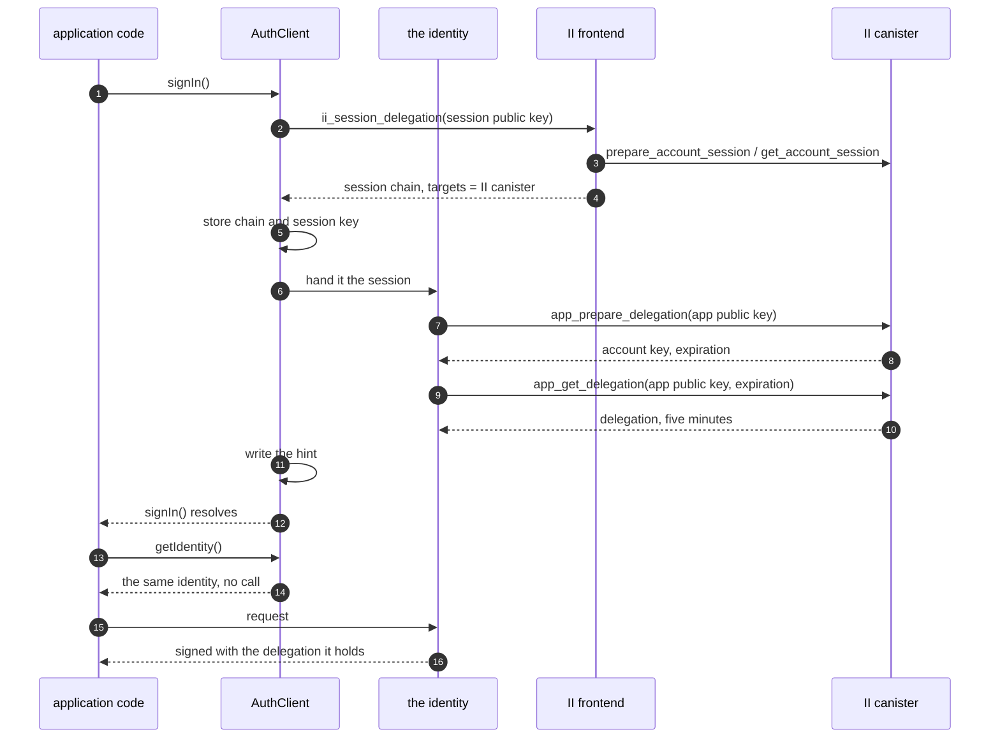
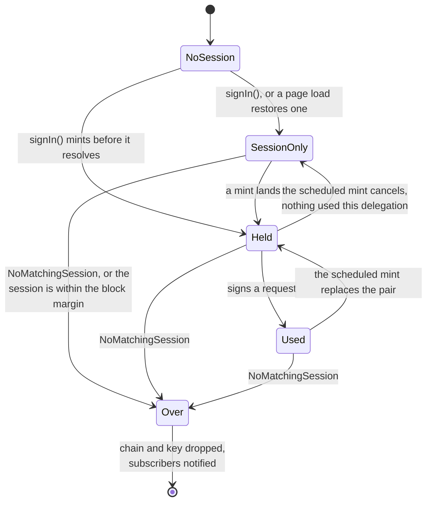
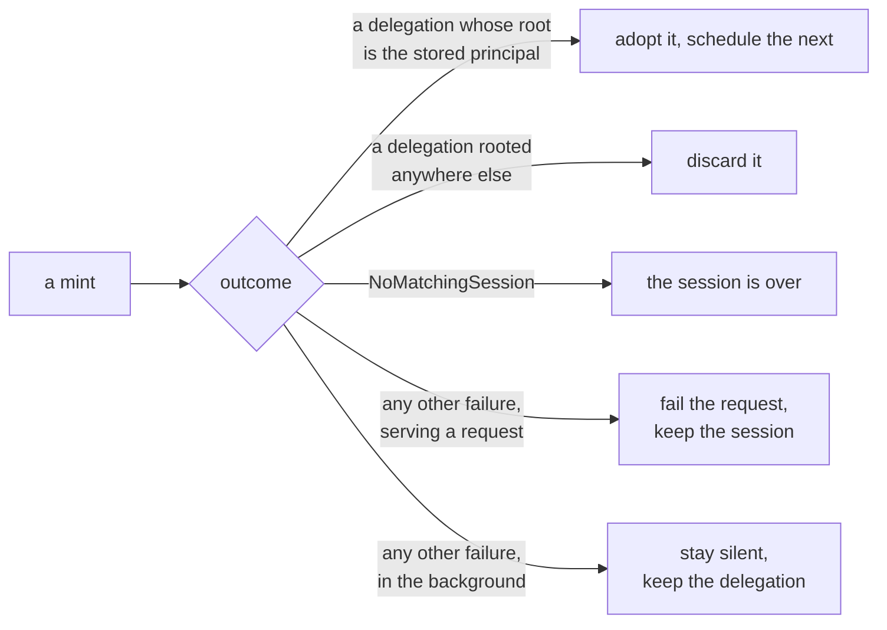

# App sessions in the client library: specification

**Design:** [client-app-sessions.md](client-app-sessions.md) covers what this builds and why. This document assumes it and does not repeat it.

**Depends on:** [revocable-app-sessions-spec.md](revocable-app-sessions-spec.md) for the session record, the chain that authenticates a call as that session, and the account principal a ceremony returns.

## Constants

| Constant                | Value                      | Set by                                             |
| ----------------------- | -------------------------- | -------------------------------------------------- |
| App delegation lifetime | 5 minutes, not requestable | `APP_DELEGATION_TTL_NS`, enforced by the canister  |
| Session lifetime        | 10 minutes to 30 days      | requested as a ceiling, chosen at consent, clamped |
| Block margin            | 10 seconds                 | this library                                       |
| Pre-mint threshold      | 15 seconds                 | this library                                       |

The rest of the document uses these names and restates no value. Four more are fixed strings:

| Name                   | Value                                                                                                                                         | Used by  |
| ---------------------- | --------------------------------------------------------------------------------------------------------------------------------------------- | -------- |
| Slots                  | `session-identity`, `session-delegation`, `app-identity`, `app-delegation`, each prefixed by the namespace where one is set                   | STORE-3  |
| Mint lock              | the `app-identity` slot                                                                                                                       | STORE-10 |
| Default authorize URL  | `https://id.ai/authorize`                                                                                                                     | AGENT-2  |
| Default II canister id | `rdmx6-jaaaa-aaaaa-aaadq-cai`                                                                                                                 | AGENT-2  |
| Hint cookie            | named from the namespace, `Path=/`, `Domain=<the configured domain>`, `SameSite=Lax`, `Max-Age` to the session's expiry, `Secure` on `https:` | HINT-2   |

The block margin covers a request's flight time.

The pre-mint threshold covers one mint and nothing else. At 15 seconds an active session refreshes about every four and three quarter minutes against a floor of five. The design gives the arithmetic and the reason the threshold is not wider.

## Sequence

`getIdentity()` makes no call and returns the same object every time. The mint at sign-in is step 7 onwards, and after that the identity replaces its own delegation on the schedule and the request paths of the section below.

## Acquiring a session

**ACQ-1.**
`signIn()` requests a session with `ii_session_delegation`. Nothing checks first whether the provider offers it: this library is for Internet Identity, and a provider that cannot answer is a failed sign-in rather than a case to fall back from.

**ACQ-2.**
The request carries a session public key, a `maxTimeToLive` where the application sets one, and a derivation origin where it configured one. It carries no access level, which is the user's alone to decide at consent.

**ACQ-3.**
`maxTimeToLive` is sent as the requested ceiling where an application set one. What is granted is decided by the canister, within the session lifetime above. An application asking for less than the minimum therefore gets the minimum, and one asking for more than it is offered gets what it is offered.

**ACQ-4.**
The returned chain is rejected unless its `targets` name the configured II canister and nothing else, per AGENT-5. A chain without that restriction is not a session chain, and treating one as a session would give the library something it could sign arbitrary calls with. Acquisition mints before it resolves, so the check runs there too.

**ACQ-5.**
The session chain is persisted through its `DelegationStorage`, which holds the chain and nothing beside it.

**ACQ-6.**
The app delegation is persisted only through the shared pair TAB-1 describes, and only under the conditions TAB-5 and TAB-6 impose on reading one back. No other path stores it.

**ACQ-7.**
The account principal is not a stored field. It is the root of the app delegation, arriving as the `user_key` of a mint, which is why TAB-5 keeps a spent chain rather than deleting it and why the session record carries nothing beyond its own chain. It is not derivable from the session chain, which is rooted at the session's own key, and the transport result carries only that chain. Before the first mint there is none, which MINT-12 puts out of reach by minting inside the ceremony.

## Keys

Four things are held, in two credentials of the same shape. A credential is an identity and the delegation that authorises it, so each has an `IdentityStorage` and a `DelegationStorage`, and nothing rides beside either.

| Thing          | Slot                 | Held in                           | Lifetime                                             | Requirement  |
| -------------- | -------------------- | --------------------------------- | ---------------------------------------------------- | ------------ |
| Session key    | `session-identity`   | the session's `IdentityStorage`   | the session                                          | KEY-1, KEY-4 |
| Session chain  | `session-delegation` | the session's `DelegationStorage` | the session                                          | ACQ-5, KEY-4 |
| App key        | `app-identity`       | the app's `IdentityStorage`       | one delegation                                       | KEY-2, TAB-1 |
| App delegation | `app-delegation`     | the app's `DelegationStorage`     | one delegation, kept past it as the account's record | ACQ-6, TAB-5 |

**STORE-1.**
Two credentials are held, and each is an identity and the delegation authorising it. So storage is two interfaces — `IdentityStorage` for a `SignIdentity`, asynchronous because a non-extractable key needs a store that can hold one, and `DelegationStorage` for a `DelegationChain`, synchronous because a chain is not a secret — and each is supplied twice.

**STORE-2.**
An application supplies four leaves, as two pairs: a `session` pair and an `app` pair, each an `IdentityStorage` and a `DelegationStorage`. Nothing composes them. What a composite would have owned — the slot each half is written under, the refusals of TAB-5 and TAB-6, and whether a lock is taken — belongs to `AuthClient` and to the identity it hands out, because a leaf is the part an application may reasonably want to replace and the sequence around it is not. An application cannot supply a store that skips a refusal, since there is no such object to supply.

**STORE-3.**
Slots are assigned by `AuthClient` and never defaulted by a leaf, so a leaf takes the slot as an argument to every call. Four implementations each choosing their own default is what produced three colliding slots in the version this replaces, two of them on the same key in the same database; one assigner cannot collide with itself.

One optional `namespace` prefixes all four and is the only way to change them, so an application running two clients under one domain separates them with one string and cannot set three slots and miss the fourth. It follows that one leaf instance may serve several slots, so a single IndexedDB connection can hold both identities and an application writing a custom backend writes one adapter rather than one per slot.

**STORE-4.**
A slot names two things: the key its value is stored under, and the lock of STORE-10. The hint takes its name from the same namespace, which makes that namespace a cross-origin contract, since a sibling subdomain reads the hint cookie by name. One set on a sibling and not on its neighbour stops the sharing of HINT-1 and reports nothing, because an absent cookie reads exactly like a sibling that is signed out.

**STORE-5.**
Only the session's `DelegationStorage` is read synchronously by anything, and that is what forces the split rather than the types: `isAuthenticated()` answers from it without a call, per API-2. Nothing reads the app delegation synchronously — it is read once on a page load and served from memory after that — so the app pair could have been asynchronous, and is not for consistency rather than necessity.

**STORE-6.**
Only the session's `DelegationStorage` needs `subscribe()`. Cross-tab reconcile watches the session, not the app delegation, whose convergence is the read inside the lock in TAB-11.

**STORE-7.**
The four leaves are supplied independently, so an application chooses what survives a reload for each half of each credential. One unwilling to have delegations on disk supplies memory-backed leaves for the app pair and leaves the session pair persisted, and still shares between its live tabs; the library ships those leaves rather than leaving them to be written per application.

**STORE-8.**
A half without its other half carries no authority: a delegation whose identity is gone signs nothing, and an identity whose delegation is gone authorises nothing. So a slot configured to persist while its partner does not degrades to minting rather than to anything unsafe, and a torn read pairing one credential's identity with another's delegation is refused by TAB-7, which requires a pair to delegate to the identity stored beside it.

**STORE-9.**
Every leaf declares `shared`: whether another tab of this origin reads what it writes. Only the leaf knows that, because it is a property of the medium, and it is the one thing about coordination an application supplying a store has to answer.

It is a required field rather than an optional one. Optional would need a default, and the safe default is the counter-intuitive one: an undeclared store would have to be treated as shared, because a shared store that failed to say so costs a mint in every tab, while a solitary one wrongly assumed shared only makes tabs queue. Requiring one word removes the question.

**STORE-10.**
The lock is `navigator.locks`, named for the `app-identity` slot, and it belongs to `AuthClient` rather than to a store. Locking is the library coordinating with itself, so an application writing a custom leaf answers STORE-9 and needs to know nothing about the Web Locks API.

A mint takes the lock only when **both** halves of the app pair are shared. Sharing needs both: a tab reading a chain whose key it cannot reach holds a torn pair, which TAB-7 refuses, so it mints regardless. Locking on one shared half would therefore suppress nothing and serialise the mints that were going to happen anyway.

**STORE-11.**
`set` writes what it is given and takes no lock. It has to, because the session key is written on the outbound load of the redirect flow and the session chain only on return, per ERR-3. That the app slots are written in one place, inside the lock of STORE-10, is a rule about those two call sites and not a property of the interface: an application implements these interfaces and never calls them.

**STORE-12.**
Neither credential interface carries the hint. A store holding a chain derives both facts from it, so a method for them would be restatement, and a store holding no chain is not a credential store at all. The hint is its own leaf, per HINT-1.

**STORE-13.**
The library ships a leaf per medium, so an application chooses one rather than writing one. A leaf's medium decides both of the things only it can answer: whether another tab reads it, and what kind of key it can hold.

| Leaf                      | Backed by               | `shared` | `create()`                     |
| ------------------------- | ----------------------- | -------- | ------------------------------ |
| `IdbIdentityStorage`      | IndexedDB               | `true`   | ECDSA, non-extractable         |
| `LocalIdentityStorage`    | `localStorage`          | `true`   | Ed25519, private bytes as JSON |
| `MemoryIdentityStorage`   | a `Map` on the instance | `false`  | ECDSA, non-extractable         |
| `LocalDelegationStorage`  | `localStorage`          | `true`   | —                              |
| `MemoryDelegationStorage` | a `Map` on the instance | `false`  | —                              |

Only a leaf that has to serialise needs a key whose private bytes are readable, which is why `LocalIdentityStorage` generates a different type from the other two. A memory leaf has no encoding step, so it generates the non-extractable key.

**STORE-14.**
The memory leaves hold a `Map` keyed by slot, on the instance and never on the module. Two clients on one page must not see each other's slots — which is what the namespace of STORE-3 is for, and a module-level map would defeat it — and state must not carry between tests sharing a process. Nothing about the map is weak: it is keyed by a string, so there is no object to key on and nothing that could be collected while a slot still names it.

A memory leaf returns the object it was given rather than a copy. That is the difference from every other leaf, which round-trips through an encoding and hands back something new, and it is what lets a memory identity leaf hold a non-extractable key at all. Nothing in the library mutates a `SignIdentity` or a `DelegationChain` it read.

**STORE-15.**
An app pair backed by memory starts a page load holding nothing, so `isAuthenticated()` answers from the session while `getPrincipal()` has no delegation to take a root from until the eager mint of MINT-13 lands. The two disagreeing for the length of one mint is the cost of choosing not to persist, and it is the only configuration where they can.

**KEY-1.**
The session key is persisted through its `IdentityStorage`, so it is the key that survives a reload and it inherits whatever non-extractable backing the configured leaf provides.

**KEY-2.**
The app key is generated by the mint that gets a delegation for it, and stored only as half of the pair in TAB-1. A key and its delegation are one thing with one lifetime: five minutes, after which both are replaced, because a key that outlives its delegation carries no authority — which is also why the pair is stored and refused as one thing rather than two.

It is a non-extractable key rather than one whose private bytes are readable, because it is stored for other tabs to read and should arrive as something that signs and cannot be copied.

**KEY-3.**
Replacing the pair does not disturb a request already in flight, because a request is signed and its delegation attached in the same act.

**KEY-4.**
No method of `AuthClient` returns the session key, the session chain, or a handle from which either can be recovered. A configured store is a different matter: storage is pluggable, so a store's `get()` returns exactly what it holds, and an application that constructs one has whatever its own store has.

## Minting an app delegation

A request arriving finds one of four situations.

| Life left in the held delegation        | Served from         | Mint       | Requirement |
| --------------------------------------- | ------------------- | ---------- | ----------- |
| more than the pre-mint threshold        | the held delegation | none       | MINT-1      |
| within the threshold, above the margin  | the held delegation | background | MINT-6      |
| within the block margin, or none held   | the mint's result   | blocking   | MINT-3      |
| the session itself is within the margin | nothing             | none       | MINT-11     |

The middle state below is a normal state, not an exception. A restored page load sits there, returning its principal, until something needs a delegation.

A mint ends one of five ways.

No mint starts at all while the session itself has less than the block margin left, and if one is already running an arrival joins it rather than starting a second.

**MINT-1.**
`getIdentity()` resolves to an identity that obtains an app delegation when one is needed. It does not promise to be holding one: signing in leaves it with the delegation minted during the ceremony, a session restored on a page load starts with whatever usable pair the store holds, and where there is none it mints on its first request.

**MINT-2.**
Before a delegation is held, the identity still answers for its principal, since that comes from the root of the stored app delegation, which TAB-5 keeps after the delegation itself has lapsed. Its delegation chain reports that key and no delegations, which is how "no authority yet" is represented.

**MINT-3.**
A request arriving when the held delegation has less than the block margin left, or when none is held, waits for a mint.

**MINT-4.**
Adopting a delegation schedules one mint for the moment that delegation reaches the pre-mint threshold. It is a single scheduled refresh of a known delegation, not a recurring one.

**MINT-5.**
A scheduled mint cancels unless the delegation it is replacing signed at least one request. Signing a request is the only thing that counts as use, and the question is asked of each delegation separately, so one request does not buy a chain of refreshes.

**MINT-6.**
A request arriving when the held delegation has less than the pre-mint threshold and at least the block margin left is served from the delegation already held and starts a mint in the background. A schedule is best effort, so requests are the guarantee.

**MINT-7.**
A mint starts in the background when the page becomes visible or the window regains focus. The identity decides whether one is due, on the same terms as any other trigger, so a foreground with plenty of life left in the delegation costs nothing: the trigger supplies the moment and the identity decides whether to act.

The events are `visibilitychange` filtered on a visible state, `pageshow`, and `focus`. `focus` is there because two visible windows side by side do not change visibility when the user moves between them, and `pageshow` because a page restored from the back-forward cache resumes with timers that never ran.

Returning to a tab is a second or two of human latency ahead of that click, which is enough to hide one.

**MINT-8.**
The identity holds no reference to a DOM. `AuthClient` calls a refresh entry point on it, and the listening lives in a separable piece that is constructed only where those APIs exist, in the way idle detection already is. An environment without a DOM constructs nothing, hooks nothing, and neither warns nor throws.

Where there is no DOM, the schedule of MINT-4 and the request paths of MINT-3 and MINT-6 are the whole mechanism. Nothing is incorrect without this trigger; a request after a long gap simply waits for its mint.

The trigger is on by default and turned off with `disableForegroundRefresh`, following `disableIdle` for a behaviour enabled unless an application opts out. Its listeners are released by `dispose()`.

**MINT-9.**
At most one mint is in flight. Callers arriving while one is running await it, and a request that has to wait joins a background mint already running.

**MINT-10.**
`app_get_delegation` is called with the exact `expiration` that `app_prepare_delegation` returned. A mismatch is a failed mint, not a retry with a different value.

**MINT-11.**
No mint is started when the session itself has less than the block margin left. A delegation is minted for `min(5 minutes, what remains of the session)`, so a mint against a nearly finished session returns one already too short to satisfy MINT-3, and refreshing on the delegation's remaining life alone would mint without end. Such a session is over and is treated as ERR-1.

**MINT-12.**
`signIn()` mints before it resolves, so the first request after signing in does not wait. The cost is hidden inside a ceremony the user is already waiting for.

**MINT-13.**
A page load that restores a stored session goes through the trigger of MINT-7, since a load is the page becoming visible for the first time, and that trigger mints only when one is due. Both halves of that matter on a load.

A load that reads a usable pair is not due, and MUST NOT mint. A load that finds no pair, or one inside the pre-mint threshold, is due and MUST mint in the background — before anything asks for an identity, and whether or not the application goes on to use one. Waiting for the first request to discover it would put the cost in front of a user action, which is what the trigger exists to avoid.

It still follows the trigger's conditions: with no DOM, or under `disableForegroundRefresh`, the load mints nothing and the first request pays for it. `getIdentity()` does not wait for any of these outcomes.

A load consequently stops being where a session revoked elsewhere is discovered, since a stored pair reads the same either way. TAB-6 catches a session replaced in this browser; one revoked from another device is found at the next mint, which is within one delegation lifetime — the bound [revocable-app-sessions-spec.md](revocable-app-sessions-spec.md) sets in END-5, and the same bound that applies to a delegation minted a moment before the revocation.

**MINT-14.**
No recurring timer or interval triggers a mint, and no mint happens for a delegation nothing used. Adopting a delegation arms one refresh, and MINT-5 confirms that delegation was used before the refresh fires, which is what keeps the session's last-refreshed stamp a record of use rather than of an open tab.

**MINT-15.**
A mint that fails leaves the stored session chain and session key exactly as they were, except where ERR-1 applies.

**MINT-16.**
The principal a caller sees does not change when a delegation is replaced. `app_prepare_delegation` roots every delegation at the account's key, so successive mints agree. A mint whose `user_key` does not match the root of the delegation already stored is a failed mint, and its delegation is not adopted.

**MINT-17.**
`getPrincipal()` never triggers a mint. It is answered from the root of the stored app delegation, per ACQ-7, which is why the background mint of MINT-13 does not have to complete before a restored session can report who is signed in, and why TAB-5 keeps a chain the moment it stops being usable.

## Failure

**ERR-1.**
`NoMatchingSession` is terminal for the chain in hand. The library discards the session chain and the session key for this origin, notifies subscribers, and reports the user as not authenticated. It does not remove the shared hint: see HINT-4.

**ERR-2.**
`InternalCanisterError`, a transport failure, and an unreachable boundary node are transient. The library retains the session, propagates the failure to the caller, and does not report a sign-out.

**ERR-3.**
No failure path leaves a session chain stored without its key. The reverse is allowed and happens on purpose: a restore that finds an expired chain, or a key that does not match one, drops the chain and keeps the key, because the redirect flow writes a key on the outbound load and deleting it there would destroy the sign-in in progress. A key with no chain carries no authority.

**ERR-4.**
A background mint that fails transiently is not surfaced to the application and does not report a sign-out. The delegation already held stays in use, and the next request retries, waiting if MINT-3 applies by then.

**ERR-5.**
A minted delegation carrying a `permissions` field is refused with an error naming the reason, and the session is kept. A read-only session therefore fails every request in the same way, and telling an application that its session is read-only is out of scope, so nothing distinguishes this from a transient failure yet.

**ERR-6.**
`NoMatchingSession` from a background mint is terminal exactly as in the foreground.

## The cross-subdomain hint

**HINT-1.**
A hint is one record — the account's principal and the session's expiry — held by its own leaf and supplied to `AuthClient` beside the two credential pairs rather than inside either. Those are the only two facts anything reads, and neither belongs to one credential: the principal is the app delegation's root and the expiry comes from the session chain.

A hint is not a credential and has no identity half, so `HintStorage` stands alone rather than pairing with anything. It needs no `shared` either, because the lock of STORE-10 governs what mints and a hint mints nothing.

**HINT-2.**
`AuthClient` derives the record and a leaf keeps it, so a hint store holds two fields and knows nothing about chains. That is what lets two implementations serve every configuration:

| Leaf                | Reaches                     | Read synchronously | Change observed through          |
| ------------------- | --------------------------- | ------------------ | -------------------------------- |
| `CookieHintStorage` | every sibling of the domain | yes                | `cookieStore`, visibility, focus |
| `LocalHintStorage`  | this origin                 | yes                | `storage`                        |

**HINT-3.**
The hint is written whenever either fact changes: acquiring a session sets the expiry and a mint sets the principal. Signing in does both before it resolves, per MINT-12, so nothing publishes half a record. A record whose expiry has already passed is removed rather than written.

**HINT-4.**
Signing out removes the hint. Discovering that a chain is stale removes the local session only: one session serves every sibling of a domain, so a sibling that did not sign in holds a chain to a session a ceremony elsewhere replaced, and retracting the shared record would tell the sibling that did sign in that the session it just obtained is gone. Storage exposes the two removals separately because they are different acts — a user ending a sign-in, and an origin finding out that what it held is stale.

**HINT-5.**
A hint may outlive the session it describes. It is a hint, so a sibling acting on one has to be able to fall back to asking the user, and may not treat it as authority to skip that path.

**HINT-6.**
A stored session is dropped when the hint is missing or names another account, which is how a sign-out or an identity switch on a sibling reaches this origin. The comparison is against the account principal because that is the same value on every origin; a session's own principal is rooted at the session key and differs per origin, so it could not serve.

**HINT-7.**
A hint leaf is required wherever a synchronous answer cannot come from a credential. Durable delegation leaves answer both questions from the chains they hold, so a hint is needed only to reach a sibling. A memory-backed app pair has no principal until a mint lands, per STORE-15. A memory-backed session pair is the one case where omitting it is wrong rather than merely lossy: `isAuthenticated()` would answer false on a cold load and flip when a peer replied, which API-2 does not allow.

## Signing out

**END-1.**
`signOut()` calls `app_revoke_session` before clearing local state.

**END-2.**
Local state is cleared whether or not that call succeeded.

**END-3.**
`signOut()` surfaces no error from the revoke call, and a repeated sign-out needs no special case.

**END-4.**
`signOut()` steals the lock of STORE-10 rather than queueing on it, so it is never made to wait for another tab's mint. Stealing releases the lock at once and aborts the signal held by whoever had it; a mint in flight MUST check that signal after its calls return and before it writes, and MUST discard its result when the signal has fired. Waiting for the lock would let a sign-out hang on a canister call, and re-reading the session before each write would narrow the window rather than close it.

The call itself is not cancelled, since the agent takes no signal: it completes, is discarded, and costs one wasted mint and one refresh stamp on a session that is being revoked in the same moment.

## Sharing one delegation across tabs

**TAB-1.**
A key and the delegation minted for it are stored as one pair, because that is what a mint produces and what expires together. A non-extractable key survives a structured clone into IndexedDB as a handle that signs and cannot be exported, so what a tab reads is usable without key material having been written.

**TAB-2.**
The store reaches the tabs of one origin and no further, so the floor is one mint per active origin, not one per domain. A delegation minted for a sibling subdomain authorises nothing here.

**TAB-3.**
Sharing is a read, not an exchange. A tab MUST NOT depend on another tab answering, because a backgrounded tab is frozen and may be discarded, and the case sharing is worth having is the one where no other tab can reply.

**TAB-4.**
A tab that needs a delegation reads the stored pair first, and mints only when there is none it may use.

**TAB-5.**
A stored pair MUST be refused on read when its delegation has expired, and the key MUST be deleted then. This is what bounds the thing that signs at one delegation lifetime without depending on an event, and there is no dependable signal for a browser closing to depend on instead.

The chain is kept until a mint replaces it or TAB-6 removes it. A chain whose key is gone signs nothing, and it is the only record of the account, which ACQ-7 and MINT-17 answer `getPrincipal()` from. Deleting it would mean a page loading ten minutes after the last one could not say who was signed in without minting first. How long a value is worth keeping is not how long it is usable, and only the second of those bounds the key.

**TAB-6.**
Both halves MUST be deleted when the session is written or removed. A sign-out leaves nothing behind to be found, and a sign-in that replaced the session replaces the pair rather than letting one root at an account the session no longer belongs to. This is the one removal that reaches the chain TAB-5 keeps.

**TAB-7.**
A pair is adopted only when its delegation is rooted at the stored account principal and delegates to the key stored alongside it. A mismatched pair is refused rather than used, wherever it came from.

**TAB-8.**
Storing a pair grants no reach the session key beside it did not already grant: anything able to read one could mint from the live session. What TAB-5 and TAB-6 add is that nothing usable outlives the delegation and nothing at all outlives the session. What remains is a key on disk for at most one delegation lifetime and, after that, a spent chain naming an account — a bound and not an erasure, and not a defence against reading the store directly.

**TAB-9.**
Coordination may only suppress a mint, never be required for one. Every tab schedules its refresh as it would if it were alone, and a tab that cannot read or write the store mints for itself.

**TAB-10.**
A mint runs while holding the lock of STORE-10, where the environment provides one. Tabs waking in the same moment queue on it, closing the window in which two mints overlap.

**TAB-11.**
A tab holding the lock MUST read the store before minting, and MUST adopt what it finds instead of minting when that pair is usable.

The lock alone does not reduce what the canister is asked for: tabs that queue on it and then each mint make the same number of calls, one after another instead of at once. TAB-11 is what turns serialising into suppressing, and is therefore what the floor in TAB-2 rests on.

**TAB-12.**
Liveness rests on the lock rather than on a timeout. A browser releases a lock when the context holding it goes away, so a tab closed mid-mint lets the next in the queue proceed, and nothing has to decide how long a tab that is not coming back should be waited for.

**TAB-13.**
Where the environment has no such lock, every tab mints. The lock may be relied on for what this costs, never for whether it works.

So does a configuration whose app pair is shared on one half only. The tab that reads the shared half cannot reach its partner, TAB-7 refuses the torn pair, and it mints for itself — which is why STORE-10 does not take a lock there.

**TAB-14.**
A request that finds no usable delegation queues on the same lock rather than jumping it.

**TAB-15.**
Adopting a delegation, however it arrived, reschedules that tab's refresh from the adopted delegation's expiry, so tabs do not drift onto separate clocks.

**TAB-16.**
`signOut()` deletes the stored pair along with the session and its key, and steals the lock to stop a mint already running from writing one back. Stealing releases the lock immediately and aborts the signal handed to whoever holds it; that tab completes the call it cannot cancel, sees the abort, and discards the result rather than storing it. See END-4.

TAB-6 makes a pair that survived a failed sign-out unusable, so the deletion is what keeps the store tidy and TAB-6 is what makes it safe.

## Reaching the II canister

**AGENT-1.**
The identity provider is configured as two values: the authorize URL a ceremony is rendered at, and the canister id that mints and revokes. They are not the same address.

**AGENT-2.**
Each half has its own default, the mainnet authorize URL and the mainnet II canister id, so an application deploying against mainnet configures neither.

**AGENT-3.**
Options for the agent that makes the mint and revoke calls are passed through to it unchanged, except that the identity is set by the library, last, so no option can replace the session the calls are made as. Where no agent options are given the agent applies its own defaults, which reach mainnet.

**AGENT-4.**
Nothing about the calls is derived from the authorize URL. Its origin is not used as a host, and whether it is loopback decides nothing.

**AGENT-5.**
Before the first call, a session chain is refused unless its `targets` name the configured canister id and nothing else, with an error naming both sides. A chain naming no targets is refused too, and that is the case worth refusing hardest, because the session key signs with that chain and accepting one would leave the library holding a credential good for any call. This is a check rather than a source, since the canister id comes from AGENT-1.

## Public surface

**API-1.**
`signIn()`, `getIdentity()`, `signOut()`, `isAuthenticated()` and `subscribe()` keep their current signatures, and no session type, session chain or session expiry is exposed through any of them. Three options change:

| Option                     | Change                                                                            | Requirement      |
| -------------------------- | --------------------------------------------------------------------------------- | ---------------- |
| `identityProvider`         | **breaking**: a URL becomes an object carrying an authorize URL and a canister id | AGENT-1, AGENT-2 |
| `session` and `app`        | **breaking**: `storage` becomes two pairs of leaves                               | STORE-2          |
| `namespace`                | new; prefixes the four slots and the hint, and the only way to change them        | STORE-3          |
| `hint`                     | new; the published record, supplied beside the two pairs                          | HINT-1           |
| `agentOptions`             | new; passed to the agent that makes the calls                                     | AGENT-3          |
| `disableForegroundRefresh` | new; about when the library refreshes rather than about sessions                  | MINT-8           |

`keyType` goes with them, the key type now belonging to a leaf's `create()`, and `AuthClientStorage`, `IdbStorage`, `LocalStorage` and the `KEY_STORAGE_*` constants stop being exported. `subscribe()` and `dispose()` are additions rather than existing signatures.

**API-2.**
`isAuthenticated()` reports whether a session is held and unexpired, not whether an app delegation is currently valid. A held session with a lapsed delegation is authenticated, because the next call mints. It stays synchronous and makes no call, so a page load answers without a mint or an asynchronous store. It reads only the stored session with the default leaves; where a hint leaf is configured it reads that too, per HINT-6.

**API-3.**
`isAuthenticated()` is optimistic about revocation, and this is a change in kind. It answers from what the client stored, so a session revoked at the canister or from another browser still reads as authenticated until something mints and is told otherwise, at which point the stored session is dropped and subscribers are notified. Before sessions the answer could only go stale by expiry, which a client could compute; now it can go stale because someone acted. An application that must not act on a stale answer should make a call and handle its failure, which is the only thing that consults the canister.

**API-4.**
`getIdentity()` performs no canister call and returns the same identity for the life of the session, including across the pair being replaced. The identity reaches whatever pair is current rather than holding one, so a rotation changes nothing an application can observe.
