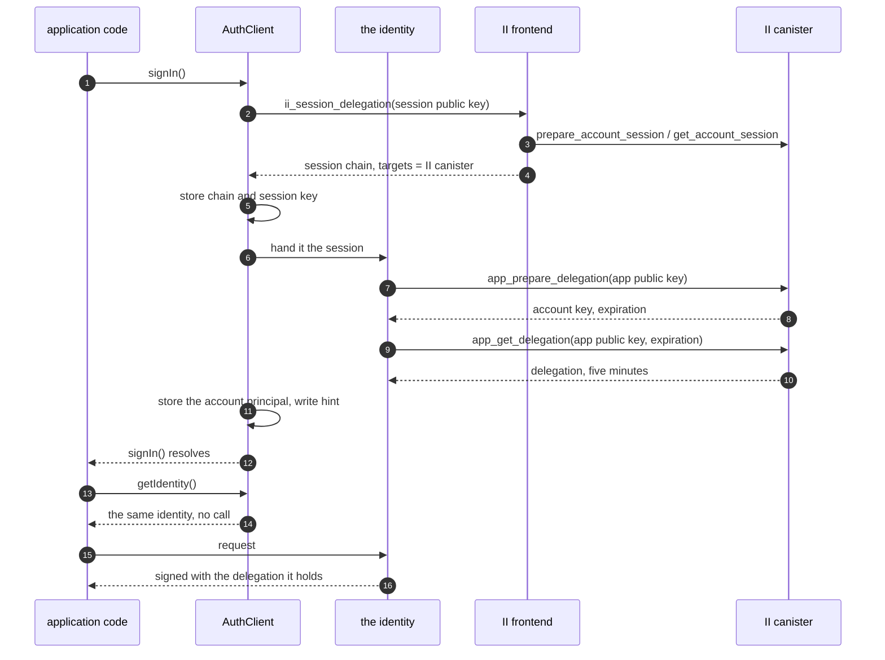
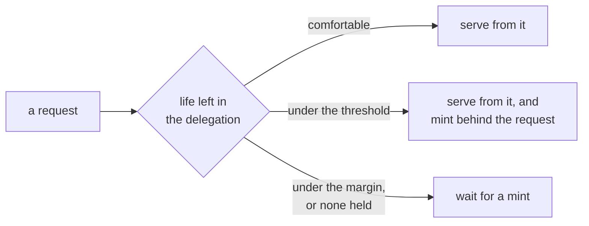
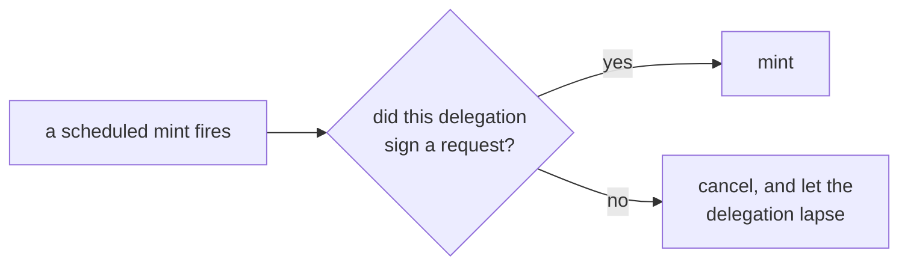
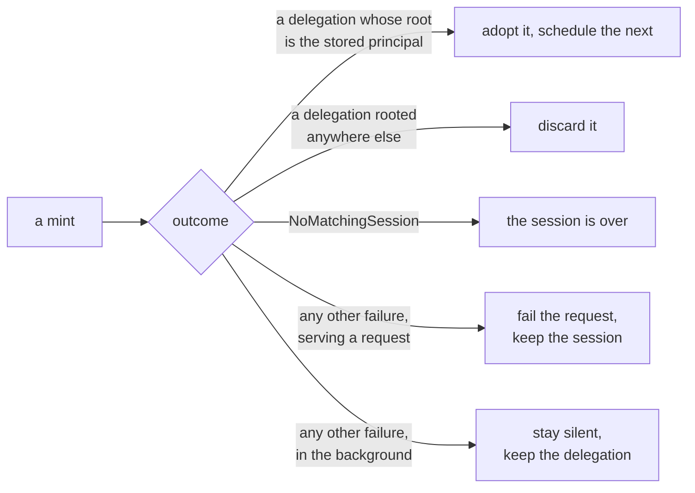

# App sessions in the client library: specification

**Design:** [client-app-sessions.md](client-app-sessions.md) covers what this builds and why. This document assumes it and does not repeat it.

**Depends on:** [revocable-app-sessions-spec.md](revocable-app-sessions-spec.md) for the session record, the chain that authenticates a call as that session, and the account principal a ceremony returns.

## Constants

| Value                   | Where it comes from                                | Setting                    |
| ----------------------- | -------------------------------------------------- | -------------------------- |
| App delegation lifetime | `APP_DELEGATION_TTL_NS`, enforced by the canister  | 5 minutes, not requestable |
| Session lifetime        | requested as a ceiling, chosen at consent, clamped | 10 minutes to 30 days      |
| Block margin            | this library                                       | 10 seconds                 |
| Pre-mint threshold      | this library                                       | 15 seconds                 |

The block margin covers a request's flight time, because the delegation has to still be valid when the replica verifies the request it was attached to.

The pre-mint threshold covers one mint and nothing else, because a refresh is scheduled for the moment it is needed rather than waiting for a request to arrive inside a window. Minting before a delegation expires discards the rest of its life, so an active session consumes lifetime at `TTL / (TTL - threshold)`: at 15 seconds it refreshes about every four and three quarter minutes against a floor of five. A threshold wide enough to catch a passing request would have to be several times larger, and every second of it becomes update calls and stable writes on every active session for as long as it lives.

## Sequence

`getIdentity()` makes no call and returns the same object every time. The mint at sign-in is step 7 onwards, and after that the identity replaces its own delegation on the schedule and the request paths of the section below. An application that calls `getIdentity()` a thousand times mints nothing; one that makes a thousand requests over an hour mints about twelve times.

## Acquiring a session

**ACQ-1.**
`signIn()` requests a session with `ii_session_delegation`. Nothing checks first whether the provider offers it: this library is for Internet Identity, and a provider that cannot answer is a failed sign-in rather than a case to fall back from.

**ACQ-2.**
The request carries a session public key, a `maxTimeToLive` where the application sets one, and a derivation origin where it configured one. It carries no access level, which is the user's alone to decide at consent.

**ACQ-3.**
`maxTimeToLive` is a ceiling, not a request. What the user picks at consent wins over it, an SSO organization's cap narrows it further, and the canister clamps the result to the session lifetime in the table above. An application asking for less than the minimum therefore gets the minimum, and one asking for more than it is offered gets what it is offered.

**ACQ-4.**
The returned chain is rejected unless its `targets` name the II canister and nothing else. A chain without that restriction is not a session chain, and treating one as a session would give the library something it could sign arbitrary calls with.

**ACQ-5.**
The session is persisted through `SessionStorage`, which holds the chain and the account key together as one record.

**ACQ-6.**
The app delegation is never persisted, by any path.

**ACQ-7.**
The account key is part of the stored session, not a second thing stored beside it. It is not derivable from the chain, which is rooted at the session's own key, and the transport result carries only the chain, so it is taken from the `user_key` of the first mint, which MINT-11 makes part of signing in.

## Keys

**KEY-1.**
The session key is persisted through `IdentityStorage`, so it is the key that survives a reload and it inherits whatever non-extractable backing the configured store provides.

**KEY-2.**
The app key is generated per `AuthClient` instance and held in memory only. A reload therefore mints against a fresh app key, which costs one round trip and leaves nothing on disk that can sign for the app.

**KEY-3.**
No public export returns the session key, the session chain, or a handle from which either can be recovered.

## Minting an app delegation

A request arriving finds one of three situations:

A scheduled mint asks one question before it runs:

Whatever reached it, a mint ends one of five ways:

Sign-in and a restored session reach a mint directly, without the questions above. No mint starts at all while the session itself has less than the block margin left, and if one is already running an arrival joins it rather than starting a second.

**MINT-1.**
`getIdentity()` resolves to an identity carrying an app delegation minted from the session.

**MINT-2.**
A request arriving when the held delegation has less than the block margin left, or when none is held, waits for a mint.

**MINT-3.**
Adopting a delegation schedules one mint for the moment that delegation reaches the pre-mint threshold. It is a single scheduled refresh of a known delegation, not a recurring one.

**MINT-4.**
A scheduled mint cancels unless the delegation it is replacing signed at least one request. Signing a request is the only thing that counts as use, because it is the only activity the library sees, and the window is that one delegation's lifetime rather than any longer history.

The question is asked separately about each delegation, which is what bounds the chain: a refresh happens only if the delegation being retired was used, and the delegation it produces has to earn the next one the same way. So an application that makes a request at least once per delegation lifetime refreshes for as long as that holds, and one that goes quiet refreshes exactly once more, because the delegation it was using did serve a request, and then lets the replacement lapse unused. A single request does not buy a chain of refreshes.

The predicate needs no constant of its own and there is nothing to tune. Without it, a refresh would fire for as long as a tab stayed open, stamping the session as used and inflating the signal MINT-13 exists to keep honest.

**MINT-5.**
A request arriving when the held delegation has less than the pre-mint threshold and at least the block margin left is served from the delegation already held and starts a mint in the background. This is the guarantee behind the schedule, which is best effort: browsers throttle timers in hidden tabs and fire them late after a machine has slept.

**MINT-6.**
A mint starts in the background when the page becomes visible or the window regains focus. The identity decides whether one is due, on the same terms as any other trigger, so a foreground with plenty of life left in the delegation costs nothing: the trigger says the moment is a good one, the identity says whether to act.

The events are `visibilitychange` filtered on a visible state, `pageshow`, and `focus`. `focus` is there because two visible windows side by side do not change visibility when the user moves between them, and `pageshow` because a page restored from the back-forward cache resumes with timers that never ran.

This is what covers a throttled schedule, which is ordinary rather than exotic. A backgrounded tab has its timers throttled and its delegation lapses, so without it the user's first click after returning waits for a mint. Returning to a tab is a second or two of human latency ahead of that click, which is enough to hide one.

**MINT-7.**
The identity holds no reference to a DOM. `AuthClient` calls a refresh entry point on it, and the listening lives in a separable piece that is constructed only where those APIs exist, in the way idle detection already is. An environment without a DOM constructs nothing, hooks nothing, and neither warns nor throws.

`CookieSessionStorage` reads the same events inline, and is not the model to follow: a cookie store is browser-only by definition, so it may assume what it needs. Refresh has to work in Node and anywhere else `AuthClient` runs, so its environment-specific part is isolated rather than assumed.

Where there is no DOM, the schedule of MINT-3 and the request paths of MINT-2 and MINT-5 are the whole mechanism. Nothing is incorrect without this trigger; a request after a long gap simply waits for its mint.

The trigger is on by default and turned off with `disableForegroundRefresh`, following `disableIdle` for a behaviour enabled unless an application opts out. Its listeners are released by `dispose()`.

**MINT-8.**
At most one mint is in flight. Callers arriving while one is running await that one rather than starting another, and a request that has to wait joins a background mint already running rather than starting a second.

**MINT-9.**
`app_get_delegation` is called with the exact `expiration` that `app_prepare_delegation` returned. A mismatch is a failed mint, not a retry with a different value.

**MINT-10.**
No mint is started when the session itself has less than the block margin left. A delegation is minted for `min(5 minutes, what remains of the session)`, so a mint against a nearly finished session returns one already too short to satisfy MINT-2, and refreshing on the delegation's remaining life alone would mint without end. Such a session is over and is treated as ERR-1.

**MINT-11.**
`signIn()` mints before it resolves, so the first request after signing in does not wait. The cost is hidden inside a ceremony the user is already waiting for.

**MINT-12.**
A page load that restores a stored session starts a mint in the background. `getIdentity()` does not wait for it.

**MINT-13.**
No recurring timer or interval triggers a mint, and no mint happens for a delegation nothing used. Adopting a delegation arms one refresh, and MINT-4 confirms that delegation was used before the refresh fires, which is what keeps the session's last-refreshed stamp a record of use rather than of an open tab.

**MINT-14.**
A mint that fails leaves the stored session chain and session key exactly as they were, except where ERR-1 applies.

**MINT-15.**
The principal a caller sees does not change when a delegation is replaced. `app_prepare_delegation` roots every delegation at the account's key, so successive mints agree. A mint whose `user_key` does not match the stored account principal is a failed mint, and its delegation is not adopted.

**MINT-16.**
`getPrincipal()` never triggers a mint. It is answered from the account principal persisted by ACQ-6, which is why the background mint of MINT-12 does not have to complete before a restored session can report who is signed in.

## Failure

**ERR-1.**
`NoMatchingSession` is terminal. The library discards the session chain, the session key and the hint, notifies subscribers, and reports the user as not authenticated.

**ERR-2.**
`InternalCanisterError`, a transport failure, and an unreachable boundary node are transient. The library retains the session, propagates the failure to the caller, and does not report a sign-out.

**ERR-3.**
No failure path leaves a session chain stored without its key, or a key without its chain.

**ERR-4.**
A background mint that fails transiently is not surfaced to the application and does not report a sign-out. The delegation already held stays in use, and the next request retries, waiting if MINT-2 applies by then.

**ERR-5.**
`NoMatchingSession` from a background mint is terminal exactly as in the foreground. It means the session is gone, and which mint discovered that does not change what is true.

## The cross-subdomain hint

**HINT-1.**
The hint cookie carries the signed-in principal and the **session's** expiry.

**HINT-2.**
The hint is written when a session is acquired and removed when one is discarded, whether by sign-out or by ERR-1.

**HINT-3.**
Minting does not write the hint. An app delegation's expiry is five minutes away and says nothing about whether a sibling has a session to re-issue from.

## Signing out

**END-1.**
`signOut()` calls `app_revoke_session` before clearing local state.

**END-2.**
Local state is cleared whether or not that call succeeded. A user who pressed sign out must not remain signed in on the device in front of them.

**END-3.**
`app_revoke_session` returns nothing and always succeeds, so there is no error to surface and a repeated sign-out needs no special case.

## Reaching the II canister

**AGENT-1.**
The II canister id is taken from the `targets` of the session chain, which ACQ-4 has already established names that canister and nothing else. It is not configured.

**AGENT-2.**
Mint calls go to the origin of the configured identity provider, because the II canister is served by the same gateway that serves the II frontend.

**AGENT-3.**
Where that origin is loopback, the agent fetches the replica's root key. Where it is not, it does not.

**AGENT-4.**
No host, agent or canister-id option is added. Everything above is derived from configuration the library already has, or from the session itself.

## Public surface

**API-1.**
`signIn()`, `getIdentity()`, `signOut()`, `isAuthenticated()` and `subscribe()` keep their current signatures, and no session type, session chain or session expiry is exposed through any of them. The one addition is `disableForegroundRefresh` in MINT-7, which is about when the library refreshes rather than about sessions.

**API-2.**
`isAuthenticated()` reports whether a session is held and unexpired, not whether an app delegation is currently valid. A held session with a lapsed delegation is authenticated, because the next call mints.

**API-3.**
`getIdentity()` performs no canister call and returns the same identity for the life of the session. It is the identity that refreshes, not `AuthClient` that hands out a fresh one, because an application passes the identity to an agent once and that agent keeps the object: an identity that was a snapshot of one delegation would go on signing with it until it expired, and no later `getIdentity()` call would reach the agent holding it.
