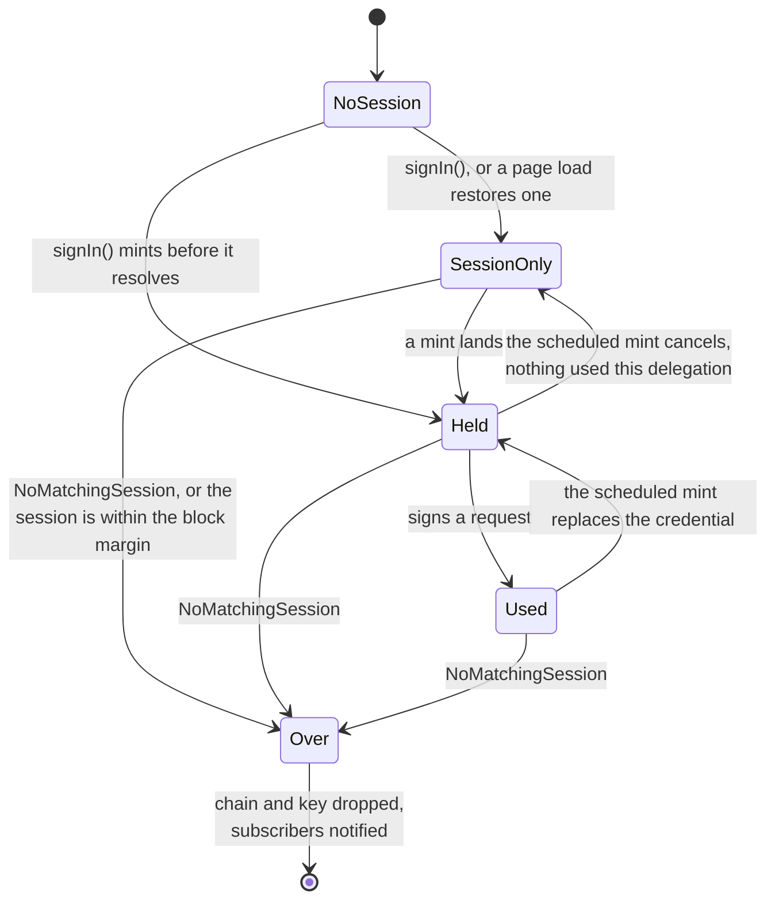
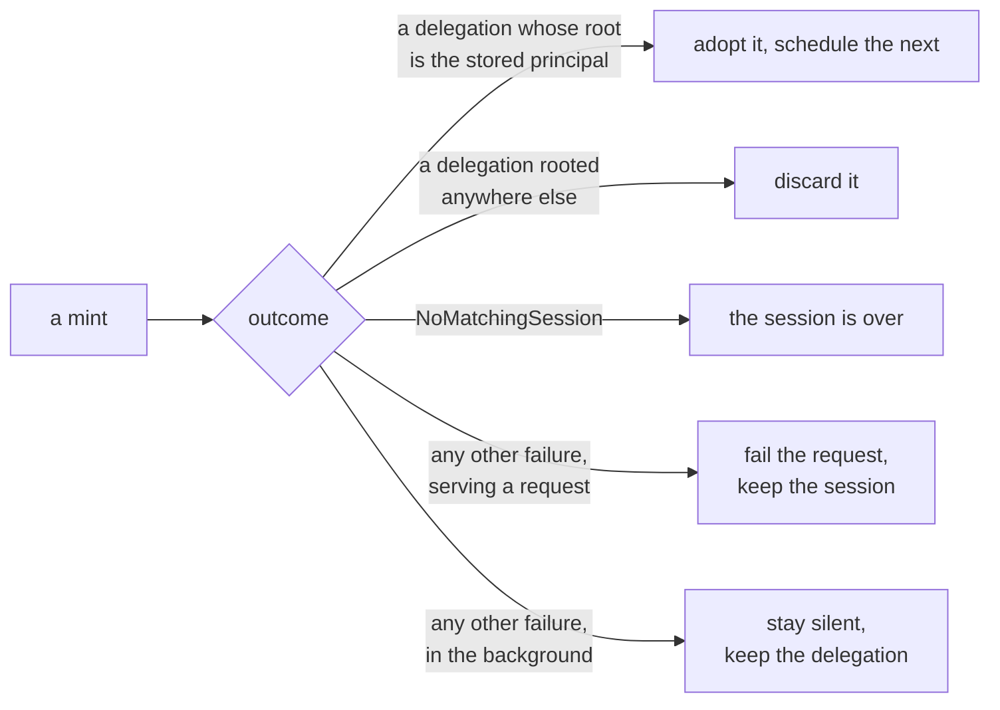

# App sessions in the client library: specification

**Design:** [client-app-sessions.md](client-app-sessions.md) covers what this builds and why. This document assumes it and does not repeat it.

**Depends on:** [revocable-app-sessions-spec.md](revocable-app-sessions-spec.md) for the session record, the chain that authenticates a call as that session, and the account principal a ceremony returns.

## Constants

| Constant                | Value                      | Set by                                             |
| ----------------------- | -------------------------- | -------------------------------------------------- |
| App delegation lifetime | 5 minutes, not requestable | `APP_DELEGATION_TTL_NS`, enforced by the canister  |
| Session lifetime        | 10 minutes to 30 days      | requested as a ceiling, chosen at consent, clamped |
| Block margin            | 10 seconds                 | this library                                       |
| Pre-mint threshold      | 15 seconds                 | this library                                       |

The rest of the document uses these names and restates no value. Four more are fixed strings:

| Name                   | Value                                                                                                                                         | Used by  |
| ---------------------- | --------------------------------------------------------------------------------------------------------------------------------------------- | -------- |
| Slots                  | `session`, `app`, `session-pending`, each prefixed by the namespace where one is set                                                          | STORE-4  |
| Mint lock              | the `app` slot                                                                                                                                | STORE-8  |
| Default authorize URL  | `https://id.ai/authorize`                                                                                                                     | AGENT-2  |
| Default II canister id | `rdmx6-jaaaa-aaaaa-aaadq-cai`                                                                                                                 | AGENT-2  |
| Status cookie          | named from the namespace, `Path=/`, `Domain=<the configured domain>`, `SameSite=Lax`, `Max-Age` to the session's expiry, `Secure` on `https:` | STATUS-2 |

The block margin covers a request's flight time.

The pre-mint threshold covers one mint and nothing else. At 15 seconds an active session refreshes about every four and three quarter minutes against a floor of five. The design gives the arithmetic and the reason the threshold is not wider.

## Sequence

`getIdentity()` makes no call and returns the same object every time. The mint at sign-in is step 7 onwards, and after that the identity replaces its own delegation on the schedule and the request paths of the section below.

## Acquiring a session

**ACQ-1.**
`signIn()` requests a session with `ii_session_delegation`. Nothing checks first whether the provider offers it: this library is for Internet Identity, and a provider that cannot answer is a failed sign-in rather than a case to fall back from.

**ACQ-2.**
The request carries a session public key, a `maxTimeToLive` where the application sets one, and a derivation origin where it configured one. It carries no access level, which is the user's alone to decide at consent.

**ACQ-3.**
`maxTimeToLive` is sent as the requested ceiling where an application set one. What is granted is decided by the canister, within the session lifetime above. An application asking for less than the minimum therefore gets the minimum, and one asking for more than it is offered gets what it is offered.

**ACQ-4.**
The returned chain is rejected unless its `targets` name the configured II canister and nothing else, per AGENT-5. A chain without that restriction is not a session chain, and treating one as a session would give the library something it could sign arbitrary calls with. Acquisition mints before it resolves, so the check runs there too.

**ACQ-5.**
The session credential is persisted under the `session` slot: the chain and the key it was issued to, as one record and nothing beside them.

**ACQ-6.**
The app delegation is persisted only as part of the `app` credential TAB-1 describes, and only under the conditions TAB-5 and TAB-6 impose on reading one back. No other path stores it.

**ACQ-7.**
The account principal arrives as the `user_key` of a mint and is recorded in the status, per STATUS-3, which is where everything afterwards reads it. It is not derivable from the session chain, which is rooted at the session's own key, and the transport result carries only that chain. Before the first mint there is none, which MINT-12 puts out of reach by minting inside the ceremony.

**ACQ-8.**
A key has to exist before the ceremony starts, since its public half is what the delegation is asked to be issued to, so it cannot be generated on the return leg of a redirect. It is written to the `session-pending` slot and never to `session`, so a ceremony that is cancelled or never returns cannot disturb a live session. On return it is promoted: the `session` slot is written with that identity and the chain together, and the pending slot is removed.

The pending key's **public** key is journaled through the redirect's `memoize`, which is what that journal already carries — non-secret and serialisable. On return, a mismatch means another ceremony in this browser superseded this one, and is reported as that rather than surfacing later as a chain that does not match its key. A superseded ceremony MUST read the `session` slot before starting another: the ceremony that superseded it promoted a credential there, so in the ordinary case there is a session to use and nothing to retry. Only where the slot is empty does it begin again. Without that read, two tabs acquiring at once cost the loser a second round trip to the identity provider to arrive where one read would have put it. Naming the slot per ceremony instead would let both finish, and would leak a bare key handle per abandoned ceremony with no way to find it again, the interface having no enumeration.

`signIn()` with `transport: 'redirect'` is refused outright where the store is neither `durable` nor `shared`: the key cannot survive the navigation and nothing can answer for it, so refusing before navigating beats returning to a flow that cannot finish. Where the store is `shared` but not `durable` a peer answers, which is genuine rather than luck, so the return leg reports that the key did not survive instead of the configuration being rejected.

## Keys

Four things are held, in two credentials of the same shape, and one more while a ceremony is in flight. A credential is an identity and the delegation that authorises it, kept as one record under one slot.

| Thing            | Slot              | Lifetime                                             | Requirement  |
| ---------------- | ----------------- | ---------------------------------------------------- | ------------ |
| Session key      | `session`         | the session                                          | KEY-1, KEY-4 |
| Session chain    | `session`         | the session                                          | ACQ-5, KEY-4 |
| App key          | `app`             | one delegation                                       | KEY-2, TAB-5 |
| App delegation   | `app`             | one delegation                                       | TAB-5        |
| A ceremony's key | `session-pending` | until it is promoted or another ceremony replaces it | ACQ-8        |

**STORE-1.**
Storage is two interfaces, and what separates them is what they are for. `StatusStorage` holds the state — who is signed in here and until when — and is read synchronously, because that is what a page decides its rendering on. `CredentialStorage` holds the material that acts on that state, and is asynchronous, because using it means making a call and a non-extractable key needs a store that can hold one.

|            | What it holds       | Read synchronously | Crosses the origin |
| ---------- | ------------------- | ------------------ | ------------------ |
| status     | the state of record | yes                | yes                |
| credential | the material        | no                 | never              |

The state leads. Where the two disagree, the status decides and the credentials are what get discarded — see STATUS-6.

**STORE-2.**
A credential is one record, written and read as one act. `chain` is optional and legal only in the pending slot of ACQ-8; a record without a chain under any other slot is refused. So the dangerous half is not expressible: there is no way to store a chain without the identity it was issued to, and no way for two stores to disagree about which key a chain belongs to.

**STORE-3.**
An application supplies one `CredentialStorage` and one `StatusStorage`. Nothing composes them, and there is deliberately no per-credential choice of store. A persisted session with a memory-backed app credential protects nothing — TAB-8 holds that anything able to read the session key can mint a fresh delegation whenever it likes — so it reads as a security choice while being none. Not persisting means something only when it is all of it.

**STORE-4.**
Slots are assigned by `AuthClient` and never defaulted by a store, so a store takes the slot as an argument to every call. Implementations choosing their own defaults is what produced three colliding slots in the version this replaces, two of them on the same key in the same database; one assigner cannot collide with itself.

One optional `namespace` prefixes every slot and the status record, and is the only way to change any of them, so an application running two clients under one domain separates them with one string and cannot change some names and miss others.

**STORE-5.**
A slot names the key its record is stored under and the lock of STORE-8. Because the status record is named from the same namespace, that namespace is a cross-origin contract: a sibling subdomain reads the status cookie by name, so one set on a sibling and not on its neighbour stops the sharing of STATUS-1 and reports nothing, since an absent cookie reads exactly like a sibling that is signed out.

**STORE-6.**
`create()` belongs to the credential store because the medium decides the key type. A store that has to serialise needs a key whose private bytes are readable; one that does not should not have them. Separating generation from persistence would let an application pair a non-extractable key with `localStorage` and discover it at runtime, so the two stay together and `set` accepts only what that store's own `create()` returned.

**STORE-7.**
A credential store declares two facts about its medium, and only it can:

| Store                           | `shared` | `durable` |
| ------------------------------- | -------- | --------- |
| `IdbCredentialStorage`          | true     | true      |
| `LocalCredentialStorage`        | true     | true      |
| `MemoryCredentialStorage`       | false    | false     |
| `SharedMemoryCredentialStorage` | true     | false     |

`shared` is whether another tab of this origin reads what it writes; `durable` is whether it survives this document being torn down. The axes are independent — shared without durable is the channel-backed store, and durable without shared is a `sessionStorage`-backed one nothing ships but which is coherent. Both are required rather than optional: the safe default for either would be the counter-intuitive one, since a store that stays silent about being shared costs a mint in every tab.

**STORE-8.**
The lock is `navigator.locks`, named for the `app` slot, and it belongs to `AuthClient` rather than to a store. Locking is the library coordinating with itself, so an application writing a custom store answers STORE-7 and needs to know nothing about the Web Locks API. A mint takes the lock when the store is `shared`; where it is not, there is nothing to suppress and TAB-13 applies.

**STORE-9.**
`set` writes what it is given and takes no lock. That the `app` slot is written in one place, inside the lock of STORE-8, is a rule about that call site and not a property of the interface: an application implements these interfaces and never calls them.

**STORE-10.**
A credential store has no notification of its own and needs none. Nothing has to be told that a mint happened: a tab wanting a delegation takes the lock and reads, which is the whole protocol, and every change that alters the _state_ is announced by the status store instead. A store whose medium another tab cannot read still runs a channel to populate its own copy, because a peer cannot reach into it, but that is its private business and appears nowhere on the interface. Where a message has not arrived the tab mints, which TAB-9 permits.

**STORE-11.**
Credentials are read when they are used and never cached for a synchronous answer. The synchronous questions are answered by the status, so there is no copy to keep fresh, nothing to invalidate, and no window in which a tab holds a stale one. The two places that read are a mint, inside the lock, and the identity when it signs; both are already asynchronous.

**STORE-12.**
The library ships a store per medium, so an application chooses rather than writes one:

| Store                           | Backed by                   | Keys generated by `create()`   |             |
| ------------------------------- | --------------------------- | ------------------------------ | ----------- |
| `IdbCredentialStorage`          | IndexedDB                   | ECDSA, non-extractable         | **default** |
| `LocalCredentialStorage`        | `localStorage`              | Ed25519, private bytes as JSON |             |
| `MemoryCredentialStorage`       | a `Map` on the instance     | ECDSA, non-extractable         |             |
| `SharedMemoryCredentialStorage` | that `Map`, plus a channel  | ECDSA, non-extractable         |             |
| `MemoryStatusStorage`           | a field on the instance     | —                              |             |
| `LocalStatusStorage`            | `localStorage`              | —                              | **default** |
| `CookieStatusStorage`           | a cookie scoped to a domain | —                              |             |

Only a store that has to serialise needs a key whose private bytes are readable, which is why `LocalCredentialStorage` generates a different type from the others.

**STORE-13.**
The memory-backed stores hold a `Map` keyed by slot, on the instance and never on the module. Two clients on one page must not see each other's slots — which is what the namespace of STORE-4 is for, and a module-level map would defeat it — and state must not carry between tests sharing a process. Nothing about the map is weak: it is keyed by a string, so there is no object to key on and nothing collectable while a slot still names it.

A memory-backed store returns the record it was given rather than a copy. That is the difference from every other store, each of which round-trips through an encoding and hands back something new, and it is what lets one hold a non-extractable key at all. Nothing in the library mutates a `SignIdentity` or a `DelegationChain` it read.

**KEY-1.**
The session key is stored in the `session` slot, so it is the key that survives a reload and it inherits whatever non-extractable backing the configured store provides.

**KEY-2.**
The app key is generated by the mint that gets a delegation for it, and stored only as part of the `app` credential. A key and its delegation are one thing with one lifetime: five minutes, after which the key is deleted per TAB-5, because a key that outlives its delegation carries no authority.

It is a non-extractable key rather than one whose private bytes are readable, because it is stored for other tabs to read and should arrive as something that signs and cannot be copied.

**KEY-3.**
Replacing a credential does not disturb a request already in flight, because a request is signed and its delegation attached in the same act.

**KEY-4.**
No method of `AuthClient` returns the session key, the session chain, or a handle from which either can be recovered. A configured store is a different matter: storage is pluggable, so a store's `get()` returns exactly what it holds, and an application that constructs one has whatever its own store has.

## Minting an app delegation

A request arriving finds one of four situations.

| Life left in the held delegation        | Served from         | Mint       | Requirement |
| --------------------------------------- | ------------------- | ---------- | ----------- |
| more than the pre-mint threshold        | the held delegation | none       | MINT-1      |
| within the threshold, above the margin  | the held delegation | background | MINT-6      |
| within the block margin, or none held   | the mint's result   | blocking   | MINT-3      |
| the session itself is within the margin | nothing             | none       | MINT-11     |

The middle state below is a normal state, not an exception. A restored page load sits there, returning its principal, until something needs a delegation.

A mint ends one of five ways.

No mint starts at all while the session itself has less than the block margin left, and if one is already running an arrival joins it rather than starting a second.

**MINT-1.**
`getIdentity()` resolves to an identity that obtains an app delegation when one is needed. It does not promise to be holding one: signing in leaves it with the delegation minted during the ceremony, a session restored on a page load starts with whatever usable credential the store holds, and where there is none it mints on its first request.

**MINT-2.**
Before a delegation is held, the identity still answers for its principal, per MINT-17. Its delegation chain reports that key and no delegations, which is how "no authority yet" is represented.

**MINT-3.**
A request arriving when the held delegation has less than the block margin left, or when none is held, waits for a mint.

**MINT-4.**
Adopting a delegation schedules one mint for the moment that delegation reaches the pre-mint threshold. It is a single scheduled refresh of a known delegation, not a recurring one.

**MINT-5.**
A scheduled mint cancels unless the delegation it is replacing signed at least one request. Signing a request is the only thing that counts as use, and the question is asked of each delegation separately, so one request does not buy a chain of refreshes.

**MINT-6.**
A request arriving when the held delegation has less than the pre-mint threshold and at least the block margin left is served from the delegation already held and starts a mint in the background. A schedule is best effort, so requests are the guarantee.

**MINT-7.**
A mint starts in the background when the page becomes visible or the window regains focus. The identity decides whether one is due, on the same terms as any other trigger, so a foreground with plenty of life left in the delegation costs nothing: the trigger supplies the moment and the identity decides whether to act.

The events are `visibilitychange` filtered on a visible state, `pageshow`, and `focus`. `focus` is there because two visible windows side by side do not change visibility when the user moves between them, and `pageshow` because a page restored from the back-forward cache resumes with timers that never ran.

Returning to a tab is a second or two of human latency ahead of that click, which is enough to hide one.

**MINT-8.**
The identity holds no reference to a DOM. `AuthClient` calls a refresh entry point on it, and the listening lives in a separable piece that is constructed only where those APIs exist, in the way idle detection already is. An environment without a DOM constructs nothing, hooks nothing, and neither warns nor throws.

Where there is no DOM, the schedule of MINT-4 and the request paths of MINT-3 and MINT-6 are the whole mechanism. Nothing is incorrect without this trigger; a request after a long gap simply waits for its mint.

The trigger is on by default and turned off with `disableForegroundRefresh`, following `disableIdle` for a behaviour enabled unless an application opts out. Its listeners are released by `dispose()`.

**MINT-9.**
At most one mint is in flight. Callers arriving while one is running await it, and a request that has to wait joins a background mint already running.

**MINT-10.**
`app_get_delegation` is called with the exact `expiration` that `app_prepare_delegation` returned. A mismatch is a failed mint, not a retry with a different value.

**MINT-11.**
No mint is started when the session itself has less than the block margin left. A delegation is minted for `min(5 minutes, what remains of the session)`, so a mint against a nearly finished session returns one already too short to satisfy MINT-3, and refreshing on the delegation's remaining life alone would mint without end. Such a session is over and is treated as ERR-1.

**MINT-12.**
`signIn()` mints before it resolves, so the first request after signing in does not wait. The cost is hidden inside a ceremony the user is already waiting for.

**MINT-13.**
A page load that restores a stored session goes through the trigger of MINT-7, since a load is the page becoming visible for the first time, and that trigger mints only when one is due. Both halves of that matter on a load.

A load that reads a usable credential is not due, and MUST NOT mint. A load that finds none, or one inside the pre-mint threshold, is due and MUST mint in the background — before anything asks for an identity, and whether or not the application goes on to use one. Waiting for the first request to discover it would put the cost in front of a user action, which is what the trigger exists to avoid.

It still follows the trigger's conditions: with no DOM, or under `disableForegroundRefresh`, the load mints nothing and the first request pays for it. `getIdentity()` does not wait for any of these outcomes.

A load with a non-durable store is therefore always due. A load consequently stops being where a session revoked elsewhere is discovered, since a stored credential reads the same either way. TAB-6 catches a session replaced in this browser; one revoked from another device is found at the next mint, which is within one delegation lifetime — the bound [revocable-app-sessions-spec.md](revocable-app-sessions-spec.md) sets in END-5, and the same bound that applies to a delegation minted a moment before the revocation.

**MINT-14.**
No recurring timer or interval triggers a mint, and no mint happens for a delegation nothing used. Adopting a delegation arms one refresh, and MINT-5 confirms that delegation was used before the refresh fires, which is what keeps the session's last-refreshed stamp a record of use rather than of an open tab.

**MINT-15.**
A mint that fails leaves the stored session credential exactly as it was, except where ERR-1 applies.

**MINT-16.**
The principal a caller sees does not change when a delegation is replaced. `app_prepare_delegation` roots every delegation at the account's key, so successive mints agree. A mint whose `user_key` does not match the principal already established is a failed mint, and its delegation is not adopted.

**MINT-17.**
`getPrincipal()` never triggers a mint and is answered from the status, synchronously. The account principal is part of the state rather than something derived from whatever material happens to be held, so a page load reports who is signed in without opening a store and without waiting for the background mint of MINT-13.

## Failure

**ERR-1.**
`NoMatchingSession` is terminal for the chain in hand. The library discards the session chain and the session key for this origin, notifies subscribers, and reports the user as not authenticated. It does not remove the published status: see STATUS-4.

**ERR-2.**
`InternalCanisterError`, a transport failure, and an unreachable boundary node are transient. The library retains the session, propagates the failure to the caller, and does not report a sign-out.

**ERR-3.**
A chain cannot be stored without the key it was issued to, because STORE-2 makes the two one record. The half that is legal — a key with no chain — carries no authority and lives only in the pending slot of ACQ-8, so a ceremony in progress has somewhere to keep its key that no failure path has to work around.

**ERR-4.**
A background mint that fails transiently is not surfaced to the application and does not report a sign-out. The delegation already held stays in use, and the next request retries, waiting if MINT-3 applies by then.

**ERR-5.**
A minted delegation carrying a `permissions` field is refused with an error naming the reason, and the session is kept. A read-only session therefore fails every request in the same way, and telling an application that its session is read-only is out of scope, so nothing distinguishes this from a transient failure yet.

**ERR-6.**
`NoMatchingSession` from a background mint is terminal exactly as in the foreground.

## The published status

**STATUS-1.**
The status is the state of the sign-in: the account's principal, and when the session expires. It is one record, held by its own store and supplied to `AuthClient` beside the credential store, and it is what decides whether this origin is signed in and as whom. The credentials are the material that acts on that state rather than the record of it.

It has no identity half and declares neither `shared` nor `durable`, since the lock of STORE-8 governs what mints and a status mints nothing.

**STATUS-2.**
It is read synchronously, which is what lets `isAuthenticated()` and `getPrincipal()` answer on a page load without awaiting anything — see API-2 and MINT-17. Where it is kept decides how far the state reaches and how a change in it is noticed:

| Store                 | Reaches                     | Change observed through          |             |
| --------------------- | --------------------------- | -------------------------------- | ----------- |
| `LocalStatusStorage`  | this origin                 | `storage`                        | **default** |
| `CookieStatusStorage` | every sibling of the domain | `cookieStore`, visibility, focus |             |

**STATUS-3.**
The status changes only when the state does: acquiring a session sets the expiry, and the first mint sets the principal. Signing in does both before it resolves, per MINT-12, so nothing publishes half a record; later mints replace material without changing the state and leave it alone.

It is written last when signing in, once there is material behind it, and removed first when signing out, because it is the record of what is true. A record whose expiry has already passed is removed rather than written.

**STATUS-4.**
Signing out removes the status. Discovering that a chain is stale does not: one session serves every sibling of a domain, so a sibling that did not sign in holds a chain to a session a ceremony elsewhere replaced, and retracting the state would tell the sibling that did sign in that the session it just obtained is gone. The origin that found out drops its own material, keeps the state, and acquires again silently — which is the same path a sibling with a status and no credentials takes.

**STATUS-5.**
A status may outlive the session it describes, so anything acting on one has to be able to fall back to asking the user and may not treat it as authority against the canister. The case with no recovery is a memory-backed configuration whose last tab closed without signing out: nothing dependable fires on a close, so the record stands, `getPrincipal()` answers from it, and the first call fails. That is API-3's optimism reached by a new route rather than a new kind of wrongness.

**STATUS-6.**
Where the status and the credentials disagree, the status decides. Credentials are discarded when the status is missing, when it names another account, or when it has expired — a sign-out, an identity switch, or a session that ended, whether it happened in this tab, another tab, or a sibling subdomain. Nothing goes the other way: material that is present, absent or unusable never changes the state.

The comparison is against the account principal, which is the same value on every origin. A session's own principal is rooted at the session key and differs per origin, so it could not serve.

**STATUS-7.**
A status store is not optional. It holds the state, so a client without one could not say whether it was signed in without opening an asynchronous store, and a configuration whose credentials do not survive a reload would have nothing at all to say on a cold load. `MemoryStatusStorage` exists for the environments the other two do not reach — tests, and anywhere without a DOM — and is per instance rather than per origin, so a client there is alone in the same way a memory credential store is.

**STATUS-8.**
The status store is the only notification path in the design, and it has one in every medium it uses: `storage` for `localStorage`, and the cookie hooks above for the other, since `document.cookie` raises no event and no `BroadcastChannel` crosses origins. A change is readable before it is announced — the record is written, then subscribers fire — because a listener that asks `isAuthenticated()` on being told must not see the answer the notification was about to change.

## Signing out

**END-1.**
`signOut()` calls `app_revoke_session` before clearing local state.

**END-2.**
Local state is cleared whether or not that call succeeded.

**END-3.**
`signOut()` surfaces no error from the revoke call, and a repeated sign-out needs no special case.

**END-4.**
`signOut()` steals the lock of STORE-8 rather than queueing on it, so it is never made to wait for another tab's mint. Stealing releases the lock at once and aborts the signal held by whoever had it; a mint in flight MUST check that signal after its calls return and before it writes, and MUST discard its result when the signal has fired. Waiting for the lock would let a sign-out hang on a canister call, and re-reading the session before each write would narrow the window rather than close it.

The call itself is not cancelled, since the agent takes no signal: it completes, is discarded, and costs one wasted mint and one refresh stamp on a session that is being revoked in the same moment.

## Sharing one delegation across tabs

**TAB-1.**
The app credential is one record, because a mint produces both halves and they expire together. A non-extractable key survives a structured clone into IndexedDB as a handle that signs and cannot be exported, so what a tab reads is usable without key material having been written anywhere.

**TAB-2.**
The store reaches the tabs of one origin and no further, so the floor is one mint per active origin, not one per domain. A delegation minted for a sibling subdomain authorises nothing here.

**TAB-3.**
Sharing is a read, not an exchange. A tab MUST NOT depend on another tab answering, because a backgrounded tab is frozen and may be discarded, and the case sharing is worth having is the one where no other tab can reply.

**TAB-4.**
A tab that needs a delegation reads the stored credential first, and mints only when there is none it may use.

**TAB-5.**
A stored app credential MUST be refused and removed on read once its delegation has expired. Both halves go: the key is the thing that signs, and the chain is not needed to remember who is signed in, because STATUS-1 holds that. This is what bounds a stored credential at one delegation lifetime without depending on an event, and there is no dependable signal for a browser closing to depend on instead.

**TAB-6.**
The `app` slot MUST be removed when the `session` slot is written or removed. A sign-out leaves nothing behind to be found, and a sign-in that replaced the session replaces the app credential rather than letting one stand that is rooted at an account the session no longer belongs to.

**TAB-7.**
A stored app credential is adopted only when its delegation is rooted at the account principal the status or an earlier delegation established. A mismatched record is refused rather than used, wherever it came from. It cannot be adopted with the wrong key, because STORE-2 stores the two halves as one.

**TAB-8.**
Storing the app credential grants no reach the session key did not already grant: anything able to read one could mint from the live session. What TAB-5 and TAB-6 add is that nothing outlives the delegation it was minted with, and nothing at all outlives the session. What remains is a credential on disk for at most one delegation lifetime — a bound and not an erasure, and not a defence against reading the store directly.

**TAB-9.**
Coordination may only suppress a mint, never be required for one. Every tab schedules its refresh as it would if it were alone, and a tab that cannot read or write the store mints for itself.

**TAB-10.**
A mint runs while holding the lock of STORE-8, where the environment provides one. Tabs waking in the same moment queue on it, closing the window in which two mints overlap.

**TAB-11.**
A tab holding the lock MUST read the store before minting, and MUST adopt what it finds instead of minting when that credential is usable.

The lock alone does not reduce what the canister is asked for: tabs that queue on it and then each mint make the same number of calls, one after another instead of at once. TAB-11 is what turns serialising into suppressing, and is therefore what the floor in TAB-2 rests on.

**TAB-12.**
Liveness rests on the lock rather than on a timeout. A browser releases a lock when the context holding it goes away, so a tab closed mid-mint lets the next in the queue proceed, and nothing has to decide how long a tab that is not coming back should be waited for.

**TAB-13.**
Where the environment has no such lock, every tab mints. The lock may be relied on for what this costs, never for whether it works. The same holds for a store that is not `shared`: there is nothing another tab could adopt, so STORE-8 takes no lock and each tab mints for itself.

**TAB-14.**
A request that finds no usable delegation queues on the same lock rather than jumping it.

**TAB-15.**
Adopting a delegation, however it arrived, reschedules that tab's refresh from the adopted delegation's expiry, so tabs do not drift onto separate clocks.

**TAB-16.**
`signOut()` removes both slots and steals the lock, so a mint already running cannot write a credential back over a cleared store. Stealing releases the lock immediately and aborts the signal handed to whoever holds it; that tab completes the call it cannot cancel, sees the abort, and discards the result rather than storing it. See END-4.

TAB-6 makes an app credential that survived a failed sign-out unusable, so the removal is what keeps the store tidy and TAB-6 is what makes it safe.

## Reaching the II canister

**AGENT-1.**
The identity provider is configured as two values: the authorize URL a ceremony is rendered at, and the canister id that mints and revokes. They are not the same address.

**AGENT-2.**
Each half has its own default, the mainnet authorize URL and the mainnet II canister id, so an application deploying against mainnet configures neither.

**AGENT-3.**
Options for the agent that makes the mint and revoke calls are passed through to it unchanged, except that the identity is set by the library, last, so no option can replace the session the calls are made as. Where no agent options are given the agent applies its own defaults, which reach mainnet.

**AGENT-4.**
Nothing about the calls is derived from the authorize URL. Its origin is not used as a host, and whether it is loopback decides nothing.

**AGENT-5.**
Before the first call, a session chain is refused unless its `targets` name the configured canister id and nothing else, with an error naming both sides. A chain naming no targets is refused too, and that is the case worth refusing hardest, because the session key signs with that chain and accepting one would leave the library holding a credential good for any call. This is a check rather than a source, since the canister id comes from AGENT-1.

## Public surface

**API-1.**
`signIn()`, `getIdentity()`, `signOut()`, `isAuthenticated()` and `subscribe()` keep their current signatures, and no session type, session chain or session expiry is exposed through any of them. Three options change:

| Option                     | Change                                                                            | Requirement      |
| -------------------------- | --------------------------------------------------------------------------------- | ---------------- |
| `identityProvider`         | **breaking**: a URL becomes an object carrying an authorize URL and a canister id | AGENT-1, AGENT-2 |
| `credentialStorage`        | **breaking**: replaces `storage`, and holds every credential by slot              | STORE-1, STORE-3 |
| `statusStorage`            | new; the published record, supplied beside it                                     | STATUS-1         |
| `namespace`                | new; prefixes every slot and the status, and the only way to change them          | STORE-4          |
| `agentOptions`             | new; passed to the agent that makes the calls                                     | AGENT-3          |
| `disableForegroundRefresh` | new; about when the library refreshes rather than about sessions                  | MINT-8           |

`keyType` goes with them, the key type now belonging to a store's `create()`, and `AuthClientStorage`, `IdbStorage`, `LocalStorage` and the `KEY_STORAGE_*` constants stop being exported. `subscribe()` and `dispose()` are additions rather than existing signatures.

**API-2.**
`isAuthenticated()` reports whether a session is held and unexpired, not whether an app delegation is currently valid. A held session with a lapsed delegation is authenticated, because the next call mints. It stays synchronous and makes no call, because it reads the status rather than the credentials — which is what lets a credential store be asynchronous without the answer becoming one.

**API-3.**
`isAuthenticated()` is optimistic about revocation, and this is a change in kind. It answers from what the client stored, so a session revoked at the canister or from another browser still reads as authenticated until something mints and is told otherwise, at which point the stored session is dropped and subscribers are notified. Before sessions the answer could only go stale by expiry, which a client could compute; now it can go stale because someone acted. An application that must not act on a stale answer should make a call and handle its failure, which is the only thing that consults the canister.

**API-4.**
`getIdentity()` performs no canister call and returns the same identity for the life of the session, including across the credential being replaced. The identity reaches whatever credential is current rather than holding one, so a rotation changes nothing an application can observe.
