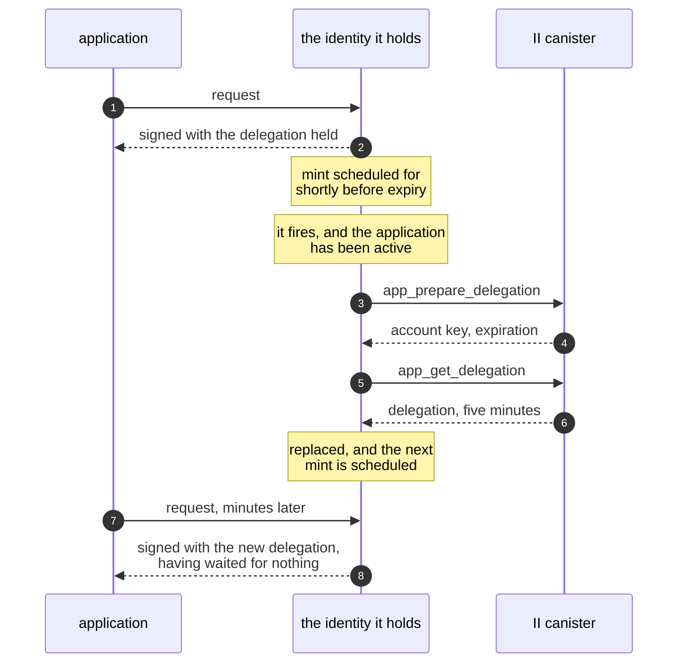

# App sessions in the client library

**Depends on:** [revocable-app-sessions.md](revocable-app-sessions.md) for the session this holds and the methods it calls, and [silent-reauth-redirect.md](silent-reauth-redirect.md) for the parameters that let a re-issue happen without rendering anything.

## Summary

An app that signs in through `@icp-sdk/auth` receives a delegation valid for as long as the user agreed to, up to 30 days, and nothing can withdraw it before it expires. II's side of the fix is designed and built: a session the user can see and end, with short-lived delegations minted from it. No client uses those methods, so no app can reach the feature.

This holds the session inside `AuthClient`. An app calls `signIn()` and gets an identity, as it does today. Behind that identity is a session, and the delegations the identity carries last five minutes and are re-minted as they lapse. `signOut()` ends the session at the canister instead of only clearing local storage. Sessions do not appear in the public API at all: an app never handles a session chain, and nothing it can call returns one.

## Context

A delegation is a signed statement that one key may act for an identity, for a stated period. The app holds the key and the delegation together, and a canister receiving a call verifies the pair without asking II anything. That is what makes a delegation cheap to use and impossible to withdraw.

Signing in today calls `icrc34_delegation`. The user picks a duration at the consent screen, II signs a delegation to the key the library generated, and the library stores both. Every call the app makes for the next few hours or weeks is signed by that key and carries that delegation.

II now offers a different arrangement. `prepare_account_session` records a session and signs a chain to a key, and `app_prepare_delegation` with `app_get_delegation` mint a delegation from that session with a ceiling of five minutes that a caller cannot raise. `app_revoke_session` deletes the session, and `check_session` answers whether one is still there. The session itself lives at the canister, so ending it ends what can be minted from it.

## Problem

Three things follow from a delegation that cannot be withdrawn, and the third is what makes this urgent rather than merely desirable.

A delegation that leaks is usable for its whole life. Exfiltrated from storage, copied off a shared machine, or captured from a compromised dependency, it acts as the user until it expires, and no action by the user or by II reaches it.

Signing out is local. `signOut()` clears the library's storage, which stops that browser from using the delegation; it does not stop anyone else who has a copy.

The library cannot call II's session methods at all, so the canister work has no consumer. The guide for sharing a sign-in across sibling subdomains is written against sessions and promises that signing out of one app signs the user out of the others, which is only true once something in the client revokes.

## Out of scope

- Exposing sessions in the public API. An app receives an identity, and the session behind it is the library's business.
- The browser key proof and the browser registry. Those are II's side and are specified in [revocable-app-sessions-spec.md](revocable-app-sessions-spec.md).
- Listing an identity's sessions, or revoking another browser's, from an app. Both belong to II's settings, and an app is authenticated as one session.
- Migrating delegations stored by an earlier version of the library. The storage change that carries this is already a breaking one.
- Telling an application that its session is read-only. A session the user consented to for queries only mints delegations carrying a permissions field, and surfacing that wants an API of its own.

## Approach

### Two keys, one of them private to the library

The session key is what the session chain delegates to. It signs calls to the II canister and nothing else, because the chain carries `targets` naming only that canister. The app key is what an app delegation delegates to, and it signs the calls the app actually makes.

An app is handed an identity built on the second. The first never leaves `AuthClient`.

### Acquiring

`signIn()` asks for a session rather than a long-lived delegation, and stores the chain it gets back. Because the chain is restricted to the II canister, a copy of it is worth nothing against the app's own canisters, and it is only useful to whoever can also reach II and mint.

### Minting

The identity handed to the app carries a five-minute app delegation, obtained by calling `app_prepare_delegation` and then `app_get_delegation` signed as the session. An agent holds that identity and signs every request with it, possibly for hours, so the identity is what has to notice its delegation ageing: it mints from inside the per-request hook the agent already calls, and one mint is in flight at a time, so several requests arriving together wait on the same round trip.

The identity is one object for the life of the session, and it is the object that refreshes. `getIdentity()` returns it without calling anything. The alternative, having `AuthClient` mint and hand back a fresh identity on each call, fails on how identities are actually used: an application passes one to an agent once, and the agent keeps it. A snapshot of a single delegation would go on signing with that delegation until it expired, and no later call to `AuthClient` would reach the agent still holding the old one.

The principal an app sees is not in the session chain. That chain is rooted at the session's own key, derived from the session seed, while an app delegation is rooted at the account's key. They are different principals, and only the second is what the app's canisters will see. The ceremony computes it and the canister returns it as `account_principal`, but the result the app receives over the transport carries only the chain, so the library learns the account principal from the first mint, where it arrives as `user_key`.

It is therefore recorded alongside the session chain rather than recomputed. A reload can answer for the principal from what it stored, without a mint, and `getPrincipal()` stays synchronous. Every later mint returns the same key, since the account seed does not change, so a mint that returns a different root is a failed mint rather than a new principal.

### Refreshing ahead of use, never on a clock

Waiting until a delegation has expired means one request every five minutes pays for a mint, which an interactive app shows as a stall. Refreshing on a timer avoids that and is worse for two reasons, one of which has nothing to do with cost.

`app_prepare_delegation` stamps the session's last-refreshed time, and that stamp is what II's settings screen shows the user as "this browser used this app 3 minutes ago", and what the session cap reclaims on. A timer refreshes whether or not anyone is looking at the tab, so the column stops meaning "in use" and starts meaning "has a tab open", which is not the reading the user is being offered. Minting only when a request needs one keeps that signal honest at no cost.

So requests are what arm a refresh, and the refresh itself is scheduled for the moment it is needed. A request from an active application schedules one mint for just before its delegation runs out, rather than minting early or waiting for another request to arrive at the right time.

Scheduling it, rather than minting whenever a request happens to arrive with little life left, is what keeps the threshold small. A threshold that has to catch a passing request must be wide enough that one turns up inside it, and everything it discards is paid for: minting before a delegation expires throws away the rest of its life, so an active session consumes lifetime at `TTL / (TTL - threshold)`. Two minutes of threshold turns a five-minute refresh into a three-minute one and adds two thirds again to the update calls and stable writes of every active session, permanently. A scheduled mint only has to cover the mint itself, which is seconds, and an active session then refreshes at nearly the floor the canister sets.

What the application sees is nothing at all. A mint lands between two of its requests, in the gap where the delegation it already holds is still good:

The schedule needs one check, or it becomes the timer this section rejects. An application that goes idle seconds after its last request would still have a refresh scheduled, and firing it would stamp the session as used. So a scheduled mint asks, at the moment it fires, whether the application has been active recently, and cancels if it has not. One more refresh after the last request, and then the delegation is allowed to lapse.

Requests remain the guarantee, because a schedule is best effort: browsers throttle timers in tabs nobody is looking at and fire them late after a machine has slept. A request that finds its delegation inside the threshold starts a mint in the background and is served from what it already has, and one that finds it below the block margin waits. The block margin covers a request's flight time, since the delegation has to still be valid when the replica verifies it.

Minting at the end of sign-in is not only about latency: it is where the account principal comes from, so an application that signs in and reads its principal without making a request gets an answer.

Two stalls are worth removing outright rather than absorbing, and both are hidden inside something the user is already waiting for. `signIn()` mints at the end of the ceremony, so the first call after signing in is instant. A page load that finds a stored session mints in the background while the page starts, without making `getIdentity()` wait for it.

A delegation lasts `min(five minutes, what remains of the session)`, so near the end of a session a mint returns something shorter than the margin it was meant to satisfy. Refreshing on remaining life alone would then mint, find the result already too short, and mint again without end, each iteration an update call. A session with less than the block margin left is over, and the library treats it as over rather than minting against it.

### Where the mint calls go

This is the first thing in the library that calls a canister at all. Everything until now produced an identity and left the network to the application, which is why nothing in it is configured with a host.

Nothing new has to be configured. The session chain names the II canister in its `targets`, so the canister id arrives with the session. The II canister is served by the same gateway that serves the II frontend, so the origin of the configured identity provider is the host to call it on, and a loopback origin is a local replica whose root key has to be fetched.

### What is stored

The session chain, and not the app delegation. Keeping an artifact that dies in five minutes buys nothing, and it would leave a stale one to reconcile on the next load.

### The cross-subdomain hint carries the session's expiry

`CookieDelegationStorage` derives its hint from the delegation it is handed. Handed a five-minute app delegation, the hint would announce to a sibling subdomain that the session expires in five minutes, and the sibling would decide there was nothing worth resuming. The hint takes the session's expiry, because what a sibling is deciding is whether a session exists to re-issue from.

### Two kinds of failure, told apart

A mint is a canister call, so it fails for two very different reasons and the library has to distinguish them.

`NoMatchingSession` means the session is not there: revoked, expired, or pruned. The library discards its local state and reports the user as signed out, because that is what has happened.

An `InternalCanisterError`, a network failure, or an unreachable boundary node means the session may well be alive. The library keeps it and lets the caller retry. Signing a user out because their train entered a tunnel is worse than a call that failed.

`check_session` exists for the case where the library wants that answer without minting, such as deciding on page load whether a stored chain is worth keeping.

### Ending

`signOut()` calls `app_revoke_session` before clearing local state, so access ends within one app-delegation lifetime instead of running to the session's expiry. It clears local state even when the call fails, because a user who pressed sign out must not remain signed in on the device in front of them.

### Talking to an II that has no session methods

A library that only knows how to acquire a session would break against a deployment that predates these methods. The scopes returned when a connection is established say whether `ii_session_delegation` is available; where it is not, `signIn()` falls back to `icrc34_delegation` and behaves as it does today. An app therefore gets revocable sessions where the provider supports them and a working sign-in everywhere else, without choosing.

## Specification

[client-app-sessions-spec.md](client-app-sessions-spec.md) states the requirements, the call sequences, and the constants.

## Implementation stages

1. **Mint app delegations from a session chain.**
   The refreshing identity, its failure classification, and the shared in-flight mint. Nothing produces a session chain yet, so this changes no behaviour and is safe to release on its own.
2. **Acquire a session at sign-in, and carry the session's expiry in the hint.**
   This is the stage that turns the feature on, and the two parts belong together: the hint becomes wrong the moment a five-minute delegation is what a sibling reads. The fallback for providers without the method lands here too, since this is the first stage that asks for a session.
3. **Revoke at sign-out.**
   Harmless before stage 2 and only meaningful after it.
