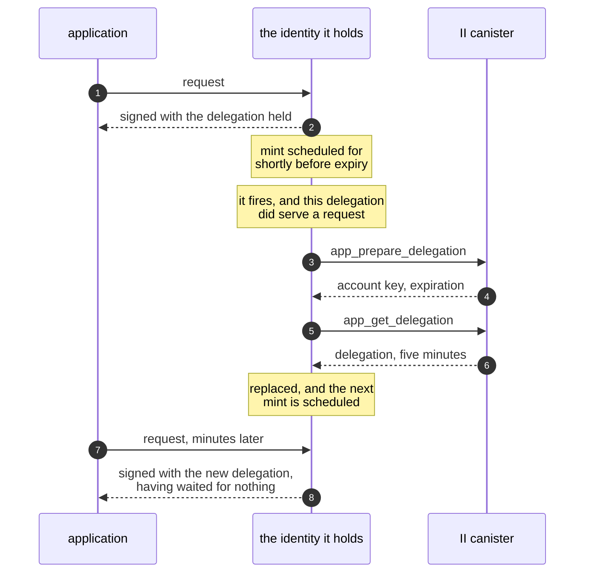
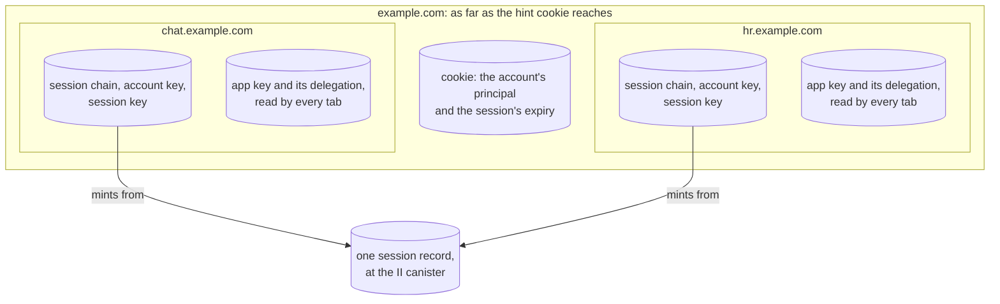
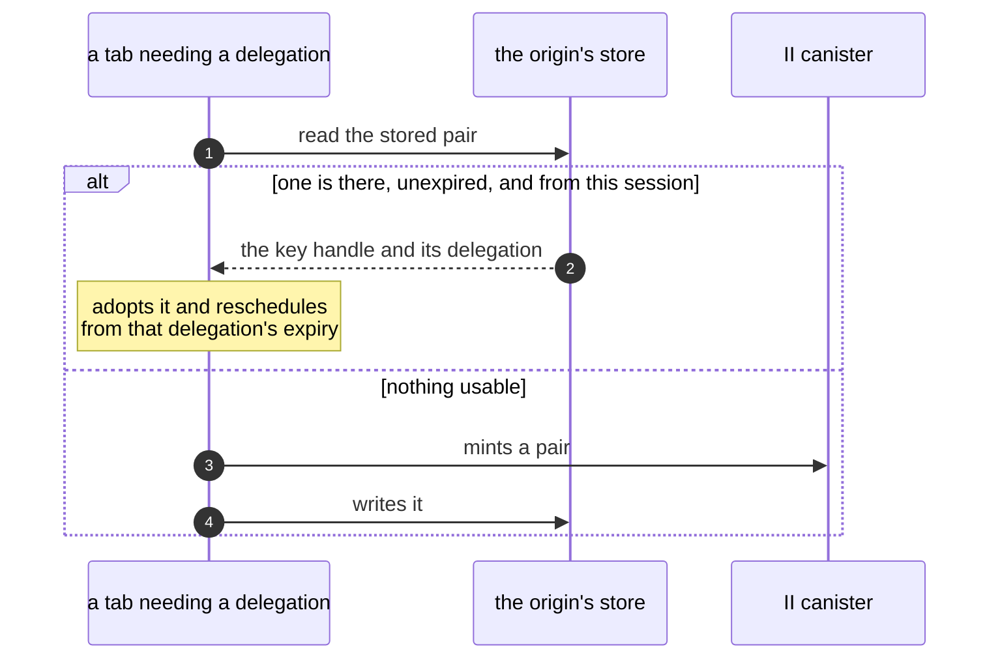
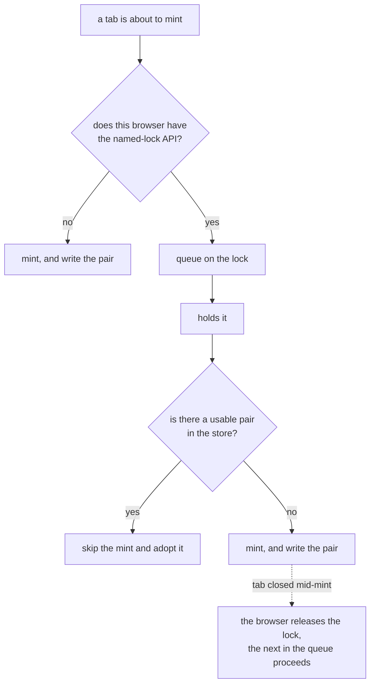
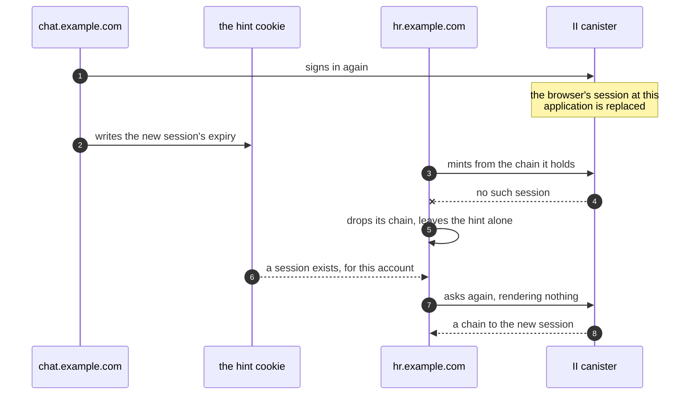

# App sessions in the client library

**Depends on:** [revocable-app-sessions.md](revocable-app-sessions.md) for the session this holds and the methods it calls, and [silent-reauth-redirect.md](silent-reauth-redirect.md) for the parameters that let a re-issue happen without rendering anything.

## Summary

An app that signs in through `@icp-sdk/auth` receives a delegation valid for as long as the user agreed to, up to 30 days, and nothing can withdraw it before it expires. Internet Identity's side of the fix is designed and built: a session the user can see and end, with short-lived delegations minted from it. No client uses those methods, so no app can reach the feature.

This holds the session inside `AuthClient`. An app calls `signIn()` and gets an identity, as it does today. Behind that identity is a session, and the delegations it signs calls with last five minutes. The library replaces them ahead of use, and a delegation is kept only where every tab of the origin can read it and only for as long as it is good for: one past its five minutes, or from a session that is no longer the stored one, is refused and deleted rather than returned. `signOut()` ends the session at the canister instead of only clearing local storage. Sessions do not appear in the public API at all, so an app never handles a session chain and nothing it can call returns one. Upgrading is not free, though: the stored record changes shape, nothing migrates it, and everyone signed in through an earlier version signs in again once.

## Context

A delegation is a signed statement that one key may act for an identity, for a stated period. The app holds the key and the delegation together, and a canister receiving a call verifies the pair without asking II anything.

Signing in today calls `icrc34_delegation`. The user picks a duration at the consent screen, II signs a delegation to the key the library generated, and the library stores both. Every call the app makes for the next few hours or weeks is signed by that key and carries that delegation.

II now offers a different arrangement. `prepare_account_session` records a session and signs a chain to a key, and `app_prepare_delegation` with `app_get_delegation` mint a delegation from that session with a ceiling of five minutes that a caller cannot raise. `app_revoke_session` deletes the session. The session itself lives at the canister, so ending it ends what can be minted from it.

## Problem

A delegation that leaks is usable for its whole life. Exfiltrated from storage, copied off a shared machine, or captured from a compromised dependency, it acts as the user until it expires, and no action by the user or by II reaches it.

Signing out is local. `signOut()` clears the library's storage, which stops that browser from using the delegation; it does not stop anyone else who has a copy.

The library cannot call II's session methods at all, so the canister work has no consumer. The guide for sharing a sign-in across sibling subdomains is written against sessions and promises that signing out of one app signs the user out of the others, which is only true once something in the client revokes.

## Out of scope

- Exposing sessions in the public API. An app receives an identity, and the session behind it is the library's business.
- The browser key proof and the browser registry. Those are II's side and are specified in [revocable-app-sessions-spec.md](revocable-app-sessions-spec.md).
- Listing an identity's sessions, or revoking another browser's, from an app. Both belong to II's settings, and an app is authenticated as one session.
- Migrating delegations stored by an earlier version of the library. Users signed in through one sign in again, as the Summary says.
- Negotiating with a provider that has no session methods. `AuthClient` is for Internet Identity, so `signIn()` asks for a session and expects one. Nothing inspects advertised scopes to decide, and a deployment predating these methods is not a case the library carries code for.
- Telling an application that its session is read-only. A session the user consented to for queries only mints delegations carrying a permissions field, and surfacing that wants an API of its own.

## Approach

### The durations this rests on

Three nested lifetimes, and two marks near the end of a delegation.

| Duration                | Value                          | Set by                                                                                 | What it bounds                                                      |
| ----------------------- | ------------------------------ | -------------------------------------------------------------------------------------- | ------------------------------------------------------------------- |
| Session lifetime        | 10 minutes to 30 days          | the app requests a ceiling, the user chooses at consent, an SSO cap narrows, II clamps | how long anything can be minted at all                              |
| App delegation lifetime | `min(5 minutes, session left)` | II, and not requestable                                                                | how long one delegation signs an app's calls                        |
| Pre-mint threshold      | 15 seconds before expiry       | this library                                                                           | when a refresh is scheduled, and when a request mints behind itself |
| Block margin            | 10 seconds before expiry       | this library                                                                           | below this a request waits for a mint                               |

### Two keys, one of them private to the library

The session key is what the session chain delegates to. It signs calls to the II canister and nothing else, because the chain carries `targets` naming only that canister. It lasts as long as the session.

The app key is what an app delegation delegates to, and it signs the calls the app actually makes. It lasts as long as that delegation, which is five minutes, because the authority is in the delegation and a key that outlives one carries none. So a mint makes a key and gets a delegation for it in one act, and the pair is replaced as one.

An app is handed an identity built on the second, and never sees either. A third value travels with them and is not a secret. The account key is the public key an app delegation is rooted at, returned by the canister as `user_key`, and the principal an app's canisters see is derived from it. It is stored beside the chain precisely because it is public.

|                   | Session key                          | App key                                           |
| ----------------- | ------------------------------------ | ------------------------------------------------- |
| Delegated to by   | the session chain, from the ceremony | an app delegation, from a mint                    |
| Signs             | calls to the II canister only        | every call the application makes                  |
| Lives for         | the session                          | its delegation, so five minutes                   |
| Stored            | IndexedDB, non-extractable           | IndexedDB, refused past its expiry or its session |
| Leaves the origin | never                                | never; other tabs read it as a handle             |

One key would be simpler, and there are two ways to try it. Letting the app sign with the session key fails on what that key is for: the session chain names the II canister in its `targets`, so an app signing with it could call II and nothing else, and the app's own canisters would refuse the delegation. It also hands the app the thing that mints, so nothing would expire by itself and revocation would be the only way to stop anything. Letting the app bring a long-lived key of its own and delegating to it once is the arrangement this design replaces, and its problem is the one the Problem section opens with.

Keeping one app key and replacing only its delegation is the closest of the three, and it buys nothing. A key with no live delegation carries no authority, so holding one across mints adds a longer-lived secret for no gain, where making a fresh one each time means rotation costs nothing beyond what the mint already does.

### Acquiring

`signIn()` asks for a session rather than a long-lived delegation, and stores the chain it gets back.

An application can say how long it is willing for that session to last, and `maxTimeToLive` keeps meaning what it meant for a delegation, which is the longest the thing being granted may live. It is a ceiling rather than a request, since what the user picks at consent wins over it, an organization's cap narrows it further, and the canister clamps the result. What an application cannot ask for is an access level, which is the user's alone. Because the chain is restricted to the II canister, a copy of it is worth nothing against the app's own canisters, and it is only useful to whoever can also reach II and mint.

### Minting

The identity an app holds carries a five-minute app delegation, minted by calling `app_prepare_delegation` and then `app_get_delegation` signed as the session. An agent keeps that identity and signs with it for hours, so the identity is what notices its own delegation expiring. It mints from inside the per-request hook the agent already calls, and one mint is in flight at a time.

One object lasts the whole session even though what it signs with is replaced every five minutes, because the object reaches the current pair instead of holding one. `getIdentity()` returns that same object and calls nothing. Handing back a fresh identity per call would not work, since an application passes one to an agent once and the agent keeps it, so a snapshot would go on signing with a delegation that had expired.

The principal an app sees comes from the account, not from the session chain, which is rooted at the session's own key. Only a mint reports it, arriving as `user_key`, so it is stored beside the chain and a reload can answer for it without minting. Every later mint returns the same key, so one that returns a different root is a failed mint and not a new principal.

### Refreshing ahead of use, never on a clock

Waiting until a delegation has expired makes one request in every five minutes pay for a mint, which an interactive app shows as a stall.

#### Why not a timer

`app_prepare_delegation` stamps the session's last-refreshed time. II's settings screen shows that stamp as "this browser used this app 3 minutes ago", and the session cap reclaims on it. A timer refreshes whether or not anyone is looking, so the column would come to mean "has a tab open". Minting only when a request needs one keeps it accurate at no cost.

#### How a refresh is scheduled

A request schedules one mint for just before its delegation runs out. Scheduling is what keeps the threshold at 15 seconds: a threshold wide enough to catch a passing request would have to be minutes wide, and every second of it is delegation life thrown away. The spec gives the arithmetic.

#### The check that keeps the schedule honest

An application that has gone quiet still has a refresh armed, and firing it would record the session as used. So a scheduled mint asks whether the delegation it is replacing signed a request, and cancels if it did not. Asked of each delegation separately, one request cannot buy an indefinite chain.

#### Coming back to a tab

A backgrounded tab has its timers throttled, so its delegation lapses unnoticed and the first click after returning waits for a mint. Returning happens a second or two before that click, long enough to cover one, so becoming visible or regaining focus mints if one is due.

This is the one trigger that cannot be assumed to exist, since `AuthClient` also runs outside a browser. It is on by default, and without it the schedule and the request paths are the whole mechanism.

#### Requests are the guarantee

A schedule is best effort, because browsers throttle timers in hidden tabs and fire them late after a machine has slept. So requests carry the guarantee, and the block margin exists because a delegation has to still be valid when a replica verifies the request it was attached to.

#### Sign-in and page load

`signIn()` mints at the end of the ceremony, so the first call after signing in is instant, and that mint is where the account principal comes from.

A page load goes through the same trigger as returning to a tab, since a load is the page becoming visible for the first time — but that trigger mints only if one is due, and since the pair is now read from the store a load usually finds one that is not. So the common page load costs nothing at the canister, where before it cost a mint every time because nothing survived the previous page. A load that finds the store empty or its pair spent still mints there and then, ahead of anything asking, so the saving never lands as a wait in front of the first click.

That gives up something worth naming. The load mint used to be what found a session revoked elsewhere before the application asked for anything; now the store looks the same whether the session is alive or was revoked from another device, and the discovery moves to the next mint. Both are inside the bound revocation already promises, because a delegation already minted keeps working for its own lifetime either way — the load simply stops being a special place where that is noticed early.

| Trigger                                  | Condition                                                            | Does the caller wait? |
| ---------------------------------------- | -------------------------------------------------------------------- | --------------------- |
| A request, comfortable life left         | more than 15 seconds remaining                                       | no mint at all        |
| A request inside the threshold           | 10 to 15 seconds remaining                                           | no, it mints behind   |
| A request under the margin, or none held | less than 10 seconds, or nothing held                                | **yes**               |
| The scheduled refresh                    | armed at 15 seconds; cancels unless that delegation signed a request | background            |
| The page becoming visible or focused     | only if a mint is due; covers the page load                          | background            |
| `signIn()`                               | at the end of the ceremony                                           | **yes**               |
| A recurring timer                        | never, and this is the thing the design rejects                      | not applicable        |

A delegation lasts `min(five minutes, what remains of the session)`, so a session with less than the block margin left is treated as over rather than minted against.

### What is shared, and how far

The session is the widest of the three and the one nothing local can see. A derivation origin is the origin an application asks II to derive its principals from, so sibling subdomains configured with the same one resolve to a single application rather than to several. A session record is keyed on the identity, that application, the account and the browser. `chat` and `hr` therefore share one record instead of holding two that behave alike, and either of them signing out ends it for both.

Everything the client holds is narrower. A chain is in `localStorage` and the app key and its delegation are in IndexedDB, both of which are per origin. So `chat`'s tabs share with each other and `hr`'s tabs share with each other, and neither set can read the other's.

The hint cookie is the only thing that crosses between siblings, and it carries a principal and the session's expiry, which is all a sibling needs in order to decide whether to try a silent re-auth.

The floor is therefore one mint per active origin, not one per domain. Two siblings open means two mints every five minutes for one session, which is inherent and not a gap to close later.

A delegation is issued to a key and each origin signs with its own, so a delegation minted for `chat` authorises nothing for `hr`. Sharing one between them would mean sharing the key it was issued to. A cookie holds bytes, so passing a key through one hands out the private material itself, to anything on the domain that can read a cookie and to every request that carries it.

Tabs of one origin pass a key handle instead, which signs without being exportable. Between origins there is nothing of the kind to pass.

| Shared thing                      | Where it lives                                                             | How far it reaches          | The consequence                                             |
| --------------------------------- | -------------------------------------------------------------------------- | --------------------------- | ----------------------------------------------------------- |
| The session                       | the II canister, one record per identity, application, account and browser | every sibling of the domain | either sibling signing out ends it for both                 |
| The session chain and session key | `localStorage` and IndexedDB                                               | one origin                  | each sibling holds its own chain to the same session        |
| The app key and its delegation    | IndexedDB, refused past its expiry or its session                          | the tabs of one origin      | the floor is one mint per active origin                     |
| The hint                          | a cookie scoped to the domain                                              | every sibling of the domain | a sibling decides whether to acquire silently, with no call |

### One delegation for every tab of an origin

Tabs of one origin share their storage, so they share the session. What they do not share is the delegation minted from it: the app key lives in memory, so each tab mints for a key of its own, and five tabs cost five update calls and five stable writes every five minutes for one person's one session.

#### Where the pair is kept

A non-extractable key can be structured-cloned, which is what lets one live in IndexedDB as a handle that signs but cannot be exported. So the pair is written there, in the store that already holds the session key, and sharing is a read rather than a conversation: a tab that needs a delegation looks at what is there before minting one.

Nothing waits on another tab to answer. That matters most where no tab can: a backgrounded tab is frozen and may be discarded outright, so a tab that asked would wait out its window and mint anyway. Reading a store works whether the other tabs are running, frozen, or gone, which is the case sharing is worth having in.

#### What makes a stored delegation safe to keep

A delegation is the thing revocation cannot reach, so putting one on disk has to answer what stops it outliving the sign-in it belongs to. Not an event: there is no dependable signal for a browser closing, and a guarantee that rests on one is a guarantee that lapses exactly when the browser is killed rather than closed.

Two checks on every read carry it instead.

The first is expiry. A stored delegation past its expiry is refused and deleted rather than returned. That bounds it at five minutes with nothing having to fire.

The second is the session it came from. The pair is stored beside the session that minted it, and a pair whose session is not the one stored now is refused and deleted. After a sign-out there is no session, so the first read removes it; after a sign-in replaced the session, the same read replaces the pair.

What this does not add is reach. The session key is already in this store, so anything able to read the pair could already mint a fresh one from the live session. What the checks add is that a pair cannot outlive the session behind it — and what remains, honestly, is an artifact on disk for as long as five minutes. That is a bound, not an erasure, and a threat that reads the disk directly rather than through this library is not one it addresses.

#### Why no tab may be in charge

Avoiding five mints wants one tab responsible for refreshing; never missing a mint wants no tab to be essential. A designated refresher gives the first and loses the second the moment that tab is closed.

So coordination may only suppress a mint, never be required for one. Every tab schedules its own refresh as if it were alone, and losing every message costs mints and never correctness.

#### The lock

A named lock makes the suppression work where the browser has one, and it takes two parts to get the saving. The lock stops tabs minting at the same time; the read inside it stops them minting at all. Without that read, five tabs waking together queue politely and then make five calls one after another, which costs the canister exactly what five at once would have. So the tab holding the lock reads the store first and mints only if what it finds is unusable, and the four behind it find the pair the first one wrote.

Queueing is ordered, so the tab that mints is whichever reached the front, and nothing elects it. A tab can be closed mid-mint and the browser releases its lock, so the next in the queue proceeds and nothing has to guess how long to wait for a tab that is not coming back.

Where the browser has no such lock every tab mints, which is the cost of no coordination and not a failure.

A request that needs a delegation now queues on the same lock rather than jumping it. Waiting costs at most the mint it would have spent anyway, and often ends with another tab's delegation instead.

### Signing out is not the same as finding out

Because one session serves every sibling, a client that discovers its own chain is dead must be careful about what it concludes. Signing in again replaces the browser's session at that application, so the sibling that did not sign in is left holding a chain to a session that no longer exists. It finds out on its next mint.

What it must not do then is remove the shared hint. The hint is the domain's, not this origin's, and the sibling that signed in has just written a fresh one. Taking it away would tell that sibling, correctly by its own rules, that the session it just obtained is gone.

The two acts differ in one respect.

|                             | Signing out                  | Finding out the chain is stale        |
| --------------------------- | ---------------------------- | ------------------------------------- |
| What happened               | the user ended the sign-in   | a sibling signed in and replaced it   |
| Discovered by               | `signOut()`                  | a mint returning `NoMatchingSession`  |
| The session at the canister | revoked                      | already gone                          |
| Local chain and session key | removed                      | removed                               |
| The shared hint             | **removed**                  | **left alone**                        |
| What the user sees          | signed out across the domain | nothing, and a silent re-auth follows |

The sibling recovers without the user seeing anything:

Recovery works because that record is keyed on the application, which for siblings is the derivation origin they share, so `chat`'s ceremony had one record to replace rather than one per origin. The ceremony `chat` ran replaced that one record, so the request `hr` makes finds the new one instead of nothing.

A hint can outlive the session it describes, after a revocation from settings for instance, so a sibling acting on one has to be able to fall back to asking the user; it is a hint and not an authority. And two siblings asking at once is safe, because asking without rendering never creates a session: both are handed a chain from the same record, and neither replaces anything.

### Where the mint calls go

This is the first thing in the library that calls a canister at all, and everything until now left the network to the application. So Internet Identity is configured as two values, the URL a ceremony renders at and the canister that mints. They are not the same address. A custom domain can front the mainnet canister, and a local deployment changes both. Each half defaults to its mainnet value, so an application deploying against mainnet configures neither, and options for the agent making the calls are handed to it as its own.

Deriving any of this from the authorize URL was the alternative, and it reads well until an application needs a deployment of its own: the origin of a URL is not a promise about which canister answers there, and taking the canister id out of the session chain would leave the library reading its own configuration out of a credential.

| Setting       | Default                  | Used for                                              |
| ------------- | ------------------------ | ----------------------------------------------------- |
| Authorize URL | the mainnet ceremony URL | rendering the sign-in ceremony                        |
| Canister id   | the mainnet II canister  | minting, revoking, and checking the chain's `targets` |

The chain's `targets` are a check and not a source. A session chain names that canister and nothing else, so a chain naming anything else, or nothing at all, is refused before the first call. The unrestricted case matters most, because the session key signs with that chain and accepting one would leave the library holding a credential good for any call.

### What is stored

The session is stored and the app delegation is not. Keeping an artifact that dies in five minutes buys nothing and leaves a stale one to reconcile on the next load.

The store is named for that. A session is what delegations are minted _from_, it outlives any one of them, and it carries the account's key beside the chain, so a restored session can return its principal without minting. A store shaped around a bare chain has nowhere to keep that key.

| What                                      | Where                                  | Survives a reload | Removed by                           |
| ----------------------------------------- | -------------------------------------- | ----------------- | ------------------------------------ |
| Session chain and account key, one record | `localStorage`, per origin             | yes               | signing out, and finding out         |
| Session key                               | IndexedDB, non-extractable             | yes               | signing out, and finding out         |
| App key and its delegation                | memory, shared across an origin's tabs | no                | the tab closing, expiry, replacement |
| The hint                                  | a cookie scoped to the domain          | yes               | signing out only                     |

### The cross-subdomain hint carries the session's expiry

`CookieSessionStorage` derives its hint from what it is handed. This is why what it is handed is a session rather than a delegation: given a five-minute app delegation, the hint would announce to a sibling subdomain that the session expires in five minutes, and the sibling would decide there was nothing worth resuming. The hint takes the session's expiry, because what a sibling is deciding is whether a session exists to re-issue from.

### Two kinds of failure, told apart

`NoMatchingSession` means the session is not there: revoked, expired, or pruned. Anything else leaves the session possibly alive, so the library keeps it and lets the caller retry. A transient network fault must not sign a user out.

| Failure                          | What it means            | Local session | What the caller sees         |
| -------------------------------- | ------------------------ | ------------- | ---------------------------- |
| `NoMatchingSession`              | the session is gone      | discarded     | reported signed out          |
| Anything else, serving a request | the session may be alive | kept          | the failure, to retry        |
| Anything else, in the background | the session may be alive | kept          | nothing; the held pair stays |

A mint returning `NoMatchingSession` is how the library finds out, which is why a page load starts one in the background. The mint it needs anyway is also the check.

### Ending

`signOut()` calls `app_revoke_session` before clearing local state, so access ends within one app-delegation lifetime instead of running to the session's expiry. It clears local state even when the call fails, because a user who pressed sign out must not remain signed in on the device in front of them.

## Specification

[client-app-sessions-spec.md](client-app-sessions-spec.md) states the requirements, the call sequences, and the constants.

## Implementation stages

1. **Mint app delegations from a session chain.**
   The refreshing identity, its failure classification, and the shared in-flight mint. Nothing produces a session chain yet, so this changes no behaviour and is safe to release on its own.
2. **Acquire a session at sign-in, and carry the session's expiry in the hint.**
   This is the stage that turns the feature on, and the two parts belong together: the hint becomes wrong the moment a five-minute delegation is what a sibling reads.
3. **Revoke at sign-out.**
   Harmless before stage 2 and only meaningful after it.
