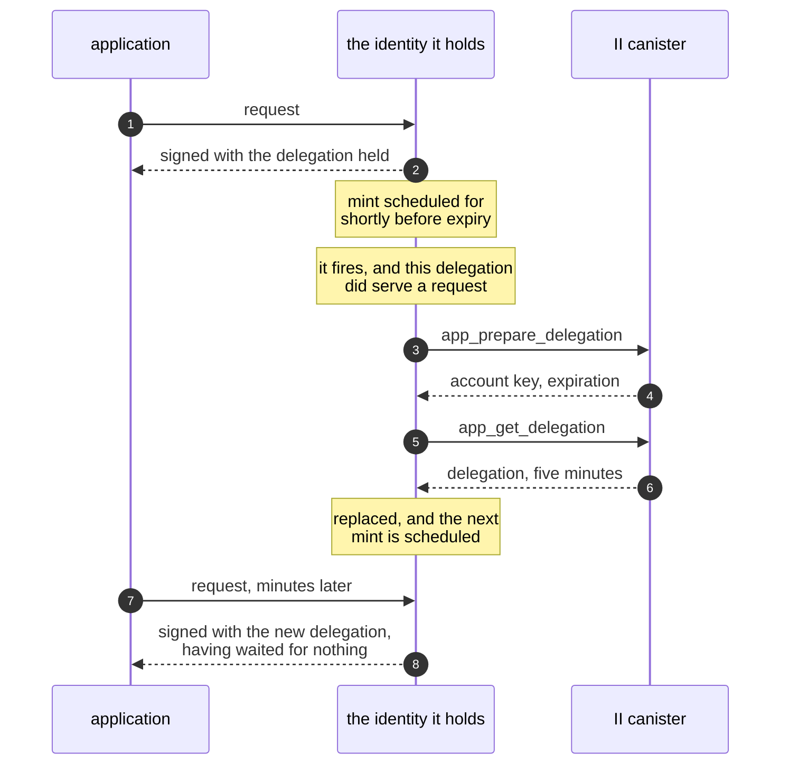
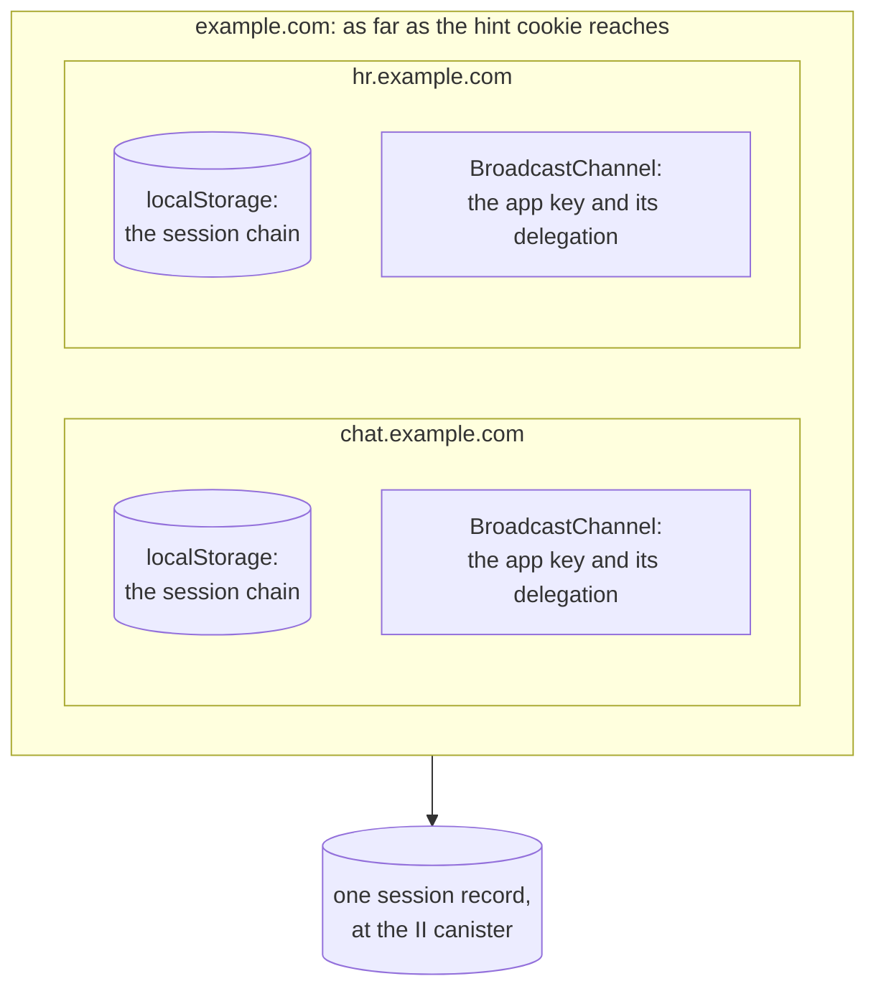
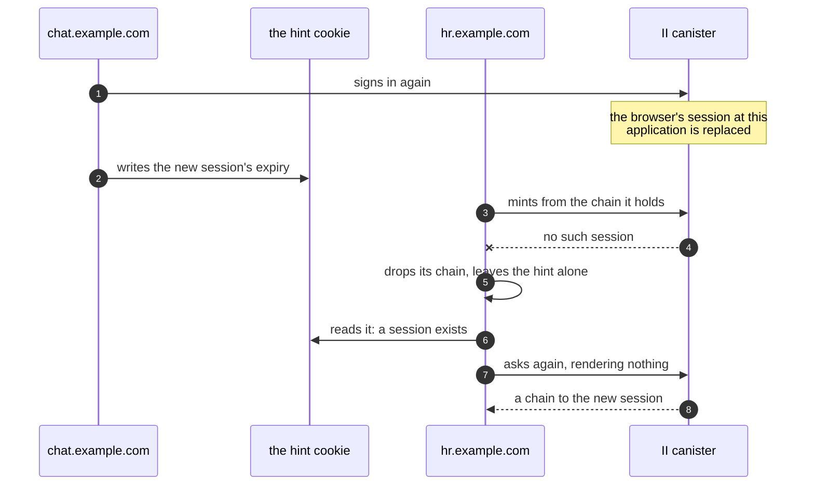

# App sessions in the client library

**Depends on:** [revocable-app-sessions.md](revocable-app-sessions.md) for the session this holds and the methods it calls, and [silent-reauth-redirect.md](silent-reauth-redirect.md) for the parameters that let a re-issue happen without rendering anything.

## Summary

An app that signs in through `@icp-sdk/auth` receives a delegation valid for as long as the user agreed to, up to 30 days, and nothing can withdraw it before it expires. II's side of the fix is designed and built: a session the user can see and end, with short-lived delegations minted from it. No client uses those methods, so no app can reach the feature.

This holds the session inside `AuthClient`. An app calls `signIn()` and gets an identity, as it does today. Behind that identity is a session, and the delegations it signs calls with last five minutes: it obtains one when a call needs one and replaces it as it ages, rather than always holding one. `signOut()` ends the session at the canister instead of only clearing local storage. Sessions do not appear in the public API at all: an app never handles a session chain, and nothing it can call returns one.

## Context

A delegation is a signed statement that one key may act for an identity, for a stated period. The app holds the key and the delegation together, and a canister receiving a call verifies the pair without asking II anything. That is what makes a delegation cheap to use and impossible to withdraw.

Signing in today calls `icrc34_delegation`. The user picks a duration at the consent screen, II signs a delegation to the key the library generated, and the library stores both. Every call the app makes for the next few hours or weeks is signed by that key and carries that delegation.

II now offers a different arrangement. `prepare_account_session` records a session and signs a chain to a key, and `app_prepare_delegation` with `app_get_delegation` mint a delegation from that session with a ceiling of five minutes that a caller cannot raise. `app_revoke_session` deletes the session. The session itself lives at the canister, so ending it ends what can be minted from it.

## Problem

Three things follow from a delegation that cannot be withdrawn, and the third is what makes this urgent rather than merely desirable.

A delegation that leaks is usable for its whole life. Exfiltrated from storage, copied off a shared machine, or captured from a compromised dependency, it acts as the user until it expires, and no action by the user or by II reaches it.

Signing out is local. `signOut()` clears the library's storage, which stops that browser from using the delegation; it does not stop anyone else who has a copy.

The library cannot call II's session methods at all, so the canister work has no consumer. The guide for sharing a sign-in across sibling subdomains is written against sessions and promises that signing out of one app signs the user out of the others, which is only true once something in the client revokes.

## Out of scope

- Exposing sessions in the public API. An app receives an identity, and the session behind it is the library's business.
- The browser key proof and the browser registry. Those are II's side and are specified in [revocable-app-sessions-spec.md](revocable-app-sessions-spec.md).
- Listing an identity's sessions, or revoking another browser's, from an app. Both belong to II's settings, and an app is authenticated as one session.
- Migrating delegations stored by an earlier version of the library. The storage change that carries this is already a breaking one.
- Negotiating with a provider that has no session methods. `AuthClient` is for Internet Identity, so `signIn()` asks for a session and expects one. Nothing inspects advertised scopes to decide, and a deployment predating these methods is not a case the library carries code for.
- Telling an application that its session is read-only. A session the user consented to for queries only mints delegations carrying a permissions field, and surfacing that wants an API of its own.

## Approach

### Two keys, one of them private to the library

The session key is what the session chain delegates to. It signs calls to the II canister and nothing else, because the chain carries `targets` naming only that canister. It lasts as long as the session.

The app key is what an app delegation delegates to, and it signs the calls the app actually makes. It lasts as long as that delegation, which is five minutes, because a key outliving its delegation is worth nothing: the authority is in the delegation. So a mint makes a key and gets a delegation for it in one act, and the pair is replaced as one. Key rotation comes free from that rather than from a policy.

An app is handed an identity built on the second, and never sees either.

### Acquiring

`signIn()` asks for a session rather than a long-lived delegation, and stores the chain it gets back.

An application can say how long it is willing for that session to last, and `maxTimeToLive` keeps meaning what it meant for a delegation: the longest the thing being granted may live. It is a ceiling rather than a request, since what the user picks at consent wins over it, an organization's cap narrows it further, and the canister clamps the result. What an application cannot ask for is an access level, which is the user's alone. Because the chain is restricted to the II canister, a copy of it is worth nothing against the app's own canisters, and it is only useful to whoever can also reach II and mint.

### Minting

The identity handed to the app carries a five-minute app delegation, obtained by calling `app_prepare_delegation` and then `app_get_delegation` signed as the session. An agent holds that identity and signs every request with it, possibly for hours, so the identity is what has to notice its delegation ageing: it mints from inside the per-request hook the agent already calls, and one mint is in flight at a time, so several requests arriving together wait on the same round trip.

The identity is one object for the life of the session even though what it signs with is replaced every five minutes, which works because the object reaches the current pair rather than holding one. That is also why an app can hold the identity and never notice a rotation: it never sees the app key, and the principal it does see comes from the account, which does not change.

It is the object that refreshes. `getIdentity()` returns it without calling anything. The alternative, having `AuthClient` mint and hand back a fresh identity on each call, fails on how identities are actually used: an application passes one to an agent once, and the agent keeps it. A snapshot of a single delegation would go on signing with that delegation until it expired, and no later call to `AuthClient` would reach the agent still holding the old one.

The principal an app sees is not in the session chain. That chain is rooted at the session's own key, derived from the session seed, while an app delegation is rooted at the account's key. They are different principals, and only the second is what the app's canisters will see. The ceremony computes it and the canister returns it as `account_principal`, but the result the app receives over the transport carries only the chain, so the library learns the account principal from the first mint, where it arrives as `user_key`.

It is therefore recorded alongside the session chain rather than recomputed. A reload can answer for the principal from what it stored, without a mint, and `getPrincipal()` stays synchronous. Every later mint returns the same key, since the account seed does not change, so a mint that returns a different root is a failed mint rather than a new principal.

### Refreshing ahead of use, never on a clock

Waiting until a delegation has expired means one request every five minutes pays for a mint, which an interactive app shows as a stall. Refreshing on a timer avoids that and is worse for two reasons, one of which has nothing to do with cost.

`app_prepare_delegation` stamps the session's last-refreshed time, and that stamp is what II's settings screen shows the user as "this browser used this app 3 minutes ago", and what the session cap reclaims on. A timer refreshes whether or not anyone is looking at the tab, so the column stops meaning "in use" and starts meaning "has a tab open", which is not the reading the user is being offered. Minting only when a request needs one keeps that signal honest at no cost.

So requests are what arm a refresh, and the refresh itself is scheduled for the moment it is needed. A request from an active application schedules one mint for just before its delegation runs out, rather than minting early or waiting for another request to arrive at the right time.

Scheduling it, rather than minting whenever a request happens to arrive with little life left, is what keeps the threshold small. A threshold that has to catch a passing request must be wide enough that one turns up inside it, and everything it discards is paid for: minting before a delegation expires throws away the rest of its life, so an active session consumes lifetime at `TTL / (TTL - threshold)`. Two minutes of threshold turns a five-minute refresh into a three-minute one and adds two thirds again to the update calls and stable writes of every active session, permanently. A scheduled mint only has to cover the mint itself, which is seconds, and an active session then refreshes at nearly the floor the canister sets.

What the application sees is nothing at all. A mint lands between two of its requests, in the gap where the delegation it already holds is still good:

The schedule needs one check, or it becomes the timer this section rejects: an application that goes quiet still has a refresh armed, and firing it would stamp the session as used. So a scheduled mint asks whether the delegation it is about to replace signed a request, and cancels if it did not.

Signing a request is the only thing that counts as use, because it is the only activity the library can see, and the window is that one delegation's lifetime rather than any longer history. Nothing here needs a constant or a window to tune.

Asking it of each delegation separately is what stops one request buying an indefinite chain. A refresh happens only if the delegation being retired was used, and the delegation it produces has to earn the next refresh the same way. An application making a request at least once per delegation lifetime therefore refreshes for as long as that holds, while one that goes quiet refreshes exactly once more and then lets the replacement lapse unused.

One trigger is worth adding beyond requests, because the case it covers is ordinary. A tab in the background has its timers throttled, so its delegation lapses while nobody is looking, and the user's first click after coming back waits for a mint. Coming back to a tab happens a second or two before that click, which is room enough to hide one, so becoming visible or regaining focus starts a mint if one is due. The identity still decides whether it is due, so a glance at a tab with a healthy delegation costs nothing.

That trigger is the one part of this that cannot be assumed to exist. `AuthClient` runs outside a browser as well, so the identity holds no reference to a DOM and the listening lives in a separable piece constructed only where those APIs are present, in the way idle detection already is. It is on by default and can be turned off. Where there is no DOM, the schedule and the request paths are the whole mechanism, and nothing is incorrect without it: a request after a long gap waits for its mint.

Requests remain the guarantee, because a schedule is best effort: browsers throttle timers in tabs nobody is looking at and fire them late after a machine has slept. A request that finds its delegation inside the threshold starts a mint in the background and is served from what it already has, and one that finds it below the block margin waits. The block margin covers a request's flight time, since the delegation has to still be valid when the replica verifies it.

Minting at the end of sign-in is not only about latency: it is where the account principal comes from, so an application that signs in and reads its principal without making a request gets an answer.

Two stalls are worth removing outright rather than absorbing, and both are hidden inside something the user is already waiting for. `signIn()` mints at the end of the ceremony, so the first call after signing in is instant. A page load that finds a stored session mints in the background while the page starts, without making `getIdentity()` wait for it.

A delegation lasts `min(five minutes, what remains of the session)`, so near the end of a session a mint returns something shorter than the margin it was meant to satisfy. Refreshing on remaining life alone would then mint, find the result already too short, and mint again without end, each iteration an update call. A session with less than the block margin left is over, and the library treats it as over rather than minting against it.

### What is shared, and how far

Three things are shared, and each reaches a different distance. Almost everything
below follows from that.

The session is the widest of the three and the one nothing local can see. Sibling
subdomains sharing a derivation origin resolve to one application, and a session
lives at an identity, an application, an account and a browser, so `chat` and `hr`
are not two sessions that behave alike: they are one session, and either of them
signing out ends it for both.

Everything the client holds is narrower. A chain is in `localStorage`, which is per
origin, and the app key and its delegation ride a `BroadcastChannel`, which is also
per origin. So `chat`'s tabs coordinate with each other and `hr`'s tabs coordinate
with each other, and the two sets cannot speak at all.

The hint cookie is the only thing that crosses between siblings, and it carries a
principal and the session's expiry, which is all a sibling needs in order to decide
whether to try a silent re-auth.

**One consequence to be plain about: the floor is one mint per active origin, not
one per domain.** Two siblings open means two mints every five minutes for one
session, and that is not an oversight to be optimised away later.

A delegation is issued to a key, and each origin signs its own calls with a key of
its own, so a delegation minted for `chat` authorises nothing for `hr`. Sharing one
delegation between them would mean sharing the key it was issued to, and a key is
the one thing a cookie must never carry: a cookie holds bytes, so sharing a key
through one means handing out the private material itself, to anything on the domain
that can read a cookie and to every request that carries it.

This is exactly why a channel can do what a cookie cannot. Tabs of one origin pass
a key handle, not key material, and the handle signs without being exportable. There
is no such thing to pass between origins.

### One delegation for every tab of an origin

Tabs of one origin share their storage, so they share the session. What they do not
share is the delegation minted from it: the app key lives in memory, so each tab
mints for a key of its own, and five tabs cost five update calls and five stable
writes every five minutes for one person's one session.

They can share instead. A non-extractable key survives a structured clone, which
is what lets one live in IndexedDB, and the same property lets it cross a
`BroadcastChannel` to another tab as a handle that signs but cannot be exported.
What crosses is the pair, because that is what a mint produces and what expires
together. A tab opening asks on the channel, a tab already running answers with the
pair it holds, and the asking tab adopts it without minting. Nothing is persisted,
so a delegation still never outlives the tabs that hold it and there is nothing
stale to reconcile on a load.

Sharing a whole pair is also what makes tabs converge without anything electing a
winner. Two tabs that end up with a pair each, because a browser restored them in
the same instant with neither able to answer the other, are not stuck that way: the
next mint produces one pair, its broadcast reaches both, and both adopt it. So
divergence costs an extra mint or two and lasts at most one delegation's lifetime,
where sharing a key alone would have left an origin permanently minting once per
tab.

Replacing a pair cannot disturb a request already on its way. A request is signed
and its delegation attached in the same act, so what is in flight carries a
signature and a delegation that match each other, whatever the tab holds by the
time a replica checks it.

The hard part is not the sharing. It is that the two things one wants pull in
opposite directions: not minting five times wants a single tab responsible for
refreshing, and not failing to mint at all wants no tab to be load-bearing. A
designated refresher satisfies the first and fails the second the moment that tab
is closed.

**So coordination may only ever suppress a mint, never be required for one.** Every
tab schedules its own refresh, as it would alone. What the channel adds is the
chance to notice that the work is already done, or being done, and stand down. If
every message were lost the tabs would each mint, which is the cost of doing
nothing at all rather than a failure; and no tab waits on another to act.

A named lock is what makes the suppression work, where the browser has one. A tab
about to mint takes it, and tabs that wake in the same moment queue behind it
rather than each starting a mint of their own. Whoever holds it looks again before
acting, because by then the delegation may already have been replaced, in which
case there is nothing left to do.

The lock also settles the case a schedule cannot. A tab holding it can be closed
mid-mint, and the browser releases a lock when the tab holding it goes away, so the
next tab in the queue simply proceeds. Nothing has to guess how long to wait for a
tab that is not coming back, which a timeout would have had to.

Where the browser has no such lock every tab mints, which is the cost of no
coordination rather than a failure. That is the rule above again: the lock may be
relied on for how much this costs and never for whether it works.

A request that needs a delegation now queues on the same lock rather than jumping
it. Waiting costs at most one mint, which is what it would have spent minting
anyway, and it often ends with another tab's fresh delegation and no mint at all.

### Signing out is not the same as finding out

Because one session serves every sibling, a client that discovers its own chain is
dead must be careful about what it concludes. Signing in again replaces the
browser's session at that application, so the sibling that did not sign in is left
holding a chain to a session that no longer exists. It finds out on its next mint.

What it must not do then is remove the shared hint. The hint is the domain's, not
this origin's, and the sibling that signed in has just written a fresh one. Taking
it away would tell that sibling, correctly by its own rules, that the session it
just obtained is gone.

So the two are separate acts. Signing out removes the local session and the shared
hint, because the user asked for the sign-in to end. Finding out that a chain is
stale removes the local session only.

That leaves the discovering sibling in exactly the state silent re-auth exists for,
and it recovers without the user seeing anything:

The recovery works for a reason worth stating, because it looks like luck
otherwise. II keeps its own record of a session under the identity, the account and
the _effective_ origin, which for siblings is the derivation origin they share. So
the ceremony `chat` ran replaced that one record, and the request `hr` makes finds
the new one rather than nothing.

Two things follow. A hint can outlive the session it describes, after a revocation
from settings for instance, so a sibling acting on one has to be able to fall back
to asking the user; it is a hint and not an authority. And two siblings asking at
once is safe, because asking without rendering never creates a session: both are
handed a chain from the same record, and neither replaces anything.

### Where the mint calls go

This is the first thing in the library that calls a canister at all. Everything until now produced an identity and left the network to the application, which is why nothing in it is configured with a host.

So Internet Identity is configured as two values rather than one: the URL a ceremony renders at, and the canister that mints. They are not the same address. A custom domain can front the mainnet canister, and a local deployment changes both. Each half defaults to its mainnet value, so an application deploying against mainnet configures neither, and options for the agent making the calls are handed to it as its own.

Deriving any of this from the authorize URL was the alternative, and it reads well until an application needs a deployment of its own: the origin of a URL is not a promise about which canister answers there, and taking the canister id out of the session chain would leave the library reading its own configuration out of a credential.

The chain's `targets` still matter, as a check rather than a source. A session chain names that canister and nothing else, and a chain that names anything else, or nothing at all, is refused before the first call. The unrestricted case is the one worth refusing hardest: the session key signs with that chain, so accepting one would leave the library holding a credential good for any call rather than the two it makes.

### What is stored

A session, and not the app delegation. Keeping an artifact that dies in five minutes buys nothing, and it would leave a stale one to reconcile on the next load.

What the client stores is named for that: a session store rather than a delegation store. The distinction is not cosmetic, because a session is no longer a delegation. It is what a delegation is minted _from_, it outlives any one of them, and it carries the account's key alongside the chain, which is what lets a restored session answer for its principal without minting. A store shaped around a bare chain has nowhere to put that.

### The cross-subdomain hint carries the session's expiry

`CookieSessionStorage` derives its hint from what it is handed. This is why what it is handed is a session rather than a delegation: given a five-minute app delegation, the hint would announce to a sibling subdomain that the session expires in five minutes, and the sibling would decide there was nothing worth resuming. The hint takes the session's expiry, because what a sibling is deciding is whether a session exists to re-issue from.

### Two kinds of failure, told apart

A mint is a canister call, so it fails for two very different reasons and the library has to distinguish them.

`NoMatchingSession` means the session is not there: revoked, expired, or pruned. The library discards its local state and reports the user as signed out, because that is what has happened.

An `InternalCanisterError`, a network failure, or an unreachable boundary node means the session may well be alive. The library keeps it and lets the caller retry. Signing a user out because their train entered a tunnel is worse than a call that failed.

The library never asks whether a session is still alive. It tries to use it, and a mint that comes back with `NoMatchingSession` is the answer. That is why a page load starts a mint in the background rather than probing first: the mint it needs anyway is also the check, so there is one mechanism where there could have been two.

### Ending

`signOut()` calls `app_revoke_session` before clearing local state, so access ends within one app-delegation lifetime instead of running to the session's expiry. It clears local state even when the call fails, because a user who pressed sign out must not remain signed in on the device in front of them.

## Specification

[client-app-sessions-spec.md](client-app-sessions-spec.md) states the requirements, the call sequences, and the constants.

## Implementation stages

1. **Mint app delegations from a session chain.**
   The refreshing identity, its failure classification, and the shared in-flight mint. Nothing produces a session chain yet, so this changes no behaviour and is safe to release on its own.
2. **Acquire a session at sign-in, and carry the session's expiry in the hint.**
   This is the stage that turns the feature on, and the two parts belong together: the hint becomes wrong the moment a five-minute delegation is what a sibling reads.
3. **Revoke at sign-out.**
   Harmless before stage 2 and only meaningful after it.
