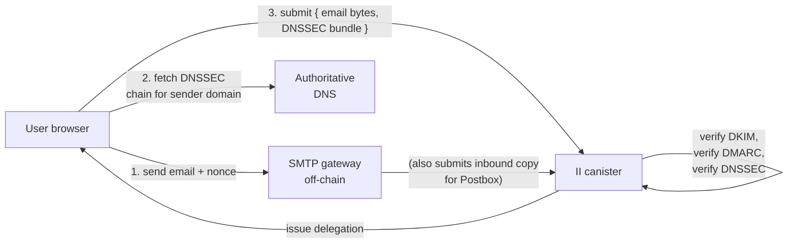
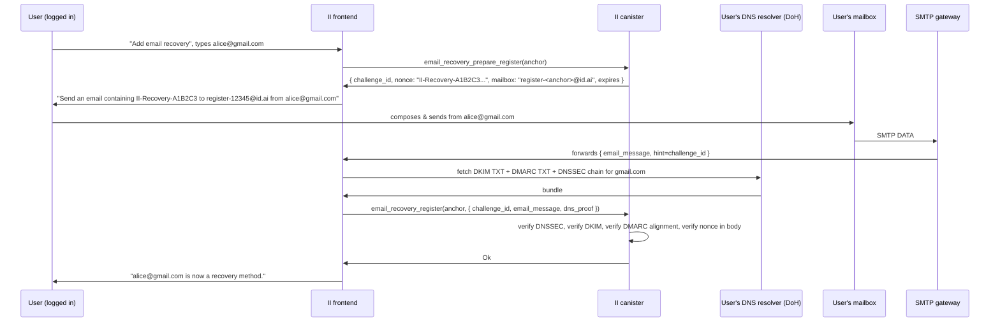

# Email-based identity recovery for Internet Identity

**Status:** Draft — RFC for review
**Last updated:** 2026-05-04
**Tracking PoC:** [#3760](https://github.com/dfinity/internet-identity/pull/3760) (DKIM postbox, will not be merged)
**Targets:** A new production-grade PR series, not a follow-up to #3760.

---

## 1. Background

Internet Identity currently offers two recovery options when a user can no longer authenticate with any of their registered passkeys:

1. **Recovery phrase** — a BIP-39-style seed phrase the user is responsible for storing offline.
2. **Recovery device** — a separate WebAuthn key bound to the same anchor.

Both require the user to have *prepared* a recovery method before losing access, and both require the user to retain *something* (paper, hardware) outside the device that is now unusable. We hear from users that both fall through in practice — phrases get lost, recovery devices live next to the primary device and are lost together.

Email is the recovery channel almost every user already has and almost every user can reach from any browser. The PoC PR [#3760](https://github.com/dfinity/internet-identity/pull/3760) added enough plumbing to *receive* DKIM-signed emails inside the canister and view them in a "Postbox" tab, but it deliberately did not wire emails into the recovery surface, and several DKIM/DMARC correctness items were deferred.

This doc proposes the production design that supersedes the PoC. The PoC PR will be closed; the work below should land as a fresh PR series against `main`.

### What the PoC got right

- Candid surface for the SMTP gateway (`smtp_request`, `smtp_request_validate`).
- Stable storage layout for received messages (`smtp_postbox`, memory ID 23).
- Per-anchor pruning, recipient-format validation, body/header bounds.
- A first-pass DKIM verifier with a `DkimCheck` step-by-step result so the UI can show *why* a signature did or didn't verify.
- The shape of `DkimVerificationStatus { Verified | Unverified | Pending }` decoupled from storage.

### What the PoC explicitly deferred

From the PR review thread (sea-snake's comments and aterga's replies) the following were left for a follow-up:

| Area | Status in PoC | Spec gap |
|---|---|---|
| Trusted body retention (`l=`) | Stores full body, hashes only signed prefix | Storage may include bytes not covered by the signature |
| DKIM-Signature parser | Naive split on `;` and `=` | RFC 6376 §3.5 allows folding, arbitrary whitespace, multiple `b=`-like substrings inside other tag values |
| DNS TXT record parser | Tolerant of `P=` casing only | RFC 6376 §3.6.2.2 allows folding across multiple TXT chunks, arbitrary whitespace |
| Header canonicalization | "simple" rebuilt from parsed `(name, value)` | RFC 6376 §3.4.1 requires the *exact original* bytes; gateway contract change required |
| Policy tags `i=`, `k=`, future-dated `t=` | Not enforced | RFC 6376 §3.5 / §3.6.1 |
| DMARC alignment | Not implemented | RFC 7489 §3 |
| Service worker `postMessage` origin check | Missing | CodeQL alert #127 |

This document covers all of the above plus two architectural changes the PoC did not attempt:

- replacing DoH HTTP outcalls with **client-supplied DNSSEC-verified DNS records**;
- adding **email recovery** as a first-class authn method.

---

## 2. Goals & non-goals

**Goals**

- A user can register an email address as a recovery method, and use it to regain access if they lose every other authn method.
- DKIM verification is RFC-6376-compliant against the corpus of mainstream senders (Gmail, iCloud, Outlook, Fastmail, Proton, ProtonMail, Tutanota, AWS SES, SendGrid, Postmark, Mailgun).
- DMARC alignment is checked and enforced according to the sender's published policy.
- The canister's DKIM/DMARC verification is **fully deterministic** and does not depend on HTTPS outcalls during the recovery flow.
- A registered email holder can prove control of that address with a single signed email; the canister does not have to trust the SMTP gateway for *anything other than message delivery*.
- The Postbox feature can ride on the same primitives but is gated independently.

**Non-goals**

- Sending email *from* the canister. Outbound (e.g., notifications, recovery codes) is delivered by an off-chain service that need not be in the trust path.
- Replacing existing recovery options. Email recovery is an *additional* `AuthnMethodPurpose::Recovery` method; users can still register phrases and recovery devices.
- Protecting against a fully compromised mailbox provider. If Google's DKIM signing key is exfiltrated, every Gmail-recovery anchor is at risk; we accept that and document it.
- Verifying *encrypted* (S/MIME, PGP) email contents. We verify DKIM-signed envelopes only.

---

## 3. Threat model

**Trusted parties**

- The user's mailbox provider (Gmail, iCloud, …): trusted to keep the DKIM private key secret and to reject spoofed inbound mail destined for the user.
- The DNS authoritative servers for the sender's domain: trusted to publish honest DKIM/DMARC records, *and* trusted to sign them with DNSSEC.
- IANA / ICANN root KSK: trusted as the DNSSEC trust anchor.

**Untrusted parties**

- The SMTP-receiving gateway. Can drop, delay, reorder, or fabricate inbound messages. Cannot fabricate a DKIM signature without the sender's private key. Cannot fabricate a DNSSEC chain without the sender's signing keys.
- The DNSSEC resolver client (could be the SMTP gateway itself or the user's browser). Can lie about *which* records exist; cannot fabricate a valid DNSSEC chain.
- Boundary nodes / DoH providers. Same — used only as transports if used at all.

**Attacker capabilities we defend against**

1. *Spoofed `From:` header* — defended by DMARC alignment with verified DKIM `d=`.
2. *DKIM signature replay* — defended by `x=` expiration plus an ingest-time freshness window plus a per-anchor used-nonce set during recovery.
3. *DNS poisoning* — defended by DNSSEC validation against the bundled root KSK.
4. *Length-extension via `l=` tag* — defended by retaining only the signed prefix in storage.
5. *Mass enumeration of email→anchor mappings* — defended by storing only a salted hash and never returning anchors by email lookup over a public surface.

**Attacker capabilities we do *not* defend against**

- A user who voluntarily forwards their own DKIM-signed challenge email to an attacker. Standard phishing concern; mitigated by UX (challenge email's body says "do not forward").
- A SIM-swap-equivalent at the email provider (attacker controls the inbox). Out of scope.
- A registrar or TLD compromise that lets an attacker rotate DNSKEYs. The DNSSEC chain still validates, but for a malicious key. This is the same trust assumption every DNSSEC consumer makes.

---

## 4. High-level architecture



The key architectural shift versus the PoC is the path through which the canister learns the sender's DKIM/DMARC DNS records. The PoC fetched them via an HTTPS outcall to `dns.google` with a transform function for replica consensus. The new design has the *caller* fetch DNS, fetch the DNSSEC proof chain, and pass both to the canister, which validates the chain cryptographically.

This buys us:

- **Determinism without consensus tricks.** No HTTP transform, no `max_response_bytes`, no boundary-node trust.
- **No cycles spent on outcalls** during recovery, which is the latency-sensitive path.
- **Full transparency.** The DNS records the canister verified are part of the audit trail; the gateway/user can replay the call against any node.
- **Recovery works even if all DoH providers go down.** The user's browser fetches DNS via the OS resolver; we just need a DNSSEC-aware client (a small WASM library, see §7.4).

We pay for it in:

- **Caller complexity.** The user's browser (or the SMTP gateway, for Postbox) has to assemble the DNSSEC chain. We ship a TS library that wraps this.
- **No DNSSEC, no email recovery.** Domains that don't sign their zones cannot be used. As of 2026-05, this includes ~25% of mainstream consumer mailbox domains. We surface this clearly in the UI at registration time.

---

## 5. Component A — Production-grade DKIM verifier

The PoC's `src/internet_identity/src/dkim.rs` will be replaced rather than incrementally fixed. A naïve manual parser is the wrong shape for the spec — folding, multi-chunk TXT records, and byte-exact canonicalization push us toward a vetted parser.

### 5.1 Library choice

**Recommendation:** adopt [`mail-auth`](https://github.com/stalwartlabs/mail-auth) (Apache-2.0, used by Stalwart and others) as the DKIM and DMARC engine. Reasons:

- Pure Rust, no `std::net` dependencies, builds for `wasm32-unknown-unknown`.
- Exposes a `Resolver` trait we can implement against pre-fetched `(name, type) → bytes` records — perfect fit for §7's DNSSEC-arg pattern.
- Implements DKIM (RFC 6376), DMARC (RFC 7489), and ARC; we get items A, B, and the multi-signature behaviour the PoC already added.
- Test corpus from the project plus our own from §10.

**Rejected alternatives**

- `cfdkim` — solid but tightly coupled to `tokio-trust-dns`, hard to unhook from network IO.
- Continue rolling our own — every reviewer comment in the PoC PR is some shape of "you can't safely roll your own canonicalization parser." Agree.

### 5.2 Gateway contract change: raw header bytes

DKIM "simple" canonicalization signs the *exact original bytes* of each signed header line. The PoC SMTP gateway delivers headers as `(name: String, value: String)` pairs, which loses the original whitespace, folding, and the exact byte sequence after the colon.

The new Candid contract:

```candid
// Replaces SmtpHeader { name; value } with the original header line.
type SmtpHeaderRaw = blob;  // exact bytes of "Name: value\r\n", folding preserved

type SmtpMessage = record {
    headers : vec SmtpHeaderRaw;  // in receipt order, top to bottom
    body    : blob;               // exact bytes after CRLF CRLF separator
};
```

The interface keeps a parsed accessor (`SmtpMessageParsed`) for non-cryptographic UI use, but the verifier always operates on the raw blobs. A small parser inside the canister extracts `From:`, `To:`, `Subject:`, etc. for display — but the bytes that go to DKIM are untouched.

### 5.3 Trusted-body retention (`l=`)

When a DKIM signature includes `l=N`, only the first N bytes of the canonicalized body are signed. Anything past byte N is unauthenticated and could have been appended by a forwarder or an attacker.

**Storage rule:** `StorableEmail::body` is the *signed prefix* only, decanonicalized back to displayable text. The unsigned tail is dropped. If multiple signatures verify, we keep the prefix covered by the longest of them. We also persist `body_signed_len: Option<u32>` so the UI can show "(message truncated; remaining bytes were not signed)".

This also closes a subtle storage-bound issue: the PoC's `MAX_BODY_BYTES` was checked against the raw body, but `from_utf8_lossy` could expand U+FFFD past the bound. Operating on the canonicalized signed prefix sidesteps that entirely; aterga's `truncate_at_char_boundary` helper from the PoC remains the safety net at storage time.

### 5.4 Tag enforcement

Beyond the cryptographic check, the verifier rejects:

- `v != 1`.
- `a` outside the supported algorithm set: `rsa-sha256`, `ed25519-sha256`. (PoC supported `rsa-sha256` only.)
- `t > now + skew_window` — future-dated signatures (PoC parsed but did not enforce).
- `x < now` — expired signatures (PoC enforces this since `3137585324`).
- `i=` — must end in `@d` or `.d` where `d` is the `d=` value. Soft-fail if the DNS `t=s` flag is set.
- DNS-side `k=` — defaults to `rsa`, must match the signature's algorithm.
- DNS-side `t=y` — testing flag; we treat the signature as Unverified with a `TestingMode` reason.

### 5.5 Multiple DKIM-Signature headers

PoC behaviour is correct: iterate over every `DKIM-Signature` header and accept on first verifying signature. Carry forward, emit per-signature `DkimCheck` arrays in the result so the UI can show why each one failed.

### 5.6 Public-key sanity

Already addressed in PoC: minimum 1024-bit RSA. Lift the floor to 2048 in a follow-up once telemetry shows no measurable rejection rate on the recovery surface — i.e., once we confirm none of the major senders we care about still sign at 1024.

---

## 6. Component B — DMARC alignment

DKIM proves "domain X signed this message." DMARC proves "the domain in the visible `From:` header authorized X to sign on its behalf." Without DMARC, an attacker who controls *any* domain with valid DKIM can spoof `From: alice@gmail.com` and we'd accept it.

### 6.1 `From:` header parsing

The verifier needs the *header-`From:`* domain (Y), not the SMTP envelope `MAIL FROM` the PoC consumes. RFC 5322 `From:` is an `address-list`; for DMARC, RFC 7489 §3.1.1 mandates that the message has *exactly one* `From:` header containing *exactly one* mailbox. We enforce both: reject (treat as Unverified, reason `MalformedFromHeader`) when there are zero, multiple, or list-style `From:` headers.

Implementation: lift the address parser from `mail-auth` (or `mailparse`).

### 6.2 DMARC record fetch

For sender domain Y, the canister needs the TXT record at `_dmarc.<Y>`. This is fetched the same way as DKIM keys — via the DNSSEC-validated arg bundle from §7. The verifier never makes its own DNS calls.

DMARC tags we honour:

| Tag | Meaning | Default |
|---|---|---|
| `v=DMARC1` | Required | — |
| `p=` | Policy: `none` / `quarantine` / `reject` | required |
| `sp=` | Subdomain policy | inherits `p=` |
| `adkim=` | DKIM alignment mode: `s` strict, `r` relaxed | `r` |
| `aspf=` | SPF alignment | (we don't check SPF — see §6.4) |
| `pct=` | Percentage of failing mail to apply policy | `100` |
| `fo=`, `rua=`, `ruf=`, `rf=` | Reporting | ignored |

### 6.3 Alignment check

Each verified DKIM `d=` (call it X) is checked for alignment with the `From:` domain (Y):

- **`adkim=s`** — X must equal Y, byte-for-byte ASCII-lowercased.
- **`adkim=r`** — X and Y must share an organizational domain.

The "organizational domain" is computed via the [Public Suffix List](https://publicsuffix.org/) (PSL). For example, `mail.gmail.com` and `gmail.com` align under PSL because both reduce to `gmail.com`; `gmail.co.uk` and `gmail.com` do not.

### 6.4 Public Suffix List delivery

The PSL is ~190 KB compressed and updated frequently. Two options:

**Option 1 (recommended): bundle a snapshot, refresh by upgrade proposal.** Ship the PSL inline in the WASM, source it from `publicsuffix.org/list/public_suffix_list.dat` at build time. The list changes slowly; quarterly or biannual refresh via canister upgrade is acceptable. The downside is registrars adding new TLDs see them late; the upside is zero runtime cost and a totally deterministic alignment computation.

**Option 2: PSL-via-DNSSEC-arg.** Have the caller fetch and submit the PSL line for the relevant TLD as part of the verification bundle. Smaller WASM, but adds another input the caller has to assemble. Defer.

We'll start with Option 1.

**Stricter fallback if PSL bundling is delayed:** treat `adkim=r` as "X equals Y or is a subdomain of Y." This is *more permissive* than the spec for cases like `mail.example.com` signing for `example.com` (good), and *less permissive* for `gmail.com` and `googlemail.com` style multi-domain orgs (acceptable; they almost always sign with `d=gmail.com` and align strict). We deploy this as Day-0 if Option 1 PSL bundling slips.

### 6.5 SPF: not checked

DMARC permits a message to pass via either DKIM-aligned *or* SPF-aligned. We deliberately do not check SPF, because:

- SPF needs the SMTP envelope's `MAIL FROM` (a.k.a. Return-Path) and the connecting IP. The IP is invisible to the canister; it would have to be passed by the gateway and is unauthenticated (the gateway can lie about it).
- SPF alone is not sufficient evidence of mailbox control — it only proves the connecting host was authorized, not that the mailbox holder originated the message.

For DKIM-aligned mail this never matters. For mail that *only* passes SPF (no DKIM), we treat it as Unverified.

### 6.6 Policy enforcement and verification status

We extend `DkimVerificationStatus` to carry DMARC outcome:

```rust
pub enum VerificationStatus {
    Pending,
    Verified {
        dkim_checks: Vec<DkimCheck>,
        dkim_domain: String,         // d= of the signature that won
        from_domain: String,         // Y from From: header
        dmarc: DmarcOutcome,
    },
    Unverified {
        dkim_checks: Vec<DkimCheck>,
        reason: VerificationFailReason,
    },
}

pub enum DmarcOutcome {
    Aligned { policy: DmarcPolicy, alignment_mode: AlignmentMode },
    Misaligned { policy: DmarcPolicy }, // failed alignment; policy says what to do
    NoRecord,                            // no _dmarc TXT for the domain
}
```

For the **recovery flow**, we only accept emails where `DmarcOutcome` is `Aligned` *or* `NoRecord` with `dkim_domain == from_domain` (i.e., the DKIM domain matches the From: domain exactly even without an explicit DMARC record).

For the **Postbox flow**, we store all three; misaligned mail gets a "spoofing suspected" UI banner but is not dropped.

### 6.7 Renaming

`DkimVerificationStatus` and `DkimCheck` are misnamed once DMARC enters; rename to `EmailVerificationStatus` and the wire-level `dkim_status` field to `verification_status`. This is a breaking Candid change; do it in the same PR as the gateway contract change in §5.2.

---

## 7. Component C — DNSSEC arguments instead of HTTP outcalls

This is the largest architectural change versus the PoC and the foundation that makes the recovery flow practical.

### 7.1 Why move off HTTP outcalls

The PoC's `fetch_dkim_public_key` makes a `https://dns.google/resolve?...` outcall with a `transform_doh_response` function for replica consensus. It works, but:

- It costs ~30B cycles per verification.
- Consensus failure modes are subtle: every replica must see the same JSON, or the call traps.
- We trust dns.google (or whichever DoH provider) to honestly reflect the authoritative response.
- It does not work for the recovery hot path: ingress message size has a 2 MB ceiling and outcall latency is multi-second.
- For the *recovery* call specifically, whose argument already includes a signed email, having the canister go fetch DNS adds another round trip after the user already had to ship something to it.

### 7.2 The DNSSEC-arg pattern

For each DNS record the canister needs (DKIM TXT, DMARC TXT, in the future MX/SPF), the caller supplies the record bytes *plus* a chain of DNSSEC RRSIGs and DNSKEYs that prove those bytes are what the authoritative DNS published.

A "DNS proof bundle" looks like:

```rust
pub struct DnsProofBundle {
    /// The signed RRset we care about, e.g., the TXT records at
    /// `selector._domainkey.example.com`.
    pub leaf: SignedRRset,

    /// The DNSKEY RRset of the zone that signs `leaf`, with its own RRSIG.
    pub zone_dnskey: SignedRRset,

    /// Walk up the delegation chain. Each entry is the DS RRset in the
    /// parent zone (signed by the parent's DNSKEY) plus the parent's
    /// DNSKEY RRset (signed by the grandparent), all the way to root.
    pub chain: Vec<DelegationLink>,

    /// Optional: the signed root DNSKEY RRset, validated against the
    /// bundled IANA KSK trust anchor. If `None`, the canister uses its
    /// own bundled current root DNSKEY copy.
    pub root_dnskey: Option<SignedRRset>,
}

pub struct SignedRRset {
    pub name: DnsName,
    pub rtype: u16,            // TXT, DNSKEY, DS, ...
    pub rdata: Vec<Vec<u8>>,   // canonical RDATA per RFC 4034 §6
    pub ttl: u32,
    pub rrsig: Rrsig,          // RFC 4034 §3
}

pub struct DelegationLink {
    pub child_ds: SignedRRset,         // DS RRset in parent
    pub child_dnskey: SignedRRset,     // DNSKEY RRset in child, signed by child's KSK
}
```

### 7.3 Verification algorithm

```
verify(bundle):
    # 1. anchor
    root_keys = bundle.root_dnskey.unwrap_or(BUNDLED_ROOT_DNSKEY)
    verify_rrsig(root_keys.rrsig, root_keys.rdata, IANA_ROOT_KSK)

    # 2. walk down the chain
    parent_keys = root_keys
    for link in bundle.chain:
        verify_rrsig(link.child_ds.rrsig, link.child_ds.rdata, parent_keys)
        verify_ds_matches_dnskey(link.child_ds, link.child_dnskey)
        verify_rrsig(link.child_dnskey.rrsig, link.child_dnskey.rdata, link.child_dnskey)
        parent_keys = link.child_dnskey

    # 3. leaf
    verify_rrsig(bundle.leaf.rrsig, bundle.leaf.rdata, parent_keys)

    # 4. freshness
    now = ic_cdk::time()
    for rrsig in [root_keys.rrsig, *every link rrsig*, leaf.rrsig]:
        require rrsig.inception <= now + clock_skew
        require rrsig.expiration >= now - clock_skew
```

`verify_rrsig` uses RFC 4034 §3.1.8.1 canonical form (lowercase owner names, RDATA in canonical order) and the algorithm code (RSA/SHA-256, ECDSA P-256, Ed25519). We support algs 8 (RSA-SHA256), 13 (ECDSA-P256-SHA256), 15 (Ed25519). Anything older (RSA-SHA1) is rejected.

### 7.4 Caller-side helper

We ship a TypeScript library `@dfinity/dnssec-bundle` that:

- Takes a domain name and a record type.
- Resolves via DoH (`dns.google` or `cloudflare-dns.com`, picked at random) requesting `do=1` for DNSSEC RRSIGs.
- Walks the delegation chain by querying the DS at each parent.
- Returns a `DnsProofBundle` ready to pass to the canister.

This library is identical regardless of whether the caller is the SMTP gateway (assembling Postbox bundles) or the user's browser (assembling recovery bundles).

### 7.5 Root anchor management

The IANA root KSK is rotated rarely (once between 2010 and 2018, then again pending). We bundle the current root DNSKEY plus the IANA-published root anchor (a SHA-256 over the KSK DS).

Rotation strategy:

1. When IANA announces a rollover, an upgrade proposal updates the bundled trust anchor to include both old and new keys.
2. Once the rollover is complete, a second proposal removes the retired key.

We record the trust anchor's IANA `id="..."` in the WASM build metadata so the active anchor is auditable from the canister's `http_request("/.well-known/ii-dnssec-anchor")` endpoint.

### 7.6 Domains without DNSSEC

If the caller cannot construct a chain, the canister rejects the verification. The TS helper detects this case (no RRSIG returned for the leaf) and surfaces it to the UI with a copy-able message:

> "Your email provider's domain (`example.com`) does not sign its DNS records (DNSSEC). Internet Identity cannot verify mail from this domain. Try a different email address from a provider that supports DNSSEC, or use a recovery phrase instead."

A small helper page lists the major consumer providers and their DNSSEC status.

### 7.7 Replay and freshness

DNSSEC RRSIGs have inception and expiration timestamps but the typical validity window is days to weeks — too coarse for our needs. We add two more layers:

- **DKIM `x=`** — mandatory ceiling enforced by §5.4.
- **Per-anchor recovery nonce** — issued by the canister at the start of a recovery attempt, embedded in the body of the challenge email, single-use, valid for 30 minutes. A replayed signed email contains a stale nonce and is rejected.

For Postbox, only the DNSSEC and DKIM windows apply.

---

## 8. Component D — Email recovery as an authn method

Email recovery shares the most code with the OpenID flow (`src/internet_identity/src/openid/`): both link an external identity to an anchor, both have a verification step, both produce a delegation. The natural shape is to add an `EmailRecoveryCredential` peer to `OpenIdCredential`.

### 8.1 Storage model

```rust
pub struct EmailRecoveryCredential {
    /// Salted SHA-256 of `lowercase(local-part) + "@" + lowercase(domain)`.
    /// We never store the plaintext address.
    pub address_hash: [u8; 32],

    /// Display hint shown in the recovery UI: only the domain plus
    /// the first 2 chars of the local part, e.g., "al***@gmail.com".
    pub display_hint: String,

    /// Unix-seconds timestamps.
    pub created_at: u64,
    pub last_used: Option<u64>,

    /// One-time challenges that have already been consumed during
    /// recovery. Bounded; oldest is dropped when the cap is reached.
    pub burned_nonces: BoundedSet<[u8; 16]>,
}
```

The salt is per-anchor (already stored as `anchor.salt`), so two anchors with the same email produce different `address_hash` values. This frustrates trivial enumeration.

A new stable map indexes `address_hash → AnchorNumber` to support the recovery lookup. Memory ID 24 (next free).

### 8.2 Candid surface

```candid
type EmailRecoveryRegisterArg = record {
    // The challenge was issued via `email_recovery_prepare_register`.
    challenge_id : blob;
    // The signed email from the user's address proving control.
    email_message : SmtpMessage;
    // DNSSEC-validated DNS records used to verify DKIM/DMARC.
    dns_proof : DnsProofBundle;
};

type EmailRecoveryRegisterError = variant {
    Unauthorized : principal;
    ChallengeUnknown;
    ChallengeExpired;
    EmailVerificationFailed : VerificationStatus;
    AddressAlreadyRegistered;
};

service : {
    // Step 1 of registration: get a nonce to embed in the email body.
    email_recovery_prepare_register : (IdentityNumber)
        -> (variant { Ok : record { challenge_id : blob; nonce : text;
                                    mailbox : text; expires_at : nat64 };
                       Err : EmailRecoveryRegisterError });

    // Step 2: submit the signed reply.
    email_recovery_register : (IdentityNumber, EmailRecoveryRegisterArg)
        -> (variant { Ok; Err : EmailRecoveryRegisterError });

    // Recovery (no caller identity required).
    email_recovery_prepare_delegation : (EmailRecoveryRegisterArg, SessionKey)
        -> (variant { Ok : OpenIdPrepareDelegationResponse;
                       Err : EmailRecoveryDelegationError });
    email_recovery_get_delegation : (record { ... }) -> (...) query;

    email_recovery_remove : (IdentityNumber, blob) -> (variant { Ok; Err });
}
```

The shape of `prepare_delegation` / `get_delegation` mirrors the existing `openid_*` calls in `src/internet_identity/src/main.rs:1313-1357`. The verification result becomes the input to `prepare_jwt_delegation`-equivalent logic.

### 8.3 Setup flow



Notes:

- The challenge mailbox `register-<anchor>@id.ai` reuses the existing SMTP gateway plumbing from §5; the gateway recognises this prefix, decodes the `<anchor>`, and routes to the FE polling endpoint (which polls `smtp_request_validate` style).
- The FE *never* has to upload the email and DNS bundle separately — the gateway already passes them through together.
- The FE displays the nonce as a string the user copies into the email body. We accept it anywhere in the body (case-insensitive substring search on the verified-prefix bytes from §5.3).

### 8.4 Recovery flow

```mermaid
sequenceDiagram
    participant U as User (lost passkey)
    participant FE as II frontend
    participant II as II canister
    participant DNS
    participant Mail
    participant GW

    U->>FE: "Recover with email", enters alice@gmail.com
    FE->>II: email_recovery_lookup_hint(salted_hash(alice@gmail.com))
    II->>FE: anchor matches: yes/no (no anchor number leaked)
    FE->>II: email_recovery_prepare_challenge(salted_hash)
    II->>FE: { challenge_id, nonce, mailbox: "recover-<challenge_id>@id.ai" }
    FE->>U: instructions
    U->>Mail: send signed email with nonce
    Mail->>GW->>FE: forwarded
    FE->>DNS: DNSSEC bundle
    FE->>II: email_recovery_prepare_delegation({ challenge_id, email_message, dns_proof }, session_key)
    II->>II: verify; recover anchor by address_hash lookup
    II->>FE: { user_key, expiration }
    FE->>II: email_recovery_get_delegation(...)
    II->>FE: SignedDelegation
    FE->>U: signed in
```

The lookup uses `address_hash` so we never accept a plaintext address as the index, but we *do* require the user to type their address to derive the lookup key — preventing pure-anchor-number enumeration of recovery emails.

### 8.5 Delegation issuance

The delegation is produced via the same canister-signature path as OpenID. The session inputs are the canister-signature seed (anchor || `email-recovery` || address_hash) and the session key supplied by the caller. Expiration is the standard 30 minutes (`OPENID_SESSION_DURATION_NS`).

### 8.6 Rate limits

| Surface | Limit | Reason |
|---|---|---|
| `email_recovery_prepare_register` per anchor | 5 / hour | UX cost of sending an email is asymmetric — we don't need fast retries |
| `email_recovery_prepare_delegation` per address_hash | 5 / 15 min | Slow attacker who controls an inbox |
| `email_recovery_register` per anchor | max 3 active addresses | Bounded storage |
| Total stored emails per anchor | unchanged from PoC (10) | Postbox |

Limits are enforced in-memory in `state` with stable-memory backed counters keyed by `(anchor, hour_bucket)`; the existing rate-limiter module is reused.

### 8.7 Frontend changes

- **Manage page**: a new "Email recovery" row alongside "Recovery phrase" and "Recovery device". Standard add/remove buttons.
- **`promptRecovery` screen** (see `FLOWS.mdx`): a third option, "Recover with email", sits next to "Recover with phrase" and "Recover with device".
- **`recoverWithEmail` screen**: address entry → instructions to send → spinner that polls the gateway → success.

### 8.8 Removed: PoC web push notification path

The PoC's `web_push.rs` and service-worker `postMessage` handler are *not* part of the email-recovery delivery. Push notifications are nice-to-have for Postbox but introduce the CodeQL alert (#127) and 700+ lines of code. Push lands in a separate PR; recovery does not depend on it.

---

## 9. Postbox revisited

The Postbox feature does still have value (anchor-as-mailbox for app-to-user comms, future ICRC-style notifications), but it stops being a load-bearing first deliverable.

The new shape:

- Postbox uses the same `SmtpMessage` + `DnsProofBundle` ingest path described above.
- The SMTP gateway fetches DNSSEC bundles and includes them with each delivery.
- Trusted-body retention (§5.3) governs what is stored.
- `EmailVerificationStatus` is the single source of truth for both Postbox and recovery.
- Postbox ships behind an off-by-default flag in `IdentityInfo.metadata` until UX has settled.

The PoC's stable map at memory ID 23 keeps its layout.

---

## 10. Test corpus

A new crate `internet_identity_email_test_vectors` carries:

- **DKIM happy path**: 100+ real signed messages from each major provider (Gmail, iCloud, Outlook, Fastmail, Proton, SES, SendGrid, Mailgun, Postmark, Tutanota), recorded once and committed as `.eml` + DNS bundle pairs.
- **DKIM tampering**: each happy-path vector mutated in 8+ ways (header bit flip, body byte flip, signature truncation, key swap, …) — every mutation must Unverify.
- **DMARC alignment**: matrix of `(d=, From:)` × `(adkim=s, adkim=r)` × `(under PSL same org, different org)`.
- **DNSSEC**: 20 chains, including ECDSA-only and Ed25519-only; intentionally broken chains for negative tests.
- **Replay/expiry**: signatures with `x=` in the past, future-dated `t=`.

Vectors are checked against `mail-auth` first, then committed; the canister's verifier must reach the same verdict on every one.

CI runs the corpus against the PocketIC-hosted canister to catch wasm-only regressions.

---

## 11. Migration & rollout

### Phase 0 — Land foundations (no user-visible change)

1. Replace `dkim.rs` with `mail-auth`-backed module.
2. Add the DNSSEC verifier as a standalone library crate.
3. Update the SMTP gateway Candid to take raw header bytes and a `DnsProofBundle`.
4. Wire the new verifier into the existing PoC postbox path (still gated off in production).
5. Land the test corpus.

PR scope: ~3000 lines net, plus the `mail-auth` and DNSSEC crates as deps.

### Phase 1 — Beta email recovery

6. Add `EmailRecoveryCredential` storage + Candid surface.
7. Add registration and recovery flows behind an `email_recovery_enabled` feature flag in `IdentityInfo.metadata`.
8. Internal-only beta: dfinity-employee anchors get the flag flipped on, exercise both flows.
9. Telemetry: success rates by mailbox provider, DNSSEC failure rates, time-to-completion percentiles.

### Phase 2 — Public beta

10. Flip the flag for all anchors created after a cutoff date; existing users see "Add email recovery (beta)" in Manage.
11. Add the Recovery flow entry in the FE's `promptRecovery` screen.

### Phase 3 — GA

12. Remove the beta label; remove the feature flag.
13. Land the Postbox UI (now just a consumer of the same primitives).

We do **not** keep PoC PR #3760's WASM in any release. Its branch closes when Phase 0 lands.

---

## 12. Open questions

- **DNSSEC root key in WASM vs. governance.** Bundling the root anchor in the WASM means any rollover requires a canister upgrade. An alternative is to store the trust anchor in the canister's persistent state, mutable only through a governance proposal. This is more flexible but introduces another governable parameter; ii doesn't have many today. *Default: bundle in WASM; revisit if rollover proves painful.*
- **Email aliases.** Should `alice+ii@gmail.com` and `alice@gmail.com` collapse to one `address_hash`? Gmail treats them as the same mailbox; Outlook does not. *Default: do not collapse — store the address the user typed, verbatim and lowercased; let the user pick.*
- **Lost mailbox.** If a user's email account is gone (provider closed, domain expired), recovery is unrecoverable through this channel. Surface clearly; document that email recovery is *one* of multiple parallel recovery options.
- **Privacy: enumeration.** A naïve `email_recovery_lookup_hint` lets an attacker test arbitrary addresses. We mitigate with rate limiting and salted hashing; should we also gate the lookup behind a captcha for unauthenticated callers? *Default: rate limit only, capture metrics, add captcha if abuse appears.*
- **Multi-anchor per address.** Do we allow the same email on two anchors? OpenID currently does not. *Default: same — `EmailRecoveryRegisterError::AddressAlreadyRegistered`.*
- **Internationalised domains (IDN).** A-label vs U-label canonicalization matters for both the local-part and domain. *Default: ASCII lowercase the A-label form everywhere; reject U-label inputs at the Candid boundary.*

---

## 13. References

- RFC 6376 — DomainKeys Identified Mail (DKIM) Signatures
- RFC 8301 — Cryptographic Algorithms and Key Usage for DKIM
- RFC 7489 — Domain-based Message Authentication, Reporting, and Conformance (DMARC)
- RFC 4033/4034/4035 — DNSSEC
- RFC 8624 — Algorithm Implementation Requirements and Usage Guidance for DNSSEC
- [Public Suffix List](https://publicsuffix.org/)
- [`mail-auth` crate](https://github.com/stalwartlabs/mail-auth)
- [IANA DNSSEC root anchors](https://www.iana.org/dnssec/files)
- PoC PR [#3760](https://github.com/dfinity/internet-identity/pull/3760)
