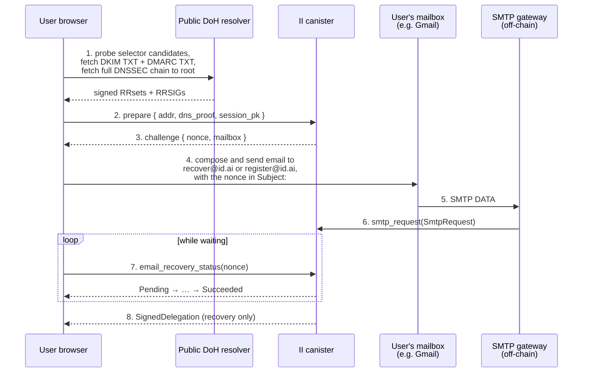
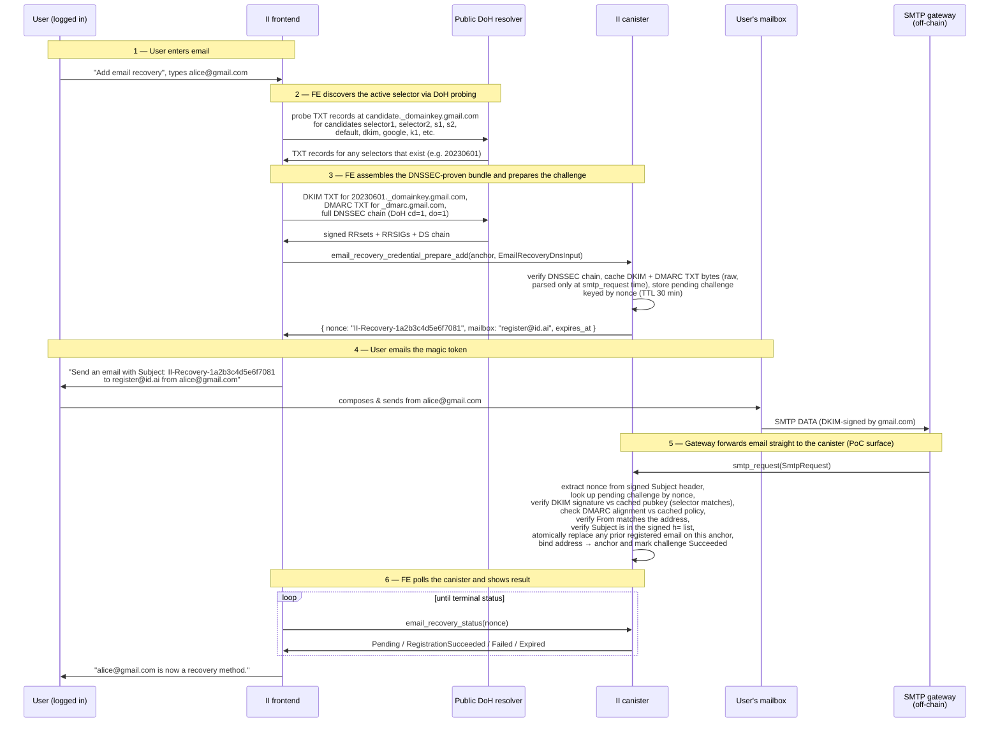
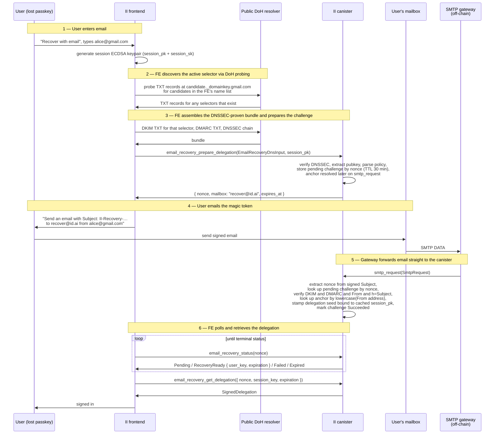

# Email-based identity recovery for Internet Identity

**Status:** Draft — RFC for review. Implementation in flight; see the
implementation status table below for which sections are shipped vs.
still planned.
**Last updated:** 2026-05-05
**Tracking PoC:** [#3760](https://github.com/dfinity/internet-identity/pull/3760) (DKIM postbox, will not be merged)
**Targets:** A new production-grade PR series, not a follow-up to #3760.

**Implementation status (as of 2026-05-05).**

| Component | Status | Where |
|---|---|---|
| DNSSEC verifier (§7) | In review | PR [#3838](https://github.com/dfinity/internet-identity/pull/3838) |
| DKIM verifier (§5) | In review | PR [#3839](https://github.com/dfinity/internet-identity/pull/3839) |
| DMARC alignment (§6) | In review | PR [#3840](https://github.com/dfinity/internet-identity/pull/3840) |
| DoH fallback (§7.6) | In review | PR [#3841](https://github.com/dfinity/internet-identity/pull/3841) |
| Setup flow (§8.4): `prepare_add` → `smtp_request` → `status` → `credential_remove` | In review | PR [#3842](https://github.com/dfinity/internet-identity/pull/3842) |
| Recovery flow (§8.5): `prepare_delegation`, delegation issuance, `get_delegation` | **Planned** | not yet implemented |
| Frontend wizards (§8.6, §8.10) | **Planned** | not yet implemented |

Nothing in this stack is merged to `main` yet; all PRs are open and stacked on each other.

---

## Glossary

Conventions and protocol-specific tags used throughout this document.

**Email authentication.**

| Term | Meaning |
|---|---|
| **DKIM** (RFC 6376) | DomainKeys Identified Mail. The sender's domain signs the email's headers + body hash with a per-domain private key; the public key is published as a TXT record at `<selector>._domainkey.<domain>`. |
| **DMARC** (RFC 7489) | Domain-based Message Authentication, Reporting, and Conformance. Policy record at `_dmarc.<domain>` declaring how receivers should handle mail that fails DKIM/SPF alignment. |
| **SPF** (RFC 7208) | Sender Policy Framework. Authorizes sending IPs; not consulted in this design (see §6.5). |
| **Selector** | The DKIM `s=` value chosen by the email provider. The provider's currently-active public key is at `<selector>._domainkey.<domain>`. |

**DKIM-Signature header tags** (RFC 6376 §3.5):

| Tag | Meaning |
|---|---|
| `v=` | DKIM version. Must be `1`. |
| `a=` | Signing algorithm: `rsa-sha256` or `ed25519-sha256`. |
| `d=` | Signing domain (the zone whose DNSKEY signed this message). |
| `s=` | Selector (sub-label under `_domainkey.<d>` where the public key is published). |
| `c=` | Canonicalization mode `<header-algo>/<body-algo>`, each `simple` or `relaxed` (RFC 6376 §3.4). The canister accepts only `relaxed/*` on the header side — see §5.2. |
| `h=` | Colon-separated list of header names the signature covers. Must include `From` (RFC 6376 §5.4) and, for this feature, `Subject` (§5.4). |
| `b=` | Base64 of the signature bytes over the canonicalized hash input. |
| `bh=` | Base64 of the SHA-256 of the canonicalized body. |
| `t=` | Signature timestamp (Unix seconds). |
| `x=` | Signature expiration (Unix seconds). |
| `l=` | Body length, in canonicalized bytes, that the signature covers. Anything past byte `l` is unsigned (§5.3). |
| `i=` | *Agent or User Identifier* (RFC 6376 §3.5). Typically `<localpart>@<d>` or `@<d>`. The verifier requires this to align with `d=` — exact `<localpart>@<d>` if the DNS-side `t=s` flag is set, otherwise any subdomain of `<d>`. |

**DKIM TXT-record tags** (RFC 6376 §3.6.2.2):

| Tag | Meaning |
|---|---|
| `v=DKIM1` | Record version marker. |
| `k=` | Key type: `rsa` (default) or `ed25519`. |
| `p=` | Base64 of the public key, encoded as X.509 SubjectPublicKeyInfo (RFC 5280 §4.1). Empty `p=` means the key is revoked. |
| `t=` | Flags. `t=y` marks the record as testing-only (we treat as Unverified, reason `TestingMode`). `t=s` ("strict") requires `i=` to be exactly `<localpart>@<d>`, no subdomain. |
| `s=` | Service type. Unenforced. |
| `h=` | Hash algorithms acceptable for this key. Unenforced. |

**DNSSEC.**

| Term | Meaning |
|---|---|
| **DNSSEC** (RFC 4033/4034/4035) | Cryptographic chain from the IANA root KSK down to a leaf RRset, proving the records are what the authoritative DNS published. |
| **KSK** | Key-Signing Key. Signs the zone's DNSKEY RRset; pinned by the parent zone's DS digest. |
| **ZSK** | Zone-Signing Key. Signs everything else in the zone. Both KSK and ZSK live in the same DNSKEY RRset. |
| **DS** (RFC 4034 §5) | Delegation Signer record. The parent zone's hash of the child's KSK; forms the cross-zone delegation chain. |
| **DNSKEY** (RFC 4034 §2) | A public key as a DNS record. |
| **RRSIG** (RFC 4034 §3) | Signature record over an RRset, including inception and expiration timestamps. |
| **RRset** | All DNS records sharing the same `(owner_name, type, class)`. The unit DNSSEC signs over. |
| **Trust anchor** | Canister-side digest of the IANA root KSK; deploy-arg, see §7.5. |
| **DoH** | DNS-over-HTTPS. Used both for caller-side bundle assembly (§7.4) and as a fallback path for domains that don't sign their zones (§7.6). |

**II-specific.**

| Term | Meaning |
|---|---|
| **Anchor** | The user's identity number. Maps to passkeys, OpenID credentials, and (via this design) email-recovery credentials. |
| **Nonce** | The canister-issued one-time token (`II-Recovery-…`) embedded in the recovery email's `Subject:`. It self-identifies the pending challenge — see §3.2 / §8.4 — so there is no separate `challenge_id` on the wire. |
| **Pending challenge** | An ephemeral heap entry keyed by nonce, holding the claimed address, selector, optional cached DKIM/DMARC bytes, and (for recovery) the FE-supplied `session_pk`. 30-minute TTL. |
| **SMTP gateway** | The off-chain service that accepts inbound mail at `register@id.ai` / `recover@id.ai` and forwards each message to the canister via `smtp_request`. Untrusted by the canister beyond best-effort delivery — see §4.1. |

---

## 1. Background

Internet Identity currently offers one recovery channel when a user can no longer authenticate with any of their registered passkeys:

- **Recovery phrase** — a BIP-39-style seed phrase the user is responsible for storing offline.

(Earlier versions exposed a "Recovery device" flow as well; that surface is no longer offered to end users.)

Recovery phrases require the user to *prepare* a recovery method before losing access, and to retain something — paper, password manager, hardware — outside the device that is now unusable. We hear from users that this falls through in practice: phrases get lost, password managers get locked out, paper backups end up next to the primary device and disappear together.

Email is the recovery channel almost every user already has and almost every user can reach from any browser. The PoC PR [#3760](https://github.com/dfinity/internet-identity/pull/3760) added enough plumbing to *receive* DKIM-signed emails inside the canister and view them in a "Postbox" tab; that postbox surface is **out of scope** for this design. We borrow the DKIM verification primitive from the PoC, reshape it to verify a single email *in flight* without persisting the message, and use it as the building block for a recovery-only feature.

This doc proposes the production design that supersedes the PoC. The PoC PR will be closed; the work below should land as a fresh PR series against `main`.

### What the PoC got right

- A first-pass DKIM verifier with a `DkimCheck` step-by-step result so the UI can show *why* a signature did or didn't verify.
- The shape of `DkimVerificationStatus { Verified | Unverified | Pending }` decoupled from storage.
- Recipient-format and body/header bounds checks usable as input validation.

(The Postbox storage layout, the `smtp_postbox` stable map, per-anchor email pruning, and the `smtp_request` Candid surface for *delivering* mail to the canister are not carried forward — see §2 non-goals.)

### What the PoC explicitly deferred

From the PR review thread (sea-snake's comments and aterga's replies) the following were left for a follow-up:

| Area | Status in PoC | Spec gap |
|---|---|---|
| Trusted body retention (`l=`) | Stores full body, hashes only signed prefix | Storage may include bytes not covered by the signature |
| DKIM-Signature parser | Naive split on `;` and `=` | RFC 6376 §3.5 allows folding, arbitrary whitespace, multiple `b=`-like substrings inside other tag values |
| DNS TXT record parser | Tolerant of `P=` casing only | RFC 6376 §3.6.2.2 allows folding across multiple TXT chunks, arbitrary whitespace |
| Header canonicalization | "simple" rebuilt from parsed `(name, value)` | Constrain verifier to `c=relaxed/*`, reject `c=simple/*` (see §5.2) |
| Policy tags `i=`, `k=`, future-dated `t=` | Not enforced | RFC 6376 §3.5 / §3.6.1 |
| DMARC alignment | Not implemented | RFC 7489 §3 |
| Service worker `postMessage` origin check | Missing | CodeQL alert #127 |

This document covers all of the above plus two architectural changes the PoC did not attempt:

- replacing DoH HTTP outcalls with **client-supplied DNSSEC-verified DNS records**;
- adding **email recovery** as a first-class authn method.

---

## 2. Goals & non-goals

**Goals**

- A user can register an email address as a recovery method. Anyone able to prove control of that address — by sending a DKIM-signed email containing the canister-issued challenge nonce — can sign in to the bound anchor. Recovery is the typical motivation (the user lost every passkey), but the flow is open to any anonymous caller that can complete the challenge; it doesn't gate on "you've lost everything else."
- DKIM verification is RFC-6376-compliant against the corpus of mainstream senders (Gmail, iCloud, Outlook, Fastmail, Proton, ProtonMail, Tutanota, AWS SES, SendGrid, Postmark, Mailgun).
- DMARC alignment is checked and enforced according to the sender's published policy.
- The canister's DKIM/DMARC verification is **fully deterministic** and does not depend on HTTPS outcalls during the recovery flow.
- A registered email holder can prove control of that address with a single signed email; the canister does not have to trust the SMTP gateway for *anything other than message delivery*.
- **The canister never persists incoming email contents.** The signed email and its DNSSEC bundle are passed in as a single call argument, verified, and acted on synchronously; only the small persistent state described in §8 is written to stable memory.

**Non-goals**

- The PoC's "Postbox" mailbox feature (storing inbound email per anchor for later viewing). The PoC's storage layout, push-notification path, and inbound-mail UI are not part of this design and will not be carried forward as part of email recovery.
- Sending email *from* the canister. Outbound (e.g., notifications, recovery codes) is delivered by an off-chain service that need not be in the trust path.
- Replacing the existing recovery option. Email recovery is an *additional* `AuthnMethodPurpose::Recovery` method; users can still register a recovery phrase.
- Protecting against a fully compromised mailbox provider. If Google's DKIM signing key is exfiltrated, every Gmail-recovery anchor is at risk; we accept that and document it.
- Verifying *encrypted* (S/MIME, PGP) email contents. We verify DKIM-signed envelopes only.

---

## 3. Threat model

**Trusted parties**

- The user's mailbox provider (Gmail, iCloud, …): trusted to keep the DKIM private key secret and to reject spoofed inbound mail destined for the user.
- The DNS authoritative servers for the sender's domain: trusted to publish honest DKIM/DMARC records, *and* trusted to sign them with DNSSEC.
- IANA / ICANN root KSK: trusted as the DNSSEC trust anchor.

**Untrusted parties**

- The SMTP-receiving gateway. Can drop, delay, reorder, or fabricate inbound messages. Cannot fabricate a DKIM signature without the sender's private key. Cannot fabricate a DNSSEC chain without the sender's signing keys.
- The DNSSEC resolver client (could be the SMTP gateway itself or the user's browser). Can lie about *which* records exist; cannot fabricate a valid DNSSEC chain.
- Boundary nodes / DoH providers. Same — used only as transports if used at all.

**Attacker capabilities we defend against**

1. *Spoofed `From:` header* — defended by DMARC alignment with verified DKIM `d=`.
2. *DKIM signature replay* — defended by `x=` expiration plus an ingest-time freshness window plus a single-use challenge nonce embedded in the email's `Subject:` and burned on first acceptance.
3. *DNS poisoning* — defended by DNSSEC validation against the IANA root KSK trust anchor (delivered as a deploy/upgrade arg, see §7.5).
4. *Length-extension via `l=` tag* — defended by ignoring any unsigned tail (see §5.3).
5. *Mass enumeration of email→anchor mappings* — gated by DKIM verification: an attacker cannot probe the index without a DKIM-valid email from the address being probed (see §3.1).
6. *Recovery phishing — attacker prepares a challenge, then tricks the victim into emailing the resulting nonce.* See §3.2 for the analysis. Defended by (a) the rotating random nonce, which kills async/mass phishing because by the time a phishing message reaches the victim the nonce has expired; (b) the token living in the email's `Subject:` rather than the body, so the user sees the recovery intent (`II-Recovery-…`) at compose time; (c) the legitimate token only ever appears on the real II recovery page in the user's own browser — a phisher who can place a token in front of the user has already phished them onto a fake II domain, which is the standard website-phishing problem we don't try to solve in this layer.

### 3.1 Why the email→anchor index does not need salted hashing

The index that maps a verified sender address to an anchor number is a public-shape concern (an attacker could in principle iterate addresses to discover whether a friend has an II account). In practice the lookup is gated by DKIM: the canister never accepts an `email_recovery_*` call without a DKIM-valid email signed by the queried domain on behalf of the queried address. An attacker who controls `mallory@gmail.com` can probe whether `mallory@gmail.com` is registered, but cannot probe `alice@gmail.com` without first compromising Alice's mailbox or Gmail's DKIM key — at which point they already have full mailbox control.

We therefore key the lookup index by `lowercase(local-part) + "@" + lowercase(domain)` directly. No per-anchor salt is needed; we do *not* try to make the index itself unenumerable.

### 3.2 Recovery phishing: the prepare-then-trick attack

`email_recovery_prepare_delegation` is anonymous (it has to be — the user has lost every authn method by the time they reach for it). That means an attacker can call it for *anyone's* email, get a fresh nonce, and bind it to an attacker-controlled `session_pk`. If the attacker can then convince the victim to send an email containing that nonce from the victim's own address, the canister will mark the challenge `Succeeded`, stamp a delegation for the attacker's `session_pk`, and the attacker signs in as the victim.

This is structurally the same attack as classic email-recovery phishing ("send your verification code to support@…"). We do not have outbound email in scope (§2 non-goals), so we cannot ship a confirmation-reply round trip that lives inside the victim's inbox. The defenses we *do* layer:

- **The nonce rotates.** It exists only inside one pending entry with a 30-minute TTL. Phishing scripts blasted out at scale are useless: by the time a generic "send this to recover your account" message reaches a victim, the embedded nonce has likely expired, and the attacker would need to be running real-time interactive phishing on each target individually to keep nonces fresh.
- **The nonce lives in `Subject:`, not the body.** The user sees `Subject: II-Recovery-1a2b3c4d5e6f7081` at compose time, which is harder to misinterpret as "support help". Keeping the prefix verbose (`II-Recovery-…`) is deliberate — every legitimate UI surface says exactly the same prefix, so a token without it is an immediate tell.
- **The legitimate token only ever appears on the real II recovery page** in the user's own browser session. An attacker who can place a token in front of the user has already convinced them to visit a phishing site impersonating II — at which point the email step is the *least* of the user's worries. We treat website phishing as a separate layer and do not try to make the email recovery flow robust against a successfully-impersonated frontend.
- **UX explicitness in step 2.** The wizard's send-the-magic-email screen (§8.6) names the action plainly: "*This will sign you in to your existing Internet Identity*", with a warning callout: "*Only continue if you started this recovery yourself, just now, on this page.*" This is the canister-stack equivalent of the "is this you?" sticker on a hardware wallet — it doesn't stop a determined social engineer, but it is the place a careful user notices something is wrong.

What we explicitly *don't* try to do is gate the prepare endpoint behind a captcha or per-address rate limit (see §8.9 for why per-address rate limiting is itself a denial-of-recovery vector). The nonce-rotation + UX-clarity stack is the practical ceiling for an inbound-only, no-stored-state-per-user flow. The natural upgrade path, when outbound email becomes available, is to add an inbox-side confirmation step — see §11 ("Open questions").

**Attacker capabilities we do *not* defend against**

- A user who voluntarily forwards their own DKIM-signed challenge email to an attacker. Standard phishing concern; mitigated by UX (challenge email's body says "do not forward").
- A SIM-swap-equivalent at the email provider (attacker controls the inbox). Out of scope.
- A registrar or TLD compromise that lets an attacker rotate DNSKEYs. The DNSSEC chain still validates, but for a malicious key. This is the same trust assumption every DNSSEC consumer makes.

---

## 4. High-level architecture



The architecture is built around three ideas:

- **DNSSEC validation happens once, up front, in the prepare call.** The user's browser discovers the active DKIM selector for the user's email provider by probing common selector names via DoH (see §8.4 notes), fetches the DKIM TXT record for that selector + the DMARC TXT record + the DNSSEC chain via DoH, and submits everything as a single call argument. The canister validates the chain cryptographically against the IANA root anchor (no HTTPS outcall), and **caches the verified TXT record bytes** for both DKIM (required) and DMARC (optional) on a pending-challenge entry keyed by the canister-issued nonce, with a 30-minute TTL. Parsing of the TXT records into a DKIM public key and a DMARC policy is deferred to `smtp_request` time — the canister stores the *bytes* the chain authenticated, not derived material. The session public key the FE wants the eventual delegation bound to is also passed in here. The canister returns the nonce and the gateway recipient mailbox.
- **The user actually emails the nonce.** They send a fresh email from the address they typed, with the nonce in the `Subject:` (e.g. `Subject: II-Recovery-1a2b3c4d5e6f7081`), to `recover@id.ai` (or `register@id.ai` for setup). The recipient is a single static mailbox per kind — **the nonce is the only identifier** in the protocol: it's the lookup key the canister uses to match the inbound email to a pending challenge, the value the FE polls under, and the human-typeable token in `Subject:`. Each nonce is drawn from a 64-bit PRNG (§8.9) into exactly one pending entry, so it self-identifies — knowing the nonce is necessary and sufficient to reference the challenge. We deliberately don't carry a separate `challenge_id`. Keeping the token in `Subject:` rather than the body is the other deliberate choice: the user sees the recovery intent (`II-Recovery-…`) at compose time, which is the cheapest defence against the prepare-then-phish attack discussed in §3.2.
- **The SMTP gateway forwards the email to the canister via `smtp_request`** — exactly the PoC's surface, no shape change. The canister extracts the nonce from the DKIM-signed `Subject:` header, looks up the pending challenge by nonce, verifies the DKIM signature against the cached public key, checks DMARC alignment against the cached policy, verifies the `From:` matches the address in the original prepare call, then either binds the address (setup) or prepares a delegation tied to the FE's session public key (recovery). Until that update lands, the FE polls the canister with `email_recovery_status(nonce)` and shows a "waiting for your email…" spinner. Once the status flips, the FE retrieves the delegation (recovery) or shows "all set" (setup).

The SMTP gateway is *partially trusted*: it can drop, delay, or fabricate calls to `smtp_request`. It cannot fake a DKIM signature for a domain it doesn't control, so the worst it can do is withhold delivery (a DoS that's acceptable for a recovery channel users only hit when locked out).

This buys us:

- **Determinism without consensus tricks.** No HTTP transform, no `max_response_bytes`, no boundary-node trust on the DNS path.
- **No cycles spent on outcalls** during recovery, which is the latency-sensitive path.
- **No persistent inbox state on chain.** The only stable-memory state added is the registered email→anchor index and a small TTL'd map of pending challenge entries.
- **No raw email upload from the user's browser.** The FE never has to fetch and re-upload a multi-KB email — the gateway delivers the bytes once, directly to the canister. The FE only sees the verification *outcome* via polling.

We pay for it in:

- **Caller complexity.** The browser has to assemble the DNSSEC chain by walking the delegation from root down. This is straightforward TypeScript on top of DoH (see §7.4), no separate library or WASM module needed.
- **No DNSSEC, no email recovery.** Domains that don't sign their zones cannot be used. As of 2026-05, this includes a non-trivial slice of mainstream consumer mailbox domains. We surface this clearly in the UI at registration time and let the user pick a different address or fall back to a recovery phrase.
- **Trust the gateway to deliver.** A malicious or down gateway can stall recovery, but cannot fabricate or alter outcomes (every cryptographic check is on the canister side).

### 4.1 SMTP gateway: untrusted-public-relay assumptions

The SMTP gateway sits between the public internet and the canister. It is operated as an off-chain helper — the same shape as the postbox PoC ([#3760](https://github.com/dfinity/internet-identity/pull/3760)) — but the canister treats it as **untrusted infrastructure**, indistinguishable from any other publicly-reachable principal that can call `smtp_request`.

**What the canister assumes about the gateway:**

- **Public, anonymously-callable.** `smtp_request` is an open `update` call: anyone holding the canister principal can submit an `SmtpRequest`. The gateway is the *expected* caller, but the caller identity is not authenticated and not trusted (we don't pin a principal to "the gateway"). A malicious actor sending an `SmtpRequest` directly is treated identically to one delivered via the gateway — both must produce a DKIM-valid email matching a known pending nonce, or the call is a no-op.
- **Best-effort delivery.** The gateway can drop, delay, reorder, duplicate, or fabricate calls. It can withhold mail entirely (DoS — acceptable for a recovery channel) or replay calls (idempotent — `smtp_request` flips a challenge to a terminal state once, further calls hit `NonceExpired` / `NonceUnknown`).
- **Cannot fabricate cryptographic state.** The gateway has no DKIM signing keys for the domains it relays mail from, no DNSSEC private keys, no II canister state. Every check the canister cares about — DKIM signature, DMARC alignment, `From` ↔ `d=` alignment, `Subject` in `h=` — is verified against material the gateway either passed through unchanged (the email bytes) or that the canister cached at prepare time (the validated DKIM TXT, the DMARC policy).
- **Header parsing contract.** Beyond delivery, the gateway is trusted for one narrow protocol-shape promise: it delivers headers as `(name: String, value: String)` pairs in receipt order, with values as raw bytes (no RFC 2047 decoding). This contract is exactly what PoC [#3760](https://github.com/dfinity/internet-identity/pull/3760)'s gateway already provides; §5.2 explains why this constrains the canister to `c=relaxed/*` on the header side.
- **No persistent storage.** The gateway holds the bytes of an inbound message only long enough to make one `smtp_request` call. It is not part of the canister's trust path, and it doesn't see the verification outcome (the FE polls the canister directly).

**Implications for deployment:**

- The gateway can run as a cycles-paying canister or an off-chain service; either way the canister code is the same.
- Multiple gateway instances can coexist (e.g. for redundancy) without coordination — `smtp_request` is idempotent on a per-nonce basis.
- A gateway compromise does not compromise existing or future recovery flows; the worst it can do is delay or drop them. There is no separate "trusted gateway" allowlist to maintain.

---

## 5. Component A — Production-grade DKIM verifier

The PoC's `src/internet_identity/src/dkim.rs` is replaced rather than incrementally fixed. A naïve manual parser is the wrong shape for the spec — folding, multi-chunk TXT records, and byte-exact canonicalization need careful, RFC-pinned code.

### 5.1 Library choice

**Decision: hand-rolled, in `src/internet_identity/src/dkim/`.** The split:

- `parse` — `DKIM-Signature` header tag-list parser (RFC 6376 §3.5).
- `dns_record` — DKIM TXT record parser (RFC 6376 §3.6.2.2).
- `canonicalize` — relaxed header (§3.4.2) and body (§3.4.4) forms; `simple/*` on the header side is rejected by construction (§5.2).
- `signature` — RSA-SHA256 (RFC 5702 / RFC 8301) and Ed25519-SHA256 (RFC 8463) on top of the workspace `rsa` and `ed25519-dalek` deps.
- `verify` — orchestration: multi-signature loop, tag enforcement, accept-on-first-pass.

**Rejected alternatives**

- [`mail-auth`](https://github.com/stalwartlabs/mail-auth) (Apache-2.0, used by Stalwart) — was the original recommendation. Drops out because its dependency tree pulls a non-optional `hickory-resolver` (DNS via tokio sockets) that doesn't compile to `wasm32-unknown-unknown`. Forking it to vendor a no-net resolver shim would be larger than rolling the verifier from the RFC.
- `cfdkim` — solid but tightly coupled to `tokio-trust-dns`, hard to unhook from network IO.
- Continue with the PoC's parser — every reviewer comment in the PoC PR is some shape of "you can't safely roll your own canonicalization parser." Agreed; the rewrite this section describes is the answer, just from-scratch rather than library-backed.

### 5.2 Header canonicalization with the existing gateway contract

DKIM "simple" header canonicalization signs the *exact original bytes* of each signed header line. The existing SMTP gateway from PoC #3760 delivers headers as parsed `(name: String, value: String)` pairs (the PoC's `SmtpHeader`), which loses the original whitespace, folding, and the exact byte sequence after the colon — so the canister cannot verify simple-header signatures against this shape.

We accept the current gateway contract unchanged and constrain the canister-side verifier to `c=relaxed/*` for the *header* canonicalization side. The relaxed algorithm (RFC 6376 §3.4.2) lowercases names, unfolds continuations, collapses runs of whitespace to a single SP, and strips WSP around the colon — every transformation is destructive of the same information the gateway's parser already discarded, so the relaxed-canonical form is reconstructible from `(name, value)` pairs by re-emitting them as `name + b": " + value + b"\r\n"` and feeding the result to the verifier.

In practice every mainstream sender we care about (Gmail, iCloud, Outlook, Fastmail, Proton, ProtonMail, AWS SES, SendGrid, Postmark, Mailgun) signs with `c=relaxed/relaxed` or `c=relaxed/simple`. Niche senders that sign with `c=simple/*` are rejected with reason `UnsupportedCanonicalization` and the user is asked to register a different address. We accept this surface loss in exchange for not blocking on a gateway-side change.

Body canonicalization is unaffected — the gateway delivers the body as a raw `blob`, so both `*/relaxed` and `*/simple` body modes verify byte-for-byte.

Two assumptions on the gateway-side parser, currently true of the PoC implementation, that this approach depends on:

- **Header values are passed as raw bytes**, not RFC 2047-decoded. Encoded-words like `=?utf-8?B?...?=` must reach the canister in their wire form so the relaxed canonicalization sees the same bytes the signer hashed.
- **Header order is preserved** in receipt order, with no deduplication. DKIM picks signed headers from the bottom up per `h=` tag (RFC 6376 §5.4), and signatures over duplicated headers fail if order is lost.

The canister extracts `From:`, `To:`, `Subject:`, etc. from the same parsed pairs for display and dispatch — there is no separate "raw" path.

### 5.3 Trusted-body handling (`l=`)

When a DKIM signature includes `l=N`, only the first N bytes of the canonicalized body are signed. Anything past byte N is unauthenticated and could have been appended by a forwarder or an attacker.

Email recovery does not store inbound email at all (see §2 non-goals), so this is a *verification-time* concern rather than a storage-time concern:

- The DKIM verifier hashes only the first N bytes of the canonicalized body, exactly as RFC 6376 §3.4.5 requires.
- The challenge nonce lives in the `Subject:` header, which is signed (see §5.4), so `l=` does not affect the nonce search at all — the nonce is always covered by the cryptographic check regardless of body truncation.

The PoC's storage truncation (`truncate_at_char_boundary`) becomes irrelevant once the canister stops persisting the body, but we keep the same byte bound (`MAX_BODY_BYTES`) as an upper limit on the canister-call argument so a malformed caller cannot exhaust the message's argument budget.

### 5.4 Tag enforcement

Beyond the cryptographic check, the verifier rejects:

- `v != 1`.
- `a` outside the supported algorithm set: `rsa-sha256`, `ed25519-sha256`. (PoC supported `rsa-sha256` only.)
- `t > now + skew_window` — future-dated signatures (PoC parsed but did not enforce).
- `x < now` — expired signatures (the PoC's late round of fixes already enforces this; see [aterga's reply](https://github.com/dfinity/internet-identity/pull/3760#discussion_r3137585324) on the PoC review).
- `i=` (the optional *Agent or User Identifier* tag from RFC 6376 §3.5; carries `<localpart>@<d>` or `@<d>` and identifies whose mailbox the signature is asserting) — its domain part must equal `d` (when the DNS-side `t=s` flag is set on the publishing key — strict alignment, no subdomains) or be a subdomain of `d` (the default — `i=user@mail.example.com` aligns with `d=example.com`). Mismatched `i=` is rejected with reason `IdentifierAlignment`.
- `c=` (the *canonicalization mode* tag from RFC 6376 §3.4; declares how each side of the message — headers and body — was normalized before hashing, as `<header-algo>/<body-algo>` where each algo is `simple` or `relaxed`) — header side must be `relaxed`. Body side may be `simple` or `relaxed`. Signatures with `c=simple/*` are rejected with reason `UnsupportedCanonicalization` (see §5.2).
- `h=` — must include `From` (RFC 6376 §5.4 already requires this) **and** `Subject`. The `Subject` requirement is recovery-specific: the challenge nonce lives in `Subject:` (§8), so a signature that doesn't cover it would let a man-in-the-middle (a malicious gateway, a forwarder, a transparent proxy) rewrite the nonce on a legitimately-signed email and either DoS recovery or — worse — replace the nonce with one bound to an attacker's pending challenge. Every mainstream sender we care about already signs `Subject` by default; rejecting the rare niche signer that doesn't is the right tradeoff. Surfaces as reason `SubjectNotSigned`.
- DNS-side `k=` — defaults to `rsa`, must match the signature's algorithm.
- DNS-side `t=y` — testing flag; we treat the signature as Unverified with a `TestingMode` reason.

### 5.5 Multiple DKIM-Signature headers

PoC behaviour is correct: iterate over every `DKIM-Signature` header and accept on first verifying signature. Carry forward, emit per-signature `DkimCheck` arrays in the result so the UI can show why each one failed.

### 5.6 Public-key sanity

Already addressed in PoC: minimum 1024-bit RSA. Lift the floor to 2048 in a follow-up once telemetry shows no measurable rejection rate on the recovery surface — i.e., once we confirm none of the major senders we care about still sign at 1024.

---

## 6. Component B — DMARC alignment

DKIM proves "domain X signed this message." DMARC proves "the domain in the visible `From:` header authorized X to sign on its behalf." Without DMARC, an attacker who controls *any* domain with valid DKIM can spoof `From: alice@gmail.com` and we'd accept it.

### 6.1 `From:` header parsing

The verifier needs the *header-`From:`* domain (Y), not the SMTP envelope `MAIL FROM` the PoC consumes. RFC 5322 `From:` is an `address-list`; for DMARC, RFC 7489 §3.1.1 mandates that the message has *exactly one* `From:` header containing *exactly one* mailbox. We enforce both: reject (treat as Unverified, reason `MalformedFromHeader`) when there are zero, multiple, or list-style `From:` headers.

Implementation: small hand-written parser in `crate::dmarc::from_parser` covering both `addr-spec` (`alice@example.com`) and `name-addr` (`"Alice Example" <alice@example.com>`) forms. Quoted local-parts and obs-route forms are rejected as `MalformedFromHeader`.

### 6.2 DMARC record fetch

For sender domain Y, the canister needs the TXT record at `_dmarc.<Y>`. This is fetched the same way as DKIM keys — via the DNSSEC-validated arg bundle from §7. The verifier never makes its own DNS calls.

DMARC tags we honour:

| Tag | Meaning | Default |
|---|---|---|
| `v=DMARC1` | Required | — |
| `p=` | Policy: `none` / `quarantine` / `reject` | required |
| `sp=` | Subdomain policy | inherits `p=` |
| `adkim=` | DKIM alignment mode: `s` strict, `r` relaxed | `r` |
| `aspf=` | SPF alignment | (we don't check SPF — see §6.4) |
| `pct=` | Percentage of failing mail to apply policy | `100` |
| `fo=`, `rua=`, `ruf=`, `rf=` | Reporting | ignored |

### 6.3 Alignment check

Each verified DKIM `d=` (call it X) is checked for alignment with the `From:` domain (Y), both ASCII-lowercased:

- **`adkim=s`** — X must equal Y.
- **`adkim=r`** — X must equal Y, *or* X is a subdomain of Y (i.e. Y is a label-aligned suffix of X). Examples: `mail.example.com` aligns with `example.com` ✓; `evil.com` aligns with `example.com` ✗; `gmail.com` aligns with `googlemail.com` ✗.

This is *stricter* than RFC-7489-compliant relaxed alignment, which uses the [Public Suffix List](https://publicsuffix.org/) (PSL) to compute "organizational domain" — under that algorithm, `gmail.com` and `googlemail.com` would align if they were listed as the same org, and `mail.example.com` aligns with `example.com` because both reduce to `example.com` regardless of subdomain depth. We accept the second case (covered by the subdomain rule) but reject the first. §6.4 explains why we deviate.

### 6.4 Why we don't use the Public Suffix List

The PSL is the de-facto reference for DMARC's "organizational domain" computation. We deliberately don't use it in the recovery flow.

**Trust expansion.** Email recovery currently trusts the user's mailbox provider (DKIM signing key), the DNSSEC chain (IANA root + delegations), and the user's own custody of their inbox. The PSL is community-maintained on GitHub (`publicsuffix/list`); anyone can submit a PR. Using it for alignment would add Mozilla and the broader reviewer set as a new trust point — thousands of entries, frequent merges, large surface area.

**Asymmetric failure mode.** A *missing* entry fails closed: we'd reject mail that a spec-compliant verifier would accept (denial of recovery, not a compromise). An *added* entry fails *open*: e.g. if `co.uk` were ever incorrectly removed from the list, `evil.co.uk` and `victim.co.uk` would alias under relaxed alignment, and an attacker controlling the former could sign mail aligning with `From: victim.co.uk`. That's an account-compromise vector with a wide blast radius. The probability is low but the consequences are bad enough to avoid by construction.

**Marginal benefit for this surface.** Every mainstream consumer mailbox we list in §2 (Gmail, iCloud, Outlook, Fastmail, Proton) signs `d=` exactly equal to the From-header domain — strict alignment, PSL never consulted. The cases where PSL helps:

- Multi-domain orgs (`gmail.com` ↔ `googlemail.com`): users register the address they actually send from, so the From and the registered address share a single domain. Not relevant.
- Subdomain sending (`d=mg.example.com` for `From: alice@example.com`): handled by the subdomain rule in §6.3 without the PSL.

The remaining gap (multi-domain orgs that *don't* share a registrable suffix) fails closed under our policy. If the test corpus surfaces a real consumer mailbox provider that needs PSL-style alignment to verify, we revisit then. As of design time, none does.

**Net effect on the design.** No PSL bundle in the WASM, no weekly outcall, no transform function for PSL responses, no Mozilla/community-list trust dependency. The email-recovery stack has *zero* HTTP outcalls — every per-verification check uses material the caller supplied (DNSSEC bundle) or material baked into the canister at deploy (DNSSEC root anchors).

### 6.5 SPF: not checked

DMARC permits a message to pass via either DKIM-aligned *or* SPF-aligned. We deliberately do not check SPF, because:

- SPF needs the SMTP envelope's `MAIL FROM` (a.k.a. Return-Path) and the connecting IP. The IP is invisible to the canister; it would have to be passed by the gateway and is unauthenticated (the gateway can lie about it).
- SPF alone is not sufficient evidence of mailbox control — it only proves the connecting host was authorized, not that the mailbox holder originated the message.

For DKIM-aligned mail this never matters. For mail that *only* passes SPF (no DKIM), we treat it as Unverified.

### 6.6 Policy enforcement and verification status

We extend `DkimVerificationStatus` to carry DMARC outcome:

```rust
pub enum VerificationStatus {
    Pending,
    Verified {
        dkim_checks: Vec<DkimCheck>,
        dkim_domain: String,         // d= of the signature that won
        from_domain: String,         // Y from From: header
        dmarc: DmarcOutcome,
    },
    Unverified {
        dkim_checks: Vec<DkimCheck>,
        reason: VerificationFailReason,
    },
}

pub enum DmarcOutcome {
    Aligned { policy: DmarcPolicy, alignment_mode: AlignmentMode },
    Misaligned { policy: DmarcPolicy }, // failed alignment; policy says what to do
    NoRecord,                            // no _dmarc TXT for the domain
}
```

For the recovery and registration flows, we only accept emails where `DmarcOutcome` is `Aligned` *or* `NoRecord` with `dkim_domain == from_domain` (i.e., the DKIM domain matches the From: domain exactly even without an explicit DMARC record). Misaligned mail is rejected outright; there is no "spoofing suspected" middle state because the call has no value if it's not a usable proof.

### 6.7 Renaming

`DkimVerificationStatus` and `DkimCheck` are misnamed once DMARC enters; rename to `EmailVerificationStatus` and the wire-level `dkim_status` field to `verification_status`. The PoC types are not stable Candid; renaming during the rewrite is free.

---

## 7. Component C — DNSSEC arguments instead of HTTP outcalls

This is the largest architectural change versus the PoC and the foundation that makes the recovery flow practical.

### 7.1 Why move off HTTP outcalls

The PoC's `fetch_dkim_public_key` makes a `https://dns.google/resolve?...` outcall with a `transform_doh_response` function for replica consensus. It works, but:

- It costs ~30B cycles per verification.
- Consensus failure modes are subtle: every replica must see the same JSON, or the call traps.
- We trust dns.google (or whichever DoH provider) to honestly reflect the authoritative response.
- It does not work for the recovery hot path: ingress message size has a 2 MB ceiling and outcall latency is multi-second.
- For the *recovery* call specifically, whose argument already includes a signed email, having the canister go fetch DNS adds another round trip after the user already had to ship something to it.

The email-recovery stack ends up with **zero HTTP outcalls** — every per-verification check uses caller-supplied material (DNSSEC bundle) or canister-baked-at-deploy material (DNSSEC root anchors, §7.5). See §6.4 for why we don't pull the PSL either.

### 7.2 The DNSSEC-arg pattern

For each DNS record the canister needs (DKIM TXT, DMARC TXT, in the future MX/SPF), the caller supplies the record bytes *plus* a chain of DNSSEC RRSIGs and DNSKEYs that prove those bytes are what the authoritative DNS published.

A "DNS proof bundle" looks like:

```rust
pub struct DnsProofBundle {
    /// One or more signed RRsets verified under the same chain. For
    /// email recovery the bundle carries the DKIM TXT at
    /// `<selector>._domainkey.<d>` (required) and optionally the
    /// DMARC TXT at `_dmarc.<d>`. Both records live in the same
    /// zone, so a single chain walk authenticates both.
    pub leaves: Vec<SignedRRset>,

    /// The signed root DNSKEY RRset (every link in `chain` is verified
    /// up to here). Validated by checking that one of its KSK DNSKEYs
    /// hashes to a DS digest in the trust anchor stored on the canister.
    pub root_dnskey: SignedRRset,

    /// Walk down the delegation chain from root toward `leaves`. Each
    /// entry is the DS RRset published in the parent zone (signed by
    /// the parent's DNSKEY) plus the DNSKEY RRset of the child zone
    /// (self-signed by the child's KSK and DS-pinned by the parent).
    pub chain: Vec<DelegationLink>,
}

pub struct SignedRRset {
    pub name: DnsName,
    pub rtype: u16,            // TXT, DNSKEY, DS, ...
    pub rdata: Vec<Vec<u8>>,   // canonical RDATA per RFC 4034 §6
    pub ttl: u32,
    pub rrsig: Rrsig,          // RFC 4034 §3
}

pub struct DelegationLink {
    pub child_ds: SignedRRset,         // DS RRset in parent
    pub child_dnskey: SignedRRset,     // DNSKEY RRset in child, signed by child's KSK
}
```

### 7.3 Verification algorithm

The trust anchor stored on the canister is a *DS-style digest* of the IANA root KSK — exactly the same shape IANA publishes at `data.iana.org/root-anchors/root-anchors.xml` (an algorithm + digest-type + hex digest). It is **not** a DNSKEY itself; the root DNSKEY RRset is supplied by the caller and validated against the digest at verification time.

```
verify(bundle):
    # 1. Validate the root DNSKEY RRset against the bundled trust anchor.
    #    The trust anchor is a DS digest (algo, digest-type, digest-bytes).
    #    Pick the DNSKEY in `bundle.root_dnskey.rdata` whose KSK digest
    #    matches the trust anchor; this is the root KSK we trust this
    #    call. Then verify the root DNSKEY RRset's RRSIG using that KSK.
    root_ksk = pick_dnskey_matching_ds(bundle.root_dnskey.rdata, TRUST_ANCHOR_DS)
    verify_rrsig(bundle.root_dnskey.rrsig, bundle.root_dnskey.rdata, root_ksk)

    # 2. Walk down the delegation chain.
    parent_keys = bundle.root_dnskey.rdata    # the validated root DNSKEY RRset
    for link in bundle.chain:
        # Parent's DS RRset is signed by the parent's DNSKEY.
        verify_rrsig(link.child_ds.rrsig, link.child_ds.rdata, parent_keys)
        # Parent's DS digest matches one of the child's KSK DNSKEYs.
        child_ksk = pick_dnskey_matching_ds(link.child_dnskey.rdata, link.child_ds)
        # Child's DNSKEY RRset is self-signed by its KSK.
        verify_rrsig(link.child_dnskey.rrsig, link.child_dnskey.rdata, child_ksk)
        parent_keys = link.child_dnskey.rdata

    # 3. Every leaf RRset is signed by the deepest zone's DNSKEY.
    #    Reject the whole bundle if any leaf fails to verify — partial
    #    bundles would let an attacker drop the DMARC leaf to dodge
    #    alignment.
    require not bundle.leaves.is_empty()
    for leaf in bundle.leaves:
        verify_rrsig(leaf.rrsig, leaf.rdata, parent_keys)

    # 4. Freshness — every RRSIG's [inception, expiration] window must
    #    contain the verifier's clock (±clock_skew).
    now = ic_cdk::time()
    for rrsig in all_rrsigs(bundle):
        require rrsig.inception <= now + clock_skew
        require rrsig.expiration >= now - clock_skew
```

`verify_rrsig` uses RFC 4034 §3.1.8.1 canonical form (lowercase owner names, RDATA in canonical order) and the algorithm code from the RRSIG. We support algorithms 8 (RSA-SHA256), 13 (ECDSA-P256-SHA256), and 15 (Ed25519) — RFC 8624 "MUST" implementations. Anything older (RSA-SHA1, RSA-MD5) is rejected.

### 7.4 Caller-side bundle assembly

The browser assembles `DnsProofBundle` directly in TypeScript. No separate library or WASM module is required:

- Issue DoH queries with `do=1` (request DNSSEC) and `cd=1` (don't validate, give us raw RRSIGs) to a public resolver. `dns.google` and `cloudflare-dns.com` both expose this; the FE can fall back between them. Browsers without OS-level DNS APIs cannot reach the authoritative servers directly, so DoH is the practical path.
- Walk the delegation chain by querying the DS RRset at each parent zone (root → TLD → registered domain → `_domainkey` subdomain).
- Stop at root, where the DNSKEY RRset is validated against the trust anchor stored on the canister rather than against another DS lookup.

The earlier draft mentioned "the OS resolver" as a fallback when DoH providers are unavailable; in practice browsers don't expose the OS resolver, so the practical fallback is between multiple DoH endpoints, not to the OS. Domains for which DoH refuses to return RRSIGs are treated the same as domains without DNSSEC (§7.6).

This is a small TS module (~300 lines, no dependencies beyond `fetch`) living in `src/frontend/src/lib/utils/dnssec/`. There is no separate WASM module; the canister already has a Rust DNSSEC verifier and the FE only needs to *gather* the records, not verify them.

### 7.5 Root anchor management — deploy-arg, not bundled

The trust anchor (the DS digest of the IANA root KSK) lives in the canister's persistent state, set on every deploy via the `init`/`post_upgrade` arg:

```candid
type DnssecConfig = record {
    root_anchors : vec record {
        // Per `data.iana.org/root-anchors/root-anchors.xml`.
        key_tag      : nat16;
        algorithm    : nat8;       // 8 / 13 / 15
        digest_type  : nat8;       // 1 (SHA-1) or 2 (SHA-256). We only ship type 2.
        digest       : blob;       // 32 bytes for SHA-256
    };
};
```

The config sits at the top of `InternetIdentityInit` as `dnssec_config: Option<DnssecConfig>`; it isn't email-recovery-specific. Any future feature that needs DNSSEC-verified DNS (DANE, ACME, MX-pin, …) consumes the same trust anchors.

Multiple anchors are accepted simultaneously to make rollover trivial — during a key transition both the retiring and the incoming KSK digests live in `root_anchors`. This is the same shape IANA publishes when both old and new KSKs are valid.

II is deployed at least weekly, so refreshing the anchor list on every deploy is essentially free; we don't need a separate governance mechanism for it.

**Rollover frequency.** In practice the IANA root KSK rolls *very rarely*: once in DNSSEC's history, in October 2018 (the "KSK rollover from 2010 to 2017 KSK"). No further rollover has happened or is publicly scheduled at the time of writing. IANA publishes signed announcements months in advance when one is upcoming. We keep the deploy-arg shape so that when the next rollover does happen (announced anchor publication updates), it's a one-line config change in the next weekly deploy rather than a code change.

The currently configured anchor list is recoverable from the canister's last upgrade arg via the IC management canister; we do not expose a separate auditing endpoint for it.

### 7.6 Domains without DNSSEC: the DoH fallback

The major consumer mailbox providers we most care about — Gmail, Outlook, iCloud, Yahoo — do **not** publish DNSSEC on their authoritative zones. Rejecting them outright would leave the feature unusable for the majority of real users, so for an explicitly allowlisted set of domains the canister falls back to fetching DKIM/DMARC TXT records via DoH HTTP outcalls, with a multi-provider quorum standing in for the cryptographic provenance DNSSEC would otherwise give us. The DoH module is described in `crate::doh` (PR 4 of this stack); the relevant properties for this design are:

- **Allowlist-gated.** Outcalls fire only for domains in `DohConfig.allowed_domains` (deploy/upgrade arg). Non-allowlisted, non-DNSSEC domains still fail closed.
- **Multi-provider quorum.** Five DoH providers across four jurisdictions (Cloudflare 🇺🇸, Google 🇺🇸, Quad9 🇨🇭, CIRA Canadian Shield 🇨🇦, IIJ 🇯🇵), 3-of-5 strict-majority quorum on the TXT bytes, no single jurisdiction can reach quorum alone. We trust "at least three of these providers, run by independent operators in different legal regimes, all return the same bytes" as a workable substitute for "the IANA-rooted DNSSEC chain".
- **Heap cache + dedup.** Successful fetches stay in cache for the configured TTL (default 1 h, capped at 24 h); concurrent fetches for the same FQDN collapse to a single outcall fan-out via a hand-rolled Waker primitive.
- **No outcalls in the latency-sensitive path for repeat traffic.** The first email per provider per TTL window pays the outcall cost; subsequent emails are cache hits.

This means the email-recovery stack ends up with **two parallel verification paths** to the same `dkim::verify` + `dmarc::verify_email` core:

| Path | Caller-supplied input | DKIM key sourced from | When the outcall (if any) happens |
|---|---|---|---|
| DNSSEC | `DnsProofBundle` (signed RRsets + DNSKEY chain to IANA root) | The validated leaf TXT in the bundle | None — verification is fully sync |
| DoH allowlist | Just the address (no bundle) | `doh::fetch_txt(selector._domainkey.<domain>, registered_domain)` | At verification time on the first uncached lookup; cache-served thereafter |

The canister picks the path per-call: if the FE supplies a `DnsProofBundle`, use the DNSSEC path; otherwise, if the registered domain is on the DoH allowlist, use the DoH path; otherwise reject with a clear error and the copy-able message:

> "Internet Identity cannot verify mail from `example.com` — that domain doesn't publish DNSSEC and isn't on our DoH allowlist. Try a different email address from a supported provider, or use a recovery phrase instead."

A small helper page (linked from the wizard's error state) lists the supported providers and their verification path.

### 7.7 Replay and freshness

DNSSEC RRSIGs have inception and expiration timestamps but the typical validity window is days to weeks — too coarse for our needs. We add two more layers:

- **DKIM `x=`** — mandatory ceiling enforced by §5.4.
- **Per-flow recovery nonce** — issued by the canister at the start of a registration or recovery attempt, included in the `Subject:` header of the challenge email, single-use, valid for 30 minutes. A replayed signed email contains a stale or already-burned nonce and is rejected.

---

## 8. Component D — Email recovery as an authn method

Email recovery shares the most code with the OpenID flow (`src/internet_identity/src/openid/`): both link an external identity to an anchor, both have a verification step, both produce a delegation. The natural shape is to add an `EmailRecoveryCredential` peer to `OpenIdCredential`.

### 8.1 The user-visible flow

The whole feature, both setup and recovery, fits in three steps the user sees:

1. **Enter your email.** The FE asks for the address. It always tries to assemble a `DnsProofBundle` via DoH (probing common selectors, walking the DNSSEC chain) and submits it; if the domain doesn't publish DNSSEC, the bundle is omitted and the canister falls back to its DoH allowlist (§7.6) — that fallback is invisible to the FE. For recovery the FE also generates a fresh ECDSA keypair locally and sends the public key as part of the same call — that key is what the eventual delegation will be bound to.
2. **Send a magic email.** The canister issues a one-line token (e.g. `II-Recovery-1a2b3c4d5e6f7081`); the FE asks the user to send a fresh email with that token in `Subject:` to `recover@id.ai` (or `register@id.ai` for setup).
3. **Done.** The SMTP gateway forwards the email straight to the canister, the canister verifies it, and the FE's polling spinner flips to either "all set" (setup) or "signed in" (recovery, with the delegation it can use immediately).

The shape is one canister call up front, then waiting:

- `email_recovery_credential_prepare_add(anchor, dns_input)` / `email_recovery_prepare_delegation(dns_input, session_pk)` — the FE submits the flat `EmailRecoveryDnsInput` (`{ address, selector, dns_proof: opt DnsProofBundle }`), plus, for recovery, the FE-generated session public key. The **canister** picks the path: if `dns_proof` is set, validate the chain synchronously and cache the verified DKIM and DMARC TXT bytes; otherwise check the registered domain against `DohConfig.allowed_domains` and defer the DoH fetch to `smtp_request` time. The FE doesn't need to know which domains are on the allowlist. Returns `{ nonce, mailbox, expires_at }`.
- The gateway calls `smtp_request(SmtpRequest)` when the email arrives — exactly the PoC's surface, unchanged. The canister extracts the nonce from the DKIM-signed `Subject:`, looks up the pending challenge, sources the DKIM and DMARC TXTs (cached for DNSSEC entries; `doh::fetch_txt` for DoH entries — typically a cache hit too after the first email per provider per TTL window), parses them into a DKIM key and a DMARC policy, DKIM-verifies the email, checks DMARC + `From:` alignment + `Subject` is in `h=`, and either binds the address (setup) or stamps a delegation seed for the cached `session_pk` (recovery). The FE is **not** involved here — no upload from the browser.
- The FE polls `email_recovery_status(nonce)` while the user composes/sends the email. Once status flips to `RegistrationSucceeded` / `RecoveryReady`, recovery flows then call `email_recovery_get_delegation(...)` (a query) for the SignedDelegation; setup flows just show "all set".

This shape gives us:

- Heavy work (DNSSEC chain validation, where applicable) happens once, up front, before the user has to do anything irreversible.
- Errors are localized: a domain whose DNSSEC chain doesn't validate, or whose DMARC policy is missing, or that isn't on the DoH allowlist, fails at step 1 with a clear message ("we can't accept email from `example.com` — see §7.6"). The user finds out *before* sending an email.
- The browser never re-uploads a multi-KB email — the gateway hands the raw bytes directly to the canister.
- One nonce per challenge, one challenge per nonce. The nonce is the only identifier — both the human-typeable string the user types into the email's `Subject:`, and the lookup key the FE polls and the canister uses to match the inbound email. There is no separate `challenge_id`.

### 8.2 Storage model

```rust
#[derive(Clone, Debug, candid::CandidType, candid::Deserialize, minicbor::Encode, minicbor::Decode)]
pub struct EmailRecoveryCredential {
    /// Lowercased canonical form: `lowercase(local-part) + "@" + lowercase(domain)`.
    /// Stored verbatim (not hashed) so the user can see it back in the
    /// management UI; it's exactly what they typed at registration.
    #[n(0)]
    pub address: String,

    /// Unix-seconds.
    #[n(1)]
    pub created_at: u64,
    #[n(2)]
    pub last_used: Option<u64>,
}
```

The credential lives **on the anchor struct itself**, not in a separate stable map:

```rust
// inside Anchor (storage::anchor::Anchor)
#[n(<next-free-index>)]
pub email_recovery: Option<EmailRecoveryCredential>,
```

Anchor storage already uses `minicbor-derive`, which is forward/backward compatible across optional-field additions out of the box — old anchors deserialize with `email_recovery: None`. No schema migration, no `From<>` impls, just a new `#[n(<next>)]` field.

One additional stable map exists alongside this:

- **Reverse address index**, memory ID 24 (next free): `lowercase(address) → AnchorNumber`. Used at recovery time to resolve a verified `From:` to an anchor. Required because we can't efficiently scan all anchors to find one bound to a given address. Per §3.1, the lookup is gated by DKIM and is enumerable only to attackers who already control the queried mailbox, so it's stored verbatim — no salt or hash.

**v1 API invariants** (enforced in canister code, not in storage):

- *One verified email per anchor.* A second `email_recovery_credential_prepare_add` for an anchor that already has a verified email is allowed; on `smtp_request` success the canister atomically drops the previously registered address and writes the new one. The replace happens at *verification time*, not at prepare time — so a user who starts a swap and abandons the wizard mid-flow keeps their existing recovery channel. No separate "remove first, then add" UX.
- *One anchor per address.* `smtp_request` rejects a register-flow email with `AddressAlreadyRegistered` if the verified `From:` is already bound to a different anchor. If bound to the caller's own anchor (re-confirm) the call is a no-op success.

A third, ephemeral map holds *pending challenges* keyed by `nonce`. Each entry carries:

- `kind`: `Register { anchor }` or `Recover { session_pk }`,
- the claimed lowercased address,
- the selector the email is expected to be signed under,
- on the **DNSSEC path**: the verified DKIM TXT bytes (always) and the verified DMARC TXT bytes (when the FE included a DMARC leaf in the bundle). Stored as raw bytes; parsing happens at `smtp_request` time. When the DMARC TXT is absent the canister falls back to strict `d=` ↔ `From:` domain alignment per §6.3.
- on the **DoH path**: nothing extra — both DKIM and DMARC TXTs are fetched via `doh::fetch_txt` at `smtp_request` time (cache-served after the first lookup per provider per TTL window),
- a `status: Pending | Succeeded { outcome } | Failed { error }`,
- a 30-minute expiry.

Entries flip from `Pending` to `Succeeded`/`Failed` on `smtp_request`. They are dropped on poll-after-expiry, on terminal status read, or on TTL eviction. Memory-bounded `StableBTreeMap` with oldest-first eviction. Memory ID 25.

We do **not** store any inbound email body, header bytes, or DKIM verification artefacts past the moment `smtp_request` returns. The cached `session_pk` for recovery is the only piece that survives between prepare and the eventual delegation issuance.

### 8.3 Candid surface

```candid
// Returned by every prepare_* call. The nonce uniquely identifies the
// challenge — both as the human-typeable string the user types into the
// email's Subject:, and as the canister-side lookup key. We don't carry
// a separate challenge_id.
type EmailRecoveryChallenge = record {
    nonce      : text;       // e.g. "II-Recovery-1a2b3c4d5e6f7081"; canister keys
                             //  pending challenges by this value, and the
                             //  user puts it verbatim in the Subject:
                             //  header of the email they send.
    mailbox    : text;       // canonical: "register@id.ai" or "recover@id.ai"
    expires_at : Timestamp;  // nanoseconds since the Unix epoch
                             //  (matches II's `Timestamp` convention);
                             //  30 minutes after issue.
};

// What the FE submits at prepare time. Single flat shape — the
// **canister** picks the verification path, not the FE:
//
//   - if `dns_proof` is supplied, the canister takes the DNSSEC path:
//     validates the chain synchronously and caches the DKIM (and
//     optionally DMARC) TXT bytes on the pending challenge for
//     `smtp_request` to consume without an outcall.
//   - otherwise, the canister checks the registered domain against
//     `DohConfig.allowed_domains` (deploy-arg) and resolves the DKIM
//     and DMARC TXTs via `crate::doh::fetch_txt` at `smtp_request`
//     time (3-of-5 provider quorum + heap cache).
//   - if neither path applies, prepare returns `DomainNotSupported`.
//
// The FE deliberately **doesn't** need to know which domains are on
// the DoH allowlist — that's operator config, not user-visible state.
// The FE just sends whatever it could gather (typically: always try
// to assemble a `dns_proof`; fall back to no proof only if the domain
// doesn't publish DNSSEC) and reads the typed error variants.
type EmailRecoveryDnsInput = record {
    address    : text;                      // lowercase canonical form
    selector   : text;                      // e.g. "20230601" for Gmail
    dns_proof  : opt DnsProofBundle;        // present iff the FE could
                                            //  assemble a DNSSEC chain
                                            //  carrying the DKIM TXT
                                            //  (and optionally DMARC).
};

type EmailRecoveryError = variant {
    Unauthorized              : principal;
    NonceUnknown;                              // no pending challenge by that nonce
    NonceExpired;
    DomainNotAllowlisted      : text;          // DoH path requested for a non-allowlisted domain (§7.6)
    DohFetchFailed            : text;          // DoH path: doh::fetch_txt did not reach quorum
    DomainNotSupported        : text;          // covers "no DNSSEC and not on DoH allowlist"
    EmailVerificationFailed   : VerificationStatus;
    SelectorMismatch;                          // email used a selector other than the one in the prepare proof
    AddressMismatch;                           // From: did not match
    SubjectNotSigned;                          // h= didn't include Subject (§5.4)
    AddressAlreadyRegistered;
    AddressNotRegistered;
    InternalCanisterError     : text;
};

// Polling result.
type EmailRecoveryStatus = variant {
    Pending;
    RegistrationSucceeded;                                              // setup done
    RecoveryReady : record { user_key : UserKey;                        // recovery ready
                             expiration : Timestamp };
    Failed   : EmailRecoveryError;
    Expired;
};

service : {
    // ---------- Email-recovery feature methods ----------
    //
    // These follow the same naming convention as the OpenID surface
    // already in `main.rs` (`openid_credential_add`, `openid_prepare_delegation`,
    // `openid_get_delegation`, `openid_credential_remove`).

    // Setup: caller is the authenticated identity. Validate DNS, cache
    // verified key + policy, return a challenge bound to (anchor, address).
    email_recovery_credential_prepare_add :
        (IdentityNumber, EmailRecoveryDnsInput)
        -> (variant { Ok : EmailRecoveryChallenge; Err : EmailRecoveryError });

    // Recovery: anonymous. Same as setup-prepare plus session_pk that the
    // eventual delegation will be bound to. The anchor is resolved later
    // from the verified From: of the email.
    email_recovery_prepare_delegation :
        (EmailRecoveryDnsInput, SessionKey)
        -> (variant { Ok : EmailRecoveryChallenge; Err : EmailRecoveryError });

    // FE polls this while the user is sending the email. The argument is
    // the nonce returned at prepare time. Once Succeeded* the FE acts on it.
    email_recovery_status :
        (text)
        -> (EmailRecoveryStatus) query;

    // After RecoveryReady, the FE fetches the SignedDelegation. The
    // session_key + expiration must match what was stored at prepare time.
    email_recovery_get_delegation :
        (record { nonce : text; session_key : SessionKey; expiration : Timestamp })
        -> (variant { Ok : SignedDelegation; Err : EmailRecoveryError }) query;

    // Remove a registered recovery address.
    email_recovery_credential_remove :
        (IdentityNumber, text)
        -> (variant { Ok; Err : EmailRecoveryError });

    // ---------- SMTP gateway protocol ----------
    //
    // Carried forward from PoC #3760 unchanged: the SMTP gateway calls this
    // for every inbound message, supplying the envelope (To/From) and the
    // raw message. The canister inspects the recipient address to dispatch:
    //
    //   register@id.ai → email-recovery setup completion
    //   recover@id.ai  → email-recovery delegation completion
    //
    // No id is encoded in the address. The canister looks up the pending
    // challenge by the nonce found in the email's DKIM-signed Subject
    // header, then dispatches based on the kind stored under that nonce.
    //
    // The signature mirrors the PoC's gateway-protocol Candid (SmtpRequest /
    // SmtpResponse types defined in
    // `src/internet_identity_interface/src/internet_identity/types/smtp.rs`).
    // Open call: anyone can submit, but a request only causes state changes
    // if it carries a DKIM-valid email matching a known pending nonce.

    smtp_request          : (SmtpRequest) -> (SmtpResponse);
}
```

`email_recovery_get_delegation` mirrors the existing `openid_get_delegation` in `src/internet_identity/src/main.rs:1357`. The delegation seed produced at `smtp_request` time becomes the input to `prepare_jwt_delegation`-equivalent logic.

### 8.4 Setup flow

The SMTP gateway calls `smtp_request` for every inbound message — exactly the PoC's surface, no canister-side shape change. For email-recovery setups the recipient is `register@id.ai` (one fixed mailbox, no per-challenge id). The canister extracts the DKIM nonce from the signed `Subject:` header of the email, looks up the pending challenge by that nonce, and runs the setup-completion path. The gateway itself does not store the email beyond the brief in-memory hold needed for the canister call.



Notes:

- **Single selector per email.** A DKIM-signed email carries exactly one signature over exactly one selector — the value of the `s=` tag in the `DKIM-Signature` header. Verifying that one email therefore needs exactly one DKIM TXT record (the one for that selector), and one DNSSEC chain to prove it. We don't need to upload multiple selectors at prepare time; we just need to know which one the email *will* be signed under, which is the provider's currently active selector.
- **How the FE discovers the selector.** DKIM has no native enumeration mechanism — you can't query "list all selectors at `_domainkey.<domain>`". But you *can* probe specific names: a DoH query for `<candidate>._domainkey.<domain>` returns a TXT record if and only if that selector is published. The FE ships a small list of common selector patterns (around 20 names: `selector1`, `selector2`, `s1`, `s2`, `default`, `dkim`, `google`, `mail`, `k1`, `k2`, `protonmail`, `protonmail2`, `protonmail3`, `sig1`, `default._domainkey`, plus current-year date-style names like `20240101`, `20230601`, `20221208` for Google), fires them all in parallel via DoH (each query is tiny and cacheable), and keeps whichever names return a valid `v=DKIM1; k=rsa; p=...` record. The list is data, not code, and updates by ordinary frontend deploys when a new provider naming pattern shows up. For domains where no candidate resolves, the FE shows an error suggesting the user try a different address; a future iteration can offer "advanced — enter your selector manually" as a fallback.
- **What if the provider rotates between prepare and send.** Rare in practice — providers announce rotations weeks in advance and keep both selectors live during the transition. If it does happen, `smtp_request` returns `SelectorMismatch` and the FE re-probes and retries.
- The nonce is searched as a case-insensitive substring inside the canonicalized `Subject:` header value, after confirming `Subject` is in the signature's `h=` list (§5.4). The body is not searched at all — moving the nonce out of the body removes the entire class of "is the nonce inside the `l=` window?" edge cases (§5.3).
- `smtp_request` is open: anyone can call it, but the only effect is to verify a DKIM-signed email against an already-cached challenge. A malicious gateway can withhold or duplicate calls, but cannot forge state changes.
- **Retries are concurrent, not overwriting.** A user who closes the wizard and starts again gets a fresh nonce; both pending entries co-exist in the map. Whichever nonce the user actually emails resolves; the other times out at TTL. There is no overwrite-by-anchor or overwrite-by-address — see §8.9 for why.
- Polling cadence: the FE backs off from 1 s to 5 s; after `expires_at` it stops polling and shows the timeout state.

### 8.5 Recovery flow

Same shape, with three differences:
- `email_recovery_prepare_delegation` is anonymous and additionally takes `session_pk` (a fresh ECDSA public key the FE generated locally).
- On `smtp_request`, the canister looks up the anchor from the verified `From:` address and stamps the delegation seed bound to that `session_pk`.
- After polling sees `RecoveryReady`, the FE makes a final query call to `email_recovery_get_delegation` for the actual `SignedDelegation`.



Two design points worth pinning down:

- **No address pre-lookup.** The address typed by the user is sent to the canister at prepare time only as part of the DNS proof, not as a lookup key. The anchor isn't resolved until `smtp_request`, when the verified `From:` of the email picks it. If the user typed the wrong address (or doesn't actually own it), the FE just times out polling — there's no leaky lookup-hint round trip.
- **One anchor per address, one address per anchor.** v1 API constraints (§8.2): the same address cannot be registered to two different anchors, because at recovery time the user's email proof would otherwise not uniquely identify which identity they meant; and each anchor holds at most one registered address. The underlying storage is structurally many-to-many (§8.2) so these are pure API checks — relaxing them later doesn't require a storage migration. `smtp_request` rejects a register-flow email with `AddressAlreadyRegistered` if the address is already bound to a *different* anchor; if it's already bound to the caller's *own* anchor (a re-confirm) the call is a no-op success. Swapping email A for email B on the same anchor is supported by submitting a new prepare for B and verifying — the swap commits atomically when `smtp_request` succeeds.
- **Retries on recovery work the same as on setup.** A second `email_recovery_prepare_delegation` for the same address creates a *second* pending entry under a fresh nonce; both co-exist. Whichever nonce the user emails resolves. We deliberately don't overwrite-by-address — see §8.9 for the threat-model reason.

### 8.6 UX screen mockups

Layout expressed as ASCII so the flow is reviewable inside this doc.

**Manage page — Recovery methods card, inactive email** (lives at `(access-and-recovery)/recovery/+page.svelte`)

```
┌──────────────────────────────────────────────────────────────┐
│  Recovery methods                                            │
│  Use these to regain access if you lose your passkeys.       │
│                                                              │
│  ┌────────────────────────────────────────────────────────┐  │
│  │ 🔑  Recovery phrase                       [ Active ]   │  │
│  │     12-word seed kept offline.                         │  │
│  │                                       [ Reset phrase ] │  │
│  └────────────────────────────────────────────────────────┘  │
│                                                              │
│  ┌────────────────────────────────────────────────────────┐  │
│  │ ✉️   Recovery email                       [ Inactive ] │  │
│  │     Receive sign-in by sending a signed email.         │  │
│  │                                          [ Add email ] │  │
│  └────────────────────────────────────────────────────────┘  │
└──────────────────────────────────────────────────────────────┘
```

**Manage page — Recovery email card, active**

```
┌────────────────────────────────────────────────────────────┐
│ ✉️   Recovery email                       [ Active ]       │
│     alice@gmail.com                                        │
│     Added 12 May 2026.                                     │
│                                  [ Replace ]  [ Remove ]   │
└────────────────────────────────────────────────────────────┘
```

`Replace` re-enters the setup wizard; on success the new address atomically replaces the current one (§8.2) and the user keeps the old one until verification completes. `Remove` opens a confirmation modal (next mockup) and, on confirm, makes a single authenticated call to `email_recovery_credential_remove`.

Note this is a deliberate divergence from the recovery-phrase card, which has no `Remove`. A recovery phrase is a secret the user can effectively burn by resetting it and then forgetting the new value. An email address is a real-world identity that exists outside II — there is nothing to "burn" — so a user who decides they no longer want email recovery needs an explicit way to detach it.

**Manage page — remove confirmation modal**

```
┌──────────────────────────────────────────────────────────────┐
│  Remove email recovery?                                      │
│                                                              │
│  alice@gmail.com will no longer be able to sign in to        │
│  your identity. Your passkeys and recovery phrase are        │
│  unaffected.                                                 │
│                                                              │
│  You can add a recovery email again at any time.             │
│                                                              │
│                              [ Cancel ]  [ Remove email ]    │
└──────────────────────────────────────────────────────────────┘
```

**Setup wizard — step 1: enter address**

```
┌──────────────────────────────────────────────────────────────┐
│  Add email recovery — 1 of 3                                 │
│                                                              │
│  Email address                                               │
│  ┌────────────────────────────────────────────────────────┐  │
│  │ alice@gmail.com                                        │  │
│  └────────────────────────────────────────────────────────┘  │
│                                                              │
│  We'll verify your email's DNS records and ask you to        │
│  send a short confirmation email from this address.          │
│                                                              │
│                                       [ Cancel ]  [ Next → ] │
└──────────────────────────────────────────────────────────────┘
```

**Setup wizard — step 2: send the magic email** (FE shown after `email_recovery_credential_prepare_add` returns)

```
┌──────────────────────────────────────────────────────────────┐
│  Add email recovery — 2 of 3                                 │
│                                                              │
│  This will register alice@gmail.com as a recovery method     │
│  for your Internet Identity. Only continue if you started    │
│  this just now, on this page.                                │
│                                                              │
│  Send an email from your inbox with these contents:          │
│                                                              │
│   ┌──────────────────────────────────────────────────────┐   │
│   │  To:       register@id.ai                   [ copy ] │   │
│   │  From:     alice@gmail.com                           │   │
│   │  Subject:  II-Recovery-1a2b3c4d5e6f7081              [ copy ]│   │
│   │  Body:     (anything)                                │   │
│   └──────────────────────────────────────────────────────┘   │
│                                                              │
│  Or just open it in your mail app:                           │
│                                                              │
│            [ ✉  Open in mail app ]                           │
│                                                              │
│  Don't change the recipient or subject. The link expires     │
│  in 29:42.                                                   │
│                                                              │
│           ⏳ Waiting for your email to arrive…               │
│                                                                │
│                                       [ Cancel ]  [ Resend ] │
└──────────────────────────────────────────────────────────────┘
```

The "Open in mail app" button is a `mailto:` link with `to`, `subject`, and an empty `body` pre-filled, so the user can complete step 2 in one click on platforms whose mail client honours `mailto:`.

**Setup wizard — step 3: done**

```
┌──────────────────────────────────────────────────────────────┐
│                                                              │
│                          ✅  All set                         │
│                                                              │
│        alice@gmail.com is now a recovery method.             │
│                                                              │
│        If you ever lose your passkeys, you can sign in       │
│        again by sending a signed email from this address.    │
│                                                              │
│                                                  [ Done ]    │
└──────────────────────────────────────────────────────────────┘
```

**Recovery sign-in — picker** (lives at `(new-styling)/recovery/+page.svelte`)

```
┌──────────────────────────────────────────────────────────────┐
│  Sign in to recover                                          │
│  Choose how you'd like to recover your identity:             │
│                                                              │
│  ┌────────────────────────────────────────────────────────┐  │
│  │ 🔑  Recovery phrase                                    │  │
│  │     Type your 12-word phrase.            [ Continue ]  │  │
│  └────────────────────────────────────────────────────────┘  │
│                                                              │
│  ┌────────────────────────────────────────────────────────┐  │
│  │ ✉️   Recovery email                                    │  │
│  │     Send a signed email from your address. [ Continue ]│  │
│  └────────────────────────────────────────────────────────┘  │
└──────────────────────────────────────────────────────────────┘
```

**Recovery sign-in — email branch** (the same three steps as setup, with terminal step "signed in" instead of "all set"). Step 2 is identical except the recipient is `recover@id.ai`.

**Error states (all wizard steps)**

```
┌──────────────────────────────────────────────────────────────┐
│  ⚠  Can't use this email                                     │
│                                                              │
│  example.com isn't signed with DNSSEC, so we can't verify    │
│  email from this domain. Try a different address — Gmail,    │
│  iCloud, Outlook, Fastmail, and Proton all work.             │
│                                                              │
│                                              [ Try again ]   │
└──────────────────────────────────────────────────────────────┘
```

### 8.7 Timeouts and error reporting UX

The flow has two error surfaces: synchronous errors at `prepare_*` time (the user sees them immediately) and asynchronous errors discovered after `smtp_request` lands (surfaced through `email_recovery_status`). They have different UX shapes and different retry stories.

**Pending-challenge TTL.** Every pending entry expires 30 minutes after `prepare_*` returns. The TTL is the same for setup and recovery, and the same for the DNSSEC and DoH paths. The expiry timestamp is returned to the FE in `EmailRecoveryChallenge.expires_at` so the wizard can render a live countdown.

**Polling cadence.** The FE polls `email_recovery_status(nonce)` while the user is composing/sending the email:

- Initial poll: 1 s after the `prepare_*` reply.
- Backoff: doubles to 2 s, 4 s, capping at 5 s.
- Stops at `expires_at`. After that, the wizard transitions to the timeout state without further polls.
- Transient `call failed` errors during the poll are retried silently (one failure window doesn't surface to the user); a sustained outage (~30 s of consecutive failures) shows a non-blocking inline banner ("Trouble reaching Internet Identity — retrying…").

**Status states the FE renders:**

| `EmailRecoveryStatus` | UX |
|---|---|
| `Pending` | "Waiting for your email… (this usually takes under a minute)". Live countdown of `expires_at - now`. Cancel link. |
| `RegistrationSucceeded` | (Setup only) "alice@example.com is now a recovery method." Wizard closes. |
| `RecoveryReady { user_key, expiration }` | (Recovery only) FE silently calls `email_recovery_get_delegation`, then "Signed in" + redirect. |
| `Failed(reason)` | "We couldn't verify your email." Body shows a human-readable summary mapped from the `EmailRecoveryError` variant (see table below). Always offers `[ Try again ]` which restarts the wizard from step 1 (issuing a fresh nonce). |
| `Expired` | "This recovery link timed out. Try again." `[ Start over ]` restarts the wizard. Same UX as `Failed(NonceExpired)`. |

**Sync `prepare_*` errors** — surfaced inline before the user sends anything, so they don't waste an email composing on a flow that's already doomed:

| Error variant | User-facing copy |
|---|---|
| `EmailVerificationFailed("DNSSEC: …")` (sync path — the DNSSEC chain didn't validate) | "We couldn't verify the DNS records for `<domain>`. This usually means the domain doesn't sign its DNS, or our records didn't match. Try a different email or use a recovery phrase." |
| `DomainNotAllowlisted(domain)` | "Internet Identity can't verify mail from `<domain>` yet. Try a different email or use a recovery phrase." (Plus link to the supported-providers help page from §7.6.) |
| `DohFetchFailed(detail)` | "We're having trouble reaching DNS. Please try again in a moment." (Retriable; auto-retry once after 2 s.) |
| `DomainNotSupported(domain)` | Same copy as `DomainNotAllowlisted`. |
| `Unauthorized(_)` | (Setup only — never reached in recovery.) Generic "you need to be signed in" copy; not expected to fire in normal flow. |

**Async `smtp_request` errors** — only the FE's poll observer learns about them, so they show in the wizard's spinner step:

| Error variant (in `Failed(reason)`) | User-facing copy |
|---|---|
| `EmailVerificationFailed(VerificationStatus)` | "Your email didn't verify (DKIM/DMARC failure). Make sure you sent it from `<address>` exactly, no forwarding, no aliases." |
| `AddressMismatch` | "The email came from a different address than the one we have on file." |
| `SubjectNotSigned` | "Your email provider didn't sign the Subject header. Try a different provider." (Edge case — every mainstream provider signs Subject by default.) |
| `SelectorMismatch` | "Your email provider rotated its DKIM keys. Please retry." (FE re-probes selectors on retry.) |
| `AddressAlreadyRegistered` | (Setup only.) "This email is already used to recover a different identity." |
| `AddressNotRegistered` | (Recovery only.) "We don't recognize this email. Did you mean to register it instead?" |
| `NonceExpired` / `NonceUnknown` | Same UX as `Expired` — restart the wizard. |
| `InternalCanisterError(_)` | "Something went wrong on our end. Please try again." (Logged for observability.) |

**Cancellation.** Closing the wizard is the cancel action; there's no explicit `cancel_challenge` API. The pending entry expires after 30 minutes, and a fresh `prepare_*` call always issues a fresh nonce. If the user's mail arrives *after* they cancelled but before TTL, `smtp_request` flips the abandoned challenge to `Succeeded` — for setup that's harmless (the credential is bound; the FE will pick it up on the next manage-page load), and for recovery the orphaned `RecoveryReady` entry just expires unread.

**Observability.** The canister exports per-failure-reason counters via the existing metrics endpoint (`/metrics`). The FE doesn't display these; they exist for operational debugging — e.g. to spot a sudden spike in `EmailVerificationFailed` from a specific provider after a DKIM-key rotation.

### 8.8 Delegation issuance

The delegation is produced via the same canister-signature path as OpenID. At `email_recovery_prepare_delegation` time the FE supplies a fresh ECDSA `session_pk` which the canister parks inside the pending-challenge entry. When `smtp_request` processes the recovery email successfully, the canister stamps the delegation seed using `(anchor || "email-recovery" || lowercase_address)` and the cached `session_pk`; both `user_key` and `expiration` are returned via `email_recovery_status` once the challenge is `RecoveryReady`. The FE then makes one query call to `email_recovery_get_delegation` to retrieve the SignedDelegation. Expiration is the standard 30 minutes (`OPENID_SESSION_DURATION_NS`).

### 8.9 Bounded state, not rate limits

We deliberately don't add per-anchor or per-address rate limits to the recovery flows. The keys we'd reach for don't survive review:

- **Per-anchor on setup.** `email_recovery_credential_prepare_add` is authenticated and the caller is their own anchor — spamming yourself has no upside.
- **Per-address on recovery.** `email_recovery_prepare_delegation` is anonymous and the canister has no IP visibility. Keying a limit by claimed address would create a denial-of-recovery vector: an attacker who knows Alice's email could keep submitting prepare calls for `alice@gmail.com` and lock Alice out of her own recovery channel for the limit window.
- **`smtp_request` per challenge.** This is idempotency, not a rate limit — terminal status flips once and further calls are no-ops.

What we *do* keep are bounded-state caps, which actually protect the canister:

| Bound | Mechanism |
|---|---|
| Pending-challenge map size | Fixed-capacity `StableBTreeMap` with 30-min TTL and oldest-first eviction. Sized generously (≥ 10 000 entries) so legitimate fill rates have plenty of headroom; eviction is the worst case for an attacker who fills it (see below). |
| Registered addresses per anchor | Hard cap of 1. A second verified email atomically replaces the prior one at `smtp_request` success time (§8.2). |

**Why nonce-only keying matters.** Pending entries are keyed by the canister-issued `nonce` and *only* by the nonce — not by the claimed address, not by the anchor. This gives email recovery the same untargetability property as II's existing "Continue from another device" QR flow: the random session ID there, like the random nonce here, is unguessable to anyone except the FE that just received it, so an attacker cannot evict a *specific* user's pending entry. The only thing an attacker can do is fill the whole map past its capacity, and the eviction analysis below bounds that.

If we instead let a new prepare call overwrite an existing pending entry keyed by anchor or address — the attacker would only need to know the victim's email or anchor number (much more knowable than a fresh random nonce) to hold the legitimate entry permanently evicted. We deliberately don't do that. Concurrent retries co-exist; whichever nonce the user actually emails resolves, the others time out.

**Fill-rate analysis.** For DNSSEC-signed domains, every `prepare` call requires a full chain validation — a CPU-bound operation on the executing replica. The canister naturally rate-caps how fast an attacker can produce pending entries, and a 10 000-slot map at a 30-minute TTL is comfortably above any realistic abuse rate. For DoH-allowlisted domains the prepare call is much cheaper (an allowlist check, no chain to validate), so the same CPU throttle does *not* apply — an attacker can spam `prepare` for `gmail.com` and fill the map relatively cheaply.

We accept that, because eviction is benign:

- **Untargeted.** Nonce-only keying (above) means an attacker cannot evict a *specific* user's pending entry. They can only fill the whole map.
- **Self-draining.** Every entry expires in 30 minutes. The map cannot stay full longer than the attacker keeps spending bytes-per-second to refill it; once they stop, it returns to empty within one TTL window.
- **Recoverable.** A legitimate user whose entry was evicted polls and sees `Expired`, the FE shows "timed out, please try again", and the next prepare call gets a fresh slot (since attacker-evicted entries are themselves now closer to expiry too — eviction is FIFO).
- **No standing damage.** Nothing in the cache is sensitive. Filled-up cache entries hold a DKIM pubkey that is publicly resolvable, the address that was claimed, and at most an FE-supplied session_pk — losing them is identical to the user retrying.

If telemetry later shows the eviction churn making recovery noticeably flaky, the response is a frontend-side captcha on `email_recovery_prepare_delegation`, not a per-key rate limit (which would be a denial-of-recovery vector — see above). That's reactive, not a precondition for shipping.

**Nonce generation.** The challenge nonce is drawn from a `ChaCha20Rng` PRNG kept in the canister's heap, seeded once per canister lifetime via `raw_rand` (the IC management-canister API). Re-seeded on `post_upgrade`. Each `prepare` call costs a single PRNG draw (cheap) rather than an `ic-cdk` call to `raw_rand` (which is async and costs cycles). The draw is **8 random bytes**, rendered as 16 lowercase hex characters and appended to the `II-Recovery-` prefix — i.e. 64 bits of entropy. That's far below cryptographic-key territory but several orders of magnitude above what a remote attacker can probe inside the 30-minute TTL: at the 10 000-slot map cap, the per-attempt collision probability is ~2⁻⁵⁰.

### 8.10 Frontend changes

The current management surface lives at `src/frontend/src/routes/(new-styling)/manage/(authenticated)/(access-and-recovery)/recovery/+page.svelte` and today only renders the recovery-phrase card. The recovery (sign-in) flow lives at `src/frontend/src/routes/(new-styling)/recovery/+page.svelte` and uses `RecoverIdentityWizard`.

- **Manage page** — rename the page heading from "Recovery phrase" to **"Recovery methods"** (see §8.6 mockup) and split it into two cards: the existing `ActiveRecoveryPhrase` / `InactiveRecoveryPhrase` / `UnverifiedRecoveryPhrase` card (no functional change), and a new `EmailRecovery` card with `Active` / `Inactive` states, an "Add email" wizard for inactive, and `Replace` / `Remove` actions for active. The `Remove` path goes through a confirmation modal (see §8.6) and calls `email_recovery_credential_remove` once; on success the card flips back to inactive. Unlike the phrase card, removal is a first-class action — see the §8.6 note on why email recovery diverges from phrase UX. New svelte components live in the same `recovery/components/` directory next to the phrase ones.
- **Recovery sign-in page** — extend `RecoverIdentityWizard` with a second top-level option, "Recover with email", alongside the existing phrase entry. The email path drives a new `RecoverWithEmailWizard` component implementing the three-step flow from §8.6: enter address → send-the-magic-email instructions screen with a live poll spinner → signed-in.

DNSSEC bundle assembly (see §7.4) lives in `src/frontend/src/lib/utils/dnssec/` and is reused by both wizards.

There is no "recover with device" flow in the current frontend; the older `FLOWS.mdx` references are stale and should be ignored. All routing and component additions go directly into the svelte routes above.

There is no `web_push.rs` / service-worker integration in scope here — push notifications were a Postbox feature and are out of scope (§2 non-goals).

---

## 9. Test corpus

A `test_vectors/email_recovery/` directory at the repo root carries plain `.eml`, `.json` (DNSSEC chains), and `.txt` (DKIM/DMARC TXT records) files. Both the canister-side unit tests in `internet_identity` and the PocketIC integration tests in `canister_tests` load them via `include_bytes!` (or `std::fs::read` for tests that aren't compiled into the wasm). No separate crate is needed — the data is just bytes shared between two consumers, not a library with behaviour. Categories carried:

- **DKIM happy path**: 100+ real signed messages from each major provider (Gmail, iCloud, Outlook, Fastmail, Proton, SES, SendGrid, Mailgun, Postmark, Tutanota), recorded once and committed as `.eml` + DNS bundle pairs.
- **DKIM tampering**: each happy-path vector mutated in 8+ ways (header bit flip, body byte flip, signature truncation, key swap, …) — every mutation must Unverify.
- **DKIM canonicalization rejection**: at least one captured signature each at `c=simple/simple` and `c=simple/relaxed` — both must Unverify with reason `UnsupportedCanonicalization` (see §5.2).
- **DMARC alignment**: matrix of `(d=, From:)` × `(adkim=s, adkim=r)` × `(equal / X-subdomain-of-Y / unrelated)`. Includes a "PSL would have aligned but we don't" vector (e.g. `d=googlemail.com`, `From: @gmail.com` with `adkim=r`) — must Unverify under our policy (§6.3).
- **DNSSEC**: 20 chains, including ECDSA-only and Ed25519-only; intentionally broken chains for negative tests.
- **Replay/expiry**: signatures with `x=` in the past, future-dated `t=`.

Vectors are committed alongside the expected verdict (`Verified` / `Unverified { reason }`); the canister's hand-rolled verifier asserts that verdict per-vector.

CI runs the corpus against the PocketIC-hosted canister to catch wasm-only regressions.

---

## 10. Migration & rollout

### Phase 0 — Land foundations (no user-visible change)

Split into a stack of focused PRs against `main`. None are merged yet; the stack is reviewed bottom-up.

1. **DNSSEC verifier scaffold** ([#3838](https://github.com/dfinity/internet-identity/pull/3838)). The chain-validation primitive in `src/internet_identity/src/dnssec/`, with the trust-anchor list wired through the canister init/upgrade arg (§7.5).
2. **DKIM verifier** ([#3839](https://github.com/dfinity/internet-identity/pull/3839)). Hand-rolled, in `src/internet_identity/src/dkim/` (see §5.1). Replaces the PoC's parser; takes raw header bytes + a DKIM TXT record string + the canister clock and emits an `EmailVerificationStatus`.
3. **DMARC verifier** ([#3840](https://github.com/dfinity/internet-identity/pull/3840)). Alignment check + combined DKIM+DMARC entry point in `crate::dmarc`.
4. **DoH fallback** ([#3841](https://github.com/dfinity/internet-identity/pull/3841)). 3-of-5 provider quorum + heap cache + dedup, gated by the deploy-arg allowlist (§7.6).
5. **Email-recovery setup flow** ([#3842](https://github.com/dfinity/internet-identity/pull/3842)). On-anchor `EmailRecoveryCredential`, `prepare_add` → `smtp_request` → `status` plumbing, both verification paths, PocketIC integration tests covering both happy paths.
6. **Recovery flow** (planned, not yet opened). `prepare_delegation` (anonymous), delegation-stamping at `smtp_request` time, `email_recovery_get_delegation` query.
7. **Test corpus** lands incrementally with the PRs above.

### Phase 1 — Beta email recovery

4. Add `EmailRecoveryCredential` storage + Candid surface (§8.2, §8.3).
5. Add registration and recovery flows behind a frontend feature flag — register an `EMAIL_RECOVERY` entry in `src/frontend/src/lib/state/featureFlags.ts` with the existing `createFeatureFlagStore(...)` helper (default `false`). Existing flags like `DISCOVERABLE_PASSKEY_FLOW` and `GUIDED_UPGRADE` use this same store; values persist in `localStorage` under `ii-localstorage-feature-flags__EMAIL_RECOVERY` and can be flipped from the browser console via `window.__featureFlags.EMAIL_RECOVERY.set(true)`. The setup and recovery wizard entry points subscribe to the store and render only when the flag is on.
6. Add the off-chain SMTP gateway forwarder service. Stateless w.r.t. canister; ~5-minute in-memory buffer per challenge.
7. Internal beta: developers and trusted testers turn the flag on locally to exercise both flows; nothing is exposed to general users.
8. Telemetry: success rates by mailbox provider, DNSSEC failure rates, time-to-completion percentiles.

### Phase 2 — Public beta

9. Change `EMAIL_RECOVERY`'s default value to `true` in `featureFlags.ts` so the flag ships on for all users; "Add email" appears in the Recovery methods card on Manage.
10. Add the email entry in `RecoverIdentityWizard` (§8.10).

### Phase 3 — GA

11. Remove the beta label; remove the feature flag.

We do **not** keep PoC PR #3760's WASM in any release. Its branch closes when Phase 0 lands.

---

## 11. Open questions

- **DNSSEC root anchor on rotation.** Settled — the trust anchor list is a deploy/upgrade arg (§7.5), refreshed alongside any IANA rollover in the next weekly deploy. KSK rollovers happen approximately once a decade; ZSK rolls don't affect the anchor.
- **Email aliases.** `alice+ii@gmail.com` and `alice@gmail.com` are kept as **distinct** addresses. Gmail treats them as the same mailbox, but other providers don't, and we do not want to bake provider-specific aliasing rules into the canister. The user registers exactly the address they typed, lowercased.
- **Lost mailbox.** If a user's email account is gone (provider closed, domain expired), recovery via this channel is unrecoverable. *Out of scope for this design.* Email recovery is one of several recovery surfaces; users with stronger guarantees should still keep a recovery phrase.
- **Privacy: enumeration.** Settled — addressed by §3.1. The lookup is gated by a DKIM-valid email signed for the queried address, so an attacker cannot probe addresses they do not already control. UX-level rate limiting on `email_recovery_prepare_delegation` keeps churn bounded.
- **Multi-anchor per address.** Not allowed — `smtp_request` returns `AddressAlreadyRegistered` (during a register-deliver) if any anchor already has the address bound. Recovery looks up by address, and users do not generally know their anchor number, so the mapping must be functional (§8.5).
- **Internationalised domains (IDN).** A-label vs U-label canonicalization matters for both the local-part and domain. ASCII-lowercase the A-label form everywhere and reject U-label inputs at the Candid boundary. Acceptable for v1; revisit if user reports surface IDN-mailbox cases we missed.
- **Outbound email confirmation.** Open. The natural upgrade path against the prepare-then-phish attack (§3.2) is to let the gateway send a confirmation email back to the bound address ("click this link to complete recovery") so the security-relevant action lives in the user's inbox, where a phisher can't reach it. The current design relies on the rotating-nonce + Subject-visibility stack (§3.2), which is the inbound-only ceiling. When outbound is built, we revisit recovery to add the confirmation step; the binding flow could move it earlier.

---

## 12. References

- RFC 6376 — DomainKeys Identified Mail (DKIM) Signatures
- RFC 8301 — Cryptographic Algorithms and Key Usage for DKIM
- RFC 7489 — Domain-based Message Authentication, Reporting, and Conformance (DMARC)
- RFC 4033/4034/4035 — DNSSEC
- RFC 8624 — Algorithm Implementation Requirements and Usage Guidance for DNSSEC
- [Public Suffix List](https://publicsuffix.org/)
- [IANA DNSSEC root anchors](https://www.iana.org/dnssec/files)
- PoC PR [#3760](https://github.com/dfinity/internet-identity/pull/3760)
