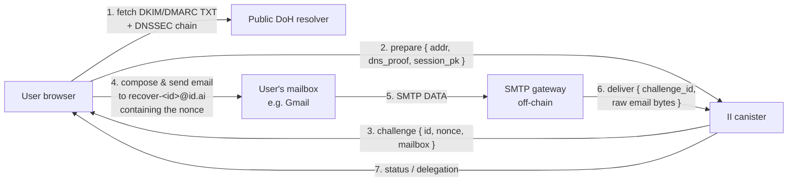

# Email-based identity recovery for Internet Identity

**Status:** Draft — RFC for review
**Last updated:** 2026-05-04
**Tracking PoC:** [#3760](https://github.com/dfinity/internet-identity/pull/3760) (DKIM postbox, will not be merged)
**Targets:** A new production-grade PR series, not a follow-up to #3760.

---

## 1. Background

Internet Identity currently offers one recovery channel when a user can no longer authenticate with any of their registered passkeys:

- **Recovery phrase** — a BIP-39-style seed phrase the user is responsible for storing offline.

(Earlier versions exposed a "Recovery device" flow as well; that surface is no longer offered to end users.)

Recovery phrases require the user to *prepare* a recovery method before losing access, and to retain something — paper, password manager, hardware — outside the device that is now unusable. We hear from users that this falls through in practice: phrases get lost, password managers get locked out, paper backups end up next to the primary device and disappear together.

Email is the recovery channel almost every user already has and almost every user can reach from any browser. The PoC PR [#3760](https://github.com/dfinity/internet-identity/pull/3760) added enough plumbing to *receive* DKIM-signed emails inside the canister and view them in a "Postbox" tab; that postbox surface is **out of scope** for this design. We borrow the DKIM verification primitive from the PoC, reshape it to verify a single email *in flight* without persisting the message, and use it as the building block for a recovery-only feature.

This doc proposes the production design that supersedes the PoC. The PoC PR will be closed; the work below should land as a fresh PR series against `main`.

### What the PoC got right

- A first-pass DKIM verifier with a `DkimCheck` step-by-step result so the UI can show *why* a signature did or didn't verify.
- The shape of `DkimVerificationStatus { Verified | Unverified | Pending }` decoupled from storage.
- Recipient-format and body/header bounds checks usable as input validation.

(The Postbox storage layout, the `smtp_postbox` stable map, per-anchor email pruning, and the `smtp_request` Candid surface for *delivering* mail to the canister are not carried forward — see §2 non-goals.)

### What the PoC explicitly deferred

From the PR review thread (sea-snake's comments and aterga's replies) the following were left for a follow-up:

| Area | Status in PoC | Spec gap |
|---|---|---|
| Trusted body retention (`l=`) | Stores full body, hashes only signed prefix | Storage may include bytes not covered by the signature |
| DKIM-Signature parser | Naive split on `;` and `=` | RFC 6376 §3.5 allows folding, arbitrary whitespace, multiple `b=`-like substrings inside other tag values |
| DNS TXT record parser | Tolerant of `P=` casing only | RFC 6376 §3.6.2.2 allows folding across multiple TXT chunks, arbitrary whitespace |
| Header canonicalization | "simple" rebuilt from parsed `(name, value)` | RFC 6376 §3.4.1 requires the *exact original* bytes; gateway contract change required |
| Policy tags `i=`, `k=`, future-dated `t=` | Not enforced | RFC 6376 §3.5 / §3.6.1 |
| DMARC alignment | Not implemented | RFC 7489 §3 |
| Service worker `postMessage` origin check | Missing | CodeQL alert #127 |

This document covers all of the above plus two architectural changes the PoC did not attempt:

- replacing DoH HTTP outcalls with **client-supplied DNSSEC-verified DNS records**;
- adding **email recovery** as a first-class authn method.

---

## 2. Goals & non-goals

**Goals**

- A user can register an email address as a recovery method, and use it to regain access if they lose every other authn method.
- DKIM verification is RFC-6376-compliant against the corpus of mainstream senders (Gmail, iCloud, Outlook, Fastmail, Proton, ProtonMail, Tutanota, AWS SES, SendGrid, Postmark, Mailgun).
- DMARC alignment is checked and enforced according to the sender's published policy.
- The canister's DKIM/DMARC verification is **fully deterministic** and does not depend on HTTPS outcalls during the recovery flow.
- A registered email holder can prove control of that address with a single signed email; the canister does not have to trust the SMTP gateway for *anything other than message delivery*.
- **The canister never persists incoming email contents.** The signed email and its DNSSEC bundle are passed in as a single call argument, verified, and acted on synchronously; only the small persistent state described in §8 is written to stable memory.

**Non-goals**

- The PoC's "Postbox" mailbox feature (storing inbound email per anchor for later viewing). The PoC's storage layout, push-notification path, and inbound-mail UI are not part of this design and will not be carried forward as part of email recovery.
- Sending email *from* the canister. Outbound (e.g., notifications, recovery codes) is delivered by an off-chain service that need not be in the trust path.
- Replacing the existing recovery option. Email recovery is an *additional* `AuthnMethodPurpose::Recovery` method; users can still register a recovery phrase.
- Protecting against a fully compromised mailbox provider. If Google's DKIM signing key is exfiltrated, every Gmail-recovery anchor is at risk; we accept that and document it.
- Verifying *encrypted* (S/MIME, PGP) email contents. We verify DKIM-signed envelopes only.

---

## 3. Threat model

**Trusted parties**

- The user's mailbox provider (Gmail, iCloud, …): trusted to keep the DKIM private key secret and to reject spoofed inbound mail destined for the user.
- The DNS authoritative servers for the sender's domain: trusted to publish honest DKIM/DMARC records, *and* trusted to sign them with DNSSEC.
- IANA / ICANN root KSK: trusted as the DNSSEC trust anchor.

**Untrusted parties**

- The SMTP-receiving gateway. Can drop, delay, reorder, or fabricate inbound messages. Cannot fabricate a DKIM signature without the sender's private key. Cannot fabricate a DNSSEC chain without the sender's signing keys.
- The DNSSEC resolver client (could be the SMTP gateway itself or the user's browser). Can lie about *which* records exist; cannot fabricate a valid DNSSEC chain.
- Boundary nodes / DoH providers. Same — used only as transports if used at all.

**Attacker capabilities we defend against**

1. *Spoofed `From:` header* — defended by DMARC alignment with verified DKIM `d=`.
2. *DKIM signature replay* — defended by `x=` expiration plus an ingest-time freshness window plus a single-use challenge nonce embedded in the email body and burned on first acceptance.
3. *DNS poisoning* — defended by DNSSEC validation against the IANA root KSK trust anchor (delivered as a deploy/upgrade arg, see §7.5).
4. *Length-extension via `l=` tag* — defended by ignoring any unsigned tail (see §5.3).
5. *Mass enumeration of email→anchor mappings* — gated by DKIM verification: an attacker cannot probe the index without a DKIM-valid email from the address being probed (see §3.1).

### 3.1 Why the email→anchor index does not need salted hashing

The index that maps a verified sender address to an anchor number is a public-shape concern (an attacker could in principle iterate addresses to discover whether a friend has an II account). In practice the lookup is gated by DKIM: the canister never accepts an `email_recovery_*` call without a DKIM-valid email signed by the queried domain on behalf of the queried address. An attacker who controls `mallory@gmail.com` can probe whether `mallory@gmail.com` is registered, but cannot probe `alice@gmail.com` without first compromising Alice's mailbox or Gmail's DKIM key — at which point they already have full mailbox control.

We therefore key the lookup index by `lowercase(local-part) + "@" + lowercase(domain)` directly. No per-anchor salt is needed. If a UX flaw later surfaces (e.g., the FE displaying the queried address back unmasked) we add a captcha or rate limit on top; we do *not* try to make the index itself unenumerable.

**Attacker capabilities we do *not* defend against**

- A user who voluntarily forwards their own DKIM-signed challenge email to an attacker. Standard phishing concern; mitigated by UX (challenge email's body says "do not forward").
- A SIM-swap-equivalent at the email provider (attacker controls the inbox). Out of scope.
- A registrar or TLD compromise that lets an attacker rotate DNSKEYs. The DNSSEC chain still validates, but for a malicious key. This is the same trust assumption every DNSSEC consumer makes.

---

## 4. High-level architecture



The architecture is built around three ideas:

- **DNSSEC validation happens once, up front, in the prepare call.** The user's browser fetches the sender domain's DKIM/DMARC TXT records *along with the full DNSSEC chain* via DoH and submits everything as a single call argument. The canister validates the chain cryptographically against the IANA root anchor (no HTTPS outcall), extracts the verified DKIM public keys + DMARC policy, and stores them under an opaque `challenge_id` with a 30-minute TTL. The session public key the FE wants the eventual delegation bound to is also passed in here. The canister returns the challenge nonce and the gateway recipient mailbox.
- **The user actually emails the nonce.** They send a fresh email from the address they typed, with the nonce in the body, to `recover-<challenge_id>@id.ai` (or `register-<challenge_id>@id.ai` for setup). The user does this in their normal mail client; the FE just shows instructions.
- **The SMTP gateway forwards the email to the canister.** When the gateway receives an email at one of its `register-*` / `recover-*` recipient addresses, it parses out the `challenge_id`, then calls `email_recovery_deliver(challenge_id, raw_email_bytes)` on the canister. The canister verifies the DKIM signature against the cached public key, checks DMARC alignment against the cached policy, finds the nonce in the signed body, verifies the `From:` matches the address in the original prepare call, then either binds the address (setup) or prepares a delegation tied to the FE's session public key (recovery). Until that update lands, the FE polls the canister with `email_recovery_status(challenge_id)` and shows a "waiting for your email…" spinner. Once the status flips, the FE retrieves the delegation (recovery) or shows "all set" (setup).

The SMTP gateway is *partially trusted*: it can drop, delay, or fabricate calls to `email_recovery_deliver`. It cannot fake a DKIM signature for a domain it doesn't control, so the worst it can do is withhold delivery (a DoS that's acceptable for a recovery channel users only hit when locked out).

This buys us:

- **Determinism without consensus tricks.** No HTTP transform, no `max_response_bytes`, no boundary-node trust on the DNS path.
- **No cycles spent on outcalls** during recovery, which is the latency-sensitive path.
- **No persistent inbox state on chain.** The only stable-memory state added is the registered email→anchor index and a small TTL'd map of pending challenge entries.
- **No raw email upload from the user's browser.** The FE never has to fetch and re-upload a multi-KB email — the gateway delivers the bytes once, directly to the canister. The FE only sees the verification *outcome* via polling.

We pay for it in:

- **Caller complexity.** The browser has to assemble the DNSSEC chain by walking the delegation from root down. This is straightforward TypeScript on top of DoH (see §7.4), no separate library or WASM module needed.
- **No DNSSEC, no email recovery.** Domains that don't sign their zones cannot be used. As of 2026-05, this includes a non-trivial slice of mainstream consumer mailbox domains. We surface this clearly in the UI at registration time and let the user pick a different address or fall back to a recovery phrase.
- **Trust the gateway to deliver.** A malicious or down gateway can stall recovery, but cannot fabricate or alter outcomes (every cryptographic check is on the canister side).

---

## 5. Component A — Production-grade DKIM verifier

The PoC's `src/internet_identity/src/dkim.rs` will be replaced rather than incrementally fixed. A naïve manual parser is the wrong shape for the spec — folding, multi-chunk TXT records, and byte-exact canonicalization push us toward a vetted parser.

### 5.1 Library choice

**Recommendation:** adopt [`mail-auth`](https://github.com/stalwartlabs/mail-auth) (Apache-2.0, used by Stalwart and others) as the DKIM and DMARC engine. Reasons:

- Pure Rust, no `std::net` dependencies, builds for `wasm32-unknown-unknown`.
- Exposes a `Resolver` trait we can implement against pre-fetched `(name, type) → bytes` records — perfect fit for §7's DNSSEC-arg pattern.
- Implements DKIM (RFC 6376), DMARC (RFC 7489), and ARC; we get items A, B, and the multi-signature behaviour the PoC already added.
- Test corpus from the project plus our own from §9.

**Rejected alternatives**

- `cfdkim` — solid but tightly coupled to `tokio-trust-dns`, hard to unhook from network IO.
- Continue rolling our own — every reviewer comment in the PoC PR is some shape of "you can't safely roll your own canonicalization parser." Agree.

### 5.2 Gateway contract change: raw header bytes

DKIM "simple" canonicalization signs the *exact original bytes* of each signed header line. The PoC SMTP gateway delivers headers as `(name: String, value: String)` pairs, which loses the original whitespace, folding, and the exact byte sequence after the colon.

The new Candid contract:

```candid
// Replaces SmtpHeader { name; value } with the original header line.
type SmtpHeaderRaw = blob;  // exact bytes of "Name: value\r\n", folding preserved

type SmtpMessage = record {
    headers : vec SmtpHeaderRaw;  // in receipt order, top to bottom
    body    : blob;               // exact bytes after CRLF CRLF separator
};
```

The interface keeps a parsed accessor (`SmtpMessageParsed`) for non-cryptographic UI use, but the verifier always operates on the raw blobs. A small parser inside the canister extracts `From:`, `To:`, `Subject:`, etc. for display — but the bytes that go to DKIM are untouched.

### 5.3 Trusted-body handling (`l=`)

When a DKIM signature includes `l=N`, only the first N bytes of the canonicalized body are signed. Anything past byte N is unauthenticated and could have been appended by a forwarder or an attacker.

Email recovery does not store inbound email at all (see §2 non-goals), so this is a *verification-time* concern rather than a storage-time concern:

- The DKIM verifier hashes only the first N bytes of the canonicalized body, exactly as RFC 6376 §3.4.5 requires.
- The challenge-nonce search (see §8) operates on the same signed-prefix bytes — the canonicalized first N. We do *not* search the unsigned tail. The mapping back to "which raw input bytes were signed" is intentionally not performed: relaxed canonicalization is not byte-reversible (whitespace runs collapse, trailing whitespace is stripped), so we search inside the canonicalized prefix and accept it if the nonce string appears there in any case-insensitive form.
- A signature with `l=` smaller than the location of the nonce is rejected as "nonce missing"; the user is told to resend without the trailing-content footer their mailbox provider may have appended.

The PoC's storage truncation (`truncate_at_char_boundary`) becomes irrelevant once the canister stops persisting the body, but we keep the same byte bound (`MAX_BODY_BYTES`) as an upper limit on the canister-call argument so a malformed caller cannot exhaust the message's argument budget.

### 5.4 Tag enforcement

Beyond the cryptographic check, the verifier rejects:

- `v != 1`.
- `a` outside the supported algorithm set: `rsa-sha256`, `ed25519-sha256`. (PoC supported `rsa-sha256` only.)
- `t > now + skew_window` — future-dated signatures (PoC parsed but did not enforce).
- `x < now` — expired signatures (the PoC's late round of fixes already enforces this; see [aterga's reply](https://github.com/dfinity/internet-identity/pull/3760#discussion_r3137585324) on the PoC review).
- `i=` — must end in `@d` or `.d` where `d` is the `d=` value. Soft-fail if the DNS `t=s` flag is set.
- DNS-side `k=` — defaults to `rsa`, must match the signature's algorithm.
- DNS-side `t=y` — testing flag; we treat the signature as Unverified with a `TestingMode` reason.

### 5.5 Multiple DKIM-Signature headers

PoC behaviour is correct: iterate over every `DKIM-Signature` header and accept on first verifying signature. Carry forward, emit per-signature `DkimCheck` arrays in the result so the UI can show why each one failed.

### 5.6 Public-key sanity

Already addressed in PoC: minimum 1024-bit RSA. Lift the floor to 2048 in a follow-up once telemetry shows no measurable rejection rate on the recovery surface — i.e., once we confirm none of the major senders we care about still sign at 1024.

---

## 6. Component B — DMARC alignment

DKIM proves "domain X signed this message." DMARC proves "the domain in the visible `From:` header authorized X to sign on its behalf." Without DMARC, an attacker who controls *any* domain with valid DKIM can spoof `From: alice@gmail.com` and we'd accept it.

### 6.1 `From:` header parsing

The verifier needs the *header-`From:`* domain (Y), not the SMTP envelope `MAIL FROM` the PoC consumes. RFC 5322 `From:` is an `address-list`; for DMARC, RFC 7489 §3.1.1 mandates that the message has *exactly one* `From:` header containing *exactly one* mailbox. We enforce both: reject (treat as Unverified, reason `MalformedFromHeader`) when there are zero, multiple, or list-style `From:` headers.

Implementation: lift the address parser from `mail-auth` (or `mailparse`).

### 6.2 DMARC record fetch

For sender domain Y, the canister needs the TXT record at `_dmarc.<Y>`. This is fetched the same way as DKIM keys — via the DNSSEC-validated arg bundle from §7. The verifier never makes its own DNS calls.

DMARC tags we honour:

| Tag | Meaning | Default |
|---|---|---|
| `v=DMARC1` | Required | — |
| `p=` | Policy: `none` / `quarantine` / `reject` | required |
| `sp=` | Subdomain policy | inherits `p=` |
| `adkim=` | DKIM alignment mode: `s` strict, `r` relaxed | `r` |
| `aspf=` | SPF alignment | (we don't check SPF — see §6.4) |
| `pct=` | Percentage of failing mail to apply policy | `100` |
| `fo=`, `rua=`, `ruf=`, `rf=` | Reporting | ignored |

### 6.3 Alignment check

Each verified DKIM `d=` (call it X) is checked for alignment with the `From:` domain (Y):

- **`adkim=s`** — X must equal Y, byte-for-byte ASCII-lowercased.
- **`adkim=r`** — X and Y must share an organizational domain.

The "organizational domain" is computed via the [Public Suffix List](https://publicsuffix.org/) (PSL). For example, `mail.gmail.com` and `gmail.com` align under PSL because both reduce to `gmail.com`; `gmail.co.uk` and `gmail.com` do not.

### 6.4 Public Suffix List delivery

The PSL is ~190 KB compressed and updated frequently. Two options:

**Option 1 (recommended): bundle a snapshot, refresh by upgrade proposal.** Ship the PSL inline in the WASM, source it from `publicsuffix.org/list/public_suffix_list.dat` at build time. The list changes slowly; quarterly or biannual refresh via canister upgrade is acceptable. The downside is registrars adding new TLDs see them late; the upside is zero runtime cost and a totally deterministic alignment computation.

**Option 2: PSL-via-DNSSEC-arg.** Have the caller fetch and submit the PSL line for the relevant TLD as part of the verification bundle. Smaller WASM, but adds another input the caller has to assemble. Defer.

We'll start with Option 1.

**Stricter fallback if PSL bundling is delayed:** treat `adkim=r` as "X equals Y or is a subdomain of Y." This is *more permissive* than the spec for cases like `mail.example.com` signing for `example.com` (good), and *less permissive* for `gmail.com` and `googlemail.com` style multi-domain orgs (acceptable; they almost always sign with `d=gmail.com` and align strict). We deploy this as Day-0 if Option 1 PSL bundling slips.

### 6.5 SPF: not checked

DMARC permits a message to pass via either DKIM-aligned *or* SPF-aligned. We deliberately do not check SPF, because:

- SPF needs the SMTP envelope's `MAIL FROM` (a.k.a. Return-Path) and the connecting IP. The IP is invisible to the canister; it would have to be passed by the gateway and is unauthenticated (the gateway can lie about it).
- SPF alone is not sufficient evidence of mailbox control — it only proves the connecting host was authorized, not that the mailbox holder originated the message.

For DKIM-aligned mail this never matters. For mail that *only* passes SPF (no DKIM), we treat it as Unverified.

### 6.6 Policy enforcement and verification status

We extend `DkimVerificationStatus` to carry DMARC outcome:

```rust
pub enum VerificationStatus {
    Pending,
    Verified {
        dkim_checks: Vec<DkimCheck>,
        dkim_domain: String,         // d= of the signature that won
        from_domain: String,         // Y from From: header
        dmarc: DmarcOutcome,
    },
    Unverified {
        dkim_checks: Vec<DkimCheck>,
        reason: VerificationFailReason,
    },
}

pub enum DmarcOutcome {
    Aligned { policy: DmarcPolicy, alignment_mode: AlignmentMode },
    Misaligned { policy: DmarcPolicy }, // failed alignment; policy says what to do
    NoRecord,                            // no _dmarc TXT for the domain
}
```

For the recovery and registration flows, we only accept emails where `DmarcOutcome` is `Aligned` *or* `NoRecord` with `dkim_domain == from_domain` (i.e., the DKIM domain matches the From: domain exactly even without an explicit DMARC record). Misaligned mail is rejected outright; there is no "spoofing suspected" middle state because the call has no value if it's not a usable proof.

### 6.7 Renaming

`DkimVerificationStatus` and `DkimCheck` are misnamed once DMARC enters; rename to `EmailVerificationStatus` and the wire-level `dkim_status` field to `verification_status`. The PoC types are not stable Candid; renaming during the rewrite is free.

---

## 7. Component C — DNSSEC arguments instead of HTTP outcalls

This is the largest architectural change versus the PoC and the foundation that makes the recovery flow practical.

### 7.1 Why move off HTTP outcalls

The PoC's `fetch_dkim_public_key` makes a `https://dns.google/resolve?...` outcall with a `transform_doh_response` function for replica consensus. It works, but:

- It costs ~30B cycles per verification.
- Consensus failure modes are subtle: every replica must see the same JSON, or the call traps.
- We trust dns.google (or whichever DoH provider) to honestly reflect the authoritative response.
- It does not work for the recovery hot path: ingress message size has a 2 MB ceiling and outcall latency is multi-second.
- For the *recovery* call specifically, whose argument already includes a signed email, having the canister go fetch DNS adds another round trip after the user already had to ship something to it.

### 7.2 The DNSSEC-arg pattern

For each DNS record the canister needs (DKIM TXT, DMARC TXT, in the future MX/SPF), the caller supplies the record bytes *plus* a chain of DNSSEC RRSIGs and DNSKEYs that prove those bytes are what the authoritative DNS published.

A "DNS proof bundle" looks like:

```rust
pub struct DnsProofBundle {
    /// The signed RRset we care about, e.g., the TXT records at
    /// `selector._domainkey.example.com`.
    pub leaf: SignedRRset,

    /// The signed root DNSKEY RRset (every link in `chain` is verified
    /// up to here). Validated by checking that one of its KSK DNSKEYs
    /// hashes to a DS digest in the trust anchor stored on the canister.
    pub root_dnskey: SignedRRset,

    /// Walk down the delegation chain from root toward `leaf`. Each
    /// entry is the DS RRset published in the parent zone (signed by
    /// the parent's DNSKEY) plus the DNSKEY RRset of the child zone
    /// (self-signed by the child's KSK and DS-pinned by the parent).
    pub chain: Vec<DelegationLink>,
}

pub struct SignedRRset {
    pub name: DnsName,
    pub rtype: u16,            // TXT, DNSKEY, DS, ...
    pub rdata: Vec<Vec<u8>>,   // canonical RDATA per RFC 4034 §6
    pub ttl: u32,
    pub rrsig: Rrsig,          // RFC 4034 §3
}

pub struct DelegationLink {
    pub child_ds: SignedRRset,         // DS RRset in parent
    pub child_dnskey: SignedRRset,     // DNSKEY RRset in child, signed by child's KSK
}
```

### 7.3 Verification algorithm

The trust anchor stored on the canister is a *DS-style digest* of the IANA root KSK — exactly the same shape IANA publishes at `data.iana.org/root-anchors/root-anchors.xml` (an algorithm + digest-type + hex digest). It is **not** a DNSKEY itself; the root DNSKEY RRset is supplied by the caller and validated against the digest at verification time.

```
verify(bundle):
    # 1. Validate the root DNSKEY RRset against the bundled trust anchor.
    #    The trust anchor is a DS digest (algo, digest-type, digest-bytes).
    #    Pick the DNSKEY in `bundle.root_dnskey.rdata` whose KSK digest
    #    matches the trust anchor; this is the root KSK we trust this
    #    call. Then verify the root DNSKEY RRset's RRSIG using that KSK.
    root_ksk = pick_dnskey_matching_ds(bundle.root_dnskey.rdata, TRUST_ANCHOR_DS)
    verify_rrsig(bundle.root_dnskey.rrsig, bundle.root_dnskey.rdata, root_ksk)

    # 2. Walk down the delegation chain.
    parent_keys = bundle.root_dnskey.rdata    # the validated root DNSKEY RRset
    for link in bundle.chain:
        # Parent's DS RRset is signed by the parent's DNSKEY.
        verify_rrsig(link.child_ds.rrsig, link.child_ds.rdata, parent_keys)
        # Parent's DS digest matches one of the child's KSK DNSKEYs.
        child_ksk = pick_dnskey_matching_ds(link.child_dnskey.rdata, link.child_ds)
        # Child's DNSKEY RRset is self-signed by its KSK.
        verify_rrsig(link.child_dnskey.rrsig, link.child_dnskey.rdata, child_ksk)
        parent_keys = link.child_dnskey.rdata

    # 3. Leaf RRset is signed by the deepest zone's DNSKEY.
    verify_rrsig(bundle.leaf.rrsig, bundle.leaf.rdata, parent_keys)

    # 4. Freshness — every RRSIG's [inception, expiration] window must
    #    contain the verifier's clock (±clock_skew).
    now = ic_cdk::time()
    for rrsig in all_rrsigs(bundle):
        require rrsig.inception <= now + clock_skew
        require rrsig.expiration >= now - clock_skew
```

`verify_rrsig` uses RFC 4034 §3.1.8.1 canonical form (lowercase owner names, RDATA in canonical order) and the algorithm code from the RRSIG. We support algorithms 8 (RSA-SHA256), 13 (ECDSA-P256-SHA256), and 15 (Ed25519) — RFC 8624 "MUST" implementations. Anything older (RSA-SHA1, RSA-MD5) is rejected.

### 7.4 Caller-side bundle assembly

The browser assembles `DnsProofBundle` directly in TypeScript. No separate library or WASM module is required:

- Issue DoH queries with `do=1` (request DNSSEC) and `cd=1` (don't validate, give us raw RRSIGs) to a public resolver. `dns.google` and `cloudflare-dns.com` both expose this; the FE can fall back between them. Browsers without OS-level DNS APIs cannot reach the authoritative servers directly, so DoH is the practical path.
- Walk the delegation chain by querying the DS RRset at each parent zone (root → TLD → registered domain → `_domainkey` subdomain).
- Stop at root, where the DNSKEY RRset is validated against the trust anchor stored on the canister rather than against another DS lookup.

The earlier draft mentioned "the OS resolver" as a fallback when DoH providers are unavailable; in practice browsers don't expose the OS resolver, so the practical fallback is between multiple DoH endpoints, not to the OS. Domains for which DoH refuses to return RRSIGs are treated the same as domains without DNSSEC (§7.6).

This is a small TS module (~300 lines, no dependencies beyond `fetch`) living in `src/frontend/src/lib/utils/dnssec/`. There is no separate WASM module; the canister already has a Rust DNSSEC verifier and the FE only needs to *gather* the records, not verify them.

### 7.5 Root anchor management — deploy-arg, not bundled

The trust anchor (the DS digest of the IANA root KSK) lives in the canister's persistent state, set on every deploy via the `init`/`post_upgrade` arg:

```candid
type EmailRecoveryConfig = record {
    dnssec_root_anchors : vec record {
        // Per `data.iana.org/root-anchors/root-anchors.xml`.
        key_tag      : nat16;
        algorithm    : nat8;       // 8 / 13 / 15
        digest_type  : nat8;       // 1 (SHA-1) or 2 (SHA-256). We only ship type 2.
        digest       : blob;       // 32 bytes for SHA-256
    };
};
```

Multiple anchors are accepted simultaneously to make rollover trivial — during a key transition both the retiring and the incoming KSK digests live in `dnssec_root_anchors`. This is the same shape IANA publishes when both old and new KSKs are valid.

II is deployed at least weekly, so refreshing the anchor list on every deploy is essentially free; we don't need a separate governance mechanism for it.

**Rollover frequency.** In practice the IANA root KSK rolls *very rarely*: once in DNSSEC's history, in October 2018 (the "KSK rollover from 2010 to 2017 KSK"). No further rollover has happened or is publicly scheduled at the time of writing. IANA publishes signed announcements months in advance when one is upcoming. We keep the deploy-arg shape so that when the next rollover does happen (announced anchor publication updates), it's a one-line config change in the next weekly deploy rather than a code change.

The active anchor list is exposed at `http_request("/.well-known/ii-dnssec-anchors")` for auditability.

### 7.6 Domains without DNSSEC

If the caller cannot construct a chain, the canister rejects the verification. The TS helper detects this case (no RRSIG returned for the leaf) and surfaces it to the UI with a copy-able message:

> "Your email provider's domain (`example.com`) does not sign its DNS records (DNSSEC). Internet Identity cannot verify mail from this domain. Try a different email address from a provider that supports DNSSEC, or use a recovery phrase instead."

A small helper page lists the major consumer providers and their DNSSEC status.

### 7.7 Replay and freshness

DNSSEC RRSIGs have inception and expiration timestamps but the typical validity window is days to weeks — too coarse for our needs. We add two more layers:

- **DKIM `x=`** — mandatory ceiling enforced by §5.4.
- **Per-flow recovery nonce** — issued by the canister at the start of a registration or recovery attempt, embedded in the body of the challenge email, single-use, valid for 30 minutes. A replayed signed email contains a stale or already-burned nonce and is rejected.

---

## 8. Component D — Email recovery as an authn method

Email recovery shares the most code with the OpenID flow (`src/internet_identity/src/openid/`): both link an external identity to an anchor, both have a verification step, both produce a delegation. The natural shape is to add an `EmailRecoveryCredential` peer to `OpenIdCredential`.

### 8.1 The user-visible flow

The whole feature, both setup and recovery, fits in three steps the user sees:

1. **Enter your email.** The FE asks for the address. Behind the scenes the FE fetches the DNSSEC chain for the domain and submits everything to the canister in one prepare call. For recovery it also generates a fresh ECDSA keypair locally and sends the public key as part of the same call — that key is what the eventual delegation will be bound to.
2. **Send a magic email.** The canister issues a one-line token (e.g. `II-Recovery-A1B2C3D4`); the FE asks the user to send a fresh email containing that token to `recover-<challenge>@id.ai` (or `register-<challenge>@id.ai` for setup).
3. **Done.** The SMTP gateway forwards the email straight to the canister, the canister verifies it, and the FE's polling spinner flips to either "all set" (setup) or "signed in" (recovery, with the delegation it can use immediately).

The shape is one canister call up front, then waiting:

- `prepare_register(anchor, addr, dns_proof)` / `prepare_recover(addr, dns_proof, session_pk)` — the FE assembles the DNSSEC chain via DoH and ships it together with the address (and, for recovery, the FE-generated session public key). The canister validates the DNSSEC chain immediately, extracts the verified DKIM public keys + DMARC policy, and caches them under an opaque `challenge_id`. Returns `{ challenge_id, nonce, mailbox, expires_at }`.
- The gateway calls `deliver(challenge_id, raw_email_bytes)` when the email arrives. The canister DKIM-verifies against the cached key, checks DMARC + nonce + `From:`, and either binds the address (setup) or stamps a delegation seed for the cached `session_pk` (recovery). The FE is **not** involved here — no upload from the browser.
- The FE polls `status(challenge_id)` while the user composes/sends the email. Once status flips to `Succeeded`, recovery flows then call `get_delegation(...)` (a query) for the SignedDelegation; setup flows just show "all set".

This shape gives us:

- Heavy work (DNSSEC chain validation) happens once, up front, before the user has to do anything irreversible.
- Errors are localized: a domain whose DNSSEC chain doesn't validate, or whose DMARC policy is missing, fails at step 1 with a clear message ("we can't accept email from `example.com` because the domain isn't DNSSEC-signed"). The user finds out *before* sending an email.
- The browser never re-uploads a multi-KB email — the gateway hands the raw bytes directly to the canister.
- The FE never needs to know the DKIM selector in advance — the prepare call uploads DKIM records for the well-known selectors of common providers (built-in map, see §8.4 notes), and the canister picks the one matching the eventual email's `DKIM-Signature` header.

### 8.2 Storage model

```rust
pub struct EmailRecoveryCredential {
    /// Lowercased canonical form: `lowercase(local-part) + "@" + lowercase(domain)`.
    /// Stored verbatim (not hashed) so the user can see it back in the
    /// management UI; it's exactly what they typed at registration.
    pub address: String,

    /// Unix-seconds.
    pub created_at: u64,
    pub last_used: Option<u64>,
}
```

A new stable map indexes `lowercase(address) → AnchorNumber` to support the recovery lookup. Memory ID 24 (next free). Per §3.1, the index is enumerable only to attackers who already control the queried mailbox, so it's stored unsalted.

A second, ephemeral map holds *pending challenges* keyed by `challenge_id`. Each entry carries:

- `kind`: `Register { anchor }` or `Recover { session_pk }`,
- the claimed lowercased address,
- the verified DKIM public keys keyed by selector,
- the verified DMARC policy,
- the human-readable nonce,
- a `status: Pending | Succeeded { outcome } | Failed { error }`,
- a 30-minute expiry.

Entries flip from `Pending` to `Succeeded`/`Failed` on `email_recovery_deliver`. They are dropped on poll-after-expiry, on terminal status read, or on TTL eviction. Memory-bounded `StableBTreeMap` with oldest-first eviction. Memory ID 25.

We do **not** store any inbound email body, header bytes, or DKIM verification artefacts past the moment `deliver` returns. The cached `session_pk` for recovery is the only piece that survives between prepare and the eventual delegation issuance.

### 8.3 Candid surface

```candid
// Returned by every prepare_* call.
type EmailRecoveryChallenge = record {
    challenge_id : blob;        // 16 random bytes, hex-encoded for the mailbox
    nonce        : text;        // human-typeable, e.g. "II-Recovery-A1B2C3D4"
    mailbox      : text;        // "register-<id>@id.ai" or "recover-<id>@id.ai"
    expires_at   : nat64;       // Unix seconds; 30 minutes after issue
};

// What the FE submits at prepare time. Carries the DNS proofs for every
// candidate DKIM selector the FE expects the email to be signed under,
// plus the DMARC record. The canister DNSSEC-validates each entry and
// keeps a map { selector → public_key } for the deliver call.
type EmailRecoveryDnsProof = record {
    address      : text;                       // lowercase canonical form
    dkim_records : vec record {                // 1..=N candidate selectors
        selector : text;
        proof    : DnsProofBundle;             // RRset + chain to root
    };
    dmarc_record : DnsProofBundle;             // _dmarc.<domain>
};

type EmailRecoveryError = variant {
    Unauthorized              : principal;
    ChallengeUnknown;
    ChallengeExpired;
    DnsProofInvalid           : text;          // bad DNSSEC chain, no DMARC, etc.
    DomainNotSupported        : text;          // no DNSSEC, or DMARC p=none
    EmailVerificationFailed   : VerificationStatus;
    NonceMissing;                              // not in the signed body
    AddressMismatch;                           // From: did not match
    AddressAlreadyRegistered;
    AddressNotRegistered;
    InternalCanisterError     : text;
};

// Polling result.
type EmailRecoveryStatus = variant {
    Pending;
    SucceededRegister;                                              // setup done
    SucceededRecover : record { user_key : UserKey;                 // recovery ready
                                expiration : Timestamp };
    Failed   : EmailRecoveryError;
    Expired;
};

service : {
    // ---------- Prepare (creates a challenge) ----------

    // Setup: caller is the authenticated identity. Validate DNS, cache
    // verified key + policy, return a challenge bound to (anchor, address).
    email_recovery_prepare_register :
        (IdentityNumber, EmailRecoveryDnsProof)
        -> (variant { Ok : EmailRecoveryChallenge; Err : EmailRecoveryError });

    // Recovery: anonymous. Same as setup-prepare plus session_pk that the
    // eventual delegation will be bound to. The anchor is resolved later
    // from the verified From: of the email.
    email_recovery_prepare_recover :
        (EmailRecoveryDnsProof, SessionKey)
        -> (variant { Ok : EmailRecoveryChallenge; Err : EmailRecoveryError });

    // ---------- Deliver (called by the SMTP gateway) ----------

    // Open call: anyone can submit, but only DKIM-valid emails matching a
    // known challenge_id move state. The recipient address embeds the
    // challenge_id (e.g. recover-7f3a9c2e@id.ai), so the gateway extracts
    // it before calling. Idempotent: a second call for the same challenge
    // is a no-op once the challenge is in a terminal status.
    email_recovery_deliver :
        (record { challenge_id : blob; email_message : SmtpMessage })
        -> (variant { Ok; Err : EmailRecoveryError });

    // ---------- Poll + retrieve ----------

    // FE polls this while the user is sending the email. Returns the
    // current status of the challenge; once Succeeded* the FE acts on it.
    email_recovery_status :
        (blob)
        -> (EmailRecoveryStatus) query;

    // After SucceededRecover, the FE fetches the SignedDelegation. The
    // session_key + expiration must match what was stored at prepare time
    // (the FE sent session_pk; the canister returns the matching SignedDelegation).
    email_recovery_get_delegation :
        (record { challenge_id : blob; session_key : SessionKey; expiration : Timestamp })
        -> (variant { Ok : SignedDelegation; Err : EmailRecoveryError }) query;

    // ---------- Manage ----------

    // Remove a registered recovery address.
    email_recovery_remove :
        (IdentityNumber, text)
        -> (variant { Ok; Err : EmailRecoveryError });
}
```

`email_recovery_get_delegation` mirrors the existing `openid_get_delegation` in `src/internet_identity/src/main.rs:1357`. The delegation seed produced at `deliver` time becomes the input to `prepare_jwt_delegation`-equivalent logic.

### 8.4 Setup flow

The SMTP gateway listens on `*-@id.ai`. When it receives an email at `register-<id>@id.ai` it parses out the `challenge_id`, then submits the raw bytes to the canister via `email_recovery_deliver`. It does not store the email beyond the brief in-memory hold needed for the call.

```mermaid
sequenceDiagram
    participant U as User (logged in)
    participant FE as II frontend
    participant DNS as Public DoH resolver
    participant II as II canister
    participant Mail as User's mailbox
    participant GW as SMTP gateway<br/>(off-chain)

    Note over U,FE: 1 — User enters email
    U->>FE: "Add email recovery", types alice@gmail.com

    Note over FE,II: 2 — FE assembles DNS proof and prepares the challenge
    FE->>DNS: DKIM TXT for known gmail.com selectors,<br/>DMARC TXT for _dmarc.gmail.com,<br/>full DNSSEC chain (DoH cd=1, do=1)
    DNS->>FE: signed RRsets + RRSIGs + DS chain
    FE->>II: email_recovery_prepare_register(anchor, EmailRecoveryDnsProof)
    II->>II: verify DNSSEC; extract DKIM pubkeys per selector;<br/>parse DMARC policy; store under challenge_id (TTL 30 min)
    II->>FE: { challenge_id, nonce, mailbox: "register-<id>@id.ai", expires_at }

    Note over U,Mail: 3 — User emails the magic token
    FE->>U: "Send an email containing II-Recovery-A1B2C3D4<br/>to register-<id>@id.ai from alice@gmail.com"
    U->>Mail: composes & sends from alice@gmail.com
    Mail->>GW: SMTP DATA (DKIM-signed by gmail.com)

    Note over GW,II: 4 — Gateway forwards email straight to the canister
    GW->>II: email_recovery_deliver({ challenge_id, email_message })
    II->>II: verify DKIM signature vs cached pubkey;<br/>check DMARC alignment vs cached policy;<br/>find nonce in signed prefix;<br/>verify From: matches the address;<br/>bind address → anchor; mark challenge Succeeded

    Note over FE,II: 5 — FE polls the canister and shows result
    loop until terminal status
        FE->>II: email_recovery_status(challenge_id)
        II->>FE: Pending / SucceededRegister / Failed / Expired
    end
    FE->>U: "alice@gmail.com is now a recovery method."
```

Notes:

- The challenge_id is opaque (16 random bytes, hex). Embedding the anchor number in the gateway address would leak it; using a per-challenge id avoids that.
- The FE assembles the DNSSEC bundle in plain TS using DoH (§7.4); no library dependency, no WASM.
- "Known selectors" comes from a built-in FE map for common providers (Gmail, iCloud, Outlook, Fastmail, Proton, …). Domains outside the map fall back to "advanced — enter your selector manually" or fail at prepare time with a copy-pastable error.
- The nonce is searched as a case-insensitive substring inside the canonicalized signed-prefix bytes (§5.3). Mailbox providers that append signatures or footers don't break the check as long as the nonce sits inside the DKIM-signed body window.
- `email_recovery_deliver` is open: anyone can call it, but the only effect is to verify a DKIM-signed email against an already-cached challenge. A malicious gateway can withhold or duplicate calls, but cannot forge state changes.
- Polling cadence: the FE backs off from 1 s to 5 s; after `expires_at` it stops polling and shows the timeout state.

### 8.5 Recovery flow

Same shape, with three differences:
- `prepare_recover` is anonymous and additionally takes `session_pk` (a fresh ECDSA public key the FE generated locally).
- On `deliver`, the canister looks up the anchor from the verified `From:` address and stamps the delegation seed bound to that `session_pk`.
- After polling sees `SucceededRecover`, the FE makes a final query call to `get_delegation` for the actual `SignedDelegation`.

```mermaid
sequenceDiagram
    participant U as User (lost passkey)
    participant FE as II frontend
    participant DNS as Public DoH resolver
    participant II as II canister
    participant Mail as User's mailbox
    participant GW as SMTP gateway<br/>(off-chain)

    Note over U,FE: 1 — User enters email
    U->>FE: "Recover with email", types alice@gmail.com
    FE->>FE: generate session ECDSA keypair (session_pk + session_sk)

    Note over FE,II: 2 — FE submits DNS proof + session_pk, gets challenge
    FE->>DNS: DKIM TXT (known selectors), DMARC TXT, DNSSEC chain
    DNS->>FE: bundle
    FE->>II: email_recovery_prepare_recover(EmailRecoveryDnsProof, session_pk)
    II->>II: verify DNSSEC; extract pubkeys; parse policy;<br/>store under challenge_id (TTL 30 min);<br/>anchor will be resolved on deliver
    II->>FE: { challenge_id, nonce, mailbox: "recover-<id>@id.ai", expires_at }

    Note over U,Mail: 3 — User emails the magic token
    FE->>U: "Send an email containing II-Recovery-…<br/>to recover-<id>@id.ai from alice@gmail.com"
    U->>Mail: send signed email
    Mail->>GW: SMTP DATA

    Note over GW,II: 4 — Gateway forwards email straight to the canister
    GW->>II: email_recovery_deliver({ challenge_id, email_message })
    II->>II: verify DKIM + DMARC + nonce + From:;<br/>look up anchor by lowercase(From: address);<br/>stamp delegation seed bound to cached session_pk;<br/>mark challenge Succeeded

    Note over FE,II: 5 — FE polls and retrieves the delegation
    loop until terminal status
        FE->>II: email_recovery_status(challenge_id)
        II->>FE: Pending / SucceededRecover { user_key, expiration } / Failed / Expired
    end
    FE->>II: email_recovery_get_delegation({ challenge_id, session_key, expiration })
    II->>FE: SignedDelegation
    FE->>U: signed in
```

Two design points worth pinning down:

- **No address pre-lookup.** The address typed by the user is sent to the canister at prepare time only as part of the DNS proof, not as a lookup key. The anchor isn't resolved until `deliver`, when the verified `From:` of the email picks it. If the user typed the wrong address (or doesn't actually own it), the FE just times out polling — there's no leaky lookup-hint round trip.
- **One anchor per address.** The lookup table is `address → anchor`, not `address → vec<anchor>`. We do not allow the same address on two anchors: at recovery time, the user's email proof would otherwise not uniquely identify which identity they meant, and users do not generally know their anchor number. `email_recovery_deliver` returns `AddressAlreadyRegistered` (during a register-deliver) if the address is already bound to any anchor, including the caller's own.

### 8.6 UX screen mockups

These are wireframes; final visual design lives in Figma. Layout expressed as ASCII so the flow is reviewable inside this doc.

**Manage page — Recovery methods card** (lives at `(access-and-recovery)/recovery/+page.svelte`)

```
┌──────────────────────────────────────────────────────────────┐
│  Recovery methods                                            │
│  Use these to regain access if you lose your passkeys.       │
│                                                              │
│  ┌────────────────────────────────────────────────────────┐  │
│  │ 🔑  Recovery phrase                       [ Active ]   │  │
│  │     12-word seed kept offline.                         │  │
│  │                                       [ Reset phrase ] │  │
│  └────────────────────────────────────────────────────────┘  │
│                                                              │
│  ┌────────────────────────────────────────────────────────┐  │
│  │ ✉️   Recovery email                       [ Inactive ] │  │
│  │     Receive sign-in by sending a signed email.         │  │
│  │                                          [ Add email ] │  │
│  └────────────────────────────────────────────────────────┘  │
└──────────────────────────────────────────────────────────────┘
```

**Setup wizard — step 1: enter address**

```
┌──────────────────────────────────────────────────────────────┐
│  Add email recovery — 1 of 3                                 │
│                                                              │
│  Email address                                               │
│  ┌────────────────────────────────────────────────────────┐  │
│  │ alice@gmail.com                                        │  │
│  └────────────────────────────────────────────────────────┘  │
│                                                              │
│  We'll verify your email's DNS records and ask you to        │
│  send a short confirmation email from this address.          │
│                                                              │
│                                       [ Cancel ]  [ Next → ] │
└──────────────────────────────────────────────────────────────┘
```

**Setup wizard — step 2: send the magic email** (FE shown after `prepare_register` returns)

```
┌──────────────────────────────────────────────────────────────┐
│  Add email recovery — 2 of 3                                 │
│                                                              │
│  Send an email from your inbox with these contents:          │
│                                                              │
│   ┌──────────────────────────────────────────────────────┐   │
│   │  To:       register-7f3a9c2e@id.ai          [ copy ] │   │
│   │  From:     alice@gmail.com                           │   │
│   │  Subject:  (anything)                                │   │
│   │  Body:     II-Recovery-A1B2C3D4              [ copy ]│   │
│   └──────────────────────────────────────────────────────┘   │
│                                                              │
│  Don't change the recipient or token. The link expires       │
│  in 29:42.                                                   │
│                                                              │
│           ⏳ Waiting for your email to arrive…               │
│                                                                │
│                                       [ Cancel ]  [ Resend ] │
└──────────────────────────────────────────────────────────────┘
```

**Setup wizard — step 3: done**

```
┌──────────────────────────────────────────────────────────────┐
│                                                              │
│                          ✅  All set                         │
│                                                              │
│        alice@gmail.com is now a recovery method.             │
│                                                              │
│        If you ever lose your passkeys, you can sign in       │
│        again by sending a signed email from this address.    │
│                                                              │
│                                                  [ Done ]    │
└──────────────────────────────────────────────────────────────┘
```

**Recovery sign-in — picker** (lives at `(new-styling)/recovery/+page.svelte`)

```
┌──────────────────────────────────────────────────────────────┐
│  Sign in to recover                                          │
│  Choose how you'd like to recover your identity:             │
│                                                              │
│  ┌────────────────────────────────────────────────────────┐  │
│  │ 🔑  Recovery phrase                                    │  │
│  │     Type your 12-word phrase.            [ Continue ]  │  │
│  └────────────────────────────────────────────────────────┘  │
│                                                              │
│  ┌────────────────────────────────────────────────────────┐  │
│  │ ✉️   Recovery email                                    │  │
│  │     Send a signed email from your address. [ Continue ]│  │
│  └────────────────────────────────────────────────────────┘  │
└──────────────────────────────────────────────────────────────┘
```

**Recovery sign-in — email branch** (the same three steps as setup, with terminal step "signed in" instead of "all set"). Step 2 is identical except the recipient is `recover-<id>@id.ai`.

**Error states (all wizard steps)**

```
┌──────────────────────────────────────────────────────────────┐
│  ⚠  Can't use this email                                     │
│                                                              │
│  example.com isn't signed with DNSSEC, so we can't verify    │
│  email from this domain. Try a different address — Gmail,    │
│  iCloud, Outlook, Fastmail, and Proton all work.             │
│                                                              │
│                                              [ Try again ]   │
└──────────────────────────────────────────────────────────────┘
```

### 8.7 Delegation issuance

The delegation is produced via the same canister-signature path as OpenID. At `prepare_recover` time the FE supplies a fresh ECDSA `session_pk` which the canister parks inside the pending-challenge entry. When `deliver` succeeds, the canister stamps the delegation seed using `(anchor || "email-recovery" || lowercase_address)` and the cached `session_pk`; both `user_key` and `expiration` are returned via `email_recovery_status` once the challenge is `SucceededRecover`. The FE then makes one query call to `email_recovery_get_delegation` to retrieve the SignedDelegation. Expiration is the standard 30 minutes (`OPENID_SESSION_DURATION_NS`).

### 8.8 Rate limits

| Surface | Limit | Reason |
|---|---|---|
| `email_recovery_prepare_register` per anchor | 5 / hour | UX cost of sending an email is asymmetric — we don't need fast retries |
| `email_recovery_deliver` per challenge | 1 effective (single-use) | Idempotent on terminal status; further calls are no-ops |
| `email_recovery_register` (active addresses) per anchor | max 3 | Bounded storage |

There are no per-IP limits — II does not currently track per-IP state and that's out of scope here. Anonymous abuse of `email_recovery_prepare_recover` is bounded by the canister-side message-size and cycles cost; the heavy DNSSEC validation cost makes it self-rate-limiting under sustained load. Revisit if telemetry shows abuse.

Per-anchor limits are enforced with stable-memory backed counters keyed by `(anchor, hour_bucket)`; the existing rate-limiter module is reused.

### 8.9 Frontend changes

The current management surface lives at `src/frontend/src/routes/(new-styling)/manage/(authenticated)/(access-and-recovery)/recovery/+page.svelte` and today only renders the recovery-phrase card. The recovery (sign-in) flow lives at `src/frontend/src/routes/(new-styling)/recovery/+page.svelte` and uses `RecoverIdentityWizard`.

- **Manage page** — rename the page heading from "Recovery phrase" to **"Recovery methods"** (see §8.6 mockup) and split it into two cards: the existing `ActiveRecoveryPhrase` / `InactiveRecoveryPhrase` / `UnverifiedRecoveryPhrase` card (no functional change), and a new `EmailRecovery` card with `Active` / `Inactive` states, an "Add email" wizard, and remove confirmation. New svelte components live in the same `recovery/components/` directory next to the phrase ones.
- **Recovery sign-in page** — extend `RecoverIdentityWizard` with a second top-level option, "Recover with email", alongside the existing phrase entry. The email path drives a new `RecoverWithEmailWizard` component implementing the three-step flow from §8.6: enter address → send-the-magic-email instructions screen with a live poll spinner → signed-in.

DNSSEC bundle assembly (see §7.4) lives in `src/frontend/src/lib/utils/dnssec/` and is reused by both wizards.

There is no "recover with device" flow in the current frontend; the older `FLOWS.mdx` references are stale and should be ignored. All routing and component additions go directly into the svelte routes above.

There is no `web_push.rs` / service-worker integration in scope here — push notifications were a Postbox feature and are out of scope (§2 non-goals).

---

## 9. Test corpus

A new crate `internet_identity_email_test_vectors` carries:

- **DKIM happy path**: 100+ real signed messages from each major provider (Gmail, iCloud, Outlook, Fastmail, Proton, SES, SendGrid, Mailgun, Postmark, Tutanota), recorded once and committed as `.eml` + DNS bundle pairs.
- **DKIM tampering**: each happy-path vector mutated in 8+ ways (header bit flip, body byte flip, signature truncation, key swap, …) — every mutation must Unverify.
- **DMARC alignment**: matrix of `(d=, From:)` × `(adkim=s, adkim=r)` × `(under PSL same org, different org)`.
- **DNSSEC**: 20 chains, including ECDSA-only and Ed25519-only; intentionally broken chains for negative tests.
- **Replay/expiry**: signatures with `x=` in the past, future-dated `t=`.

Vectors are checked against `mail-auth` first, then committed; the canister's verifier must reach the same verdict on every one.

CI runs the corpus against the PocketIC-hosted canister to catch wasm-only regressions.

---

## 10. Migration & rollout

### Phase 0 — Land foundations (no user-visible change)

1. Replace `dkim.rs` with a `mail-auth`-backed module that takes raw header bytes and a `DnsProofBundle` instead of doing DoH outcalls.
2. Add the DNSSEC verifier as a module under `src/internet_identity/src/dnssec/`, with the trust-anchor list wired through the canister init/upgrade arg (§7.5).
3. Land the test corpus (§9).

PR scope: ~3000 lines net, plus `mail-auth` as a dep.

### Phase 1 — Beta email recovery

4. Add `EmailRecoveryCredential` storage + Candid surface (§8.2, §8.3).
5. Add registration and recovery flows behind an `email_recovery_enabled` feature flag in `IdentityInfo.metadata`.
6. Add the off-chain SMTP gateway forwarder service. Stateless w.r.t. canister; ~5-minute in-memory buffer per challenge.
7. Internal-only beta: dfinity-employee anchors get the flag flipped on, exercise both flows.
8. Telemetry: success rates by mailbox provider, DNSSEC failure rates, time-to-completion percentiles.

### Phase 2 — Public beta

9. Flip the flag for all anchors created after a cutoff date; existing users see "Add email" in the Recovery methods card on Manage.
10. Add the email entry in `RecoverIdentityWizard` (§8.9).

### Phase 3 — GA

11. Remove the beta label; remove the feature flag.

We do **not** keep PoC PR #3760's WASM in any release. Its branch closes when Phase 0 lands.

---

## 11. Open questions

- **DNSSEC root anchor on rotation.** Settled — the trust anchor list is a deploy/upgrade arg (§7.5), refreshed alongside any IANA rollover in the next weekly deploy. KSK rollovers happen approximately once a decade; ZSK rolls don't affect the anchor.
- **Email aliases.** `alice+ii@gmail.com` and `alice@gmail.com` are kept as **distinct** addresses. Gmail treats them as the same mailbox, but other providers don't, and we do not want to bake provider-specific aliasing rules into the canister. The user registers exactly the address they typed, lowercased.
- **Lost mailbox.** If a user's email account is gone (provider closed, domain expired), recovery via this channel is unrecoverable. *Out of scope for this design.* Email recovery is one of several recovery surfaces; users with stronger guarantees should still keep a recovery phrase.
- **Privacy: enumeration.** Settled — addressed by §3.1. The lookup is gated by a DKIM-valid email signed for the queried address, so an attacker cannot probe addresses they do not already control. UX-level rate limiting on `email_recovery_prepare_recover` keeps churn bounded.
- **Multi-anchor per address.** Not allowed — `email_recovery_deliver` returns `AddressAlreadyRegistered` (during a register-deliver) if any anchor already has the address bound. Recovery looks up by address, and users do not generally know their anchor number, so the mapping must be functional (§8.5).
- **Internationalised domains (IDN).** A-label vs U-label canonicalization matters for both the local-part and domain. ASCII-lowercase the A-label form everywhere and reject U-label inputs at the Candid boundary. Acceptable for v1; revisit if user reports surface IDN-mailbox cases we missed.

---

## 12. References

- RFC 6376 — DomainKeys Identified Mail (DKIM) Signatures
- RFC 8301 — Cryptographic Algorithms and Key Usage for DKIM
- RFC 7489 — Domain-based Message Authentication, Reporting, and Conformance (DMARC)
- RFC 4033/4034/4035 — DNSSEC
- RFC 8624 — Algorithm Implementation Requirements and Usage Guidance for DNSSEC
- [Public Suffix List](https://publicsuffix.org/)
- [`mail-auth` crate](https://github.com/stalwartlabs/mail-auth)
- [IANA DNSSEC root anchors](https://www.iana.org/dnssec/files)
- PoC PR [#3760](https://github.com/dfinity/internet-identity/pull/3760)
