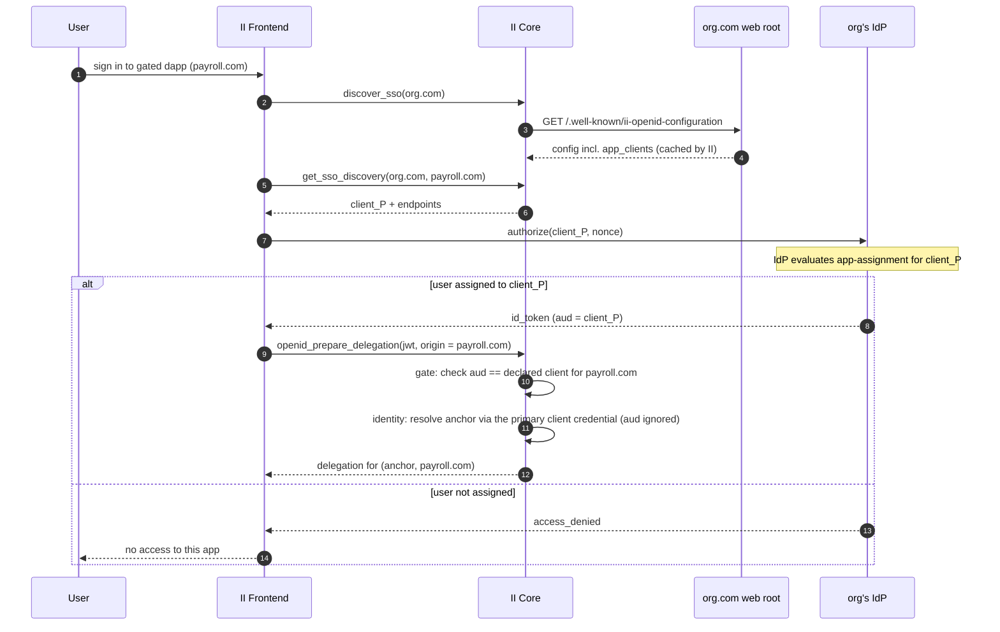

# IdP-side per-app gating for enterprise SSO

**Status:** Draft — RFC for review. Nothing here is implemented.
**Last updated:** 2026-07-09
**Companion:** `enterprise-sso-per-app-access-control.md` specifies the *id.ai-side* gate
(directory + access canister). This document specifies an **independent, complementary
layer** that gates entirely on the **IdP side**. The two are composable and selected per app
(§9); neither depends on the other.

**Implementation status.** None. All sections are proposed.

---

## Glossary

| Term | Meaning |
| --- | --- |
| **IdP** | The org's corporate identity system (Okta, Microsoft Entra ID, OneLogin). |
| **id_token** | The signed OIDC JWT the IdP issues for a login; II verifies it against the IdP's JWKS. |
| **`aud`** | Audience claim — the OAuth `client_id` the token was minted for. |
| **`iss` / `sub`** | The issuer and the IdP's identifier for the human within a token. |
| **Stable identifier** | An identifier that is the **same across all of an org's OIDC clients**. `sub` qualifies on Okta (org authorization server), Google, and OneLogin, but **not on Entra**, whose `sub` is pairwise (per-client); Entra's cross-client-stable id is `oid`. Declared per org as `stable_identifier_claim` in the well-known (§5). |
| **App-assignment** | The IdP's native "which users/groups may use this application" control, evaluated at the app's authorization endpoint. |
| **Primary client** | The org's default OIDC client — the one meant for II itself. All identity/credential data is keyed on it. |
| **Per-app client** | A dedicated OIDC client the org registers in its IdP for a single gated dapp. Used **only** for the gate, never for identity. |
| **Well-known** | The org's `https://<domain>/.well-known/ii-openid-configuration`. |
| **Anchor** | The user's II identity number. |
| **sso_domain** | The verified domain a credential was authenticated through; already stored on SSO credentials. |

---

## 1. Background

II already supports enterprise SSO: an org publishes
`https://<domain>/.well-known/ii-openid-configuration`, II discovers the org's IdP, the user
authenticates, and II issues a delegation. Today an org's SSO uses a single OIDC client, so
authenticating gives access to every IC dapp reachable through II — all-or-nothing.

### 1.1 The idea

Give each restricted dapp its **own OIDC client** in the org's IdP, and let the admin gate it
with **native app-assignment** — the exact workflow they use for every other SaaS app. When a
user signs in to a gated dapp, II runs the ceremony against that dapp's client. If the user
isn't assigned, the IdP returns `access_denied` at its authorization endpoint and **II never
receives a token**. The gate is the IdP's, enforced before II is involved.

### 1.2 Why this is its own layer

It needs **no id.ai-side infrastructure** — no access canister, directory sync, signing proxy,
or admin panel. Policy authoring, audit, and enforcement stay in the IdP. As a bonus the org
gets per-app **conditions** for free (per-app MFA step-up, device posture, network zones) —
things a membership-only gate cannot express — because the IdP runs that app's full sign-on
policy on every access.

The cost is that it only works where the IdP can assign groups to an individual OIDC client
(Okta, Entra, OneLogin — not Google, §8), and the org must register and map one client per
gated app.

---

## 2. Goals & non-goals

**Goals**

- An IT admin gates a dapp exactly as they gate any SaaS app: register an OIDC client, assign
  a group. No id.ai-specific policy surface.
- Enforcement is **native IdP app-assignment**, fail-closed at the IdP.
- A user is the **same II identity** across all of an org's gated apps and its default SSO.
- **Identity data is always keyed on the primary II client.** A user has exactly **one
  OpenID access method** (the primary client's); per-app clients never become access methods
  or credentials — they are gate-only.
- **Zero new id.ai infrastructure** beyond the existing SSO ceremony and well-known.
- Per-app IdP conditions (MFA step-up, device, network) work unchanged.

**Non-goals**

- **Google Workspace** — cannot express per-OIDC-client group assignment (§8).
- **Any id.ai-side policy or directory** — that is the companion layer.
- **Forwarding groups/roles to dapps** — this layer only decides *reachability*; attributes
  are a separate concern.
- **Changing the dapp-facing principal derivation** — it stays `f(anchor, origin)` (§6).

---

## 3. Threat model

**Trusted parties**

- The org's IdP — runs app-assignment and signs id_tokens.
- The org's DNS / web root — the well-known declares the org's client_ids; controlling it is
  proof of domain ownership.
- II core — identity, delegation issuance, id_token verification.

**Untrusted parties**

- **The public** — the well-known is world-readable, so the `origin -> client_id` map is
  disclosed.
- A user trying to reach an app they are not assigned to, including by reusing a token minted
  for a *different* app they are assigned to.
- A malicious OIDC client at the same issuer (relevant only for direct, non-SSO providers).

**Attacks defended**

| Attack | Defense |
| --- | --- |
| Token minted for app W replayed to reach app P | II re-checks `aud == the origin's declared client_id`; a W token is rejected for origin P (§6). |
| Reaching a gated app via the org's default client | No fallback: a gated origin is servable only by its declared client (same `aud` check). |
| **Insider re-routes a gated app through a rogue discovery domain** — an org member (assigned to the primary client, not to the gated app) publishes their own `evil.com` whose well-known points at the org's *real* IdP and declares a client they can pass, then signs in through it to reach the gated app as their real identity | `sso_domain` is part of the credential key (§6): a login via `evil.com` resolves to a **distinct** anchor, so it can never act as the `acme.com` identity. **Verified against the codebase** — today the key is `(iss, sub, aud)` only with `sso_domain` a non-key field, so without this fix the two logins collide; §6.1 is the migration that closes it. |
| A stray client at the same issuer hijacking an anchor | `sso_domain` in the key, plus `aud`-collapse applying only to SSO credentials (`sso_domain = Some`); direct providers (`None`) keep full `(iss, sub, aud)` isolation (§7). |

**Out of scope / operational (cannot be enforced by II)**

- **Entra `Assignment required?` defaults to OFF.** If the admin forgets to enable it, the
  app fail-opens to the whole tenant. This is IdP configuration; the onboarding guide must
  call it out (§8).
- A fully compromised org IdP.

---

## 4. How it works



The frontend never reads the org's web root. As today, II core fetches and caches the
well-known (the existing `discover_sso` update outcall); the frontend reads the resolved
config — here extended so `get_sso_discovery` returns the client for the target origin from
`app_clients` — via a query.

Two responsibilities split cleanly:

- **Gate = the IdP.** App-assignment decides who gets a token for `client_P`. II does not
  hold or evaluate any policy.
- **Binding = II.** II ensures the token is actually for *this* origin's client (`aud`
  check), then resolves identity. The `aud` check is what makes the IdP's decision
  origin-specific and non-transferable.

---

## 5. Well-known additions

The org's existing `/.well-known/ii-openid-configuration` gains an `origin -> client_id` map
plus two flags. Additive; existing single-client SSO deployments keep working. As today,
**II core** fetches and caches this file (via `discover_sso`); the frontend never reads the
org's web root.

```jsonc
{
  // existing SSO discovery (the primary client, meant for II itself)
  "client_id": "0oaDEFAULT",
  "openid_configuration": "https://org.okta.com/.well-known/openid-configuration",
  "name": "Org",

  // per-app clients for gated dapps: origin -> client_id
  "app_clients": {
    "https://payroll.com": "0oaPAYROLL",
    "https://admin.internal.app": "0oaADMIN"
  },

  // when true, an origin NOT in app_clients is denied (default-deny).
  // when false/absent, an unlisted origin uses the primary client (open to any org user).
  "gate_all_apps": false,

  // claim holding the cross-client-stable identifier (default "sub"; Entra uses "oid"). Optional.
  "stable_identifier_claim": "sub"
}
```

- **Listed origin** -> gated: II uses that client_id and requires the returned `aud` to match.
- **Unlisted origin** -> depends on `gate_all_apps`: `false`/absent serves it via the primary
  client (open to any authenticated org user, exactly as today); `true` denies it.
  `gate_all_apps: true` lets an org lock II SSO down to an explicit set of dapps.
- **Declared client set** = the primary `client_id` plus every `app_clients` value; the
  allowlist used by the identity-resolution safety check (§6, §7).
- **Bounded: at most 100 `app_clients` per org** (aligns with II's `MAX_ATTRIBUTES_PER_REQUEST`
  and the discovery byte cap; keeps the O(n) hashed-key scan per login trivial). Real orgs gate
  a handful — 100 is generous headroom. A well-known exceeding it is **rejected, not
  truncated** — truncation could silently drop a gated origin into the `gate_all_apps: false`
  open fallback. The parsed map lives in II's **in-heap** SSO discovery cache (not stable
  memory), shared across up to `SSO_CACHE_MAX_ENTRIES` (5000) domains, so 100/org also bounds
  aggregate heap; `DISCOVERY_MAX_RESPONSE_BYTES` is sized to fit.
- **Propagation latency.** A change to the well-known (`app_clients`, `gate_all_apps`, …)
  takes effect only after II's cached copy refreshes. The backend discovery cache is fresh for
  `FRESH_FOR_SECONDS` (**1 h**) and then served up to `STALE_FOR_SECONDS` (**+1 h**)
  stale-if-error (`openid/sso.rs`), so an edit propagates within **~1 h**. There is no
  frontend cache — the frontend only reads the canister (`get_sso_discovery`) and drives the
  fetch (`discover_sso`). Both windows are single constants: shorten them for faster policy
  propagation, lengthen them to cut outcall volume.

### 5.1 Optional: hashed origins

`client_id`s are public by design (II uses public/SPA clients, no secret), so exposing them is
harmless. The **origins** may be sensitive — they reveal the org's internal app portfolio. An
org may hide them by replacing a cleartext origin key with a `hash:salt` key, keeping the same
`origin -> client_id` object:

```jsonc
"app_clients": {
  "https://oc.app": "0oaCHAT",                    // cleartext key, or:
  "b5d4045c...e21:9f3a7c2e...": "0oaPAYROLL"       // "sha256(origin || salt):<salt>", hex
}
```

II knows the target origin from the ceremony; for each `hash:salt` key it computes
`sha256(origin || salt)` and matches it against the key's hash. The per-key salt prevents
bulk precomputation and cross-org correlation of the same origin. It does not hide an origin
an attacker already guesses — they can confirm a guess against the published salt — but
public-dapp origins are guessable anyway, so this protects the non-obvious internal ones,
which is sufficient. Cleartext and hashed keys may coexist in one object.

---

## 6. II core changes

Only the OpenID delegation path changes. No new canister, no new externally-callable method
shape beyond threading the target origin (already available in the authorize flow).

The principle: **the per-app client is used only for the gate; identity is always keyed on
the primary client.** The token's `aud` is checked against the origin's declared client and
then discarded for identity — the anchor is resolved as if the login had used the primary
client. A per-app login therefore creates no credential and no access method.

`wellknown(sso_domain)` below is II core's **in-heap** cached copy of the org's well-known
(populated by `discover_sso`), not a fresh fetch. The cache is transient — empty after an
upgrade and evictable — so a miss must return `Pending` (re-drive discovery), never be read as
"this origin has no per-app client." Only a *loaded* config with the origin absent is
"unlisted."

```
fn resolve_and_gate(jwt, origin, sso_domain) -> Result<Anchor> {
    let claims = verify_id_token(jwt);              // iss, sub, aud, nonce, exp, JWKS — unchanged
    let wk = match wellknown(sso_domain) {          // II core's IN-HEAP discovery cache
        Cached(c) => c,
        Cold      => return Pending,                // cold/post-upgrade/evicted: re-drive discover_sso.
    };                                              // NEVER read a cold cache as "no app_clients" (would fail open)

    // --- gate: the token must be for THIS origin's client ---
    let expected = match wk.client_for(origin) {    // app_clients lookup (cleartext or hashed, §5.1)
        Some(c) => c,                               // listed origin -> its per-app client
        None if wk.gate_all_apps => return Deny,    // unlisted + default-deny -> no access
        None => wk.client_id,                       // unlisted -> primary client (open)
    };
    if claims.aud != expected { return Deny; }      // wrong app / no-fallback

    // --- identity: primary client + the verified sso_domain, never the per-app client ---
    require(claims.aud in wk.declared_clients());   // token from a client the org vouches for
    let stable_id = claims[wk.stable_identifier_claim];       // "sub" by default; "oid" on Entra
    let identity_key = (claims.iss, stable_id, wk.client_id, Some(sso_domain));
        // per-app aud never enters identity; sso_domain binds the anchor to THIS domain.
        // It is unforgeable (the discovery domain II actually used), so a login via a rogue
        // domain that copies iss + primary client_id still resolves to a DIFFERENT anchor.
    lookup_or_create_anchor(identity_key)   // sub: direct index; oid (Entra): via the aux index (§6.1)
}

// client_for resolves the per-app client for an origin, over app_clients keys (§5):
//   cleartext key -> app_clients[origin]
//   "hash:salt" key -> the key where sha256(origin || salt) == hash
```

- **One access method.** Identity keys on `(iss, stable_id, primary_client_id, sso_domain)`
  (`stable_id` = the declared stable claim). There is exactly one OpenID credential per user
  per SSO domain; per-app clients never appear in credential state.
- **`sso_domain` is in the key, and it must be.** It binds the anchor to the domain whose
  well-known II actually used, which the caller cannot forge. Without it the key is
  `(iss, sub, aud)` and a login via an attacker-controlled discovery domain that points at the
  org's real IdP collides onto the org's anchor — a verified per-app-gate bypass (§3, §6.1).
- **The identifier must be cross-client stable.** Correlating a per-app login to the primary
  identity only works if the identifier is the same across the org's clients. `sub` is on Okta
  (org authorization server), Google, and OneLogin; on **Entra `sub` is pairwise** (per
  client), so Entra orgs set `stable_identifier_claim: "oid"` (§5). Using raw `sub` on Entra would
  fragment the user — this is the one thing to get right per IdP.
- **`oid` is not captured today (implementation note).** II currently decodes and stores only
  `sub` (plus `tid`, folded into the issuer via the `{tid}` template and kept in metadata); it
  never reads `oid`. Supporting `stable_identifier_claim: "oid"` therefore requires II to decode the
  configured subject claim from the token and key the credential on it — a real code change,
  not just config.
- **Per-app tokens are read-only for identity.** A per-app login gates and resolves the
  anchor but does **not** write profile metadata (email, name); that always comes from a
  primary-client login. The dapp-facing principal is `f(anchor, origin)` regardless
  (`delegation.rs::calculate_anchor_seed`), so every gated app sees the same identity.

The first login for a user establishes the single credential under `(iss, stable_id,
primary_client, sso_domain)` (whether that first login is the org's default SSO or a gated app
— either way it is keyed on the primary client and the `sso_domain`, and the per-app `aud` is
only used to gate).

### 6.1 Migration

Two migrations, both bounded.

**1. Add `sso_domain` to the credential key — one-shot, at upgrade.** Today the anchor lookup
index is `StableBTreeMap<StorableOpenIdCredentialKey, StorableAnchorNumberList>`
(`storage.rs`), and `StorableOpenIdCredentialKey` wraps only `(iss, sub, aud)`
(`storable/openid_credential_key.rs`). `sso_domain` is stored *on the credential*
(`OpenIdCredentialData.sso_domain: Option<String>`) but is **not** in the index key, so two
logins with the same `(iss, sub, aud)` under different domains resolve to one anchor (the
verified bypass, §3). The fix extends the key to `(iss, sub, aud, Option<sso_domain>)` and
rebuilds the index in the post-upgrade hook:

- The rebuild is **deterministic and reads only already-stored data** — every credential
  carries its own `sso_domain` (`Some(domain)` for SSO, `None` for direct providers). Iterate
  the credentials, recompute each key with its `sso_domain`, repopulate the map.
- **No behavior change for legitimate use.** A user always authenticates through the same
  domain, so their new key `(…, Some(acme.com))` resolves to the same anchor as before. Only
  cross-domain collisions — the attack — are now separated into distinct anchors.
- **Direct providers are untouched:** their key gains a constant `None`, and they have no
  discovery domain to collide over.
- **Prerequisite:** the `sso_domain` backfill on SSO credentials (`sso_credential_migration`)
  must be complete, so no SSO credential is keyed `None` and accidentally shares the direct
  provider namespace.

**2. Entra: an auxiliary `oid` index — additive, lazy, no key mutation.** On Entra `sub` is
per-client, so a per-app login's `sub` won't match the primary credential; the stable
correlator is `oid` (§6). We do **not** re-key the credential from `sub` to `oid` — mutating a
security-critical, principal-deriving stable key in place is exactly what to avoid. Instead
the primary credential stays exactly as stored, and we add an **auxiliary index**:

```
(iss, oid, sso_domain)  ->  the primary credential's (iss, sub) key
```

- **Populated at primary-client login** — the only login carrying both the stable `oid` and
  the primary `sub`. Existing Entra users get their entry on their next normal SSO login; the
  stored credential is never touched, an entry is only *added*.
- **Entra per-app logins resolve through it:** the per-app token gives `(iss, oid)`, the aux
  index yields the primary `(iss, sub)`, and the existing credential index (with `sso_domain`
  from migration 1) yields the anchor.
- **A miss fails safe.** If the aux entry doesn't exist yet, resolution simply doesn't find an
  anchor — the user completes a normal primary login first — rather than resolving to the
  wrong identity.
- The aux key includes `sso_domain`, so it inherits the same rogue-domain isolation as
  migration 1.

Non-Entra IdPs need no auxiliary index: `sub` is stable across clients, so migration 1's key
already resolves per-app logins (canonicalizing `aud` to the primary).

Neither migration mutates a credential, the delegation seed, or the dapp-facing principal
`f(anchor, origin)` — migration 1 rebuilds an index from stored data, migration 2 only adds
index entries.

---

## 7. Why resolving identity from a per-app token is safe

Accepting a per-app-client token as proof of the primary-keyed identity is safe under these
guard rails:

1. **Bound to the domain, in the key.** Identity is keyed on `sso_domain` (§6, §6.1), so a
   per-app token only ever resolves within the anchor namespace of the domain it was
   discovered through. A rogue domain that copies the org's `iss` and primary client_id still
   lands on a *different* anchor — the domain component differs and it is unforgeable.
2. **Only across declared clients.** Within one `sso_domain`, a per-app token resolves to
   identity only if its `aud` is in that domain's declared client set (primary + `app_clients`).
   The org, via its DNS-rooted well-known, has vouched those clients are its own — so within
   that set one `(iss, stable_id, sso_domain)` is one human, and canonicalizing the per-app
   `aud` to the primary is sound.
3. **Scoped to SSO.** Domain-keying applies only to SSO credentials (`sso_domain = Some`).
   Direct providers (Google-direct, Apple, Microsoft — `None`, no `app_clients`) keep full
   `(iss, sub, aud)` isolation, so a stray OAuth client at a shared issuer can never resolve
   to someone's anchor.
4. **The gate is separate from identity.** Reaching origin P still requires `aud == client_P`.
   A `client_W` token resolves to the same (domain- and primary-keyed) identity but is denied
   at origin P. Identity-resolution and authorization do not leak into each other.

The property the seed's `aud` component protects — "a token for one client can't stand in for
another" — is preserved *as the gate* (rule 4), and it never has to be relaxed in identity,
because identity is keyed on the primary client scoped to the `sso_domain` — the per-app `aud`
is discarded after gating (rules 1–3).

---

## 8. IdP setup and sharp edges

**Per gated app, once:** register an OIDC client for the dapp, set its redirect URI to id.ai
(multiple clients may share the same id.ai redirect — the `aud` distinguishes them), assign
the group, and add `origin -> client_id` to the well-known.

| IdP | Per-app assignment | Note |
| --- | --- | --- |
| Okta | Native; free. Unassigned user blocked at `/authorize`. | Denial is an HTML 400 page, not an OIDC error redirect — II infers denial from the failed ceremony. |
| Entra ID | Native, via "Assignment required" + user/group assignment. | **Defaults to OFF** — a forgotten toggle silently fail-opens to the whole tenant. Groups need P1/P2. **`sub` is pairwise (per client), so set `stable_identifier_claim: "oid"`** (§5, §6). |
| OneLogin | Native, via Roles, enforced at sign-in. | — |
| Google Workspace | **Not supported** — the user-access toggle is SAML-only and OAuth clients live in the GCP console; per-OIDC-client group assignment cannot be expressed. |

Recurring grant is then the single most familiar IdP action: open the app, assign the group.

---

## 9. Relationship to the id.ai-side layer

The two layers are independent and composable; each origin's gate is chosen in the
well-known:

| | IdP-side (this doc) | id.ai-side (companion doc) |
| --- | --- | --- |
| Where the gate runs | The IdP (`/authorize`) | The access canister (mint time) |
| id.ai infrastructure | None | Access canister + proxy + panel |
| Policy authoring / audit | In the IdP | In the id.ai admin panel |
| IdP coverage | Okta, Entra, OneLogin | + Google (manual/attribute groups) |
| Per-app conditions (MFA/device) | Yes, native | No |
| Setup cost per app | Register + map a client | Add a policy row |

Selection per origin:

- Origin in `app_clients` -> **IdP-side gated** (this layer).
- Origin in the access-canister policy -> **id.ai-side gated** (companion layer).

An org may use either, or both for different apps. Both layers share the well-known and the
existing SSO ceremony; this layer adds only the `aud` gate and primary-keyed anchor
resolution in II core (§6).

---

## 10. Build order (stacked PRs)

Each PR stacks on the previous. **Migrations land before enforcement.**

> **Security invariant:** the gate (PR 3) must not ship before the key migration (PR 1).
> Enabling enforcement while the key is still `(iss, sub, aud)` runs the gate without domain
> isolation — the §3 rogue-domain bypass would be open.

**PR 1 — `sso_domain` into the credential key (migration 1).** BE only; no user-visible change.
- Extend `StorableOpenIdCredentialKey` to `(iss, sub, aud, Option<sso_domain>)`, update all
  call sites, rebuild the lookup index from stored data (§6.1).
- Behavior-preserving: same-domain logins resolve identically; only cross-domain collisions
  separate. Isolating this delicate stable-structure migration lets it bake before it is
  load-bearing.

**PR 2 — BE plumbing: config parsing + `oid` capture + aux index (migration 2).** Still no
enforcement; invisible.
- Parse `app_clients` / `gate_all_apps` / `stable_identifier_claim` into the cached discovery
  config (§5).
- Decode `oid`; stand up the additive `(iss, oid, sso_domain)` aux index, populated at login
  (§6.1). Shipping before the gate lets it pre-populate from normal Entra logins, so entries
  exist by the time gating turns on.

**PR 3 — Gate + routing (enforcement turns on).**
- `get_sso_discovery` resolves the per-origin client; the frontend routes the ceremony to it.
- BE gate: `aud == declared-client-for-origin`; anchor resolution on
  `(iss, stable_id, primary_client, sso_domain)`; cold cache → `Pending` (§6).
- Validate: an assigned user reaches the gated dapp with the same identity (and single access
  method) as their default SSO; an unassigned user is denied at the IdP; a token for one gated
  app cannot open another; **a login via a rogue discovery domain resolves to a different
  anchor** (the §3 bypass is closed).

**PR 4 — Onboarding.** Per-IdP client setup, with the Entra assignment-required, Okta
400-denial, and Entra `stable_identifier_claim: "oid"` requirements called out (§8).

No canister beyond II core, no proxy, no panel.

---

## 11. References

- Existing II SSO discovery: `src/frontend/src/lib/utils/ssoDiscovery.ts`,
  `src/internet_identity/src/openid/`.
- Credential key and delegation seed: `src/internet_identity/src/openid.rs`
  (`OpenIdCredentialKey`, `calculate_delegation_seed`).
- Dapp-principal derivation: `src/internet_identity/src/delegation.rs`
  (`calculate_anchor_seed`).
- Companion design: `enterprise-sso-per-app-access-control.md` (id.ai-side gating).
