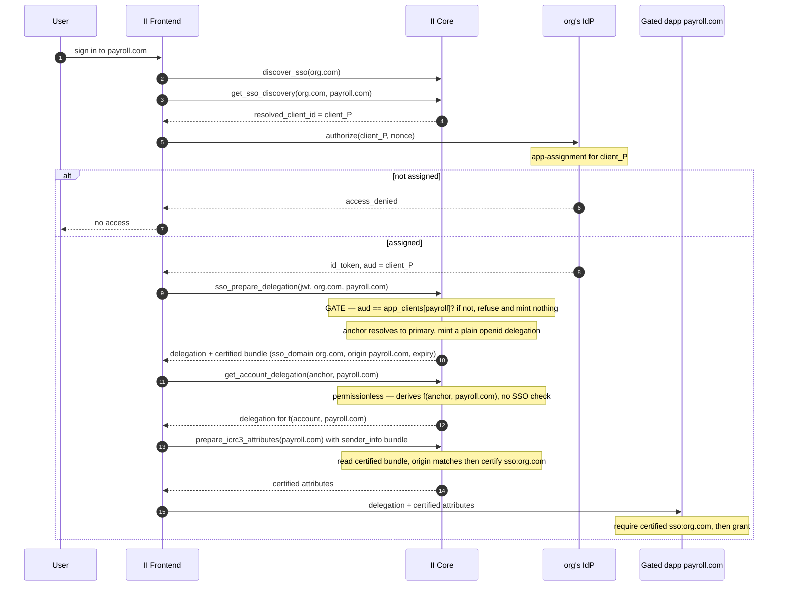

# IdP-side per-app gating for enterprise SSO

**Status:** Implemented — `dfinity/internet-identity` PR #4096 (single PR). This doc is the spec.
**Last updated:** 2026-07-15
**Companion:** `enterprise-sso-per-app-access-control.md` (the *id.ai-side* gate). The two layers are independent, composable, and selected per app (§9); neither depends on the other.

**In one line:** give each restricted dapp its own OIDC client in the org's IdP; the IdP's native app-assignment decides who gets a token; II verifies the token's `aud` and hands the dapp a certified `sso:<domain>` attribute. No id.ai-side policy, directory, proxy, or panel — inert until an org opts in via its well-known.

---

## Glossary

| Term | Meaning |
| --- | --- |
| **IdP** | The org's identity system (Okta, Microsoft Entra ID, OneLogin). |
| **id_token** | The signed OIDC JWT the IdP issues; II verifies it against the IdP's JWKS. |
| **`aud`** | Audience claim — the `client_id` the token was minted for. |
| **`iss` / `sub`** | Issuer / the IdP's identifier for the human. |
| **Stable identifier** | An id that's the same across all of an org's OIDC clients. `sub` on Okta/Google/OneLogin, but **not Entra** (pairwise `sub`; use `oid`). Set per org as `stable_identifier_claim`. |
| **App-assignment** | The IdP's native "which users may use this app" control, run at its authorization endpoint. |
| **Primary client** | The org's default OIDC client (for II itself). All identity/credential data keys on it. |
| **Per-app client** | A dedicated OIDC client per gated dapp. Used **only** for the gate, never for identity. |
| **Well-known** | The org's `https://<domain>/.well-known/ii-openid-configuration`. |
| **Anchor** | The user's II identity number. |
| **sso_domain** | The verified domain a credential authenticated through (already stored on SSO credentials). |

---

## 1. Background

II already does enterprise SSO: an org publishes a well-known, II discovers its IdP, the user authenticates, II issues a delegation. Today it runs on **one** OIDC client, so a login opens **every** dapp reachable through II — all-or-nothing.

**The idea.** Give each restricted dapp its own OIDC client, gated by the IdP's **native app-assignment** — the same workflow admins use for any SaaS app. Unassigned → the IdP returns `access_denied` and II never receives a token. The gate is the IdP's, before II is involved.

**Why its own layer.** No id.ai infrastructure (no access canister, sync, proxy, or panel) — policy and audit stay in the IdP. Bonus: per-app IdP conditions (MFA step-up, device, network) for free. Cost: works only where the IdP assigns groups per OIDC client (Okta, Entra, OneLogin — not Google, §8), and the org registers one client per gated app.

---

## 2. Goals & non-goals

**Goals**

- Gate a dapp like any SaaS app: register a client, assign a group. No id.ai-specific policy surface.
- Enforcement is native IdP app-assignment, fail-closed at the IdP.
- Same II identity across all of an org's gated apps and its default SSO.
- Identity always keyed on the **primary** client; per-app clients are gate-only (never a credential or access method).
- Per-app IdP conditions work unchanged.

**Non-goals**

- **Google Workspace** — can't express per-OIDC-client group assignment (§8).
- **Any id.ai-side policy/directory** — that's the companion layer.
- **Forwarding groups/roles to dapps** — out of scope (the dapp only verifies the existing certified `sso:<domain>`).
- **Changing the dapp principal** — stays `f(anchor, origin)`.

**Behavior change (deliberate).** `sso:<domain>:…` attributes are now certifiable **only when a certified SSO bundle is presented** (§6.3) — not from a passkey/`openid_prepare_delegation` session on an anchor that merely *has* an SSO access method. This tightens today's flow (cert used to read the stored credential in any session), so it affects existing SSO-attribute consumers. `implicit:origin` is unchanged.

---

## 3. Threat model

**Trusted:** the org's IdP (runs assignment, signs tokens); the org's DNS/web root (the well-known declares its `client_id`s — controlling it proves domain ownership); II core (identity, delegation, token verification).

**Untrusted:** the public (the well-known, incl. the `origin → client_id` map, is world-readable); a user reaching an app they aren't assigned to, incl. by replaying a token for a *different* app; a stray OIDC client at the same issuer (direct providers only).

**Attacks defended**

| Attack | Defense |
| --- | --- |
| Token for app W replayed to reach app P | II re-checks `aud == the origin's declared client`; a W token is rejected for P (§6). |
| Reaching a gated app via the default client | No fallback — a gated origin is served only by its declared client. |
| **Insider re-routes a gated app via a rogue discovery domain** (publishes `evil.com` pointing at the org's real IdP) | The certified `sso_domain` is the domain II actually resolved, so the login is `sso:evil.com`; the dapp trusts a specific org domain and rejects it (§7). Access is decided on the certified domain, not the principal. |
| Stray client at the same issuer hijacking an anchor | A per-app token resolves to identity only if its `aud` is a client the well-known declares; direct providers keep full `(iss, sub, aud)` isolation (§7). |

**Out of scope (not enforceable by II):** Entra's `Assignment required?` defaults **OFF** — a forgotten toggle fail-opens to the whole tenant (onboarding must flag it, §8); a fully compromised org IdP.

---

## 4. How it works



Three responsibilities:

- **IdP — assignment.** Decides who can obtain a token for the per-app client. II holds no policy.
- **II — mint-or-refuse.** `sso_prepare_delegation` mints a delegation only if `aud` matches the origin's declared client, and returns a certified `(sso_domain, origin, expiry)` bundle. Identity resolves to the primary client; the delegation is ordinary, so account/delegation methods stay permissionless. The gate rides on the bundle (§6).
- **Dapp — verify.** Requires the certified `sso:<domain>` — proof of both *which org domain* and that the gate passed. Certified only when a matching bundle is present, so a passkey login on the same anchor shares no SSO attributes.

II core (not the FE) fetches and caches the well-known via `discover_sso`; the FE reads the per-origin client with `get_sso_discovery(domain, origin)`.

---

## 5. Well-known additions

The org's existing well-known gains an `origin → client_id` map plus two flags. Additive — existing single-client SSO keeps working. II core fetches and caches it; the frontend never reads the org's web root.

```jsonc
{
  // existing SSO discovery (the primary client, for II itself)
  "client_id": "0oaDEFAULT",
  "openid_configuration": "https://org.okta.com/.well-known/openid-configuration",
  "name": "Org",

  // per-app clients for gated dapps
  "app_clients": {
    "https://payroll.com": "0oaPAYROLL",
    "https://admin.internal.app": "0oaADMIN"
  },

  "gate_all_apps": false,          // true = deny origins not in app_clients
  "stable_identifier_claim": "sub" // cross-client-stable claim (Entra: "oid"). optional
}
```

| Field | Effect |
| --- | --- |
| **Listed origin** | Gated — II uses that `client_id` and requires the token's `aud` to match. |
| **Unlisted + `gate_all_apps: false`/absent** | Served by the primary client (open to any org user, as today). |
| **Unlisted + `gate_all_apps: true`** | Denied — locks II SSO to an explicit set of dapps. |
| **Declared client set** | Primary `client_id` + every `app_clients` value — the allowlist for the identity-resolution safety check (§7). |

- **Cap: ≤100 `app_clients`/org.** An over-cap well-known is **rejected, not truncated** (truncation could silently un-gate an origin into the open fallback). The parsed map lives in the in-heap discovery cache, not stable memory.
- **Propagation: ~1 h.** Well-known edits apply after the backend discovery cache refreshes (`FRESH_FOR_SECONDS` 1 h + `STALE_FOR_SECONDS` 1 h stale-if-error, `openid/sso.rs`). No frontend cache.

### 5.1 Optional: hashed origins

`client_id`s are public by design; **origins** may leak an org's app portfolio. An org can replace a cleartext key with a salted-hash key, same `origin → client_id` object:

```jsonc
"app_clients": {
  "https://oc.app": "0oaCHAT",                 // cleartext, or:
  "b5d4045c...e21:9f3a7c2e...": "0oaPAYROLL"   // "sha256(origin || salt):<salt>", hex
}
```

II knows the origin from the ceremony and matches `sha256(origin || salt)` against each hashed key. The per-key salt stops bulk precomputation and cross-org correlation. It doesn't hide a *guessed* origin (confirmable against the salt) — but that only matters for non-obvious internal origins. Cleartext and hashed keys may coexist.

---

## 6. II core changes

A dedicated `sso_prepare_delegation` / `sso_get_delegation` pair carries the SSO sign-in; `openid_prepare_delegation` is **unchanged** (direct providers). No stable-memory migration, no `StorableOpenIdCredentialKey` change. The sign-in mints an **ordinary primary-keyed openid delegation** — a normal credential principal that `check_authorization` accepts — so account/delegation methods stay **permissionless**. Enforcement rides on a separate certified **`sender_info` bundle** that only the attribute methods read (§6.3): a refused gate returns no bundle, so `sso:<domain>` can't be produced.

### 6.1 Identity resolves to the primary client

A per-app login's `aud` is the per-app client, but for *identity* `sso_prepare_delegation` resolves the anchor as if the primary client were used — it looks up `(iss, stable_id, primary_client_id)`, substituting the primary client for the token's `aud`. So all per-app clients collapse to one primary-client identity; no extra credential, no access method. Existing credentials are already primary-keyed → a lookup-time substitution, **no stored-key change**. (Non-`sub` orgs need an aux lookup, §6.5.)

A cold well-known cache miss returns `Pending` (re-drive discovery) — never "no `app_clients`", which would fail open.

**First login can be gated.** Registration (`OpenIDRegFinishArg` gains `origin`) runs the same gate and stores a primary-keyed credential:

- **`sub` org** → registers directly, one IdP trip.
- **non-`sub` org** → the pairwise `sub` can't be bridged yet, so registration **fails safe** (`IdRegFinishError::SsoNormalLoginRequired`); the FE guides a normal sign-in first (§6.5), then the gated login registers. This variant is the one deliberate non-additive `.did` change — inert for existing clients (they never send `origin`).

### 6.2 `sso_prepare_delegation` — the gate

```
verify_id_token(jwt)                                  // iss/aud/nonce/exp/JWKS
expected = app_clients[origin]   if listed            // gated
         | primary_client        if unlisted & !gate_all_apps
         | DENY                   if unlisted & gate_all_apps
require jwt.aud == expected       else DENY            // THE GATE (mint nothing)
anchor = resolve_to_primary(iss, stable_id)           // §6.1
mint a plain primary-keyed openid delegation
bundle = sign (sso_domain, origin, now()+SSO_SESSION_DURATION) under the credential seed
return { delegation, sso_attr_bundle, sso_attr_bundle_signature }
```

- The one `app_clients` / hashed-key / `gate_all_apps` lookup happens here, where the well-known is already cached.
- The delegation is ordinary (no SSO-specific seed); the gating context travels in the certified bundle (§6.3). Gate fails → nothing minted, no bundle.
- This is the SSO path for **every** dapp sign-in; gating only decides whether `expected` is a per-app or the primary client.

### 6.3 The certified `sender_info` bundle

The session is an ordinary principal, so the gate can't ride on *who* the caller is — it rides on a certified statement they carry: `sso_attr_bundle` = `(sso_domain, origin, expiry)`, an II canister signature under the credential seed backing the delegation.

- **Travels via `sender_info`.** The FE wraps the delegation identity in the SDK's `AttributesIdentity` (`{data: bundle, signature, signer: II}`), injecting a `sender_info` field into the signed request.
- **Read via `read_certified_sso_bundle`** (raw `ic0` `msg_caller_info_*`). The **replica** verifies the signature under the **caller's own credential seed** → bound to that identity, **not replayable across identities**. II also checks signer == self, a 4 KiB cap, and expiry.
- **Only `prepare_icrc3_attributes` / `list_available_attributes` read it**, to certify/list `sso:<domain>`. Account/delegation methods stay permissionless; `identity_info` is untouched (consent skips it for SSO). No config at cert.
- **No bundle → no SSO attributes.** A passkey/`openid_prepare_delegation` session carries none. The bundle's `expiry` keeps them fresh.
- **`ic0 = "1.1"`** provides `msg_caller_info_*` (absent in `ic-cdk 0.16`); avoids an `ic-cdk 0.20` bump that conflicts with the vc-sdk git deps. No `ic-cdk` bump.

### 6.4 The gate is the origin-bound `sso:<domain>`

A single certified attribute is the dapp's whole boundary. Its presence for origin X proves both:

- **assignment within the domain** — the bundle is issued only if `aud == app_clients[X]` (§6.2), and
- **which domain** — the certified `sso_domain` is the domain II resolved from (`sso:evil.com` for a rogue login, never `sso:acme.com`).

`prepare_icrc3_attributes` certifies `sso:<domain>` only when the bundle's `origin` matches the origin it certifies for; `list_available_attributes` lists the same rows. The bundle carries the origin, so neither needs the caller to assert it. `implicit:origin` is orthogonal anti-replay, not the gate.

> **Bounded reconfiguration window.** A bundle minted while an app was ungated still certifies `sso:<domain>` after it's flipped to gated, until the bundle expires (~session) and the discovery cache refreshes (~1 h). Same propagation class as `app_clients` edits — accepted.

### 6.5 Cross-client identity when the stable id isn't `sub`

Config-driven, not brand-driven — II reads `stable_identifier_claim`, never detects "Entra".

- **`sub`** (Okta/Google/OneLogin): the primary-client substitution (§6.1) resolves directly.
- **non-`sub`** (Entra `oid`): a per-app `sub` is pairwise, so substituting the client alone can't match. II keeps a small **additive stable bridge** (own memory region, not a migration):

```
(iss, primary_client_id, <stable_id>)  ->  the primary credential's sub
```

- **Why all three key parts:** the pairwise `sub` must be scoped to its client. `(iss, stable_id)` alone would collide when one tenant is exposed via two discovery domains (different primary clients, same `(iss, oid)`) and would lean entirely on `iss` uniqueness; `primary_client_id` removes that.
- **Stable memory** → survives upgrades, so the normal-login-first step happens **once, ever** (a heap cache would force it every deploy).
- **Written only on a primary-client login** (verified JWT — the only login carrying both the alt id and the primary `sub`). Resolution is read-only, so the query delegation path only reads it.
- **Miss → fail safe:** no anchor, user does a normal login first (never resolves to the wrong identity).

Cross-domain isolation doesn't depend on this — it comes from the certified `sso_domain` (§7).

### 6.6 Frontend: routing the ceremony

The ceremony must run against the per-app client for the dapp's **effective origin**, and that origin must be the **same** one the gate later keys on, or `aud` won't match. So the FE resolves the origin at ceremony time and applies the gate's canonicalization:

- **Manual "Sign in with SSO"** — the effective origin is known; route to its `resolved_client_id`.
- **1-click `?sso=<domain>`** — the origin isn't on the pending channel until the request arrives *after* the IdP round-trip, so `initiateSso` uses `remapToLegacyDomain(derivationOrigin ?? channel.origin)`:
  - `channel.origin` — the channel's `event.origin` (browser-set, unspoofable); the common case.
  - `?derivationOrigin=` — a launch-URL param for a dapp using a derivation origin (can't be learned earlier); supplied by the SDK.
  - the `icp0.io / icp.net → ic0.app` remap keys the same canonical origin the gate does (the delegation path remaps too); else an aliased origin routes to the primary client and is denied.
- **Fail-closed.** The FE origin only *selects the client*; the canister independently enforces `aud == app_clients[origin]` (and validates a derivation origin against `ii-alternative-origins`), so a wrong hint can only deny.

---

## 7. Why this is safe

1. **Mint-or-refuse.** The bundle is issued only if `aud == app_clients[origin]` (§6.2).
2. **Unforgeable, per-identity.** The bundle is a canister signature under the caller's seed, replica-verified — can't be forged or replayed across identities (§6.3).
3. **`sso:<domain>` only from a valid bundle.** Passkey/`openid` sessions carry none; a wrong/absent/expired bundle yields no SSO rows. No ungated path to the attribute.
4. **Certified `sso_domain` proves provenance.** A rogue `evil.com` is `sso:evil.com`, never `sso:acme.com` → rejected by the dapp.
5. **IdP assignment gates the token.** Only assigned users get a per-app-client token, so only they can obtain a bundle.
6. **Identity unchanged.** Anchor stays primary-keyed; `StorableOpenIdCredentialKey`, stored data, and `openid_prepare_delegation` are untouched.
7. **Bounded reconfig window** (§6.4) — accepted, same class as `app_clients` propagation.

---

## 8. IdP setup and sharp edges

**Per gated app, once:** register an OIDC client, point its redirect URI at id.ai (clients may share it — `aud` distinguishes them), assign the group, add `origin → client_id` to the well-known. Recurring grant is then just "open the app, assign the group."

> **The `app_clients` key must be the exact browser origin** — `https://payroll.com` (scheme + host + optional port, no path/slash). A mismatch (case, stray slash, `www.` vs apex) **fails safe** (routes to primary / denied) but the dapp won't be gated — a config error to catch, not a hole.

| IdP | Per-app assignment | Note |
| --- | --- | --- |
| Okta | Native, free; unassigned blocked at `/authorize`. | Denial is an HTML 400, not an OIDC redirect — II infers it from the failed ceremony. |
| Entra ID | Native, via "Assignment required" + assignment. | **Defaults OFF** (silent fail-open); groups need P1/P2; `sub` is pairwise → set `stable_identifier_claim: "oid"`. |
| OneLogin | Native, via Roles, enforced at sign-in. | — |
| Google Workspace | **Not supported** — per-OIDC-client group assignment can't be expressed. | |

---

## 9. Relationship to the id.ai-side layer

Independent and composable; each origin's gate is chosen in the well-known.

| | IdP-side (this doc) | id.ai-side (companion) |
| --- | --- | --- |
| Where the gate runs | The IdP (`/authorize`) | The access canister (mint time) |
| id.ai infrastructure | None | Access canister + proxy + panel |
| Policy / audit | In the IdP | In the id.ai panel |
| IdP coverage | Okta, Entra, OneLogin | + Google |
| Per-app conditions (MFA/device) | Yes, native | No |
| Setup per app | Register + map a client | Add a policy row |

**Selection:** origin in `app_clients` → IdP-side; origin in the access-canister policy → id.ai-side. An org may use either or both. This layer adds only the `aud` gate and primary-keyed resolution in II core.

---

## 10. Implementation

One PR. **No stable-memory migration, no `StorableOpenIdCredentialKey` change, `openid_prepare_delegation` untouched.** The only new persistent state is the non-`sub` aux bridge (§6.5) — an additive stable map in a fresh memory region. Inert until an org adds `app_clients`.

> **Security invariant:** mint-or-refuse at `sso_prepare_delegation` (§6.2) — a refused gate returns no bundle. Certification is a config-free read of the certified bundle, replica-verified under the caller's own seed (§6.3). So `sso:<domain>` is only ever produced from an SSO sign-in; the dapp verifies it with the existing lib.

| Area | Change |
| --- | --- |
| **Config** (§5) | Parse `app_clients` / `gate_all_apps` / `stable_identifier_claim`. `get_sso_discovery(domain, opt origin)` returns the per-origin `resolved_client_id`. |
| **`sso_prepare_delegation` / `sso_get_delegation`** (§6.2) | New SSO path: verify JWT → gate → mint a plain primary-keyed openid delegation → return the certified bundle + signature. `openid_prepare_delegation` untouched. |
| **Registration** (§6.1) | `OpenIDRegFinishArg.origin`: first gated login runs the same gate. `sub` registers directly; non-`sub` fails safe (`SsoNormalLoginRequired`). |
| **Bundle read** (§6.3) | Only `prepare_icrc3_attributes` / `list_available_attributes` read the bundle. Account/delegation permissionless; `identity_info` untouched. |
| **Frontend** (§6.6) | Route to `resolved_client_id`; 1-click uses `remapToLegacyDomain(derivationOrigin ?? channel.origin)`; attach the bundle. Non-`sub` first login: button-driven CTAs. |
| **Tests** | gated == ungated → same principal; passkey → no SSO attrs; refused gate → no bundle; cross-identity/expired/cross-origin bundle rejected; `gate_all_apps` deny; Entra `oid` + fail-safe registration; aux bridge upgrade + per-client scope; 1-click routing. |

**`.did` deltas** — additive except one authorized non-additive variant:

- **add** `sso_prepare_delegation` / `sso_get_delegation` → `SsoPrepareDelegationResponse` / `SsoGetDelegationResponse` (carry `sso_attr_bundle` + signature);
- `get_sso_discovery` gains `opt origin` + `resolved_client_id`;
- `OpenIDRegFinishArg` gains `opt origin`;
- `IdRegFinishError` gains `SsoNormalLoginRequired` (**the** non-additive change — inert for existing clients);
- unchanged: `openid_prepare_delegation` / `openid_get_delegation`, and the attribute request records.

The committed `.did` is candid-checked against the Rust service by `check_candid_interface_compatibility`. One dependency: `ic0 = "1.1"` (no `ic-cdk` bump). No canister, proxy, panel, migration, or new dapp lib.

---

## 11. References

| What | Where |
| --- | --- |
| Discovery + `app_clients` resolution | `src/internet_identity/src/openid/sso.rs`; FE `.../lib/utils/ssoDiscovery.ts` |
| Gate, registration, aux bridge | `src/internet_identity/src/openid/sso_gating.rs` |
| Certified bundle (codec, `read_certified_sso_bundle`, `msg_caller_info_*`) | `src/internet_identity/src/openid/sso_bundle.rs` |
| Credential key / delegation seed | `src/internet_identity/src/openid.rs` |
| Dapp-principal derivation | `src/internet_identity/src/delegation.rs` (`calculate_anchor_seed`) |
| 1-click routing + remap | `.../authorize/+page.ts`, `+page.svelte` (`initiateSso`); `.../lib/utils/iiConnection.ts` (`remapToLegacyDomain`) |
| Companion design | `enterprise-sso-per-app-access-control.md` |
