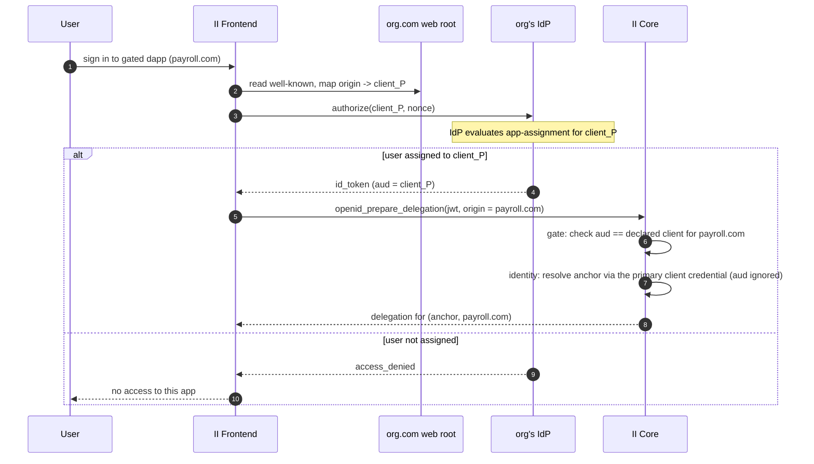

# IdP-side per-app gating for enterprise SSO

**Status:** Draft — RFC for review. Nothing here is implemented.
**Last updated:** 2026-07-09
**Companion:** `enterprise-sso-per-app-access-control.md` specifies the *id.ai-side* gate
(directory + access canister). This document specifies an **independent, complementary
layer** that gates entirely on the **IdP side**. The two are composable and selected per app
(§9); neither depends on the other.

**Implementation status.** None. All sections are proposed.

---

## Glossary

| Term | Meaning |
| --- | --- |
| **IdP** | The org's corporate identity system (Okta, Microsoft Entra ID, OneLogin). |
| **id_token** | The signed OIDC JWT the IdP issues for a login; II verifies it against the IdP's JWKS. |
| **`aud`** | Audience claim — the OAuth `client_id` the token was minted for. |
| **`iss` / `sub`** | The issuer and the IdP's stable, opaque identifier for the human. |
| **App-assignment** | The IdP's native "which users/groups may use this application" control, evaluated at the app's authorization endpoint. |
| **Primary client** | The org's default OIDC client — the one meant for II itself. All identity/credential data is keyed on it. |
| **Per-app client** | A dedicated OIDC client the org registers in its IdP for a single gated dapp. Used **only** for the gate, never for identity. |
| **Well-known** | The org's `https://<domain>/.well-known/ii-openid-configuration`. |
| **Anchor** | The user's II identity number. |
| **sso_domain** | The verified domain a credential was authenticated through; already stored on SSO credentials. |

---

## 1. Background

II already supports enterprise SSO: an org publishes
`https://<domain>/.well-known/ii-openid-configuration`, II discovers the org's IdP, the user
authenticates, and II issues a delegation. Today an org's SSO uses a single OIDC client, so
authenticating gives access to every IC dapp reachable through II — all-or-nothing.

### 1.1 The idea

Give each restricted dapp its **own OIDC client** in the org's IdP, and let the admin gate it
with **native app-assignment** — the exact workflow they use for every other SaaS app. When a
user signs in to a gated dapp, II runs the ceremony against that dapp's client. If the user
isn't assigned, the IdP returns `access_denied` at its authorization endpoint and **II never
receives a token**. The gate is the IdP's, enforced before II is involved.

### 1.2 Why this is its own layer

It needs **no id.ai-side infrastructure** — no access canister, directory sync, signing proxy,
or admin panel. Policy authoring, audit, and enforcement stay in the IdP. As a bonus the org
gets per-app **conditions** for free (per-app MFA step-up, device posture, network zones) —
things a membership-only gate cannot express — because the IdP runs that app's full sign-on
policy on every access.

The cost is that it only works where the IdP can assign groups to an individual OIDC client
(Okta, Entra, OneLogin — not Google, §8), and the org must register and map one client per
gated app.

---

## 2. Goals & non-goals

**Goals**

- An IT admin gates a dapp exactly as they gate any SaaS app: register an OIDC client, assign
  a group. No id.ai-specific policy surface.
- Enforcement is **native IdP app-assignment**, fail-closed at the IdP.
- A user is the **same II identity** across all of an org's gated apps and its default SSO.
- **Identity data is always keyed on the primary II client.** A user has exactly **one
  OpenID access method** (the primary client's); per-app clients never become access methods
  or credentials — they are gate-only.
- **Zero new id.ai infrastructure** beyond the existing SSO ceremony and well-known.
- Per-app IdP conditions (MFA step-up, device, network) work unchanged.

**Non-goals**

- **Google Workspace** — cannot express per-OIDC-client group assignment (§8).
- **Any id.ai-side policy or directory** — that is the companion layer.
- **Forwarding groups/roles to dapps** — this layer only decides *reachability*; attributes
  are a separate concern.
- **Changing the dapp-facing principal derivation** — it stays `f(anchor, origin)` (§6).

---

## 3. Threat model

**Trusted parties**

- The org's IdP — runs app-assignment and signs id_tokens.
- The org's DNS / web root — the well-known declares the org's client_ids; controlling it is
  proof of domain ownership.
- II core — identity, delegation issuance, id_token verification.

**Untrusted parties**

- **The public** — the well-known is world-readable, so the `origin -> client_id` map is
  disclosed.
- A user trying to reach an app they are not assigned to, including by reusing a token minted
  for a *different* app they are assigned to.
- A malicious OIDC client at the same issuer (relevant only for direct, non-SSO providers).

**Attacks defended**

| Attack | Defense |
| --- | --- |
| Token minted for app W replayed to reach app P | II re-checks `aud == the origin's declared client_id`; a W token is rejected for origin P (§6). |
| Reaching a gated app via the org's default client | No fallback: a gated origin is servable only by its declared client (same `aud` check). |
| A per-app client login resolving to the wrong human | Anchor is resolved within the verified `sso_domain` only, and only across client_ids the well-known declares (§6, §7). |
| A stray client at the same issuer hijacking an anchor | `aud`-collapse applies only to SSO credentials (`sso_domain` present); direct providers keep full `aud` isolation (§7). |

**Out of scope / operational (cannot be enforced by II)**

- **Entra `Assignment required?` defaults to OFF.** If the admin forgets to enable it, the
  app fail-opens to the whole tenant. This is IdP configuration; the onboarding guide must
  call it out (§8).
- A fully compromised org IdP.

---

## 4. How it works



Two responsibilities split cleanly:

- **Gate = the IdP.** App-assignment decides who gets a token for `client_P`. II does not
  hold or evaluate any policy.
- **Binding = II.** II ensures the token is actually for *this* origin's client (`aud`
  check), then resolves identity. The `aud` check is what makes the IdP's decision
  origin-specific and non-transferable.

---

## 5. Well-known map

The org's existing `/.well-known/ii-openid-configuration` gains an `origin -> client_id` map.
Additive; existing single-client SSO deployments keep working.

```jsonc
{
  // existing SSO discovery (default client for ungated apps)
  "client_id": "0oaDEFAULT",
  "openid_configuration": "https://org.okta.com/.well-known/openid-configuration",
  "name": "Org",

  // new: per-app clients for gated dapps
  "app_clients": {
    "https://payroll.com": "0oaPAYROLL",
    "https://admin.internal.app": "0oaADMIN"
  }
}
```

- An origin in `app_clients` is **gated**: II uses that client_id and requires the returned
  `aud` to match it.
- Any other origin uses the default `client_id`, exactly as today.
- The **declared client set** for the domain = the default plus every value in `app_clients`.
  It is the allowlist used by the identity-resolution safety check (§6).
- The map is public. `client_id`s are public-by-design (II uses public/SPA clients, no
  secret). If a gated origin is itself sensitive, its key may be hashed (`sha256(origin) ->
  client_id`); II hashes the target origin before lookup.

---

## 6. II core changes

Only the OpenID delegation path changes. No new canister, no new externally-callable method
shape beyond threading the target origin (already available in the authorize flow).

The principle: **the per-app client is used only for the gate; identity is always keyed on
the primary client.** The token's `aud` is checked against the origin's declared client and
then discarded for identity — the anchor is resolved as if the login had used the primary
client. A per-app login therefore creates no credential and no access method.

```
fn resolve_and_gate(jwt, origin, sso_domain) -> Result<Anchor> {
    let claims = verify_id_token(jwt);              // iss, sub, aud, nonce, exp, JWKS — unchanged

    // --- gate: the token must be for THIS origin's client ---
    let expected = wellknown(sso_domain).client_for(origin);   // default, or app_clients[origin]
    if claims.aud != expected { return Deny; }                 // wrong app / no-fallback

    // --- identity: always the primary client, never the per-app one ---
    require(claims.aud in wellknown(sso_domain).declared_clients());   // token from a client the org vouches for
    let primary = wellknown(sso_domain).client_id;                    // the client meant for II itself
    let identity_key = (claims.iss, claims.sub, primary);             // per-app aud never enters identity
    lookup_or_create_anchor(identity_key)                            // the single OpenID credential
}
```

- **One access method.** Identity keys on `(iss, sub, primary_client_id)` — the same key an
  ordinary org SSO login already produces. There is exactly one OpenID credential per user
  per org; per-app clients never appear in credential state.
- **Existing data untouched.** Current SSO credentials are already `(iss, sub, primary)`, so
  there is no migration and the delegation seed formula is unchanged.
- **Per-app tokens are read-only for identity.** A per-app login gates and resolves the
  anchor but does **not** write profile metadata (email, name); that always comes from a
  primary-client login. The dapp-facing principal is `f(anchor, origin)` regardless
  (`delegation.rs::calculate_anchor_seed`), so every gated app sees the same identity.

The first login for a user establishes the single credential under the primary key
(whether that first login is the org's default SSO or a gated app — either way it is keyed on
the primary client, and the `aud` is only used to gate).

---

## 7. Why resolving identity from a per-app token is safe

Accepting a per-app-client token as proof of the primary-keyed identity is safe under these
guard rails:

1. **Only across declared clients.** A per-app token resolves to identity only if its `aud`
   is in the `sso_domain`'s declared client set (primary + `app_clients`). The org, via its
   DNS-rooted well-known, has vouched that those clients are all its own — so within that set
   one `(iss, sub)` is one human, and canonicalizing to the primary key is sound.
2. **Scoped to SSO.** This applies only under a verified `sso_domain`. Direct providers
   (Google-direct, Apple, Microsoft — no `sso_domain`, no `app_clients`) keep full
   `(iss, sub, aud)` isolation, so a stray OAuth client at a shared issuer can never resolve
   to someone's anchor.
3. **The gate is separate from identity.** Reaching origin P still requires `aud == client_P`.
   A `client_W` token resolves to the same (primary-keyed) identity but is denied at origin P.
   Identity-resolution and authorization do not leak into each other.

The property the seed's `aud` component protects — "a token for one client can't stand in for
another" — is preserved *as the gate* (rule 3), and it never has to be relaxed in identity,
because identity is only ever keyed on the primary client — the per-app `aud` is discarded
after gating (rules 1–2).

---

## 8. IdP setup and sharp edges

**Per gated app, once:** register an OIDC client for the dapp, set its redirect URI to id.ai
(multiple clients may share the same id.ai redirect — the `aud` distinguishes them), assign
the group, and add `origin -> client_id` to the well-known.

| IdP | Per-app assignment | Note |
| --- | --- | --- |
| Okta | Native; free. Unassigned user blocked at `/authorize`. | Denial is an HTML 400 page, not an OIDC error redirect — II infers denial from the failed ceremony. |
| Entra ID | Native, via "Assignment required" + user/group assignment. | **Defaults to OFF** — a forgotten toggle silently fail-opens to the whole tenant. Groups need P1/P2. |
| OneLogin | Native, via Roles, enforced at sign-in. | — |
| Google Workspace | **Not supported** — the user-access toggle is SAML-only and OAuth clients live in the GCP console; per-OIDC-client group assignment cannot be expressed. |

Recurring grant is then the single most familiar IdP action: open the app, assign the group.

---

## 9. Relationship to the id.ai-side layer

The two layers are independent and composable; each origin's gate is chosen in the
well-known:

| | IdP-side (this doc) | id.ai-side (companion doc) |
| --- | --- | --- |
| Where the gate runs | The IdP (`/authorize`) | The access canister (mint time) |
| id.ai infrastructure | None | Access canister + proxy + panel |
| Policy authoring / audit | In the IdP | In the id.ai admin panel |
| IdP coverage | Okta, Entra, OneLogin | + Google (manual/attribute groups) |
| Per-app conditions (MFA/device) | Yes, native | No |
| Setup cost per app | Register + map a client | Add a policy row |

Selection per origin:

- Origin in `app_clients` -> **IdP-side gated** (this layer).
- Origin in the access-canister policy -> **id.ai-side gated** (companion layer).

An org may use either, or both for different apps. Both layers share the well-known and the
existing SSO ceremony; this layer adds only the `aud` gate and primary-keyed anchor
resolution in II core (§6).

---

## 10. Build order

1. **Well-known + routing.** Parse `app_clients`; the frontend selects the client_id for the
   target origin and runs the ceremony against it.
2. **Gate + identity in II core.** The `aud == declared-client-for-origin` check and
   primary-keyed anchor resolution (§6). Validate: an assigned user reaches the gated dapp
   with the same identity (and single access method) as their default SSO; an unassigned user
   is denied at the IdP; a token for one gated app cannot open another.
3. **Onboarding guide.** Per-IdP client setup, with the Entra assignment-required and Okta
   400-denial edges called out (§8).

No canister beyond II core, no proxy, no panel.

---

## 11. References

- Existing II SSO discovery: `src/frontend/src/lib/utils/ssoDiscovery.ts`,
  `src/internet_identity/src/openid/`.
- Credential key and delegation seed: `src/internet_identity/src/openid.rs`
  (`OpenIdCredentialKey`, `calculate_delegation_seed`).
- Dapp-principal derivation: `src/internet_identity/src/delegation.rs`
  (`calculate_anchor_seed`).
- Companion design: `enterprise-sso-per-app-access-control.md` (id.ai-side gating).
