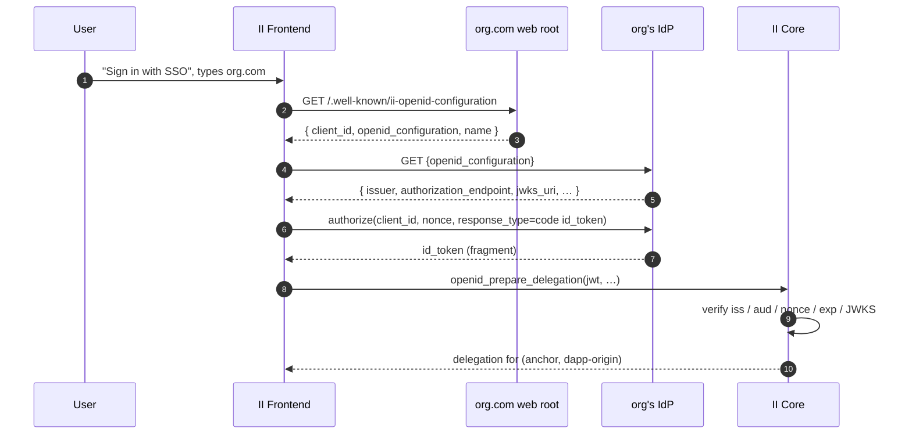
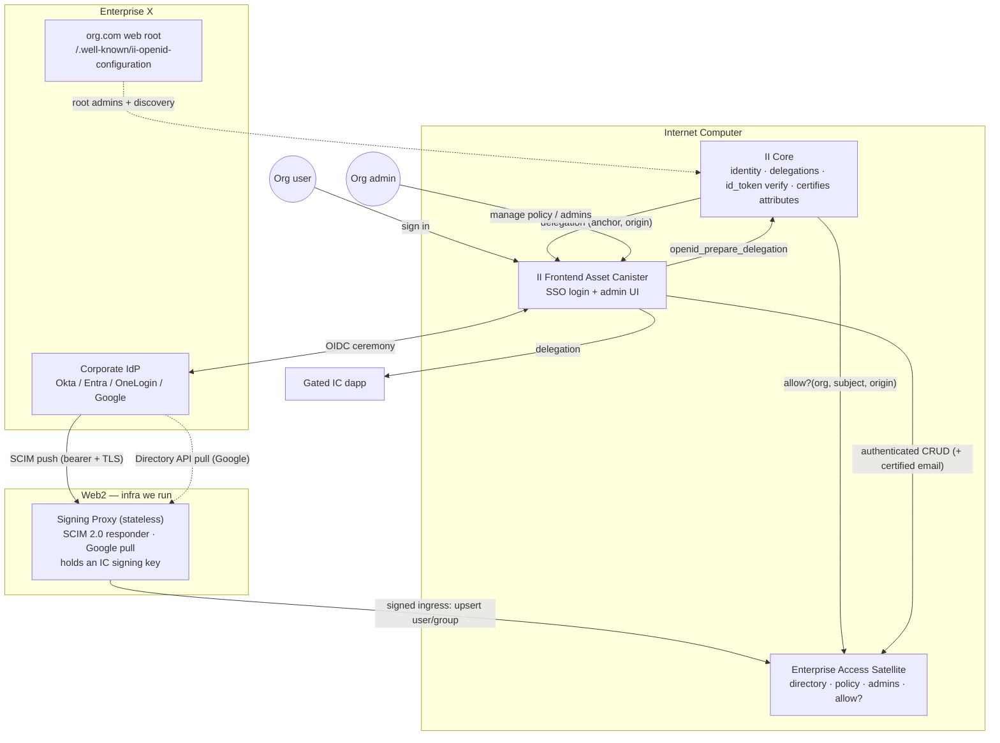
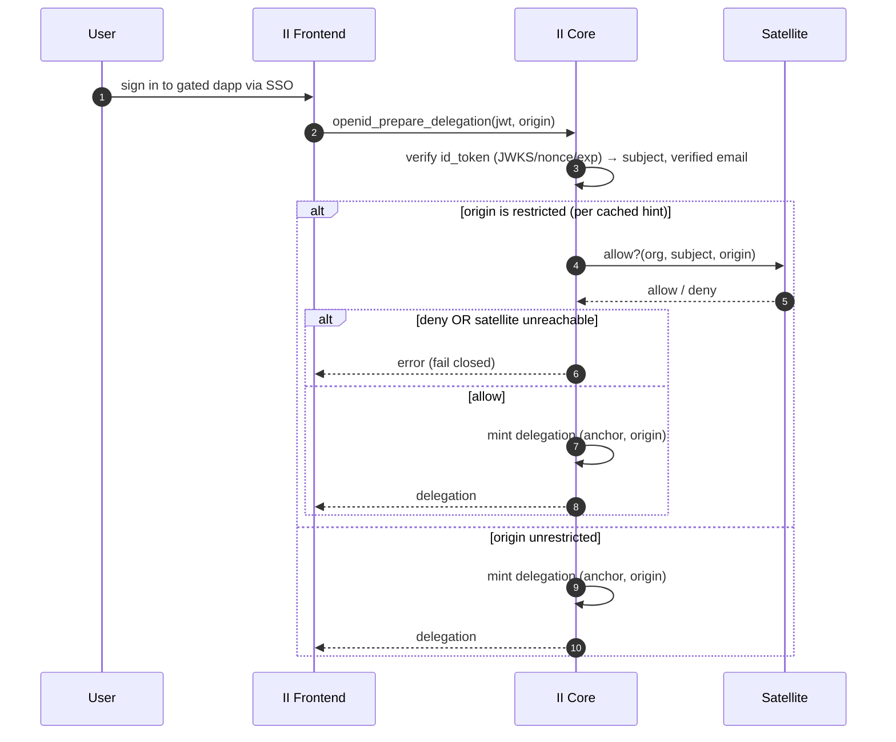
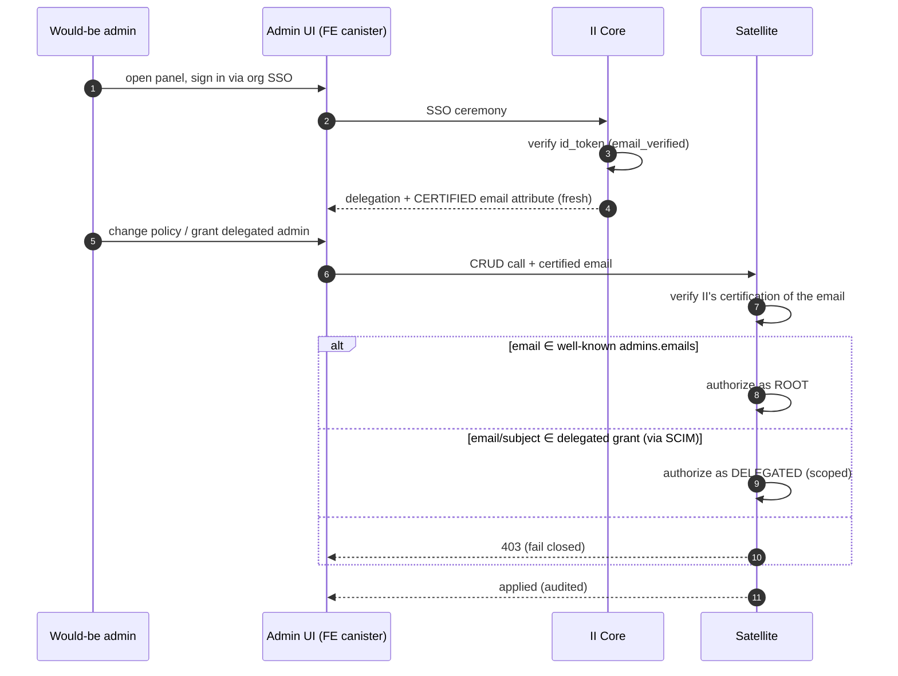

# Per-app access control for enterprise SSO

**Status:** Draft — RFC for review. Nothing here is implemented; this document
specifies an architecture, not a shipped feature.
**Last updated:** 2026-07-08
**Relationship to prior work:** Builds on the *"id.ai · Enterprise SSO — Per-app SSO
access control"* option review (Options A–D), summarized in §2.3. This document
specifies the architecture that came out of that review and the design discussion that
followed it.
**Targets:** A new PR series against `main`, staged per §11.

**Implementation status.** None. All sections are proposed.

---

## Glossary

Conventions and terms used throughout.

**SSO / OIDC.**

| Term | Meaning |
| --- | --- |
| **IdP** | Identity Provider — the org's corporate identity system (Okta, Microsoft Entra ID, OneLogin, Google Workspace). |
| **id_token** | The signed OIDC JWT the IdP issues for a login. II verifies it against the IdP's JWKS. |
| **`aud`** | Audience claim — the OAuth `client_id` the token was minted for. |
| **`sub`** | Subject claim — the IdP's stable, opaque identifier for the human. |
| **groups claim** | An optional id_token array of the user's group memberships. **This design deliberately does not consume it** — see §2.2. |
| **SCIM** (RFC 7643/7644) | System for Cross-domain Identity Management. A REST/JSON protocol by which an IdP *pushes* user/group create/update/delete events to a service provider. |
| **Directory pull** | For IdPs without SCIM push (Google Workspace), polling the IdP's directory API on a timer instead. |

**II-specific.**

| Term | Meaning |
| --- | --- |
| **Anchor** | The user's II identity number; maps to their authn methods (passkeys, OpenID credentials). |
| **Well-known** | The org's `https://<domain>/.well-known/ii-openid-configuration`, the DNS-rooted discovery + trust-root document II already fetches. |
| **Certified attribute** | A canister-signed statement about a user (e.g. `sso:<domain>:email`), verifiable by a relying party via an II-supplied library. |
| **Mint** | Issuance of a delegation for `(anchor, dapp-origin)` at the end of an SSO ceremony. |
| **Ceremony** | A single interactive SSO login producing a freshly-verified id_token. |

**This design.**

| Term | Meaning |
| --- | --- |
| **Satellite** | The new *Enterprise Access* canister holding the directory, policy, and admin state. |
| **Signing proxy** | A small stateless Web2 service that receives SCIM (and pulls Google), and forwards **signed** ingress calls to the satellite. |
| **Restricted app** | A dapp origin an org has placed under access control. Everything else is **unrestricted** (open to any authenticated org user). |
| **Root admin** | An admin anchored in domain control (well-known email list). |
| **Delegated admin** | A scoped admin granted by a root admin, resolved against the synced directory. |

---

## 1. Background

Internet Identity already supports enterprise SSO. An org publishes
`https://<domain>/.well-known/ii-openid-configuration`; II runs a two-hop discovery
(the well-known points at the IdP's standard OIDC document), the user authenticates
against their corporate IdP, and II issues a delegation. The former
`sso_discoverable_domains` "canary allowlist" was a rollout switch, not access control;
`sso_allow_any_domain` now opens discovery to any domain.



### 1.1 The gap

II authenticates a *person*; it does not let the org control *which of the many IC dapps
reachable through II* that person may enter. An org that adopts II SSO gets an all-or-
nothing switch: either an employee can obtain an II delegation (and thus reach every dapp)
or they cannot.

### 1.2 The broker collapse

II is a **broker**: from the IdP's point of view it is a single OIDC application (one
`client_id`). Native IdP mechanisms for "which users may use which app" — Okta app-
assignment, Entra "assignment required", Conditional Access — all bind **per app / per
client_id**. Because every downstream dapp collapses into the one II client, the IdP's
per-app policy engine has nothing per-app to bind to. Recovering *who* is possible;
recovering *under what conditions* (device posture, per-app MFA step-up) per downstream
dapp is not, short of giving each dapp its own OIDC client — which breaks portability and
fragments identity (see §2.3, Option A). Every commercial broker (WorkOS, Stytch, Auth0,
Clerk) faces the same collapse and makes the same choice: keep the IdP vanilla, hold the
authorization model on their own side.

### 1.3 One property we get for free

The dapp-facing principal is `f(anchor, dapp-origin)` (`delegation.rs::calculate_anchor_seed`)
— independent of `aud`, `iss`, `sub`, and of *how* the user authenticated. Consequence:
**the same human is the same identity in a dapp regardless of the SSO path**, and this
design needs no changes to identity derivation. (This is why we do not pursue per-app
`client_id`s, which would move `aud` into the identity and force a re-key.)

---

## 2. Goals & non-goals

### 2.1 Goals

- An IT admin can express **"users in group X may access app Y"** for dapps reached
  through II SSO, in a flow close to what they already know.
- Works across **Okta, Entra ID, OneLogin** natively and **Google Workspace** via
  directory pull.
- **Zero custom configuration pushed onto the org's IdP** beyond a standard SSO connection
  (and, for directory sync, standard SCIM provisioning).
- Enforcement is **fail-closed** and happens where II controls it.
- The security-critical core (identity anchors, delegation keys, id_token verification)
  is **not** enlarged by this feature.
- Unrestricted apps are unaffected — core SSO does not regress in latency or availability.

### 2.2 Non-goals

- **Consuming a token groups claim.** It is capped (Okta hard-fails >100 matched groups;
  Entra silently drops >200), name-fragile, GUID-shaped on Entra, and absent from Google's
  OIDC. Membership comes from the synced directory instead. The id_token's only job is to
  prove *identity*.
- **Re-implementing the IdP's policy engine.** II performs a membership-set decision, not
  device/network/risk/time conditions. Orgs needing those use the advanced mode (§12.1).
- **Per-app OIDC clients as the default.** Kept as a documented advanced mode (§12.1), not
  the portable core.
- **Being the directory of record.** II mirrors what the org's IdP already holds; it is not
  a user store.

### 2.3 Options considered (from the review)

| Option | Mechanism | Verdict |
| --- | --- | --- |
| **A** | Per-app OIDC clients + native IdP app-assignment | Advanced mode — full native policy, but 3/4 IdPs (no Google), a per-app `client_id` map to author, and an identity re-key. See §12.1. |
| **B** | Standard groups claim + group→app map on our side | Portable starting point; but the *claim* is the fragile part (§2.2). |
| **C** | Directory sync (SCIM / Google API) into our side | The full-coverage endpoint; heavier build. |
| **D** | IdP-centric custom claims (custom auth server, custom scopes) | Rejected — Okta-only, paid SKU, magic-string fragility, opposite of industry practice. |

**This design** takes the enforcement discipline of B/C (decision on our side, IdP stays
vanilla, mint-time gate), sources membership from a **synced directory** rather than a
claim, and isolates all enterprise state into a **satellite canister** fed by a **signing
proxy**.

---

## 3. Threat model

**Trusted parties**

- The org's IdP: trusted to authenticate its users honestly and to sign id_tokens and
  (for SCIM) to hold correct directory data.
- The org's DNS / web root: trusted to publish the well-known; controlling it is proof of
  domain ownership — the root of trust the whole SSO feature already stands on.
- II core: trusted for identity, delegation issuance, and id_token verification.
- The satellite canister and the signing proxy: trusted **within their scope** (access
  decisions and directory ingestion respectively), under the same governance as II. In the
  TCB for *access decisions*, never for identity or key material.

**Untrusted parties**

- **IC boundary nodes / HTTP gateway.** They terminate TLS for inbound canister HTTP, so
  they see any inbound bearer token in cleartext and could tamper with or replay an inbound
  request. This design keeps them **out of the authenticity path** (§6).
- **The public.** The well-known is world-readable; anything placed in it is disclosed.
- A cooperating-but-buggy dapp: enforcement must not depend on the dapp behaving.

**Attacker capabilities we defend against**

| Attack | Defense |
| --- | --- |
| Boundary node reads/forges an inbound SCIM push | SCIM terminates on our proxy; proxy→satellite is a **signed ingress call** the boundary layer cannot forge (§6). |
| Forged directory write to grant access | The satellite only accepts directory writes from the trusted proxy principal; the proxy only signs what it received over authenticated SCIM/pull. |
| Self-promotion to admin via an unverified email | Root admin match requires `email_verified` and an II-**certified** email attestation (§8). |
| Bypassing a gate on a restricted app | Fail-closed defaults; unreachable satellite, missing policy, or stale data all **deny** (§7). |
| Satellite bug wrongly allowing access | Identity is keyed independently in II core; delegation keys never leave core; blast radius is "access decision," not "identity/keys." |
| Enumerating an org's app portfolio / group names | Prefer the private admin panel over publishing policy in the public well-known; optionally hash names (§9). |

**Explicitly out of scope**

- A fully compromised org IdP (exfiltrated signing key, corrupted directory): every org
  using it is at risk; we accept and document this.
- Revocation faster than directory-sync freshness for the SCIM path (§10).

---

## 4. High-level architecture

Four ideas:

1. **Identity from the signed token; membership from the directory.** II verifies the
   id_token (the cryptographic anchor) and passes only *verified facts* to the satellite.
   The satellite resolves group membership from its synced directory. There is no groups
   claim on the wire.
2. **All enterprise state lives in a satellite canister**, off II core. II core gains one
   outbound call.
3. **Directory data enters the IC through a signing proxy**, converting untrustable inbound
   HTTP into cryptographically-signed ingress.
4. **Admins are two-tiered** — root anchored in domain control, delegated resolved against
   the directory — and the admin UI is served by the II frontend but talks to the satellite.



This buys us:

- **Blast-radius isolation.** The fast-moving, high-surface enterprise logic never touches
  the canister that holds everyone's identity and delegation keys.
- **Independent upgrade cadence.** The satellite iterates on IdP quirks and policy features
  without going through II core's conservative release process.
- **Trustless ingestion.** The boundary layer is out of the authenticity path for both the
  identity signal (JWKS-verified token) and the directory signal (signed proxy).
- **No identity re-key.** A single `client_id` is preserved, so `(iss, sub, aud)` and the
  delegation seed are untouched (§1.3).

We pay for it in:

- **One inter-canister hop** on the mint path for *restricted* apps only (§7).
- **A Web2 component** (the proxy) to operate — small and stateless, but real infra.
- **Membership freshness bounded by sync**, not by the ceremony (§10).

---

## 5. Component A — Enterprise Access satellite canister

Holds all per-org state and answers the gate.

### 5.1 State

```
per org (keyed by verified sso_domain):
  directory:
    users:  { subject → { emails, external_id, active } }
    groups: { group_id → { display_name, members: set<subject> } }
  policy:
    restricted_apps: { origin → set<group_id> }     // only restricted apps appear
  admins:
    root_emails_cache: set<email>                    // mirror of well-known (see §8)
    delegated:        { grant_id → { group_id, scope, granted_by, at } }
  audit: append-only log of every mutation
```

### 5.2 The decision

```
fn allow(org, subject, origin) -> Decision {
    let Some(allowed) = policy(org).restricted_apps.get(origin)
        else { return Allow };                        // unrestricted → open
    let user_groups = directory(org).groups_of(subject);   // by stable id, from SCIM
    if allowed.intersects(user_groups) { Allow } else { Deny }
}
```

A single set-membership test. Everything not explicitly restricted is open (the broker
default). Missing org, missing directory entry, empty policy for a restricted app → the
`else`/empty-intersection branches all yield **Deny** (fail closed).

### 5.3 Candid surface (sketch)

```candid
type Decision = variant { Allow; Deny };
type AdminScope = variant { All; Apps : vec text };

service : {
  // ---- II core (inter-canister) ----
  "allow" : (record { org : text; subject : text; origin : text }) -> (Decision) query;

  // ---- signing proxy (signed ingress; caller MUST be the trusted proxy principal) ----
  "upsert_user"     : (record { org : text; user : User })   -> ();
  "upsert_group"    : (record { org : text; group : Group }) -> ();
  "delete_resource" : (record { org : text; id : text })     -> ();

  // ---- admin UI (caller delegation + II-certified email attestation) ----
  "set_restricted_app"    : (record { app : text; groups : vec text; email : CertifiedEmail }) -> ();
  "grant_delegated_admin" : (record { group_id : text; scope : AdminScope; email : CertifiedEmail }) -> ();
  "list_groups_seen"      : (text) -> (vec Group) query;   // picker + liveness
  "audit_log"             : (text) -> (vec AuditEntry) query;
}
```

`allow` is a `query` for latency; the *mint* consuming it is an update in II core (§7). If
`allow` ever needs to mutate (usage counters), it is promoted to an update. `upsert_*`
asserts `caller == trusted proxy principal`; admin calls verify a `CertifiedEmail`
(an II-signed attestation), never a raw claim (§8).

---

## 6. Component B — Signing proxy (directory ingestion)

SCIM-into-a-canister is weak: the IC gateway terminates TLS (sees the bearer token) and the
IdP never signs SCIM payloads, so there is no signature the canister can verify
independently of the gateway. The proxy removes both problems.

```mermaid
sequenceDiagram
    autonumber
    participant IdP as Corporate IdP
    participant PX as Signing Proxy (Web2)
    participant Sat as Satellite

    Note over IdP,PX: TLS terminates on OUR proxy, not a boundary node
    IdP->>PX: POST /scim/v2/Groups (Authorization: Bearer <per-org token>)
    PX->>PX: validate bearer → resolve org
    PX->>PX: translate SCIM → candid; SIGN with proxy IC identity
    PX->>Sat: upsert_group(org, {id, members, …}) [signed ingress]
    Sat->>Sat: verify caller == trusted proxy principal
    Sat-->>PX: ok (id, etag)
    PX-->>IdP: 201 SCIM resource

    Note over PX,Sat: Google has no SCIM push → proxy PULLS on a timer
    PX->>IdP: (timer) Directory API list users/groups
    IdP-->>PX: users, groups
    PX->>Sat: upsert_* (org, …) [signed ingress]
```

- **Stateless.** It stores nothing; the satellite is the store. Its job is: terminate the
  IdP's TLS, check the per-org bearer, translate SCIM ⇄ candid (and pull Google), sign, and
  forward reads/writes to the satellite. It must be SCIM-compliant enough for the IdP
  (`/ServiceProviderConfig`, PATCH semantics, resource `id`s) — a protocol adapter, not a
  dumb forwarder.
- **Authenticity.** IC ingress calls are signed by the caller's key; boundary nodes route
  but cannot forge them. So the proxy→satellite hop is authentic end-to-end without trusting
  the boundary layer and without the IdP signing anything.

Trust comparison for getting data into the IC:

| Path | Legitimacy proof | Boundary-node trust |
| --- | --- | --- |
| id_token (identity) | IdP signature vs JWKS | **No** |
| SCIM push **into a canister** | shared bearer the gateway sees | **Yes** ✗ |
| SCIM push **via signing proxy** | proxy's IC signature | **No** ✓ |
| Directory pull (outcall) | replica's own TLS to the IdP | **No** ✓ |

**Residual trust:** the proxy holds a key the satellite trusts for directory writes. Mitigate
by scoping its principal to directory writes only, per-org where feasible, rotating the key,
and auditing every write (§5.1). This is first-party, controlled trust concentrated in one
component we run — strictly better than trusting the boundary layer.

**Hosting:** one shared `scim.id.ai` (orgs run nothing) is the default; per-org proxies
localize blast radius at the cost of org infra.

---

## 7. Component C — Mint-time gate in II core

II core already verifies the id_token and issues the delegation. The gate adds one outbound
call for restricted origins only.



- **Verification stays in II.** Only *verified* facts (`subject`, verified email, `org`)
  cross to the satellite — never the raw token. JWKS/crypto is not duplicated or moved.
- **Only restricted origins call the satellite.** II core keeps a small, rarely-changing
  "restricted origins per org" hint (cached, or read from the well-known) so unrestricted
  mints never depend on the satellite — bounding availability coupling to the gated subset.
- **Async fits.** `openid_prepare_delegation` is already an update that awaits (HTTP outcalls
  for JWKS/discovery); the extra inter-canister await is no structural change. Keep II's
  existing "re-check state after await" discipline.
- **Fail closed.** Satellite unreachable/slow, or an allow it cannot decide → deny the
  restricted app. Never fail open.

---

## 8. Component D — Admin model

Two tiers, aligning trust-anchor strength with authority level.

```
        AUTHORITY                  TRUST ANCHOR                    SOURCE
   ┌──────────────────┐    ┌────────────────────────────┐   ┌──────────────┐
   │ ROOT / SUPER      │◄──│ DNS / domain control        │   │ well-known    │
   │ (unscoped,        │   │ + signed, verified email     │   │ admins.emails │
   │  break-glass)     │   │ (NO SCIM dependency)         │   │ (static list) │
   └────────┬─────────┘    └────────────────────────────┘   └──────────────┘
            │ grants / revokes
            ▼
   ┌──────────────────┐    ┌────────────────────────────┐   ┌──────────────┐
   │ DELEGATED         │◄──│ signed identity (email/sub)  │   │ SCIM group    │
   │ (scoped: app Y…)  │   │ + SCIM group membership      │   │ (synced)      │
   └──────────────────┘    │ (inherits SCIM trust level)  │   └──────────────┘
                           └────────────────────────────┘
```

**Invariant:** *root admin auth must never depend on SCIM.* Root = domain control + signed
verified email, always. A proxy compromise or a broken sync can neither lock out nor
escalate past root. Root is the recovery path; everything SCIM-derived is below it and fully
revocable by root.

### 8.1 Why admin identity is email, not groups

`email` (+ `email_verified`) is the one signal present, verified, and config-free on **every**
IdP including Google. Groups-for-admin would reintroduce the very claim dependency we avoid
(§2.2) — and admin promotion is the worst place to inherit its fragility (a bad group filter
could lock out all admins). Admin sets are small and explicit, so an email list is the right
shape. Groups stay for *gating* (§5.2); email identifies *admins*.

### 8.2 Authenticating an admin against the satellite



The satellite verifies **II's certification** of the email (an II signature) rather than
re-doing OIDC. A fresh certified email is required for sensitive (root) changes, matching
the freshness discipline. **Authorization is enforced in the satellite on every call** — the
FE is a client; hidden buttons are not security.

### 8.3 Bootstrap

The first root admin is established by the well-known edit itself: publishing `admins.emails`
requires web-root control, which is proof of domain ownership. Fallback when web-root edits
are slow: a DNS TXT verification record.

---

## 9. The well-known file

Extended additively; existing SSO deployments keep working.

```jsonc
{
  // --- existing SSO discovery ---
  "client_id": "0oaID_AI_APP",
  "openid_configuration": "https://org.okta.com/.well-known/openid-configuration",
  "name": "Org",

  // --- new: root admins (email only; standard claim, all IdPs, no IdP config) ---
  "admins": { "emails": ["it@org.com", "sec@org.com"] },

  // --- optional: directory source the satellite receives from / pulls ---
  "directory": { "scim": "https://scim.id.ai/v2/org.com" },

  // --- optional Phase-1 policy pilot (durable home is the satellite panel) ---
  // NOTE: publishing policy here exposes internal group names — treat as a pilot.
  "restricted_apps": { "https://payroll.com": ["Payroll Team"] }
}
```

- `admins.emails` — **root** admins only. Small, static, email-based.
- `restricted_apps` — optional bootstrap; the durable home for policy is the satellite admin
  panel (private canister state, few-click authoring). Group names in a public file leak org
  structure; if used interim, names may be hashed (II hashes the observed group and compares).

---

## 10. Freshness & revocation

- **Identity** is fresh every ceremony (signed token, ≤30-min window) — unchanged.
- **Membership** is as fresh as the directory sync. SCIM push is near-real-time; Google pull
  runs on a timer; a broken sync freezes the matrix silently. Therefore:
  - The satellite tracks a per-org **sync staleness TTL**; beyond it, restricted-app
    decisions fail closed (deny) rather than trust stale grants.
  - For high-sensitivity apps, a future **on-demand re-check** against the IdP at gate time
    can bypass sync lag (§12.3).
- Root admins can hard-revoke immediately, independent of sync (§8).

This is the conscious cost of sourcing membership from a directory rather than a token claim
(§2.2): stronger coverage and a real group picker, in exchange for revocation bounded by
sync freshness rather than the ceremony window.

---

## 11. Migration & rollout

```mermaid
gantt
    title Rollout
    dateFormat X
    axisFormat %s
    section Phase 1 — enforce
    Satellite allow + mint gate + policy pilot in well-known : 0, 3
    section Phase 2 — admin surface
    Satellite CRUD + admin panel + groups-seen catalog       : 3, 6
    section Phase 3 — directory sync
    Signing proxy (SCIM) + Google pull + audit               : 6, 10
```



- **Phase 1 — Enforce.** Satellite `allow` + the mint-time gate in II core; policy piloted
  in the well-known (`restricted_apps`); membership bootstrapped from the passively-observed
  "groups seen" set. Proves enforcement with minimal new surface, no proxy yet.
- **Phase 2 — Admin surface.** Satellite CRUD, the id.ai admin panel (served by FE, talking
  to the satellite), root/delegated admins, audit log, group-liveness warnings.
- **Phase 3 — Directory sync.** The signing proxy: SCIM ingestion + Google Directory pull,
  grants by stable group id, off-boarding events. The full-coverage endpoint.

---

## 12. Future work

### 12.1 Advanced mode — per-app OIDC clients (Option A)

For orgs that require **IdP-native** per-app policy — device posture, network zones, per-app
MFA step-up, IdP-side audit — a documented advanced mode where each restricted dapp gets its
own OIDC client in the org's IdP, gated by native app-assignment. II routes to the app's
`client_id` (from a map in the well-known) and verifies `aud`. Costs: 3/4 IdPs (Google can't
express per-OIDC-client assignment), a `client_id` map to author, and an identity re-key to
`(iss, sub, sso_domain)` so per-app clients don't fragment the user. Complementary to the
default, not a replacement.

### 12.2 Satellite topology

Start multi-tenant. Per-org sharding (a canister per enterprise) later, for isolation, data
residency, or scale, with II routing to the right canister id.

### 12.3 On-demand freshness

For high-sensitivity apps, a live IdP check (Graph / Directory API via outcall) at gate time,
bypassing sync lag at the cost of latency and an IdP credential.

### 12.4 Certified role/permission attributes

Beyond coarse gating, mint `sso:<domain>:roles` as certified attributes for apps that want
fine-grained in-app RBAC via the II-supplied lib — the layered model (II gates coarsely at
mint; the dapp enforces finely on certified roles).

---

## 13. Open questions

- **`allow` hint invalidation:** how is II core's cached "restricted origins per org" hint
  refreshed when policy changes — push from the satellite, short TTL, or read from the
  well-known?
- **Proxy hosting:** shared `scim.id.ai` vs. per-org proxies — default shared, but confirm
  the blast-radius appetite.
- **Governance:** exact controller relationship between II core and the satellite, and how
  the trusted proxy principal is rotated.
- **Google credential custody:** where the Directory-API service-account credential lives
  for the pull connector.
- **Advanced mode:** is §12.1 in scope for v1 or strictly future?

---

## Appendix A — IdP capability matrix

| Capability | Okta | OneLogin | Entra ID | Google WS |
| --- | --- | --- | --- | --- |
| Filtered groups **claim** | Free, 1 screen; >100 hard-fail | Free (Parameters) | Free but GUIDs; drops >200 | **Not in OIDC** (SAML only) |
| Native "assign group to app" | Free; 400 at `/authorize` | Native via Roles | Toggle defaults OFF; needs P1/P2 | SAML apps only |
| Custom auth server (Option D) | Paid add-on | No per-scope engine | No concept | Impossible (fixed claims) |
| SCIM / directory sync | Native (Lifecycle SKU) | Behind add-ons | Native (P1; ~40-min cycle) | Directory API pull |
| **`email` claim (admin id)** | ✓ | ✓ | ✓ | ✓ |

The bottom row is why admin identity uses email (§8.1): the one signal present, verified, and
config-free everywhere.

## Appendix B — Admin panel wireframe

```
┌───────────────────────────────────────────────────────────────────────────┐
│  admin.id.ai / org.com                                    org.com ✓ verified│
├───────────────┬───────────────────────────────────────────────────────────┤
│ Applications  │  payroll.com                          Restricted  [ ON ●]   │
│ Groups seen   │  ───────────────────────────────────────────────────────── │
│ Admins        │  WHO CAN ACCESS                                             │
│ Audit log     │   ┌─────────────────────────────────────────────────┐  ✕   │
│               │   │ Payroll Team    · 34 members · synced ✓          │      │
│               │   ├─────────────────────────────────────────────────┤  ✕   │
│               │   │ Finance Leads   ·  8 members · synced ✓          │      │
│               │   └─────────────────────────────────────────────────┘      │
│               │   [ + Add a group…                                    ]     │
│               │                                                            │
│               │   DEBUG · last ceremony (j.doe@org.com)                    │
│               │   groups (directory): Payroll Team, Everyone               │
│               │                                                  [ Save ]   │
└───────────────┴───────────────────────────────────────────────────────────┘
```

## Appendix C — Trust layering (summary)

```
strongest  ┌─────────────────────────────────────────────┐
  anchor   │ id_token signature (JWKS)   → identity        │  gateway-independent
    │      │ domain control (well-known) → root admin      │  gateway-independent
    │      │ proxy IC signature          → directory writes │  gateway-independent
    │      │ SCIM/pull data              → membership       │  proxy-trust level
weakest    │ (nothing trusted from the boundary layer)     │
  anchor   └─────────────────────────────────────────────┘
```

## 14. References

- Option review: *"id.ai · Enterprise SSO — Per-app SSO access control"* (design review,
  2026-07-03).
- Existing II SSO discovery: `src/frontend/src/lib/utils/ssoDiscovery.ts`,
  `src/internet_identity/src/openid/`.
- Delegation derivation: `src/internet_identity/src/delegation.rs`,
  `src/internet_identity/src/openid.rs`.
- Certified attributes: `src/internet_identity/src/attributes.rs`.
- SCIM: RFC 7643 (core schema), RFC 7644 (protocol).
- Companion design in this directory: `email-recovery.md` (canister-side verification &
  ingestion patterns).
