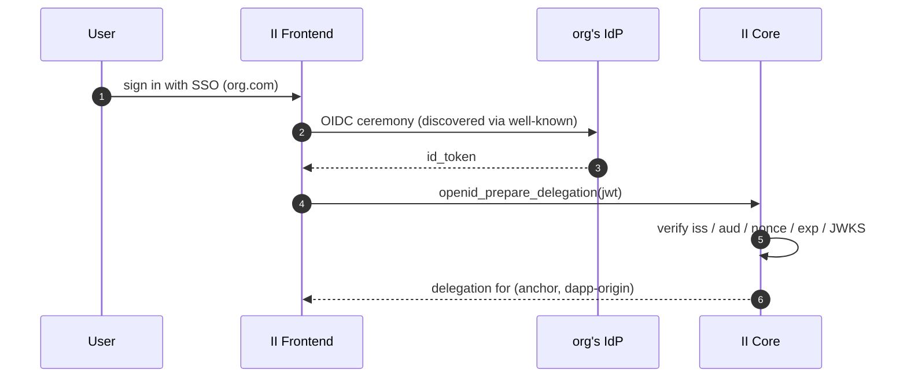
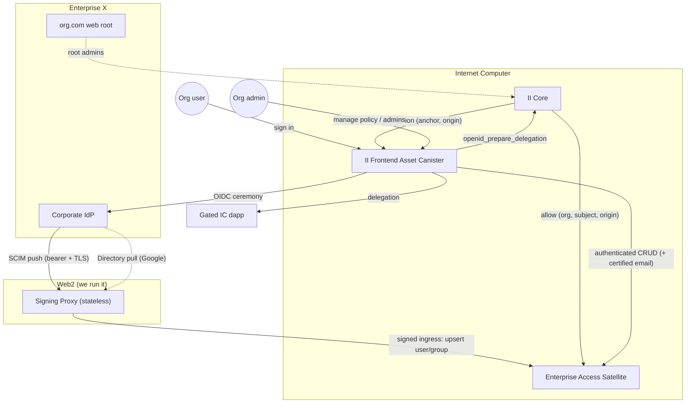
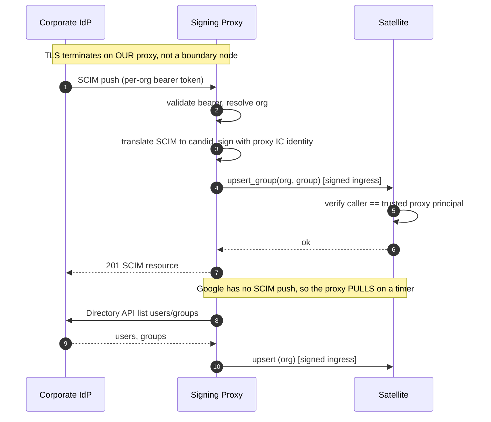
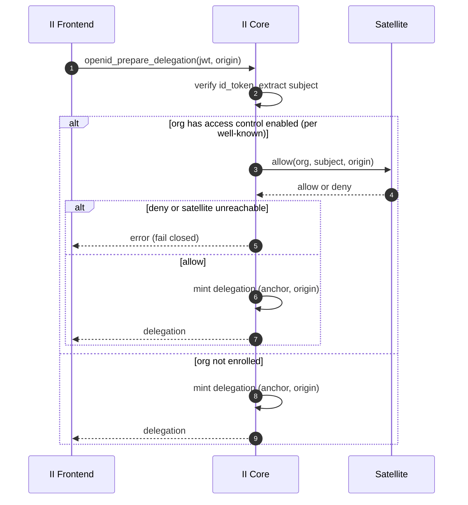
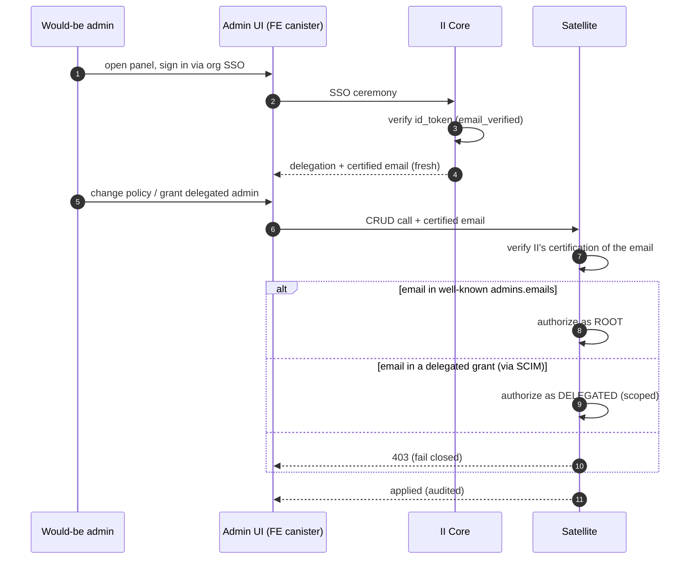

# Per-app access control for enterprise SSO

**Status:** Draft — RFC for review. Nothing here is implemented.
**Last updated:** 2026-07-08
**Prior work:** The *"id.ai · Enterprise SSO — Per-app SSO access control"* option review
(2026-07-03) surveyed four approaches and their IdP trade-offs. This document does not
re-litigate that; it specifies the single implementation chosen.

---

## Glossary

| Term | Meaning |
| --- | --- |
| **IdP** | The org's corporate identity system (Okta, Microsoft Entra ID, OneLogin, Google Workspace). |
| **id_token** | The signed OIDC JWT the IdP issues for a login; II verifies it against the IdP's JWKS. |
| **`sub`** | The IdP's stable, opaque identifier for the human. |
| **SCIM** (RFC 7643/7644) | Protocol by which an IdP *pushes* user/group changes to a service provider. Google has no SCIM push — it is polled via its Directory API instead. |
| **Anchor** | The user's II identity number. |
| **Mint** | Issuance of a delegation for `(anchor, dapp-origin)` at the end of an SSO login. |
| **Certified attribute** | A canister-signed statement about a user (e.g. an email), verifiable by a relying party via an II-supplied library. |
| **Satellite** | The new *Enterprise Access* canister holding the directory, policy, and admin state. |
| **Signing proxy** | A stateless Web2 service that ingests directory data and forwards **signed** ingress calls to the satellite. |
| **Restricted app** | A dapp origin an org has placed under access control. Everything else is open to any authenticated org user. |

---

## 1. Background

II already supports enterprise SSO: an org publishes
`https://<domain>/.well-known/ii-openid-configuration`, II discovers the org's IdP, the user
authenticates, and II issues a delegation.



### 1.1 The gap

II authenticates a *person*; it does not let the org control *which of the many IC dapps
reachable through II* that person may enter. Today it is all-or-nothing.

### 1.2 Why membership comes from a synced directory

II is a **broker**: to the IdP it is a single OIDC application. Native IdP "which users may
use which app" mechanisms bind per app / per `client_id`, so with every dapp collapsed into
the one II client the IdP's per-app policy has nothing per-app to bind to. And the id_token
**groups claim** is not a reliable membership source either — Okta hard-fails above 100
matched groups, Entra emits GUIDs and drops the claim above 200, and Google omits groups
from OIDC entirely. So the id_token is used **only to prove identity**, and group membership
is read from a **directory II syncs from the org's IdP**.

### 1.3 Identity is unaffected

The dapp-facing principal is `f(anchor, dapp-origin)` (`delegation.rs::calculate_anchor_seed`)
— independent of how the user authenticated. The same human is the same identity in a dapp
regardless of SSO path, and a single `client_id` is preserved, so this feature needs **no
change to identity derivation** and no re-key.

---

## 2. Goals & non-goals

**Goals**

- An IT admin can express **"users in group X may access app Y"** for dapps reached through
  II SSO.
- Works across Okta, Entra ID, OneLogin (SCIM push) and Google Workspace (Directory pull).
- No custom configuration pushed onto the org's IdP beyond a standard SSO connection and
  standard SCIM provisioning.
- Enforcement is **fail-closed** and happens where II controls it.
- The security-critical core (identity anchors, delegation keys, id_token verification) is
  not enlarged.
- Orgs that haven't enabled access control see no latency or availability change.

**Non-goals**

- **Consuming a token groups claim** — capped, GUID-shaped, and absent on Google (§1.2).
- **Re-implementing the IdP's policy engine** — II performs a membership decision, not
  device/network/risk/time conditions.
- **Per-app OIDC clients** — they break portability (Google can't express per-OIDC-client
  assignment) and would move `aud` into the identity, forcing a re-key.
- **Being the directory of record** — II mirrors the org's IdP; it is not a user store.

---

## 3. Threat model

**Trusted parties**

- The org's IdP — authenticates its users, signs id_tokens, holds correct directory data.
- The org's DNS / web root — controlling it is proof of domain ownership, the root of trust
  the SSO feature already stands on.
- II core — identity, delegation issuance, id_token verification.
- The satellite and signing proxy — trusted within scope (access decisions and directory
  ingestion), under the same governance as II. In the trusted computing base (TCB) for
  *access decisions* only — never for identity or key material.

**Untrusted parties**

- **IC boundary nodes / HTTP gateway** — they terminate TLS for inbound canister HTTP, so
  they see any inbound bearer token in cleartext and could tamper with or replay a request.
  This design keeps them out of the authenticity path (§6).
- **The public** — the well-known is world-readable.
- A cooperating-but-buggy dapp — enforcement must not depend on the dapp behaving.

**Attacks defended**

| Attack | Defense |
| --- | --- |
| Boundary node reads / forges an inbound SCIM push | SCIM terminates on our proxy; proxy to satellite is a **signed ingress call** the boundary layer cannot forge (§6). |
| Forged directory write to grant access | The satellite accepts directory writes only from the trusted proxy principal. |
| Self-promotion to admin via an unverified email | Root-admin match requires `email_verified` and an II-**certified** email attestation (§8). |
| Bypassing a gate on a restricted app | Fail-closed: unreachable satellite, missing policy, or stale data all deny (§7, §10). |
| Satellite bug wrongly allowing access | Identity is keyed independently in II core; delegation keys never leave core; blast radius is "access decision," not "identity/keys." |
| Enumerating group names from the public file | Policy lives in the satellite, never the well-known (§9). |

**Out of scope:** a fully compromised org IdP; revocation faster than sync freshness (§10).

---

## 4. Architecture

Three ideas:

1. **Identity from the signed token; membership from the synced directory.** II verifies the
   id_token and passes only *verified facts* to the satellite, which resolves group
   membership from its directory. No groups claim on the wire.
2. **All enterprise state lives in a satellite canister**, off II core; II core gains one
   outbound call.
3. **Directory data enters the IC through a signing proxy**, turning untrustable inbound HTTP
   into cryptographically-signed ingress.



**This buys us:** blast-radius isolation (enterprise logic never touches identity/key
material), an independent upgrade cadence for the satellite, and trustless ingestion (the
boundary layer is out of the authenticity path). **We pay:** one inter-canister hop on
restricted mints (§7), one small Web2 component to operate (§6), and membership freshness
bounded by sync rather than the login (§10).

---

## 5. Enterprise Access satellite canister

A single multi-tenant canister, under the same controller/governance as II core, holds all
per-org state and answers the gate.

### 5.1 State (per org, keyed by verified SSO domain)

```
directory:
  users:  { subject -> { emails, external_id, active } }
  groups: { group_id -> { display_name, members: set<subject> } }
policy:
  restricted_apps: { origin -> set<group_id> }   // only restricted apps appear
admins:
  root_emails_cache: set<email>                  // mirror of the well-known (see §8)
  delegated:        { grant_id -> { group_id, scope, granted_by, at } }
audit: append-only log of every mutation
```

### 5.2 The decision

```
fn allow(org, subject, origin) -> Decision {
    let allowed = policy(org).restricted_apps.get(origin);
    if allowed.is_none() { return Allow; }              // unrestricted -> open
    let user_groups = directory(org).groups_of(subject); // by stable id, from sync
    if allowed.intersects(user_groups) { Allow } else { Deny }
}
```

Everything not explicitly restricted is open (the broker default). Missing org, missing
directory entry, or an empty intersection all yield **Deny** (fail closed).

### 5.3 Candid surface (sketch)

```candid
type Decision = variant { Allow; Deny };
type AdminScope = variant { All; Apps : vec text };

service : {
  // II core (inter-canister)
  "allow" : (record { org : text; subject : text; origin : text }) -> (Decision) query;

  // signing proxy (signed ingress; caller MUST be the trusted proxy principal)
  "upsert_user"     : (record { org : text; user : User })   -> ();
  "upsert_group"    : (record { org : text; group : Group }) -> ();
  "delete_resource" : (record { org : text; id : text })     -> ();

  // admin UI (caller delegation + II-certified email attestation)
  "set_restricted_app"    : (record { app : text; groups : vec text; email : CertifiedEmail }) -> ();
  "grant_delegated_admin" : (record { group_id : text; scope : AdminScope; email : CertifiedEmail }) -> ();
  "list_groups"           : (text) -> (vec Group) query;
  "audit_log"             : (text) -> (vec AuditEntry) query;
}
```

`allow` is a `query` for latency; the mint consuming it is an update in II core (§7).
`upsert_*` asserts `caller == trusted proxy principal`; admin calls verify an II-signed
`CertifiedEmail`, never a raw claim (§8).

---

## 6. Signing proxy — directory ingestion

SCIM straight into a canister is weak: the IC gateway terminates TLS (sees the bearer token)
and the IdP never signs SCIM payloads, so there is no signature the canister could verify
independently of the gateway. The proxy removes both problems: the IdP's TLS terminates on
**our** proxy, and the proxy-to-satellite hop is a **signed IC ingress call** the boundary
layer cannot forge.



The proxy is **stateless** (the satellite is the store): terminate the IdP's TLS, check the
per-org bearer, translate SCIM to/from candid (and pull Google), sign, forward. It must be
SCIM-compliant enough for the IdP (ServiceProviderConfig, PATCH semantics, resource ids).
Okta, OneLogin and Entra push via SCIM; Google, which has no SCIM push, is polled via its
Directory API.

| Path into the IC | Legitimacy proof | Trusts boundary layer? |
| --- | --- | --- |
| id_token (identity) | IdP signature vs JWKS | No |
| SCIM push straight into a canister | shared bearer the gateway sees | Yes |
| SCIM push via signing proxy | proxy's IC signature | No |
| Directory pull (outcall) | replica's own TLS to the IdP | No |

**Residual trust:** the proxy holds a key the satellite trusts for directory writes. Scope
its principal to directory writes only, rotate it, audit every write. This is first-party
trust in one component we run — strictly better than trusting the boundary layer. Hosting is
a single shared `scim.id.ai`; orgs run nothing. The per-org SCIM bearers and the Google
service-account credential live in the proxy, never in a canister; the trusted proxy
principal is a satellite config value, rotated by II's controller.

---

## 7. Mint-time gate in II core

II core already verifies the id_token and issues the delegation. The gate adds one outbound
call, for enrolled orgs only, so logins for orgs that haven't enabled the feature are
untouched.



- **Verification stays in II.** Only verified facts (`subject`, `org`, and the origin) cross
  to the satellite — never the raw token. JWKS/crypto is not duplicated or moved.
- **Only enrolled orgs call the satellite.** Enterprise access is opt-in — the org's
  well-known carries the `admins` block, which II already reads and caches during SSO
  discovery. Orgs without it never touch the satellite; for an enrolled org the satellite
  decides per origin (returning allow for unrestricted apps). No separate per-origin hint to
  cache or invalidate.
- **Async fits.** `openid_prepare_delegation` is already an update that awaits (JWKS
  outcalls); the extra inter-canister await is no structural change.
- **Fail closed.** Any inability to decide denies the restricted app.

---

## 8. Admin model

Two tiers, aligning trust-anchor strength with authority level.

```
   ROOT / SUPER ADMIN          anchor: DNS / domain control + signed verified email
   (unscoped, break-glass)     source: well-known admins.emails (static)
        |  grants / revokes     NO SCIM dependency
        v
   DELEGATED ADMIN             anchor: signed identity + SCIM group membership
   (scoped: app Y, ...)        source: a synced group (inherits SCIM trust level)
```

**Invariant:** root admin auth must never depend on SCIM. A proxy compromise or a broken
sync can neither lock out nor escalate past root; root is the recovery path, and everything
SCIM-derived is fully revocable by root.

**Admin identity is email, not groups.** `email` (+ `email_verified`) is the one signal
present, verified, and config-free on every IdP including Google. Groups-for-admin would
reintroduce the very claim dependency we avoid (§1.2), in the worst place (a bad group filter
could lock out all admins). Admin sets are small and explicit, so an email list fits.



The satellite verifies **II's certification** of the email rather than re-doing OIDC. A fresh
certified email is required for sensitive (root) changes. **Authorization is enforced in the
satellite on every call** — the FE is a client; hidden buttons are not security.

**Bootstrap.** The first root admin is established by the well-known edit itself: publishing
`admins.emails` requires web-root control, which is proof of domain ownership. Fallback when
web-root edits are slow: a DNS TXT verification record.

The admin panel (served by the FE canister, calling the satellite):

```
+---------------------------------------------------------------------------+
|  admin.id.ai / org.com                              org.com  (verified)    |
+---------------+-----------------------------------------------------------+
| Applications  |  payroll.com                         Restricted [ ON ]     |
| Groups        |  -------------------------------------------------------   |
| Admins        |  WHO CAN ACCESS                                            |
| Audit log     |   [ Payroll Team    - 34 members - synced ]          (x)   |
|               |   [ Finance Leads   -  8 members - synced ]          (x)   |
|               |   [ + Add a group... ]                                     |
|               |                                                           |
|               |   DEBUG - last login (j.doe@org.com)                       |
|               |   directory groups: Payroll Team, Everyone                 |
|               |                                              [ Save ]      |
+---------------+-----------------------------------------------------------+
```

---

## 9. Well-known additions

The only addition to the org's existing `/.well-known/ii-openid-configuration` is the root
admin list. **Access policy is not published here** — it lives in the satellite (authored via
the admin panel), so internal group names are never exposed in a public file.

```jsonc
{
  // existing SSO discovery
  "client_id": "0oaID_AI_APP",
  "openid_configuration": "https://org.okta.com/.well-known/openid-configuration",
  "name": "Org",

  // new: root admins (email only; standard claim, all IdPs, no IdP config)
  "admins": { "emails": ["it@org.com", "sec@org.com"] }
}
```

---

## 10. Freshness & revocation

- **Identity** is fresh every login (signed token). Unchanged.
- **Membership** is as fresh as the directory sync (SCIM push is near-real-time; the Google
  pull runs on a timer). The satellite tracks a per-org **staleness TTL**; beyond it,
  restricted-app decisions fail closed rather than trust stale grants.
- Root admins can hard-revoke immediately, independent of sync (§8).

This is the deliberate cost of sourcing membership from a directory rather than a token
claim: stronger coverage and a real group picker, in exchange for revocation bounded by sync
freshness rather than the login. A high-sensitivity app that cannot tolerate sync lag can
additionally have the satellite do a live IdP check at gate time, at the cost of latency and
an IdP credential.

---

## 11. Build order

1. **Satellite + gate.** The satellite (`allow`, state, admin authz) and the mint-time gate
   in II core, with the cached restricted-origins hint.
2. **Admin panel.** The id.ai admin surface (served by the FE canister, calling the
   satellite): manage restricted apps, root/delegated admins, per-org SCIM token, audit log.
3. **Signing proxy.** SCIM ingestion for Okta/Entra/OneLogin plus the Google Directory pull.

Each step is usable on its own — step 1 enforces once policy exists; steps 2–3 make policy
and directory data manageable and complete.

---

## 12. References

- Existing II SSO discovery: `src/frontend/src/lib/utils/ssoDiscovery.ts`,
  `src/internet_identity/src/openid/`.
- Delegation derivation: `src/internet_identity/src/delegation.rs`.
- Certified attributes: `src/internet_identity/src/attributes.rs`.
- SCIM: RFC 7643 (schema), RFC 7644 (protocol).
- Companion design in this directory: `email-recovery.md` (canister-side verification and
  ingestion patterns).
