# The metrics dashboard, panel by panel

**Companion to:** `session-and-account-metrics.md`, which decides which metrics to add. This document walks every panel on the dashboard: what it draws, how it works, whether it is right, and what should replace it.

Read from the `internet-identity` dashboard JSON and checked against the production endpoint on 2026-08-26. Twenty-four panels over 53 metric families, every family encoded as a gauge: no counters and no histograms exist anywhere, which is behind several of the problems below.

Charts are sketches. Numbers in the prose, and in charts marked as live, are from that scrape.

Two things apply to more than one panel, so they are stated once here.

**Five panels use Grafana's deprecated Angular `graph` type:** Internet Identities, Registrations the last 24h, Logins per Hour, Identity Changes per Hour, Signature map size. The warning triangle on exactly those five is that deprecation, not an alert. Migrating them to `timeseries` is independent of everything else and should just be done.

**Every metric named `_counter` is encoded as a gauge and resets on upgrade.** `increase()` over one loses whatever accumulated between the last scrape and the deploy. This affects Logins per Hour and Identity Changes per Hour.

## Verdicts at a glance

| Panel                                           | Verdict                                               | Replaced by                   |
| ----------------------------------------------- | ----------------------------------------------------- | ----------------------------- |
| Internet Identities                             | Correct                                               | itself                        |
| Registrations the last 24h                      | Correct, title misleads                               | itself                        |
| Top 10 dapps by number of sign-ins, 24h and 30d | Goes blind with sessions; 30d is the wrong chart type | 1 panel                       |
| Top 10 dapps by cumulative session length, both | Measures requested lifetime, not time signed in       | 1 panel                       |
| Logins per Hour                                 | Goes blind with sessions; gauge resets                | 1 panel                       |
| Accounts and Applications Count                 | Correct, undercounts by design                        | itself, plus one series later |
| Identity Changes per Hour                       | Gauge resets                                          | itself                        |
| Bounce Rate                                     | Broken, pinned near 1.0                               | itself, fixed query           |
| Days until internet identity becomes full       | Arithmetic and colour-scale bugs                      | 2 panels                      |
| Registration Rates / Captcha Threshold Rate     | Dead, metric never emitted                            | delete or feed                |
| Daily and Monthly Active Identities             | Parts cannot sum to the whole                         | itself, plus one series       |
| Daily and Monthly Active Authentication Methods | Five series all named `openid`                        | itself, fixed legend          |
| Internet Identity Virtual Memory Page Sizes     | Correct, unreadable                                   | 2 panels                      |
| Time since successful archive entries fetch     | Correct                                               | itself                        |
| Registration Rate Limit Burst Reserve           | Correct, unreadable scale                             | itself, inverted              |
| Stable memory usage                             | Wrong denominator                                     | itself, fixed                 |
| Archive Stable Memory Usage                     | Same denominator to check                             | itself, fixed                 |
| Number of Buffered Archive Entries              | Correct, missing its limit                            | itself, plus limit            |
| Signature map size                              | Correct, range shifts with sessions                   | itself                        |
| Archive Entries                                 | Correct, but a total where a rate is wanted           | 2 panels                      |

## Internet Identities

```promql
internet_identity_user_count
```

A stored count of identities ever created, which only ever rises. Live: 3,222,895.

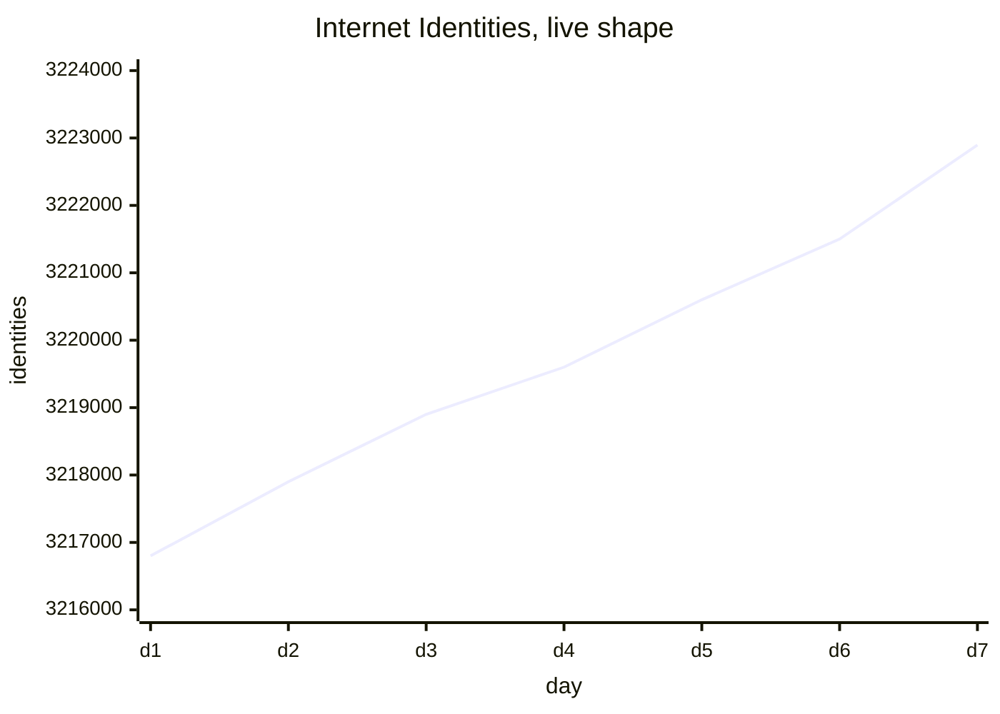
```mermaid
xychart-beta
  title "Internet Identities, live shape"
  x-axis "day" [d1, d2, d3, d4, d5, d6, d7]
  y-axis "identities" 3216000 --> 3224000
  line [3216800, 3217900, 3218900, 3219600, 3220600, 3221500, 3222895]
```

Correct. Two cosmetic notes: the area fill under a monotonic line carries no information, and a legend entry on a single-series panel is noise. Keep the panel, migrate it off the Angular type.

## Registrations the last 24h

```promql
increase(internet_identity_user_count[1d])
```

The 24-hour delta of that monotonic gauge, evaluated at every point, so the line is a rolling daily total rather than a figure for one fixed day. Sound: the gauge never decreases, so `increase()` cannot be confused by a reset.

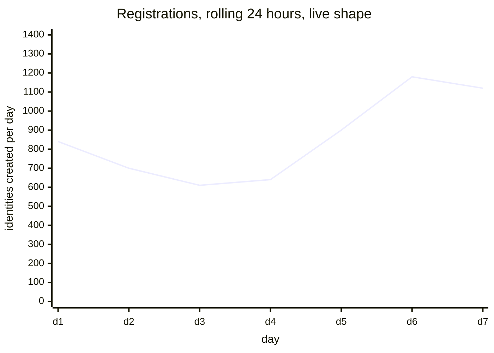
```mermaid
xychart-beta
  title "Registrations, rolling 24 hours, live shape"
  x-axis "day" [d1, d2, d3, d4, d5, d6, d7]
  y-axis "identities created per day" 0 --> 1400
  line [840, 700, 610, 640, 900, 1180, 1120]
```

Correct, but the title reads as "how many today" when the panel is a rolling window over the whole range. Rename to "Registrations per day, rolling 24h".

## Top 10 dapps by number of sign-ins, 24h and 30d

```promql
internet_identity_prepare_delegation_count{ii_origin="ic0.app", window="24h"}
internet_identity_prepare_delegation_count{ii_origin="ic0.app", window="30d"}
```

The canister keeps its own 24-hour and 30-day rolling totals per app, returns the ten heaviest, and Grafana plots each as a series over time. So each point is the canister's window as it stood at that moment.

Three problems, in ascending order of seriousness.

The 30-day panel is the wrong chart type. A 30-day rolling total barely moves over a 7-day view, which is why the screenshot shows flat lines. A ranking at a point in time wants bars.

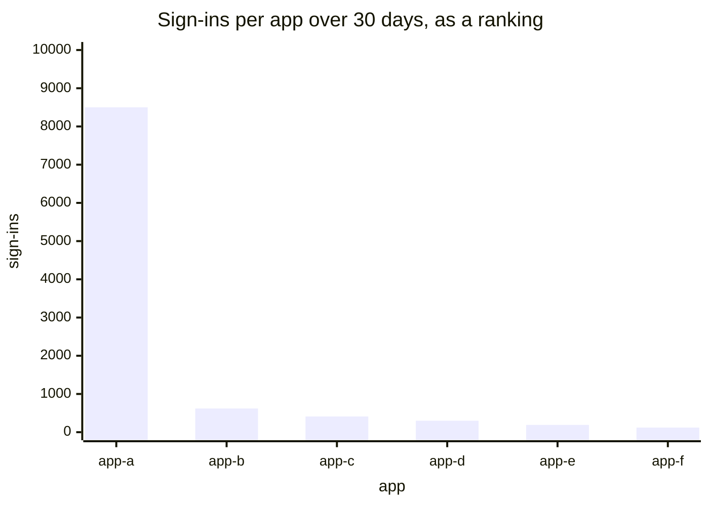
```mermaid
xychart-beta
  title "Sign-ins per app over 30 days, as a ranking"
  x-axis "app" ["app-a", "app-b", "app-c", "app-d", "app-e", "app-f"]
  y-axis "sign-ins" 0 --> 10000
  bar [8500, 620, 410, 300, 190, 120]
```

The `ic0.app` scope is deliberate, and the panel descriptions say so. It has quietly become a scope over the minority: `id.ai` carried 1,893 daily active identities against `identity.ic0.app`'s 190. No panel covers the majority, and the canister cannot supply one, because it only ever retrieves `Some(Ic0App)` for this family.

And the metric is fed only by `prepare_account_delegation`. `prepare_account_session` calls no bookkeeping at all, so a migrating app's line falls to zero while its usage is flat.

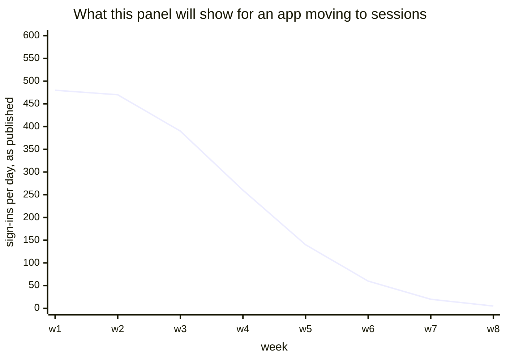
```mermaid
xychart-beta
  title "What this panel will show for an app moving to sessions"
  x-axis "week" [w1, w2, w3, w4, w5, w6, w7, w8]
  y-axis "sign-ins per day, as published" 0 --> 600
  line [480, 470, 390, 260, 140, 60, 20, 5]
```

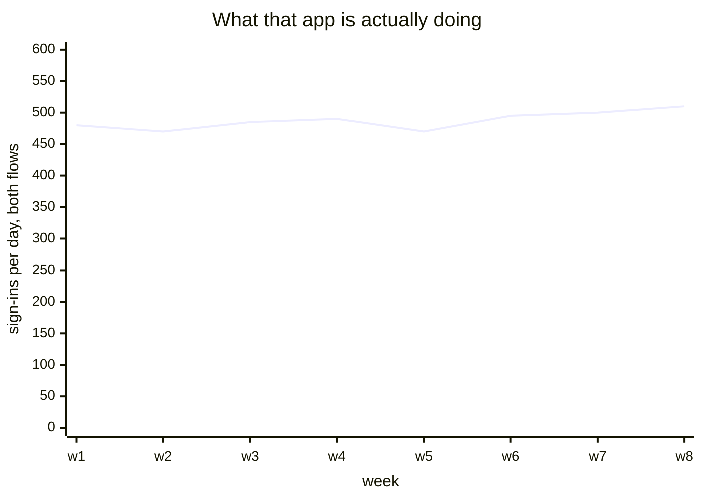
```mermaid
xychart-beta
  title "What that app is actually doing"
  x-axis "week" [w1, w2, w3, w4, w5, w6, w7, w8]
  y-axis "sign-ins per day, both flows" 0 --> 600
  line [480, 470, 485, 490, 470, 495, 500, 510]
```

**Replaced by one panel**, a bar ranking fed by a sign-in counter written on both paths and labelled by app, with Prometheus doing the windowing rather than the canister:

```promql
topk(10, sum by (dapp) (increase(internet_identity_sign_ins_total[24h])))
```

Keep a second time-series panel only if the trend per app is genuinely watched; the ranking is what people read.

## Top 10 dapps by cumulative session length, 24h and 30d

```promql
internet_identity_prepare_delegation_session_seconds{ii_origin="ic0.app", window="24h"}
```

The metric sums the lifetimes delegations were **issued for**, taken from the request at sign-in and capped at 30 days. The panel sets `unit: s` on a log-2 axis, so Grafana renders those sums in years.

Live, the top app over 24 hours reads 12,960,000 seconds from 5 sign-ins: exactly 30 days each, because that is what the app asked for. The panel is therefore a sign-in count multiplied by a constant, and it ranks 5 long-lifetime sign-ins above 500 short ones, which is why its ordering disagrees with the panel above it.

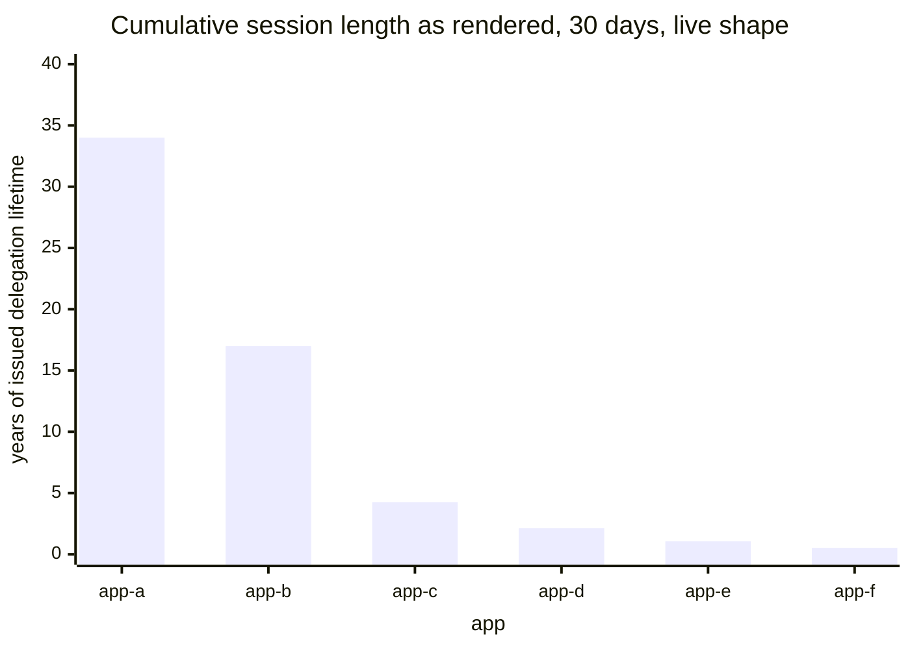
```mermaid
xychart-beta
  title "Cumulative session length as rendered, 30 days, live shape"
  x-axis "app" ["app-a", "app-b", "app-c", "app-d", "app-e", "app-f"]
  y-axis "years of issued delegation lifetime" 0 --> 40
  bar [34, 17, 4.25, 2.13, 1.06, 0.53]
```

**Both panels replaced by one**, a histogram of how long sign-ins actually lasted, observed when each one ends:

```promql
histogram_quantile(0.5, sum by (le) (rate(internet_identity_session_age_seconds_bucket[7d])))
```

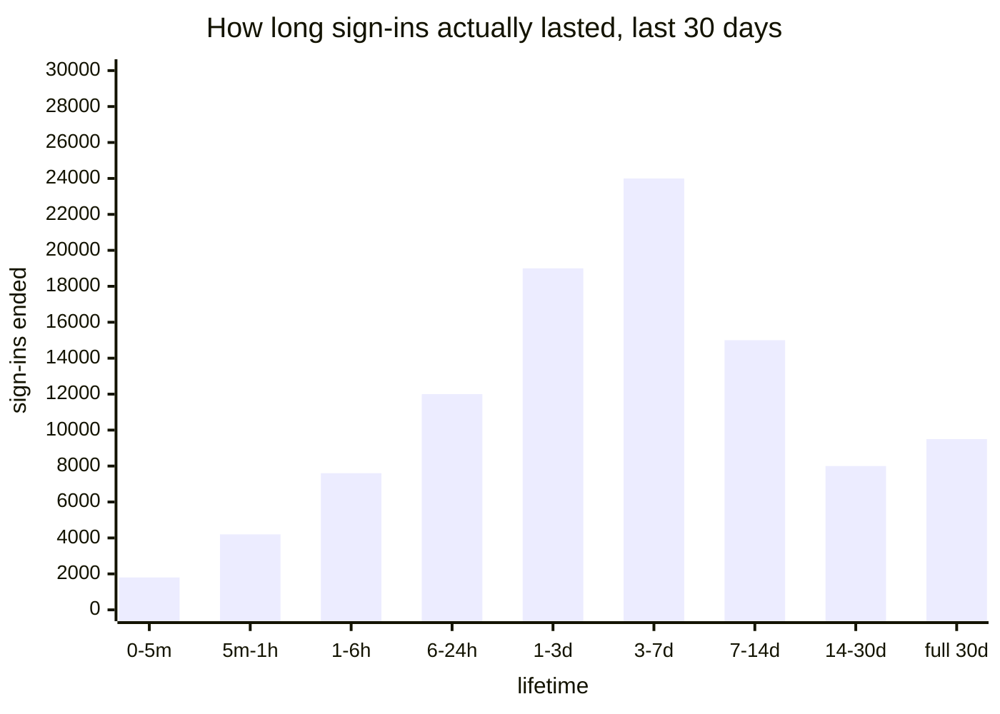
```mermaid
xychart-beta
  title "How long sign-ins actually lasted, last 30 days"
  x-axis "lifetime" ["0-5m", "5m-1h", "1-6h", "6-24h", "1-3d", "3-7d", "7-14d", "14-30d", "full 30d"]
  y-axis "sign-ins ended" 0 --> 30000
  bar [1800, 4200, 7600, 12000, 19000, 24000, 15000, 8000, 9500]
```

Until that exists, retitle these two "sign-ins weighted by requested lifetime". The present title has already been read as a measurement of session length.

## Logins per Hour

```promql
increase(internet_identity_delegation_counter[1h])
```

`delegation_counter` counts calls to `prepare_account_delegation`. It is a gauge documented as counting since the last upgrade: live it read 51,101 seven days after a deploy, about 7,300 a day, which matches the panel's 200 to 500 an hour. At each deploy it returns to zero, and the session flow does not touch it at all.

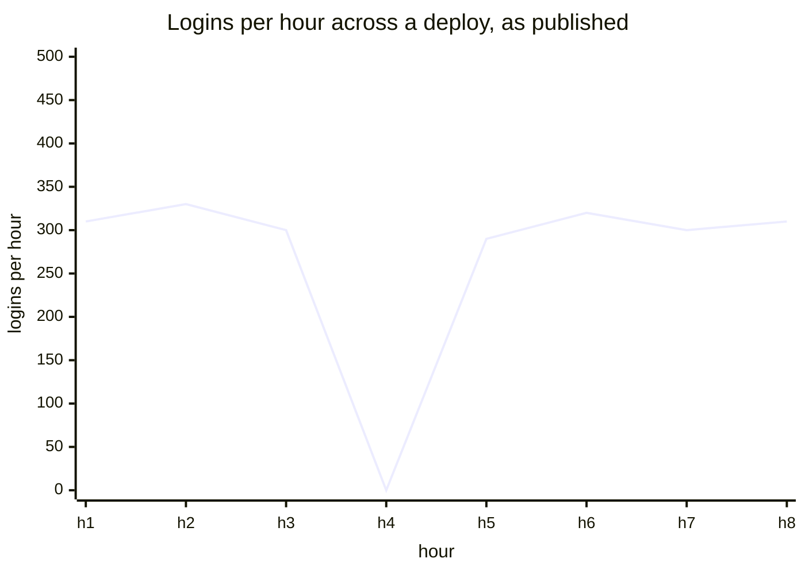
```mermaid
xychart-beta
  title "Logins per hour across a deploy, as published"
  x-axis "hour" [h1, h2, h3, h4, h5, h6, h7, h8]
  y-axis "logins per hour" 0 --> 500
  line [310, 330, 300, 0, 290, 320, 300, 310]
```

**Replaced by one panel** over a real counter that survives upgrade, split by flow so the same panel shows adoption:

```promql
sum by (flow) (rate(internet_identity_sign_ins_total[5m])) * 3600
```

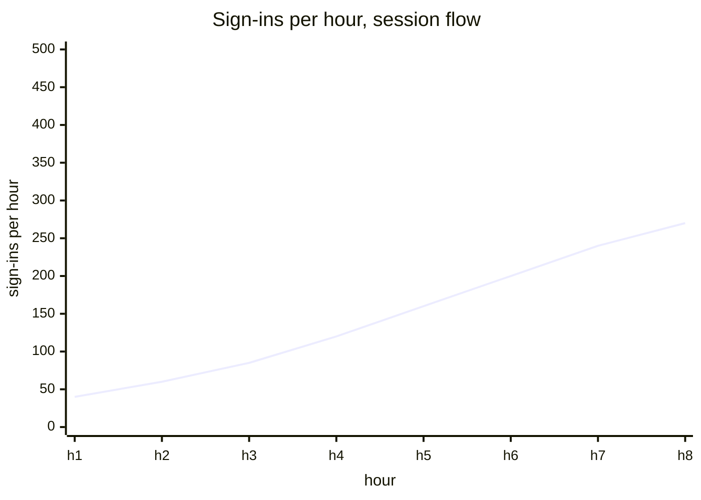
```mermaid
xychart-beta
  title "Sign-ins per hour, session flow"
  x-axis "hour" [h1, h2, h3, h4, h5, h6, h7, h8]
  y-axis "sign-ins per hour" 0 --> 500
  line [40, 60, 85, 120, 160, 200, 240, 270]
```

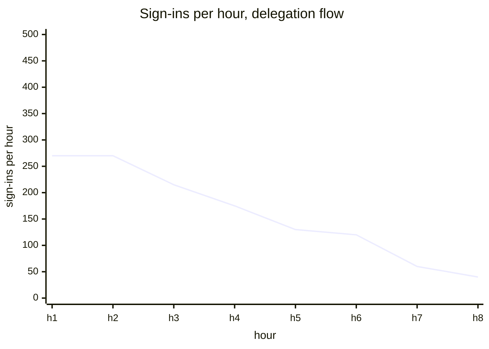
```mermaid
xychart-beta
  title "Sign-ins per hour, delegation flow"
  x-axis "hour" [h1, h2, h3, h4, h5, h6, h7, h8]
  y-axis "sign-ins per hour" 0 --> 500
  line [270, 270, 215, 175, 130, 120, 60, 40]
```

## Accounts and Applications Count

```promql
internet_identity_total_accounts_count
internet_identity_total_account_references_count
internet_identity_total_application_count
```

Three stored counts. Live: 17,720 accounts, 27,563 identity-and-app pairings, 7,489 distinct apps.

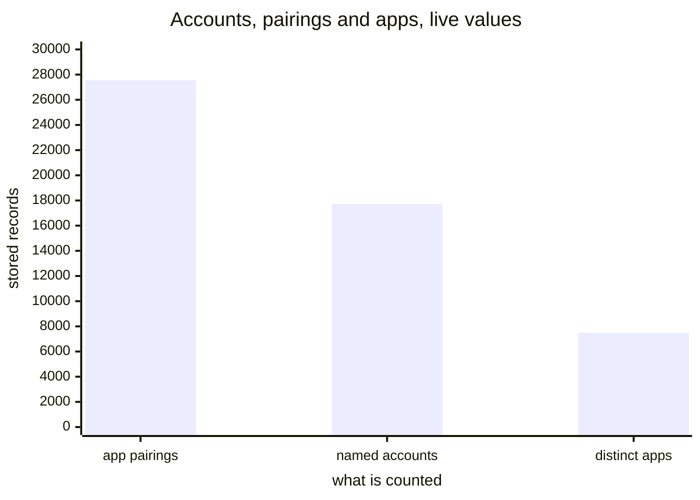
```mermaid
xychart-beta
  title "Accounts, pairings and apps, live values"
  x-axis "what is counted" ["app pairings", "named accounts", "distinct apps"]
  y-axis "stored records" 0 --> 30000
  bar [27563, 17720, 7489]
```

Correct, and the panel's own description carries the caveat worth keeping: a default account is not stored until it is renamed, and its pairing is not stored until a second account exists, so both counts are floors rather than totals.

With sessions this panel is where stored sign-ins belong as a fourth series, since it is already the storage-growth panel and sessions are stored inside those pairings.

## Identity Changes per Hour

```promql
increase(internet_identity_anchor_operations_counter[1h])
```

Counts device and identity mutations. Live: 7,367 since the last upgrade, about 1,050 a day, matching the panel's 25 to 100 an hour.

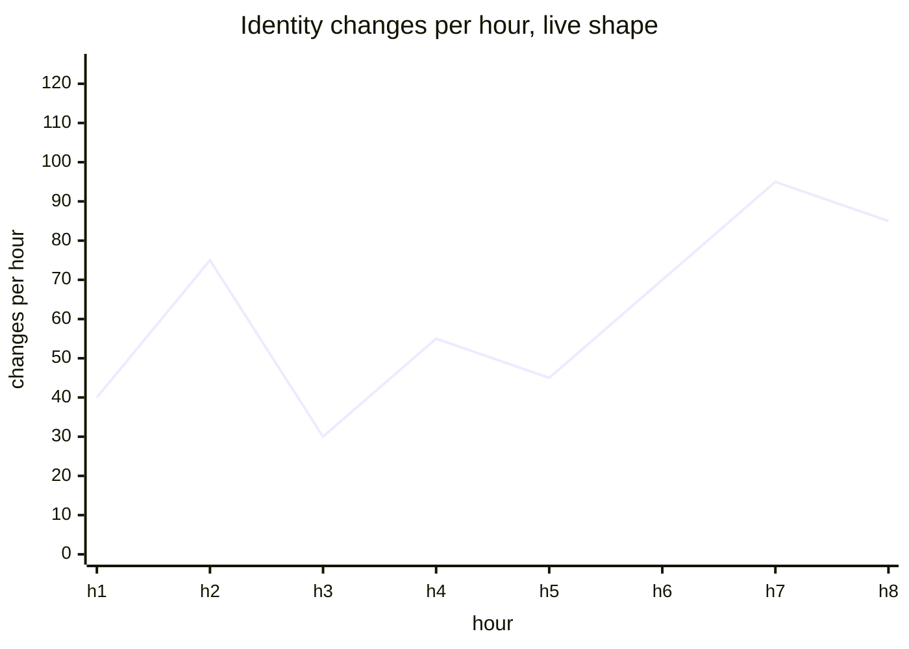
```mermaid
xychart-beta
  title "Identity changes per hour, live shape"
  x-axis "hour" [h1, h2, h3, h4, h5, h6, h7, h8]
  y-axis "changes per hour" 0 --> 125
  line [40, 75, 30, 55, 45, 70, 95, 85]
```

Correct in what it counts. Same reset problem as Logins per Hour, so the fix is the same: make it a real counter in persistent state. No new panel needed.

## Bounce Rate on identity.ic0.app

The only panel not fed by this endpoint. A ClickHouse query dividing visitors who took no authenticated action by all visitors, hour by hour, where an authenticated action is:

```sql
('prepare_delegation', 'get_anchor_info', 'register') AS RELEVANT_ACTION
```

All three methods still exist. The problem is that the current frontend does not use two of them for the flows that matter: signing in calls `prepare_account_delegation`, and registering goes through `identity_registration_start` and `identity_registration_finish`. So nearly every real sign-in is counted as a bounce, which is why the panel sits at 1.0 and dips only when residual `get_anchor_info` traffic arrives from the management screens.

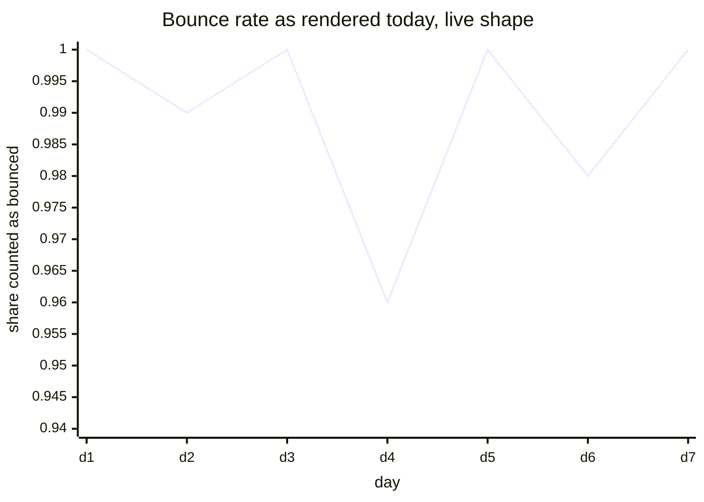
```mermaid
xychart-beta
  title "Bounce rate as rendered today, live shape"
  x-axis "day" [d1, d2, d3, d4, d5, d6, d7]
  y-axis "share counted as bounced" 0.94 --> 1.0
  line [1.0, 0.99, 1.0, 0.96, 1.0, 0.98, 1.0]
```

**Replaced by itself with a corrected action list**, plus `prepare_account_session` when sessions ship:

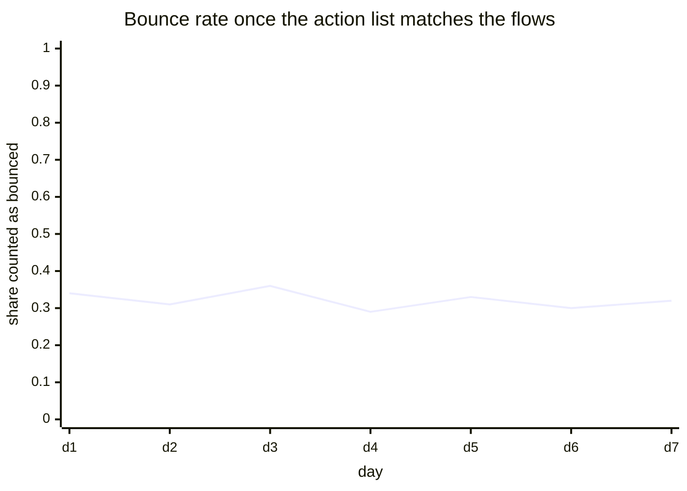
```mermaid
xychart-beta
  title "Bounce rate once the action list matches the flows"
  x-axis "day" [d1, d2, d3, d4, d5, d6, d7]
  y-axis "share counted as bounced" 0 --> 1.0
  line [0.34, 0.31, 0.36, 0.29, 0.33, 0.3, 0.32]
```

The query is also scoped to `http_origin == 'https://identity.ic0.app'`, so it says nothing about `id.ai`. And the action list needs an owner, because it will drift again the next time a flow is added.

## Days until internet identity becomes full

```promql
  (internet_identity_max_user_number - internet_identity_user_count)
/ (deriv(internet_identity_user_count[24h]) * 86400)
```

Two stat panels, one over a day's growth rate and one over a week's. Live: 4112 and 5491.

Three defects. The numerator subtracts a count from an identity number: anchors are assigned upward from `min_user_number`, so free slots are `max - min - count + 1`, which is 7,569,743 − 10,000 − 3,222,895 + 1 = 4,336,849, where the query computes 4,346,848 and overstates by very nearly `min_user_number`. The field config sets `max: 365`, so the continuous colour scale is saturated at every value this panel will ever show. And two numbers eleven years out, four years apart, prompt nobody to do anything.

**Replaced by two panels.** One stat for the headline, with the numerator corrected and the colour scale removed or rescaled:

```promql
  (internet_identity_max_user_number - internet_identity_min_user_number
   - internet_identity_user_count + 1)
/ (deriv(internet_identity_user_count[1w]) * 86400)
```

And one trend, because the direction is the only actionable part:

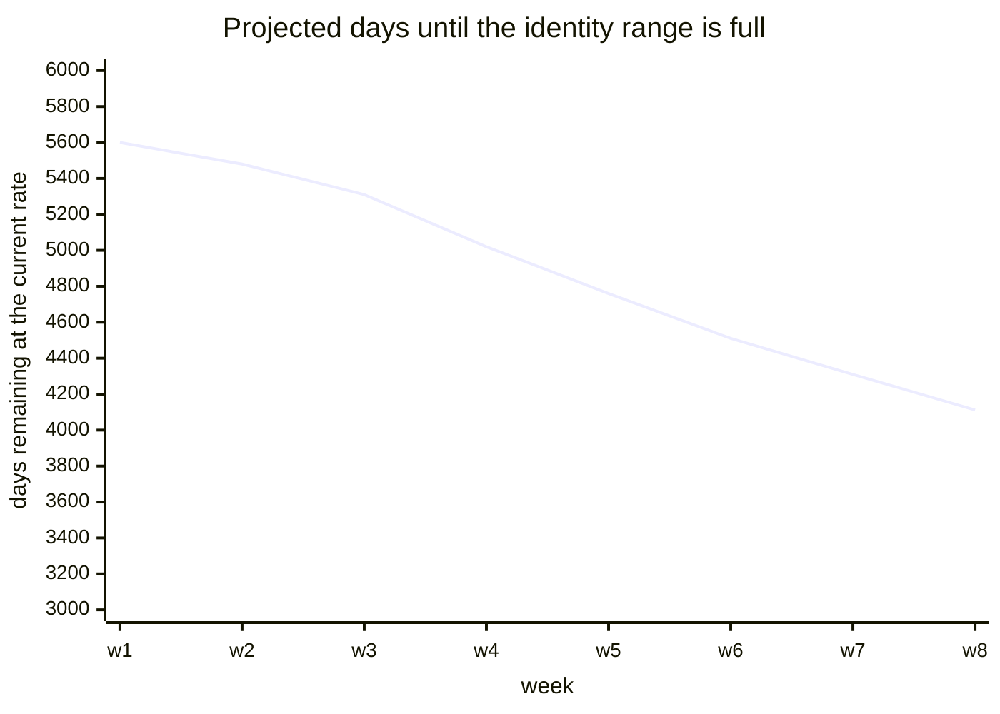
```mermaid
xychart-beta
  title "Projected days until the identity range is full"
  x-axis "week" [w1, w2, w3, w4, w5, w6, w7, w8]
  y-axis "days remaining at the current rate" 3000 --> 6000
  line [5600, 5480, 5310, 5020, 4760, 4510, 4310, 4112]
```

A falling line means growth is accelerating.

## Registration Rates / Captcha Threshold Rate

```promql
internet_identity_registrations_per_second
```

Shows "No data". The canister emits that family only when the rate tracker has something to report:

```rust
if let Some(registration_rates) = storage.registration_rates.registration_rates() {
```

On the live canister it does not, so the family is absent from the scrape entirely and has been for long enough that nobody noticed.

**Either feed it or delete it.** A permanently empty panel teaches people to ignore empty panels, which is expensive the first time an empty panel matters. If the captcha threshold is still a live mechanism, the metric should be emitted unconditionally with a zero; if it is not, the panel should go.

## Daily and Monthly Active Identities

```promql
internet_identity_daily_active_anchors               # "All domains"
internet_identity_daily_active_anchors_by_domain     # {{domain}}
```

Distinct identities that took an authenticated action in the window, recomputed every 24 hours, plotted as a total alongside a per-domain breakdown.

The parts cannot sum to the whole and nothing on the panel says so. Live: 190 on `identity.ic0.app`, 1,893 on `id.ai`, 20 on `internetcomputer.org`, 34 on both, totalling 2,137 against an "All domains" line of 3,627.

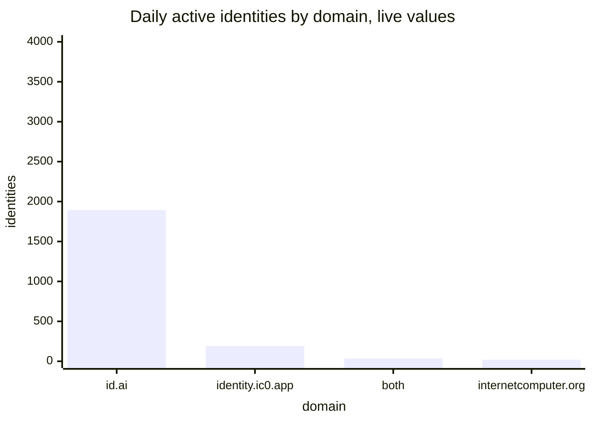
```mermaid
xychart-beta
  title "Daily active identities by domain, live values"
  x-axis "domain" ["id.ai", "identity.ic0.app", "both", "internetcomputer.org"]
  y-axis "identities" 0 --> 4000
  bar [1893, 190, 34, 20]
```

The 1,490 difference is not a bug. A domain is recorded only when the authenticating device carries one, and OpenID credentials do not. Daily active OpenID identities on the same scrape total 1,485, which is that gap to within five.

**Replaced by itself plus one series:** publish the remainder as `no domain`, so the parts add up and the OpenID share is visible where a reader will look for it.

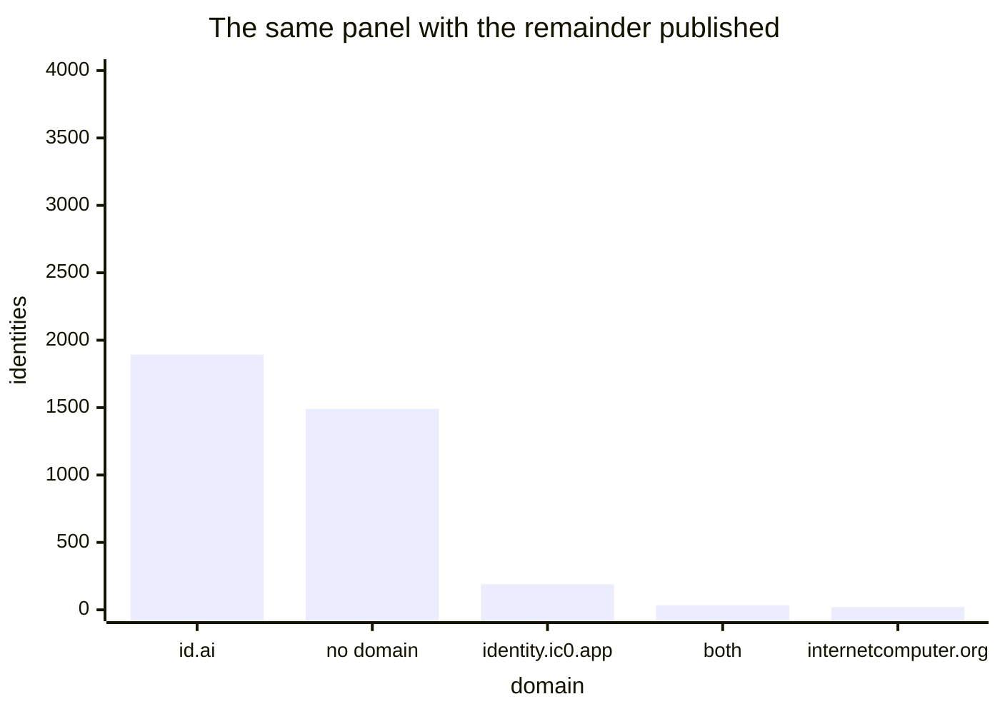
```mermaid
xychart-beta
  title "The same panel with the remainder published"
  x-axis "domain" ["id.ai", "no domain", "identity.ic0.app", "both", "internetcomputer.org"]
  y-axis "identities" 0 --> 4000
  bar [1893, 1490, 190, 34, 20]
```

## Daily and Monthly Active Authentication Methods

```promql
internet_identity_daily_active_authn_methods     # legendFormat: {{type}}
```

Distinct authentication methods used in the window. The metric carries `type` **and** `issuer`, and OpenID appears once per issuer, so with a legend of `{{type}}` alone five distinct series all render as `openid`. That is exactly what the panel shows.

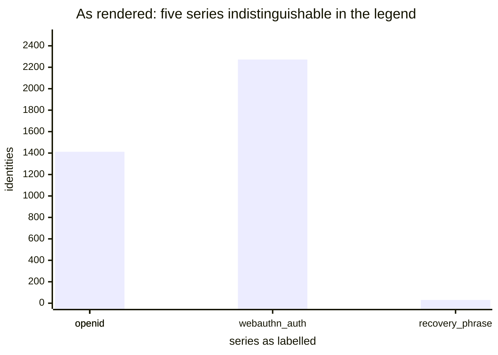
```mermaid
xychart-beta
  title "As rendered: five series indistinguishable in the legend"
  x-axis "series as labelled" ["openid", "openid", "openid", "webauthn_auth", "recovery_phrase"]
  y-axis "identities" 0 --> 2500
  bar [1412, 52, 21, 2272, 30]
```

**Replaced by itself with `legendFormat: {{type}} {{issuer}}`**, which is a one-word fix and makes the panel say something:

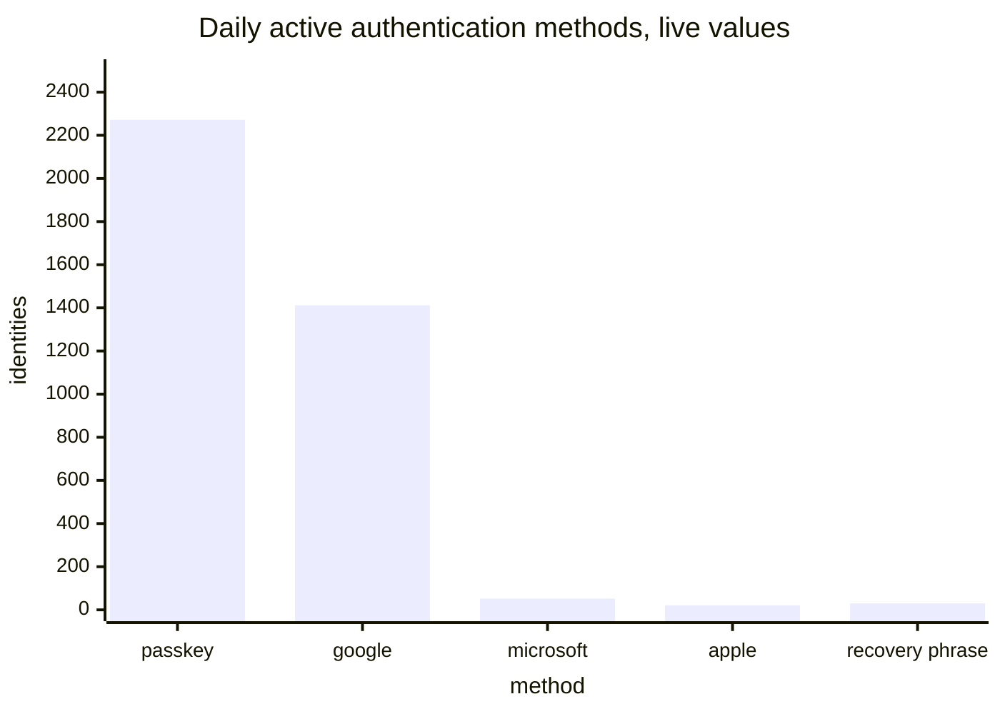
```mermaid
xychart-beta
  title "Daily active authentication methods, live values"
  x-axis "method" ["passkey", "google", "microsoft", "apple", "recovery phrase"]
  y-axis "identities" 0 --> 2500
  bar [2272, 1412, 52, 21, 30]
```

## Internet Identity Virtual Memory Page Sizes

```promql
internet_identity_virtual_memory_size_pages     # legendFormat: {{memory}}
```

One series per internal stable structure, on a log-2 axis, in pages. Live there are 25 of them totalling 238,574 pages, or 14.6 GiB. Correct, and unreadable: the unit is pages rather than bytes, the log scale flattens exactly the differences that matter, and the series names are storage internals.

**Replaced by two panels.** One readable ranking in bytes, which the live data makes concrete: `identities` alone is 77.6 percent of the total.

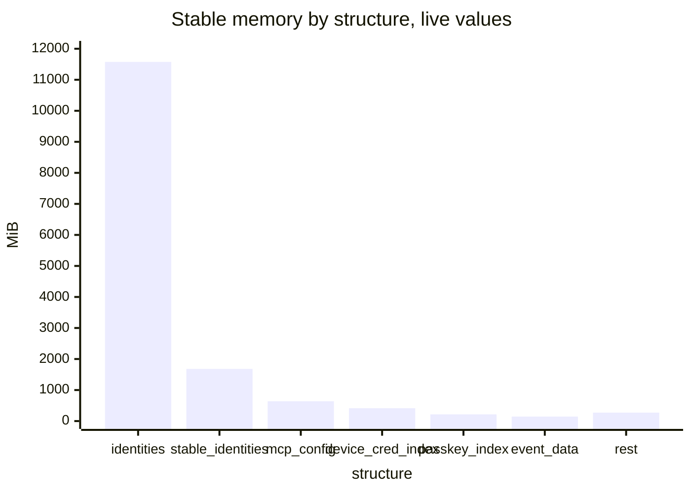
```mermaid
xychart-beta
  title "Stable memory by structure, live values"
  x-axis "structure" ["identities", "stable_identities", "mcp_config", "device_cred_index", "passkey_index", "event_data", "rest"]
  y-axis "MiB" 0 --> 12000
  bar [11576, 1680, 639, 415, 217, 146, 273]
```

And the existing log-scale view kept as a second panel, for spotting a structure that jumps by an order of magnitude. It is a debugging view, not a dashboard view, and labelling it as such stops people trying to read it at a glance.

## Time since successful archive entries fetch

```promql
time() - ii_archive_last_successful_fetch_timestamp_seconds
```

Staleness of the pull from the archive canister, in seconds, red past 70. Live: 12.7 seconds, against a configured polling interval of 15.

```mermaid
xychart-beta
  title "Archive fetch staleness against its threshold"
  x-axis "scrape" [s1, s2, s3, s4, s5, s6, s7, s8]
  y-axis "seconds since last successful fetch (red at 70)" 0 --> 80
  line [12, 8, 14, 11, 9, 13, 12.7, 10]
```

Correct, and the best-designed panel here: a freshness measure with a threshold derived from the configured interval. No change.

## Registration Rate Limit Burst Reserve

```promql
internet_identity_register_rate_limit_current_tokens
```

Tokens left in the registration rate limiter. Live: 24,999 of a maximum of 25,000, which the endpoint also publishes as `register_rate_limit_max_tokens`.

Correct, and unreadable for the opposite reason to the memory panel: the value sits at the top of its range forever, so the only visible feature is a one-token dip that looks like noise and is in fact the entire signal.

```mermaid
xychart-beta
  title "As rendered: tokens remaining, live shape"
  x-axis "hour" [h1, h2, h3, h4, h5, h6, h7, h8]
  y-axis "tokens remaining of 25,000" 24997 --> 25000
  line [24999, 24999, 24998, 24999, 24999, 24998, 24999, 24999]
```

**Replaced by itself, inverted:** plot tokens consumed, `max_tokens - current_tokens`, so the resting state is zero and any burst is the deviation. Same data, and a reader can see at a glance whether the limiter is being approached.

```mermaid
xychart-beta
  title "Tokens consumed, so zero is the resting state"
  x-axis "hour" [h1, h2, h3, h4, h5, h6, h7, h8]
  y-axis "tokens consumed" 0 --> 2500
  line [1, 1, 2, 1, 1, 2, 1, 1]
```

## Stable memory usage

```promql
internet_identity_stable_memory_pages
(internet_identity_stable_memory_pages * 65536) / (500*1024*1024*1024) * 100
```

Pages used, and a percentage against 500 GiB. 500 GiB is the subnet's ceiling; the canister's own is lower, `MAX_MANAGED_MEMORY_SIZE = 256 * GB`. Utilisation should be read against whichever binds first, so the live 241,794 pages is 14.8 GiB, which the panel calls 2.9 percent where against the managed cap it is 5.8.

```mermaid
xychart-beta
  title "Stable memory against both ceilings, live value"
  x-axis "measured against" ["subnet limit, 500 GiB", "managed cap, 256 GiB"]
  y-axis "percent used" 0 --> 10
  bar [2.9, 5.8]
```

**Replaced by itself with the managed cap as the denominator,** or with both ceilings plotted. Either is fine; reporting only the looser one is not, and the gap grows with the number.

## Archive Stable Memory Usage

```promql
ii_archive_stable_memory_pages
(ii_archive_stable_memory_pages * 65536) / (500*1024*1024*1024) * 100
```

The same construction for the archive canister, and the same question: whether the archive has a managed cap below the subnet's 500 GiB. If it does, this panel needs the same correction. If it does not, 500 GiB is right here and the divergence from the panel above should be commented, so nobody harmonises them wrongly later.

## Number of Buffered Archive Entries

```promql
internet_identity_buffered_archive_entries
```

Entries waiting to be pulled by the archive. Live: 0, with a red threshold at 5,000 and a configured buffer limit, also published, of 10,000.

```mermaid
xychart-beta
  title "Buffered archive entries, live shape"
  x-axis "hour" [h1, h2, h3, h4, h5, h6, h7, h8]
  y-axis "entries waiting" 0 --> 3
  line [0, 1, 0, 0, 2, 1, 0, 1]
```

Correct. **Replaced by itself plus its limit:** plot `internet_identity_archive_config_entries_buffer_limit` alongside, so the threshold at 5,000 is visibly half the configured 10,000 rather than a number somebody has to look up.

## Signature map size

```promql
avg_over_time(internet_identity_signature_count[$__interval])
```

Live delegation signatures held in the certified map. Live: 25, with the panel ranging 5 to 30, because a signature lives for the 30-minute default delegation expiry.

```mermaid
xychart-beta
  title "Signature map size, live shape"
  x-axis "hour" [h1, h2, h3, h4, h5, h6, h7, h8]
  y-axis "signatures held" 0 --> 35
  line [15, 22, 18, 12, 20, 25, 19, 16]
```

Correct, and flagged because sessions change what normal is. An app delegation lives 5 minutes and is replaced while an app is open, so the same users produce more signatures each held a sixth as long. Whether the count rises or falls depends on churn against lifetime, so any threshold here needs re-deriving once sessions carry traffic rather than being assumed to hold.

## Archive Entries

```promql
ii_archive_entries_count{source="log"}
```

Total entries the archive has ever recorded. Live: about 2,718,590, rising steadily.

```mermaid
xychart-beta
  title "Archive entries, live shape"
  x-axis "day" [d1, d2, d3, d4, d5, d6, d7]
  y-axis "entries" 2711000 --> 2719000
  line [2711400, 2712600, 2713800, 2714900, 2716100, 2717400, 2718590]
```

Correct, and a monotonic total is the least informative shape available: it rises whatever happens. **Replaced by two panels:** keep the total for the absolute figure, and add the rate, which is what shows a change in behaviour.

```mermaid
xychart-beta
  title "Archive entries per hour"
  x-axis "hour" [h1, h2, h3, h4, h5, h6, h7, h8]
  y-axis "entries per hour" 0 --> 400
  line [180, 210, 195, 240, 300, 260, 220, 205]
```

## What sessions add

Four new panels. The metrics behind them, and what each costs, are in the companion document.

**Are apps adopting sessions.** One counter on both sign-in paths, read as a share. The panel to watch for the first year, and the one that answers "is this working" to somebody non-technical.

```mermaid
xychart-beta
  title "Share of sign-ins that created a session"
  x-axis "week" [w1, w2, w3, w4, w5, w6, w7, w8]
  y-axis "% of sign-ins" 0 --> 100
  line [2, 9, 21, 38, 52, 63, 71, 76]
```

**How long people stay signed in.** The histogram shown above, which replaces the cumulative-session-length panels rather than sitting beside them.

**Is anything failing.** Delegation requests refused as a share of requests. The only error rate the design has, and the only session panel worth an alert.

```mermaid
xychart-beta
  title "Delegation requests refused"
  x-axis "hour" [h1, h2, h3, h4, h5, h6, h7, h8]
  y-axis "% of requests refused" 0 --> 10
  line [0.4, 0.4, 0.5, 6.2, 3.1, 0.6, 0.4, 0.4]
```

**What one signed-in user costs.** Requests per active sign-in per day. At a five-minute credential this is really a measure of how long apps stay open, and the figure to put beside any proposal to change those five minutes.

```mermaid
xychart-beta
  title "Delegation requests per active sign-in per day"
  x-axis "day" [mon, tue, wed, thu, fri, sat, sun]
  y-axis "requests per sign-in" 0 --> 40
  line [27, 28, 29, 28, 28, 23, 24]
```

## Fix order

Dashboard-only edits first, because none of them needs a release.

1. Add `prepare_account_delegation`, `identity_registration_start` and `identity_registration_finish` to the bounce-rate action list, and `prepare_account_session` when it ships.
2. Set both authentication-method legends to `{{type}} {{issuer}}`.
3. Correct the days-until-full numerator, drop `max: 365`, add the trend panel.
4. Divide stable memory by the 256 GiB managed cap, or plot both ceilings. Check whether the archive has its own cap.
5. Invert the rate-limit panel to tokens consumed. Plot the archive buffer limit beside the buffered count.
6. Add a readable bytes ranking beside the log-scale memory view, and label the log one as a debugging view.
7. Make the 30-day per-app panel a bar ranking. Add an archive-entries rate panel.
8. Migrate the five Angular `graph` panels to `timeseries`.
9. Retitle the cumulative-session-length panels, or hide them until the histogram exists.
10. Decide whether the empty registration-rate panel gets its metric or gets deleted.

Then the canister changes, in the order the companion document sets out. Its first item, one sign-in counter written on both paths, is also what stops the per-app panels and Logins per Hour going quiet.
