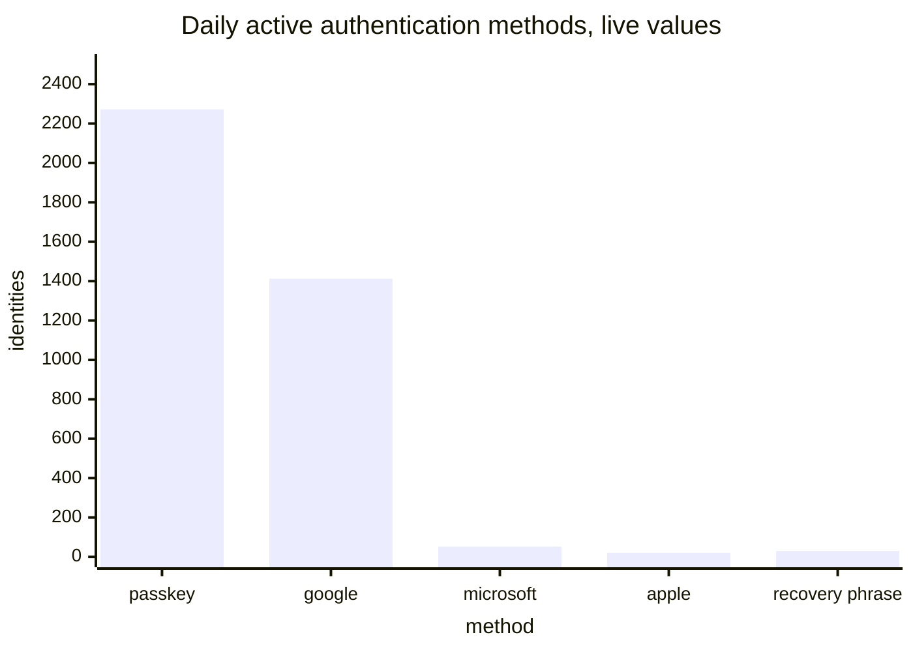
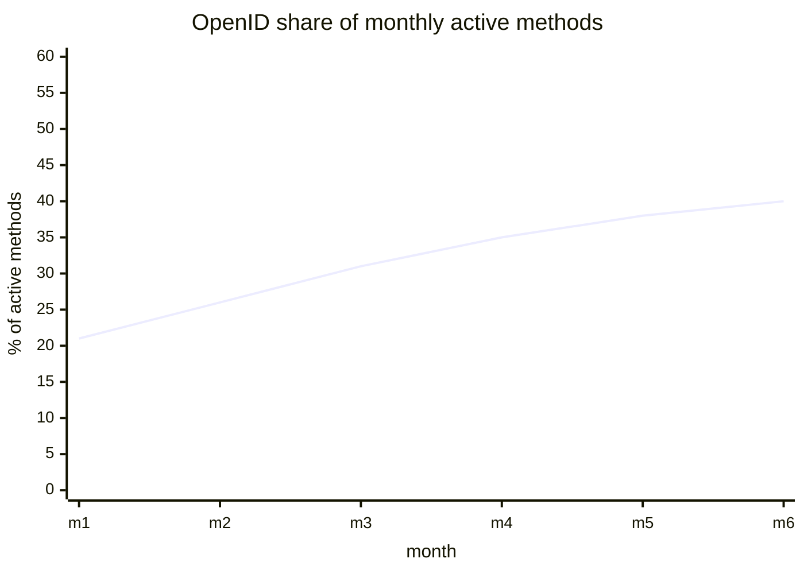

# Access methods

[Dashboards](README.md) · [Health](health.md) · [Usage](usage.md) · [Staying signed in](staying-signed-in.md) · **Access methods** · [Storage and capacity](storage.md)

Which methods people authenticate with, and how that mix moves. Reasoning for each panel is in [metrics.md](../metrics.md).

This is a concern on its own, not a breakdown of anything. Nothing on [Adoption and usage](usage.md) is labelled by access method: a count of sign-ins is a count of sign-ins whoever signed in with what, and it should not move when the mix here changes. The two panels below are the whole of what the endpoint says about the mix, and the whole of where it is read.

## Daily active authentication methods

`internet_identity_daily_active_authn_methods` with `legendFormat: {{type}} {{issuer}}`

The metric carries `type` and `issuer`, and OpenID appears once per issuer, so today's `{{type}}` legend renders five distinct series all called `openid`. One legend field is the whole fix.

Three of the remaining names are internal: `webauthn_auth` is a passkey used to sign in, `webauthn_recovery` one used to recover, `browser_storage_key` a key held in the browser rather than in a passkey or an OpenID credential.

Live, and the reason this panel matters: OpenID together is 1,485 against 2,272 for passkeys.

## Monthly active authentication methods

`internet_identity_monthly_active_authn_methods` with `legendFormat: {{type}} {{issuer}}`

The same metric over a month, and the same one-field fix. The monthly window is where a shift in the mix shows up as a trend rather than as a weekday, which is what makes it worth its own panel.

