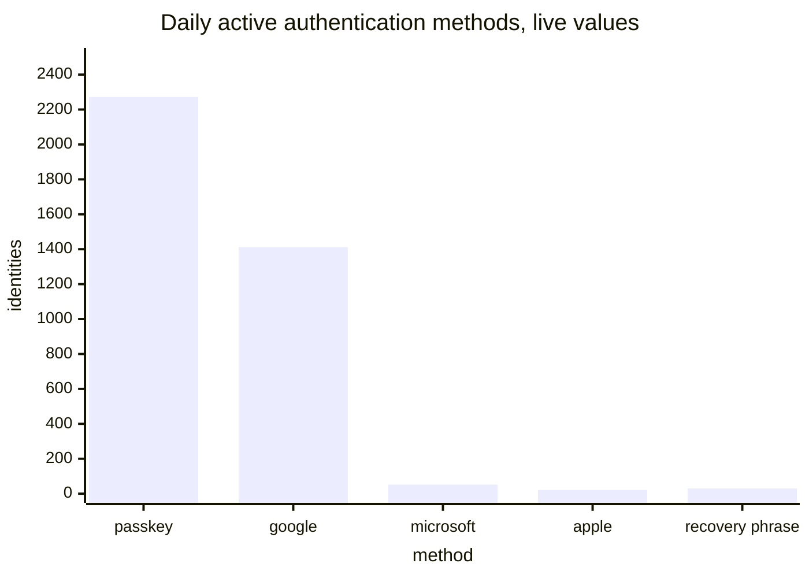
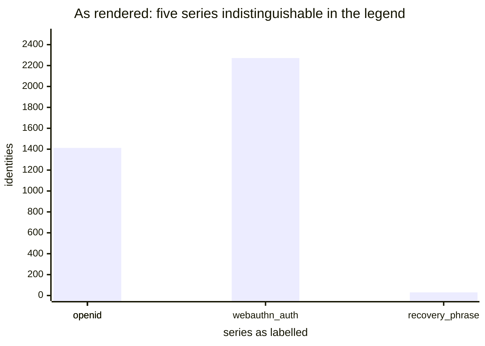
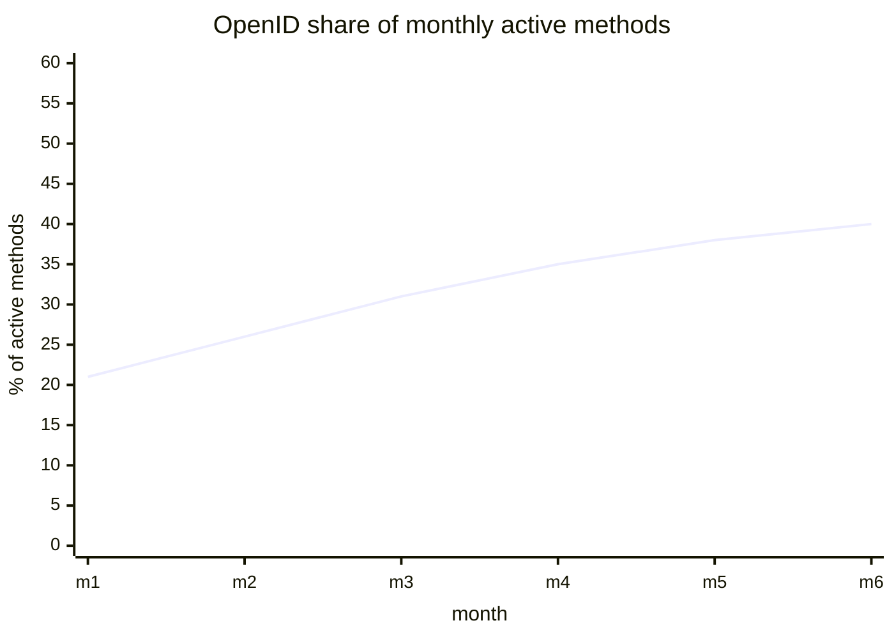

# Access methods

[Dashboards](README.md) · [Health](health.md) · [Usage](usage.md) · [Staying signed in](staying-signed-in.md) · **Access methods** · [Storage and capacity](storage.md)

Which methods people authenticate with, and how that mix moves.

This is a concern on its own, not a breakdown of anything. Nothing on [Usage](usage.md) is labelled by access method: a count of sign-ins is a count of sign-ins whoever made them with whatever, and it should not move when the mix here changes.

## Daily active authentication methods

The mix, day by day. Live it is the reason this page exists: OpenID together is 1,485 against 2,272 for passkeys.



<details>
<summary><b>Today:</b> Daily Active Authentication Methods — five series all called <code>openid</code></summary>

Plots `internet_identity_daily_active_authn_methods{type, issuer}` with `legendFormat: {{type}}`. The family carries `type` **and** `issuer`, and OpenID appears once per issuer, so five distinct series render under the same name and cannot be told apart.



Three of the series names are also internal. `webauthn_auth` is a passkey used to sign in and `webauthn_recovery` one used to recover; `browser_storage_key` is a key held in the browser rather than in a passkey or an OpenID credential; `other` is anything the enum does not name.

</details>

<details>
<summary><b>Sources and formula</b></summary>

No source change. One legend field is the whole fix, plus renaming the series to passkey, recovery passkey and browser-stored key.

```promql
internet_identity_daily_active_authn_methods
```

with `legendFormat: {{type}} {{issuer}}`.

</details>

## Monthly active authentication methods

The same mix over a month, which is where a shift shows up as a trend rather than as a weekday.



<details>
<summary><b>Today:</b> Monthly Active Authentication Methods — the same legend bug</summary>

Identical construction to the daily panel and identically illegible: `legendFormat: {{type}}` on a metric labelled by type and issuer.

</details>

<details>
<summary><b>Sources and formula</b></summary>

No source change; the same one-field fix.

```promql
internet_identity_monthly_active_authn_methods
```

with `legendFormat: {{type}} {{issuer}}`.

</details>
