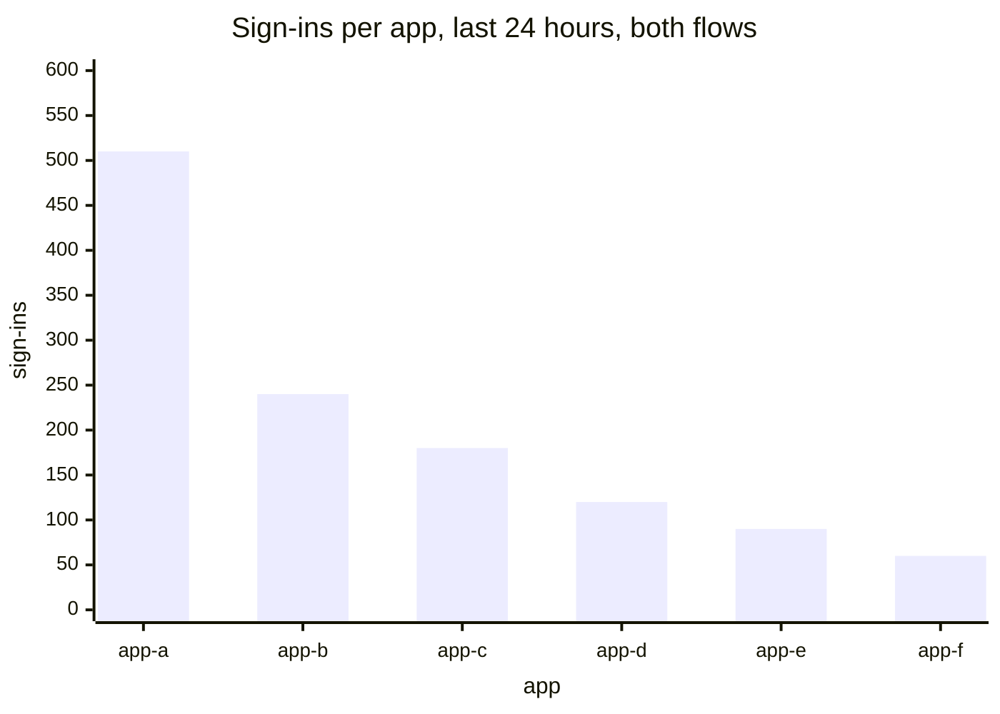
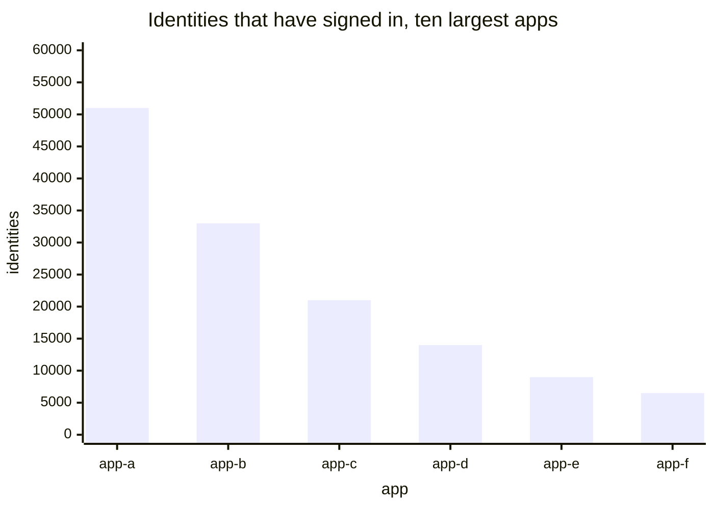
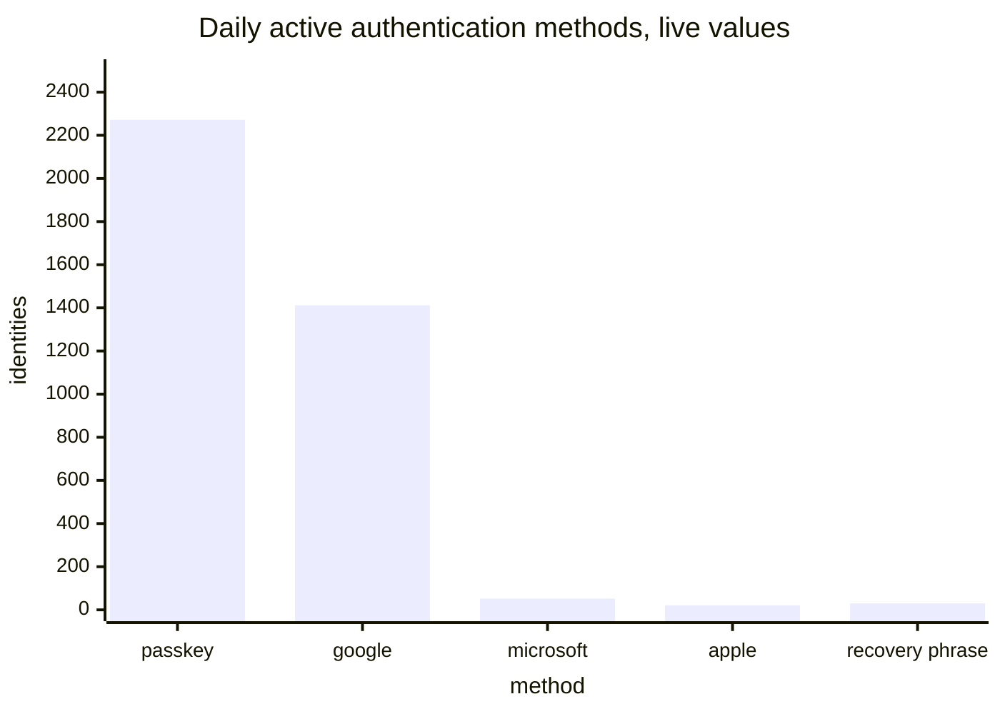

# Apps

[Dashboards](README.md) · [Health](health.md) · [Adoption and usage](usage.md) · **Apps** · [Storage and capacity](storage.md)

Which apps carry the traffic, and how people authenticate. Opened when a specific question comes up. Reasoning for each panel is in [metrics.md](../metrics.md).

Before anything on this page is trusted, one thing has to be settled: `ii_origin` does not mean the domain a request came from. It is read from the authenticating passkey's registration origin, and is absent for anything that is not a passkey. The two existing per-app panels publish only `ii_origin="ic0.app"`, which live is 190 of 3,627 daily active identities. Every panel here depends on deciding what that label should mean.

## Sign-ins per app · replaces two panels

`topk(10, sum by (dapp) (increase(internet_identity_sign_ins_total[24h])))`

A ranking rather than a time series, because a ranking is what people read off it. One panel replaces the 24-hour and 30-day pair: once sign-ins come from a counter, Prometheus computes any window and the dashboard's time picker chooses it.

Today's panels are fed only by `prepare_account_delegation`, so a migrating app's line falls to zero while its usage is flat.

## Identities per app · new

`topk(10, internet_identity_identities_per_app)`

Identities that have ever signed in to each app: reach rather than current traffic. Already stored as a count on each application record, so publishing it is a read and a sort.

Useful beside the panel above, since an app with many identities and little traffic is one people signed up for and left.

## How people authenticate · fix

`internet_identity_daily_active_authn_methods` with `legendFormat: {{type}} {{issuer}}`, and the monthly equivalent

The metric carries `type` and `issuer`, and OpenID appears once per issuer, so today's `{{type}}` legend renders five distinct series all called `openid`. Three of the remaining names are internal: `webauthn_auth` is a passkey used to sign in, `webauthn_recovery` one used to recover, `browser_storage_key` a key held in the browser rather than in a passkey or an OpenID credential.

Live values, which are the reason this panel matters: OpenID together is 1,485 against 2,272 for passkeys.

