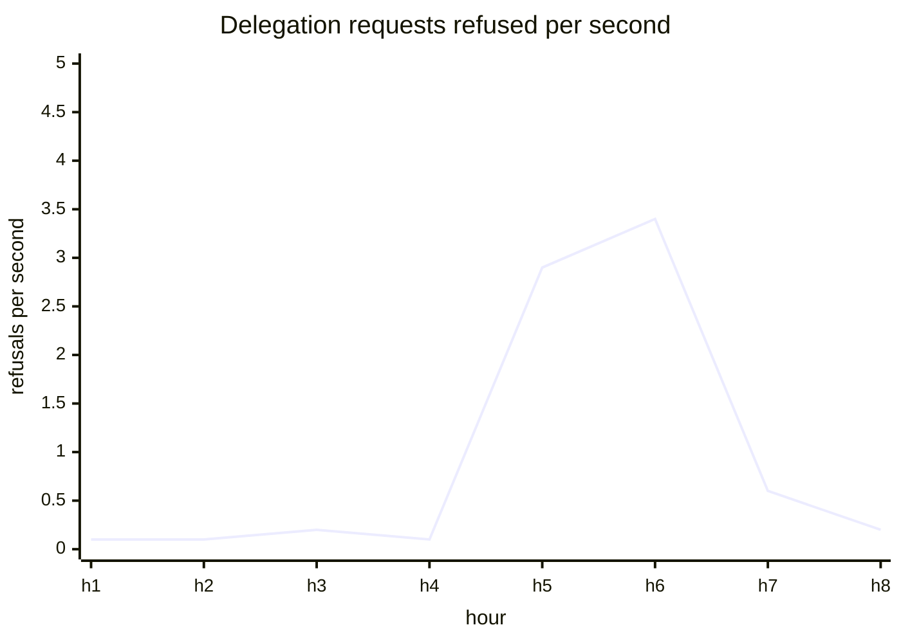
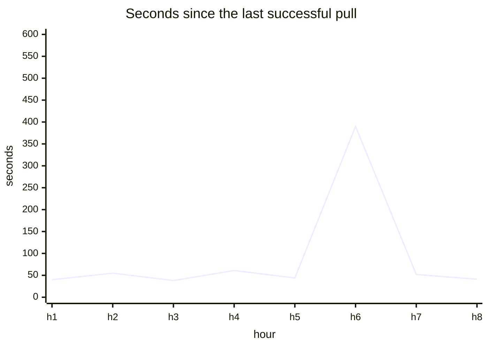
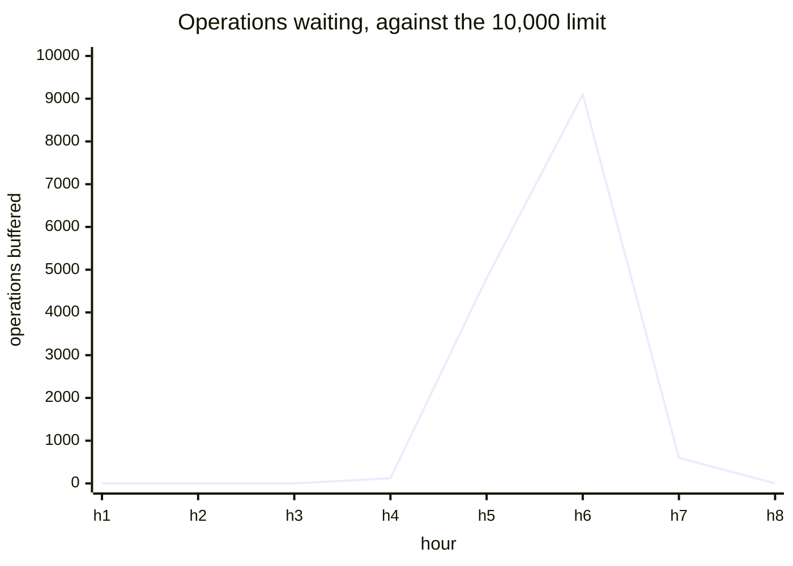
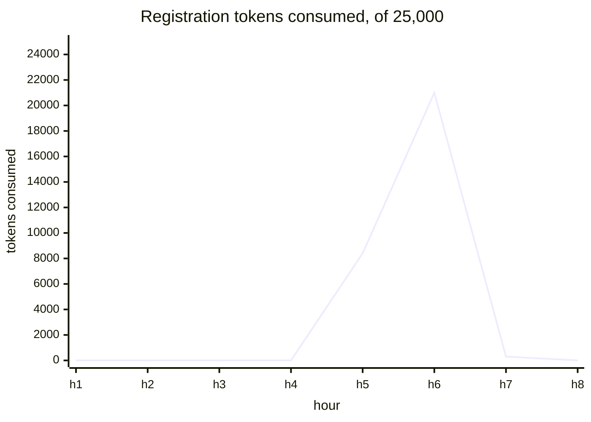
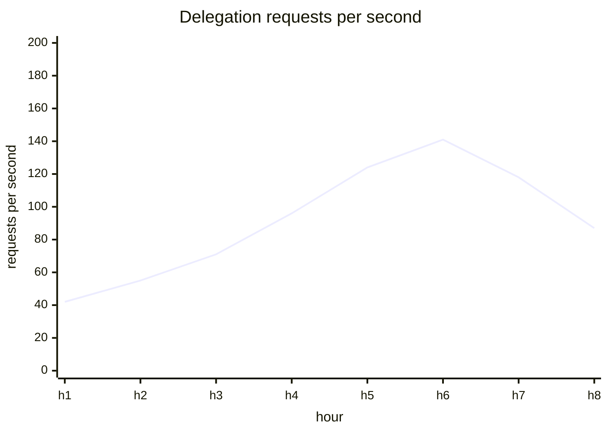
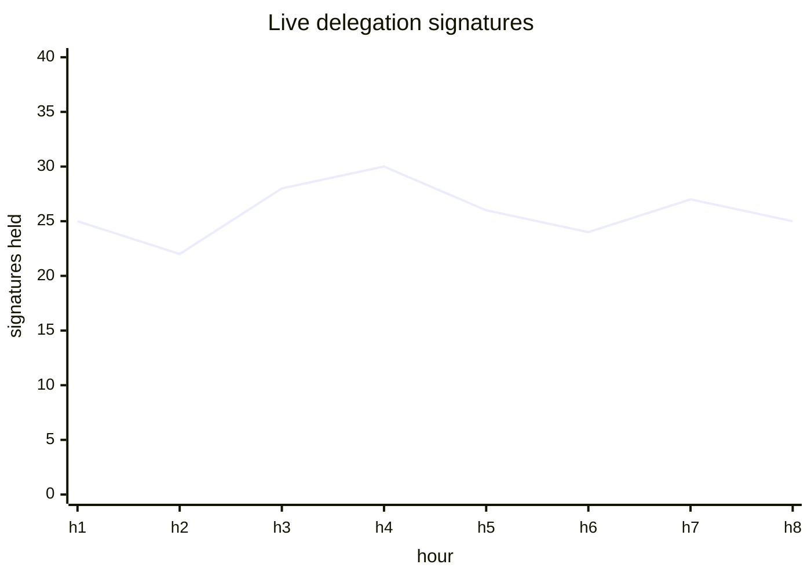

# Health

[Dashboards](README.md) · **Health** · [Usage](usage.md) · [Staying signed in](staying-signed-in.md) · [Access methods](access.md) · [Storage and capacity](storage.md)

Is anything broken right now. The page to open when something is reported, and the only page carrying alerts.

## Delegation requests refused

Users being signed out against their will. A browser whose session has gone keeps asking until its app gives up, so a rising refusal rate is the one error signal this design has.

**Alerts on this panel.**



<details>
<summary><b>Today:</b> nothing measures this</summary>

There is no error rate anywhere on the current dashboard. Nothing distinguishes a canister refusing to mint credentials from a quiet hour.

</details>

<details>
<summary><b>Sources and formula</b></summary>

Add `internet_identity_app_delegation_requests_total{outcome}`, a counter on `app_prepare_delegation`.

```promql
sum(rate(internet_identity_app_delegation_requests_total{outcome!="served"}[5m]))
```

Two constraints belong on the panel itself. `outcome` can honestly say only `expired_in_place` and `unknown`: all seven failure sites in the mint path return the same error, and revoking deletes the index entry, so a revoked session is indistinguishable from one that never existed. And `app_get_delegation` and `check_session` are queries, which cannot increment anything, so this covers the update half of the traffic.

</details>

## Archive pull staleness

How long since the archive canister last successfully pulled entries. A freshness measure with a threshold derived from the configured interval.

**Alerts on this panel.**



<details>
<summary><b>Today:</b> Time since successful archive entries fetch — correct, keep as is</summary>

Reads `ii_archive_last_successful_fetch_timestamp_seconds` from the archive canister. Correct, and one of the few panels needing no change beyond sitting on a page where it will be seen.

</details>

<details>
<summary><b>Sources and formula</b></summary>

No source change.

```promql
time() - ii_archive_last_successful_fetch_timestamp_seconds
```

</details>

## Operations waiting for the archive

Queue depth: operation records II has written that the archive has not pulled yet. The earliest sign of the archive falling behind.



<details>
<summary><b>Today:</b> Number of Buffered Archive Entries — correct, but the threshold is invisible</summary>

Plots `internet_identity_buffered_archive_entries`, turning red past 5,000. Live: 0, against a configured buffer limit of 10,000. So the threshold is half the limit, which is a reasonable place to warn and impossible to tell from the panel.

The wording also hides the meaning. A "buffered entry" is one operation record written by II and not yet pulled by the archive, so the number is a queue depth.

</details>

<details>
<summary><b>Sources and formula</b></summary>

Add to the query `internet_identity_archive_config_entries_buffer_limit`, which is already published and which the panel does not read.

```promql
internet_identity_buffered_archive_entries
internet_identity_archive_config_entries_buffer_limit
```

Plotting the limit alongside makes the threshold explain itself instead of living in the panel's colour config.

</details>

## Registrations consumed against the throttle

How much of the registration allowance has been used. Zero is the resting state, so any movement is the abuse signal.



<details>
<summary><b>Today:</b> Registration Rate Limit Burst Reserve — correct and unreadable</summary>

Plots `internet_identity_register_rate_limit_current_tokens` directly. Live it reads 24,999 of a maximum of 25,000, so the value sits at the top of its range forever and the only visible feature is a one-token dip — which is in fact the entire signal.

"Burst reserve" also names the token bucket rather than the question. What a reader wants is how many registrations are still allowed before the limiter throttles.

</details>

<details>
<summary><b>Sources and formula</b></summary>

Add to the query `internet_identity_register_rate_limit_max_tokens`, already published and not read today.

```promql
internet_identity_register_rate_limit_max_tokens
  - internet_identity_register_rate_limit_current_tokens
```

Same data, inverted, so the resting state is a flat zero and a burst is the deviation rather than a notch in a ceiling.

</details>

## Delegation minting load

Requests per second the canister is minting credentials for. A capacity number: how close it is to the load it can serve.



<details>
<summary><b>Today:</b> nothing measures this</summary>

No panel shows request load. `Logins per Hour` is the closest, and it counts sign-in ceremonies rather than the credential traffic that follows them.

</details>

<details>
<summary><b>Sources and formula</b></summary>

Uses `internet_identity_app_delegation_requests_total{outcome}`, the same counter as the refusals panel.

```promql
sum(rate(internet_identity_app_delegation_requests_total{outcome="served"}[5m]))
```

Deliberately not divided by active sign-ins. That ratio moves when an app changes how often it polls, when the credential lifetime changes, and when somebody leaves a tab open — none of which is a fact about the product, and all of which invite it being read as engagement. Requests are a proxy for cost rather than cost.

</details>

## Live delegation signatures

Delegation signatures the canister is currently holding in its certified map. A canary whose normal range sessions will move.



<details>
<summary><b>Today:</b> Signature map size — correct, misnamed</summary>

Plots `avg_over_time(internet_identity_signature_count[$__interval])`. Live: 25, ranging 5 to 30, because a signature lives for its 30-minute default expiry. "Signature map" is the internal structure rather than the thing being counted.

It is also one of the five panels still on the deprecated Angular `graph` type.

</details>

<details>
<summary><b>Sources and formula</b></summary>

No source change.

```promql
avg_over_time(internet_identity_signature_count[$__interval])
```

A warning belongs on it. An app delegation lives 5 minutes and is replaced while an app is open, so the same users will produce more signatures each held a sixth as long. Whether the count rises or falls depends on churn against lifetime, so any threshold here needs re-deriving once sessions carry traffic rather than being assumed to hold.

</details>

## Stored counts rebuilt after drifting

The account counter exists so a limit can be checked without reading every row, and it can drift. Zero is correct; movement is a bug.

A ticket rather than a page, because the canister repairs it itself.

```mermaid
xychart-beta
  title "Count rebuilds, expected zero"
  x-axis "week" [w1, w2, w3, w4, w5, w6, w7, w8]
  y-axis "rebuilds" 0 --> 10
  line [0, 0, 0, 0, 3, 0, 0, 0]
```

<details>
<summary><b>Today:</b> published but never plotted</summary>

`internet_identity_account_counter_discrepancy_count` is already on the endpoint and reads 0 live. No panel reads it, so a drift would be repaired silently and nobody would learn that it happened.

</details>

<details>
<summary><b>Sources and formula</b></summary>

No source change; the family already exists.

```promql
increase(internet_identity_account_counter_discrepancy_count[1d])
```

There is deliberately no session equivalent. Session counts drift by design, because expiry removes a session with no write to observe — see [what the canister can observe](README.md) on the index.

</details>
