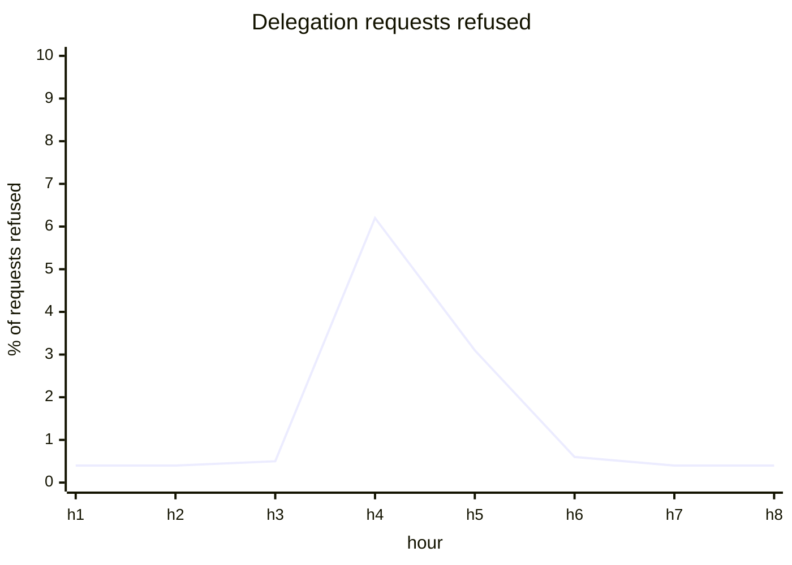
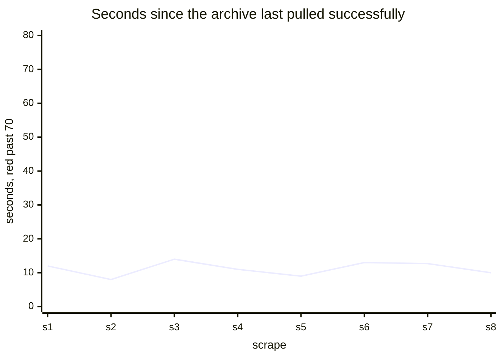
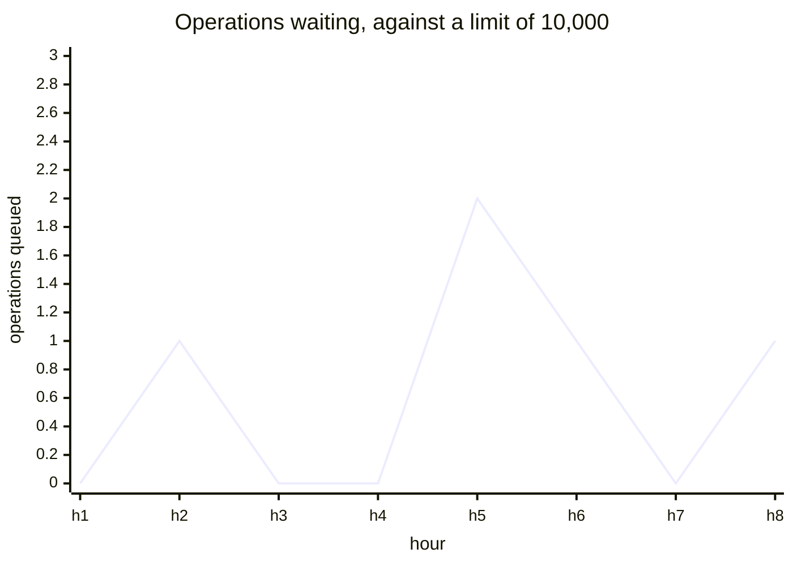
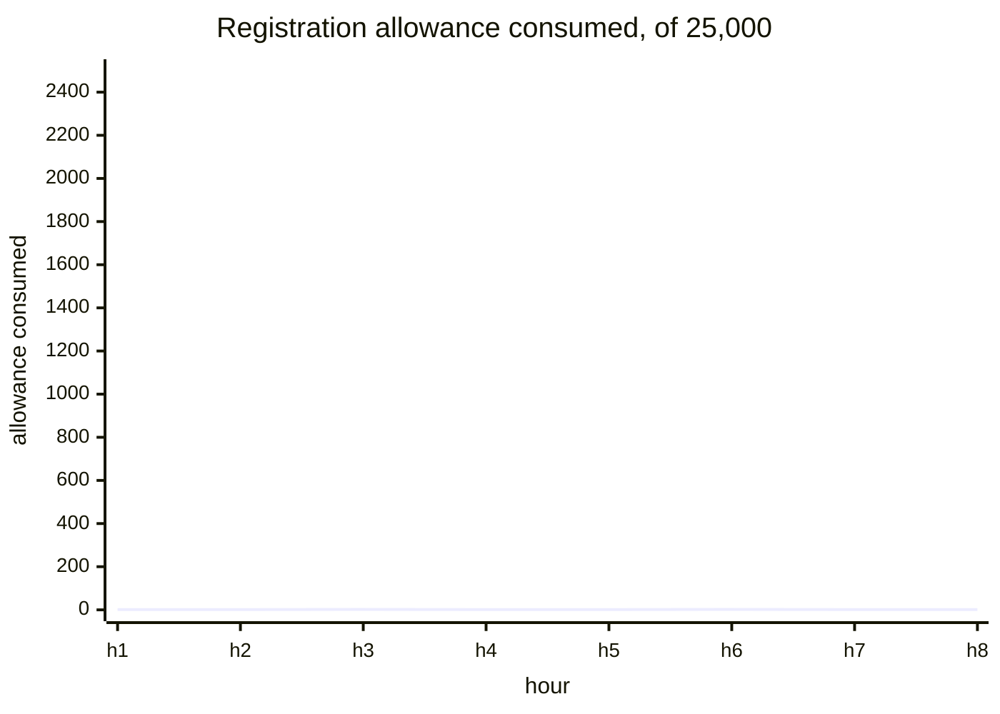
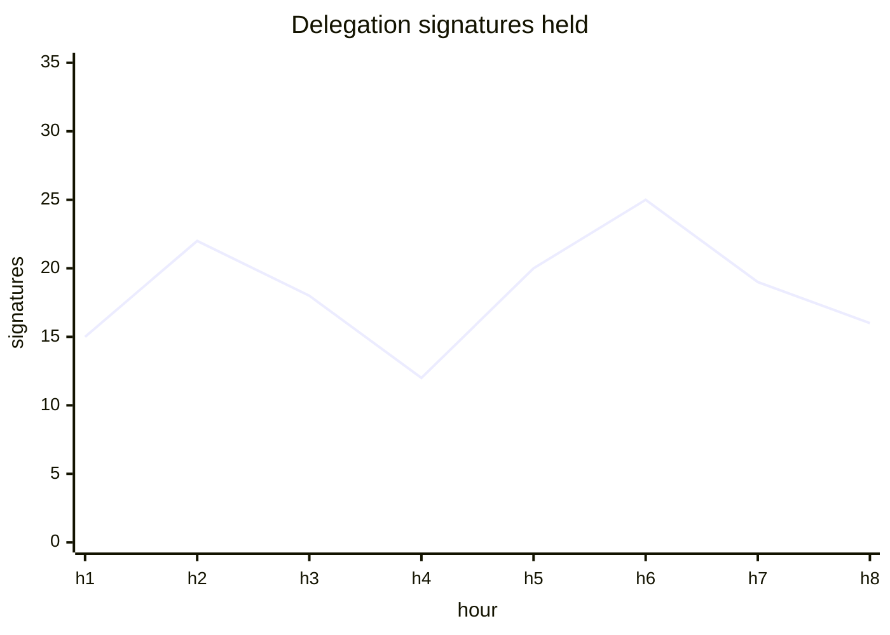

# Health

[Dashboards](README.md) · **Health** · [Adoption and usage](usage.md) · [Apps](apps.md) · [Storage and capacity](storage.md)

Is anything broken right now. This is the page to open when something is reported, and the only page carrying alerts. Reasoning for each panel is in [metrics.md](../metrics.md).

## Delegation requests refused · new · alerts

`sum(rate(internet_identity_app_delegation_requests_total{outcome!="served"}[5m])) / sum(rate(internet_identity_app_delegation_requests_total[5m]))`

The only error rate the design has. A browser whose sign-in has gone keeps asking until its app gives up, so a rise here is users being signed out against their will. Covers the update half of the traffic: the read paths are queries and cannot count.



## Archive pull staleness · keep · alerts

`time() - ii_archive_last_successful_fetch_timestamp_seconds`

How long since the archive last pulled operations out of II, against a 15-second polling interval. Red past 70. Live: 12.7 seconds.



## Operations waiting for the archive · fix

`internet_identity_buffered_archive_entries` against `internet_identity_archive_config_entries_buffer_limit`

Queue depth of operations II has recorded and the archive has not yet taken. The limit is 10,000 and is published, so it belongs on the panel rather than in the code. Live: 0.



## Registrations consumed against the throttle · fix

`internet_identity_register_rate_limit_max_tokens - internet_identity_register_rate_limit_current_tokens`

Inverted from the current panel, which plots tokens remaining and therefore sits at 24,999 of 25,000 forever with a one-token dip as its only visible feature. Consumed puts the resting state at zero, so a burst is the deviation.



## Live delegation signatures · keep

`avg_over_time(internet_identity_signature_count[$__interval])`

Signatures the canister is currently holding. Live: 25, because a delegation signature lives for its 30-minute default expiry.

Sessions will move this range. An app delegation lives 5 minutes and is replaced while an app is open, so the same users produce more signatures held a sixth as long. Any threshold needs re-deriving once sessions carry traffic rather than being assumed to hold.



## Stored counts rebuilt after drifting · keep

`increase(internet_identity_account_counter_discrepancy_count[1d])`

The account counter exists so a limit can be checked without reading every row, and it can drift. Zero is correct; movement is a bug, and a ticket rather than a page, because the canister repairs it itself. Live: 0.

There is deliberately no session equivalent: session counts drift by design, since expiry removes a sign-in with no write to observe.

```mermaid
xychart-beta
  title "Count rebuilds, expected zero"
  x-axis "week" [w1, w2, w3, w4, w5, w6, w7, w8]
  y-axis "rebuilds" 0 --> 10
  line [0, 0, 0, 0, 3, 0, 0, 0]
```
