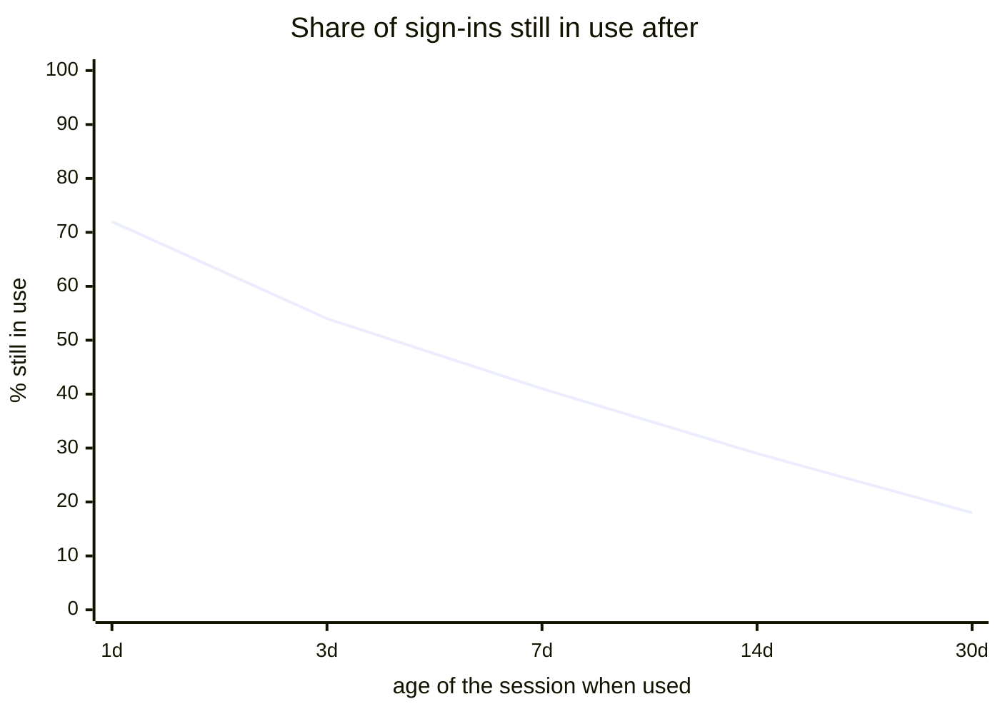
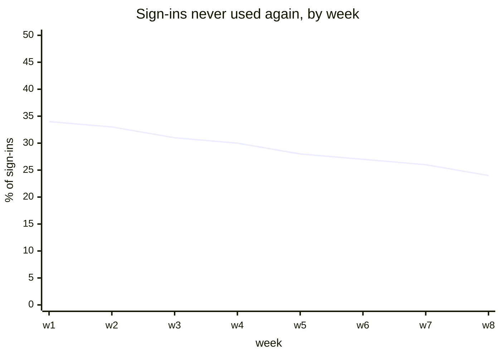
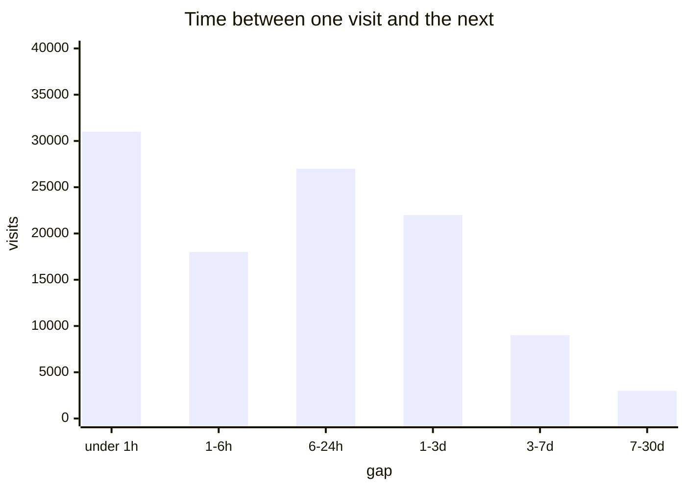
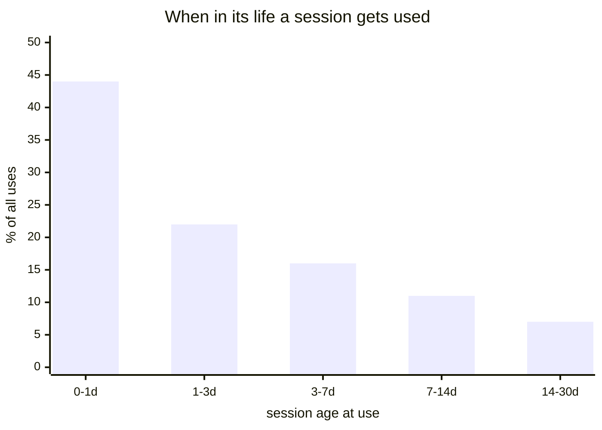
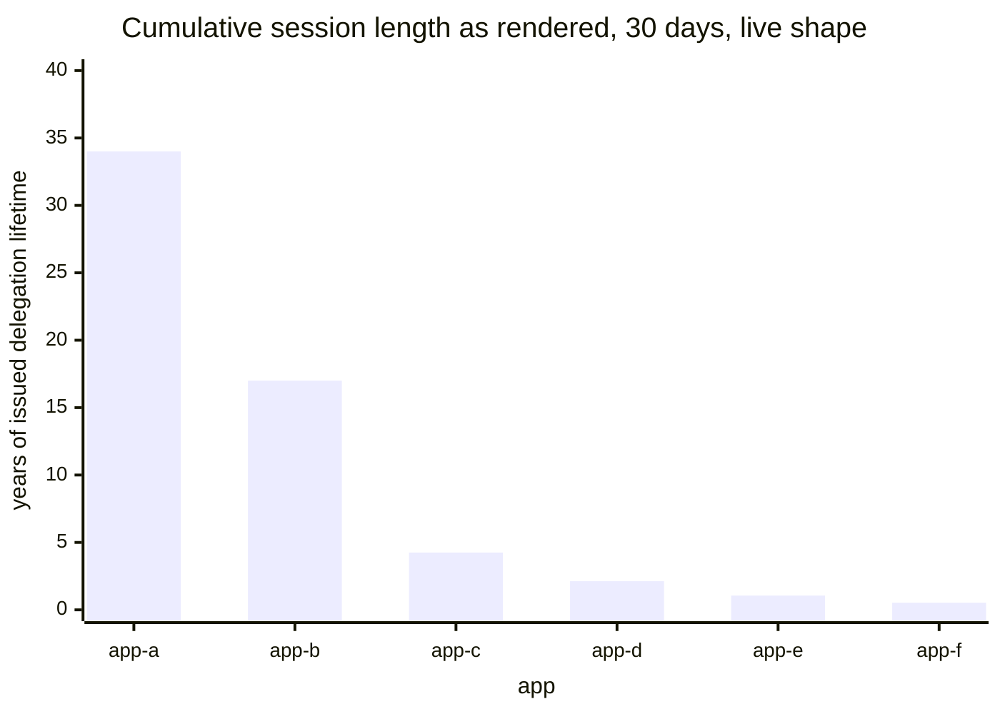
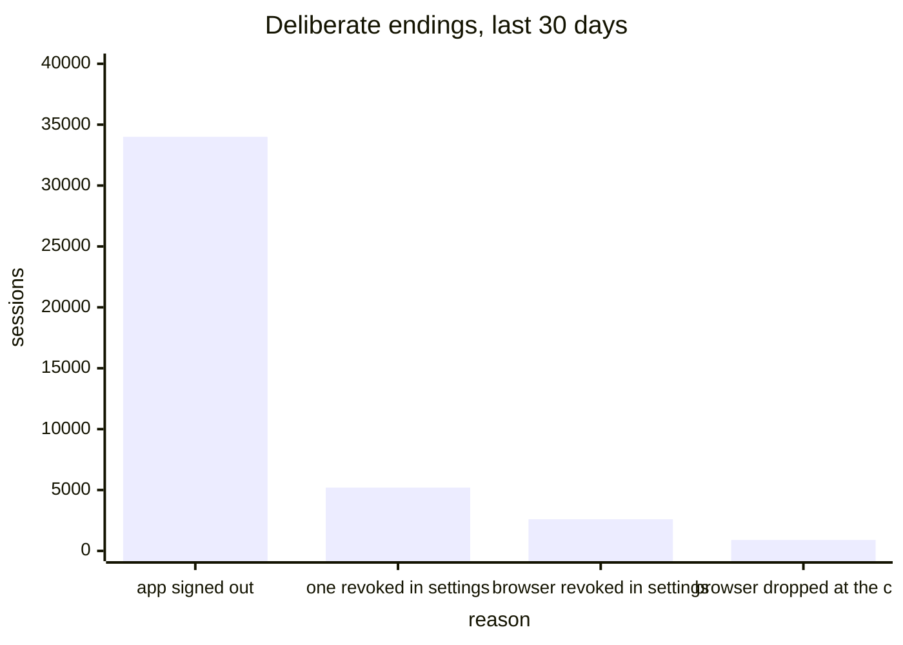
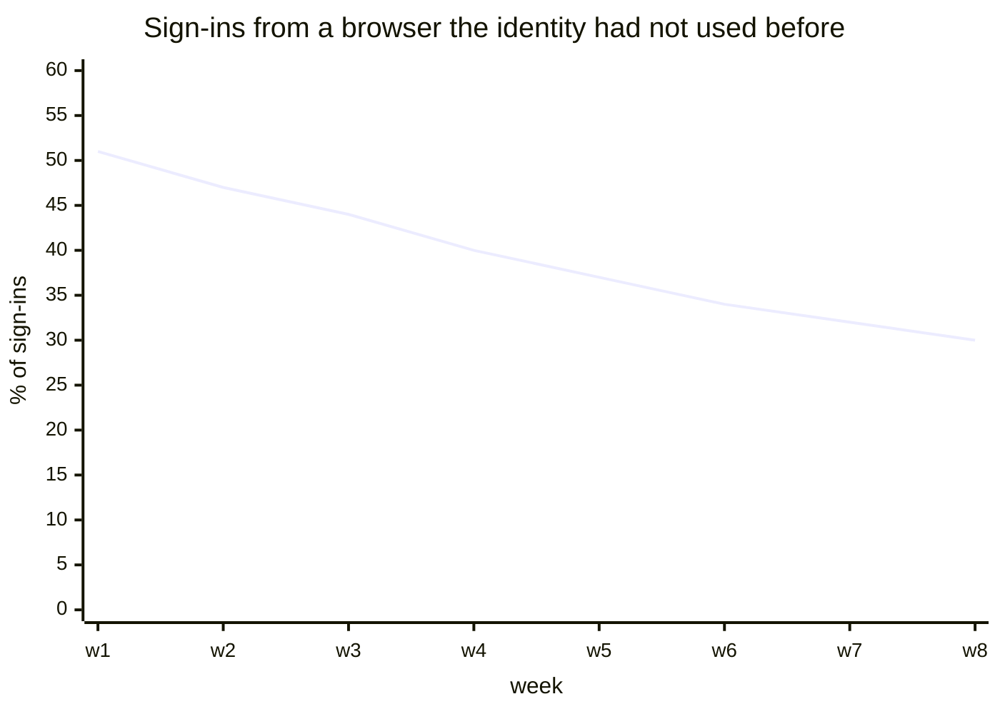
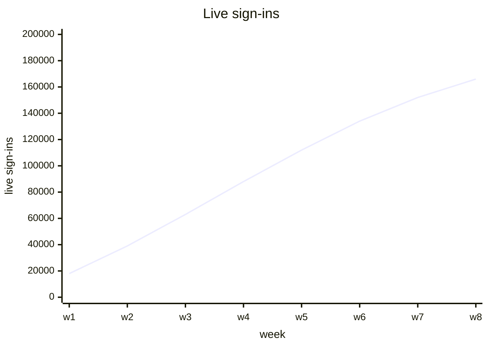
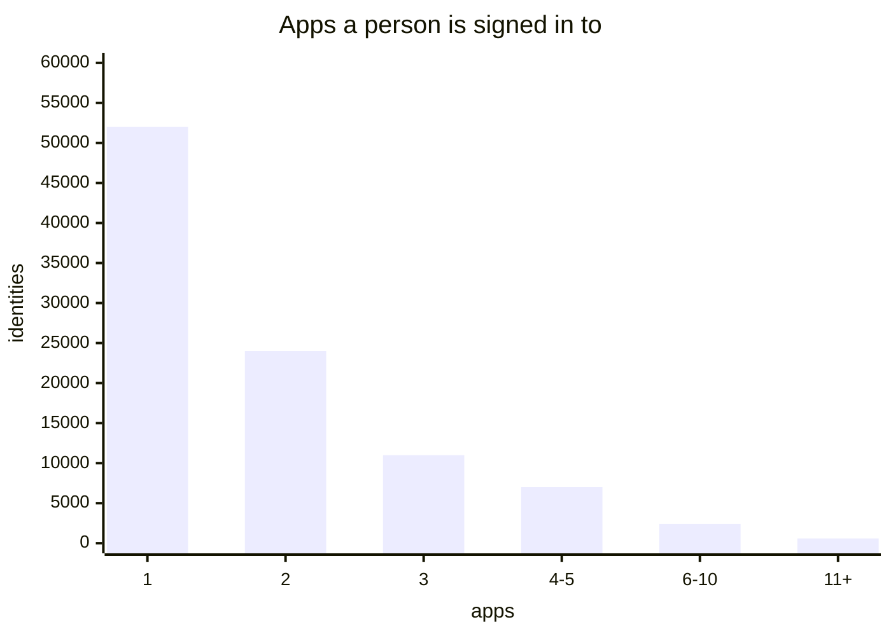
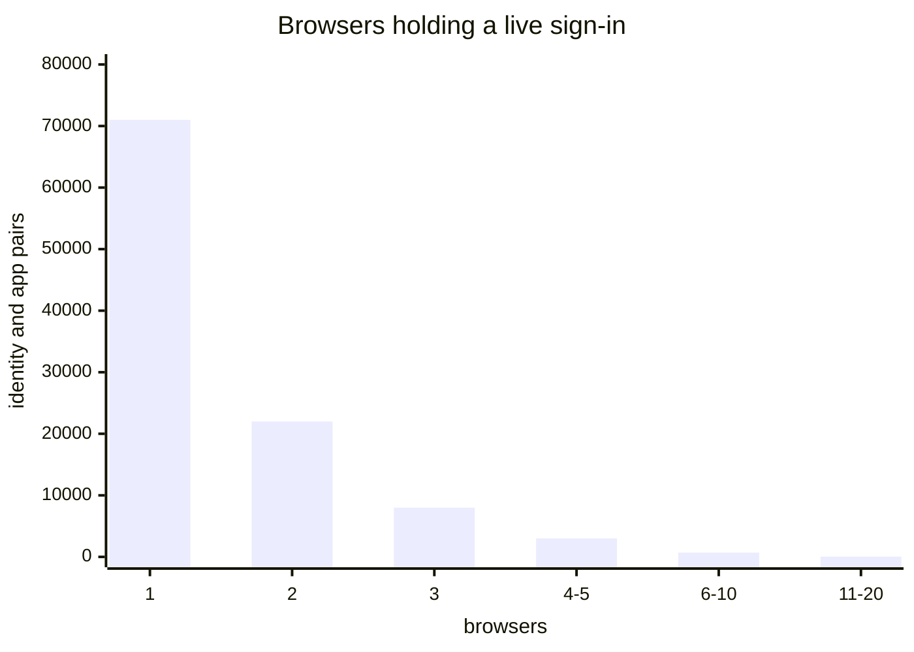

# Staying signed in

[Dashboards](README.md) · [Health](health.md) · [Usage](usage.md) · **Staying signed in** · [Access methods](access.md) · [Storage and capacity](storage.md)

Whether people come back, how often, and how much of what they were granted they use.

A session is a different kind of thing from a sign-in. A sign-in is a moment; a session is a standing relationship between one browser, one identity and one app. None of these questions could be asked before, because every visit issued a fresh delegation and the canister could not tell a returning person from a first-time one.

Every panel here is built from session creation and session use, never from a session ending — [what the canister can observe](README.md) on the index explains why that constraint decides the whole page.

## Do people come back

The retention curve, and the most valuable thing sessions make measurable. A use is a return, and until sessions existed there was nothing to return to.

Only the canister can draw it: a relationship spanning apps is invisible from inside any one of them.



<details>
<summary><b>Today:</b> nothing measures this, and nothing could</summary>

Before sessions, every visit issued a fresh delegation with no record tying it to the last one. There was no object whose survival could be measured.

</details>

<details>
<summary><b>Sources and formula</b></summary>

Add `internet_identity_session_uses_total{age}`, a counter incremented in `stamp_session_refresh` and labelled by how old the session was at that moment. The age is `now - created_at`, both already in hand.

```promql
sum(rate(internet_identity_session_uses_total{age="7d+"}[7d]))
  / sum(rate(internet_identity_sign_ins_total[7d]))
```

**Read it as a rate ratio, not a cohort.** It compares returns happening now against sign-ins happening now, so it reads correctly while sign-in volume is roughly stable and flatters retention while volume falls. That caveat belongs on the panel. Following real cohorts instead would need the sessions to finish first, and finishing is what the canister cannot see.

Keep `dapp` off this counter. Age buckets multiplied by apps is a cardinality problem for a number read in aggregate.

</details>

## Sign-ins that were never used

The failure staying signed in exists to remove. Somebody who signs in and never comes back got nothing from the session they were given.



<details>
<summary><b>Today:</b> nothing measures this</summary>

Nothing distinguishes a sign-in that led somewhere from one that led nowhere, so the most basic failure of the feature would be invisible.

</details>

<details>
<summary><b>Sources and formula</b></summary>

Add `internet_identity_session_first_uses_total`, incremented where `last_refreshed` goes from `None` to `Some`.

```promql
1 - sum(rate(internet_identity_session_first_uses_total[7d]))
  / sum(rate(internet_identity_sign_ins_total[7d]))
```

The transition is already in the record, so this costs one increment on a branch the code takes anyway, and needs nothing observed at removal.

Worth watching per app as well as overall: one app driving the number means something different from every app drifting up together.

</details>

## How long between visits

How often somebody comes back, rather than whether they do — the time between one use and the next.



<details>
<summary><b>Today:</b> nothing measures this</summary>

An earlier draft of this dashboard proposed delegation requests per active sign-in per day in its place. That number moved when an app changed its polling or somebody left a tab open, so it measured how long tabs stay open and read as engagement. It is not on any page now; the raw request rate lives on [Health](health.md#delegation-minting-load) as a capacity number instead.

</details>

<details>
<summary><b>Sources and formula</b></summary>

Add `internet_identity_session_gap_seconds`, a histogram observed in `stamp_session_refresh` as `now - last_refreshed`.

```promql
histogram_quantile(0.5, sum by (le) (rate(internet_identity_session_gap_seconds_bucket[7d])))
```

The previous stamp is in memory when the new one is written, so the gap is a subtraction on a path already running. Sessions being used for the first time have no previous stamp and contribute nothing here; the panel above counts them instead.

</details>

## How much of the term gets used

Where in a session's thirty days the use actually happens. If almost nothing lands past the first week, the term is far longer than the behaviour it serves.

This is the number to bring to any argument about changing it.



<details>
<summary><b>Today:</b> Top 10 dapps by cumulative session length (24h) and (30d) — measure the opposite thing</summary>

Both plot `internet_identity_prepare_delegation_session_seconds{dapp, window, ii_origin}` with `unit: s` on a log-2 axis. The family sums the lifetimes delegations were _issued for_, fixed at sign-in and capped at 30 days, so it says nothing about time spent signed in.

Live, the top app over 24 hours reads 12,960,000 seconds from 5 sign-ins — exactly 30 days each, because that is what the app requested. It is a sign-in count multiplied by a constant, which is why Grafana renders it in years.



Both are deleted. An earlier draft replaced them with a lifetime histogram observed when a session was removed; that was wrong for a subtler reason. An abandoned session is never removed at all, so such a histogram would be drawn from sessions somebody came back to, and would report longer lives the more people abandoned.

</details>

<details>
<summary><b>Sources and formula</b></summary>

Uses `internet_identity_session_uses_total{age}` from the first panel, read as a profile rather than a ratio. Remove `internet_identity_prepare_delegation_session_seconds`.

```promql
sum by (age) (rate(internet_identity_session_uses_total[30d]))
```

</details>

## Deliberate endings

Whether the revocation this design promises is ever exercised. If the two settings paths stay near zero, its central promise is going unused and nothing else would say so.



<details>
<summary><b>Today:</b> nothing measures this</summary>

Nothing counts revocations, so there is no way to tell whether the settings screen is used.

</details>

<details>
<summary><b>Sources and formula</b></summary>

Add `internet_identity_sessions_revoked_total{reason}`, incremented at each of the four call sites that delete a session on purpose: `app_revoke_session`, `revoke_account_session`, `revoke_device_sessions`, and the internal call that drops a browser when the registry passes twenty. The last two share a storage function, so the label is set by the caller that knows which happened.

```promql
sum by (reason) (increase(internet_identity_sessions_revoked_total[30d]))
```

**Expiry is deliberately not a slice of this.** It writes nothing, so a bar for it would show whatever the opportunistic cleanup in `stamp_session_refresh` happened to catch, which is worse than showing nothing. The title says deliberate for that reason.

</details>

## New and known browsers

Whether the ceremony ran for a browser the identity had never used, or one already in its registry. The closest honest thing to new against returning.



<details>
<summary><b>Today:</b> nothing measures this, though the code already knows</summary>

`prepare_account_session` computes `known_device` and records a `RegisterSessionDevice` operation only when the browser is new to the identity. The branch exists; nothing counts it.

Note what this is not. A sign-in never reuses a session, so a repeat ceremony on a known browser does not mean a returning user — it means the previous session ended, or the person is signing in to something else. The browser is the part that carries history.

</details>

<details>
<summary><b>Sources and formula</b></summary>

Add a `browser` label to `internet_identity_sign_ins_total`, set from the `known_device` value the ceremony already computes.

```promql
sum by (browser) (rate(internet_identity_sign_ins_total[1d])) * 86400
```

</details>

## Sign-ins live right now

The standing base: how many relationships exist at this moment. Every other panel here is a flow, and a flow cannot say how much of the user base holds a live relationship with anything.

It is a stock, so it falls when people leave as well as rising when they arrive, and it is the only panel that would show a mass expiry as it happened.



<details>
<summary><b>Today:</b> nothing measures this, and it needs a row walk</summary>

Nothing on the endpoint can answer it, for the reason on the index: expiry writes nothing, so a live count cannot be maintained incrementally. It needs something that walks the session rows.

On the page because it is wanted, not because it is cheap.

</details>

<details>
<summary><b>Sources and formula</b></summary>

Add `internet_identity_live_sessions`, a gauge, which needs a pass over the session rows — a timer sweep with a cursor stored across executions, or making expiry an event so a counter can follow it. That one decision also unlocks the two panels below.

```promql
sum(internet_identity_live_sessions)
```

</details>

## Apps per person

Whether II is an identity layer or a login button. One app per person means the identity is incidental to the one place it is used; a spread means it is being reused, which is the whole premise.

A distribution rather than an average, because the average of a long tail describes nobody.



<details>
<summary><b>Today:</b> nothing measures this</summary>

The dashboard counts identities and counts apps, but never the relationship between them, so the central claim about II has never been measured.

Same prerequisite as the panel above.

</details>

<details>
<summary><b>Sources and formula</b></summary>

A by-product of the same row walk, bucketed into `le` labels.

```promql
sum by (le) (internet_identity_live_sessions_per_identity_bucket)
```

</details>

## Browsers per person, per app

What the session-device registry exists for, and currently unmeasured entirely. One browser is somebody on a single machine; several is the case the shared-session work was built to serve.

The cap at twenty only means something if anybody approaches it.



<details>
<summary><b>Today:</b> nothing measures this</summary>

The registry and its cap are entirely unobserved. [Deliberate endings](#deliberate-endings) shows when the cap bites, since a browser dropped at the cap is one of its four bars, but nothing shows the distribution it bites into.

</details>

<details>
<summary><b>Sources and formula</b></summary>

The same row walk again, bucketed per identity and app pair.

```promql
sum by (le) (internet_identity_session_devices_per_identity_bucket)
```

</details>
