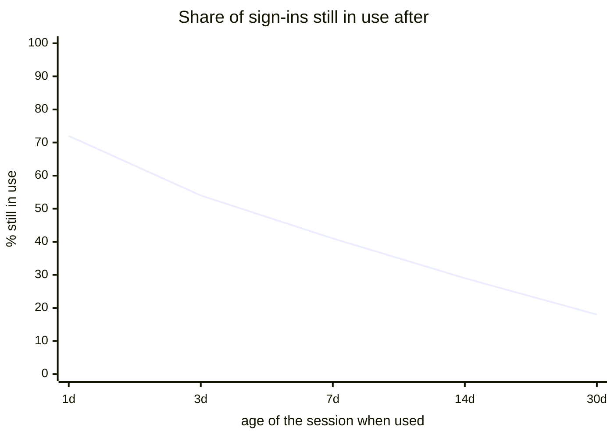
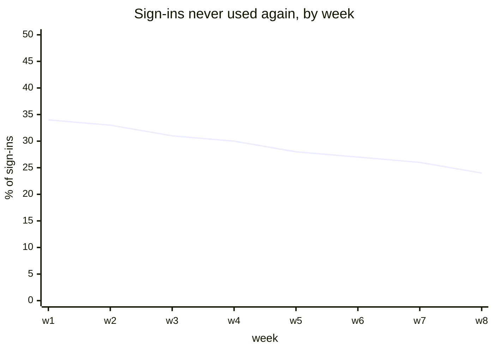
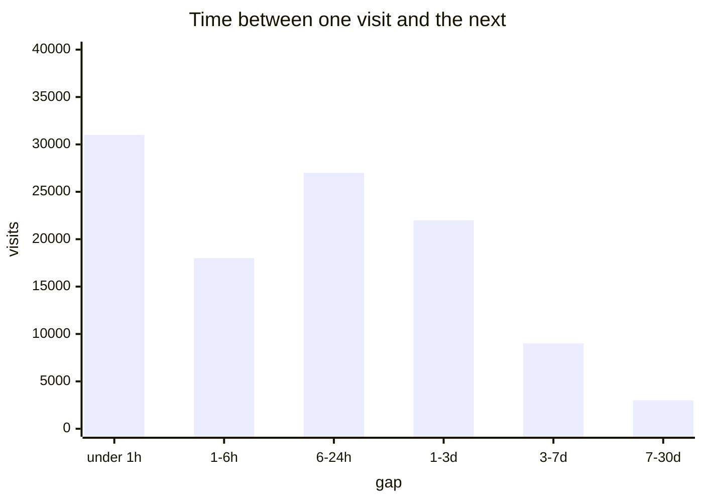
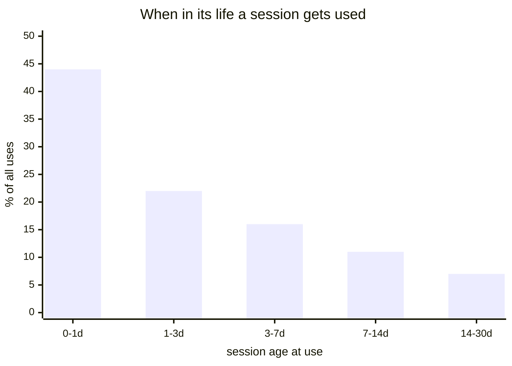
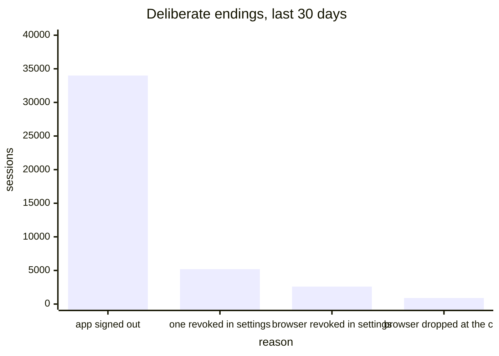
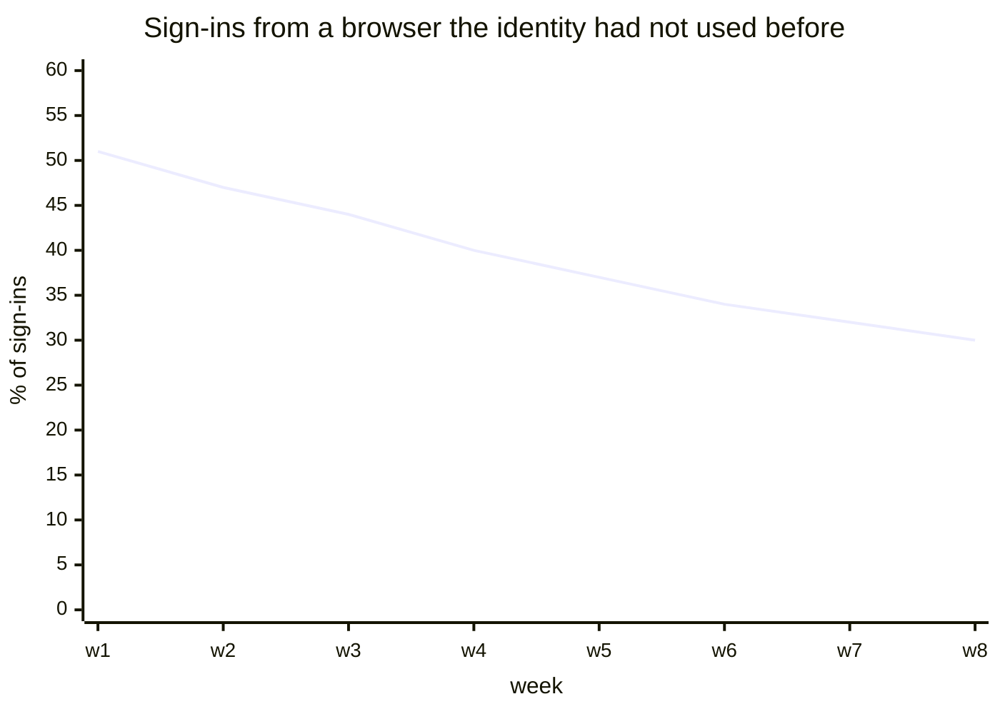
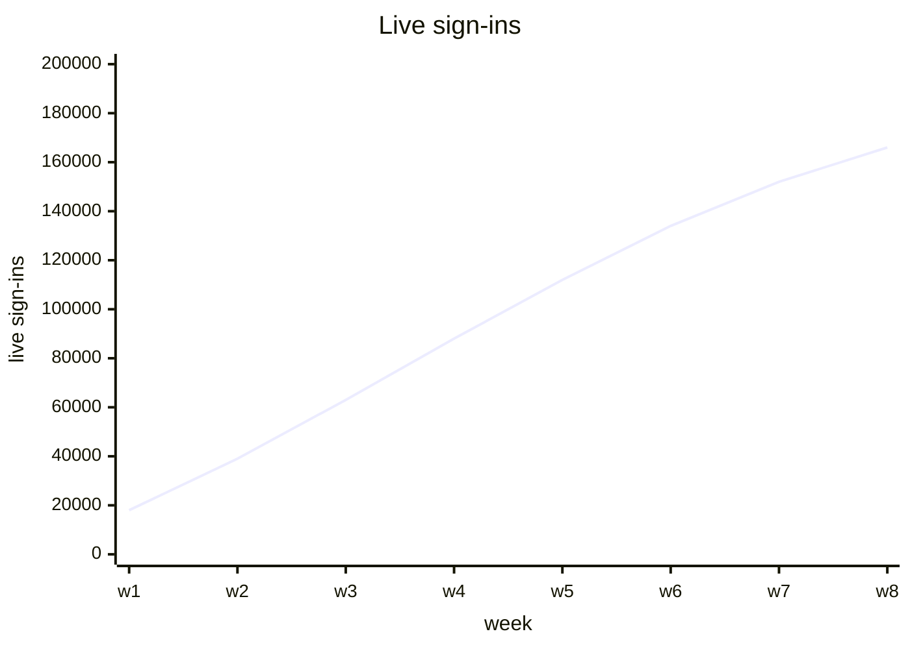
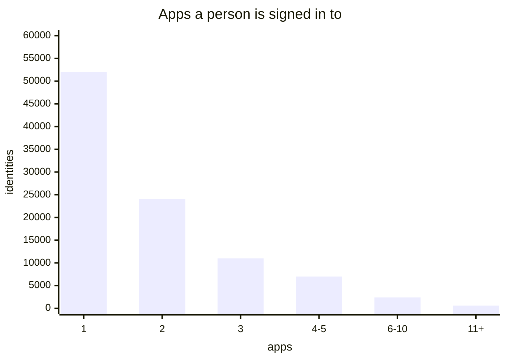
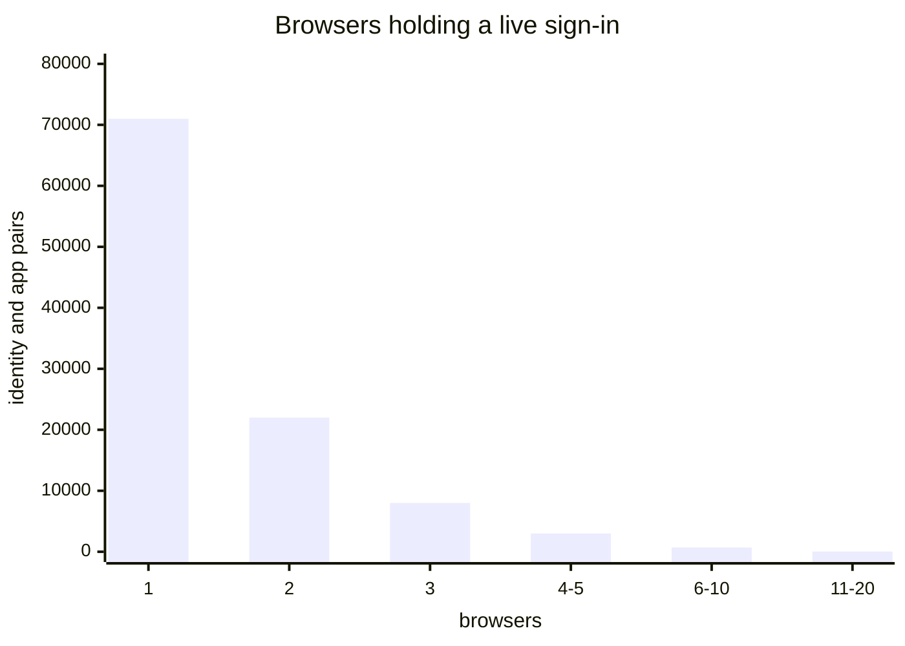

# Staying signed in

[Dashboards](README.md) · [Health](health.md) · [Usage](usage.md) · **Staying signed in** · [Access methods](access.md) · [Storage and capacity](storage.md)

Whether people come back, how often, and how much of what they were granted they use.

A session is a different kind of thing from a sign-in. A sign-in is a moment; a session is a standing relationship between one browser, one identity and one app. None of these questions could be asked before, because every visit issued a fresh delegation and the canister could not tell a returning person from a first-time one.

## What the canister can actually see

Every panel below is built on this, so it is worth stating once rather than repeating it as a caveat nine times.

**Creation is fully observable.** `prepare_account_session` always calls `create_session`. There is no branch that reuses an existing session, so one ceremony is always exactly one new session, and a person signing in from three browsers creates three. A count of sign-ins is not a count of people.

**Use is fully observable, and carries more than it looks.** `stamp_session_refresh` holds the session's `created_at`, its previous `last_refreshed`, and the current time, all in hand before it overwrites anything. So every use knows how old its relationship is, and how long it had been since the last one, for free. `last_refreshed` is `None` until the first use, which makes "was this session ever used at all" an observable transition rather than something to infer.

**Ending is mostly invisible.** A session expiring writes nothing anywhere — the storage comment is explicit that "a session can expire with no write anywhere, so the count drifts upwards". Two things clean up after it, and neither is a general sweep. `reclaim_sessions` runs only once an identity holds 500 sessions, which is almost nobody. And `stamp_session_refresh` drops expired sessions from the row it was already rewriting, which only reaches apps somebody still uses.

That last point is why there is no panel here for how long the average session lasted, and no split of granted against used against wasted. Both can only be observed where a session is removed, and removal is biased towards relationships that are still alive. The panels below are built from creation and use instead, which are complete.

## Do people come back

`sum(rate(internet_identity_session_uses_total{age="7d+"}[7d])) / sum(rate(internet_identity_sign_ins_total[7d]))`

The retention curve, and the most valuable thing this data makes possible. Each use is bucketed by how old its session was at that moment, so a use landing in the seven-day bucket is somebody returning a week after they signed in.

Only the canister can draw this. Plausible sees one site at a time, and a relationship is invisible from inside the app holding it.

Read it as a rate ratio, not a cohort: it compares returns happening now against sign-ins happening now, so it reads correctly while sign-in volume is roughly stable and flatters retention while volume falls.

## Sign-ins that were never used

`1 - sum(rate(internet_identity_session_first_uses_total[7d])) / sum(rate(internet_identity_sign_ins_total[7d]))`

The shadow of the panel above, and the failure staying signed in exists to remove. Somebody who signs in and never comes back got nothing from the session they were given.

It costs nothing to know. `last_refreshed` is `None` until the first use, so counting that one transition counts exactly the sessions that were ever used, and everything else is the remainder.

## How long between visits

`histogram_quantile(0.5, sum by (le) (rate(internet_identity_session_gap_seconds_bucket[7d])))`

How often somebody comes back, measured as the time between one use and the next. The previous `last_refreshed` is already in hand when the new one is written, so the gap is a subtraction on a path that is running anyway.

This is the honest version of the question I previously wrote as delegation requests per active sign-in per day. That number moved when an app changed its polling or somebody left a tab open; this one moves when people change how often they show up.

## How much of the term gets used

`sum by (age) (rate(internet_identity_session_uses_total[30d]))`

The same buckets as the retention panel, read a different way: as a profile of where in a session's thirty days the use actually happens. If almost nothing lands past the first week, the term is far longer than the behaviour it serves, and that is the number to bring to any argument about changing it.

It replaces the granted-against-used-against-wasted comparison I first drafted, which would have had to be measured where sessions are removed, and so would have been drawn from a biased sample.

## Deliberate endings

`sum by (reason) (increase(internet_identity_sessions_revoked_total[30d]))`

The four paths that actually delete a session on purpose: an app signing its own session out, somebody revoking one session in settings, somebody revoking a whole browser in settings, and the browser registry dropping a browser when an identity passes twenty. Each is a distinct call site, so each can set its own label honestly.

Expiry is deliberately not a slice of this panel. It writes nothing, so a bar for it would either be absent or be whatever the opportunistic cleanup happened to catch, which is worse than absent. The title says deliberate for that reason.

This is also the only measure of whether the settings screen is used at all. If the two settings paths stay near zero, the design's central promise is going unexercised.

## New and known browsers

`sum by (browser) (rate(internet_identity_sign_ins_total[1d])) * 86400`

Whether the ceremony ran for a browser the identity had never used or one already in its registry. The distinction exists in the code already: `prepare_account_session` computes `known_device` and records a `RegisterSessionDevice` operation only when the browser is new.

It is the closest honest thing to new-versus-returning. A sign-in never reuses a session, so a repeat ceremony on a known browser means the previous session ended or the person is signing in to something else — not that they are new.

## Sign-ins live right now

`sum(internet_identity_live_sessions)`

The standing base: how many relationships exist at this moment. Every other panel here is a flow, and a flow cannot say how much of the user base holds a live relationship with anything.

Nothing on the endpoint can answer this today, and the reason is the one above: expiry writes nothing, so a live count cannot be maintained incrementally. It needs something that walks the rows.

## Apps per person

`sum by (le) (internet_identity_live_sessions_per_identity_bucket)`

Whether II is an identity layer or a login button. One app per person means the identity is incidental to the one place it is used; a spread means it is being reused, which is the whole premise.

A distribution rather than an average, because the average of a long tail describes nobody. Same prerequisite as the panel above.

## Browsers per person, per app

`sum by (le) (internet_identity_session_devices_per_identity_bucket)`

What the session-device registry exists for, and currently unmeasured entirely. One browser is somebody on a single machine; several is the case the shared-session work was built to serve, and the cap at twenty only means something if anybody approaches it.

The panel above it shows when the cap bites, since a browser dropped at the cap is one of its four bars.

