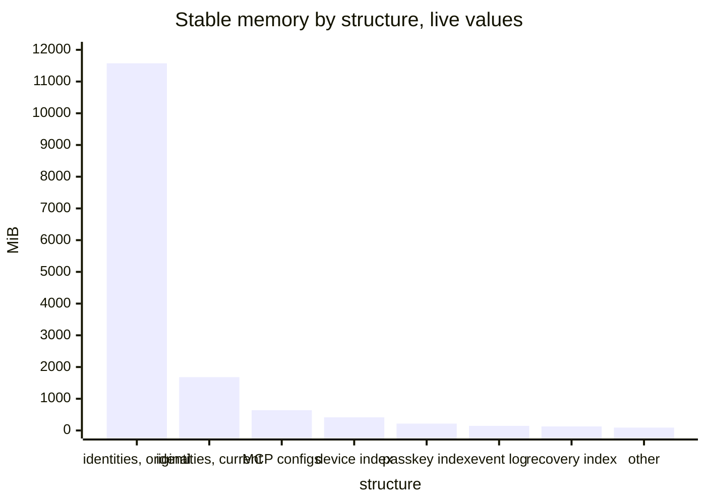
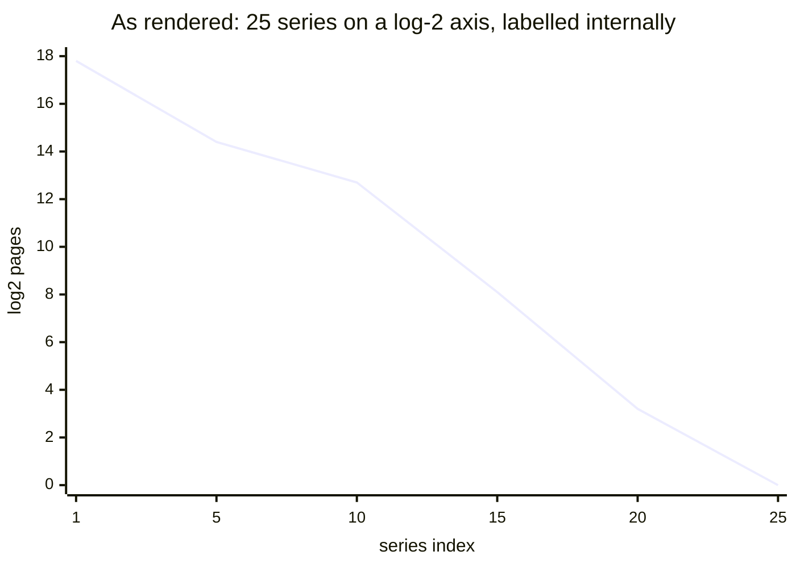
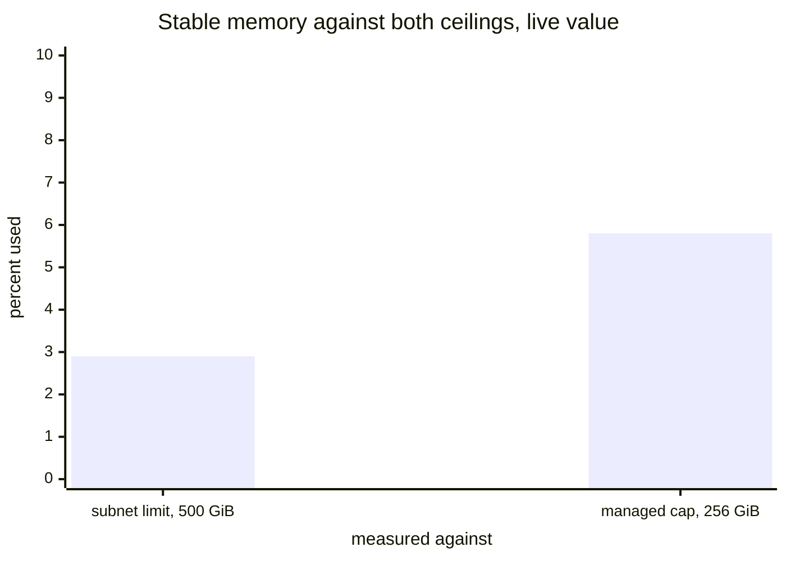
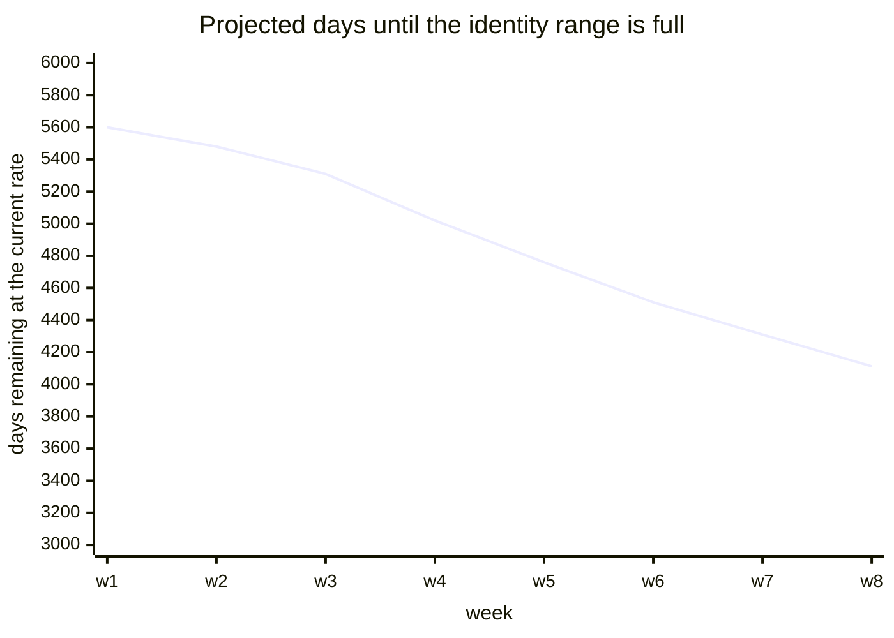
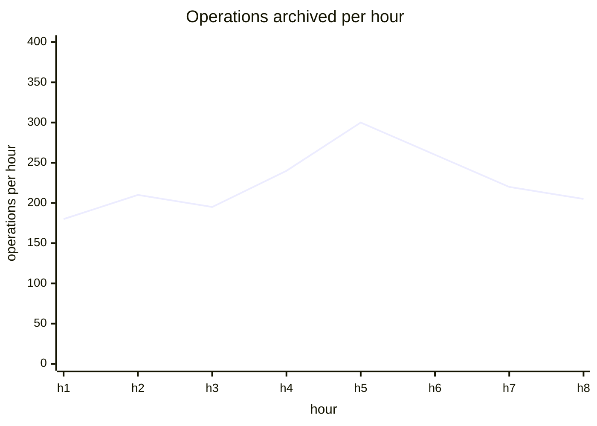
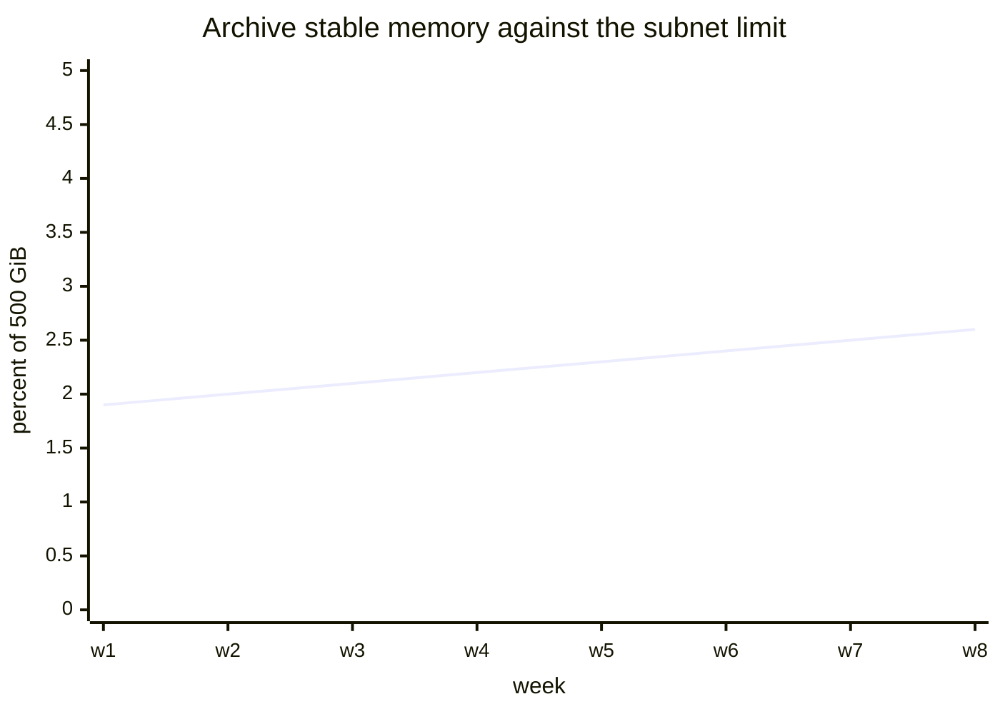
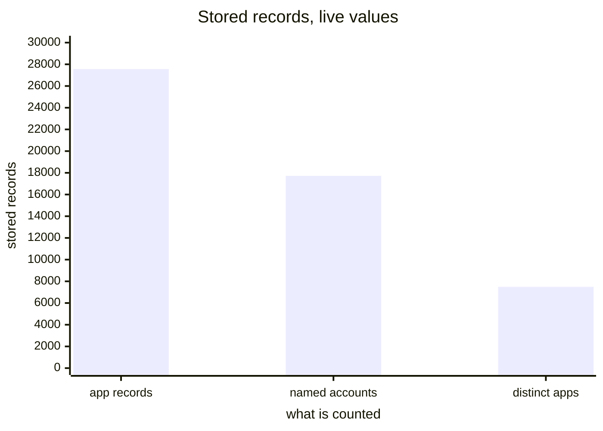

# Storage and capacity

[Dashboards](README.md) · [Health](health.md) · [Usage](usage.md) · [Staying signed in](staying-signed-in.md) · [Access methods](access.md) · **Storage and capacity**

Where the memory goes and when anything runs out. Opened rarely, and worth being right when it is.

## Stable memory by structure

Which structures hold the memory, ranked, in bytes, with labels a reader can act on.

Live, 77.6 percent of all stable memory sits in one structure, and the two identity storages are adjacent series with near-identical names. A panel that named them would make the state of that migration visible at a glance.



<details>
<summary><b>Today:</b> Internet Identity Virtual Memory Page Sizes — right data, unreadable, and missing four memories</summary>

Plots `internet_identity_virtual_memory_size_pages{memory}` as twenty-five flat lines on a log-2 axis from 1 to 262,144, labelled by internal identifier, with a legend taller than the plot. Live: 25 series, 238,574 pages, 14.6 GiB total.



Two correctness problems behind the readability one. The list feeding `memory_sizes()` is hand-maintained, and four memories are missing from it: `lookup_session_with_principal_memory`, `stable_account_counter_memory`, `stable_account_counter_discrepancy_counter_memory` and `next_application_number_memory`. The first is the session index, which grows with every session — so as sessions roll out this panel is blind to the only structure whose growth is new.

And `stable_account_counter` is published against the anchor map rather than the counter, so the series under that name is measuring something else.

</details>

<details>
<summary><b>Sources and formula</b></summary>

Change `internet_identity_virtual_memory_size_pages` to report every memory, and correct the mislabelled one.

```promql
sort_desc(internet_identity_virtual_memory_size_pages * 65536)
```

Bytes rather than pages, ranked rather than plotted over time, with each memory given a plain-language label.

The log-scale view is worth keeping as a second, explicitly labelled debugging panel: it is the right shape for spotting a structure that jumps by an order of magnitude, and the wrong shape for everything else.

</details>

## Stable memory against its ceiling

How much of the limit that actually binds has been used. Live: 241,794 pages, 14.8 GiB, which is 5.8 percent of the canister's own cap.



<details>
<summary><b>Today:</b> Stable memory usage — divides by a ceiling that does not bind</summary>

Plots `internet_identity_stable_memory_pages` against the subnet's 500 GiB, while the canister's own `MAX_MANAGED_MEMORY_SIZE` is 256 GiB. So it reports 2.9 percent where the figure that binds is 5.8.

Not urgent at these levels, and exactly the kind of error that matters at the point somebody starts relying on the number.

</details>

<details>
<summary><b>Sources and formula</b></summary>

No source change; a divisor change.

```promql
internet_identity_stable_memory_pages * 65536 / (256 * 1024^3) * 100
```

Plot the binding ceiling, or both with each labelled.

</details>

## Identity numbers remaining

Long-horizon capacity, useful as a direction rather than as a number. A falling line means growth is accelerating.



<details>
<summary><b>Today:</b> Days until internet identity becomes full — subtracts a count from an identity number</summary>

Two `stat` panels reading `internet_identity_max_user_number` and `internet_identity_user_count`. They do not read `internet_identity_min_user_number`, which they need.

Free slots are `max - min - count + 1` = 4,336,849. The query computes `max - count` = 4,346,848, overstating by nearly `min_user_number`. The colour scale also caps at 365 for a value in the thousands, so the panel is permanently in one band, and two numbers eleven years out are shown with no history.

</details>

<details>
<summary><b>Sources and formula</b></summary>

Add `internet_identity_min_user_number` to the query; it is already published.

```promql
(internet_identity_max_user_number - internet_identity_min_user_number
  - internet_identity_user_count + 1)
  / (deriv(internet_identity_user_count[1w]) * 86400)
```

Keep one stat for the headline, drop `max: 365`, and add the trend, because the direction is the only actionable part.

</details>

## Operations archived

Archive throughput. Live: about 2,718,590 entries, rising steadily, which a monotonic total always does.

An entry is one recorded operation on an identity. The rate beside the total is what shows a change in behaviour.



<details>
<summary><b>Today:</b> Archive Entries — correct, but only the total</summary>

Plots `ii_archive_entries_count{source="log"}`. Correct and monotonic, so the line only ever rises and a change in throughput is invisible on it.

</details>

<details>
<summary><b>Sources and formula</b></summary>

No source change; add a second panel for the rate.

```promql
ii_archive_entries_count{source="log"}
rate(ii_archive_entries_count{source="log"}[5m]) * 3600
```

</details>

## Archive stable memory

Capacity for the archive canister, pending an answer about its own limit.



<details>
<summary><b>Today:</b> Archive Stable Memory Usage — same construction as the II panel, same open question</summary>

Plots `ii_archive_stable_memory_pages` against the subnet's 500 GiB. Whether that is right depends on something not checked here: whether the archive canister has a managed cap below the subnet limit, as II does.

</details>

<details>
<summary><b>Sources and formula</b></summary>

Check the archive's own cap first.

```promql
ii_archive_stable_memory_pages * 65536 / (500 * 1024^3) * 100
```

If it has a cap, this needs the same correction as the II panel. If it does not, the divergence from that panel should be commented so nobody harmonises them wrongly later.

</details>

## Stored records

Storage inventory, moving slowly. Live: 27,563 app records, 17,720 named accounts, 7,489 distinct apps.

Both counts are floors rather than totals, which belongs on the panel rather than in a tooltip.



<details>
<summary><b>Today:</b> Accounts and Applications Count — correct, with two internal words</summary>

Plots `internet_identity_total_accounts_count`, `internet_identity_total_account_references_count` and `internet_identity_total_application_count`. Correct, and answers no urgent question, which is why it belongs here rather than on Health.

"Account reference" is internal: it is one record per identity per app it has signed into, so "app record" is what it is. And every identity has a default account it never named, so the account count covers only the named ones.

</details>

<details>
<summary><b>Sources and formula</b></summary>

No source change; a retitling.

```promql
internet_identity_total_account_references_count
internet_identity_total_accounts_count
internet_identity_total_application_count
```

</details>
