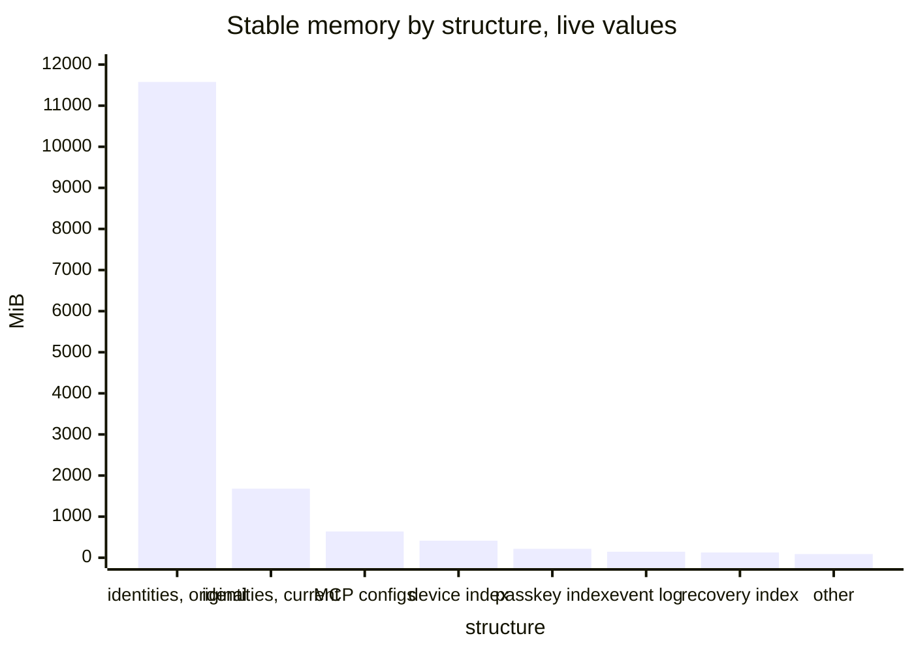
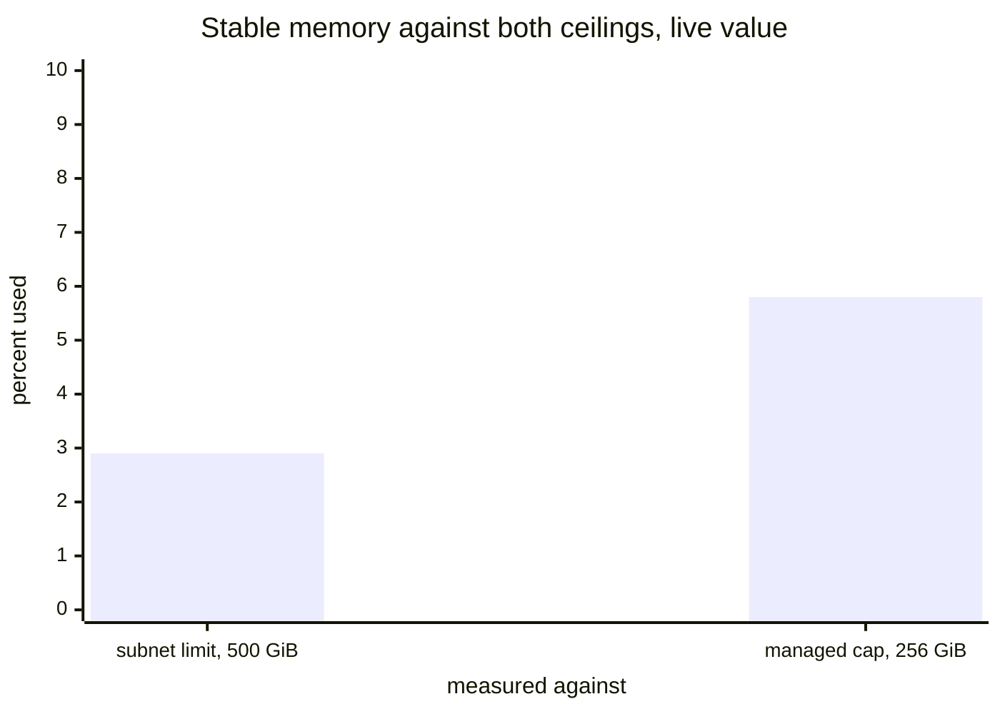
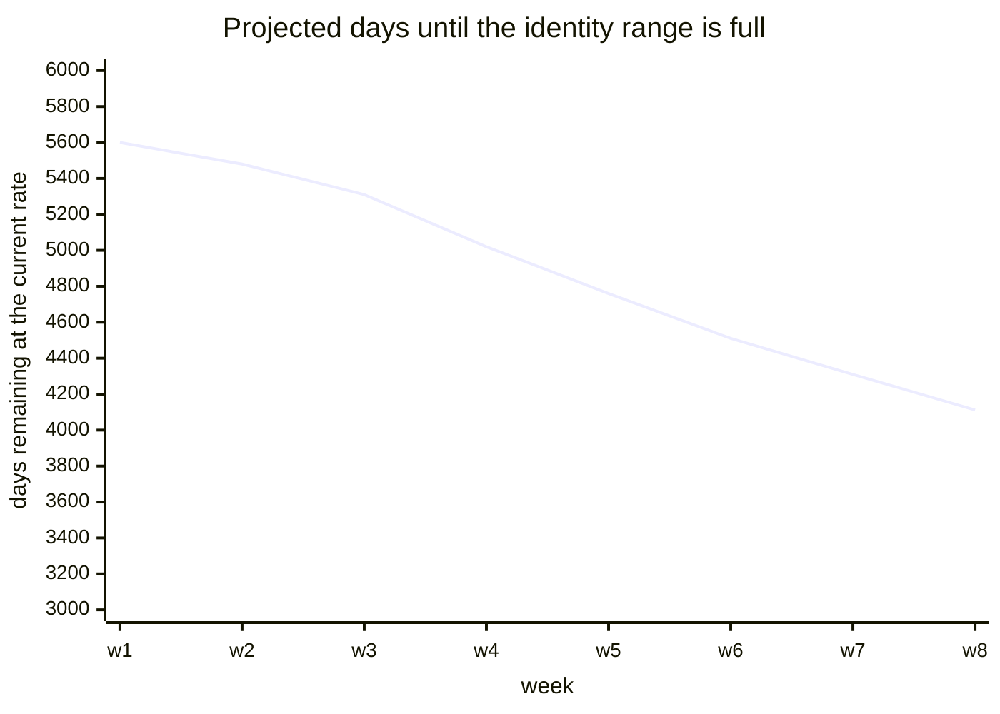
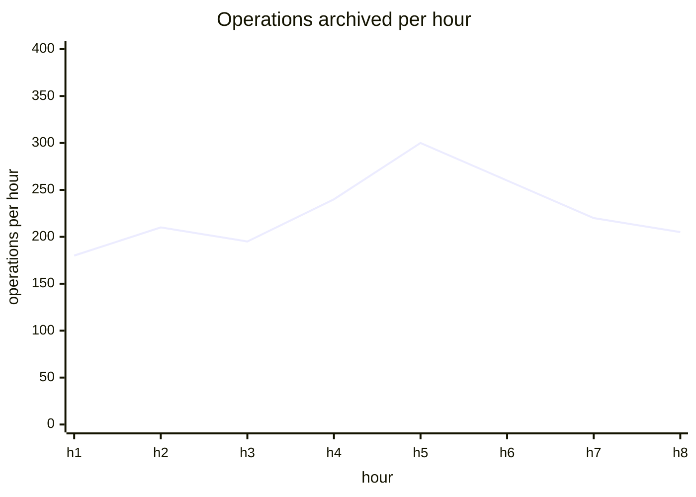
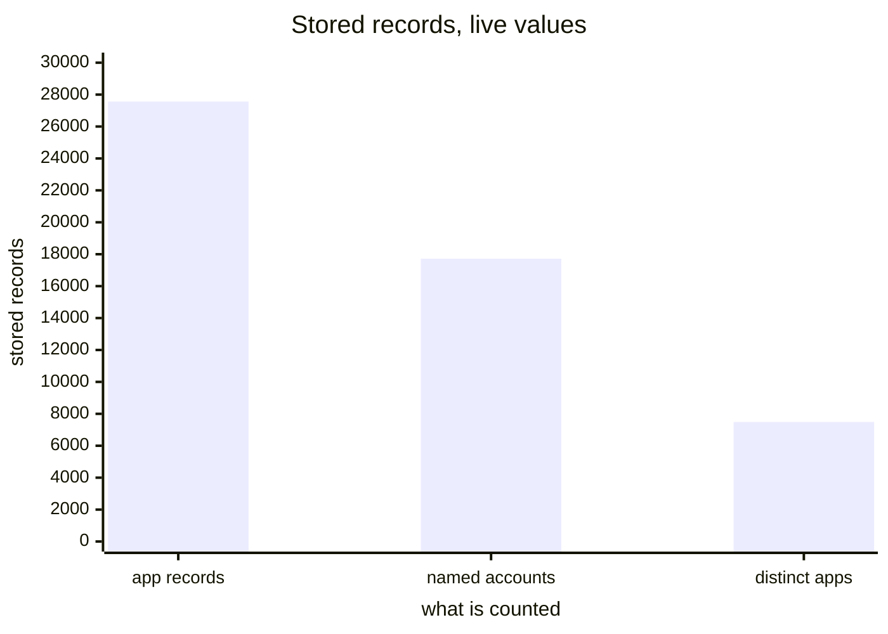

# Storage and capacity

[Dashboards](README.md) · [Health](health.md) · [Adoption and usage](usage.md) · [Apps](apps.md) · **Storage and capacity**

Where the memory goes and when anything runs out. Opened rarely, and worth being right when it is. Reasoning for each panel is in [metrics.md](../metrics.md).

## Stable memory by structure · replaces the log-scale panel

`internet_identity_virtual_memory_size_pages * 65536`, ranked, in bytes, with readable labels

Today this is twenty-five flat lines on a log-2 axis from 1 to 262,144, labelled by internal identifier, with a legend taller than the plot. The data is right and nobody can read it.

Live, 77.6 percent of all stable memory sits in one structure, and the two identity storages are adjacent series with near-identical names. A panel that named them would make the state of that migration visible at a glance.

The list behind the metric is hand-maintained, and four memories are missing from it, including `lookup_session_with_principal_memory`, the session index. That one grows with every session, so as sessions roll out this panel would be blind to the only structure whose growth is new.

The log-scale view is worth keeping as a second, explicitly labelled debugging panel: it is the right shape for spotting a structure that jumps by an order of magnitude, and the wrong shape for everything else.

## Stable memory against its ceiling · fix

`internet_identity_stable_memory_pages * 65536 / (256 * 1024^3) * 100`

Live: 241,794 pages, 14.8 GiB. Today's panel divides by the subnet's 500 GiB while the canister's own `MAX_MANAGED_MEMORY_SIZE` is 256 GiB, so it reports 2.9 percent where the figure that binds is 5.8. Plot the binding ceiling, or both.

## Identity numbers remaining · fix · two panels

`(internet_identity_max_user_number - internet_identity_min_user_number - internet_identity_user_count + 1) / (deriv(internet_identity_user_count[1w]) * 86400)`

Today's query subtracts a count from an identity number, overstating free slots by nearly `min_user_number`: live the correct figure is 4,336,849 where the panel computes 4,346,848. It also caps its colour scale at 365 for a value in the thousands, and shows two numbers eleven years out with no history.

Keep one stat for the headline, and add the trend, because the direction is the only actionable part. A falling line means growth is accelerating.

## Operations archived · keep · plus a rate

`ii_archive_entries_count{source="log"}`, and its rate

An entry is one recorded operation on an identity. Live: about 2,718,590, rising steadily, which a monotonic total always does. The rate is what shows a change in behaviour.

## Archive stable memory · check

`ii_archive_stable_memory_pages * 65536 / (500 * 1024^3) * 100`

Same construction as the II panel, and the same open question: whether the archive canister has a managed cap below the subnet's 500 GiB. If it does, this needs the same correction. If it does not, the divergence from the II panel should be commented so nobody harmonises them wrongly later.

## Stored records · keep

`internet_identity_total_accounts_count`, `internet_identity_total_account_references_count`, `internet_identity_total_application_count`

Storage inventory, moving slowly. Live: 17,720 named accounts, 27,563 app records, 7,489 distinct apps.

Two wording fixes. "Account reference" is internal: it is one record per identity per app it has signed into, so "app record" is what it is. And every identity has a default account it never named, so this counts only the named ones. Both numbers are floors rather than totals, which belongs on the panel rather than in a tooltip.

