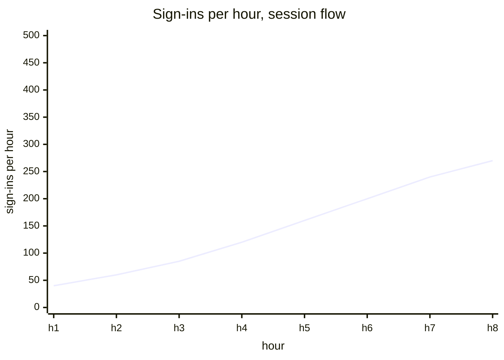
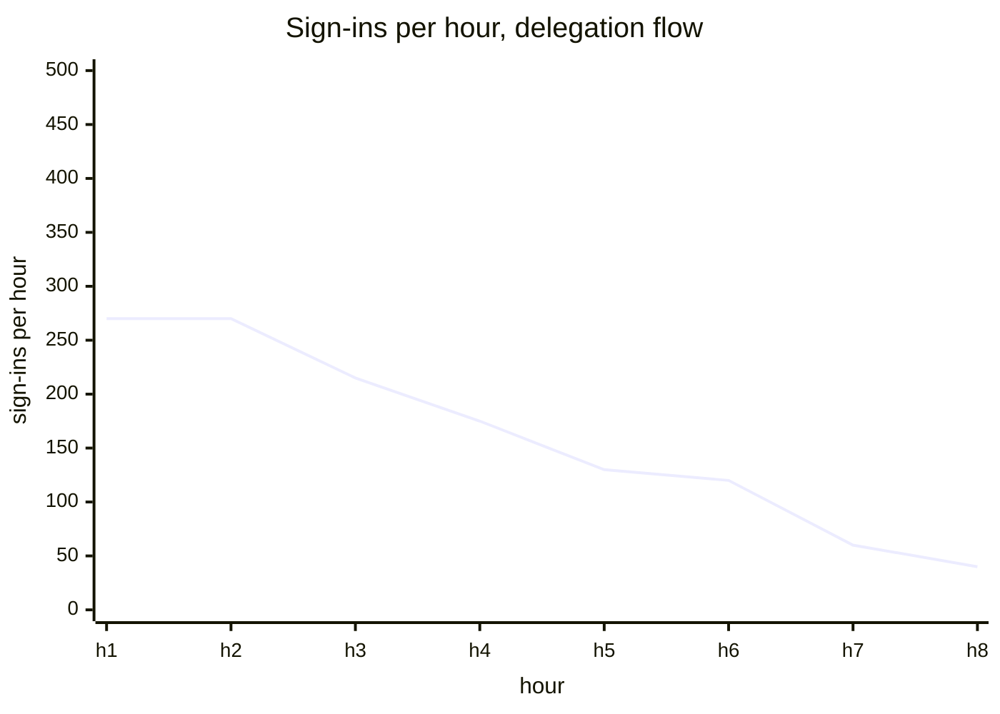
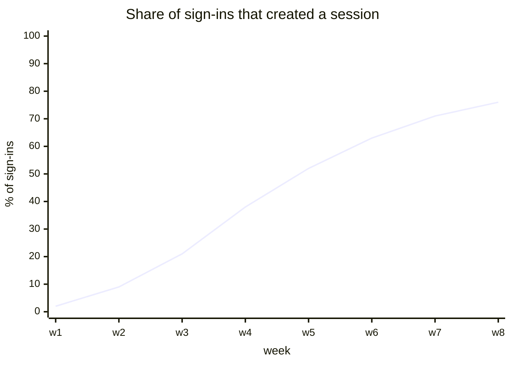
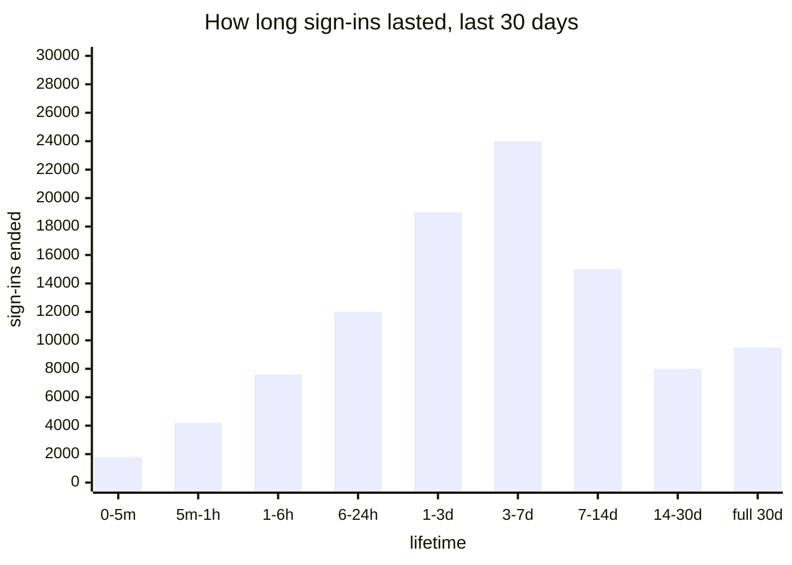
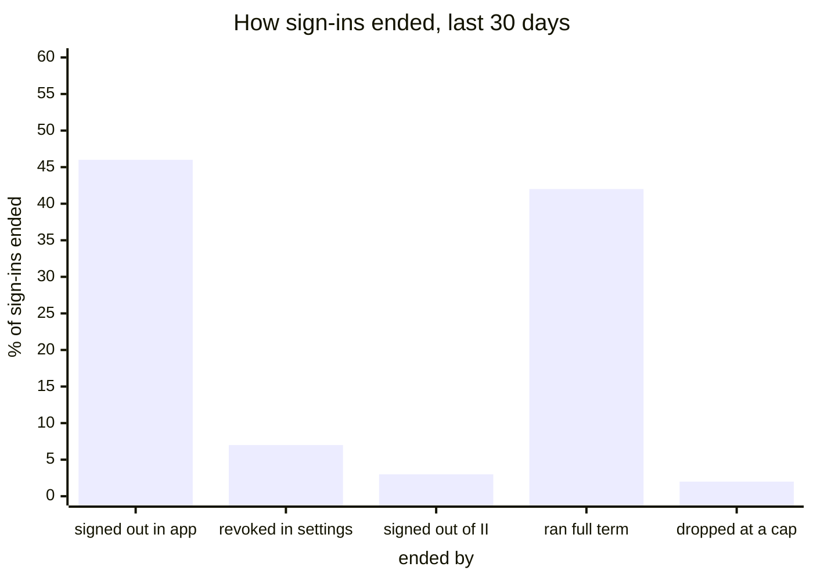
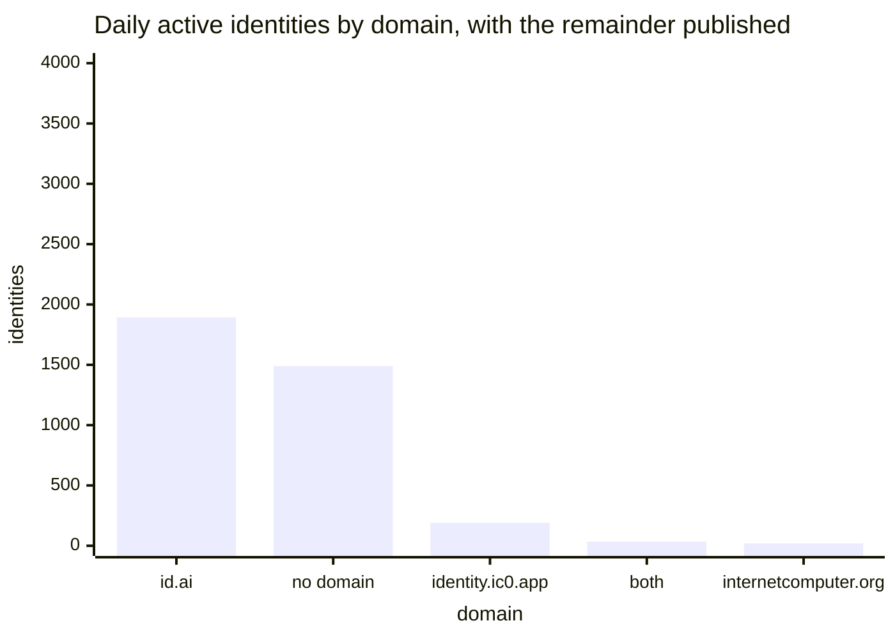
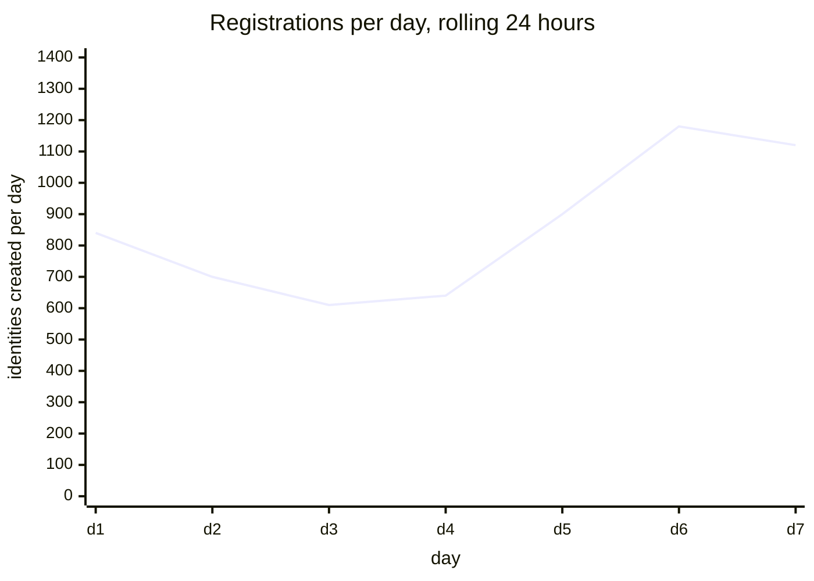
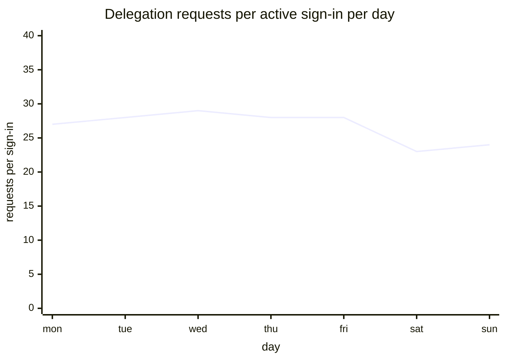

# Adoption and usage

[Dashboards](README.md) · [Health](health.md) · **Adoption and usage** · [Apps](apps.md) · [Storage and capacity](storage.md)

Is it being used, by how many people, and for how long. The page to open before a planning conversation. Reasoning for each panel is in [metrics.md](../metrics.md).

## Sign-ins per hour · replaces Logins per Hour

`sum by (flow) (rate(internet_identity_sign_ins_total[5m])) * 3600`

A sign-in is one identity being granted access to one app, so this is larger than a count of people. Split by flow, the same panel shows the session rollout.

Today's panel reads `delegation_counter`, a gauge that returns to zero on upgrade and which the session flow does not touch at all, so it both notches at every deploy and goes quiet as apps migrate.

## Share of sign-ins that created a session · new

`sum(rate(internet_identity_sign_ins_total{flow="session"}[1d])) / sum(rate(internet_identity_sign_ins_total[1d]))`

The adoption question in one line, and the number to report when somebody asks whether the feature works. It needs one counter written on both sign-in paths: dividing by the existing `prepare_delegation_count` would compare two disjoint populations and exceed one as adoption grew.

## How long sign-ins last · new · replaces two panels

`histogram_quantile(0.5, sum by (le) (rate(internet_identity_session_age_seconds_bucket[7d])))`

Observed when a sign-in ends, because that is the last moment anything knows how old it was. Replaces both cumulative-session-length panels, which sum the lifetimes delegations were _requested for_ and render them in years.

Sign-ins that ran the full 30 days all land in the top bucket, so quantiles above that share are meaningless. Sign-ins nobody returns to are removed late, so they are under-represented.

## How sign-ins ended · new

`sum by (reason) (increase(internet_identity_sessions_ended_total[30d])) / scalar(sum(increase(internet_identity_sessions_ended_total[30d])))`

A deliberate sign-out is somebody leaving; running the full term is somebody who stopped coming back. This is also the only measure of whether the settings screen is used: if almost nothing ends by a revocation from settings, the design's central promise is going unexercised.

## Daily and monthly active identities · fix

`internet_identity_daily_active_anchors` with `..._by_domain`, plus the monthly pair

Identities that took an authenticated action in the window. Live: 3,627 daily, 38,079 monthly.

The fix is publishing the remainder. The per-domain parts sum to 2,137 against a total of 3,627, because a domain is recorded only when the authenticating device carries one and OpenID credentials do not. The 1,490 difference matches the 1,485 daily active OpenID identities.

## Identities and registrations · keep

`internet_identity_user_count`, and `increase(internet_identity_user_count[1d])`

Total identities ever created, and the rolling daily delta. Live: 3,222,895 and about 1,100 a day. The second panel is titled "Registrations the last 24h" and is a rolling window across the whole range, so it should say so.

## Traffic per signed-in user · new

`sum(rate(internet_identity_app_delegation_requests_total{outcome="served"}[1d])) * 86400 / internet_identity_daily_active_sessions`

Delegation requests per active sign-in per day. At a five-minute credential this is really a measure of how long apps stay open, and it is the figure to put beside any proposal to change those five minutes. Requests are a proxy for cost, not cost.

