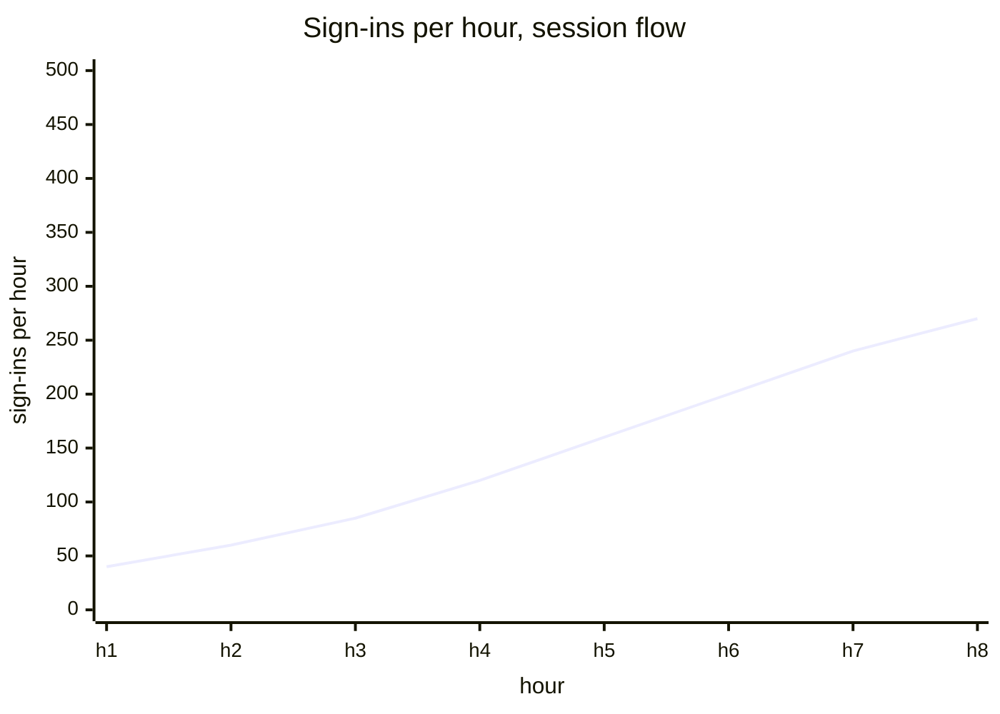
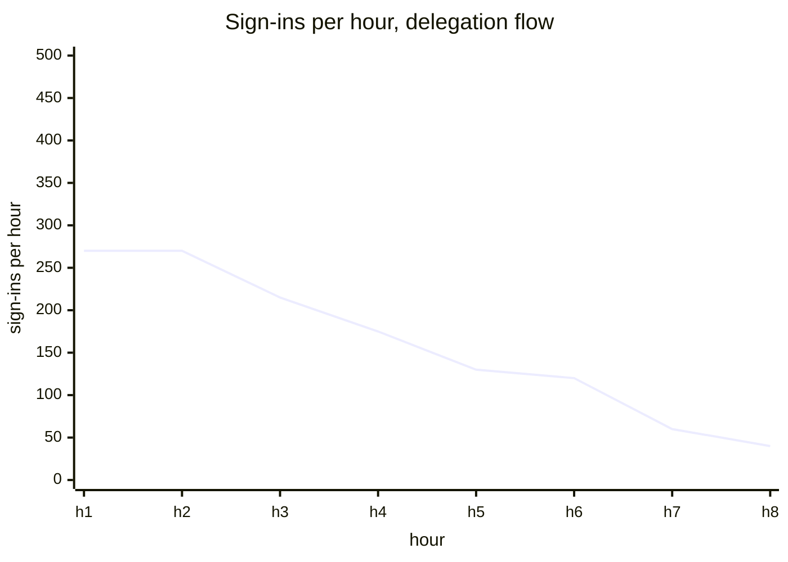
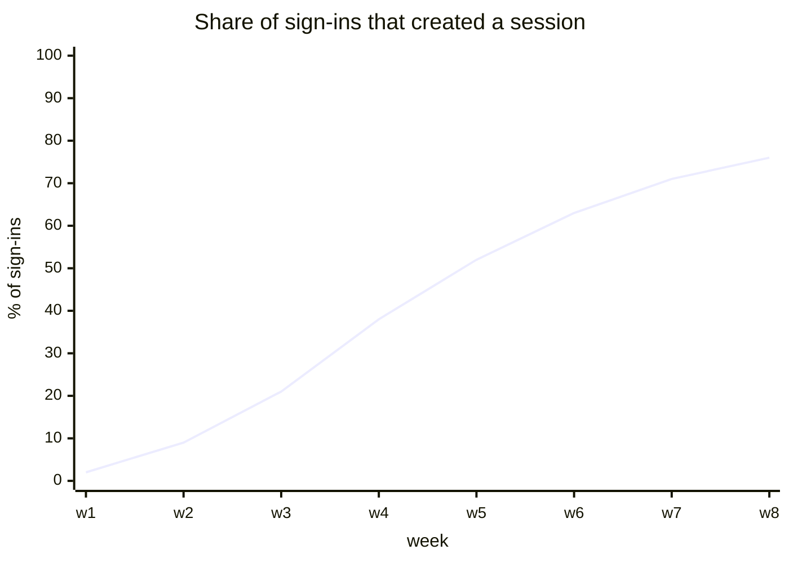
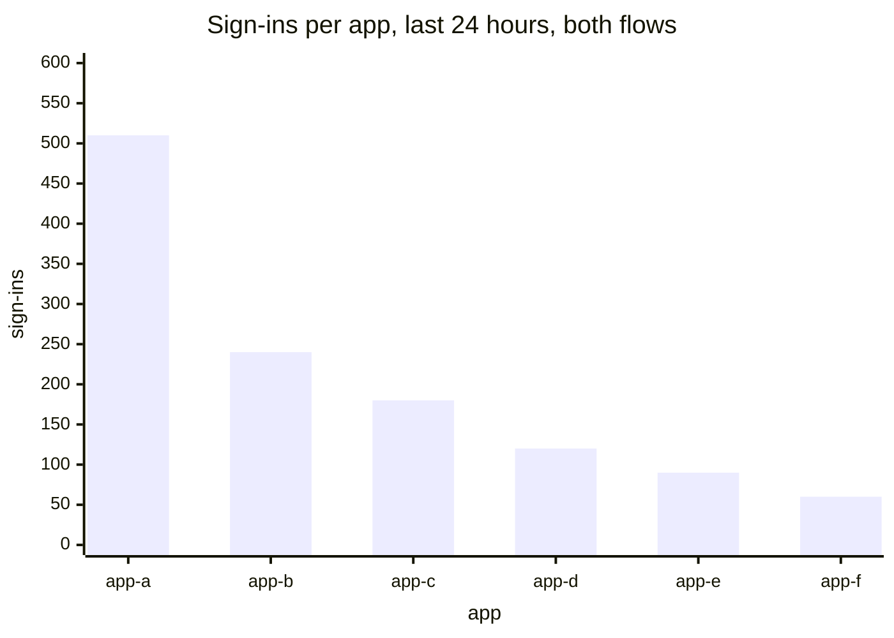
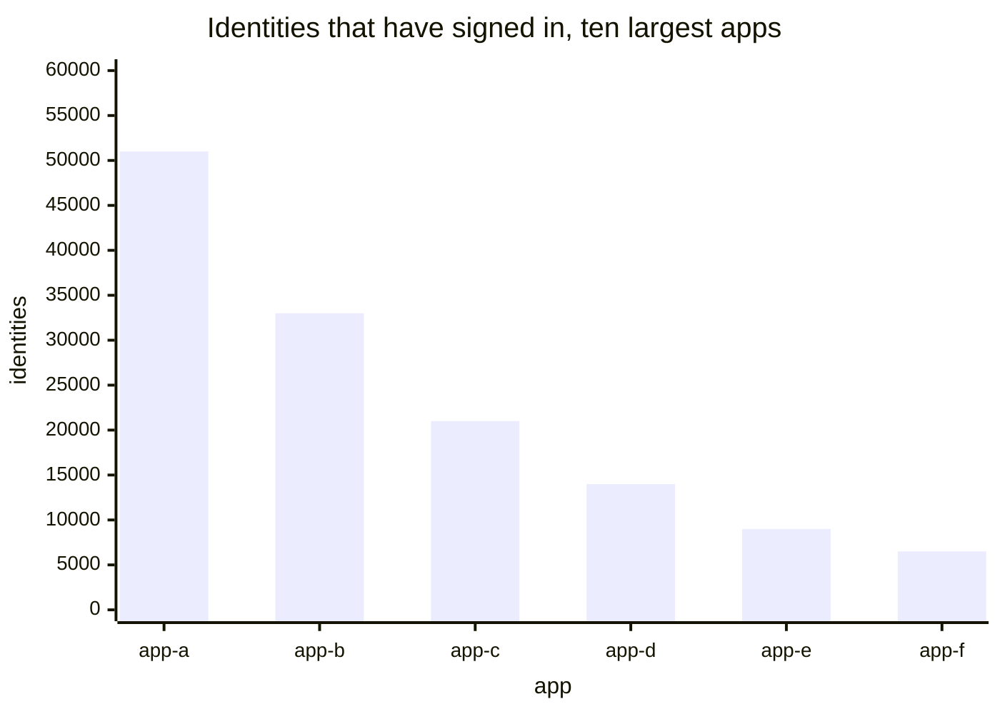
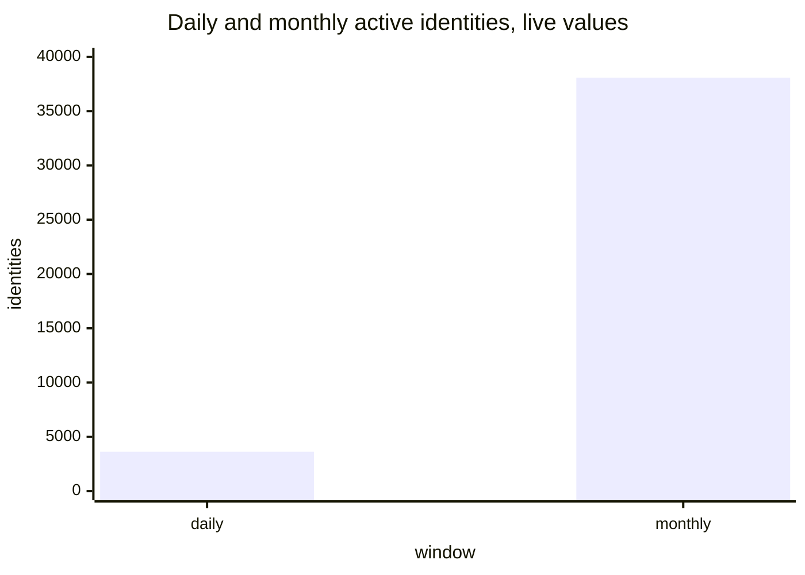
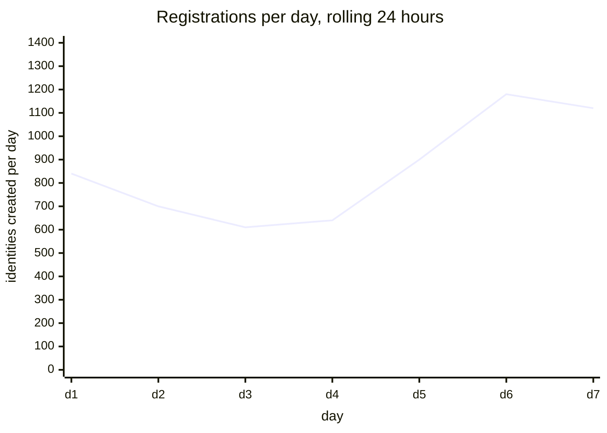
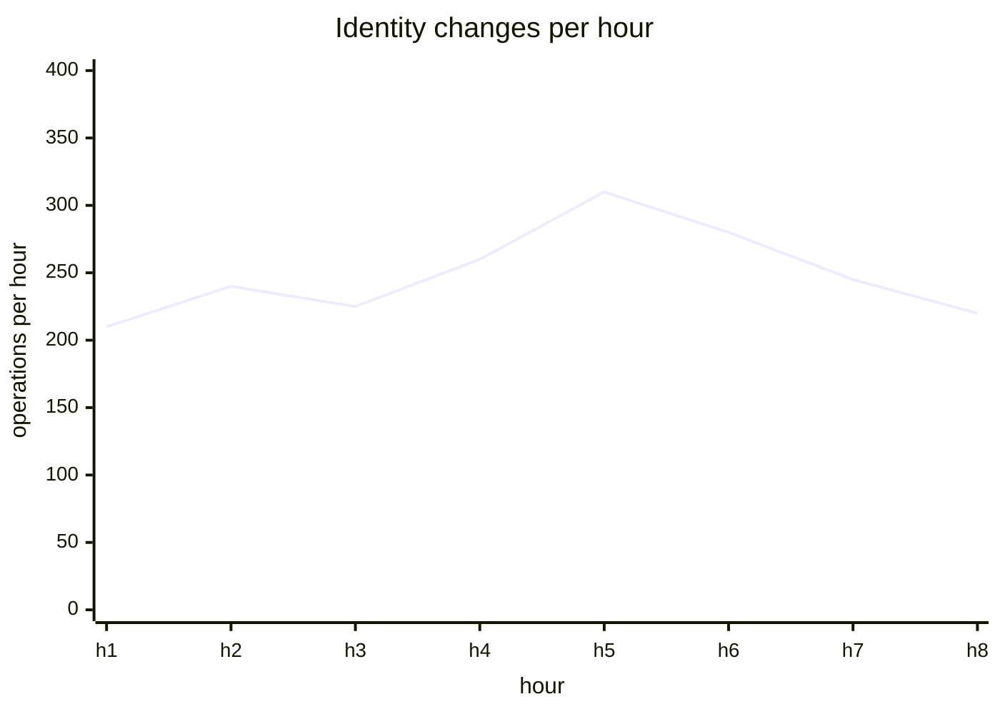

# Usage

[Dashboards](README.md) · [Health](health.md) · **Usage** · [Staying signed in](staying-signed-in.md) · [Access methods](access.md) · [Storage and capacity](storage.md)

How much it is used, by how many people, on which apps, and how far the session rollout has got. The page to open before a planning conversation.

Everything here is a volume. Whether people come back is a different question and has [its own page](staying-signed-in.md). Nothing here is labelled by how anyone authenticated either — that is [Access methods](access.md), and a usage number should not move when the mix does. Reasoning for each panel is in [metrics.md](../metrics.md).

## Sign-ins per hour

`sum by (flow) (rate(internet_identity_sign_ins_total[5m])) * 3600`

A sign-in is one identity being granted access to one app, so this is larger than a count of people. Split by flow, the same panel shows the session rollout.

Today's panel reads `delegation_counter`, a gauge that returns to zero on upgrade and which the session flow does not touch at all, so it both notches at every deploy and goes quiet as apps migrate.

## Share of sign-ins that created a session

`sum(rate(internet_identity_sign_ins_total{flow="session"}[1d])) / sum(rate(internet_identity_sign_ins_total[1d]))`

The adoption question in one line, and the number to report when somebody asks whether the feature works. It needs one counter written on both sign-in paths: dividing by the existing `prepare_delegation_count` would compare two disjoint populations and exceed one as adoption grew.

## Sign-ins per app

`topk(10, sum by (dapp) (increase(internet_identity_sign_ins_total[24h])))`

Which apps carry the traffic. A ranking rather than a time series, because a ranking is what people read off it, and one panel replaces the 24-hour and 30-day pair: once sign-ins come from a counter, Prometheus computes any window and the dashboard's time picker chooses it.

Today's panels are fed only by `prepare_account_delegation`, so a migrating app's line falls to zero while its usage is flat. They also filter on `ii_origin`, which scopes them to identities holding a passkey registered on one domain: 190 of 3,627. The replacement carries `dapp` and the flow, and nothing about how anyone authenticated.

## Identities per app

`topk(10, internet_identity_identities_per_app)`

Identities that have ever signed in to each app: reach rather than current traffic. Already stored as a count on each application record, so publishing it is a read and a sort.

Useful beside the panel above, since an app with many identities and little traffic is one people signed up for and left.

## Daily and monthly active identities

`internet_identity_daily_active_anchors` and `internet_identity_monthly_active_anchors`

Identities that took an authenticated action in the window. Live: 3,627 daily, 38,079 monthly.

The fix is removing the by-domain series plotted beside the total. They sum to 2,137 against 3,627, because a domain is recorded only from the authenticating passkey and OpenID credentials carry none — so they count passkeys by the domain they were registered on, not people by the domain they use. How somebody authenticated belongs on [Access methods](access.md); which domain a browser visited is measurable from the browser and belongs in Plausible.

## Identities and registrations

`internet_identity_user_count`, and `increase(internet_identity_user_count[1d])`

Total identities ever created, and the rolling daily delta. Live: 3,222,895 and about 1,100 a day. The second panel is titled "Registrations the last 24h" and is a rolling window across the whole range, so it should say so.

## Identity changes per hour

`rate(internet_identity_anchor_operations_counter[5m]) * 3600`

Mutation volume: adding a passkey, renaming a device, linking an OpenID credential. Live: 7,453 since the last upgrade.

The metric is a gauge that resets on upgrade, so `rate()` over it drops whatever accumulated before each deploy. Moving the counter into persistent state is the fix, and it is the same groundwork every new counter on this dashboard needs.

