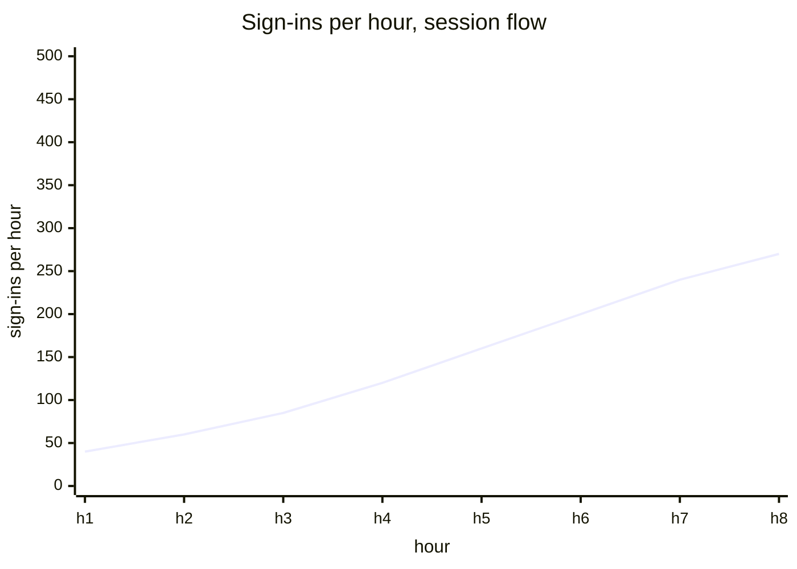
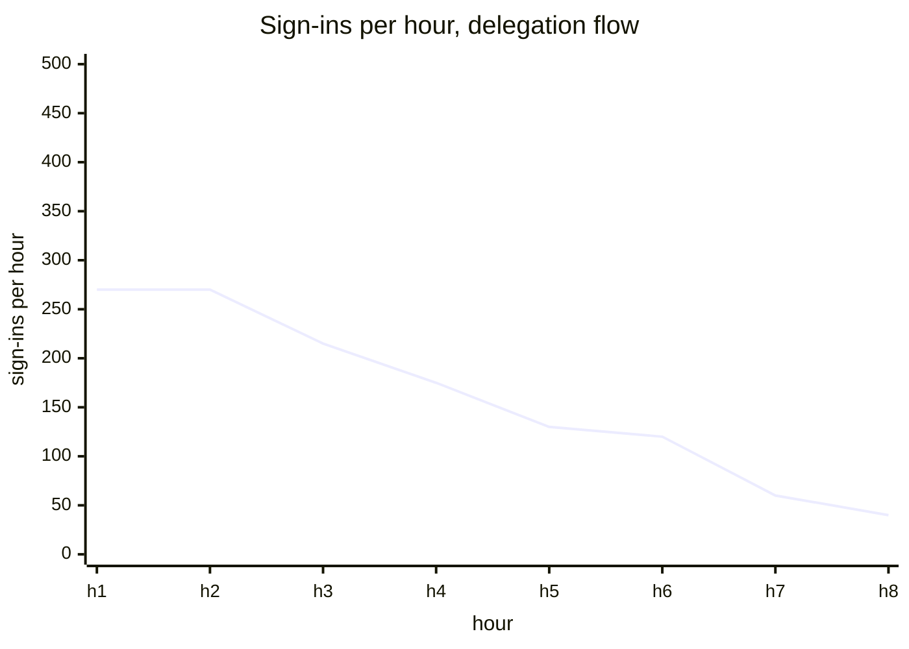
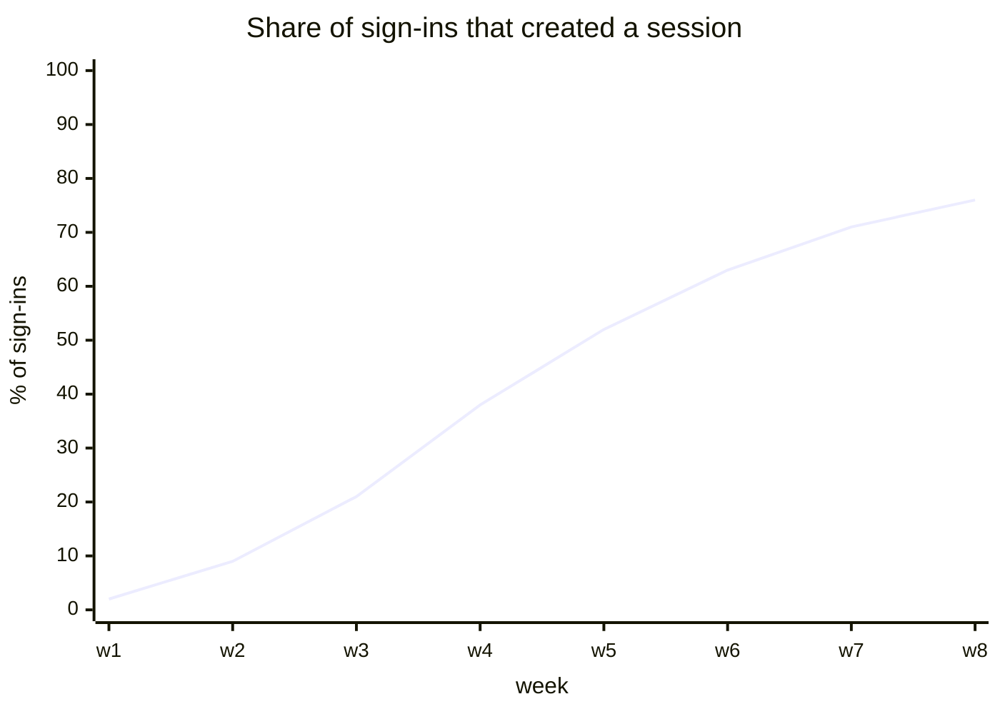
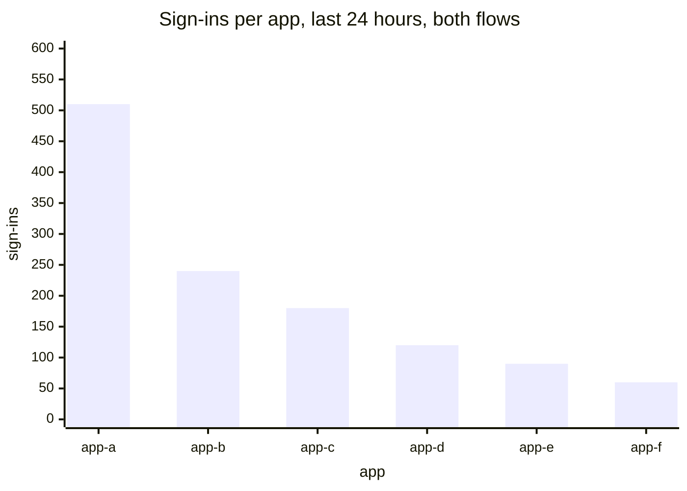
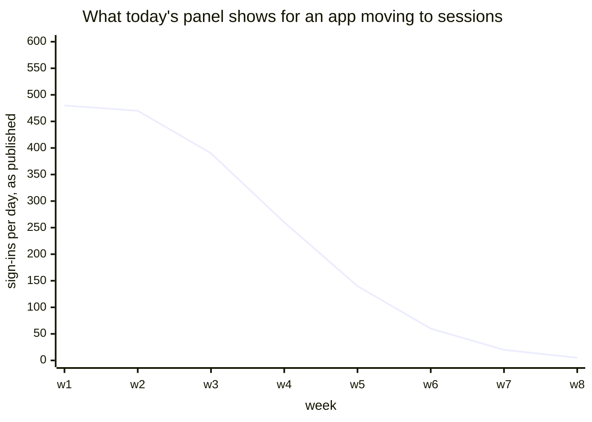
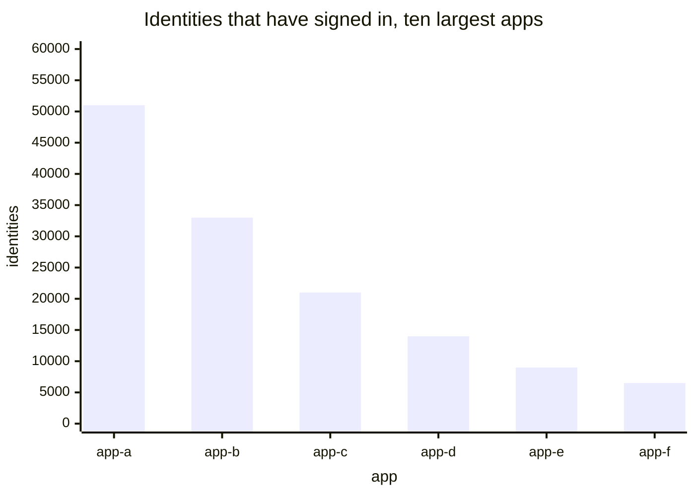
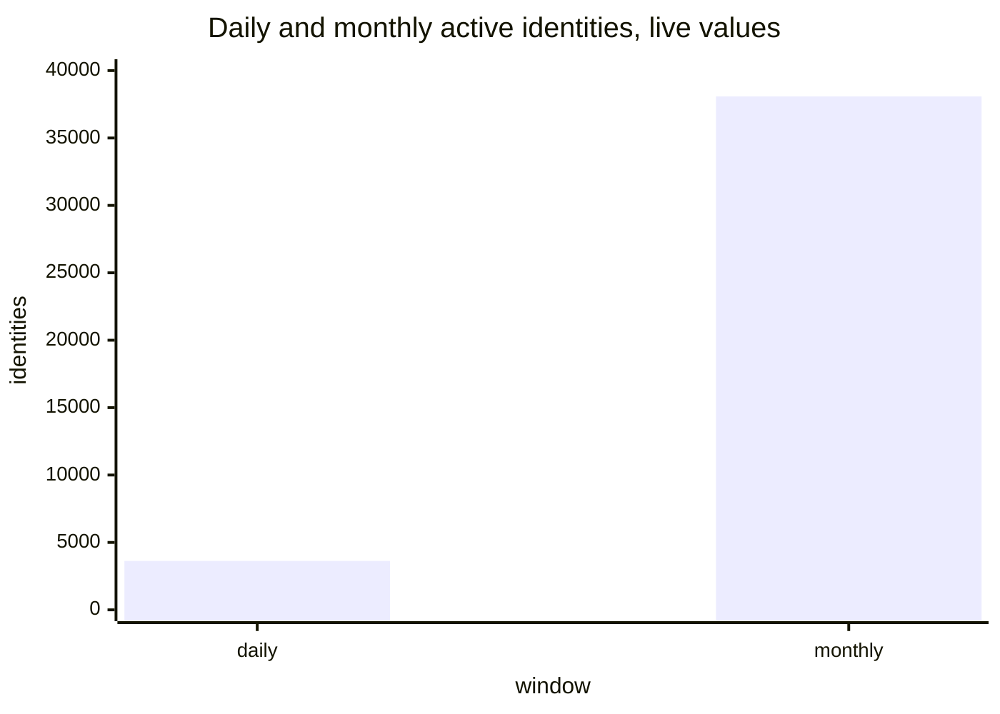
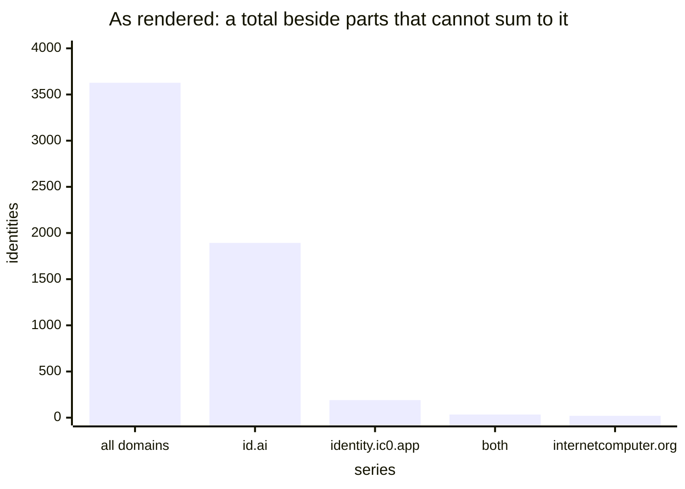
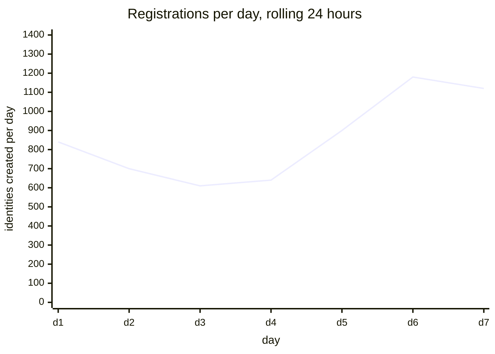
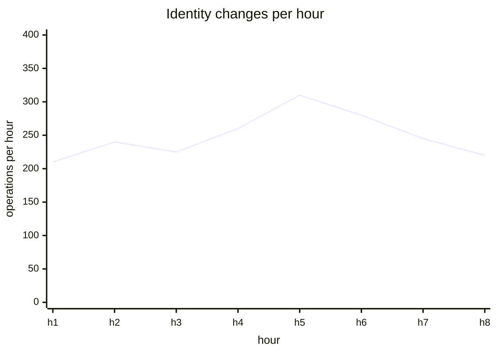

# Usage

[Dashboards](README.md) · [Health](health.md) · **Usage** · [Staying signed in](staying-signed-in.md) · [Access methods](access.md) · [Storage and capacity](storage.md)

How much it is used, by how many people, on which apps, and how far the session rollout has got.

Everything here is a volume. Whether people come back is a different question with [its own page](staying-signed-in.md). Nothing here is labelled by how anyone authenticated either — that is [Access methods](access.md), and a usage number should not move when the mix does.

## Sign-ins per hour

Core usage, split by flow so the same panel shows the session rollout happening.

A sign-in is one identity being granted access to one app, so this number is larger than a count of people.





<details>
<summary><b>Today:</b> Logins per Hour — notches at every deploy, and goes quiet as sessions land</summary>

Reads `internet_identity_delegation_counter`, a gauge that returns to zero on upgrade, so `increase()` over it loses whatever accumulated between the last scrape and the deploy.

Worse, the session flow does not touch it at all. `prepare_account_session` calls no bookkeeping, so the line falls as apps migrate while real usage is flat.

It is also one of the five panels still on the deprecated Angular `graph` type.

</details>

<details>
<summary><b>Sources and formula</b></summary>

Add `internet_identity_sign_ins_total{flow, dapp, browser}`, a counter incremented on both `prepare_account_delegation` and `prepare_account_session`. Remove `internet_identity_delegation_counter`.

```promql
sum by (flow) (rate(internet_identity_sign_ins_total[5m])) * 3600
```

Labelled by app and flow and by nothing about the access method behind it.

</details>

## Share of sign-ins that created a session

The adoption question in one line, and the number to report when somebody asks whether the feature works.



<details>
<summary><b>Today:</b> nothing measures this</summary>

Nothing on the dashboard can tell the two flows apart, because the session flow increments nothing. Adoption is currently invisible.

</details>

<details>
<summary><b>Sources and formula</b></summary>

Uses `internet_identity_sign_ins_total{flow}` from the panel above.

```promql
sum(rate(internet_identity_sign_ins_total{flow="session"}[1d]))
  / sum(rate(internet_identity_sign_ins_total[1d]))
```

It needs the one counter written on both paths. Dividing by the existing `prepare_delegation_count` would compare two disjoint populations and exceed one as adoption grew.

</details>

## Sign-ins per app

Which apps carry the traffic. A ranking, because a ranking is what people read off it.



<details>
<summary><b>Today:</b> Top 10 dapps by number of sign-ins (24h) and (30d) — two panels, both narrowed and both going quiet</summary>

Both read `internet_identity_prepare_delegation_count{dapp, window, ii_origin}`, filtered to `ii_origin="ic0.app"`. The canister keeps its own rolling windows and returns the ten heaviest, so each plotted point is the canister's window as it stood then.

Three problems. The 30-day panel is the wrong chart type, since a 30-day rolling total barely moves across a 7-day view. The `ii_origin` filter scopes both to identities holding a passkey registered on one domain — live 190 of 3,627 — which is not a fact about app traffic at all. And the family is fed only by `prepare_account_delegation`, so a migrating app's line falls to zero while its usage is flat.



The `dapp` label holds the app's origin, which the legend renders as a full URL and a canister id for most entries. Unavoidable for canister-hosted apps, but "app" is the word for the axis rather than "dapp".

</details>

<details>
<summary><b>Sources and formula</b></summary>

Uses `internet_identity_sign_ins_total{dapp}`. Remove `internet_identity_prepare_delegation_count`.

```promql
topk(10, sum by (dapp) (increase(internet_identity_sign_ins_total[24h])))
```

Two panels collapse to one: once sign-ins come from a counter, Prometheus computes any window and the dashboard's time picker chooses it. The same argument retires the `window` label from the new counter before it is added.

</details>

## Identities per app

Reach rather than current traffic: identities that have ever signed in to each app.

Useful beside the panel above, since an app with many identities and little traffic is one people signed up for and left.



<details>
<summary><b>Today:</b> nothing measures this</summary>

The dashboard has traffic per app but no notion of reach, so an app used heavily by a few people looks the same as one used lightly by many.

</details>

<details>
<summary><b>Sources and formula</b></summary>

Add `internet_identity_identities_per_app{dapp}`, a gauge. The count is already stored on each application record, so publishing it is a read and a sort.

```promql
topk(10, internet_identity_identities_per_app)
```

</details>

## Daily and monthly active identities

How many people use II, which is the number most often asked for. Live: 3,627 daily, 38,079 monthly.



<details>
<summary><b>Today:</b> Daily and Monthly Active Identities — a total beside parts that cannot sum to it</summary>

Both panels plot `internet_identity_daily_active_anchors` together with `..._by_domain{domain}`, the total legended "All domains".

The total is right. The by-domain series beside it are not a breakdown of it: live they give 190 on `identity.ic0.app`, 1,893 on `id.ai`, 20 on `internetcomputer.org` and 34 on both, totalling 2,137 against 3,627. A domain is recorded only from the authenticating passkey, and OpenID credentials carry none, so the 1,490 missing identities match the 1,485 daily active OpenID ones.



Publishing the missing remainder would make the bars add up without making them mean anything: they would still count passkeys by the domain they were registered on, not people by the domain they use.

Two wording notes. The metric family says `anchors` where the panel says identities, and identities is the right word — the panel is ahead of the metric name. And the `both_ii_domains` series means an identity active on more than one II domain in the window, not a domain of that name.

</details>

<details>
<summary><b>Sources and formula</b></summary>

Remove `internet_identity_daily_active_anchors_by_domain` and its monthly twin, from the panel and from the endpoint.

```promql
internet_identity_daily_active_anchors
internet_identity_monthly_active_anchors
```

One line per window, which is the whole of what the panel was for. The question the by-domain series looked like it answered — which domain people are actually on — is measurable from the browser, so Plausible owns it.

</details>

## Identities and registrations

Total reach, and the rolling daily delta. Live: 3,222,895 identities, about 1,100 a day.



<details>
<summary><b>Today:</b> Internet Identities and Registrations the last 24h — both correct, one mistitled</summary>

`Internet Identities` plots `internet_identity_user_count` directly: total identities ever created, and the denominator for most growth questions.

`Registrations the last 24h` plots `increase(internet_identity_user_count[1d])`. A rolling 24-hour delta of a monotonic gauge, so `increase()` cannot be confused by a reset. Correct, but the title reads as "how many today" when the line is a rolling window across the whole range.

Both are on the deprecated Angular `graph` type.

</details>

<details>
<summary><b>Sources and formula</b></summary>

No source change. Rename the second to "Registrations per day, rolling 24h", and migrate both to `timeseries`.

```promql
internet_identity_user_count
increase(internet_identity_user_count[1d])
```

</details>

## Identity changes per hour

Mutation volume: adding a passkey, renaming a device, linking an OpenID credential. Live: 7,453 since the last upgrade.

Steady, and rarely the thing you need — but it is the only view of write load.



<details>
<summary><b>Today:</b> Identity Changes per Hour — loses a window at every deploy</summary>

Plots `rate(internet_identity_anchor_operations_counter[5m]) * 3600`. Despite the name, the family is a gauge that resets on upgrade, so the rate drops whatever accumulated before each deploy.

Another of the five panels on the deprecated Angular `graph` type.

</details>

<details>
<summary><b>Sources and formula</b></summary>

Change `internet_identity_anchor_operations_counter` to a real counter kept in persistent state. Same groundwork every new counter on these pages needs.

```promql
rate(internet_identity_anchor_operations_counter[5m]) * 3600
```

</details>
