# Metrics

**Relates to:** `revocable-app-sessions.md` and `tracked-default-accounts.md`, whose behaviour the new charts here measure. This document covers the whole `/metrics` endpoint and the dashboard reading it, not only the session work.

Read from the `internet-identity` Grafana dashboard JSON and checked against the production endpoint on 2026-08-26. Twenty-three panels, 53 metric families.

## How to read an entry

Every panel below, existing or proposed, is written the same way.

**Sources.**
The metric families the panel reads, exactly as published.

**Formula.**
The query, as the dashboard runs it or as it would need to run.

**Verdict.**
Whether it is right, and what it actually measures if that differs from its title.

**Wording.**
Only where the panel uses a term a reader would not know, with what it means and what it should say instead. Entries without this line need no renaming.

**Change.**
What has to happen, stated as sources added, changed or removed, and how many panels replace it.

A chart follows each entry showing what it renders today, and a second chart where the replacement looks different. Charts are sketches; numbers in the prose and in charts marked live come from that scrape.

## The endpoint as it stands

All 53 families are encoded as gauges. There are no counters and no histograms anywhere, which has three consequences that recur below.

A family named `_counter` is still a gauge, and several are documented as counting since the last upgrade. `increase()` over one loses whatever accumulated between the last scrape and the deploy.

Nothing can expose a distribution. Any question of the form "how long" or "what is the ninetieth percentile" is currently unanswerable, whatever the data.

The two per-app families are filtered to one value of a label that does not mean what it says. `ii_origin` is read from the authenticating passkey's registration origin:

```rust
let maybe_domain = match &authorization_key {
    AuthorizationKey::DeviceKey(device_key) => anchor.device(device_key).unwrap().ii_domain(),
    _ => None,
};
```

So a passkey created on `ic0.app` is labelled `ic0.app` for life whichever domain its owner uses, and anything that is not a passkey, OpenID above all, has no origin and falls into a bucket the endpoint never publishes. Live, of 3,627 daily active identities, 190 are attributed to `identity.ic0.app`, 1,893 to `id.ai`, and 1,490 to no domain at all, which matches the 1,485 daily active OpenID identities to within five.

Deciding what `ii_origin` should mean comes before adding any per-app metric, because the answer applies to those too.

Separately, five panels use Grafana's deprecated Angular `graph` type: Internet Identities, Registrations the last 24h, Logins per Hour, Identity Changes per Hour, Signature map size. The warning triangle on exactly those five is that deprecation, not an alert.

## What belongs on this dashboard

One rule decides most of what follows: **this dashboard is for what only the canister can know.**

Visitor behaviour, funnels, page views, drop-off and anything else measurable from the browser is already tracked in Plausible, and tracking it twice means maintaining two definitions that drift apart. Where a panel here duplicates something Plausible has, the panel goes rather than getting fixed. Where a question is only answerable inside the canister, this endpoint is the only place it can come from, and that is where the effort belongs.

The same rule excludes some session questions. Whether a silent re-issue rendered nothing, and whether it had anything to resume from, are decided in the frontend; the canister sees a delegation request like any other.

## The dashboard, most useful first

Ordered by how often the panel would change a decision, not by where it sits on the screen today. Each entry says whether it stays, changes, or is new. What gets deleted is listed after them.

The dashboard has 23 panels. This ordering keeps 6 as they are, fixes 7 in place, replaces 3, opens 1 question, adds 4, and deletes 5. That is 23 in and 24 out, so the dashboard barely grows while five panels that mislead or show nothing go away.

### Is anything failing

**New panel.** The only error rate the design has, and the only panel here worth an alert.

**Sources added.**
`internet_identity_app_delegation_requests_total{outcome}`, a counter on `app_prepare_delegation`.

**Formula.**

```promql
sum(rate(internet_identity_app_delegation_requests_total{outcome!="served"}[5m]))
  / sum(rate(internet_identity_app_delegation_requests_total[5m]))
```

**Why.**
The only error rate the design has, and the only new panel worth an alert. A browser whose sign-in has gone keeps asking until its app gives up, so refusals rising means users being signed out against their will.

Two constraints belong on the panel. `outcome` can honestly say only `expired_in_place` and `unknown`: all seven failure sites in the mint path return the same error, and revoking deletes the index entry, so a revoked sign-in is indistinguishable from one that never existed. And `app_get_delegation` and `check_session` are queries, which cannot increment anything, so this covers the update half of the traffic.

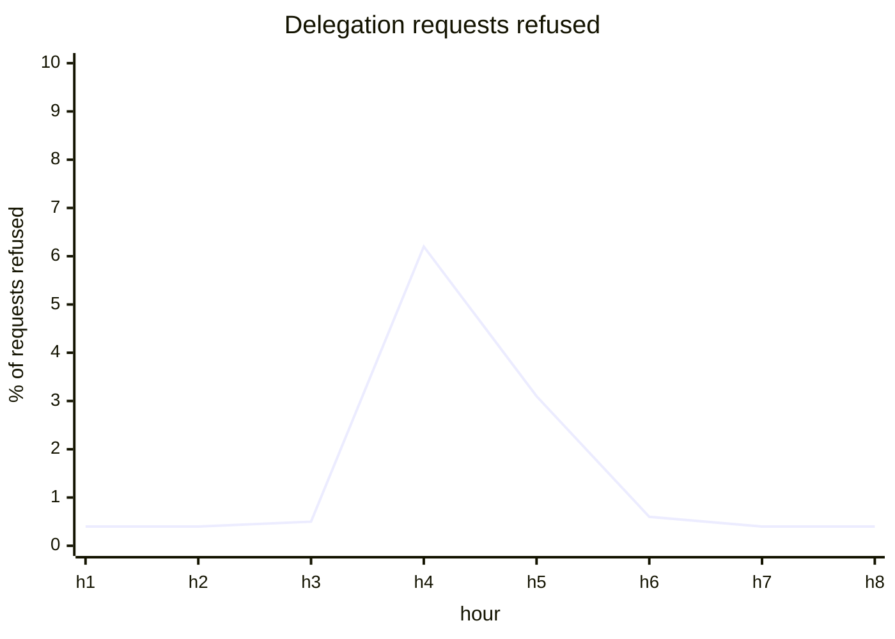
```mermaid
xychart-beta
  title "Delegation requests refused"
  x-axis "hour" [h1, h2, h3, h4, h5, h6, h7, h8]
  y-axis "% of requests refused" 0 --> 10
  line [0.4, 0.4, 0.5, 6.2, 3.1, 0.6, 0.4, 0.4]
```

### Time since successful archive entries fetch

**Keep.** A freshness measure with a threshold derived from the configured interval.

**Sources.**
`ii_archive_last_successful_fetch_timestamp_seconds`, from the archive canister.

**Formula.**
`time() - ii_archive_last_successful_fetch_timestamp_seconds`, red past 70.

**Verdict.**
Correct, and the best-designed panel here: a freshness measure with a threshold derived from the configured 15-second polling interval. Live: 12.7 seconds.

**Wording.**
An "archive entries fetch" is the archive canister pulling operation records out of II. The panel is measuring how long since that last succeeded, so "Archive pull staleness" says it in three words.

**Change.**
None.

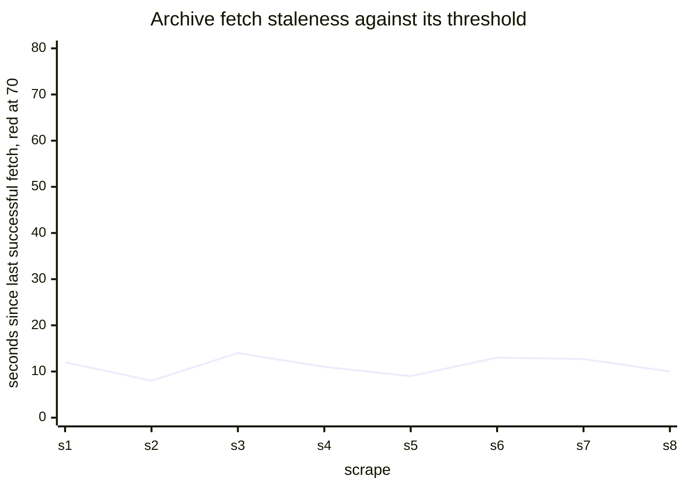
```mermaid
xychart-beta
  title "Archive fetch staleness against its threshold"
  x-axis "scrape" [s1, s2, s3, s4, s5, s6, s7, s8]
  y-axis "seconds since last successful fetch, red at 70" 0 --> 80
  line [12, 8, 14, 11, 9, 13, 12.7, 10]
```

### Number of Buffered Archive Entries

**Fix in place.** Backpressure on the archive, and the earliest sign of it falling behind.

**Sources.**
`internet_identity_buffered_archive_entries`, and `internet_identity_archive_config_entries_buffer_limit`, which the panel does not read.

**Formula.**
`internet_identity_buffered_archive_entries`, red past 5,000.

**Verdict.**
Correct. Live: 0, against a configured buffer limit of 10,000, so the threshold is half the limit, which is a reasonable place to warn and impossible to tell from the panel.

**Wording.**
A "buffered entry" is one operation record written by II and not yet pulled by the archive. The number is a queue depth, so "Operations waiting for the archive" is what a reader needs, and the 10,000 limit belongs on the panel rather than in the code.

**Change.**
Source added to the query: the buffer limit, already published. Plot it alongside so the threshold explains itself.

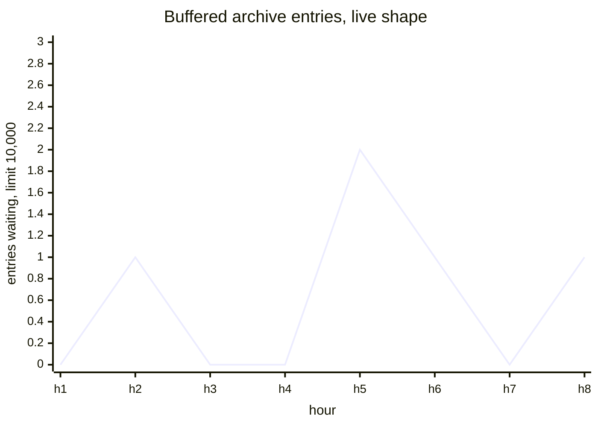
```mermaid
xychart-beta
  title "Buffered archive entries, live shape"
  x-axis "hour" [h1, h2, h3, h4, h5, h6, h7, h8]
  y-axis "entries waiting, limit 10,000" 0 --> 3
  line [0, 1, 0, 0, 2, 1, 0, 1]
```

### Registration Rate Limit Burst Reserve

**Fix in place.** The abuse signal, currently rendered so that the signal looks like noise.

**Sources.**
`internet_identity_register_rate_limit_current_tokens`, and `internet_identity_register_rate_limit_max_tokens`, which the panel does not read.

**Formula.**
`internet_identity_register_rate_limit_current_tokens`

**Verdict.**
Correct and unreadable, for the opposite reason to the memory panel. Live it reads 24,999 of a maximum of 25,000, so the value sits at the top of its range forever and the only visible feature is a one-token dip, which is in fact the entire signal.

**Wording.**
"Burst reserve" names the token bucket rather than the question. What a reader wants is how many registrations are still allowed before the limiter throttles, so "Registrations allowed before throttling" is the title, and the inverted series below is "registrations consumed".

**Change.**
Source added to the query: `max_tokens`, already published. Same panel, inverted to tokens consumed, so zero is the resting state and any burst is the deviation. Rename to "Registrations consumed against the throttle", since "burst reserve" describes the token bucket rather than what a reader wants to know.

```promql
internet_identity_register_rate_limit_max_tokens
  - internet_identity_register_rate_limit_current_tokens
```

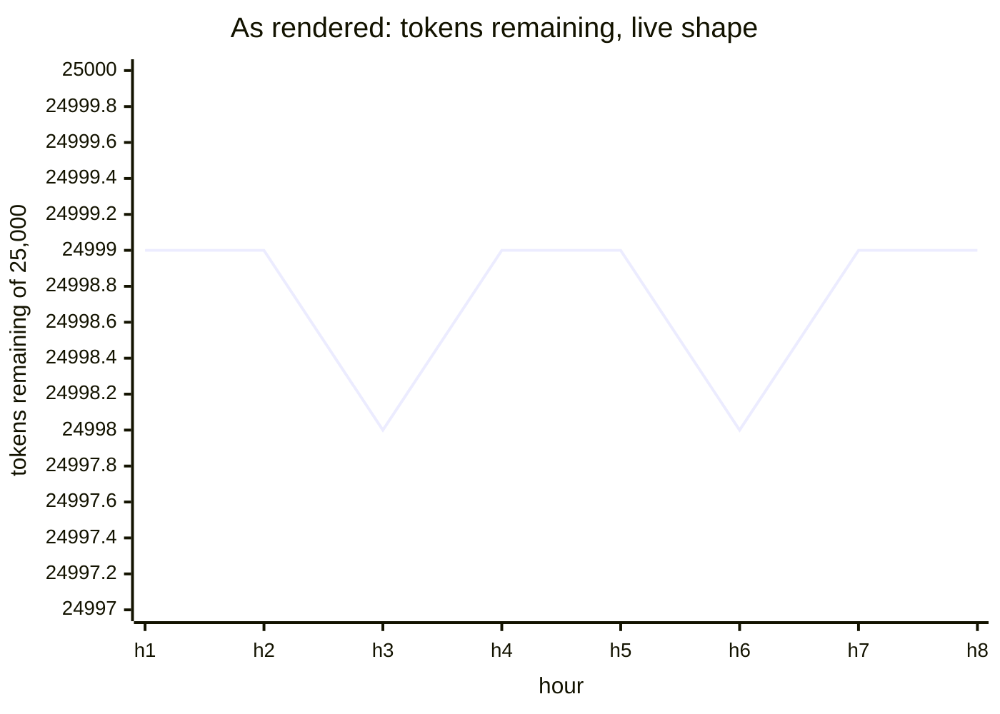
```mermaid
xychart-beta
  title "As rendered: tokens remaining, live shape"
  x-axis "hour" [h1, h2, h3, h4, h5, h6, h7, h8]
  y-axis "tokens remaining of 25,000" 24997 --> 25000
  line [24999, 24999, 24998, 24999, 24999, 24998, 24999, 24999]
```

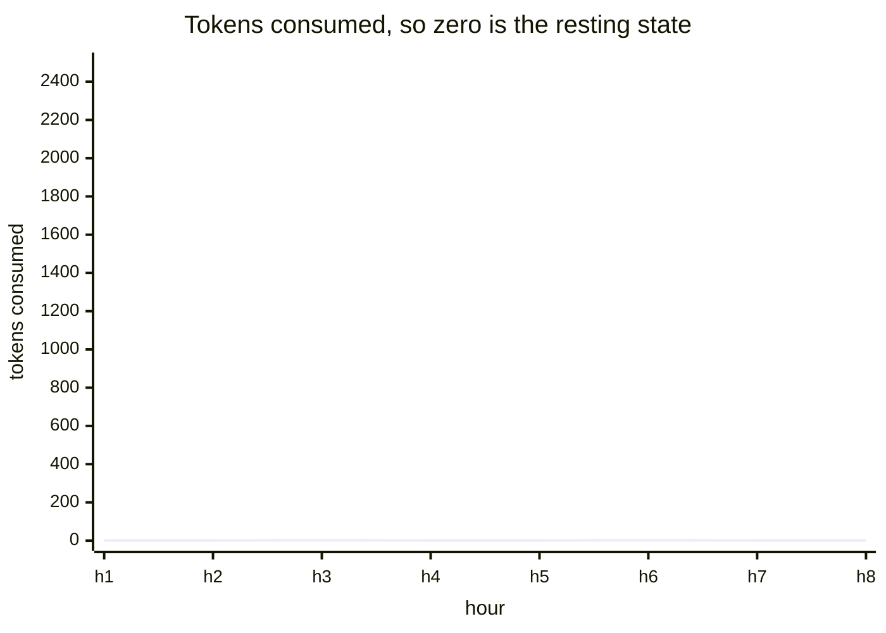
```mermaid
xychart-beta
  title "Tokens consumed, so zero is the resting state"
  x-axis "hour" [h1, h2, h3, h4, h5, h6, h7, h8]
  y-axis "tokens consumed" 0 --> 2500
  line [1, 1, 2, 1, 1, 2, 1, 1]
```

### Logins per Hour

**Replace.** Core usage, and today it goes quiet as sessions land.

**Sources.**
`internet_identity_delegation_counter`

**Formula.**
`increase(internet_identity_delegation_counter[1h])`

**Verdict.**
Counts `prepare_account_delegation` calls. Two problems: the family is a gauge that returns to zero on upgrade, and the session flow does not touch it. Live it read 51,101 seven days after a deploy, about 7,300 a day, matching the panel's 200 to 500 an hour.

**Wording.**
The panel says "logins", the metric counts calls to `prepare_account_delegation`. Those are not the same thing: one identity signing in to three apps is three of these and one login in any sense a person means. Call it "sign-ins per hour", where a sign-in is one identity being granted access to one app.

**Change.**
Source added: `internet_identity_sign_ins_total{flow, dapp}`, a real counter in persistent state. Source removed from this panel: `delegation_counter`. One panel, split by flow so the same chart shows adoption.

```promql
sum by (flow) (rate(internet_identity_sign_ins_total[5m])) * 3600
```

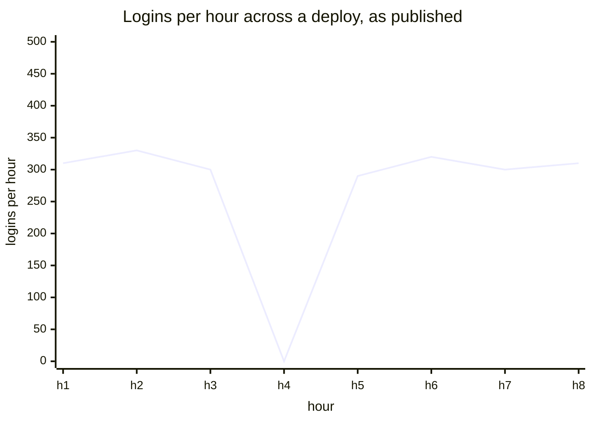
```mermaid
xychart-beta
  title "Logins per hour across a deploy, as published"
  x-axis "hour" [h1, h2, h3, h4, h5, h6, h7, h8]
  y-axis "logins per hour" 0 --> 500
  line [310, 330, 300, 0, 290, 320, 300, 310]
```

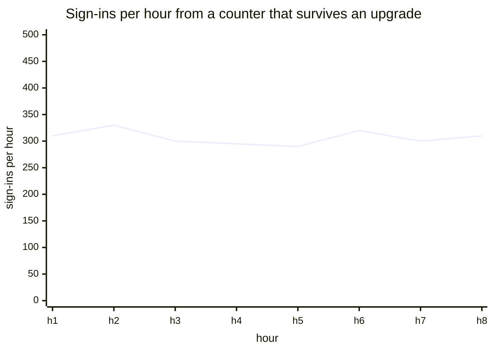
```mermaid
xychart-beta
  title "Sign-ins per hour from a counter that survives an upgrade"
  x-axis "hour" [h1, h2, h3, h4, h5, h6, h7, h8]
  y-axis "sign-ins per hour" 0 --> 500
  line [310, 330, 300, 295, 290, 320, 300, 310]
```

### Are apps adopting sessions

**New panel.** Whether the feature is being taken up at all.

**Sources added.**
`internet_identity_sign_ins_total{flow, dapp}`, a counter incremented on both `prepare_account_delegation` and `prepare_account_session`.

**Formula.**

```promql
sum(rate(internet_identity_sign_ins_total{flow="session"}[1d]))
  / sum(rate(internet_identity_sign_ins_total[1d]))
```

**Why.**
The share of sign-ins that created a session rather than handing over a long-lived delegation. This is the adoption question in one line, and the number to report when somebody asks whether the feature works. It cannot be built from `prepare_delegation_count`, which counts only the delegation flow: dividing by it would compare two disjoint populations, so the result would exceed one as adoption grew.

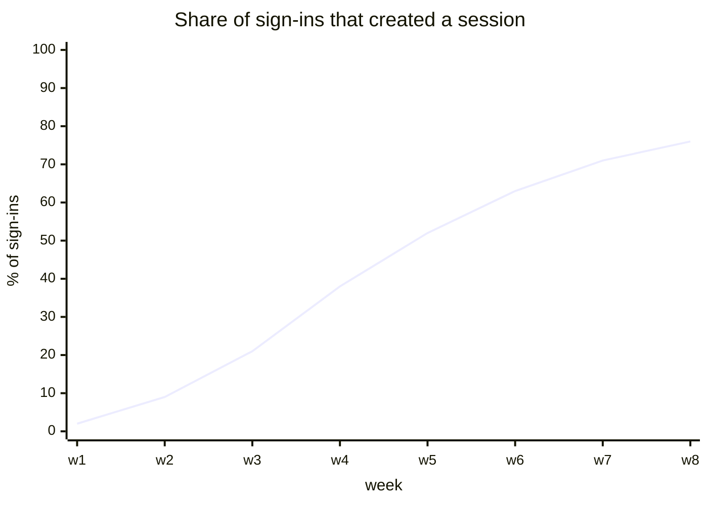
```mermaid
xychart-beta
  title "Share of sign-ins that created a session"
  x-axis "week" [w1, w2, w3, w4, w5, w6, w7, w8]
  y-axis "% of sign-ins" 0 --> 100
  line [2, 9, 21, 38, 52, 63, 71, 76]
```

### Daily and Monthly Active Identities

**Fix in place.** How many people use II, which is the number most often asked for.

**Sources.**
`internet_identity_daily_active_anchors`, `internet_identity_daily_active_anchors_by_domain{domain}`, and the monthly pair.

**Formula.**
Both families plotted together, the total legended "All domains".

**Verdict.**
The parts cannot sum to the whole and nothing on the panel says why. Live: 190 on `identity.ic0.app`, 1,893 on `id.ai`, 20 on `internetcomputer.org`, 34 on both, totalling 2,137 against a total of 3,627. The 1,490 difference is identities whose authentication carried no domain, which is what OpenID credentials do, and daily active OpenID identities total 1,485.

**Wording.**
Two terms need it. The metric family says `anchors` where the panel says identities, and identities is the right word, so the panel is already ahead of the metric name. And the `both_ii_domains` series means an identity that was active on more than one II domain during the window, not a domain of that name.

**Change.**
Source changed: publish the remainder as its own series, `domain="none"`, so the parts add up and the OpenID share is visible where a reader looks for it.

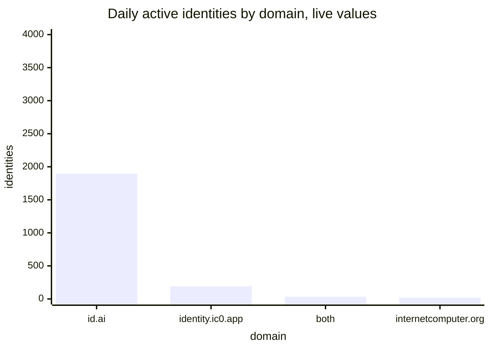
```mermaid
xychart-beta
  title "Daily active identities by domain, live values"
  x-axis "domain" ["id.ai", "identity.ic0.app", "both", "internetcomputer.org"]
  y-axis "identities" 0 --> 4000
  bar [1893, 190, 34, 20]
```

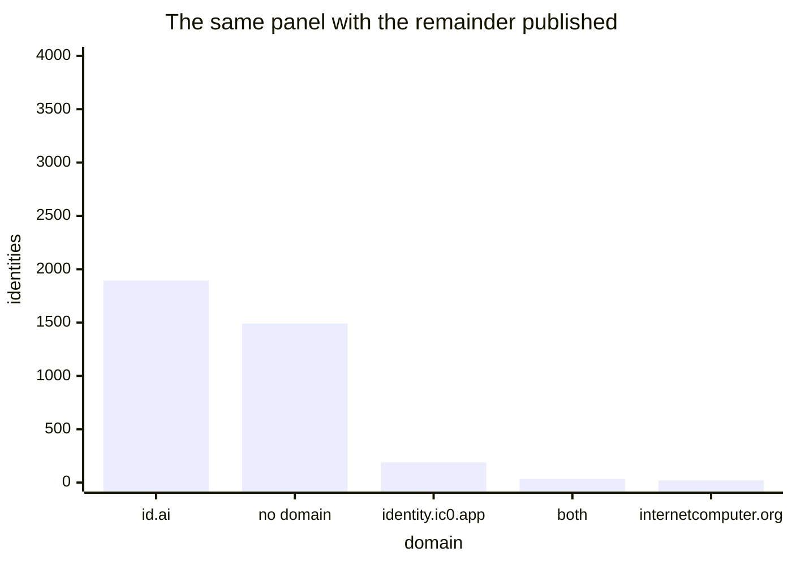
```mermaid
xychart-beta
  title "The same panel with the remainder published"
  x-axis "domain" ["id.ai", "no domain", "identity.ic0.app", "both", "internetcomputer.org"]
  y-axis "identities" 0 --> 4000
  bar [1893, 1490, 190, 34, 20]
```

### Internet Identities

**Keep.** Total reach, and the denominator for most growth questions.

**Sources.**
`internet_identity_user_count`

**Formula.**
`internet_identity_user_count`

**Verdict.**
Correct. Identities ever created, which only rises. Live: 3,222,895.

**Wording.**
The metric is `user_count` and the panel says identities. Identities is right; the metric name is the older vocabulary. Nothing to change on the panel.

**Change.**
No source change. Migrate off the Angular type; drop the area fill and the single-series legend, neither of which carries information.

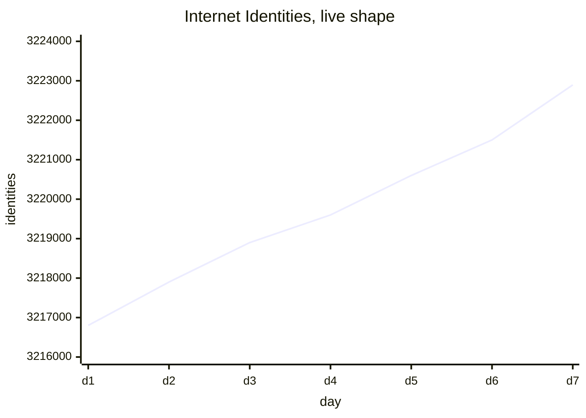
```mermaid
xychart-beta
  title "Internet Identities, live shape"
  x-axis "day" [d1, d2, d3, d4, d5, d6, d7]
  y-axis "identities" 3216000 --> 3224000
  line [3216800, 3217900, 3218900, 3219600, 3220600, 3221500, 3222895]
```

### Registrations the last 24h

**Keep.** Growth rate, and the input to the capacity forecast.

**Sources.**
`internet_identity_user_count`

**Formula.**
`increase(internet_identity_user_count[1d])`

**Verdict.**
Correct. A rolling 24-hour delta of a monotonic gauge, so `increase()` cannot be confused by a reset. The title reads as "how many today" when the line is a rolling window across the whole range.

**Change.**
No source change. Rename to "Registrations per day, rolling 24h".

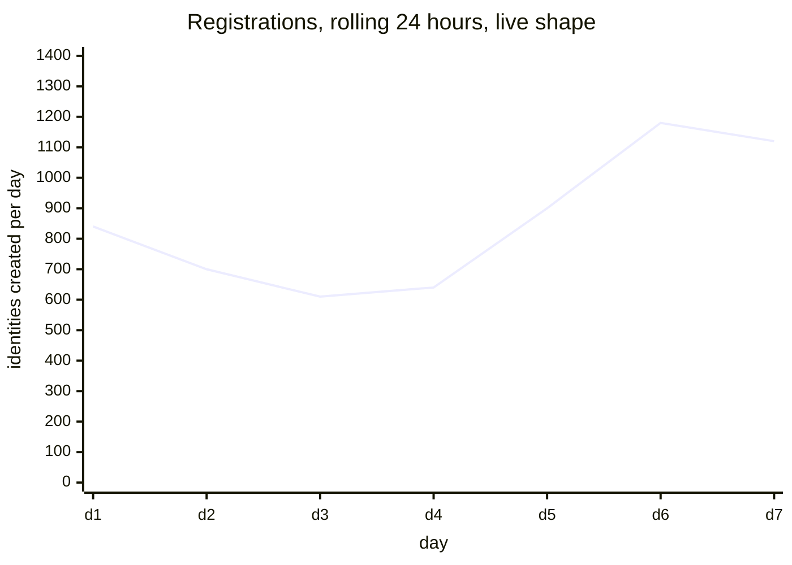
```mermaid
xychart-beta
  title "Registrations, rolling 24 hours, live shape"
  x-axis "day" [d1, d2, d3, d4, d5, d6, d7]
  y-axis "identities created per day" 0 --> 1400
  line [840, 700, 610, 640, 900, 1180, 1120]
```

### How long people stay signed in

**New panel.** Replaces two panels that claimed to measure this and did not.

**Sources added.**
`internet_identity_session_age_seconds`, a histogram with nine bucket edges, observed at removal as `min(now, valid_till) - created_at`.

**Formula.**

```promql
histogram_quantile(0.5, sum by (le) (rate(internet_identity_session_age_seconds_bucket[7d])))
```

**Why.**
The only way to learn a sign-in's length: the moment it ends is the last moment anything knows how old it was. It replaces the cumulative-session-length panels, which measure requested lifetime instead. Nine edges rather than five, because `histogram_quantile` interpolates inside a bucket and wide buckets return invented numbers.

Two limits belong on the panel. Sign-ins that ran the full 30 days all land in the top finite bucket, so quantiles above that share are meaningless. And a sign-in nobody returns to is removed only when another write rewrites its record, so abandoned ones are under-represented.

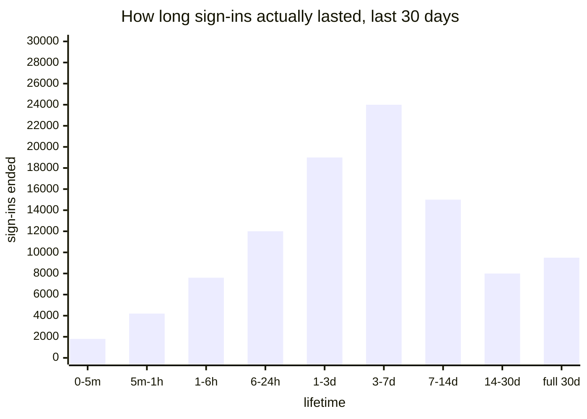
```mermaid
xychart-beta
  title "How long sign-ins actually lasted, last 30 days"
  x-axis "lifetime" ["0-5m", "5m-1h", "1-6h", "6-24h", "1-3d", "3-7d", "7-14d", "14-30d", "full 30d"]
  y-axis "sign-ins ended" 0 --> 30000
  bar [1800, 4200, 7600, 12000, 19000, 24000, 15000, 8000, 9500]
```

### Top 10 dapps by number of sign-ins, 24h and 30d

**Replace.** Which apps carry the traffic; two panels collapse to one.

**Sources.**
`internet_identity_prepare_delegation_count{dapp, window, ii_origin}`

**Formula.**
`internet_identity_prepare_delegation_count{ii_origin="ic0.app", window="24h"}`, and the same with `window="30d"`.

**Verdict.**
The canister keeps its own rolling totals per app and returns the ten heaviest, so each plotted point is the canister's window as it stood then. Three problems. The 30-day panel is the wrong chart type, because a 30-day rolling total barely moves across a 7-day view. The `ii_origin` filter is deliberate and documented, but now scopes the panel to a minority of traffic. And the family is fed only by `prepare_account_delegation`: `prepare_account_session` calls no bookkeeping at all, so a migrating app's line falls to zero while its usage is flat.

**Wording.**
The `dapp` label holds the app's origin, which the legend renders as a full URL and a canister id for most entries. That is unavoidable for canister-hosted apps, but "app" is the word for the axis and the title rather than "dapp". A sign-in here is one identity being granted access to one app, which is worth stating because the number is much larger than a count of people.

**Change.**
Source added: `internet_identity_sign_ins_total{flow, dapp}`. Source removed from these panels: `prepare_delegation_count`. Two panels become one bar ranking, with Prometheus doing the windowing:

```promql
topk(10, sum by (dapp) (increase(internet_identity_sign_ins_total[24h])))
```

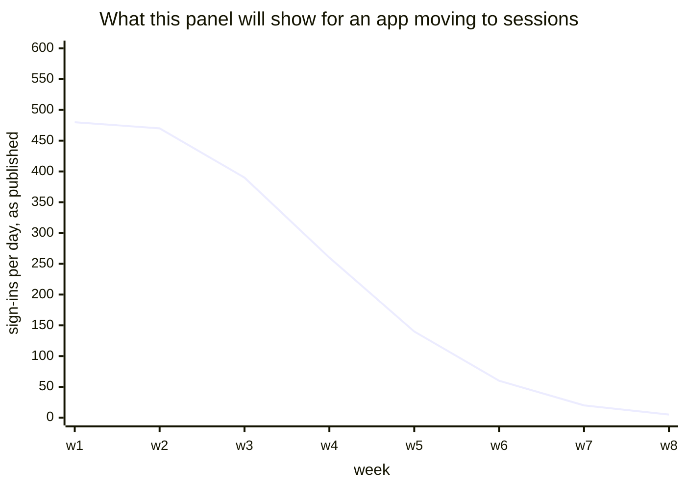
```mermaid
xychart-beta
  title "What this panel will show for an app moving to sessions"
  x-axis "week" [w1, w2, w3, w4, w5, w6, w7, w8]
  y-axis "sign-ins per day, as published" 0 --> 600
  line [480, 470, 390, 260, 140, 60, 20, 5]
```

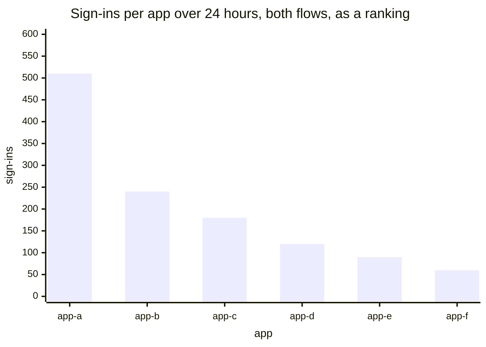
```mermaid
xychart-beta
  title "Sign-ins per app over 24 hours, both flows, as a ranking"
  x-axis "app" ["app-a", "app-b", "app-c", "app-d", "app-e", "app-f"]
  y-axis "sign-ins" 0 --> 600
  bar [510, 240, 180, 120, 90, 60]
```

### What one signed-in user costs

**New panel.** The running cost of the design, in the unit that scales.

**Sources added.**
`internet_identity_app_delegation_requests_total` from above, and `internet_identity_daily_active_sessions`, a gauge from the existing activity machinery reading the stored `last_refreshed`.

**Formula.**

```promql
sum(rate(internet_identity_app_delegation_requests_total{outcome="served"}[1d])) * 86400
  / internet_identity_daily_active_sessions
```

**Why.**
Requests per active sign-in per day. At a five-minute credential this is really a measure of how long apps stay open, and it is the figure to put beside any proposal to change those five minutes. Requests are a proxy for cost rather than cost; the cycles version is deferred below.

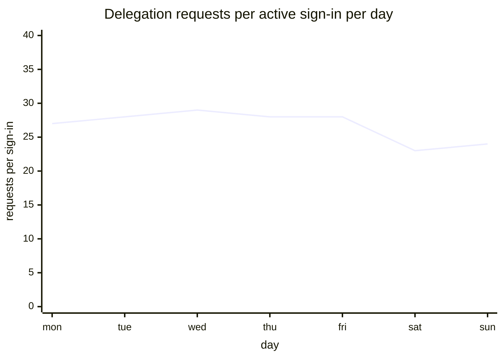
```mermaid
xychart-beta
  title "Delegation requests per active sign-in per day"
  x-axis "day" [mon, tue, wed, thu, fri, sat, sun]
  y-axis "requests per sign-in" 0 --> 40
  line [27, 28, 29, 28, 28, 23, 24]
```

### Daily and Monthly Active Authentication Methods

**Fix in place.** How people authenticate, which drives most product decisions here.

**Sources.**
`internet_identity_daily_active_authn_methods{type, issuer}`, and the monthly equivalent.

**Formula.**
The family plotted with `legendFormat: {{type}}`.

**Verdict.**
The family carries `type` **and** `issuer`, and OpenID appears once per issuer, so five distinct series all render as `openid`. Live: passkey 2,272, Google 1,412, Microsoft 52, Apple 21, recovery phrase 30.

**Wording.**
Three of the series names are internal. `webauthn_auth` is a passkey used to sign in and `webauthn_recovery` is one used to recover; `browser_storage_key` is a key held in the browser rather than in a passkey or an OpenID credential; `other` is anything the enum does not name. Renaming them to passkey, recovery passkey and browser-stored key makes the panel readable to somebody who has not read the code.

**Change.**
No source change. Set `legendFormat` to `{{type}} {{issuer}}` on both panels. A one-word fix that makes the panel legible.

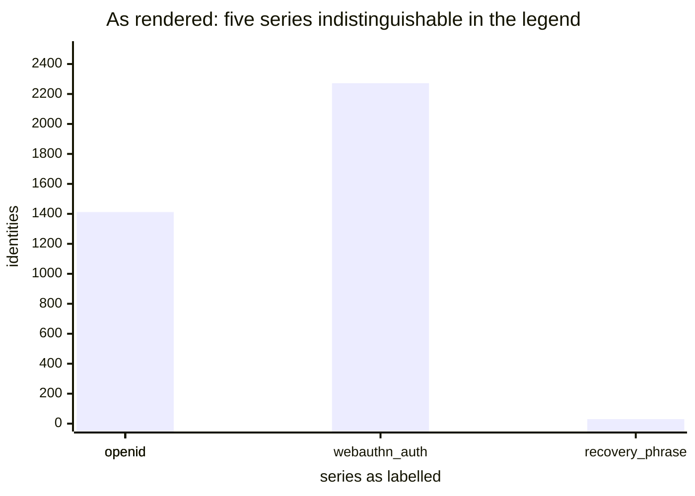
```mermaid
xychart-beta
  title "As rendered: five series indistinguishable in the legend"
  x-axis "series as labelled" ["openid", "openid", "openid", "webauthn_auth", "recovery_phrase"]
  y-axis "identities" 0 --> 2500
  bar [1412, 52, 21, 2272, 30]
```

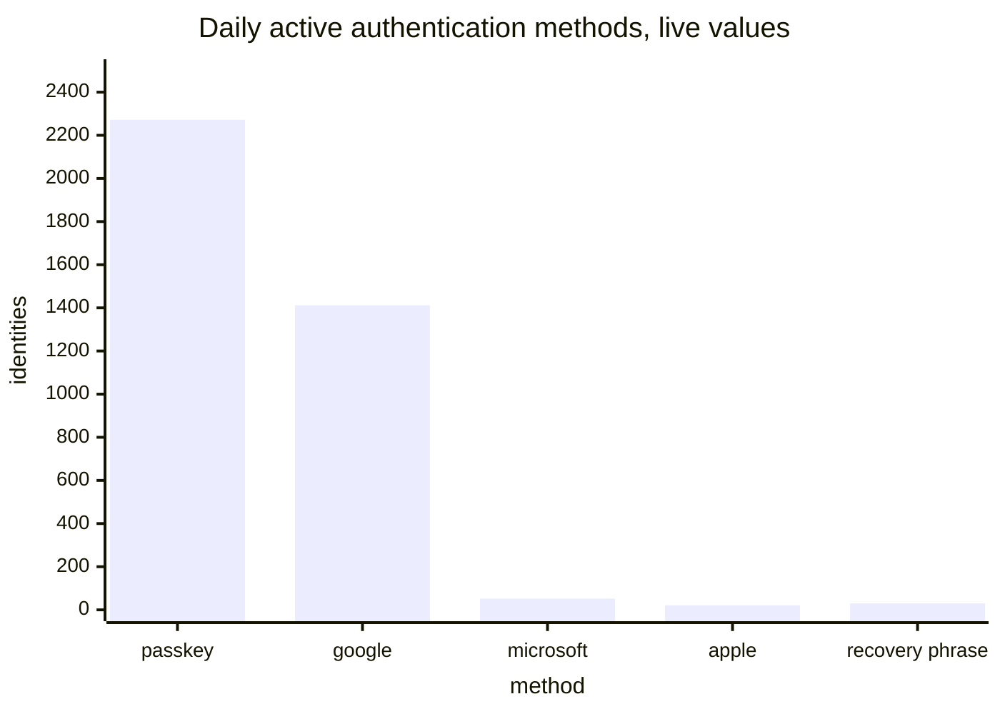
```mermaid
xychart-beta
  title "Daily active authentication methods, live values"
  x-axis "method" ["passkey", "google", "microsoft", "apple", "recovery phrase"]
  y-axis "identities" 0 --> 2500
  bar [2272, 1412, 52, 21, 30]
```

### Signature map size

**Keep.** A canary whose normal range sessions will move.

**Sources.**
`internet_identity_signature_count`

**Formula.**
`avg_over_time(internet_identity_signature_count[$__interval])`

**Verdict.**
Correct. Live delegation signatures held in the certified map: 25, ranging 5 to 30, because a signature lives for its 30-minute default expiry.

**Wording.**
"Signature map" is the internal structure. What is being counted is delegation signatures the canister is currently holding, so "Live delegation signatures" is the title.

**Change.**
No source change. Rename to "Live delegation signatures", since "signature map" is the internal structure rather than the thing being counted. And a warning: an app delegation lives 5 minutes and is replaced while an app is open, so the same users will produce more signatures each held a sixth as long. Whether the count rises or falls depends on churn against lifetime, so any threshold here needs re-deriving once sessions carry traffic rather than being assumed to hold.

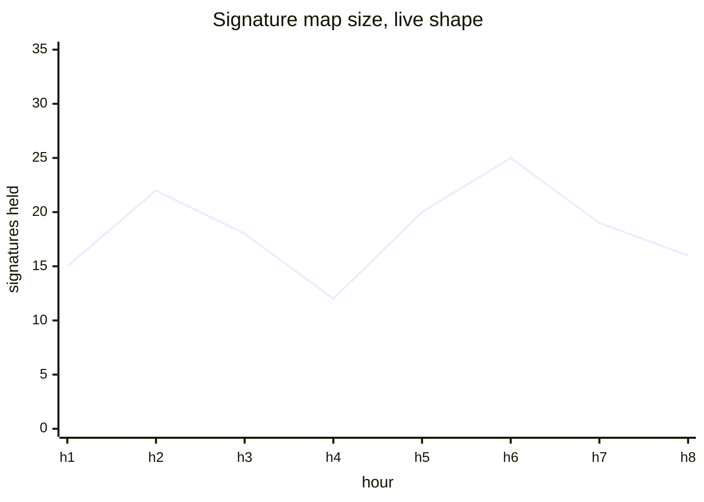
```mermaid
xychart-beta
  title "Signature map size, live shape"
  x-axis "hour" [h1, h2, h3, h4, h5, h6, h7, h8]
  y-axis "signatures held" 0 --> 35
  line [15, 22, 18, 12, 20, 25, 19, 16]
```

### Stable memory usage

**Fix in place.** Capacity against the limit that actually binds.

**Sources.**
`internet_identity_stable_memory_pages`

**Formula.**

```promql
(internet_identity_stable_memory_pages * 65536) / (500*1024*1024*1024) * 100
```

**Verdict.**
Wrong denominator. 500 GiB is the subnet's ceiling; the canister's own is `MAX_MANAGED_MEMORY_SIZE = 256 * GB`. Utilisation should be read against whichever binds first, so the live 241,794 pages is 14.8 GiB, which the panel calls 2.9 percent where against the managed cap it is 5.8.

**Change.**
No source change, though publishing the cap as a gauge would stop the constant living in a query. Divide by 256 GiB, or plot both ceilings.

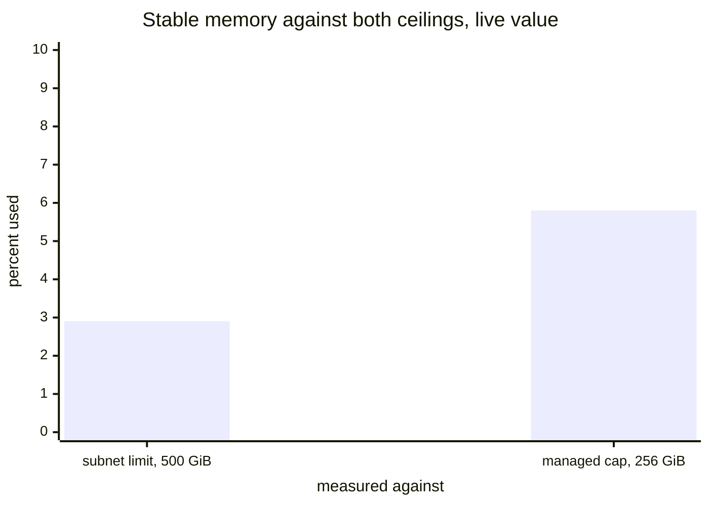
```mermaid
xychart-beta
  title "Stable memory against both ceilings, live value"
  x-axis "measured against" ["subnet limit, 500 GiB", "managed cap, 256 GiB"]
  y-axis "percent used" 0 --> 10
  bar [2.9, 5.8]
```

### Internet Identity Virtual Memory Page Sizes

**Replace.** Where the memory goes, once it is readable.

**Sources.**
`internet_identity_virtual_memory_size_pages{memory}`

**Formula.**
The family plotted per structure on a log-2 axis, in pages.

**Verdict.**
Correct and unreadable. Live there are 25 structures totalling 238,574 pages, 14.6 GiB, of which `identities` alone is 77.6 percent. The unit is pages rather than bytes, the log scale flattens the differences that matter, and the series names are storage internals.

**Wording.**
Three problems in one title. "Virtual memory" is the stable-structure abstraction rather than anything virtual, "page sizes" are counts of 64 KiB pages rather than sizes, and the series names are storage internals. What the panel answers is where the stable memory goes, so that is the title, and the unit should be bytes.

**Change.**
No source change. Two panels: a readable ranking titled "Stable memory by structure", in bytes, and the existing log view retitled to say it is a debugging view for spotting a structure that jumps by an order of magnitude. Neither should say "virtual memory page sizes", which names the mechanism rather than the question.

```mermaid
xychart-beta
  title "Stable memory by structure, live values"
  x-axis "structure" ["identities", "stable_identities", "mcp_config", "device_cred_index", "passkey_index", "event_data", "rest"]
  y-axis "MiB" 0 --> 12000
  bar [11576, 1680, 639, 415, 217, 146, 273]
```

### Days until internet identity becomes full

**Fix in place.** Long-horizon capacity, useful as a direction rather than a number.

**Sources.**
`internet_identity_max_user_number`, `internet_identity_user_count`, and `internet_identity_min_user_number`, which the panel does not read but needs.

**Formula.**

```promql
  (internet_identity_max_user_number - internet_identity_user_count)
/ (deriv(internet_identity_user_count[24h]) * 86400)
```

**Verdict.**
The numerator subtracts a count from an identity number. Anchors are assigned upward from `min_user_number`, so free slots are `max - min - count + 1`: live that is 7,569,743 − 10,000 − 3,222,895 + 1 = 4,336,849, where the query computes 4,346,848. It also sets `max: 365` on a continuous colour scale, saturating it at every value this panel will ever show. And two numbers eleven years out, four years apart, prompt nobody to act.

**Wording.**
"Becomes full" reads as an outage. What runs out is the range of identity numbers the canister has been assigned, which is a capacity-planning fact rather than an incident. Title it around identity numbers remaining.

**Change.**
Source added to the query: `min_user_number`, already published. Two panels: one corrected stat, one trend. Rename both to speak of identity numbers rather than of II "becoming full", which reads as a service outage rather than an exhausted number range.

```promql
  (internet_identity_max_user_number - internet_identity_min_user_number
   - internet_identity_user_count + 1)
/ (deriv(internet_identity_user_count[1w]) * 86400)
```

```mermaid
xychart-beta
  title "Projected days until the identity range is full"
  x-axis "week" [w1, w2, w3, w4, w5, w6, w7, w8]
  y-axis "days remaining at the current rate" 3000 --> 6000
  line [5600, 5480, 5310, 5020, 4760, 4510, 4310, 4112]
```

### Archive Entries

**Keep.** Archive throughput; the total needs a rate beside it.

**Sources.**
`ii_archive_entries_count{source="log"}`

**Formula.**
The family plotted directly. Live: about 2,718,590.

**Verdict.**
Correct, and a monotonic total is the least informative shape available: it rises whatever happens.

**Wording.**
An "entry" is one recorded operation on an identity, and the `source="log"` label distinguishes entries the archive holds in its log from other sources. "Operations archived" is clearer, and the total wants a rate beside it.

**Change.**
No source change. Two panels: keep the total for the absolute figure, add the rate, which is what shows a change in behaviour.

```mermaid
xychart-beta
  title "Archive entries per hour"
  x-axis "hour" [h1, h2, h3, h4, h5, h6, h7, h8]
  y-axis "entries per hour" 0 --> 400
  line [180, 210, 195, 240, 300, 260, 220, 205]
```

### Archive Stable Memory Usage

**Check first.** Capacity for the archive, pending its own limit.

**Sources.**
`ii_archive_stable_memory_pages`

**Formula.**
The same construction against 500 GiB.

**Verdict.**
Open question rather than a defect: whether the archive canister has a managed cap below the subnet's 500 GiB. If it does, this needs the same correction as the panel above.

**Change.**
Check the archive's own limit. If 500 GiB is right here, comment the divergence so nobody harmonises the two panels wrongly later.

### Identity Changes per Hour

**Fix in place.** Mutation volume. Steady, and rarely the thing you need.

**Sources.**
`internet_identity_anchor_operations_counter`

**Formula.**
`increase(internet_identity_anchor_operations_counter[1h])`

**Verdict.**
Correct in what it counts, device and identity mutations. Live: 7,367 since the last upgrade, about 1,050 a day. Same reset problem as Logins per Hour.

**Wording.**
A "change" here is an edit to an identity: adding, removing, renaming or protecting a device. The panel has no description, so a reader cannot tell whether it includes sign-ins, which it does not. "Device and identity edits per hour" says it.

**Change.**
Source changed: make `anchor_operations_counter` a real counter in persistent state. Same formula. Rename to "Device and identity edits per hour", because "changes" does not say what changed, and the panel has no description to fall back on.

```mermaid
xychart-beta
  title "Identity changes per hour, live shape"
  x-axis "hour" [h1, h2, h3, h4, h5, h6, h7, h8]
  y-axis "changes per hour" 0 --> 125
  line [40, 75, 30, 55, 45, 70, 95, 85]
```

### Accounts and Applications Count

**Keep.** Storage inventory. Moves slowly and answers no urgent question.

**Sources.**
`internet_identity_total_accounts_count`, `internet_identity_total_account_references_count`, `internet_identity_total_application_count`

**Formula.**
The three families plotted directly.

**Verdict.**
Correct in what it counts. Live: 17,720 named accounts, 27,563 app records, 7,489 distinct apps.

The panel's own description carries a caveat worth keeping, and worth putting on the panel rather than in a tooltip: a default account is not stored until somebody renames it, and its app record is not stored until a second account exists. Both numbers are therefore floors, not totals.

**Wording.**
The legends are "Total Accounts Stored", "Total Account References Stored" and "Total Applications Stored", and the middle one is internal vocabulary. An account reference is one record per identity per app it has signed into, so "app records" is what it is. "Account" also needs care: every identity has a default account it never named, and this counts only the ones somebody named, so "named accounts" is the honest legend.

**Change.**
No source change. Rename the legends to "named accounts", "app records" and "distinct apps", and move the floors caveat into the panel title or a text panel beside it. This is the storage-growth panel, so stored sign-ins belong here as a fourth series once a live count exists, which is in the deferred section below.

```mermaid
xychart-beta
  title "Accounts, pairings and apps, live values"
  x-axis "what is counted" ["app records", "named accounts", "distinct apps"]
  y-axis "stored records" 0 --> 30000
  bar [27563, 17720, 7489]
```

## Panels to delete

Four panels should go rather than be fixed. Deleting them matters because eight new ones are proposed above: a dashboard that only grows stops being read.

### Bounce Rate on identity.ic0.app

**Sources.** ClickHouse `http_access_important_canisters`, not this endpoint.

**Formula.** Visitors who took no authenticated action divided by all visitors, hourly, where an authenticated action is one of `('prepare_delegation', 'get_anchor_info', 'register')`.

**Why it goes.** Plausible already tracks bounce rate, and it is a frontend measurement by nature. Keeping a second copy here means maintaining a hand-written list of canister method names that has to be updated every time a flow changes, and it has already fallen behind: the current frontend signs in through `prepare_account_delegation` and registers through `identity_registration_start`, neither of which is in the list, so nearly every real sign-in is counted as a bounce. That is why the panel sits pinned at 1.0.

```mermaid
xychart-beta
  title "Bounce rate as rendered today, live shape"
  x-axis "day" [d1, d2, d3, d4, d5, d6, d7]
  y-axis "share counted as bounced" 0.94 --> 1.0
  line [1.0, 0.99, 1.0, 0.96, 1.0, 0.98, 1.0]
```

Fixing the list would produce a correct number that duplicates one Plausible already has, and would drift again at the next flow change. Delete it and let Plausible own the funnel.

### Top 10 dapps by cumulative session length, 24h and 30d

**Sources.** `internet_identity_prepare_delegation_session_seconds{dapp, window, ii_origin}`

**Formula.** The family plotted per app with `unit: s` on a log-2 axis.

**Wording.** "Session" means two different things on this dashboard, and this panel is the reason. Here it is the validity window of a delegation, fixed at sign-in. In the session work it is a record letting one browser re-issue its own delegations for one app. Deleting this panel resolves the collision; until then, any panel using the word should say which it means.

**Why they go.** The family sums the lifetimes delegations were **issued for**, fixed at sign-in and capped at 30 days, so it measures nothing about time spent signed in. Live, the top app over 24 hours reads 12,960,000 seconds from 5 sign-ins: exactly 30 days each, because that is what the app requested. The panel is a sign-in count multiplied by a constant, which is why Grafana renders it in years and why its ranking disagrees with the sign-in panel next to it.

```mermaid
xychart-beta
  title "Cumulative session length as rendered, 30 days, live shape"
  x-axis "app" ["app-a", "app-b", "app-c", "app-d", "app-e", "app-f"]
  y-axis "years of issued delegation lifetime" 0 --> 40
  bar [34, 17, 4.25, 2.13, 1.06, 0.53]
```

Two panels, replaced by the one lifetime histogram above. Until that lands, retitle these "sign-ins weighted by requested lifetime" so nobody reads them as a duration; the present title has already been read that way.

### Registration Rates / Captcha Threshold Rate

**Sources.** `internet_identity_registrations_per_second{type}`

**Formula.** The family plotted directly.

**Why it goes.** It shows "No data" and has for long enough that nobody noticed. The canister emits the family only when the rate tracker has data, and on the live canister it does not. If the captcha threshold is still a live mechanism the metric should be emitted unconditionally and the panel kept; if it is not, the panel is training people to ignore empty panels, which is expensive the first time an empty panel matters.

### The 30-day twin of the per-app sign-in panel

**Why it goes.** The canister currently keeps its own 24-hour and 30-day rolling windows, so the dashboard needs one panel per window. Once sign-ins come from a counter, Prometheus computes any window from the same series and the dashboard's own time picker chooses it. One panel replaces two, and the same argument retires the `window` label from the new counter before it is added.

## Sources to add, change and remove

Everything the entries above depend on, in one place. Cost is what it takes the canister to produce the number, which decides the order.

| Source                                                 | Action | Type      | Cost                                            |
| ------------------------------------------------------ | ------ | --------- | ----------------------------------------------- |
| `internet_identity_sign_ins_total{flow,dapp}`          | add    | counter   | one increment on two existing writes            |
| `internet_identity_app_delegation_requests_total`      | add    | counter   | one increment with a label on one update        |
| `internet_identity_sessions_ended_total{reason}`       | add    | counter   | one increment per removal path                  |
| `internet_identity_session_age_seconds`                | add    | histogram | one observation per removal path                |
| `internet_identity_browsers_evicted_total`             | add    | counter   | one increment where the list trims at 20        |
| `internet_identity_session_reclaim_passes_total`       | add    | counter   | one increment in the reclaiming pass            |
| `internet_identity_daily_active_sessions`              | add    | gauge     | existing activity machinery, `last_refreshed`   |
| `internet_identity_identities_per_app{dapp}`           | add    | gauge     | read and sort a count already stored            |
| `internet_identity_session_max_lifetime_seconds`       | add    | gauge     | constant                                        |
| `internet_identity_app_delegation_lifetime_seconds`    | add    | gauge     | constant                                        |
| `internet_identity_sessions_per_identity_limit`        | add    | gauge     | constant                                        |
| `internet_identity_browsers_per_identity_limit`        | add    | gauge     | constant                                        |
| `internet_identity_anchor_operations_counter`          | change | counter   | move to persistent state so it survives upgrade |
| `internet_identity_daily_active_anchors_by_domain`     | change | gauge     | publish the unattributed remainder as a series  |
| `internet_identity_registrations_per_second`           | change | gauge     | emit unconditionally, or drop the panel         |
| `internet_identity_prepare_delegation_count`           | remove | gauge     | superseded by `sign_ins_total`                  |
| `internet_identity_prepare_delegation_session_seconds` | remove | gauge     | superseded by `session_age_seconds`             |
| `internet_identity_delegation_counter`                 | remove | gauge     | superseded by `sign_ins_total`                  |

Every added counter needs encoding as a counter and keeping in persistent state, which takes appended optional fields. Nothing on the endpoint does this today, so it is the one piece of groundwork the whole list rests on.

## Deferred, and what each needs

Questions worth asking that none of the above answers. Each needs a timer, a sweep, a stored record or a build change first, so each is a separate decision.

| Question                                     | What it needs                                                                                                      |
| -------------------------------------------- | ------------------------------------------------------------------------------------------------------------------ |
| How many sign-ins are valid right now        | A timer sweep with a cursor stored across executions, or make expiry an event so a counter can follow it           |
| Apps and browsers per identity               | The same sweep, bucketed into `le` labels                                                                          |
| Which apps people are signed in to right now | A by-product of that sweep; it cannot be kept on writes, because expiry writes nothing                             |
| Seconds from revoking to access stopping     | A tombstone carrying the revocation time, kept about one credential lifetime, plus a histogram observed at refusal |
| Cost in cycles rather than in requests       | Instruction accounting per method, in the handlers                                                                 |
| Which release changed a number               | A version label at build time                                                                                      |
| How many people, not how many sign-ins       | A second instance of the activity machinery, keyed on an identity using a session                                  |

Settle the first row before the rest: whether expiry becomes an event or stays lazy decides whether three of these are cheap or separate projects.

## Order of work

Dashboard-only edits first, because none needs a release.

1. Add the four missing methods to the bounce-rate action list.
2. Set both authentication-method legends to `{{type}} {{issuer}}`.
3. Correct the days-until-full numerator, drop `max: 365`, add the trend panel.
4. Divide stable memory by the 256 GiB managed cap, or plot both ceilings. Check the archive's own cap.
5. Invert the rate-limit panel to tokens consumed; plot the archive buffer limit beside the buffered count.
6. Add a bytes ranking beside the log-scale memory view, and label the log one as a debugging view.
7. Make the 30-day per-app panel a bar ranking; add an archive-entries rate panel.
8. Migrate the five Angular `graph` panels to `timeseries`.
9. Retitle the cumulative-session-length panels.
10. Decide whether the registration-rate panel gets its metric or gets deleted.

Then the canister, in the order the source table implies.

11. Decide what `ii_origin` means, before anything per-app is added.
12. Encode counters as counters in persistent state, and publish the four constants.
13. `sign_ins_total` on both paths. This is the one that stops three panels going quiet.
14. `app_delegation_requests_total`, the only alertable metric and the denominator for cost per user.
15. `sessions_ended_total`, `session_age_seconds`, `browsers_evicted_total`, `session_reclaim_passes_total`.
16. `daily_active_sessions`, then `identities_per_app`.
