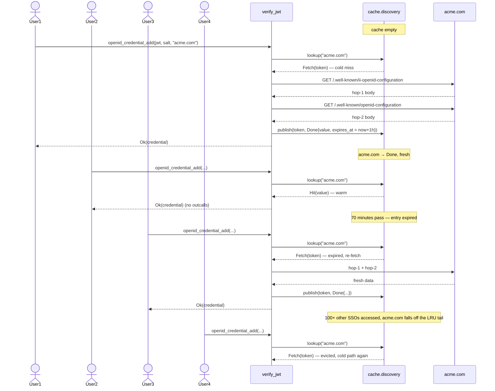
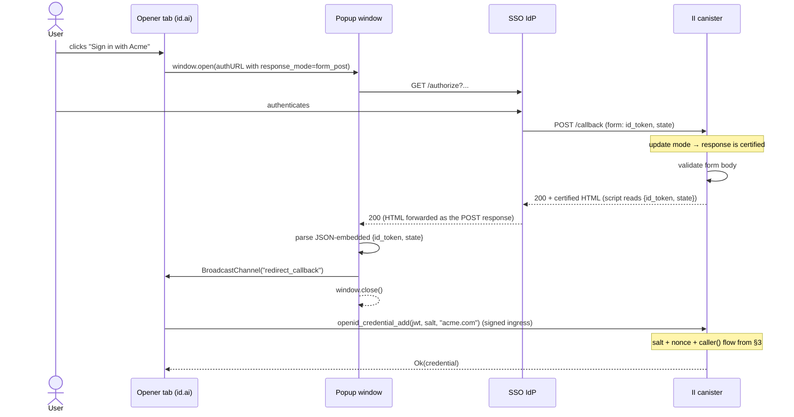
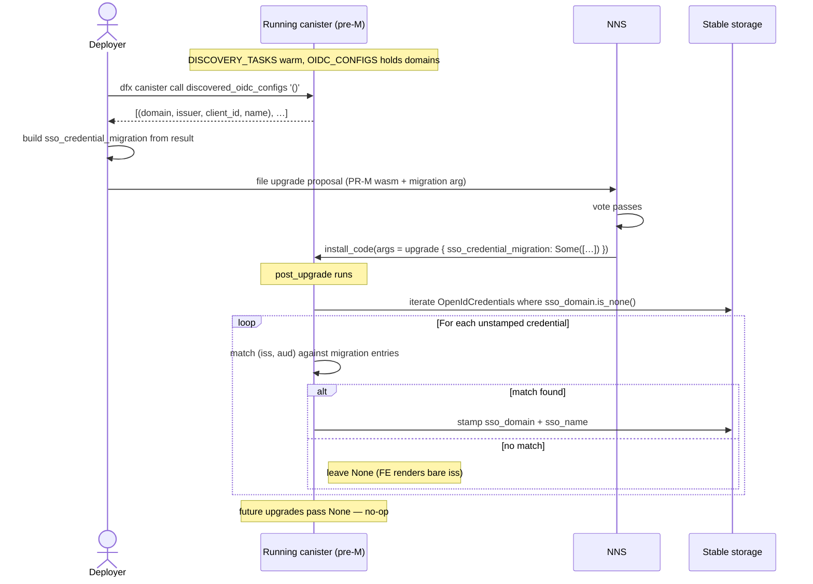
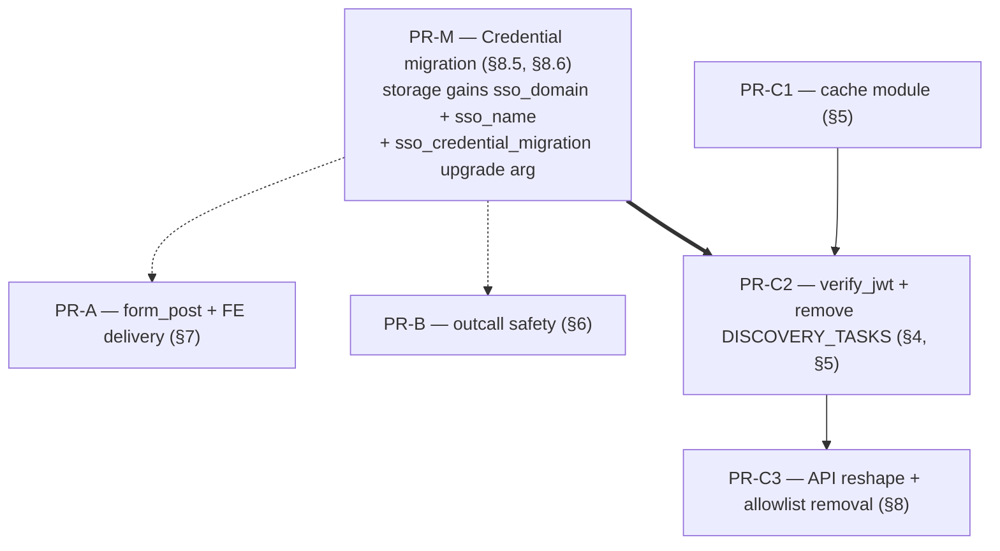

# Production-ready OpenID & SSO

**Status:** Draft — RFC for review. No code yet; this doc supersedes the SSO allowlist gate as the path to production.
**Last updated:** 2026-05-27
**Targets:** A series of independent and stacked PRs; see §9 for the dependency layout.

---

## Glossary

| Term | Meaning |
| ---- | ------- |
| **OIDC** | OpenID Connect — identity layer on top of OAuth 2.0 (RFC 6749). The IdP signs a JWT asserting the user's identity. |
| **JWT** | JSON Web Token (RFC 7519). Three base64url segments: header, payload, signature. The payload carries claims (`iss`, `sub`, `aud`, `nonce`, `email`, …). |
| **JWKS** | JSON Web Key Set (RFC 7517). Public keys the IdP publishes at `jwks_uri`, used to verify the JWT signature. |
| **`iss` / `sub` / `aud`** | JWT claims: issuer URL, opaque user identifier within that issuer, audience (OAuth client_id). The `(iss, sub, aud)` triple is the canonical key for an `OpenIdCredential`. |
| **`nonce`** | JWT claim. The IdP echoes whatever value the FE put in the authorize URL — used to bind the JWT to the requesting session. |
| **Discovery document** | OIDC standard JSON served at `<issuer>/.well-known/openid-configuration`. Declares `issuer`, `jwks_uri`, `authorization_endpoint`, `scopes_supported`, etc. |
| **II OpenID config** | II-specific indirection served at `<discovery_domain>/.well-known/ii-openid-configuration`. Declares `client_id`, `openid_configuration` URL, optional human `name`. Hop 1 of the two-hop SSO discovery. |
| **Two-hop discovery** | Hop 1: fetch `<discovery_domain>/.well-known/ii-openid-configuration` to learn `client_id` + the standard OIDC `openid_configuration` URL. Hop 2: fetch that URL to learn `issuer` + `jwks_uri`. |
| **SSO (in II)** | A discoverable OIDC provider, registered by `discovery_domain` rather than as a hardcoded entry in `open_id_configs`. Backed by `DiscoverableProvider` today. |
| **FedCM** | Federated Credential Management — browser-native API (`navigator.credentials.get`). Delivers JWTs to the page directly without a popup or redirect. Untouched by this design (see §2). |
| **`response_mode`** | OAuth parameter controlling how the IdP returns the response. `fragment` puts it in the redirect URL hash (today); `form_post` POSTs it as a form body (proposed). |
| **Anchor** | The II identity number. Maps to passkeys, OpenID credentials (`OpenIdCredential`), and other authn methods. |
| **`salt` / `session_pk`** | FE-side artifacts. `salt` is 32 random bytes; `session_pk` is the FE's session public key. `nonce = SHA256(salt &#124; session_pk)` is what the FE puts in the authorize URL. The canister recomputes and matches against the JWT's `nonce` claim, gated on `caller()` equaling the session principal — see §3. |
| **HTTP outcall** | The IC's `http_request_with_closure` management API. Replicated across consensus nodes; deterministic via a transform function. |
| **Boundary node** | The HTTPS gateway in front of canister calls. Trusted to terminate TLS but **not** trusted to preserve message integrity beyond what certification provides. |

---

## 1. Background

Internet Identity ships an OpenID/SSO stack that, today, runs behind an allowlist. The allowlist is the load-bearing reason several architectural choices in the current implementation are tolerable: a small fixed set of registered SSO domains means a `Vec<Box<dyn OpenIdProvider>>` doesn't blow up, periodic discovery timers don't fan out, and the cost of broad HTTP outcalls stays bounded.

We want to remove the allowlist and let any user register any SSO domain. That single decision exposes five problems that each need a solution before we can ship:

| # | Problem | Why the allowlist masks it today |
| - | ------- | -------------------------------- |
| 1 | The provider registry is a `Vec<Box<dyn OpenIdProvider>>` parallel to a `Vec<DiscoveryState>`, with both holding per-provider mutable state (certs, discovered iss/client_id, last `jwks_uri`). | Bounded by allowlist size, so the vec stays small. Without the allowlist, an unbounded population of registered SSOs grows both vecs without bound. |
| 2 | OIDC discovery + JWKS fetching runs on always-on timers (every 1 h for discovery, every 15 min for certs, with backoff). | Bounded by allowlist size, so the outcall fanout is constant. Without the allowlist, every newly-registered SSO adds a permanent stream of background outcalls. |
| 3 | The three HTTP outcalls (`fetch_ii_openid_configuration`, `fetch_discovery`, `fetch_certs`) all pass `max_response_bytes: None`. Transform functions re-serialize but don't validate response size or structure before parsing. | Allowlist gating means only DFINITY-curated domains are reachable from the canister, so the trust assumption is "these domains won't serve giant or malformed bodies." Without the allowlist, anyone can point the canister at anything. |
| 4 | The OAuth callback uses `response_mode=fragment`. The id_token comes back in the URL hash, the popup page reads `window.location.hash`, and BroadcastChannel forwards it to the opener. | Works with Google. Doesn't work reliably with Okta, Auth0, Apple Sign In (which deprecates fragment for hybrid flows), and is deprecated in OAuth 2.1. Limits which SSO providers we can support. |
| 5 | `add_discoverable_oidc_config` is the registration endpoint. Anyone (post-allowlist-removal) calling it would persist their SSO domain into `OIDC_CONFIGS` stable state and spawn a permanent discovery timer. | The `is_allowed_discovery_domain` gate rejects calls for non-DFINITY-curated domains. |

Problems 1–4 are architectural: each one needs a concrete redesign that lets the system stay sound when the input population is open. Problem 5 follows from the other four — once 1, 2, 3 are addressed, "anyone can register" becomes a no-op call (the discovery cache absorbs it), and the doc proposes deleting the registration concept entirely.

The four hurdles can be tackled mostly in parallel; the dependency layout is in §9.

### What this doc does **not** redesign

- **The JWT consumption pattern** (`openid_credential_add`, `openid_prepare_delegation`, `openid_get_delegation`, `openid_identity_registration_finish`). The salt + nonce + `caller()` binding that secures the JWT against compromised transports stays exactly as it is — see §3 for why.
- **FedCM**. The `navigator.credentials.get` path delivers JWTs to the FE directly through the browser; it never touches the redirect callback. Nothing in §7 affects it.
- **Hardcoded direct providers** (Google, Microsoft, Apple). Configured via the `open_id_configs` init arg, no discovery needed. Their JWKS fetch path benefits from the cache (§5) but their config is not subject to the allowlist removal in §8.
- **Governance**: who is allowed to register an SSO, rate-limit policy, cycle accounting per registration. These are policy questions, not architecture, and they are out of scope. The architecture in this doc is designed to be safe under "anyone can register" — the cache size cap and per-outcall cycle ceiling are the structural defenses. If a different gating policy is later layered on top, none of the design here has to change.

---

## 2. Goals & non-goals

**Goals**

- Lift the SSO allowlist. Any user can register and use any OIDC-compliant SSO provider.
- Bound the canister's heap usage from registered SSOs: O(cache_size), not O(registered_count).
- Eliminate always-on background outcalls for SSO discovery and JWKS fetching. Outcalls happen on demand, are cached, and time out.
- Make the OAuth callback work across the major OIDC providers (Google, Microsoft, Apple, Okta, Auth0, Keycloak, Authelia, generic OIDC). Concretely: the OAuth flow does not depend on `response_mode=fragment`.
- Bound the per-outcall blast radius: `max_response_bytes` is set everywhere, transforms reject malformed bodies before parsing, per-call cycle cost is ceilinged.
- Preserve the security property that a compromised transport cannot redeem a JWT — see §3.

**Non-goals**

- Redesigning FedCM. The browser-native 1-click path does not interact with the OAuth callback or `response_mode`.
- Replacing hardcoded direct providers (Google / Microsoft / Apple). They stay configured in `open_id_configs`.
- A governance / rate-limiting / fee policy for SSO registration. The architecture is safe under "anyone can register"; if a policy layer is later added, no design here has to change.
- Outbound communication to SSO IdPs beyond the discovery + JWKS fetch flows that exist today. We do not, e.g., implement back-channel token exchange or PKCE-based authorization code flow.
- Backwards compatibility for the existing `response_mode=fragment` callback. The form_post change is a flag-day cutover; see §9 for migration sequencing.

---

## 3. Threat model

The four hurdles change the architecture; they do **not** change the trust model that protects JWT redemption. This section makes that explicit because it's the property that constrains several otherwise-attractive simplifications in §7.

### 3.1 What the existing scheme protects

The FE generates `salt = random(32)` and `nonce = SHA256(salt | session_principal)`. The nonce goes in the authorize URL; the salt stays in FE memory. The IdP signs a JWT whose `nonce` claim equals that value. The FE later passes `(jwt, salt)` to the canister via a **signed** ingress message; the canister recomputes `expected_nonce = SHA256(salt | caller())` and rejects on mismatch.

The three secrets that have to coincide for redemption to succeed:

1. The IdP's signing key — owned by the IdP, not in scope to defend against IdP compromise.
2. The `salt` — never on the wire except inside signed ingress messages.
3. The session_sk corresponding to `session_principal` — never leaves the FE; required for the ingress signature so the canister sees `caller() == session_principal`.

Without all three, no actor (boundary node, MITM, replicating outcall transport, …) can redeem a JWT against an anchor that is not their own. This is the load-bearing security property.

### 3.2 What changes under this design

| Change | Effect on trust model |
| ------ | --------------------- |
| Stateless verifier + cache (§4, §5) | None. The verifier still runs `SHA256(salt &#124; caller()) == jwt.nonce` against `caller()` from a signed ingress message. The cache holds JWKS + discovery results, not JWTs or salts. |
| `max_response_bytes` + tighter transforms (§6) | Mitigates cycle-drain and OOM risk from a malicious SSO IdP serving giant or malformed bodies. No effect on JWT redemption. |
| `response_mode=form_post` (§7) | Adds a new canister POST handler. The handler is anonymous (the POST comes from the IdP, not the user), so it does **not** receive an authenticated `caller()` and cannot itself redeem the JWT. It is a transport translator: parse the form body, return certified HTML, hand off to the FE. The FE then runs the existing salt+nonce+`caller()` flow. |
| Allowlist removal (§8) | Adds an anonymous `discover_sso(domain)` endpoint. A malicious caller can request discovery for arbitrary domains, which fans out HTTP outcalls. Bounded by per-outcall cycle ceiling (§6) and cache LRU cap (§5). No effect on JWT redemption. |

### 3.3 Attacks explicitly defended

1. **MITM substitutes a different JWT on the way back from the IdP.** A different JWT has a different `nonce`; redemption requires `SHA256(salt | caller()) == jwt.nonce`. Without `salt` and without the session_sk, the attacker can't construct a JWT/principal pair that matches.
2. **Boundary node tampers with the `form_post` POST response.** The canister POST handler responds via update mode, so the response is certified. A tampered response is rejected by the HTTP gateway.
3. **Upstream network intermediary tampers with discovery / JWKS responses** to influence which key verifies a JWT. HTTPS outcalls are replicated — each replica fetches independently and consensus requires the (transform-applied) response to match across all of them, so a single tampered path is dropped. We further constrain via `max_response_bytes` and transform validation (§6).
4. **Cache-miss flood from anonymous `discover_sso` calls.** Bounded by (a) the per-outcall cycle cost cap, (b) LRU eviction past the cache size limit (older entries fall out under sustained pressure, sustaining repeat work for the attacker), and (c) standard replicated-outcall pricing on the IC. The doc does not propose additional per-caller rate limiting; if that becomes necessary, it is added at the gating layer, not the architecture layer.
5. **Replay of a stolen `(jwt, salt)` pair from a different session.** Already defended today: the JWT's `nonce` was computed with the original session's principal, so `caller()` from a different session won't match.

### 3.4 Attacks explicitly **not** defended

- Compromise of the IdP's signing key. Every credential issued by that IdP is at risk; that is the unavoidable trust assumption of any OIDC integration.
- Compromise of the user's device / browser that holds the session_sk. Standard endpoint compromise — out of scope.
- Phishing the user into entering credentials on a fake II frontend. This is the standard "website phishing" problem; we don't try to solve it in this layer. Note that the OAuth flow itself is structurally protected: the SSO IdP only redirects to `redirect_uri` values pre-registered for II's `client_id`, so a fake II at `evil.example` cannot complete an OAuth roundtrip against a real registered SSO — the IdP refuses to redirect there. The residual phishing surface is anything the fake II does without involving a real SSO (e.g., harvesting passkey prompts).

---

## 4. Problem 1 — Stateful provider registry

### 4.1 What it looks like today

`src/internet_identity/src/openid.rs:352`:

```rust
thread_local! {
    static PROVIDERS: RefCell<Vec<Box<dyn OpenIdProvider>>> = RefCell::new(vec![]);
    static OIDC_CONFIGS: RefCell<Vec<DiscoverableOidcConfig>> = const { RefCell::new(vec![]) };
}
```

And `src/internet_identity/src/openid/generic.rs:427`:

```rust
thread_local! {
    static DISCOVERY_TASKS: RefCell<Vec<DiscoveryState>> = const { RefCell::new(vec![]) };
}
```

Three parallel collections. `PROVIDERS` holds trait objects, each of which (`DiscoverableProvider`) owns its own `Rc<RefCell<Option<String>>>` cells for the discovered `issuer`, `client_id`, plus the `Rc<RefCell<Vec<Jwk>>>` for the certs. `DISCOVERY_TASKS` holds the *same* `Rc`s indirectly, so the periodic discovery timer and the verifier share state by pointer aliasing.

The reviewer comment at `generic.rs:422-425` flags it explicitly:

> `DISCOVERY_TASKS` is unbounded — a long `allowed_discovery_domains()` list or many admin-configured SSO providers would fan out into many periodic HTTP outcalls.

### 4.2 Why the allowlist matters here

Each entry in `PROVIDERS` / `DISCOVERY_TASKS` carries:
- ~200 bytes of pointer / `RefCell` overhead,
- a `Vec<Jwk>` of cached certs (typically ~5 KB for an active provider with 2–4 keys),
- a per-task discovery state (~few hundred bytes).

With the allowlist set to one entry (`dfinity.org` on prod), this is trivial. Without the allowlist, the population grows with every call to `add_discoverable_oidc_config` and is persisted to stable state. There is no ceiling.

The trait-dispatch design also doesn't earn its complexity. The three implementations (`Provider`, `DiscoverableProvider`, hardcoded fallback) differ only in:
- whether `issuer` / `client_id` come from a config or from discovery,
- which `email_verification_scheme` they advertise (`Google`, `Microsoft`, `None`),
- whether `discovery_domain` is `Some` or `None`.

These are data, not behavior. The `verify()` body is essentially the same in both `Provider::verify` and `DiscoverableProvider::verify` — same JWT decode, same claims parse, same nonce check, same JWKS lookup, same signature verify, same credential build. The "trait" is paying for differences that are at most a few `match` arms.

### 4.3 Solution: data-only registry, free-function verify

Collapse the three collections into one. The word **"Direct"** in the type name is deliberate: this registry holds providers **configured directly at boot from `open_id_configs`** (Google / Microsoft / Apple) — i.e. the opposite of SSO. SSO domains are never in this registry; their resolved config lives only in the cache (§5).

```rust
pub struct DirectProviderConfig {
    issuer: String,                              // may contain {placeholders}
    client_id: String,
    jwks_uri: String,
    email_verification: Option<OpenIdEmailVerificationScheme>,
}

thread_local! {
    static CONFIG_REGISTRY: RefCell<Vec<DirectProviderConfig>> = RefCell::new(vec![]);
}
```

`CONFIG_REGISTRY` holds direct providers (Google, Microsoft, Apple) from the `open_id_configs` init arg and is fixed-size at boot. SSO domains are not stored anywhere on the canister — neither in a registry nor in persistent state. The cache (§5) is the only place SSO discovery data exists, and even there it's transient.

Verification becomes a free function over the registry + the cache:

```rust
pub fn verify_jwt(
    jwt: &str,
    salt: &[u8; 32],
    discovery_domain: Option<&str>,
    cache: &mut OidcCache,
) -> Result<OpenIdCredential, OpenIDJWTVerificationError> {
    // 1. Decode JWT, extract iss + aud.
    // 2. Resolve the provider:
    //    - If `discovery_domain` is provided: look up discovery in cache
    //      (cache fetches on miss, dedup via Pending — §5), then check
    //      jwt.iss == discovery.issuer && jwt.aud == discovery.client_id.
    //    - Otherwise: scan CONFIG_REGISTRY for a Direct entry matching
    //      jwt.iss + jwt.aud (with placeholder substitution as today).
    // 3. Look up JWKS in cache (fetches on miss). Verify signature.
    // 4. Recompute expected_nonce = SHA256(salt | caller()), reject on mismatch.
    // 5. Construct OpenIdCredential from claims.
}
```

The `OpenIdProvider` trait, `Provider::create`, `DiscoverableProvider::create`, the `PROVIDERS` thread-local, and the `Rc<RefCell<_>>` plumbing all go away. The "per-provider state" that used to live in trait objects now lives in the cache, keyed by `discovery_domain` (for SSO) or `jwks_uri` (for direct providers' cert fetch).

### 4.4 What survives the refactor

- The `(iss, sub, aud)` triple as the canonical credential key. Storage layout unchanged.
- The `email_verification_scheme` enum and its `Google` / `Microsoft` semantics. Now a config field on `DirectProviderConfig`, not a trait method.
- The placeholder substitution for Microsoft's `{tid}` issuer. Same `get_issuer_placeholders` / `replace_issuer_placeholders` helpers, called from `verify_jwt`.
- The `OpenIDJWTVerificationError` enum and its `From` impls for the various caller-facing error types.

### 4.5 What changes for callers

The four JWT-consuming `#[update]` / `#[query]` methods (`openid_credential_add`, `openid_prepare_delegation`, `openid_get_delegation`, `openid_identity_registration_finish`) get an additional `discovery_domain: Option<String>` parameter. Callers using direct providers (Google/etc.) pass `None`; callers using an SSO pass the domain they registered with. The canister cross-checks the JWT's `iss` against the discovery-resolved issuer for that domain.

See §8 for the full API delta and migration story.

---

## 5. Problem 2 — Timer-driven outcalls

### 5.1 What it looks like today

`src/internet_identity/src/openid/generic.rs:469`:

```rust
pub fn init_discovery_timers() {
    set_timer(Duration::ZERO, || spawn(run_discovery_tasks()));
    set_timer_interval(
        Duration::from_secs(FETCH_DISCOVERY_INTERVAL_SECONDS),  // 1 h
        || spawn(run_discovery_tasks()),
    );
}
```

`run_discovery_tasks` walks every entry in `DISCOVERY_TASKS`, fires hop-1 (`fetch_ii_openid_configuration`), then hop-2 (`fetch_discovery`), then — if `jwks_uri` changed — kicks off a `schedule_fetch_certs` chain that re-runs every 15 minutes with backoff on failure. JWKS fetching for hardcoded direct providers runs the same `schedule_fetch_certs` chain, started in `Provider::create`.

Two costs:

1. **Outcall fanout scales linearly with registered SSOs.** With N SSOs, the canister fires roughly `N × (2/h + 4/h) = 6N outcalls/h` indefinitely, regardless of whether any user is signing in.
2. **Cache liveness assumes the timer.** Verification reads from the in-memory cert vec; if the timer hasn't caught up, the JWT verifies against stale (or missing) keys. A "discovery still pending" branch threads through `Provider::verify` and `DiscoverableProvider::verify`.

The reviewer comment at `generic.rs:422-425` flags the first cost as the blocker for lifting the allowlist.

### 5.2 Solution: on-demand fetch behind an LRU cache with dedup

**Two caches**, both globally shared (not per-anchor) and used by every JWT verification:

- `cache.discovery` — keyed by `discovery_domain`, holds the combined hop-1 + hop-2 result.
- `cache.jwks` — keyed by `jwks_uri`, holds the parsed `Vec<Jwk>`.

Both share the same shape:

```rust
pub struct BoundedLruDedupCache<K, V> {
    entries:  HashMap<K, CacheEntry<V>>,
    lru:      VecDeque<K>,        // most-recently-used at the back
    capacity: usize,              // 100 (§5.4)
}

enum CacheEntry<V> {
    /// Fetched and currently usable.
    Done { value: V, expires_at_secs: u64 },
    /// First caller is fetching; concurrent arrivals register a subscriber
    /// here and are notified when the fetch publishes a result. Implemented
    /// using the same `Waker`-backed primitive as `src/internet_identity/
    /// src/doh/cache.rs` — a subscriber is a Rust async task `Waker`
    /// captured when the future first polls Pending.
    Pending { subscribers: Vec<Waker>, started_at_secs: u64 },
}
```

One key, one entry. When a caller looks up a domain or `jwks_uri`:

- `Done` and fresh → `Hit(value)`. Touch the LRU order, return immediately.
- `Done` and expired → evict, transition to `Pending`, return `Fetch(token)` to the caller. The caller does the outcall, calls `publish(token, result)`.
- `Pending` → return `Wait(future)`. The future polls `entries[key]`; when the first caller publishes, the state flips to `Done` and every registered subscriber is woken. All waiters get the same bytes from the same outcall.
- Absent → transition to `Pending`, return `Fetch(token)`. Same as the expired path.

`Pending` entries older than `PENDING_STALE_AFTER_SECS = 120 s` are treated as abandoned (the publisher trapped post-`.await`); the next caller evicts and starts over, waking any orphaned subscribers with an error so they don't hang.

#### 5.2.1 Lifecycle of one SSO

The diagram traces a single SSO domain (`acme.com`) through cache miss → warm hit → TTL expiry → eviction. The discovery and JWKS caches behave identically; this shows the discovery cache.



The `cache.jwks` lookup that follows step 2 of every flow above is identical in shape — keyed by `jwks_uri` instead of `discovery_domain`.

### 5.3 Verification flow

For SSO (`discovery_domain` provided by caller):

```text
1. cache.discovery.lookup(domain)
     → Hit(d): use d.openid_configuration / d.issuer / d.jwks_uri
     → Wait(f): await f, then use the resolved DiscoveryResult
     → Fetch(t):
         fetch_ii_openid_configuration(domain)                    // hop 1
         fetch_discovery(hop1.openid_configuration)                // hop 2
         validate (§6); combine into DiscoveryResult
         cache.discovery.publish(t, Ok(result), now + 1h, now)
         use result
2. Verify jwt.iss == result.issuer and jwt.aud == result.client_id.
3. cache.jwks.lookup(result.jwks_uri)
     → Hit(j) | Wait(f) | Fetch(t) — same shape, fetch is fetch_certs.
4. Verify JWT signature with the kid-matching JWK.
5. If kid not in JWKS: cache.jwks.invalidate(jwks_uri) and retry once
   (key rotation case — without timer-driven refresh, the only way to
   pick up a new kid is to refetch on miss).
6. Recompute nonce = SHA256(salt | caller()), reject on mismatch.
7. Build OpenIdCredential.
```

For Direct providers (Google/Microsoft/Apple): step 1–2 are replaced by a CONFIG_REGISTRY scan as today. Steps 3–7 are identical.

### 5.4 Cache sizing and TTL

Start at **100 entries per cache**, tune up if telemetry (§11) shows non-trivial miss rates. Each entry covers one SSO domain (or one `jwks_uri`) across every user of that SSO — the cache is global, not per-anchor — so 100 is the simultaneous-hot-SSO cap, not the user count. At ~5 KB per entry that's ~1 MB across both caches, vs. the canister's 3 GB heap budget. LRU eviction takes care of the long tail of rarely-used SSOs.

```rust
pub const DISCOVERY_CACHE_CAPACITY: usize = 100;
pub const JWKS_CACHE_CAPACITY:      usize = 100;
```

Entry TTL: 1 hour for both. Matches the upstream OIDC discovery doc cache headers we've observed, and is well under the JWKS rotation window of every mainstream IdP (Google rotates ~every 4–6 h; Microsoft daily; Apple monthly). On TTL lapse, the next verifier call observes the entry as expired (per `CacheEntry::Done { expires_at_secs }` from §5.2 — checked inline on every `lookup`) and re-fetches inline, same code path as a cold start.

### 5.5 What goes away

- `init_discovery_timers` and `set_timer_interval` for discovery refresh.
- `schedule_fetch_certs` and its `compute_next_certs_fetch_delay` backoff machinery.
- `DISCOVERY_TASKS` thread-local.
- The "discovery still pending" branches in `Provider::verify` / `DiscoverableProvider::verify` — replaced by the cache's `Wait` arm, which an async verifier `await`s through.
- `Rc<RefCell<Option<String>>>` plumbing on `DiscoverableProvider` — replaced by ordinary cache reads.

### 5.6 Cycle-budget implications

Today's worst case: ~30 Gcycles per outcall × ~6 outcalls/h × N providers = ~180N Gcycles/h, ongoing forever.

Proposed worst case at steady state with a hot cache: ~0 cycles/h (no scheduled outcalls). Per-sign-in cost: ~30 Gcycles on cache miss (cold), ~0 on cache hit (warm). Multiplied by sign-in volume rather than provider count.

For DoS analysis (anonymous `discover_sso` flood): II runs on a **system subnet**, so the "reject-on-low-cycles" pressure model used on application subnets does not apply — cycle exhaustion is not the relevant failure mode. The structural defenses are instead:

1. **Per-call cycle ceilings from §6** (~5 Gcycles per hop-2 / JWKS call after the `max_response_bytes` cap). One cold-path discovery costs ~11 Gcycles total. A sustained 1 RPS flood costs ~38 Tcycles/h — measurable, not crippling.
2. **LRU cap (§5.4)** forces an attacker hammering distinct domains to do repeat work — each domain is at best a single cache slot they can hold, and only by continuing to call faster than other traffic evicts them.
3. **Boundary node throttling** is the policy lever if a real flood materialises. The HTTPS gateway in front of canister calls can rate-limit per-IP / per-canister; this is not exercised by today's traffic but is the right layer to engage if needed (see §10 open question).

The cache-miss-flood entry in §3.3 is the canonical analysis of this attack — repeated here at the cycle level to show the per-replica cost is bounded.

---

## 6. Problem 3 — HTTP outcall safety

### 6.1 What it looks like today

The three outcall sites in `src/internet_identity/src/openid/generic.rs` (lines 651, 684, 901) all share this shape:

```rust
let request = CanisterHttpRequestArgument {
    url,
    method: HttpMethod::GET,
    body: None,
    max_response_bytes: None,    // ← unbounded
    transform: None,
    headers: vec![ /* Accept + UA */ ],
};
let (response,) = http_request_with_closure(request, CALL_CYCLES, transform_fn)
    .await
    .map_err(|(_, err)| err)?;
serde_json::from_slice::<T>(response.body.as_slice())
```

The transforms (`transform_certs`, `transform_discovery`) re-serialize the JSON body deterministically across replicas — but they do **not** validate response size or content shape before parsing. `transform_certs` traps on `Invalid response status` (good) and on `Invalid JSON` (good), but accepts arbitrarily large bodies.

`max_response_bytes: None` defaults to the IC's per-outcall ceiling (2 MB). Cycle cost scales linearly with bytes returned × replication factor (13 nodes on application subnets), so a 2 MB response is ~30 Gcycles per replica × 13 = ~400 Gcycles per outcall. Multiplied by the timer fanout in §5.1, that's an attractive cycle-drain target if an attacker can register a malicious SSO domain.

### 6.2 Solution: cap, validate, ceiling

Three concrete changes:

**Per-outcall response-size caps.** Each call site declares the maximum it will accept:

```rust
const HOP1_MAX_RESPONSE_BYTES:   u64 =   8 * 1024;   // ii-openid-configuration
const HOP2_MAX_RESPONSE_BYTES:   u64 =  64 * 1024;   // openid-configuration
const JWKS_MAX_RESPONSE_BYTES:   u64 =  64 * 1024;   // jwks.json
```

Rationale:
- Hop 1 (`/.well-known/ii-openid-configuration`) is a 3-field JSON document, typically <1 KB. 8 KB gives 8× headroom for whitespace, ordering, and small future additions.
- Hop 2 (standard OIDC discovery) is larger in practice: Google publishes ~3 KB, Microsoft ~5 KB, Okta ~4–10 KB. 64 KB absorbs the largest IdPs we've measured (Keycloak with many supported algorithms approaches 30 KB).
- JWKS varies with key rotation overlap. Google publishes 2–3 RSA keys (~1.5 KB each + envelope = ~5 KB), Microsoft sometimes 5–8 keys during rotation (~15 KB), Apple publishes 1–2 keys + EC fallbacks (~2 KB). 64 KB absorbs all of these and a few more rotations' worth of overlap.

When the response exceeds the cap, the IC outcall fails with `SysFatal`; the cache `publish`es `Err`; the verifier returns `OpenIDJWTVerificationError::GenericError("Discovery / JWKS too large")`.

**Transform validation before parse.** Each transform:
1. Rejects non-200 status (today).
2. Rejects `Content-Length` exceeding the cap (defense-in-depth — the cap above is the load-bearing one).
3. Parses as `serde_json::Value` and validates required fields exist with the right types before re-serializing. A response missing `jwks_uri` should fail in the transform, not later in the verifier.
4. Strips response headers entirely (already done; cement it).

```rust
fn transform_jwks(response: HttpResponse) -> HttpResponse {
    if response.status != HTTP_STATUS_OK { return reject(response.status, "bad status"); }
    if response.body.len() > JWKS_MAX_RESPONSE_BYTES as usize { return reject(200, "too large"); }
    let Ok(certs) = serde_json::from_slice::<Certs>(&response.body) else {
        return reject(200, "invalid jwks");
    };
    // Sort keys by kid for cross-replica determinism (existing logic).
    let mut sorted = certs.keys; sorted.sort_by_key(|k| k.kid().map(str::to_owned));
    let body = serde_json::to_vec(&Certs { keys: sorted }).expect("re-serialize cannot fail");
    HttpResponse { status: 200.into(), headers: vec![], body }
}
```

Where `reject(status, msg)` builds a small canned error response with `headers: vec![]` so the body is deterministic. The verifier sees the canned error and surfaces it as a generic verification failure.

**Per-call cycle ceiling.** Today, `CERTS_CALL_CYCLES = DISCOVERY_CALL_CYCLES = 30 Gcycles`, attached to each `http_request_with_closure` call. With caps in place, the actual ceiling is bounded by `(max_response_bytes × replication_factor × bytes_per_cycle)`. Concretely:
- Hop 1: 8 KB × 13 × ~400 cycles/byte ≈ 42 Mcycles. Allocate 1 Gcycle (large safety margin).
- Hop 2: 64 KB × 13 × ~400 ≈ 330 Mcycles. Allocate 5 Gcycles.
- JWKS: same as hop 2 — 5 Gcycles.

This is a tightening of today's blanket 30 G allocation, so a cache-miss flood costs the attacker more cycles per attempt while reducing what the canister consumes per outcall.

### 6.3 What's deliberately not done

- **TLS certificate pinning.** HTTPS outcalls run independently from each replica directly to the SSO origin (no boundary node in the outcall path); each replica verifies the upstream cert against the public CA system, and consensus requires every replica to see a matching (transform-applied) response. We rely on the public CA system as the trust anchor. Pinning per-SSO certs would require an out-of-band trust anchor distribution, which is the kind of governance question (§2) we're explicitly punting on.
- **Response-header inspection.** We strip headers in the transform; we don't use `Cache-Control` to drive our TTL (we hardcode 1 h, see §5.4). This mirrors today's behaviour and avoids a malicious IdP serving `Cache-Control: max-age=100000000` to pin a poisoned key indefinitely.
- **HEAD-before-GET to size-check.** Two outcalls instead of one would double the steady-state cost. The `max_response_bytes` cap is the cleaner defense.

---

## 7. Problem 4 — Fragment callback

### 7.0 TL;DR

1. **Today**: the IdP redirects to `id.ai/callback#id_token=…&state=…`. JS reads the URL hash and forwards the token to the opener via BroadcastChannel. Apple Sign In drops `name`/`email` claims under fragment; OAuth 2.1 drops fragment-mode entirely.
2. **Proposed**: the IdP POSTs `{id_token, state}` as a form body to the canister's `/callback`. The canister handles the POST in **update mode** (so the response is certified) and returns an HTML page that delivers `{id_token, state}` to the FE — via `BroadcastChannel` for the popup case, via `sessionStorage` for the same-tab case. The FE then runs the existing salt + nonce + `caller()` flow against the canister's JWT-consuming API methods.
3. **Why the canister can't just consume the JWT itself**: the form_post POST arrives anonymously (it's the IdP making the request, not the user), so the canister doesn't see a `caller()` it can match against the JWT's nonce. The salt+nonce+`caller()` binding from §3 requires a signed ingress message from the user's session. The canister's POST handler is a **transport translator** — parse, certify, hand off.



For the same-tab (no-opener) variant, the popup steps collapse: the canister's HTML script writes `{id_token, state}` into `sessionStorage` and navigates to `/authorize?flow=openid-resume`, which reads from sessionStorage instead of a BroadcastChannel.

### 7.1 What it looks like today

`src/frontend/src/lib/utils/openID.ts:130` (`createRedirectURL`):

```ts
authURL.searchParams.set("response_type", "code id_token");
authURL.searchParams.set("response_mode", "fragment");
```

The IdP redirects back to `id.ai/callback#id_token=…&state=…`. The callback page (`src/frontend/src/routes/(new-styling)/callback/+page.svelte`) reads `window.location.href`, posts the URL string through a `BroadcastChannel("redirect_callback")`, and the opener — `requestWithPopup` — parses the fragment via `extractIdTokenFromCallback` (`openID.ts:174`).

For 1-click / top-level navigation (`authorize/+page.svelte:120-134`), the flow is the same callback URL, but instead of a popup-opener the callback page sees `sessionStorage["ii-openid-authorize-state"]` and navigates to `/authorize?flow=openid-resume`, which then reads `window.location.hash` (`authorize/+page.svelte:171`) to recover the JWT.

### 7.2 Why fragment is the problem

Two concrete drivers:

1. **Apple Sign In does not return `name` and `email` claims under `response_mode=fragment`.** It returns them only under `response_mode=form_post`, and only once per user (the first time they authorise the app). Today's flow silently loses these fields on Apple, forcing the FE to display an empty profile or prompt the user manually. This is the operational driver — not a theoretical compatibility argument. *Manually confirmed against Apple Sign In during early SSO investigation.*
2. **`response_mode=fragment` interacts badly with OIDC providers that strictly implement the hybrid flow (`response_type=code id_token`).** Okta and Auth0 either reject `fragment` outright for hybrid responses or emit it with subtle deviations (`id_token` placement, error response shape). Apple Sign In deprecates it. OAuth 2.1 drops the implicit / fragment-mode response types from the spec entirely. Without form_post, we're tied to whichever subset of providers honours the legacy mode.

There's also a passive privacy cost: the id_token sitting in the URL fragment is visible to any JS that runs on the callback page (including potentially-stale extensions, dev tools, error-tracking scripts), it survives in browser history if the page isn't replaced, and the `Referer` header strips fragments but not all third-party tooling cooperates. Form_post puts the token in a POST body — never in any URL the browser navigates to.

### 7.3 Solution: form_post + canister translator + structured FE delivery

**FE redirect URL change.** One line:

```ts
authURL.searchParams.set("response_mode", "form_post");
```

No FedCM impact: the `requestWithCredentials` path (`openID.ts:46`) doesn't use a redirect URL.

**Canister POST handler.** Add a POST `/callback` route. Today `src/internet_identity/src/http.rs:77-91` rejects everything that isn't `GET` or `OPTIONS`. Two changes:

```rust
pub fn http_request(req: HttpRequest) -> HttpResponse {
    match req.method.as_str() {
        "GET"     => http_get_request(req.url, req.certificate_version),
        "OPTIONS" => http_options_request(),
        "POST" if req.url.starts_with("/callback") => {
            // Query mode can't return certified HTML; upgrade to update.
            HttpResponse { status_code: 200, headers: vec![], body: ByteBuf::new(), upgrade: Some(true) }
        }
        unsupported => method_not_allowed(unsupported),
    }
}
```

And add `http_request_update`:

```rust
#[update]
fn http_request_update(req: HttpRequest) -> HttpResponse {
    if req.method == "POST" && req.url.starts_with("/callback") {
        return handle_form_post_callback(req.body);
    }
    method_not_allowed(&req.method)
}

fn handle_form_post_callback(body: ByteBuf) -> HttpResponse {
    // Parse application/x-www-form-urlencoded body. Reject if not exactly
    // {id_token, state} (any unknown field is fine to ignore, but both
    // required fields must be present).
    let (id_token, state) = match parse_form_post(&body) {
        Ok(v) => v,
        Err(_) => return form_post_error_page("invalid form body"),
    };
    if !is_jwt_charset(&id_token) || id_token.len() > 8192 { return form_post_error_page("invalid id_token"); }
    if !is_state_charset(&state)   || state.len()    > 64   { return form_post_error_page("invalid state"); }
    render_callback_landing(&id_token, &state)
}
```

`is_jwt_charset` accepts `[A-Za-z0-9_=.-]+` (JWT base64url plus the two `.` segment separators); `is_state_charset` accepts base64url. Both validations are belt-and-suspenders: even if the FE-side `extractIdTokenFromCallback` validation has a bug, the canister-side validation already rejects anything that could break out of the embedded JSON context.

**Certified HTML response.** The page the canister returns:

```html
<!doctype html>
<meta charset="utf-8">
<title>Internet Identity</title>
<script type="application/json" id="cb">{"id_token":"…","state":"…"}</script>
<script>
  // Hash-pinned in CSP — see security_headers() override below.
  (function () {
    const data = JSON.parse(document.getElementById('cb').textContent);
    if (window.opener) {
      // Popup case: deliver via BroadcastChannel, close ourselves.
      const bc = new BroadcastChannel('redirect_callback');
      bc.postMessage(data);
      bc.close();
      window.close();
    } else {
      // Same-tab / 1-click case: stash and navigate to authorize-resume.
      sessionStorage.setItem('ii-openid-callback-data', JSON.stringify(data));
      window.location.replace('/authorize?flow=openid-resume');
    }
  })();
</script>
```

The inline `<script>` is hash-pinned in the response's CSP (`script-src 'sha256-…'`), so swapping it for a different script is rejected by the browser. The `<script type="application/json">` block is a non-executing context; even if validation has a bug, the embedded JSON can't break out into JS. We embed via `JSON.stringify`-on-the-server-equivalent — the canister builds the JSON via `serde_json::to_string`, which guarantees `<`, `&`, `"` are properly escaped.

**FE consumer changes.**

- `extractIdTokenFromCallback` no longer parses a URL. It receives `{id_token, state}` as the BroadcastChannel message payload directly, validates state matches, returns `id_token`. Three callers in `openID.ts` and one in the test file.
- `resumeOpenId` in `authorize/+page.svelte` reads from `sessionStorage.getItem('ii-openid-callback-data')` instead of `window.location.hash`, deletes the entry after reading. Same data shape, different source.
- The callback page (`callback/+page.svelte`) is unchanged — the certified HTML from the canister is what runs the BroadcastChannel + sessionStorage logic directly.

### 7.4 Why the canister POST handler can't consume the JWT itself

Examined in §3, restated here for the §7-only reader: the POST handler runs in an anonymous context (the IdP submits the form). `caller()` is not the user's session principal. The salt + nonce + `caller()` binding that secures JWT redemption against a compromised transport (§3.1) **requires** `caller()` to be the session principal, which only the FE can prove via a signed ingress message.

A scheme that consumes the JWT in the POST handler — even with a canister-issued state token, even with a prepare/redeem dance — fails to preserve this property unless the FE later makes a separate signed call to redeem. At which point the round-trip count matches today's (three IC round-trips per sign-in), and the architecture is more complex with no security gain.

The simple translator preserves the trust shape: form_post body → certified HTML → BroadcastChannel/sessionStorage → existing `openid_prepare_delegation` / `openid_credential_add` from the FE's signed session. End-to-end identical to fragment-mode trust-wise.

### 7.5 Cost

One extra update call (the POST handler) per OAuth callback. ~2-4 s on the IC. The user is already mid-popup at this point, so the latency lands during a step they're watching; the perceived impact is small.

This update call is required for response certification (uncertified HTML responses are rejected by the HTTP gateway, and would also be a critical XSS surface if accepted — see §3.2). It cannot be avoided by routing through query mode.

### 7.6 What's intentionally not changed

- The `state` CSRF check, both in URL construction (`createRedirectURL`) and in callback validation. It moves from URL fragment to form_post body but the semantics are identical.
- The popup-vs-FedCM-vs-same-tab decision in `requestJWT`. FedCM still wins where available; popup is the fallback; same-tab / 1-click is its own path. All three are unaffected by the form_post change at the API level — only the popup and same-tab paths see a new callback shape.
- The salt / nonce / `session_pk` plumbing (`createAnonymousNonce`, session.store.ts). Unchanged.

---

## 8. Problem 5 — Allowlist removal and API reshape

### 8.1 What it looks like today

`src/internet_identity/src/openid/generic.rs:248-264`:

```rust
pub fn allowed_discovery_domains() -> Vec<String> {
    let configured = state::persistent_state(|ps| ps.sso_discoverable_domains.clone());
    if let Some(domains) = configured { return domains; }
    match state::persistent_state(|ps| ps.is_production) {
        Some(true) => vec!["dfinity.org".to_string()],
        _          => vec!["beta.dfinity.org".to_string()],
    }
}

pub fn is_allowed_discovery_domain(domain: &str) -> bool { /* … */ }
```

And `src/internet_identity/src/openid.rs:372`:

```rust
pub fn add_oidc_config(config: DiscoverableOidcConfig) {
    if !generic::is_allowed_discovery_domain(&config.discovery_domain) {
        ic_cdk::trap("…not on the canary allowlist");
    }
    /* canonicalize, dedupe, persist to OIDC_CONFIGS, spawn timer */
}
```

A registered SSO is persisted in stable state (`persistent_state.oidc_configs`), survives upgrades, and contributes a `DiscoveryState` entry plus a periodic discovery timer.

### 8.2 What we want instead

The cache (§5) absorbs anonymous calls for arbitrary domains: hit returns instantly, miss fans out to the two discovery outcalls + the JWKS fetch, publishes to cache. There is no remaining reason for the canister to maintain a persistent list of "registered" SSOs separate from "SSOs currently in cache." The cache is the registry.

That makes "registration" a no-op concept. The user (or anonymous caller, or anyone) telling the canister `discovery_domain = "okta.example.com"` is no different from the canister observing that domain naturally during a JWT verification — both paths just want the cache populated.

### 8.3 New API surface

Add one method, drop one, change four signatures.

**Added.**

```candid
discover_sso       : (text) -> (DiscoverySsoResult);
discover_sso_query : (text) -> (opt DiscoverySsoResult) query;

type DiscoverySsoResult = record {
    discovery_domain       : text;
    client_id              : text;
    issuer                 : text;
    authorization_endpoint : text;
    scopes_supported       : opt vec text;
    name                   : opt text;
};
```

`discover_sso(domain)` is an `#[update]` (because it may trigger outcalls on a cache miss). It anonymously runs the two-hop discovery via the cache and returns every field the FE needs to build the IdP authorize URL — `client_id`, `issuer`, `authorization_endpoint`, `scopes_supported`, optional `name`. The FE no longer fetches anything from the SSO domain itself: the canister is the single point of contact with `<discovery_domain>/.well-known/ii-openid-configuration` and the upstream OIDC provider, both for the discovery the FE needs at sign-in start and for the JWT verification later. On a warm cache, this returns in ~2-4 s (the update-call round-trip, no outcall). On a cold cache, ~5-8 s (two outcalls in sequence).

`discover_sso_query(domain)` is the query-mode shortcut: it returns `Some(result)` if the cache already holds a fresh entry for `domain`, or `None` on miss / expired / pending. The FE calls this first and only falls back to the update method if it returns `None`. On a warm cache this is a ~100-300 ms certified query — the user sees no progress spinner. On a miss, the FE falls through to `discover_sso` and surfaces a spinner (see §8.7).

The same outcalls that satisfy `discover_sso` populate the cache that the JWT verification path consults — so a successful `discover_sso` followed by `openid_prepare_delegation` / `openid_credential_add` skips the discovery outcall on the verify step and only pays for JWKS.

**Removed.**

`add_discoverable_oidc_config` and `discovered_oidc_configs`. The first becomes meaningless once registration isn't a thing; the second is replaced by `discover_sso` returning the same data on demand.

**Changed.**

The four JWT-consuming endpoints each gain a `discovery_domain: opt text` parameter:

```candid
// Was: openid_credential_add : (IdentityNumber, text, blob)    -> (variant {…});
//        ^ identity_number   ^ jwt  ^ salt
// Now:
openid_credential_add :
    (IdentityNumber, text, blob, opt text) -> (variant {…});
//                                ^ discovery_domain (None for hardcoded providers,
//                                                    Some(domain) for SSO)

// Similarly:
openid_prepare_delegation        : (text, blob, SessionKey, opt text) -> (…);
openid_get_delegation            : (text, blob, SessionKey, nat64, opt text) -> (…);
openid_identity_registration_finish :
    (OpenIDRegFinishArg with extra `discovery_domain: opt text`) -> (…);
```

The canister checks: if `discovery_domain = Some(d)`, run the cache lookup, and verify the JWT's `iss` matches the resolved issuer for `d`. If `None`, scan `CONFIG_REGISTRY` for a matching hardcoded provider.

Why the FE-supplied discovery_domain rather than recovering it from JWT.iss?

- Direct providers use a fixed `iss`; SSO providers can have any `iss` (whatever the upstream OIDC says). A `iss → discovery_domain` reverse index would be either incomplete (cache-warmed) or persistent (defeats the point of removing persistent state).
- The FE knows which SSO domain the user typed / clicked. It has the information for free.
- Cross-checking JWT.iss against the discovery-resolved issuer is the same security work either way — supplying `discovery_domain` is just specifying which discovery to perform the cross-check against.

### 8.4 Persistent state delta

```rust
// REMOVED from PersistentState:
oidc_configs:         Option<Vec<DiscoverableOidcConfig>>,
sso_discoverable_domains: Option<Vec<String>>,
// is_production stays — used elsewhere.
```

Both removals are upgrade-safe: serde tolerates missing fields with `#[serde(default)]`, and any deployment that previously set the init arg can stop setting it without breakage.

### 8.5 Credential storage delta

The storage `OpenIdCredential` (at `src/internet_identity/src/openid.rs:83`) gains two fields:

```rust
pub struct OpenIdCredential {
    pub iss: Iss,
    pub sub: Sub,
    pub aud: Aud,
    pub last_usage_timestamp: Option<Timestamp>,
    pub metadata: HashMap<String, MetadataEntryV2>,
    pub sso_domain: Option<String>,   // NEW — None for direct providers; Some(domain) for SSO
    pub sso_name:   Option<String>,   // NEW — human label served at hop-1 (may be None even for SSO)
}
```

Today these values are computed at response time via `openid::generic::sso_fields_for(iss, aud)`, which reverse-scans `DISCOVERY_TASKS`. After this change, the runtime lookup goes away and the values are stamped onto the stored credential at creation.

`sso_fields_for` becomes a struct-field read instead of a thread-local scan. Callers in `storage::storable` that today call `sso_fields_for(&c.iss, &c.aud)` read `c.sso_domain` / `c.sso_name` directly. New credentials created during the SSO flow have these fields stamped at creation using the in-memory `sso_fields_for` lookup that exists today.

### 8.6 Migration

Existing credentials in stable storage have no `sso_domain` / `sso_name` stamp. The mapping `(iss, aud) → (discovery_domain, name)` that we'd need to backfill them lives **only** in `DISCOVERY_TASKS` today — and `DISCOVERY_TASKS` is a thread-local rebuilt by the timer after every canister upgrade. It is not authoritative across the boundary we need to cross.

Migration is therefore the **first PR in the rollout** (PR-M, §9). It's a separate, narrow change that lands before any of the architecture tracks. The shape:

**1. Storage gains `sso_domain` and `sso_name`** (see §8.5). New credentials stamp them at creation via the existing `sso_fields_for` lookup. No behavior change for users.

**2. New init/upgrade arg field:**

```rust
pub struct SsoCredentialMigrationEntry {
    pub discovery_domain: String,
    pub issuer:           String,  // matches jwt.iss
    pub client_id:        String,  // matches jwt.aud
    pub sso_name:         Option<String>,
}

// On the existing InternetIdentityInit / upgrade arg struct:
pub sso_credential_migration: Option<Vec<SsoCredentialMigrationEntry>>,
```

**3. `post_upgrade` consumes the arg.** If `sso_credential_migration = Some(entries)`, iterate every `OpenIdCredential` in stable storage; for each one with `sso_domain.is_none()`, look up `(iss, aud)` in `entries` (linear scan is fine — `entries` is the registered-SSO count, currently small), stamp `sso_domain` and `sso_name` if a match is found. Already-stamped credentials are skipped — the migration is idempotent.

**4. Deployer workflow.** Before submitting the upgrade proposal, the deployer queries the running canister's existing `discovered_oidc_configs` query, which returns `Vec<OidcConfig { discovery_domain, client_id, issuer, name, ... }>` — the resolved view of every registered SSO. Transcribe into `sso_credential_migration` and embed in the NNS upgrade proposal. The proposal itself is the audit trail of which credentials get re-keyed:



**Edge cases:**

| Case | Handling |
| ---- | -------- |
| Registered SSO whose discovery was failing when the deployer ran the pre-flight query | Missing from the arg → credential stays `sso_domain = None` → FE renders bare `iss` (matches today's behavior when `DISCOVERY_TASKS` doesn't have the entry). Deployer can re-query later and re-submit a follow-up upgrade with the corrected arg. |
| Deployer forgets a domain | Same as above — recoverable by re-running with corrected arg. |
| New credential created between PR-M deploy and a later upgrade | Stamped at creation via the in-memory `sso_fields_for` path. No backfill needed. |
| Re-running the migration | Idempotent on `sso_domain.is_some()` — only `None` credentials are visited. |
| Direct-provider credentials (Google/Microsoft/Apple) | `sso_domain` stays `None` by design. The migration entries don't include direct providers; only SSO domains. |

After PR-M lands, every existing SSO credential is stamped from authoritative data captured at a known point in time. Tracks A / B / C1…C3 proceed without further migration concern. C2 can delete `DISCOVERY_TASKS` and `sso_fields_for` without worrying about old credentials. The `sso_credential_migration` field stays in the arg type forever (defaults to `None`); the type can be retired in a later cleanup PR once the team is confident no further migrations are needed.

### 8.7 FE changes from the API delta

- `addAccessMethodFlow` (`src/frontend/src/lib/flows/addAccessMethodFlow.svelte.ts`), `authFlow`, `authLastUsedFlow`: when the user is using an SSO credential, pass the SSO domain (already stored client-side as `sso-1-click-domain` for the 1-click case, or recoverable from the credential's metadata for the standard case) as `discovery_domain` in the four updated API methods.
- The 1-click SSO path (`authorize/+page.svelte:145-167`) replaces its `actor.add_discoverable_oidc_config({...})` + FE-side discovery chain with a single `actor.discover_sso(domain)` call. Result carries everything needed to build the authorize URL.
- **`src/frontend/src/lib/utils/ssoDiscovery.ts` is deleted.** All ~560 lines of two-hop fetch, per-hop cache, exponential-backoff retry, abort plumbing, hostname-match validation, HTTPS enforcement, and `DomainNotConfiguredError` classification go away. The canister now does the fetching, caching, and validation; the FE just calls `discover_sso` and reads the result. Removes the only FE-side direct fetch to arbitrary SSO domains (and with it, the CORS, IPv6, and timeout edge cases that module currently handles).

The FE-side simplification has its own cost: `discover_sso` is an update call (~2-4 s warm, ~5-8 s cold) whereas the FE's direct fetches today are ~200-500 ms when the SSO host is fast. For the input-debounce UX in `SignInWithSso.svelte` we accept this tradeoff — the user only ever runs discovery once per SSO before signing in, and the canister-cache means subsequent runs (same domain or other users on the same domain) hit the warm path.

**Progress indication.** The FE calls `discover_sso_query` first; on `Some(result)` it proceeds immediately, no spinner. On `None` it falls through to the `discover_sso` update call and renders a `Resolving acme.com…` spinner with a soft cancel control. The same spinner also fires the `sso_signin_discovery_cold` plausible event (§11) so we can correlate user-perceived latency with cold-cache rate. The cold-path latency is the dominant user-perceived cost of canister-side discovery; visual feedback turns a perceived hang into a known-quantity wait.

---

## 9. Rollout

### 9.1 Dependency layout



| Track | Scope | Depends on | Parallel with |
| ----- | ----- | ---------- | ------------- |
| **M** | §8.5 + §8.6. Storage adds `sso_domain` + `sso_name`. Stamp on new credentials. Add `sso_credential_migration` upgrade arg. `post_upgrade` backfills existing credentials from arg. **Lands first.** | — | (nothing depends on M except the architecture tracks landing after it) |
| **A** | §7. Form_post: `http_request_update`, FE BroadcastChannel/sessionStorage delivery, `extractIdTokenFromCallback` + `resumeOpenId` rewrites. | M (soft) | B, C |
| **B** | §6. Outcall safety: `max_response_bytes` caps, transform validation, per-call cycle ceilings. | M (soft) | A, C |
| **C1** | §5. Cache module: `BoundedLruDedupCache<K, V>`, capacity consts, dedup tests. | M (soft) | A, B |
| **C2** | §4. Wire cache into a new `verify_jwt` free function; remove `OpenIdProvider` trait, `Vec<Box<dyn _>>`, `init_discovery_timers`, `schedule_fetch_certs`, `DISCOVERY_TASKS`. | **M (hard)**, C1 | A, B |
| **C3** | §8. Drop allowlist + persistent `OIDC_CONFIGS` / `sso_discoverable_domains`. Add `discover_sso` / `discover_sso_query`. Update four API methods to take `discovery_domain: opt text`. | C2 | A, B |

**Soft vs hard dependencies.** A/B/C1 don't *technically* require M, but landing M first keeps `main` releasable at every step (no half-migrated state where storage and runtime diverge). C2 is a **hard** dependency on M: it deletes `DISCOVERY_TASKS`, and `sso_fields_for` can't reverse-scan it any more — so every credential must already carry its `sso_domain` from PR-M.

Independent surfaces in the codebase:

- M touches `src/internet_identity/src/openid.rs` (storage struct), the `InternetIdentityInit` arg type, `post_upgrade`, and any test fixtures that build `OpenIdCredential`s.
- A touches `src/internet_identity/src/http.rs` (new POST route + update handler), `src/frontend/src/lib/utils/openID.ts` and `src/frontend/src/routes/(new-styling)/callback/+page.svelte` + `authorize/+page.svelte`.
- B touches the three `http_request_with_closure` call sites in `src/internet_identity/src/openid/generic.rs`. Standalone diff in the existing architecture.
- C1 adds a new file `src/internet_identity/src/openid/cache.rs`.
- C2 rewrites `src/internet_identity/src/openid.rs` and `src/internet_identity/src/openid/generic.rs`.
- C3 changes the Candid surface (`internet_identity.did`), the four call sites in `main.rs`, the FE actor type, and `PersistentState`.

If B lands before C2, C2 inherits B's caps in the rewritten outcall sites. If C2 lands first, B retargets to the new sites. Either order works.

### 9.2 Suggested PR sequence

```text
Day 0:
  PR-M  (credential storage + migration arg)  — opens first, narrow review,
                                                lands ahead of everything else.
                                                NNS upgrade proposal carries the
                                                sso_credential_migration arg.

Day 0+N:
  PR-A  (form_post + FE delivery rewrite)     — opens once M is in.
  PR-B  (outcall safety)                       — opens once M is in. Small, lands fast.
  PR-C1 (cache module + tests)                 — opens once M is in.

Day 0+2N:
  PR-C2 (cache wiring + provider refactor)    — opens after M + C1 land.

Day 0+3N:
  PR-C3 (API reshape, allowlist removal)      — opens after C2 lands.
                                                Stacked FE PR opens at the same time
                                                or in the same PR.
```

A and B can land any time, in any order, after M, but before C2 they're standalone improvements; they don't gate C.

### 9.3 What changes when this all lands

- Heap memory from registered SSOs: O(cache_size) ≤ ~2 MB at the starting 100-entry cap.
- Background outcall fanout: zero. Discovery and JWKS fetching are sign-in-driven.
- Apple Sign In returns name + email. Okta / Auth0 / Keycloak / Authelia / generic OIDC become viable without per-IdP workarounds for fragment-mode quirks.
- Anonymous `discover_sso` lets any user point II at any OIDC-compliant SSO. No admin step.
- `src/frontend/src/lib/utils/ssoDiscovery.ts` (~560 lines of two-hop fetch + retry + cache + validation) is deleted. The FE no longer makes direct fetches to arbitrary SSO domains.
- Existing flows for Google / Microsoft / Apple direct providers: unchanged user-facing, marginally faster (cached JWKS) on warm.

### 9.4 What doesn't change

- The salt + nonce + `caller()` JWT redemption binding.
- FedCM as the preferred path where the browser supports it.
- `OpenIdCredential` `(iss, sub, aud)` storage keying. The schema gains optional `sso_domain` and `sso_name` fields; existing data is migrated by PR-M.
- The shape of `openid_credential_remove`, the attribute-sharing layer, the wizard flows.

---

## 10. Open questions

- **Cache size revisit.** Starting cap is 100 per cache (conservative); telemetry from §11 (`oidc_cache_hits_total / oidc_cache_misses_total` ratio over a 1-week window, evictions per hour) drives the decision to raise. If miss rate stays under, say, 5% we leave it; if it climbs we either raise the cap or shorten the TTL.
- **TTL on `Pending` entries.** `PENDING_STALE_AFTER_SECS = 120 s` is comfortable for IC HTTP outcalls under normal conditions. The §11 `oidc_outcall_duration_seconds` histogram is the metric that drives revisits: if the 99p climbs near 120 s we lower the timeout or widen the stale-after window depending on which way the latency tail goes.
- **Residual unstamped credentials post-migration.** If PR-M misses an SSO (failing discovery at snapshot time, deployer error), credentials for that domain stay `sso_domain = None`. The metadata layer handles `None` today (renders the bare iss), so this is not a functional break — but a follow-up upgrade with a corrected `sso_credential_migration` arg can stamp the residual.
- **`response_mode=form_post` and FedCM coexistence.** Today's `requestJWT` falls back to popup when FedCM isn't available. Form_post applies only to the popup path. If a future FedCM upgrade adds a redirect fallback we'd revisit; for now the two paths are independent.
- **Direct provider JWKS cache behaviour.** Hardcoded providers' JWKS today is fetched eagerly at canister bring-up via `Provider::create`. Under §5 it becomes lazy on first sign-in attempt. First-after-deploy sign-in pays one cache-miss outcall — masked from the user by the `discover_sso_query` shortcut for the SSO path, but direct providers don't go through `discover_sso`, so the cold-pay hits the JWT verification call itself. Acceptable but worth flagging in the rollout notes.
- **Boundary node throttling.** The IC HTTPS gateway has its own rate-limiting; we haven't measured how anonymous `discover_sso` calls interact with whatever per-canister or per-IP throttle is in effect. Worth testing pre-launch with a synthetic flood. Tied to the DoS analysis reframing in §5.6.

---

## 11. Observability

The architecture removes the timer-driven cache-warming background, so cold-cache latency surfaces directly on user-perceived sign-in time. Without telemetry, we can't tell a warm canister from a cold one, or detect when the cap (§5.4) is too tight. The metrics below are the load-bearing ones; the §10 open questions reference them by name.

### 11.1 Cache health (gauges + counters)

| Metric | Type | Labels | Purpose |
| ------ | ---- | ------ | ------- |
| `oidc_cache_entries` | gauge | `cache="discovery" \| "jwks"`, `state="done" \| "pending"` | Current cache occupancy. Watches for cap saturation (`done` near `100`) and pending-storm pathology (`pending` non-trivially > 0 for sustained periods). |
| `oidc_cache_hits_total` | counter | `cache` | Numerator of the hit-rate ratio. |
| `oidc_cache_misses_total` | counter | `cache`, `reason="cold" \| "expired" \| "evicted"` | Denominator — `cold` is a never-seen domain, `expired` is TTL lapse, `evicted` is LRU pressure. The split tells us whether to raise the cap (much `evicted`) or extend the TTL (much `expired`). |
| `oidc_cache_evictions_total` | counter | `cache` | Cap-pressure signal. Climbing trends are the trigger to raise the cap. |

### 11.2 SSO credential distribution (histograms)

| Metric | Type | Labels | Purpose |
| ------ | ---- | ------ | ------- |
| `oidc_sso_credentials_per_domain` | histogram | — | Number of `OpenIdCredential`s grouped by `sso_domain`. Reports tail-thickness of registered SSOs (do users actually use the long tail?). Drives whether the cap can stay low. Bonus per L749 reviewer. |
| `oidc_outcall_duration_seconds` | histogram | `hop="1" \| "2" \| "jwks"` | Latency of each outcall hop. Drives the `PENDING_STALE_AFTER_SECS` decision in §10 and lets us correlate user-perceived cold latency with backend cause. |

### 11.3 Plausible funnels

Existing `sso_signin_started` / `sso_signin_completed` events stay. New events:

- `sso_signin_discovery_cold` — emitted when the FE has to call `discover_sso` (update mode) because `discover_sso_query` returned `None`. Lets us measure how often users experience the cold-cache spinner described in §8.7.
- `sso_signin_discovery_query_hit` — emitted on the warm path. Numerator of the warm-rate from the user's perspective.

These feed the §10 "Cache size revisit" decision — high cold-rate is the trigger to raise the cap.

### 11.4 Migration verification (one-shot)

For PR-M specifically, two metrics are added temporarily:

- `oidc_credential_migration_total` — gauge of the count of credentials successfully stamped during `post_upgrade`. Read once post-upgrade, then unchanged.
- `oidc_credential_unstamped_total` — gauge of credentials with `sso_domain = None` that we'd expect to be stamped (i.e. that match a known SSO `iss`/`aud` pattern but missed the migration arg). Drives the §10 residual question.

Both can be retired once we're satisfied migration is complete and the team is confident no further upgrades will carry the arg.

cc @aterga
