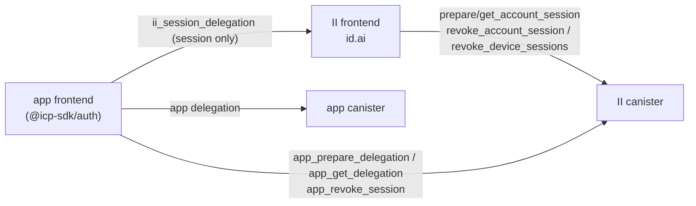
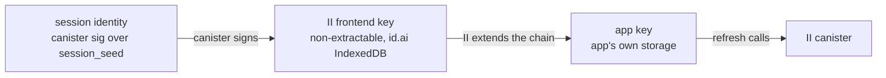
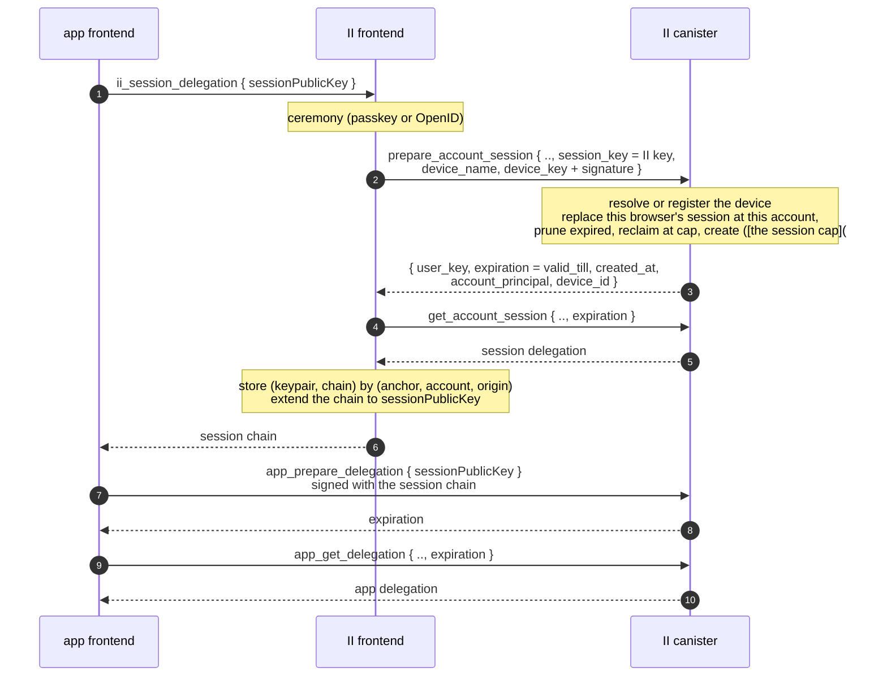
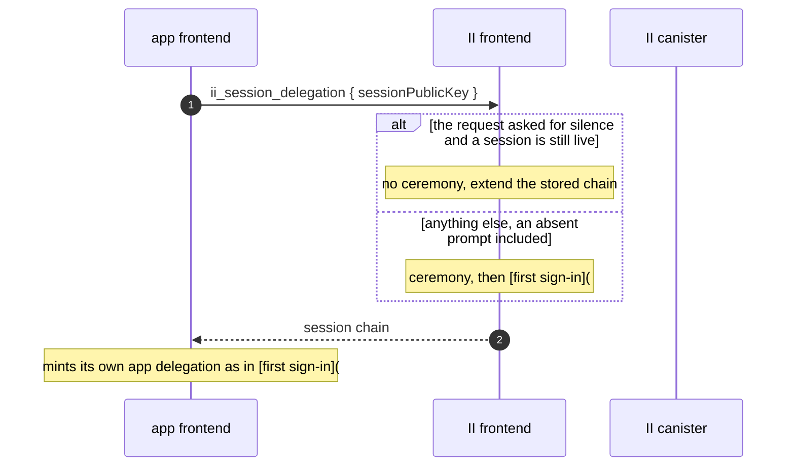
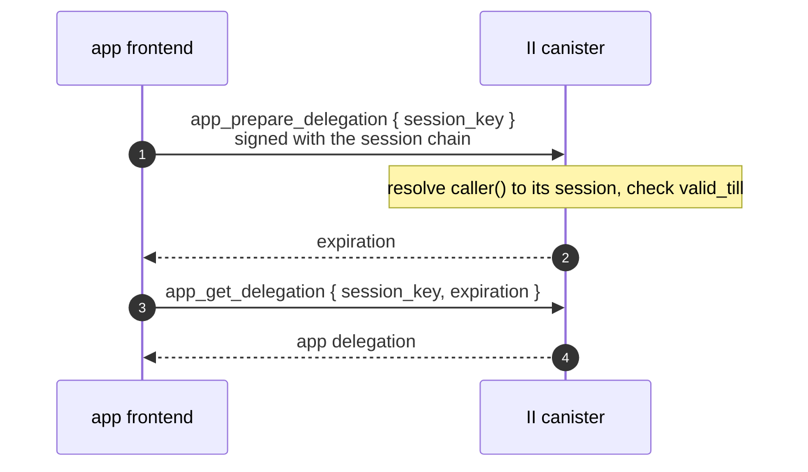
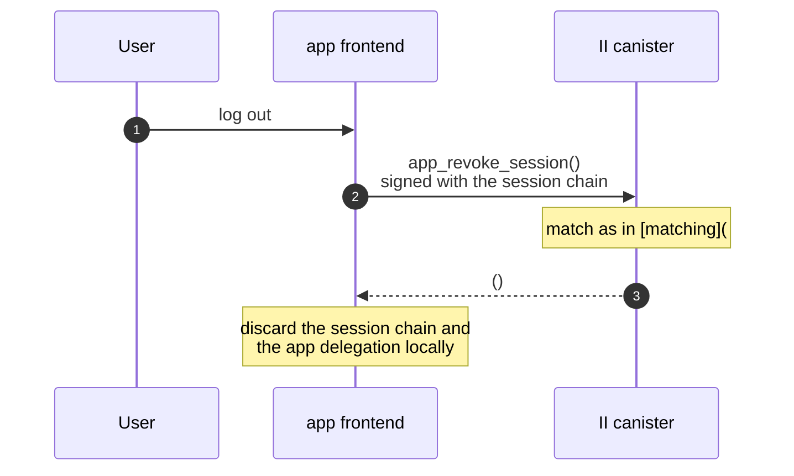
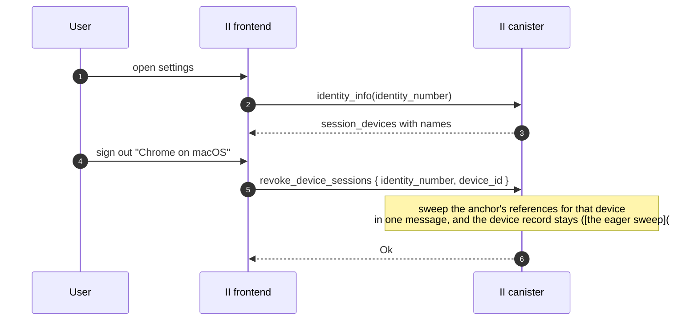

# Revocable app sessions: specification

**Design:** [revocable-app-sessions.md](revocable-app-sessions.md) covers what this builds and why. This document assumes it and does not repeat it.

**Depends on:** [tracked-default-accounts-spec.md](tracked-default-accounts-spec.md) for the account reference a session is stored on and the principal index the refresh path resolves through.

## Glossary

| Term                  | Meaning                                                                                                                                                                             |
| --------------------- | ----------------------------------------------------------------------------------------------------------------------------------------------------------------------------------- |
| **App delegation**    | The short-lived delegation the app uses against app canisters. What is up to 30 days today.                                                                                         |
| **Account reference** | The entry [tracked-default-accounts-spec.md](tracked-default-accounts-spec.md) keeps per (identity, app, account), recording that the account is in use. Where a session is stored. |
| **Reference row**     | The stored blob holding every account reference for one (identity, app), which is what a read and a write of storage actually touch.                                                |
| **Session**           | A record on that row, plus the canister-signed identity derived from it. Long-lived and revocable.                                                                                  |
| **Session chain**     | The delegation chain rooted at the session identity. Held by the II frontend, extended to the app.                                                                                  |
| **Refresh**           | The app calling the II canister with its session chain to mint a new app delegation. No browser involvement.                                                                        |
| **Silent re-auth**    | The app asking II for a delegation again, answered from II's stored session with no ceremony.                                                                                       |
| **Session device**    | A per-identity label for one browser, so a browser's sessions can be listed and revoked together.                                                                                   |
| **Locator**           | The `(anchor, application, account)` triple that identifies one account internally. Never leaves the canister: an app is only ever told the account's principal.                    |

---

## Interfaces

### Actors



Three things deliberately never happen: the app canister never talks to II, the app never goes through the II frontend to refresh, and the app's private key never reaches the II frontend.

### One audience per method

| Method                                             | Audience     | Authenticated as                 | Where                        |
| -------------------------------------------------- | ------------ | -------------------------------- | ---------------------------- |
| `ii_session_delegation` (JSON-RPC)                 | app frontend | the authorize window             | JSON-RPC method              |
| `app_prepare_delegation` / `app_get_delegation`    | app frontend | its session chain                | App-facing pair              |
| `app_revoke_session`                               | app frontend | its session chain                | Two entry points             |
| `prepare_account_session` / `get_account_session`  | II frontend  | an access method of the identity | First sign-in                |
| `revoke_account_session`, `revoke_device_sessions` | II frontend  | an access method of the identity | Anchor-authenticated methods |
| `check_session`                                    | II frontend  | its session chain                | Silent re-auth               |

#### No method serves both frontends

Each is authenticated exactly one way, so its authorization is unconditional and auditable rather than a branch. Where both frontends need the same outcome, as with revocation, they get separate methods. The audience is in the name: `app_` marks the app frontend, following the `mcp_` precedent, and unprefixed methods are the II frontend's.

The JSON-RPC method is named on a different axis, which is why it is `ii_session_delegation`
rather than `app_session_delegation`. A canister method needs its audience in the name because
every method sits on one canister, where nothing else distinguishes who is meant to call it. An
RPC method travels over a transport shared with other providers and standards, so what it needs
to say is which provider it belongs to. Every II-specific RPC method already carries the `ii_`
prefix for that reason, and only apps ever speak that interface.

`check_session` is the one exception, and worth naming as such. It is called by the II
frontend, so it is unprefixed, but it authenticates by session chain like the `app_` methods
because the silent path has no access method to offer. It reveals only whether a session the
caller already holds is still live.

That is not tidiness. Three things follow from it:

- **The two audiences cannot share an argument list.**  
  The II frontend's calls name the anchor with `identity_number`, which an app cannot supply and must never learn, so the app-facing calls name nothing at all and are resolved from `caller()` instead.
- **The `app_` set is public API.**  
  Every app and every client library depends on it, so it has to stay small and stable, and any change to it is a compatibility event.
- **The unprefixed set is internal.**  
  Only the II frontend calls it, and the frontend ships with the canister, so it can be changed freely and in the same release. That is where complexity belongs when there is a choice about where to put it.

`prepare_account_delegation` and `get_account_delegation` appear in neither list, because nothing touches them. Sessions get their own pair ([first sign-in](#first-sign-in)), so no existing method changes shape or behaviour.

### API changes

#### External candid

Called by app frontends. Public API, so it stays small and every change to it is a compatibility event.

| Item                     | Change     | Detail                                                                                        |
| ------------------------ | ---------- | --------------------------------------------------------------------------------------------- |
| `app_prepare_delegation` | new update | Mint an app delegation from a session ([the app-facing pair](#the-app-facing-pair))           |
| `app_get_delegation`     | new query  | Fetch it ([the app-facing pair](#the-app-facing-pair))                                        |
| `app_revoke_session`     | new update | Sign out ([the two entry points](#two-entry-points-with-different-authentication))            |
| `AppSessionError`        | new type   | `NoMatchingSession` and `InternalCanisterError` ([the app-facing pair](#the-app-facing-pair)) |

Three methods, and none of them names an anchor.

#### Internal candid

Called only by the II frontend, which ships with the canister. Changeable in the same release, so this is where complexity belongs.

| Item                                                                  | Change                  | Detail                                                                                                                                                                           |
| --------------------------------------------------------------------- | ----------------------- | -------------------------------------------------------------------------------------------------------------------------------------------------------------------------------- |
| `prepare_account_session`                                             | new update              | Create a session and sign it to the frontend's key ([first sign-in](#first-sign-in))                                                                                             |
| `get_account_session`                                                 | new query               | Fetch the session delegation ([first sign-in](#first-sign-in))                                                                                                                   |
| `IdentityInfo`                                                        | `session_devices` field | Devices live on the anchor, so they ride here ([the registry](#registry))                                                                                                        |
| `revoke_account_session`                                              | new update              | Revoke the sessions created at one moment at one account ([the anchor-authenticated methods](#the-anchor-authenticated-methods))                                                 |
| `revoke_device_sessions`                                              | new update              | Sign a browser out by sweeping its sessions ([the anchor-authenticated methods](#the-anchor-authenticated-methods), [the eager sweep](#signing-a-browser-out-is-an-eager-sweep)) |
| `check_session`                                                       | new query               | Whether the calling session is still live, for the silent path ([one audience per method](#one-audience-per-method))                                                             |
| `PrepareAccountSession*`, `GetAccountSession*`, `AccountSessionError` | new types               | ([first sign-in](#first-sign-in))                                                                                                                                                |

#### JSON-RPC

App frontend to II frontend.

| Item                    | Change    | Detail                                                                                        |
| ----------------------- | --------- | --------------------------------------------------------------------------------------------- |
| `ii_session_delegation` | new       | Obtain a session ([the JSON-RPC method](#the-json-rpc-method))                                |
| `icrc25` scopes         | one entry | `ii_session_delegation` joins the granted scopes, so an app can discover the method           |
| `icrc34_delegation`     | unchanged | Legacy apps, and unconditional: its behaviour does not depend on anything else the app called |

Nothing existing is removed, and nothing existing changes behaviour, so no app has to do anything until it opts in ([rollout](#rollout)).

---

## The session record

A session is an entry in a list on the account reference introduced by [tracked-default-accounts-spec.md](tracked-default-accounts-spec.md#the-records-ii-keeps-today):

```rust
SessionRecord {
    created_at: Timestamp,
    valid_till: Timestamp,
    max_idle: Duration,                 // how long it may outlive its use
    resumable: bool,                    // may a silent re-auth resolve to it
    last_refreshed: Option<Timestamp>,  // None until the first refresh
    device_id: SessionDeviceId,
    read_only: bool,                    // from the consent that created it
}
```

Nothing else. Every field except `last_refreshed` is fixed for the session's life, which is also why `last_refreshed` is the only one absent from the seed ([session identity](#session-identity)).

`max_idle` and `resumable` are the two things an application asks for that outlive the ceremony. Both are covered below: [a session that outlives its use](#a-session-that-outlives-its-use) and [resumability](#resumability).

`read_only` is here rather than being a per-call argument because it describes what the session authorizes, so it has to be part of what a user sees and revokes. Same as MCP's grant.

`last_refreshed` exists for the user rather than for the canister. "This browser used this app 3 minutes ago" against "5 weeks ago" is what makes a session list worth reading, and it is the signal that lets someone spot a session they do not recognise _still being used_ rather than merely still existing. [what refresh writes](#what-refresh-writes) covers what it costs.

Consequences of putting sessions on the reference rather than in their own map:

- Revoking, expiring and evicting all reuse machinery that already exists.
- The row is written on create, on remove, on every refresh ([what refresh writes](#write-it-every-time)), and on any sign-in or rename that touches it.
- A row read yields every account of that identity at that app, with all their sessions, in
  one get, and is rewritten whole on any change. So the cost of any pass over sessions tracks
  the number of apps involved, not the number of sessions.
- The reference list is keyed `(anchor, application)`, so one identity's rows are a contiguous
  range. That range is what every identity-scoped operation uses: counting, pruning, and
  finding the sessions of one browser ([the session cap](#the-session-cap)).

### A session that outlives its use

`valid_till` bounds a session absolutely. It says nothing about whether anybody is still there, so a browser abandoned an hour after signing in holds a usable session for the rest of thirty days.

`max_idle` bounds it relatively: a session from which nothing has been minted for that long is over, whatever `valid_till` says. Resolving one checks both.

The signal costs nothing, because it is already written. `last_refreshed` advances on every refresh and already drives eviction ordering under both caps, and [what refresh writes](#write-it-every-time) establishes that the write happens anyway. Expiry is a comparison at resolve time — no sweep, no new field to maintain, and the pruning of [expired records](#expired-records-are-pruned-on-writes-that-were-happening-anyway) collects them on writes that were happening regardless.

The range is 10 minutes to the session's own granted length, and an application that asks for nothing gets the session's length, which constrains nothing. The floor is not arbitrary: an app delegation lasts five minutes and an active application replaces it a little before it expires, so a bound near that would end sessions plainly in use. Ten minutes is already the floor on session length, so this shares a range rather than introducing a second.

What the canister sees is mints, so "idle" here means no app delegation has been asked for. That is a narrower thing than a user being away, and it is the client's job to keep the two aligned: [client-app-sessions.md](client-app-sessions.md) has a browser mint on real user activity, so a present user with a quiet application still refreshes. Without that half, an application whose user is reading rather than clicking would be ended while they watched.

It replaces a timeout the client used to enforce alone. A timer in a page cannot be relied on — clearing storage or running where it does not fire simply skips it — and it saw one document, so a backgrounded tab signed out a user working in the tab beside it. Here it is enforced, and because a session belongs to a browser rather than a document it covers every tab of that browser at once.

### Resumability

`resumable` says whether a silent re-auth may resolve to this session. It is asked for at the ceremony and fixed for the session's life.

An application that keeps nothing locally has, until now, still had its sign-in kept here — so "nothing reaches disk" was true of that application's origin and false of the sign-in, and a `prompt=none` would hand the whole thing back. `resumable: false` is how an application says it means it.

What it does **not** do is remove the record. The session still exists, still mints for the browser holding its chain, and is still bounded by `valid_till` and `max_idle`. What changes is that nothing can find it again: a silent re-auth passes it over as though it were not there.

Two consequences worth stating.

A silent re-auth that does resolve inherits the resumability of the session it resolved from, rather than taking it from the request. Otherwise a domain whose siblings each acquire their own would have to ask for it on every one of them, and forgetting it on a single origin would end resumption one hop later, for reasons nobody could see.

And what Internet Identity's frontend keeps is split in two: the account mapping — principal to anchor, account and origin — separately from the session key and its delegation. `resumable: false` drops the second and keeps the first, so a `hint` still resolves after the session has gone. The application gets an interactive sign-in aimed at the right account rather than an account picker, which is the difference between _this sign-in may return_ and _we still know who you were_.

### Finding a session from a call

A refresh arrives with nothing but `caller()`, the principal at the root of the app's chain,
which is the session's own principal. One index turns that into a session, a new map at
memory index 35, alongside the application allocator at 33 and the principal index at 34
([what an anchor can accumulate](tracked-default-accounts-spec.md#what-an-anchor-can-accumulate)):

```rust
StableBTreeMap<Principal, StorableSessionHandle>

StorableSessionHandle { account_principal: Principal, device_id: SessionDeviceId, created_at: Timestamp }
```

The account principal resolves to `(anchor, application, account)` through the
[principal index](tracked-default-accounts-spec.md#the-principal-index), the row read follows
from that, and the browser together with the creation time picks the record inside it.

The creation time is what makes that pick exact, and it is not redundant with the browser. A
browser keeps its id across sign-ins, so on the browser alone an entry that outlived its
session would resolve to whatever that browser created next — the holder of a revoked chain
authenticated as a session they never had. Both fields are seed inputs, so an entry can only
ever resolve to the one session whose principal is its own key.

It names the account by principal rather than by locator on purpose. Materialising a default
changes its locator and leaves its principal alone, so a handle that named the locator would
have to be rewritten for every session of an account the moment the user named it. Naming the
principal means that rename touches one entry in the principal index and no session at all.

That also removes the need for anything to travel with an app-facing call: the caller
identifies its own session, so no account has to be named in a request or attached to it.

### The session cap

Five hundred session records per identity, counted as stored rather than as live. Reaching
it does not fail a sign-in; it reclaims.

Counting what is stored is what makes the cap cheap to trigger on. A session expires with no
write anywhere, so no counter can follow the live set: something would have to decrement at
the moment of expiry, and nothing runs then. A stored count moves only when something writes,
which is the only count a counter can hold. An expired record keeps its slot until something
reclaims it, and because it is the first thing reclaimed, a held slot is never taken from a
session in use.

The number is a bound on concurrent activity, which is what a session is. Accounts accumulate
over an identity's lifetime, so their cap is a history bound and sits in the hundreds for that
reason. Sessions cannot accumulate that way, because every one of them dies within thirty
days: the stored set is the accounts signed in to since the last reclaim times the browsers
they were used from, live records and the expired ones nobody has come back to prune. A heavy
user with fifty apps, several accounts among them, across five browsers lands in the low
hundreds. Five hundred is above anyone real and far below anything that costs the canister.

On create:

1. If the browser already holds a session at this account, delete it
   ([one browser, one session per account](#one-browser-one-session-per-account)).
2. Prune the expired records on the row being written.
3. If the identity is at the cap, reclaim down to a watermark of 450.
4. Insert.

Reclaiming walks the identity's rows once and takes dead sessions before live ones. Among the
live, it takes the smallest of

```
last_used + (last_used − created_at)
```

where `last_used` is `last_refreshed`, or `created_at` for a session whose app never asked for
a delegation at all. Read it as: how recently the session was used, extended by how long it
stayed in service.

The extension is the whole point, because recency alone gets the common case backwards. An app
opened once and abandoned yesterday was touched more recently than an app in weekly use that
was last opened three days ago, so plain recency spends the one the user relies on and keeps
the one they will never open again. The extension is what separates them, and it needs no
constant of its own: the span it adds is bounded by the session's own thirty-day lifetime.

Nothing here bounds a flood of sign-ins. A session's standing rises with use, so a party that
can provoke sign-ins and keep refreshing them can outrank sessions an identity has left idle.
What stands between that and the cap is the ceremony: creating a session needs an access
method, so a flood costs one authenticated sign-in per session. Anything stronger — a quota on
sessions nobody has returned to, or per-browser shares — is a decision for whoever finds this
bound too weak, and it is not made here.

Three things bound the pass. It reclaims to the watermark rather than to the cap, so it runs
once and then not again until fifty more sessions have been created. A `session_count` on the
anchor decides whether to run at all, so a sign-in below the cap reads nothing extra. And it
writes at most one row per row it takes from, and takes at most fifty — the distance between
the cap and the watermark — however many rows it read.

It reads every row the identity has rather than a bounded prefix of them, because the number
it returns is what the cap is enforced against: a truncated scan would undercount, and the
undercount would become the counter. Those rows are already bounded, by the row cap and the
account cap together, and reading them sequentially costs a fraction of the writes the pass
saves.

That counter is a trigger, and the cap is not enforced against it. Every path that removes a
session decrements it, so it should agree with the rows — but it is one number maintained by
seven call sites, and a single missed decrement would make it disagree in the direction that
matters. So once it reaches the cap, the reclaiming pass counts what the rows actually hold
and returns that, and the sign-in is admitted against the count rather than the counter. A
counter that has drifted high therefore costs one extra pass, never a refused sign-in.

Drift in the other direction is the one the recount cannot catch, because a count below the
cap is exactly the case that skips the recount. That is why every removal path decrements,
and why the requirement is on the writers ([REC-11](#requirements)) rather than on the
reader: a missed decrement would let the stored set climb past the cap silently.

Reclaiming happens **before** the new session is admitted, not after. The stored set therefore
never sits above the cap, not even for the remainder of one message.

Blocking would be the wrong failure here for the same reason it is wrong at the row cap and
the browser cap: the user is trying to sign in, and the only thing that could refuse them is
internal bookkeeping.

### What that bounds

At most 500 stored session records per identity, and no separate per-reference cap: since a
browser holds one session per account and browsers are capped at 20, no single account
reference can carry more than twenty regardless.

A row carries no exemption for holding a live session, and that is a deliberate choice
rather than a concession to the cap.

The row is what makes an app visible in settings. Sparing it would leave the user with
access they hold and cannot see, which is the one state this whole design exists to remove:
a session nobody can find is a session nobody can revoke. So a row and its sessions live and
die together, and what the user loses is a ceremony rather than an account, since a session
is not bound to the access method that created it and the next visit is served a new one.

The capacity argument points the same way. Exempting live rows would let an identity hold
rows past its cap indefinitely, because a browser refreshing every five minutes keeps its
row alive forever.

### Expired records are pruned on writes that were happening anyway

**Expired entries are pruned only when the list is written for another reason**, which
includes refresh: that call rewrites the whole row anyway ([write it every
time](#write-it-every-time)), so filtering the dead siblings out costs one pass over a list
already in memory and no write of its own.

That is what keeps the design free of any sweep. What it reaches is narrower than it sounds.

Refresh cleans the row for the account being used, so an app in use never accumulates dead
records. What it cannot reach is a row for an app the user has stopped opening: that row is
never refreshed, so its expired records sit there — on an identity that is otherwise perfectly
active.

Those records are reclaimed by [the session cap](#the-session-cap) instead, which is why its
pass walks every row the identity owns rather than the one being signed in to. The identity's
next sign-in at the cap is what spends them, and since expired records are the first thing it
takes, they are spent before anything the user still relies on.

If the identity itself stops coming back, nothing reclaims them at all, and that is fine:
[minting treats an expired session as
absent](#expired-revoked-and-never-matched-are-one-outcome), so what is left is bytes rather
than access, bounded by the same cap as live data. Nothing has to walk every identity on a
timer to find work that the identity that created it will pay for on its own return.

---

## Session identity

```
session_seed = H(salt, "session", account_seed, created_at, device_id)
```

with every field length-prefixed. `account_seed` is the account's own seed, the one its
principal derives from.

Building on the account's seed rather than on the identity, application and account numbers
is what makes a session survive anything that leaves the account's principal unchanged.
Naming a default account is exactly that: it gains an account number and a name, and keeps
deriving from the identity it was conjured from, so its principal is unchanged. Had the
numbers been inputs, naming an account would have changed every session's seed and signed
the user out of every app using it.

The construction needs no allocator: no counter cell, nothing to retire. Uniqueness across
identities and apps is inherited from the account seed, which already distinguishes them.
Unguessability comes from the salt, which is hashed into the account seed and again here.

`created_at` and `device_id` are inputs, so a session's attribution cannot be rewritten in
storage without invalidating the session.

Only the record's **immutable** fields feed the seed, which is why `last_refreshed` is not
one: a mutable input would change the session's principal every time it was stamped.
`read_only` is immutable and could be an input, but deliberately is not. It is a property of
the authority rather than of the identity, and binding it would mean a consent change had
to mint a new principal.

The `"session"` tag keeps the two seed families apart, so a caller holding an app delegation
for the account cannot derive to any of its sessions. That is what stops an app delegation
minting its own replacement.

### One browser, one session per account

`time()` is the round time, so every message in one round sees the same value, and two
records sharing an account, a device and a round would derive the same seed.

Creating a session cannot produce that. A ceremony from a browser that already holds a
session at this account **replaces** it: the old record is deleted and a new one minted. So
one browser has at most one session per account, no two records can share a device and a
round, and there is no collision to guard against.

Replacing rather than reusing is what bounds a stolen session's life by something the user
does. A copy of this browser's profile holds the old session's chain; the user's next ceremony
for that app deletes the record it names, and the copy's next refresh finds nothing. Reuse
would have left it working until the thirty days ran out. It also removes a special case:
there is no longer a consent to compare, because a change of consent and a repeat of the same
consent take the same path.

The seed relies on this property. If a browser were
ever allowed to hold two sessions at one account, this would have to change: either the
seed gains a discriminator, or creation has to reject the second one.

---

## Creating a session

### Chain shape



- The canister signs the session identity to a **non-extractable** key the II frontend generates, and the frontend stores the pair keyed by `(anchor, account, origin)`.
- To give the app access, the frontend **extends the chain** to a public key the app supplies. No private key is shared and and the frontend's key stays non-extractable.
- `caller()` derives from the chain's root, the canister-signature key over `session_seed`, so it is the session principal at any chain depth. The canister-side lookup is depth-agnostic.
- The app's hop carries `targets: [ii_canister_id]`. II has never set `targets`, though `delegation_signature_msg_with_permissions` already accepts them. This is a guardrail rather than a defence: see [what an attacker gets](#what-an-attacker-gets).
- **Both hops expire with the session**, at `valid_till`. A shorter expiry on the app's hop would make the app return to the II frontend, and therefore navigate, every time its hop lapsed, which is the cadence this design exists to remove. It would also buy nothing, since a thief holding the hop can refresh for as long as it lasts either way, and revocation is the actual control ([what an attacker gets](#what-an-attacker-gets)).

### The JSON-RPC method

The app talks to the II frontend over the existing authorize transport. One new II-specific method, `ii_session_delegation`:

```
params:  { sessionPublicKey, icrc95DerivationOrigin? }
result:  { publicKey, signerDelegation }
```

`icrc95DerivationOrigin` is what makes subdomains share a session: it selects the origin
the session is recorded against, subject to that origin authorising the caller. The result
is ICRC-34 shaped, so `publicKey` and `signerDelegation` together are the session chain.

It is namespaced `ii_` rather than extending `icrc34_delegation`, for the same reason `prompt` and `hint` ride on the authorize URL instead of the ICRC request: it is not part of the standard, its response carries an artifact the standard has no field for, and apps that do not want a session should not be handed one.

#### No account number

Which account a session is for is decided during the ceremony, by the user, in II's own UI. The app has no way to enumerate an anchor's accounts and no business naming one, exactly as it cannot today with `icrc34_delegation`.

#### It returns the session and nothing else

`publicKey` and `signerDelegation` are the session chain, extended to `sessionPublicKey`. The app then mints its own first app delegation through `app_prepare_delegation` ([the app-facing pair](#the-app-facing-pair)), the same call it will use for every subsequent one. So the new flow does not involve `icrc34_delegation` at all, and that method keeps behaving for legacy apps exactly as it does today ([rollout](#rollout)).

That is deliberately not the same as having `icrc34_delegation` return a shorter delegation when a session was requested. Making its TTL depend on whether some other method was called earlier is hidden coupling, and it fails in the worst direction: an app that asks for a session but has not implemented refresh would silently start receiving 5-minute delegations. With a session-only response, an app that cannot refresh simply never calls the method.

The cost is one canister round trip before the app's first call, once per sign-in. It buys one artifact per method and no conditional behaviour anywhere.

#### One keypair, two chains

The app delegation targets the same `sessionPublicKey` the session chain terminates at, so the app holds one key with two chains over it: the session chain, which `targets` restricts to the II canister, and the app delegation, which works against app canisters. A second keypair would protect nothing, since anything that reaches one reaches the other, and the guardrail against confusing the two is `targets`, not key separation.

The app's own principal is not returned, and is not needed: once it has minted an app delegation it reads its principal off that chain, which is what `DelegationIdentity.getPrincipal()` already does.

The session's expiry needs no field. It is the `expiration` on the session chain's own hops ([the chain shape](#chain-shape)), so the app already has it.

### First sign-in

Session creation gets its own pair rather than options on `prepare_account_delegation`. Overloading that method would make it mean two different things depending on one field, and grow its response two conditional ones. It is left completely untouched.

```candid
type PrepareAccountSessionRequest = record {
    identity_number : IdentityNumber;
    origin : FrontendHostname;
    account_number : opt AccountNumber;
    session_key : SessionKey;        // the II frontend's key, fresh for every session
    device_name : text;              // labels the browser, e.g. "Chrome on Mac"
    device_key : PublicKey;          // the browser's key, as the registry currently holds it
    next_device_key : PublicKey;     // what it rotates to on success
    device_key_signature : blob;     // by device_key, over session_key and next_device_key
    next_device_key_signature : blob; // by next_device_key, proving the browser holds it

    permissions : opt Permissions;   // the consented access level, fixed for the session
    valid_for : opt nat64;           // clamped to the session bounds below
};

type PrepareAccountSessionResponse = record {
    user_key : PublicKey;
    expiration : Timestamp;          // the session's valid_till
    created_at : Timestamp;
    account_principal : principal;   // what apps see for this account; stored with the session
    device_id : nat32;               // which browser this is, for the settings list to mark
};

type GetAccountSessionRequest = record {
    identity_number : IdentityNumber;
    origin : FrontendHostname;
    account_number : opt AccountNumber;
    session_key : SessionKey;
    expiration : Timestamp;
};

type GetAccountSessionResponse = record {
    signed_delegation : SignedDelegation;
};

type AccountSessionError = variant {
    Unauthorized : principal;   // the caller holds no access method for this identity
    NoSuchAccount;              // the identity holds no such account
    NoSuchSession;              // nothing prepared under this session key and expiration
    InvalidDeviceKey;           // the browser's key is unusable, or its signature does not verify
    InternalCanisterError : text;
};

prepare_account_session : (PrepareAccountSessionRequest)
    -> (variant { Ok : PrepareAccountSessionResponse; Err : AccountSessionError });
get_account_session : (GetAccountSessionRequest)
    -> (variant { Ok : GetAccountSessionResponse; Err : AccountSessionError }) query;
```

`valid_for` is nanoseconds, clamped to between 10 minutes and 30 days. An SSO organization
also caps how long its own sign-ins stay valid, and a session must not outlive that, so the
frontend sends that ceiling for an SSO identity even when the user picked no duration —
matching what the existing delegation path already does. Every ceremony
creates, so it always applies: the replacement's `valid_till` is measured from the ceremony
that made it, and no session is ever renewed in place.

A `device_name` over 128 bytes is refused as `InternalCanisterError`, and deliberately not
given a variant of its own: the II frontend generates the name, so an over-long one is a
broken client rather than something a user can hit.

The `expiration` a `get` carries has to equal the session's `valid_till` exactly. The pair
is one ceremony split across an update and a query, so the query witnesses what the update
prepared rather than searching for something close to it.

`prepare_account_session` is gated by `check_authz_and_record_activity`, which also records the sign-in as activity; `get_account_session` by `check_authorization`. The shape follows `SsoPrepareDelegationRequest` and `SsoGetDelegationRequest`: flat records, prepare doing the work and get witnessing the signature.

`permissions` here is what sets the session's `read_only` ([the session record](#the-session-record)), so it is fixed once at the consent that created the session rather than being chosen per refresh ([the app-facing pair](#the-app-facing-pair)).

`account_principal` is the principal the _app_ will resolve to, derived from the account seed rather than the session seed. It is not something the frontend can compute, and it is not in the session chain either, whose root is the session key — the two seed families are domain separated ([session identity](#session-identity)). Returning it here is what lets the frontend store it with the session, which is what the silent re-auth design matches a `hint` against.

An app never needs to be told: `app_prepare_delegation` already returns `user_key` over the account seed, so `Principal.selfAuthenticating(user_key)` is the same value, and that is how the principal reaches the cookie a `hint` later comes from. The II frontend could obtain it the same way, by minting once from the session it just created, but that spends a canister signature and an `update_root_hash()` on a value this response can carry for free. Both halves require an access method, so this tells the II frontend something for its own bookkeeping rather than widening what an app can reach.

Registering a browser is not a call of its own either. The frontend presents the browser's public key, a signature over `session_key`, and the name it would have registered with, and the canister resolves the rest ([how a browser proves itself](#a-browser-proves-itself-with-a-key-of-its-own)).



### Silent re-auth, when the session is still live



Extending the chain is an offline operation, so it is not what makes anything revocable. What does is that the app delegation itself can only come from the canister, which checks the session record on every mint.

#### When this avoids a ceremony is narrower than it looks

**Only a request that asks for silence is answered from a stored session.** An absent
`prompt` runs the ceremony, so an app opts into silence rather than getting it by default
([silent-reauth-redirect-spec.md](silent-reauth-redirect-spec.md)). Everything below therefore
describes the `prompt=none` path and nothing else.

Within that path it is narrower still. Signing out of an app revokes its session ([the two entry points](#two-entry-points-with-different-authentication)), so returning to that app afterwards is a ceremony, correctly. The stored session helps when the user did not sign out: a closed tab, an expired app delegation, or a _sibling subdomain_ asking for the first time. That last case is the main one, and it is why the frontend keeps the session at all.

The frontend cannot know that an app revoked a session behind its back, so it asks the canister with `check_session` before extending a stored chain. A negative answer denies the silent request rather than falling through to a ceremony, because a silent request is one the user was promised nothing would be rendered for.

## Refresh



### The app-facing pair

```candid
app_prepare_delegation : (record {
    session_key : SessionKey;        // the key the app delegation targets
}) -> (variant { Ok : record { user_key : PublicKey; expiration : Timestamp }; Err : AppSessionError });

app_get_delegation : (record {
    session_key : SessionKey;
    expiration : Timestamp;          // must match the prepared value
}) -> (variant { Ok : SignedDelegation; Err : AppSessionError }) query;
```

`session_key` is the one thing the app has to say, because a delegation names the public key it delegates to and the canister signs over those bytes. `caller()` is the chain's root, not its leaf, so the key cannot be recovered from the call. `expiration` on the `get` exists for the same reason it does on `get_account_delegation`: it selects which prepared signature to witness.

#### No TTL argument

The app-delegation lifetime is a property of this design, fixed at 5 minutes ([cost and the TTL dial](#cost-and-the-ttl-dial)), not something a caller asks for. Accepting a requested value would only invite an app to ask for longer and make revocation latency a per-app variable.

#### No permissions argument

Whether a session mints queries-only delegations is decided once, by the user, at the consent that created it, and then holds for everything that session ever mints. Letting it vary per call would mean the record could not describe what it authorizes. It is set once from `prepare_account_session`'s `permissions` ([first sign-in](#first-sign-in)). That is what MCP already does with `read_only` on its grant.

#### The caller names no account, and attaches nothing

A call carries only its own signature. `caller()` is the session principal, the
[session handle index](#finding-a-session-from-a-call) turns that into the account, and the
account resolves through the
[principal index](tracked-default-accounts-spec.md#the-principal-index) to the row. An app
therefore names nothing, attaches nothing, and can lie about nothing.

Nothing signed travels with the call, so there is no artifact to issue per session, none to
decode, none to witness on the `get`, and nothing an app's agent has to attach. The design
depends on no canister-signed caller information at all.

This is a separate pair from `prepare_account_delegation`, not an option on it. Both mint an app delegation, but they are different operations: this one proves a live session and identifies the account by its principal, that one proves an access method and names the anchor outright. Merging them would mean one method with two authorizers and two argument shapes, and would drag the II frontend's internal surface into public API ([one audience per method](#one-audience-per-method)).

Nothing here creates a session. A session comes only from `prepare_account_session`, which requires an access method ([first sign-in](#first-sign-in)), so a stolen chain cannot extend its own lifetime or spawn siblings. The ceiling is computed where the delegation is minted, as the earlier of five minutes from now and the session's own expiry, and re-derived rather than trusted when the signature is witnessed, so a minted delegation cannot outlive its session.

`AppSessionError` has one case a caller can act on: there is no usable session behind this
caller. Expiry, revocation and a caller that never had one all report `NoMatchingSession`,
because which of them it is depends on whether a prune has happened to run.

### Matching

1. Look `caller()` up in the [session handle index](#finding-a-session-from-a-call). No entry is a caller with no session.
2. Resolve the handle's account principal to `(anchor, application, account)` through the principal index, read that reference row, and take the record `device_id` names.
3. Check that record's `valid_till`.

Three reads and no hashing. The handle's key is the derived session principal, so a hit is itself the proof that the caller is that session — there is nothing to compare and nothing to trust, because the caller cannot present a key it does not hold and no argument travels with the call.

#### Requiring the match stops an app delegation renewing itself

`caller()` on this path could in principle be the account's own principal rather than a session's, since a holder of an app delegation can sign as it. The handle index is keyed by session principals, and account principals are derived under a different domain, so an account principal is simply absent from it. Without that an app delegation could mint its own replacement forever and revocation would mean nothing.

#### Expired, revoked and never-matched are one outcome

Which of them a caller hit depends on whether a prune has happened to run, so distinguishing them would hand apps an answer they cannot rely on — and it would tell an app whether the user actively revoked or merely let the session lapse, which is not its business. `NoMatchingSession` covers all three.

### What refresh writes

Refresh stamps `last_refreshed`. Naively that is a stable write on every call, and since `with_account_mut` rewrites the entire `(anchor, app)` reference-list blob, it rewrites the whole row rather than one field.

#### Write it every time

Three things read this stamp, and each is harmed by coarsening it. Writing at most once an hour would cost one write in twelve, and would break all three:

- [The session cap](#the-session-cap) orders live sessions on the grace their use earned, which is measured from this field. Within a coarsening interval every session looks equally idle, so it would pick arbitrarily.
- [The browser registry](#registry) orders on the same signal, and an hour is long enough to drop a browser that is in use.
- The user-facing reading this field exists for. "Used 3 minutes ago" that can be an hour stale does not answer the question it is there to answer.

The write is small next to what the call already does. Every refresh inserts a canister signature and calls `update_root_hash()`, which rehashes the certified tree. A BTreeMap overwrite of a few hundred bytes is minor beside that.

#### The same write stamps the reference

Since the write happens anyway, keeping `last_used` honest is free, and it keeps [account eviction](tracked-default-accounts-spec.md#bounding-growth) accurate for accounts that are only ever reached through a session.

#### And the browser registry

The same write stamps the browser's last-used time, so [the registry](#registry)'s cap can order on use. It is the only reason refresh touches the anchor at all, since refresh authenticates by session chain and never runs `check_authorization`.

The two timestamps are different fields for different jobs and both are needed:

| Field            | Lives on              | Drives                                                                               |
| ---------------- | --------------------- | ------------------------------------------------------------------------------------ |
| `last_used`      | the account reference | [account eviction](tracked-default-accounts-spec.md#bounding-growth)                 |
| `last_refreshed` | the session record    | [the session cap](#the-session-cap)'s reclaim order and the user-facing session list |
| `last_used`      | the device record     | [the registry](#registry) cap's eviction order and the settings device list          |

## Revocation

### Two entry points, with different authentication

| Caller          | Authenticated as                                              | May revoke                 | Names a session by                                         |
| --------------- | ------------------------------------------------------------- | -------------------------- | ---------------------------------------------------------- |
| The app         | its own session chain, so `caller()` is the session principal | only its own session       | nothing. The caller is the session ([matching](#matching)) |
| The II frontend | an anchor access method, via `check_authorization`            | any session of that anchor | `(origin, account, created_at)`, or a whole `device_id`    |

Two sets of methods, and the split falls out of what each caller can prove and what each one knows.

#### The app's method is sign-out

It is what a user pressing "log out" triggers:

```candid
app_revoke_session : () -> ();
```



It needs no authorization check beyond the match refresh already performs, because a caller cannot produce another session's principal, so it can only ever remove its own. It **returns nothing and always succeeds**, which makes sign-out idempotent: a client that retries, or that signs out twice, gets the same answer without having to reason about whether its session was already gone.

The app deliberately cannot revoke anything else. "Sign out everywhere" is the II frontend's operation, not something an app can trigger.

### The anchor-authenticated methods

```candid
revoke_account_session : (record {
    identity_number : IdentityNumber;
    origin : text;
    account_number : opt AccountNumber;
    created_at : Timestamp;
}) -> (variant { Ok; Err : SessionRevokeError });

revoke_device_sessions : (record {
    identity_number : IdentityNumber;
    device_id : nat32;
}) -> (variant { Ok; Err : SessionRevokeError });

type SessionRevokeError = variant {
    Unauthorized : principal;   // the caller holds no access method for this identity
    InternalCanisterError : text;
};
```

Revoking something that is already gone succeeds: sign-out has to be idempotent, and a
distinct "no such session" would tell a caller which sessions exist.

They name a session by where it was created, never by principal, so neither needs the index to resolve anything. Both still write the reference row, so both read the index and depend on the salt as any write does; no entry changes value.

#### There is no session listing method, deliberately

A flat "every session of this anchor" call is the wrong shape: it returns a list whose length is bounded only by the caps, mixing every origin together, and it is not what a settings UI wants to render. The right decomposition is to list the _applications_ an anchor has, then list sessions within one application, and that wants designing alongside whatever surface lists applications. Neither exists yet, so neither is specified here.

What that leaves usable today:

| Operation                | Drivable now?                                                                                                                 |
| ------------------------ | ----------------------------------------------------------------------------------------------------------------------------- |
| Sign a whole browser out | Yes. `identity_info` already carries `session_devices` with their names ([the registry](#registry)), so the UI can offer them |
| Revoke one session       | The method exists, but nothing enumerates sessions yet, so its UI arrives with the listing work                               |



### Latency

#### Latency is exactly the app-delegation lifetime

Revocation stops new delegations being minted; one already issued stays valid until it expires. `mcp.rs` documents the same residue for its grants. Nothing short of the relying party checking with II on every call improves on it, which is why the TTL is the dial ([cost and the TTL dial](#cost-and-the-ttl-dial)).

### What an attacker gets

| Stolen         | Today                                    | After                                              |
| -------------- | ---------------------------------------- | -------------------------------------------------- |
| App delegation | up to 30 days of app access, unrevocable | at most one TTL                                    |
| Session chain  | no equivalent exists                     | can mint app delegations until the user revokes it |

The honest reading of the second row: a thief holding the session chain can refresh, so `targets: [ii_canister_id]` is **not** what stops them. What changes their position is that the session is revocable at all, and that the user can see it in a list and end it.

`targets` earns its place as a **developer guardrail**: it makes an app that reaches for the session chain where it meant the app delegation fail immediately and visibly, instead of appearing to work while using a long-lived credential against app canisters.

---

## Session devices

### Registry

Three new additive fields on `StorableAnchor`, following the pattern every field there already uses:

```rust
#[n(7)]
pub session_devices: Option<Vec<StorableSessionDevice>>,
#[n(8)]
pub next_session_device_id: Option<StorableSessionDeviceId>,
#[n(9)]
pub session_count: Option<u32>,
```

The third is [the session cap](#the-session-cap)'s trigger. It rides here because the anchor is
already read on the sign-in path, so consulting it costs nothing a sign-in was not paying.

with `{ id, key, pending, name, created_at, last_used }` per entry, **capped at 20** because the anchor blob is read on nearly every authenticated path, so an unbounded list taxes far more than sessions do.

`key` is the browser's current public key and `pending` the successor it last announced ([rotation](#the-key-rotates-on-every-sign-in)); the entry is found by either. The id exists for the methods that name a browser, and it never changes, which is why rotating a key costs a session nothing: sessions record the id.

#### At the cap, registration evicts the least recently used

Rather than failing, for the same reason [the session cap](#the-session-cap) gives for sessions: the user is signing in on a new browser and the only thing that could refuse them is internal bookkeeping.

Ordering on use rather than on `created_at` is load-bearing, not a nicety. Clearing browser storage loses the browser's key ([the accepted limitations](#three-accepted-limitations)), so every wipe enrols a fresh record and the wiping browser always holds the newest `created_at`. Under enrolment order it is therefore never its own victim: twenty wipes evict twenty genuinely-used browsers instead. Since eviction also ends the dropped browser's sessions, that signs the user out on devices they never touched. Ordering on `last_used` makes each wipe's throwaway records evict each other.

`last_used` advances on a sign-in from that browser and on every session refresh it drives ([what refresh writes](#what-refresh-writes)). Sign-in alone would be too coarse a signal: a browser holding an app open for weeks without a fresh ceremony would read as idle and lose the cap to one that signed in once and went dark.

Reading needs no method: devices live on `StorableAnchor`, so they ride on `identity_info` alongside `mcp_config`, which is carried there for exactly this reason. `last_used` rides along with them, which is what lets the settings list say when a browser was last used rather than only when it was added — the question someone deciding what to sign out is actually asking.

### A browser proves itself with a key of its own

There is no registration method. `prepare_account_session` carries the browser's public key,
the successor it will rotate to, and a signature, and the canister resolves them:

| Presented                                | Result                                                                    |
| ---------------------------------------- | ------------------------------------------------------------------------- |
| the entry's `key`, signature valid       | that browser; `pending` becomes the announced successor                   |
| the entry's `pending`, signature valid   | that browser, and the successor is promoted, retiring the old key         |
| a key no entry holds, signature valid    | register a browser under it, with `device_name`                           |
| a successor another entry holds          | reject the request ([why](#a-successor-another-browser-holds-is-refused)) |
| signature invalid, or either key missing | reject the request                                                        |

`device_name` is read only when a browser is registered. A browser the registry already
holds keeps the label it was first given, so a request from a known browser carries a name
that is accepted and dropped. That is deliberate: the name is a label the user learns to
recognise, and letting every sign-in rewrite it would let a later request rename an entry the
user is looking at.

Both keys sign. The current key signs over the `session_key` and `next_device_key`; the
successor signs over the `session_key` and the current key, under a different domain prefix so
neither signature can be replayed in the other's role. A key nobody holds therefore cannot be
announced. It is verified against the presented public key with the P-256 verifier the canister
already has. The browser's private key is non-extractable and lives in IndexedDB, one keypair
per identity.

#### Why the signature is over the session key

The call is signed by an access method, as it must be, so the IC's replay protection covers
that signature and nothing in the payload. The browser's proof needs its own freshness.

The session key supplies it. A new one is generated for every session, so a signature over it
is good for exactly one sign-in. An attacker who observes a request can replay the key,
signature and session key together, and the session that results is minted to that session
key, whose private half stays in the legitimate browser. Substituting a session key they hold
invalidates the signature, and producing a valid one needs the browser's private key.

So **the session key must never be reused**. It is what makes the browser proof
non-replayable, which is a second reason for a property the design already had.

#### The key rotates on every sign-in

The browser generates a successor for every sign-in, announces it in the request, and starts
using it once the canister has accepted the sign-in. A key therefore proves one sign-in and is
then retired.

The state each side keeps is small. The entry holds the current key and the announced
successor. The browser holds the key it proves with, and advances to the successor **only
after a successful response** — before that it keeps proving with what the entry still holds.
That single rule is what makes a lost response harmless: a response that never arrives leaves
both sides on the current key, and a response that arrives leaves both sides on the successor.
Accepting either value closes the window in between without ever registering a second browser
for the same machine.

Two sign-ins running at once in one browser would both prove with the same key and announce
different successors, and whichever stored its state last would then hold a key the entry does
not have, which reads as a new browser. The frontend therefore serialises sign-ins for one
identity with a lock. Where no lock is available the cost is a duplicate entry, which heals
itself: the new entry is that browser from then on.

#### A successor another browser holds is refused

Announcing a key that another of this identity's browsers holds, either as its current key
or as the successor it last announced, is refused and nothing is written.

Proof of possession already stops a key read off the wire being announced, since that needs
its private half. What the rule adds is that a public key is held by at most one entry per
identity, which is what makes resolving a presented key unambiguous rather than dependent on
the order of the list.

It is still reachable. An attacker who has genuinely compromised a browser's key can prove
possession of it, and could otherwise announce it from an entry of their own — leaving two
entries answering to one key, and the victim's next sign-in landing in whichever the list
returns first.

A successor the resolving entry itself already holds is allowed, because a retried request
presents exactly that: the same successor, announced twice. Refusing it would break the retry
path the two-key window exists to support.

Being refused is not surfaced to the user, and recording it so that it could be is out of
scope here ([the accepted limitations](#three-accepted-limitations)).

#### Why the signature covers the successor

Ingress messages are visible, so an observer sees the current key, the successor and the
signature. Replay of the whole request is already prevented by the nonce in every signed IC
request, and the successor is useless to them because its private half never leaves the
browser.

What they must not be able to do is pair a captured signature with a successor of their own.
Signing over `next_device_key` is what prevents it: the successor is bound to whoever held the
current key, so the only party that can advance the chain is the browser that started it.

#### What rotation buys

Non-extractable stops a page from exporting the key. It does not stop someone copying a
browser profile off disk, and without rotation both copies are the same browser in the list
for as long as they live.

With rotation they cannot both keep signing in. Whoever authenticates second presents a
retired key and appears as a new browser, so a cloned profile stops being invisible, and a
copied key stops working once the real browser signs in again.

Two things it does not do. It cannot say **which** side of a fork is the user: an attacker who
rotates first keeps the recognised entry and pushes the legitimate browser into a new one. And
it adds nothing against a stolen access method with no device key at all, which was already a
new entry ([what this buys](#what-this-buys)).

#### Why the browser key is not the session key

It would be simpler to let the session key identify the browser directly, keeping one per
browser instead of one per session. It cannot: the session chain handed to an app contains
every hop, and the session key is one of them. A key shared across a browser's sessions would
be the same value in the chain every app receives, so two apps could compare it and learn they
have the same user. That is the correlation per-origin derivation exists to prevent, and this
design goes to some length elsewhere to avoid it.

The browser key never leaves II. It appears in no chain and in nothing an app can read.

#### What this buys

An attacker holding a stolen access method can sign in. They cannot attribute that sign-in to
a browser the user recognises, because that needs a private key sitting in a browser they do
not control. They appear as a new entry, which is the signal the browser list exists to give.

This is why a missing key must be rejected rather than falling back to something a caller can
name: a fallback is a way to opt out of being identified.

#### The internal id

The registry assigns a small id per browser, from a per-identity counter, monotonic and never
reused. It is what `revoke_device_sessions` names and what `identity_info` reports, so neither
has to carry a public key. A caller never supplies it: the key it proves with is what
identifies it, and the id is returned only so the settings list can mark which entry is the
browser the user is looking at. It is not a credential, and presenting one buys nothing.

### Signing a browser out is an eager sweep

`revoke_device_sessions` does what its name says and no more: it removes every session carrying that `device_id`, and **leaves the device record in place.** A browser that has been signed out is still a browser the user recognises, so the settings UI can show "Chrome on Mac, no active sessions", and signing back in from it reuses the same id rather than adding a second entry for the same machine.

Deleting a device record is therefore a separate operation from signing one out, and it is not specified here. [the accepted limitations](#three-accepted-limitations) is where it is wanted, to clear the duplicate a storage wipe leaves behind, and it belongs with the listing work.

The sweep runs over that anchor's references in one message, the same anchor-major range scan the eviction path performs, writing only rows that actually hold that device's sessions. It takes no scan limit, unlike eviction: stopping early would leave a browser the user just signed out still holding sessions, and an identity's rows are already bounded by the row cap and the account cap. Atomic, with no partially-revoked state.

The alternative is to mark a device revoked and check the mark during refresh, which makes revocation O(1) and pushes the cost onto every refresh. The eager sweep is still the right shape, but on a stronger ground than cost: it leaves no partially-revoked state and no window in which a revoked session is merely ignored rather than gone. Revocation is rare, and paying for it once where it happens is worth an unambiguous outcome.

Refresh authenticates by session chain and never runs `check_authorization`, so stamping the browser's last-used time is the only reason it touches the anchor at all — and it buys the browser list a use signal a sign-in stamp cannot give it.

### Where a browser key may be presented

Only on `prepare_account_session`, which requires an anchor access method ([first sign-in](#first-sign-in)). No app-facing method takes a browser key or an internal id, or any argument that could carry one, so no app-reachable surface can attribute a session to a browser it does not hold the key for, or probe which browsers exist by observing which values are accepted.

### One key per anchor, not one per browser

The frontend holds a separate browser keypair for each anchor it has signed in with, rather than one for the browser as a whole. One key across an anchor's apps is the correlation the user wants in their own browser list, and no app ever sees it. A single browser-wide key would appear in the stored registry of every anchor signed in from that browser, tying those identities together in II's own state, which is what per-anchor separation exists to prevent.

### Three accepted limitations

Registration is archived with the name redacted, following `Operation::CreateAccount { name: Private }`. Once per browser per anchor is rare enough to archive, unlike the per-sign-in events that design keeps out of the archive.

The name is self-reported by the client, so it is a label for the user rather than evidence about where a session came from. It is also coarse: the II frontend derives it from the user agent, where several distinct browsers report the same string, so "Chrome on Mac" is a common answer and two entries can carry the same name. It names the device where a device word exists, and where the platform reports a device model, as Android does, the model takes the platform's place. The settings list therefore identifies an entry by its id rather than by its name, and marks the one the user is looking at. Clearing browser storage produces a second entry for the same physical device. The [the registry](#registry) cap keeps that bounded and spends itself on the throwaway records rather than on the browsers the user recognises, so repeated wipes cost a cluttered list rather than a lost sign-in; a way to delete stale entries outright still belongs with the listing work.

---

## Cost and the TTL dial

Revocation latency, app-delegation TTL and refresh rate are one number. Refresh volume is `N / T`, where `N` counts sessions **actively making calls**, not sessions stored:

| Sessions actively refreshing | T = 5 min          | T = 30 min |
| ---------------------------- | ------------------ | ---------- |
| 100k                         | 333 update calls/s | 55/s       |
| 1M                           | 3,333/s            | 555/s      |

Each is a replicated update that inserts a signature and updates the root hash, against a single canister on one subnet.

Note the stable writes from [what refresh writes](#what-refresh-writes) scale with `1/T` alongside the calls, since every refresh stamps. Lowering `T` multiplies both.

#### The table is a ceiling, not a steady state

Nobody uses an app 24 hours a day. A session refreshes only while its app is open and doing something, so real load is far lower and spread out, driven either on demand when a call finds an expired delegation or by the client refreshing ahead of use. A stored session that nobody is using costs nothing, since refresh is the only thing that generates load and an idle client does not refresh.

Signing several delegations ahead in one update looks like an escape and is not: revocation latency equals the maximum lifetime of any already-issued delegation, so pre-signing is the same thing as a longer TTL. Without the relying party checking with II per call, T is the only dial.

#### Why five minutes

It matches what MCP already mints (`MCP_MAX_EXPIRATION_PERIOD_NS`). Measuring the current `prepare_delegation` rate is a validation step before rollout, not a precondition for the design: the ceiling above is the worst case, and if it ever binds, T is a constant to raise rather than a shape to change.

---

## Rollout

There is no flag day and no ecosystem coordination, because nothing existing changes:

| App                                                                                                               | Gets                                                                                                                                                                |
| ----------------------------------------------------------------------------------------------------------------- | ------------------------------------------------------------------------------------------------------------------------------------------------------------------- |
| Calls `icrc34_delegation`, as every app does today                                                                | Exactly what it gets now, a long-lived delegation, up to `MAX_EXPIRATION_PERIOD_NS`. Unconditionally: its behaviour does not depend on anything else the app called |
| Calls `ii_session_delegation` ([the JSON-RPC method](#the-json-rpc-method)), on a client version that supports it | A session plus short-lived delegations, and refreshes itself                                                                                                        |

`MAX_EXPIRATION_PERIOD_NS` is untouched. An app opts in by upgrading its client and calling `ii_session_delegation`, which is also when it acquires the refresh logic it needs. Lowering the cap for everyone is a separate decision for later, once adoption is real. MCP could skip all of this because its client is II's own server implementation.

One thing this needs from `tracked-default-accounts-spec.md`: its
[principal index](tracked-default-accounts-spec.md#the-principal-index) must be readable,
because a session names its account by principal and every refresh resolves it. Its
[eviction predicate](tracked-default-accounts-spec.md#predicate) is left alone, which ends a
row's sessions when the row is reclaimed, for the reason
[the session cap](#the-session-cap) gives.

That index has one rule worth restating here, because this design is its only caller: no method may accept a principal and report anything about it. A refresh does not violate it. No principal is supplied at all — the caller is resolved from its own signature — and on success it receives only a delegation it could already obtain.

There is no oracle to hide either. A canister-signature principal's public key encodes the issuing canister, so anyone holding one already knows II issued it; what they cannot learn is which identity it belongs to, and no failure message tells them.

Also out of scope: whether to fold MCP's grant into this mechanism. The value shapes are close, but MCP's grant is a principal-keyed row precisely because it has no account reference to hang off, and its one-session-per-anchor rule would become a special case of [the session cap](#the-session-cap)'s cap. Unifying is cleaner and touches shipped behaviour.

---

## Constants

Every value the implementation fixes, in one place.

| Constant                  | Value                        | What it bounds                                                                                       |
| ------------------------- | ---------------------------- | ---------------------------------------------------------------------------------------------------- |
| App-delegation lifetime   | 5 minutes                    | How long a minted delegation lasts, and therefore how long revocation takes to bite. Not requestable |
| Session lifetime, default | 30 days                      | Used when a request names none                                                                       |
| Session lifetime, maximum | 30 days                      | A longer request is clamped down to this, not refused                                                |
| Session lifetime, minimum | 10 minutes                   | A shorter request is clamped up to this                                                              |
| Idle bound, default       | the session's granted length | Used when a request names none, so it constrains nothing                                             |
| Idle bound, maximum       | the session's granted length | A longer request is clamped down to this                                                             |
| Idle bound, minimum       | 10 minutes                   | A shorter request is clamped up to this. It has to stay clear of the mint interval                   |
| Sessions per identity     | 500                          | Stored, not live. Reaching it reclaims to a watermark of 450, dead sessions first                    |
| Browsers per identity     | 20                           | Reaching it drops the least recently used, and ends that browser's sessions                          |
| Browser name              | 128 bytes                    | Longer is refused                                                                                    |

Two orderings an implementer would otherwise have to invent. The session cap takes dead
sessions before live ones, and orders the live on `last_used + (last_used − created_at)`,
breaking ties on browser. The browser registry breaks ties on last-used, then browser id.

## Requirements

Normative statements the implementation must satisfy, grouped by the part of the system
they constrain and ordered the way a session moves through its life: what it is, how it is
created, how an app uses it, how it ends, and how browsers are tracked.

### The session record

| #      | Requirement                                                                                                                                                                                                                                                   |
| ------ | ------------------------------------------------------------------------------------------------------------------------------------------------------------------------------------------------------------------------------------------------------------- |
| REC-1  | A session MUST consist of when it was created, when it expires, when it was last used, which browser created it, and the access level consented to.                                                                                                           |
| REC-2  | Only the last-used stamp MAY change after creation. Every other field MUST be fixed for the session's life.                                                                                                                                                   |
| REC-3  | The access level MUST be taken from the consent that created the session and MUST NOT be a per-refresh argument.                                                                                                                                              |
| REC-4  | A session MUST live on the account reference, and MUST be findable from its own derived principal without the caller naming anything.                                                                                                                         |
| REC-5  | An account reference holding an unexpired session MUST remain eligible for eviction, and evicting it MUST end those sessions, because a row the user cannot see is access they cannot revoke.                                                                 |
| REC-6  | An identity MUST be limited to 500 stored session records, expired ones included. There MUST be no separate per-reference limit, since one browser holds one session per account and browsers are already capped.                                             |
| REC-7  | Reaching that limit MUST NOT cause a sign-in to fail: sessions MUST be reclaimed to a watermark instead, taking expired ones first and then the live ones whose use earned them the least standing.                                                           |
| REC-7a | Reclaiming MUST happen before the new session is admitted, and admission MUST be granted against the count the reclaiming pass observed rather than against a stored counter, so the stored set never exceeds the limit.                                      |
| REC-8  | A refresh and a ceremony MUST each prune every expired session on the row they write, and reclaiming MUST take expired sessions before live ones. Nothing MAY require a periodic sweep across identities.                                                     |
| REC-9  | A ceremony from a browser that already holds a session at that account MUST replace it rather than reuse or add one.                                                                                                                                          |
| REC-10 | Every stored session MUST have exactly one entry in the index from its derived principal, created by the write that creates the session and destroyed by the write that destroys it. No entry MAY resolve to a session other than the one it was written for. |
| REC-11 | Every path that removes a stored session MUST decrement the stored count by what it removed, including paths that do not own the cap: expiry pruned by a write happening anyway, a row taken by the row limit, and a browser signed out.                      |

### Session identity

| #    | Requirement                                                                                                                                                                       |
| ---- | --------------------------------------------------------------------------------------------------------------------------------------------------------------------------------- |
| ID-1 | A session's identity MUST derive from the account's own seed together with the session's creation time and browser, under a domain tag that separates it from account identities. |
| ID-2 | Only immutable fields MAY feed the derivation, so stamping a session MUST NOT change its identity.                                                                                |
| ID-3 | Naming a default account MUST NOT change the identity of its sessions, because it does not change the account's principal.                                                        |
| ID-4 | One browser MUST hold at most one session per account, so no two sessions can share an account, a browser and a creation time.                                                    |
| ID-5 | A holder of an app delegation MUST NOT be able to derive to any session, so an app delegation cannot mint its own replacement.                                                    |

### Creating a session

| #     | Requirement                                                                                                                                                                                                                                                   |
| ----- | ------------------------------------------------------------------------------------------------------------------------------------------------------------------------------------------------------------------------------------------------------------- |
| NEW-1 | Creating a session MUST require an anchor access method, so a session can neither create another nor extend its own life.                                                                                                                                     |
| NEW-2 | A request naming an account the identity does not hold MUST be refused before anything is written.                                                                                                                                                            |
| NEW-3 | Any failure after the first write MUST trap, so a reported failure never leaves a browser registered.                                                                                                                                                         |
| NEW-4 | A request from a browser that already holds a session at this account MUST replace it — the old record deleted, a new one minted — whether or not the consent changed. This subsumes what a separate consent-change rule would say, since both take one path. |
| NEW-6 | The canister MUST sign the session to a key the II frontend holds and cannot export, and the frontend MUST extend the chain to the key the app supplies.                                                                                                      |
| NEW-7 | The app's hop MUST be restricted to the II canister.                                                                                                                                                                                                          |
| NEW-8 | The request MUST NOT name an account number, and no app-facing method MAY accept one.                                                                                                                                                                         |
| NEW-9 | A request MAY carry an idle bound and a resumability flag. Both MUST be stored on the record and fixed for its life, and the idle bound MUST be clamped to the range above.                                                                                   |

### Using a session

| #     | Requirement                                                                                                                                                                                                                       |
| ----- | --------------------------------------------------------------------------------------------------------------------------------------------------------------------------------------------------------------------------------- |
| USE-1 | An app MUST NOT name an account, in an argument or an attachment. The canister MUST identify the session from `caller()` alone, and the account from that session.                                                                |
| USE-2 | Nothing an app receives or attaches may carry the identity number, the application number or the account number.                                                                                                                  |
| USE-3 | The canister MUST resolve `caller()` through the session index, and MUST treat the absence of an entry as no usable session.                                                                                                      |
| USE-4 | A minted delegation MUST expire after five minutes, or with the session if that is sooner. The ceiling MUST be derived by the canister, not taken from the request.                                                               |
| USE-5 | Every refresh MUST stamp the session, the account reference, and the browser.                                                                                                                                                     |
| USE-6 | Refresh MUST NOT require a browser, navigation, popup or iframe.                                                                                                                                                                  |
| USE-7 | Resolving a session MUST treat one whose last refresh is older than its idle bound as no usable session, on the same terms as one past `valid_till`. A session never refreshed is measured from its creation.                     |
| USE-8 | A silent re-auth MUST pass over a session that is not resumable, and MUST NOT report its existence by any other route. A session it does resolve MUST inherit that session's resumability rather than taking it from the request. |

### Ending a session

| #     | Requirement                                                                                                                                                                                                                                                                   |
| ----- | ----------------------------------------------------------------------------------------------------------------------------------------------------------------------------------------------------------------------------------------------------------------------------- |
| END-1 | An app MUST be able to end its own session and no other. The call MUST succeed whenever a session resolves, and MUST NOT report success without having removed it.                                                                                                            |
| END-2 | The identity's owner MUST be able to end the sessions created at one moment at one account, or every session one browser holds, authenticated by an access method. Two browsers signing in during the same round share a creation time, so the first of those can match both. |
| END-3 | Revocation MUST delete the record rather than mark it, leaving nothing for a later call to overlook.                                                                                                                                                                          |
| END-4 | A call that cannot resolve a usable session MUST report one outcome, whatever the cause.                                                                                                                                                                                      |
| END-5 | Access MUST end no later than one delegation lifetime after revocation.                                                                                                                                                                                                       |
| END-6 | Signing a browser out MUST be a single atomic sweep, leaving no partially revoked state.                                                                                                                                                                                      |

### Tracking browsers

| #      | Requirement                                                                                                                                                                                                                                                    |
| ------ | -------------------------------------------------------------------------------------------------------------------------------------------------------------------------------------------------------------------------------------------------------------- |
| DEV-1  | Each identity MUST keep a list of the browsers it has signed in from, holding the browser's current public key, the successor it last announced, an internal id, a self-reported name, when it was first seen, and when it was last used.                      |
| DEV-2  | A browser MUST identify itself by presenting its public key together with a signature over the session key and the successor key in the same request, under a domain prefix, and the canister MUST verify that signature against the presented key.            |
| DEV-3  | A key the identity already holds MUST resolve to that browser. A key it has not seen MUST register a new one.                                                                                                                                                  |
| DEV-4  | A request with no key, or whose signature does not verify, MUST be rejected. There MUST be no fallback that lets a caller name a browser without proving possession of its key.                                                                                |
| DEV-5  | The browser's private key MUST be non-extractable, MUST persist across sessions, and MUST NOT appear in any delegation chain or other value an app receives.                                                                                                   |
| DEV-6  | Each identity MUST have its own browser keypair, so that no single stored value links two identities signed in from the same browser.                                                                                                                          |
| DEV-7  | The session key MUST be freshly generated for every session, because the browser's proof takes its freshness from it.                                                                                                                                          |
| DEV-8  | The request MUST carry the successor key the browser will rotate to, and the signature MUST cover it as well as the session key.                                                                                                                               |
| DEV-9  | A proof from either the entry's current key or the successor it last announced MUST be accepted, and using the successor MUST promote it, retiring the key it replaces.                                                                                        |
| DEV-10 | A browser MUST advance to its successor only after a sign-in has succeeded, so that a lost response leaves both sides on the key the entry still holds.                                                                                                        |
| DEV-11 | Sign-ins for one identity from one browser MUST be serialised, since two at once would leave the browser holding a key no entry has.                                                                                                                           |
| DEV-12 | A successor another browser of the identity holds, as its current key or as its announced successor, MUST be refused, leaving no entry, name or stamp behind. A successor the resolving browser itself announced MUST be accepted, since a retry presents one. |
| DEV-13 | A browser registering for the first time MUST persist its key before the call, since a response that never arrives may still have registered it.                                                                                                               |
| DEV-14 | The list MUST be limited to 20 entries, and reaching the limit MUST drop the least recently used rather than refuse the sign-in.                                                                                                                               |
| DEV-15 | Dropping an entry MUST also end that browser's sessions, since a session whose browser is not listed could not otherwise be signed out.                                                                                                                        |
| DEV-16 | The internal id MUST come from a per-identity counter and MUST NOT be reissued. It is what the revocation method and `identity_info` name; a caller MUST NOT supply it.                                                                                        |
| DEV-17 | The last-used stamp MUST advance on a sign-in from that browser and on every refresh it drives.                                                                                                                                                                |
| DEV-18 | Signing a browser out MUST leave its entry in place, so the browser stays recognisable and signing in again reuses it.                                                                                                                                         |
| DEV-19 | Registering a browser MUST be archived with the self-reported name redacted.                                                                                                                                                                                   |
