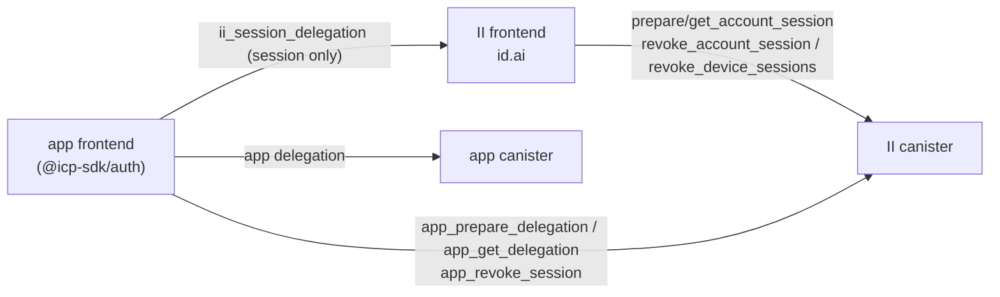
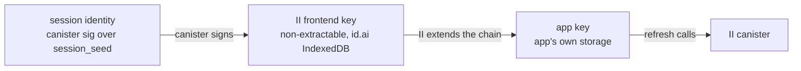
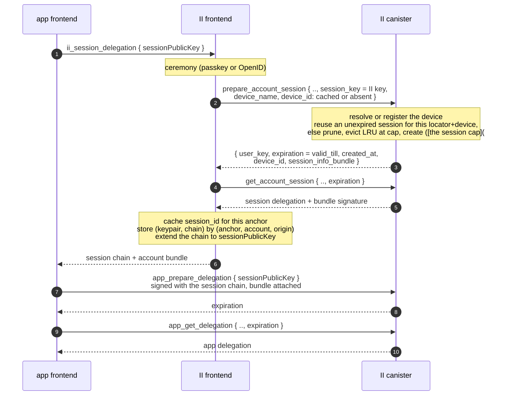
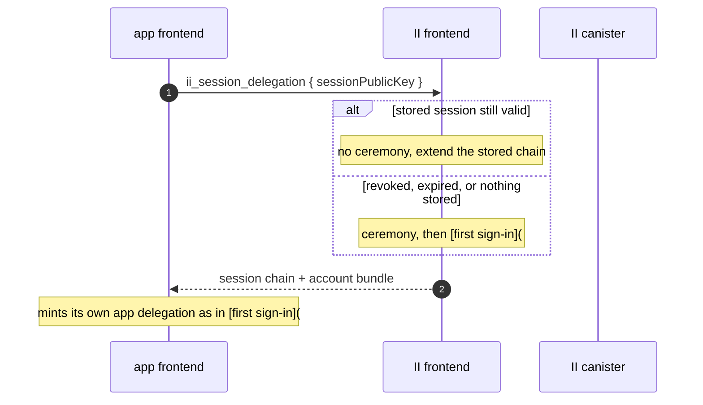
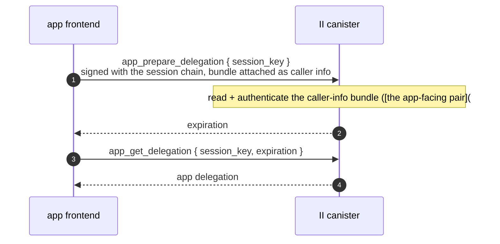
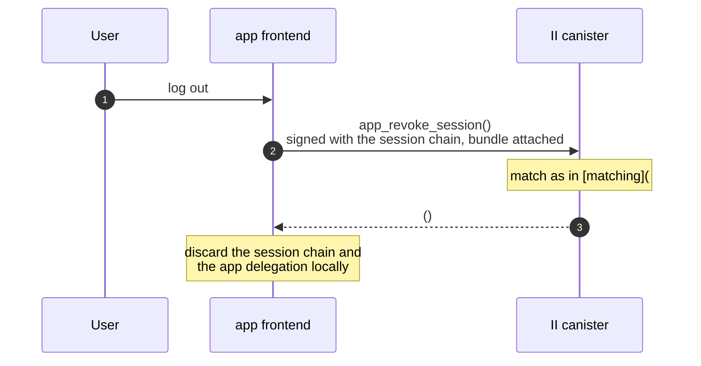
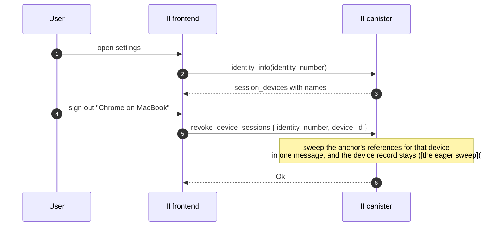

# Revocable app sessions — specification

**Authors:** sea-snake — **Date:** Aug 20, 2026

**Target audience:** implementers, and agents generating code from this document

**Design:** [revocable-app-sessions.md](revocable-app-sessions.md) covers what this builds and why. This document assumes it and does not repeat it.

**Depends on:** [tracked-default-accounts-spec.md](tracked-default-accounts-spec.md) for the account reference a session is stored on and the principal index the refresh path resolves through.

## Glossary

| Term                   | Meaning                                                                                                                                                          |
| ---------------------- | ---------------------------------------------------------------------------------------------------------------------------------------------------------------- |
| **App delegation**     | The short-lived delegation the app uses against app canisters. What is up to 30 days today.                                                                      |
| **Account reference**  | The row `tracked-default-accounts.md` keeps per (identity, app, account), recording that the account is in use. Where a session is stored.                       |
| **Session**            | A record on that row, plus the canister-signed identity derived from it. Long-lived and revocable.                                                               |
| **Session chain**      | The delegation chain rooted at the session identity. Held by the II frontend, extended to the app.                                                               |
| **Refresh**            | The app calling the II canister with its session chain to mint a new app delegation. No browser involvement.                                                     |
| **Caller-info bundle** | A canister-signed blob the app attaches to every call, naming its account principal. How II knows which account a call is about without the app supplying it.    |
| **Silent re-auth**     | The app asking II for a delegation again, answered from II's stored session with no ceremony.                                                                    |
| **Session device**     | A per-anchor label for one browser, so a browser's sessions can be listed and revoked together.                                                                  |
| **Locator**            | The `(anchor, application, account)` triple that identifies one account internally. Never leaves the canister: an app is only ever told the account's principal. |

---

## Interfaces

### Actors



Three things deliberately never happen: the app canister never talks to II, the app never goes through the II frontend to refresh, and the II frontend never holds or uses the app's key.

### One audience per method

| Method                                             | Audience     | Authenticated as        | Where                        |
| -------------------------------------------------- | ------------ | ----------------------- | ---------------------------- |
| `ii_session_delegation` (JSON-RPC)                 | app frontend | the authorize transport | JSON-RPC method              |
| `app_prepare_delegation` / `app_get_delegation`    | app frontend | its session chain       | App-facing pair              |
| `app_revoke_session`                               | app frontend | its session chain       | Two entry points             |
| `prepare_account_session` / `get_account_session`  | II frontend  | an anchor access method | First sign-in                |
| `revoke_account_session`, `revoke_device_sessions` | II frontend  | an anchor access method | Anchor-authenticated methods |

#### No method serves both frontends

Each is authenticated exactly one way, so its authorization is unconditional and auditable rather than a branch. Where both frontends need the same outcome, as with revocation, they get separate methods. The audience is in the name: `app_` marks the app frontend, following the `mcp_` precedent, and unprefixed methods are the II frontend's.

That is not tidiness. Three things follow from it:

- **The two audiences cannot share an argument list.** The II frontend's calls name the anchor with `identity_number`, which an app cannot supply and must never learn, so the app-facing calls name nothing at all and take their context from caller info instead.
- **The `app_` set is public API.** Every app and every client library depends on it, so it has to stay small and stable, and any change to it is a compatibility event.
- **The unprefixed set is internal.** Only the II frontend calls it, and the frontend ships with the canister, so it can be changed freely and in the same release. That is where complexity belongs when there is a choice about where to put it.

`prepare_account_delegation` and `get_account_delegation` appear in neither list, because nothing touches them. Sessions get their own pair ([first sign-in](#first-sign-in)), so no existing method changes shape or behaviour.

### API changes

#### External candid

Called by app frontends. Public API, so it stays small and every change to it is a compatibility event.

| Item                     | Change     | Detail                                                                                             |
| ------------------------ | ---------- | -------------------------------------------------------------------------------------------------- |
| `app_prepare_delegation` | new update | Mint an app delegation from a session ([the app-facing pair](#the-app-facing-pair))                |
| `app_get_delegation`     | new query  | Fetch it ([the app-facing pair](#the-app-facing-pair))                                             |
| `app_revoke_session`     | new update | Sign out ([the two entry points](#two-entry-points-with-different-authentication))                 |
| `AppSessionError`        | new type   | No such session, no matching session, internal error ([the app-facing pair](#the-app-facing-pair)) |

Three methods, and none of them names an anchor.

#### Internal candid

Called only by the II frontend, which ships with the canister. Changeable in the same release, so this is where complexity belongs.

| Item                                                                  | Change                  | Detail                                                                                                                                                                           |
| --------------------------------------------------------------------- | ----------------------- | -------------------------------------------------------------------------------------------------------------------------------------------------------------------------------- |
| `prepare_account_session`                                             | new update              | Create or reuse a session and sign it to the frontend's key ([first sign-in](#first-sign-in))                                                                                    |
| `get_account_session`                                                 | new query               | Fetch the session delegation and witness the bundle signature ([first sign-in](#first-sign-in))                                                                                  |
| `IdentityInfo`                                                        | `session_devices` field | Devices live on the anchor, so they ride here ([the registry](#registry))                                                                                                        |
| `revoke_account_session`                                              | new update              | Revoke the sessions created at one moment at one account ([the anchor-authenticated methods](#the-anchor-authenticated-methods))                                                 |
| `revoke_device_sessions`                                              | new update              | Sign a browser out by sweeping its sessions ([the anchor-authenticated methods](#the-anchor-authenticated-methods), [the eager sweep](#signing-a-browser-out-is-an-eager-sweep)) |
| `PrepareAccountSession*`, `GetAccountSession*`, `AccountSessionError` | new types               | ([first sign-in](#first-sign-in))                                                                                                                                                |

#### JSON-RPC

App frontend to II frontend.

| Item                    | Change    | Detail                                                                                        |
| ----------------------- | --------- | --------------------------------------------------------------------------------------------- |
| `ii_session_delegation` | new       | Obtain a session ([the JSON-RPC method](#the-json-rpc-method))                                |
| `icrc34_delegation`     | unchanged | Legacy apps, and unconditional: its behaviour does not depend on anything else the app called |

Nothing existing is removed, and nothing existing changes behaviour, so no app has to do anything until it opts in ([rollout](#rollout)).

---

## The session record

A session is an entry in a list on the account reference introduced by `tracked-default-accounts.md`:

```rust
SessionRecord {
    created_at: Timestamp,
    valid_till: Timestamp,
    last_refreshed: Option<Timestamp>,  // None until the first refresh
    device_id: u32,
    read_only: bool,                    // from the consent that created it
}
```

Nothing else. Every field except `last_refreshed` is fixed for the session's life, which is also why `last_refreshed` is the only one absent from the seed ([session identity](#session-identity)).

`read_only` is here rather than being a per-call argument because it describes what the session authorizes, so it has to be part of what a user sees and revokes. Same as MCP's grant.

`last_refreshed` exists for the user rather than for the canister. "This browser used this app 3 minutes ago" against "5 weeks ago" is what makes a session list worth reading, and it is the signal that lets someone spot a session they do not recognise _still being used_ rather than merely still existing. [what refresh writes](#what-refresh-writes) covers what it costs.

Consequences of putting sessions on the reference rather than in their own map:

- Sessions inherit the per-anchor caps of `tracked-default-accounts.md` [what refresh writes](#what-refresh-writes), so they are bounded without new accounting.
- Revoking, expiring and evicting all reuse machinery that already exists.
- The row is written on create, on remove, on every refresh ([what refresh writes](#write-it-every-time)), and on any sign-in or rename that touches it.

### The cap evicts, it never blocks

Ten sessions per account reference. Creating an eleventh does not fail; it drops the oldest. On create:

0. If an unexpired session already exists for this `(anchor, application, account)` **and this device**, reuse it and stop. Its `created_at` is unchanged, so its seed and therefore its principal are stable across re-auths, which is what lets the II frontend keep a chain that stays valid.
1. Prune entries whose `valid_till` has passed.
2. If the list is still at the cap, remove the **least recently used** entry: the smallest `last_refreshed`, falling back to `created_at` for a session that has never refreshed.
3. Insert.

Blocking would be the wrong failure: the user is trying to sign in on a new browser and the reason it cannot work is internal bookkeeping. Dropping the stalest session costs that browser a ceremony next time, which is the mildest possible outcome.

Evicting on `last_refreshed` rather than `created_at` is what `last_refreshed` buys here beyond the UI. Ordering by creation would drop a months-old session still in daily use in favour of one created an hour ago and never touched again, which is exactly backwards.

The cap also bounds the per-refresh match in [matching](#matching), which walks the row's records recomputing seeds, so it wants enforcing at creation rather than being treated as advisory.

### Two further rules

- **A row holding an unexpired session is not evictable.** This extends the eviction predicate in `tracked-default-accounts.md` [the chain shape](#chain-shape). Without it, evicting an account reference would silently destroy a working session.
- **Expired entries are pruned only when the list is written for another reason**, such as creating a session. Pruning on refresh would reintroduce a write on the hot path.

---

## Session identity

```
session_seed = H(salt, "session", anchor, application, account, created_at, device_id)
```

with every field length-prefixed and the account tagged present or absent so `(anchor, app, None)` cannot collide with `(anchor, app, Some(n))`.

The construction needs no allocator: no counter cell, nothing to retire. Uniqueness across anchors is structural, since the locator is an input. Unguessability comes from the salt, exactly as it does for `account_seed`, which hashes the salt together with a plainly sequential `AccountNumber`.

The `device_id` is an input so a session's device attribution cannot be rewritten in storage without invalidating the session.

Only the record's **immutable** fields feed the seed, which is why `last_refreshed` is not one. A mutable input would change the session's principal every time it was stamped. `read_only` is immutable and could be an input, but is deliberately not one: it is a property of the authority, not of the identity, and binding it would mean a consent change had to mint a new principal.

### One browser, one session per account

`time()` is the round time, so every message in one round sees the same value, and two
records sharing an account, a device and a round would derive the same seed.

Creating a session cannot produce that. A request from a browser that already holds an
unexpired session at this account with the same consent returns the existing record. A
request that differs replaces the browser's session rather than adding one. Either way one
browser has at most one session per account, so no two records can share a device and a
round. There is no third outcome and therefore no collision to guard against.

The property is worth stating because it is what the seed relies on. If a browser were
ever allowed to hold two sessions at one account, this would have to change: either the
seed gains a discriminator, or creation has to reject the second one.

---

## Creating a session

### Chain shape



- The canister signs the session identity to a **non-extractable** key the II frontend generates, and the frontend stores the pair keyed by `(anchor, account, origin)`.
- To give the app access, the frontend **extends the chain** to a public key the app supplies. No private key is shared and neither side loses non-extractability.
- `caller()` derives from the chain's root, the canister-signature key over `session_seed`, so it is the session principal at any chain depth. The canister-side lookup is depth-agnostic.
- The app's hop carries `targets: [ii_canister_id]`. II has never set `targets`, though `delegation_signature_msg_with_permissions` already accepts them. This is a guardrail rather than a defence: see [what an attacker gets](#what-an-attacker-gets).
- **Both hops expire with the session**, at `valid_till`. Giving the app's hop a shorter expiry was an earlier idea and it is a bad one: the app would have to return to the II frontend, and therefore navigate, every time its hop lapsed, which is the cadence this design exists to remove. It would also buy nothing, since a thief holding the hop can refresh for as long as it lasts either way, and revocation is the actual control ([what an attacker gets](#what-an-attacker-gets)).

### The JSON-RPC method

The app talks to the II frontend over the existing authorize transport. One new II-specific method, `ii_session_delegation`:

```
params:  { sessionPublicKey, icrc95DerivationOrigin? }
result:  { publicKey, signerDelegation, sessionInfoBundle, sessionInfoBundleSignature }
```

`icrc95DerivationOrigin` is what makes subdomains share a session: it selects the origin
the session is recorded against, subject to that origin authorising the caller. The result
is ICRC-34 shaped, so `publicKey` and `signerDelegation` together are the session chain.

It is namespaced `ii_` rather than extending `icrc34_delegation`, for the same reason `prompt` and `hint` ride on the authorize URL instead of the ICRC request: it is not part of the standard, its response carries an artifact the standard has no field for, and apps that do not want a session should not be handed one.

#### No account number

Which account a session is for is decided during the ceremony, by the user, in II's own UI. The app has no way to enumerate an anchor's accounts and no business naming one, exactly as it cannot today with `icrc34_delegation`.

#### It returns the session and nothing else

`publicKey` and `signerDelegation` are the session chain, extended to `sessionPublicKey`. The app then mints its own first app delegation through `app_prepare_delegation` ([the app-facing pair](#the-app-facing-pair)), the same call it will use for every subsequent one. So the new flow does not involve `icrc34_delegation` at all, and that method keeps behaving for legacy apps exactly as it does today ([rollout](#rollout)).

That is deliberately not the same as having `icrc34_delegation` return a shorter delegation when a session was requested. Making its TTL depend on whether some other method was called earlier is hidden coupling, and it fails in the worst direction: an app that asks for a session but has not implemented refresh would silently start receiving 5-minute delegations. With a session-only response, an app that cannot refresh simply never calls the method.

The cost is one canister round trip before the app's first call, once per sign-in. It buys one artifact per method and no conditional behaviour anywhere.

#### One keypair, two chains

The app delegation targets the same `sessionPublicKey` the session chain terminates at, so the app holds one key with two chains over it: the session chain, which `targets` restricts to the II canister, and the app delegation, which works against app canisters. A second keypair would protect nothing, since anything that reaches one reaches the other, and the guardrail against confusing the two is `targets`, not key separation.

`sessionInfoBundle` and its signature are what the app's agent attaches as caller info to every app-facing call ([the app-facing pair](#the-app-facing-pair)). The app stores them beside the session keypair and never parses them.

The app's own principal is not returned, and is not needed: once it has minted an app delegation it reads its principal off that chain, which is what `DelegationIdentity.getPrincipal()` already does.

The session's expiry needs no field. It is the `expiration` on the session chain's own hops ([the chain shape](#chain-shape)), so the app already has it.

### First sign-in

Session creation gets its own pair rather than options on `prepare_account_delegation`. Overloading that method would make it mean two different things depending on one field, and grow its response two conditional ones. It is left completely untouched.

```candid
type PrepareAccountSessionRequest = record {
    identity_number : IdentityNumber;
    origin : FrontendHostname;
    account_number : opt AccountNumber;
    session_key : SessionKey;        // the II frontend's own key
    device_name : text;              // labels the browser, e.g. "Chrome on MacBook"
    device_id : opt nat32;           // cached by the frontend; absent or unknown registers one
    permissions : opt Permissions;   // the consented access level, fixed for the session
    valid_for : opt nat64;           // clamped to the session bounds below
};

type PrepareAccountSessionResponse = record {
    user_key : PublicKey;
    expiration : Timestamp;          // the session's valid_till
    created_at : Timestamp;
    device_id : nat32;               // echo, cached by the frontend
    session_info_bundle : blob;      // bytes; the signature comes from the get ([the app-facing pair](#the-app-facing-pair))
    account_principal : principal;   // what apps see for this account; stored with the session
};

type GetAccountSessionRequest = record {
    identity_number : IdentityNumber;
    origin : FrontendHostname;
    account_number : opt AccountNumber;
    session_key : SessionKey;
    expiration : Timestamp;
};

type GetAccountSessionResponse = record {
    signed_delegation : SignedDelegation;
    session_info_bundle_signature : blob;
};

prepare_account_session : (PrepareAccountSessionRequest)
    -> (variant { Ok : PrepareAccountSessionResponse; Err : AccountSessionError });
get_account_session : (GetAccountSessionRequest)
    -> (variant { Ok : GetAccountSessionResponse; Err : AccountSessionError }) query;
```

`prepare_account_session` is gated by `check_authz_and_record_activity`, which also records the sign-in as activity; `get_account_session` by `check_authorization`. The shape follows `SsoPrepareDelegationRequest` and `SsoGetDelegationRequest`: flat records, prepare returning the bundle bytes and get witnessing its signature.

`permissions` here is what sets the session's `read_only` ([the session record](#the-session-record)), so it is fixed once at the consent that created the session rather than being chosen per refresh ([the app-facing pair](#the-app-facing-pair)).

`account_principal` is the principal the _app_ will resolve to, derived from the account seed rather than the session seed. It is not something the frontend can compute, and it is not in the session chain either, whose root is the session key — the two seed families are domain separated ([session identity](#session-identity)). Returning it here is what lets the frontend store it with the session, which is how `silent-reauth-redirect.md` [session identity](#session-identity) matches a `hint`.

An app never needs to be told: `app_prepare_delegation` already returns `user_key` over the account seed, so `Principal.selfAuthenticating(user_key)` is the same value, and that is how the principal reaches the cookie a `hint` later comes from. The II frontend could obtain it the same way, by minting once from the session it just created, but that spends a canister signature and a `update_root_hash()` on a value this response can carry for free. This method is gated by `check_authorization(identity_number)`, so the field tells the II frontend something for its own bookkeeping rather than widening what an app can reach.

Registering a device is not a call of its own either. The frontend passes the name it would have registered with plus whatever id it has cached, and the canister resolves the rest ([id allocation](#the-canister-allocates-the-id-during-the-auth-flow)).



### Silent re-auth, when the session is still live



Extending the chain is an offline operation, so it is not what makes anything revocable. What does is that the app delegation itself can only come from the canister, which checks the session record on every mint.

#### When this avoids a ceremony is narrower than it looks

Signing out of an app revokes its session ([the two entry points](#two-entry-points-with-different-authentication)), so returning to that app afterwards is a ceremony, correctly. The stored session helps when the user did not sign out: a closed tab, an expired app delegation, or a _sibling subdomain_ asking for the first time. That last case is the main one, and it is why the frontend keeps the session at all.

The frontend cannot know that an app revoked a session behind its back, so it treats a failed mint as "no session" and falls through to the ceremony rather than surfacing an error.

## Refresh



### The app-facing pair

```candid
app_prepare_delegation : (record {
    session_key : SessionKey;        // the key the app delegation targets
}) -> (variant { Ok : record { user_key : PublicKey; expiration : Timestamp }; Err : AppSessionError });

app_get_delegation : (record {
    session_key : SessionKey;
    expiration : Timestamp;          // must match the prepared value
}) -> (variant { Ok : SignedDelegation; Err : AppSessionError }) query;
```

`session_key` is the one thing the app has to say, because a delegation names the public key it delegates to and the canister signs over those bytes. `caller()` is the chain's root, not its leaf, so the key cannot be recovered from the call. `expiration` on the `get` exists for the same reason it does on `get_account_delegation`: it selects which prepared signature to witness.

#### No TTL argument

The app-delegation lifetime is a property of this design, fixed at 5 minutes ([cost and the TTL dial](#cost-and-the-ttl-dial)), not something a caller asks for. Accepting a requested value would only invite an app to ask for longer and make revocation latency a per-app variable.

#### No permissions argument

Whether a session mints queries-only delegations is decided once, by the user, at the consent that created it, and then holds for everything that session ever mints. Letting it vary per call would mean the record could not describe what it authorizes. It is set once from `prepare_account_session`'s `permissions` ([first sign-in](#first-sign-in)). That is what MCP already does with `read_only` on its grant, and an earlier draft of this design got it backwards by arguing for a per-request value.

#### The account arrives as caller info, not as an argument

II already does this for the gated-SSO session: `openid/sso_bundle.rs` reads a canister-signed bundle off the call with `ic0::msg_caller_info_signer` and `ic0::msg_caller_info_data`, and `prepare_icrc3_attributes` gates `sso:<domain>` attributes on it (`main.rs:2303`). Sessions use the same mechanism with their own bundle.

#### The bundle carries the account's principal and nothing else

Not the anchor number, not the application number, not the account number. Those are II's alone: an anchor number handed to two apps is a cross-origin correlator, which is the one property per-origin derivation exists to deny. The principal is a value the app already holds, so the bundle tells it nothing new.

That is what the principal index of `tracked-default-accounts.md` is for. II resolves the principal to a locator, and only then knows which reference row to read. Without the index there is no way back from a principal, because the salt is hashed into the derivation.

The bundle carries no expiry either. An expiry inside it would be self-certifying — the canister would be trusting a window it signed — and redundant, because the session record is read anyway and is the copy revocation deletes.

Reading it mirrors `read_certified_sso_bundle` (`openid/sso_bundle.rs:180`) step for step:

1. `msg_caller_info_signer()` must be `ic_cdk::id()`. Anything else, or nothing attached, is authorization failing.
2. Reject on size before allocating, as `MAX_SSO_BUNDLE_BYTES` does.
3. Decode with a domain-separator prefix and length-prefixed fields.
4. Check the bundle's own expiry.

Issuance mirrors `prepare_sso_attr_bundle` / `get_sso_attr_bundle_signature` and rides on the session-creating pair: `prepare_account_session` returns the bundle bytes, `get_account_session` returns its signature alongside the session delegation. That is exactly the shape of `SsoPrepareDelegationResponse.sso_attr_bundle` and `SsoGetDelegationResponse.sso_attr_bundle_signature`. The app holds the pair and its agent attaches them to every app-facing call.

One caveat carried over verbatim from that code, because it is the easy mistake: a valid bundle only proves II signed it under the caller's seed. It does **not** by itself prove the bundle describes the caller. So the locator read out of it is still checked against `caller()` by the seed match in [matching](#matching), the same way `main.rs:2303` re-checks `bundle.origin` against the serving origin instead of trusting it.

So nothing about sessions needs new storage either. `tracked-default-accounts.md` [session devices](#session-devices) already indexes app principals to their locator, and resolving one is what that index is for. Session principals are not indexed, not stored as keys anywhere, and never looked up.

This is a separate pair from `prepare_account_delegation`, not an option on it. Both mint an app delegation, but they are different operations: this one proves a live session and identifies the account by its principal, that one proves an access method and names the anchor outright. Merging them would mean one method with two authorizers and two argument shapes, and would drag the II frontend's internal surface into public API ([one audience per method](#one-audience-per-method)).

Nothing here creates a session. A session comes only from `prepare_account_session`, which requires an access method ([first sign-in](#first-sign-in)), so a stolen chain cannot extend its own lifetime or spawn siblings. The internal `max_expiration` parameter that `main.rs` currently passes `None` is what carries `valid_till` into the signature, so a minted delegation cannot outlive its session.

`AppSessionError` has two cases a caller can act on: no bundle was attached or II did not sign it, and a bundle II signed with no usable session behind it. Expiry, revocation and a caller that never matched all fall into the second, because which one it is depends on whether a prune has run.

### Matching

1. Read the bundle off the caller info and authenticate it ([the app-facing pair](#the-app-facing-pair)). Nothing attached, or a bundle II did not sign, is rejected here.
2. Read that reference row and recompute `session_seed` for each of its at most ten session records, until one derives to `caller()`.
3. Check the matched record's `valid_till`.

At ten records that is roughly twenty hashes, negligible beside the signature insert and root-hash update the call already performs.

Neither input needs to be trusted. The bundle is authenticated, and its contents are still checked rather than believed: a bundle naming another account resolves to a locator whose records cannot match `caller()`.

#### Requiring the match stops an app delegation renewing itself

`caller()` on this path could in principle be the account's own principal rather than a session's, since a holder of an app delegation can sign as it. That caller resolves to a locator perfectly well, but no session record's seed will ever equal it, because the two seed families are domain-separated by the `"session"` tag. Without that rejection an app delegation could mint its own replacement forever and revocation would mean nothing.

#### Expired, revoked and never-matched are one outcome

Which of them a caller hit depends on whether a prune has happened to run, so distinguishing them would hand apps an answer they cannot rely on — and it would tell an app whether the user actively revoked or merely let the session lapse, which is not its business. `NoMatchingSession` covers all three.

### What refresh writes

Refresh stamps `last_refreshed`. Naively that is a stable write on every call, and since `with_account_mut` rewrites the entire `(anchor, app)` reference-list blob, it rewrites the whole row rather than one field.

#### Write it every time

Three things read this stamp, and each is harmed by coarsening it. Writing at most once an hour would cost one write in twelve, and would break all three:

- [The session cap](#the-cap-evicts-it-never-blocks) evicts the least recently used session. Within a coarsening interval every session looks equally idle, so it would pick arbitrarily.
- [The browser registry](#registry) orders on the same signal, and an hour is long enough to drop a browser that is in use.
- The user-facing reading this field exists for. "Used 3 minutes ago" that can be an hour stale does not answer the question it is there to answer.

The write is small next to what the call already does. Every refresh inserts a canister signature and calls `update_root_hash()`, which rehashes the certified tree. A BTreeMap overwrite of a few hundred bytes is minor beside that.

#### The same write stamps the reference

Since the write happens anyway, keeping `last_used` honest is free, and it keeps the account-level eviction in `tracked-default-accounts.md` accurate for accounts that are only ever reached through a session.

#### And the browser registry

The same write stamps the browser's last-used time, so [the registry](#registry)'s cap can order on use. This is an anchor write on a call that [the eager sweep](#signing-a-browser-out-is-an-eager-sweep) otherwise keeps off the anchor entirely; that section covers what the trade buys.

The two timestamps are different fields for different jobs and both are needed:

| Field            | Lives on              | Drives                                                                                               |
| ---------------- | --------------------- | ---------------------------------------------------------------------------------------------------- |
| `last_used`      | the account reference | account eviction in `tracked-default-accounts.md` [creating a session](#creating-a-session)          |
| `last_refreshed` | the session record    | the [the session cap](#the-cap-evicts-it-never-blocks) cap eviction and the user-facing session list |
| `last_used`      | the device record     | the [the registry](#registry) registry cap eviction and the settings device list                     |

## Revocation

### Two entry points, with different authentication

| Caller          | Authenticated as                                              | May revoke                 | Names a session by                                                                     |
| --------------- | ------------------------------------------------------------- | -------------------------- | -------------------------------------------------------------------------------------- |
| The app         | its own session chain, so `caller()` is the session principal | only its own session       | nothing. The bundle rides as caller info ([the app-facing pair](#the-app-facing-pair)) |
| The II frontend | an anchor access method, via `check_authorization`            | any session of that anchor | `(origin, account, created_at)`, or a whole `device_id`                                |

Two sets of methods, and the split falls out of what each caller can prove and what each one knows.

#### The app's method is sign-out

It is what a user pressing "log out" triggers:

```candid
app_revoke_session : () -> ();
```



It needs no authorization check beyond the match refresh already performs, because a caller cannot produce another session's principal, so it can only ever remove its own. It **returns nothing and always succeeds**, which makes sign-out idempotent: a client that retries, or that signs out twice, gets the same answer without having to reason about whether its session was already gone.

The app deliberately cannot revoke anything else. "Sign out everywhere" is the II frontend's operation, not something an app can trigger.

### The anchor-authenticated methods

```candid
revoke_account_session : (record {
    identity_number : IdentityNumber;
    origin : text;
    account_number : opt AccountNumber;
    created_at : Timestamp;
}) -> (variant { Ok; Err : SessionRevokeError });

revoke_device_sessions : (record {
    identity_number : IdentityNumber;
    device_id : nat32;
}) -> (variant { Ok; Err : SessionRevokeError });
```

They name sessions by locator, never by principal, so **they do not touch the principal index**. It is on the app-facing path only ([matching](#matching)).

#### There is no session listing method, deliberately

A flat "every session of this anchor" call is the wrong shape: it returns a list whose length is bounded only by the caps, mixing every origin together, and it is not what a settings UI wants to render. The right decomposition is to list the _applications_ an anchor has, then list sessions within one application, and that wants designing alongside whatever surface lists applications. Neither exists yet, so neither is specified here.

What that leaves usable today:

| Operation                | Drivable now?                                                                                                                 |
| ------------------------ | ----------------------------------------------------------------------------------------------------------------------------- |
| Sign a whole browser out | Yes. `identity_info` already carries `session_devices` with their names ([the registry](#registry)), so the UI can offer them |
| Revoke one session       | The method exists, but nothing enumerates sessions yet, so its UI arrives with the listing work                               |



### Latency

#### Latency is exactly the app-delegation lifetime

Revocation stops new delegations being minted; one already issued stays valid until it expires. `mcp.rs` documents the same residue for its grants. Nothing short of the relying party checking with II on every call improves on it, which is why the TTL is the dial ([cost and the TTL dial](#cost-and-the-ttl-dial)).

### What an attacker gets

| Stolen         | Today                                    | After                                              |
| -------------- | ---------------------------------------- | -------------------------------------------------- |
| App delegation | up to 30 days of app access, unrevocable | at most one TTL                                    |
| Session chain  | no equivalent exists                     | can mint app delegations until the user revokes it |

The honest reading of the second row: a thief holding the session chain can refresh, so `targets: [ii_canister_id]` is **not** what stops them. What changes their position is that the session is revocable at all, and that the user can see it in a list and end it.

`targets` earns its place as a **developer guardrail**: it makes an app that reaches for the session chain where it meant the app delegation fail immediately and visibly, instead of appearing to work while using a long-lived credential against app canisters.

---

## Session devices

### Registry

A new additive field on `StorableAnchor`, following the pattern every field there already uses:

```rust
#[n(7)]
pub session_devices: Option<Vec<StorableSessionDevice>>,
```

with `{ id, name, created_at, last_used }` per entry, **capped at 20** because the anchor blob is read on nearly every authenticated path, so an unbounded list taxes far more than sessions.

#### At the cap, registration evicts the least recently used

Rather than failing, for the same reason [the session cap](#the-cap-evicts-it-never-blocks) gives for sessions: the user is signing in on a new browser and the only thing that could refuse them is internal bookkeeping.

Ordering on use rather than on `created_at` is load-bearing, not a nicety. Clearing browser storage loses the cached id ([the accepted limitations](#two-accepted-limitations)), so every wipe enrols a fresh record and the wiping browser always holds the newest `created_at`. Under enrolment order it is therefore never its own victim: twenty wipes evict twenty genuinely-used browsers instead. Since eviction also ends the dropped browser's sessions, that signs the user out on devices they never touched. Ordering on `last_used` makes each wipe's throwaway records evict each other.

`last_used` advances on a sign-in from that browser and on every session refresh it drives ([what refresh writes](#what-refresh-writes)). Sign-in alone would be too coarse a signal: a browser holding an app open for weeks without a fresh ceremony would read as idle and lose the cap to one that signed in once and went dark.

Reading needs no method: devices live on `StorableAnchor`, so they ride on `identity_info` alongside `mcp_config`, which is carried there for exactly this reason. `last_used` rides along with them, which is what lets the settings list say when a browser was last used rather than only when it was added — the question someone deciding what to sign out is actually asking.

### The canister allocates the id, during the auth flow

There is no registration method. `prepare_account_session` carries `device_name` and `device_id : opt nat32`, and the canister resolves them:

| Passed                          | Result                                                                     |
| ------------------------------- | -------------------------------------------------------------------------- |
| an id it knows                  | use that device, leave its name alone                                      |
| an id it does not know, or none | register a device with `device_name` and return the new id in the response |

The frontend caches the returned id per anchor and passes it back on every later auth flow, for every app. It does not choose the id, derive it, or influence it.

The id comes from an explicit per-anchor `next_id`, monotonic and never reused. Since [the eager sweep](#signing-a-browser-out-is-an-eager-sweep) does not delete device records, an id cannot come up for reuse in the first place, so this is belt and braces rather than load-bearing today. It stays explicit because it will matter the moment records can be deleted, and it matches the monotonic-and-never-reissued rule already established for account and application numbers.

### Signing a browser out is an eager sweep

`revoke_device_sessions` does what its name says and no more: it removes every session carrying that `device_id`, and **leaves the device record in place.** The rename is not cosmetic. A browser that has been signed out is still a browser the user recognises, so the settings UI can show "Chrome on MacBook, no active sessions", and signing back in from it reuses the same id rather than adding a second entry for the same machine.

Deleting a device record is therefore a separate operation from signing one out, and it is not specified here. [the accepted limitations](#two-accepted-limitations) is where it is wanted, to clear the duplicate a storage wipe leaves behind, and it belongs with the listing work.

The sweep runs over that anchor's references in one message: the anchor-major range scan the eviction path already performs, bounded at 1000 rows by `tracked-default-accounts.md` [what refresh writes](#what-refresh-writes), writing only rows that actually hold that device's sessions. Atomic, with no partially-revoked state.

The alternative is to mark a device revoked and check the mark during refresh, which makes revocation O(1) and pushes the cost onto every refresh. The eager sweep is still the right shape, but on a stronger ground than cost: it leaves no partially-revoked state and no window in which a revoked session is merely ignored rather than gone. Revocation is rare, and paying for it once where it happens is worth an unambiguous outcome.

The sweep does not depend on refresh staying off the anchor. It once did: refresh authenticates by session chain and never runs `check_authorization`, so it had no reason to read the anchor at all. Stamping the browser's last-used time spends that, and buys the browser list a use signal a sign-in stamp cannot give it.

### Where a device id may be supplied

Only on `prepare_account_session`, which requires an anchor access method ([first sign-in](#first-sign-in)). No app-facing method takes a device id, or any argument that could carry one, so no app-reachable surface accepts one. Otherwise an app could pass an arbitrary id to misattribute its own session into a user's device list, or probe which ids exist by observing which are accepted.

### Per anchor, not per browser

The frontend caches one id per anchor, which is deliberate. One id shared across an anchor's apps is exactly the correlation the user wants in their own session list, and no app ever sees it. A browser-global id would instead tie two of the user's anchors to one browser, which is what per-anchor separation exists to prevent.

### Two accepted limitations

Registration is archived with the name redacted, following `Operation::CreateAccount { name: Private }`. Once per browser per anchor is rare enough to archive, unlike the per-sign-in events that design keeps out of the archive.

The name is self-reported by the client, so it is a label for the user rather than evidence about where a session came from. And clearing browser storage produces a second entry for the same physical device. The [the registry](#registry) cap keeps that bounded and spends itself on the throwaway records rather than on the browsers the user recognises, so repeated wipes cost a cluttered list rather than a lost sign-in; a way to delete stale entries outright still belongs with the listing work.

---

## Cost and the TTL dial

Revocation latency, app-delegation TTL and refresh rate are one number. Refresh volume is `N / T`, where `N` counts sessions **actively making calls**, not sessions stored:

| Sessions actively refreshing | T = 5 min          | T = 30 min |
| ---------------------------- | ------------------ | ---------- |
| 100k                         | 333 update calls/s | 55/s       |
| 1M                           | 3,333/s            | 555/s      |

Each is a replicated update that inserts a signature and updates the root hash, against a single canister on one subnet.

Note the stable writes from [what refresh writes](#what-refresh-writes) scale with `1/T` alongside the calls, since every refresh stamps. Lowering `T` multiplies both.

#### The table is a ceiling, not a steady state

Nobody uses an app 24 hours a day. A session refreshes only while its app is open and doing something, so real load is far lower and spread out, driven either on demand when a call finds an expired delegation or by a timer in the client. A stored session that nobody is using costs nothing, since refresh is the only thing that generates load and an idle client does not refresh.

Signing several delegations ahead in one update looks like an escape and is not: revocation latency equals the maximum lifetime of any already-issued delegation, so pre-signing is the same thing as a longer TTL. Without the relying party checking with II per call, T is the only dial.

#### Why five minutes

It matches what MCP already mints (`MCP_MAX_EXPIRATION_PERIOD_NS`). Measuring the current `prepare_delegation` rate is a validation step before rollout, not a precondition for the design: the ceiling above is the worst case, and if it ever binds, T is a constant to raise rather than a shape to change.

---

## Rollout

There is no flag day and no ecosystem coordination, because nothing existing changes:

| App                                                                                                               | Gets                                                                                                                                                                |
| ----------------------------------------------------------------------------------------------------------------- | ------------------------------------------------------------------------------------------------------------------------------------------------------------------- |
| Calls `icrc34_delegation`, as every app does today                                                                | Exactly what it gets now, a long-lived delegation, up to `MAX_EXPIRATION_PERIOD_NS`. Unconditionally: its behaviour does not depend on anything else the app called |
| Calls `ii_session_delegation` ([the JSON-RPC method](#the-json-rpc-method)), on a client version that supports it | A session plus short-lived delegations, and refreshes itself                                                                                                        |

`MAX_EXPIRATION_PERIOD_NS` is untouched. An app opts in by upgrading its client and calling `ii_session_delegation`, which is also when it acquires the refresh logic it needs. Lowering the cap for everyone is a separate decision for later, once adoption is real. MCP could skip all of this because its client is II's own server implementation.

Two things this needs from `tracked-default-accounts-spec.md`:

- Its [eviction predicate](tracked-default-accounts-spec.md#predicate) must also require that the row holds no unexpired session, so reclaiming idle rows cannot take a session away ([the two further rules](#two-further-rules)).
- Its [principal index](tracked-default-accounts-spec.md#the-principal-index) must be readable, because resolving the account a bundle names is what starts every refresh.

That index has one rule worth restating here, because this design is its only caller: no method may accept a principal and report anything about it. A refresh does not violate it. The principal arrives inside a bundle II signed rather than as a caller-supplied argument, and on success the caller receives only a delegation it could already obtain.

There is no oracle to hide either. A canister-signature principal's public key encodes the issuing canister, so anyone holding one already knows II issued it; what they cannot learn is which identity it belongs to, and no failure message tells them.

Also out of scope: whether to fold MCP's grant into this mechanism. The value shapes are close, but MCP's grant is a principal-keyed row precisely because it has no account reference to hang off, and its one-session-per-anchor rule would become a special case of [the session cap](#the-cap-evicts-it-never-blocks)'s cap. Unifying is cleaner and touches shipped behaviour.

---

## Constants

Every value the implementation fixes, in one place.

| Constant                       | Value      | What it bounds                                                                                       |
| ------------------------------ | ---------- | ---------------------------------------------------------------------------------------------------- |
| App-delegation lifetime        | 5 minutes  | How long a minted delegation lasts, and therefore how long revocation takes to bite. Not requestable |
| Session lifetime, default      | 30 days    | Used when a request names none                                                                       |
| Session lifetime, maximum      | 30 days    | A longer request is clamped down to this, not refused                                                |
| Session lifetime, minimum      | 10 minutes | A shorter request is clamped up to this                                                              |
| Sessions per account reference | 10         | Reaching it drops the least recently used                                                            |
| Browsers per identity          | 20         | Reaching it drops the least recently used, and ends that browser's sessions                          |
| Browser name                   | 128 bytes  | Longer is refused                                                                                    |
| Account bundle                 | 512 bytes  | A larger attachment is rejected before it is decoded                                                 |

The bundle is signed under the same certification domain the SSO attribute bundle uses, and
under the **session's** seed rather than the account's. That is what binds it to the caller:
the protocol verifies the signature against the calling principal, so a bundle signed for
one session cannot be attached to a call made by another.

Its wire format is a domain separator followed by one length-prefixed principal, and it
decodes to exactly four failures: wrong domain, truncated, trailing bytes, and a field that
is not a principal.

Two orderings an implementer would otherwise have to invent. The session cap breaks ties on
last-used, then creation time, then browser. The browser registry breaks ties on last-used,
then browser id.

## Requirements

Normative statements the implementation must satisfy, grouped by the part of the system
they constrain and ordered the way a session moves through its life: what it is, how it is
created, how an app uses it, how it ends, and how browsers are tracked.

### The session record

| #     | Requirement                                                                                                                                         |
| ----- | --------------------------------------------------------------------------------------------------------------------------------------------------- |
| REC-1 | A session MUST consist of when it was created, when it expires, when it was last used, which browser created it, and the access level consented to. |
| REC-2 | Only the last-used stamp MAY change after creation. Every other field MUST be fixed for the session's life.                                         |
| REC-3 | The access level MUST be taken from the consent that created the session and MUST NOT be a per-refresh argument.                                    |
| REC-4 | A session MUST live on the account reference, inheriting its per-identity limits.                                                                   |
| REC-5 | An account reference holding an unexpired session MUST NOT be eligible for eviction.                                                                |
| REC-6 | An identity MUST be limited to ten sessions per account reference.                                                                                  |
| REC-7 | Reaching that limit MUST NOT cause a sign-in to fail: the least recently used session MUST be dropped instead.                                      |
| REC-8 | Expired sessions MUST be pruned when a session is created at the same reference.                                                                    |

### Session identity

| #    | Requirement                                                                                                                                                                       |
| ---- | --------------------------------------------------------------------------------------------------------------------------------------------------------------------------------- |
| ID-1 | A session's identity MUST derive from the account's own seed together with the session's creation time and browser, under a domain tag that separates it from account identities. |
| ID-2 | Only immutable fields MAY feed the derivation, so stamping a session MUST NOT change its identity.                                                                                |
| ID-3 | Naming a default account MUST NOT change the identity of its sessions, because it does not change the account's principal.                                                        |
| ID-4 | One browser MUST hold at most one session per account, so no two sessions can share an account, a browser and a creation time.                                                    |
| ID-5 | A holder of an app delegation MUST NOT be able to derive to any session, so an app delegation cannot mint its own replacement.                                                    |

### Creating a session

| #     | Requirement                                                                                                                                              |
| ----- | -------------------------------------------------------------------------------------------------------------------------------------------------------- |
| NEW-1 | Creating a session MUST require an anchor access method, so a session can neither create another nor extend its own life.                                |
| NEW-2 | A request naming an account the identity does not hold MUST be refused before anything is written.                                                       |
| NEW-3 | Any failure after the first write MUST trap, so a reported failure never leaves a browser registered.                                                    |
| NEW-4 | A request from a browser that already holds an unexpired session at this account with the same consent MUST return that session.                         |
| NEW-5 | A request that differs in consent MUST replace the browser's session rather than add one.                                                                |
| NEW-6 | The canister MUST sign the session to a key the II frontend holds and cannot export, and the frontend MUST extend the chain to the key the app supplies. |
| NEW-7 | The app's hop MUST be restricted to the II canister.                                                                                                     |
| NEW-8 | The request MUST NOT name an account number, and no app-facing method MAY accept one.                                                                    |

### Using a session

| #     | Requirement                                                                                                                                                         |
| ----- | ------------------------------------------------------------------------------------------------------------------------------------------------------------------- |
| USE-1 | An app MUST identify its account by attaching a canister-signed bundle naming that account's principal, and MUST NOT pass it as an argument.                        |
| USE-2 | The bundle MUST carry the account's principal and nothing else. It MUST NOT carry the identity number, the application number, the account number, or an expiry.    |
| USE-3 | The canister MUST resolve that principal through the principal index and MUST then match the caller against the reference's sessions by re-deriving each identity.  |
| USE-4 | A minted delegation MUST expire after five minutes, or with the session if that is sooner. The ceiling MUST be derived by the canister, not taken from the request. |
| USE-5 | Every refresh MUST stamp the session, the account reference, and the browser.                                                                                       |
| USE-6 | Refresh MUST NOT require a browser, navigation, popup or iframe.                                                                                                    |

### Ending a session

| #     | Requirement                                                                                                                  |
| ----- | ---------------------------------------------------------------------------------------------------------------------------- |
| END-1 | An app MUST be able to end its own session and no other, and that call MUST always succeed.                                  |
| END-2 | The identity's owner MUST be able to end one session, or every session one browser holds, authenticated by an access method. |
| END-3 | Revocation MUST delete the record rather than mark it, leaving nothing for a later call to overlook.                         |
| END-4 | A call that cannot resolve a usable session MUST report one outcome, whatever the cause.                                     |
| END-5 | Access MUST end no later than one delegation lifetime after revocation.                                                      |
| END-6 | Signing a browser out MUST be a single atomic sweep, leaving no partially revoked state.                                     |

### Tracking browsers

| #     | Requirement                                                                                                                                                   |
| ----- | ------------------------------------------------------------------------------------------------------------------------------------------------------------- |
| DEV-1 | Each identity MUST keep a list of the browsers it has signed in from, holding an id, a self-reported name, when it was first seen, and when it was last used. |
| DEV-2 | The list MUST be limited to 20 entries, and reaching the limit MUST drop the least recently used rather than refuse the sign-in.                              |
| DEV-3 | Dropping an entry MUST also end that browser's sessions, since a session whose browser is not listed could not otherwise be signed out.                       |
| DEV-4 | A browser id MUST come from a per-identity counter and MUST NOT be reissued.                                                                                  |
| DEV-5 | An id the identity does not hold MUST register a new browser rather than resolve to an existing one.                                                          |
| DEV-6 | Only session creation MAY accept a browser id, and no app-facing method MAY accept one.                                                                       |
| DEV-7 | The last-used stamp MUST advance on a sign-in from that browser and on every refresh it drives.                                                               |
| DEV-8 | Signing a browser out MUST leave its entry in place, so the browser stays recognisable and signing in again reuses it.                                        |
| DEV-9 | Registering a browser MUST be archived with the self-reported name redacted.                                                                                  |
