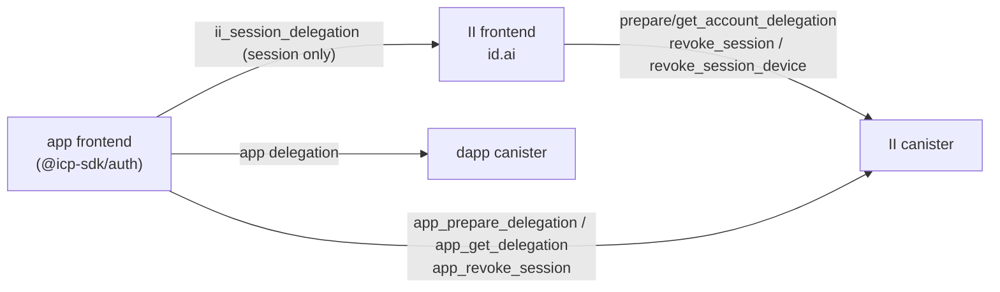
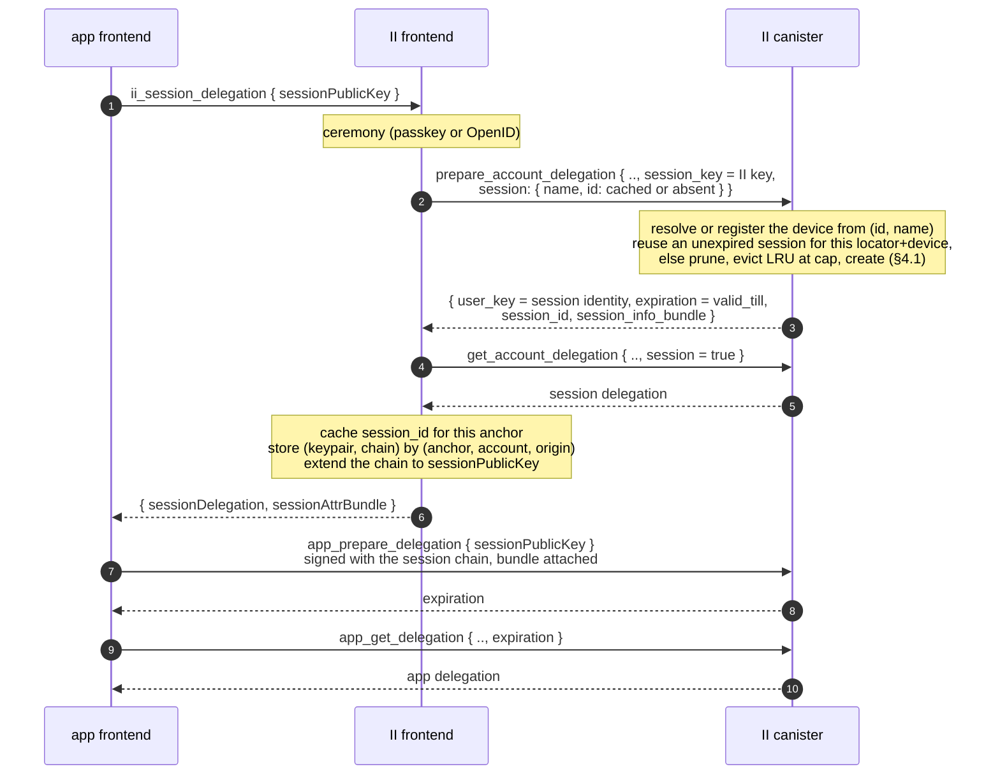
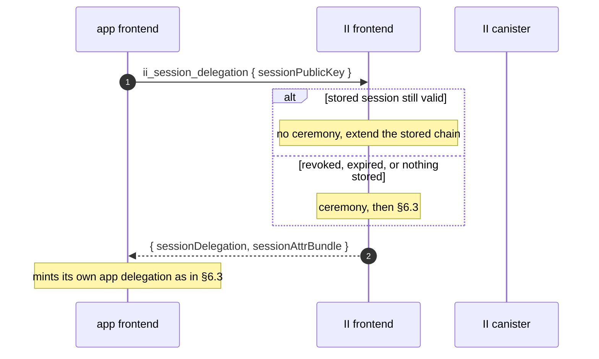
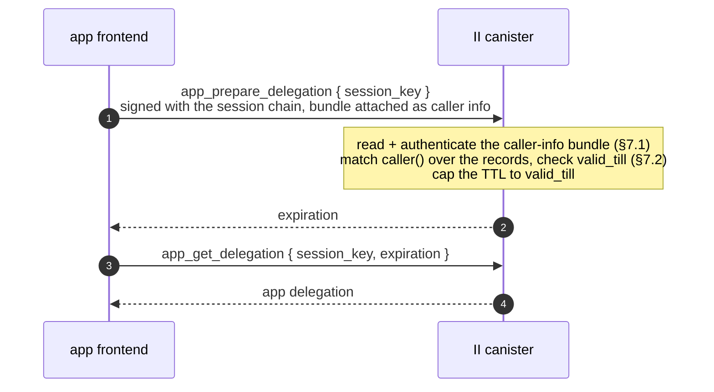
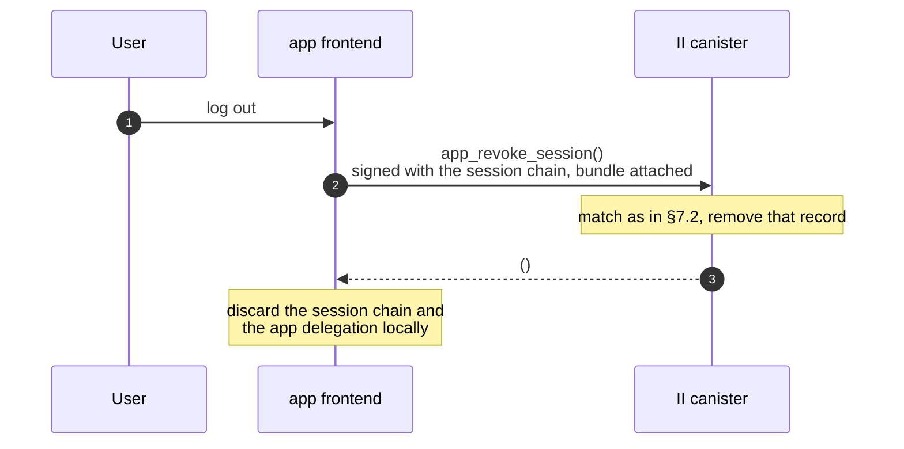
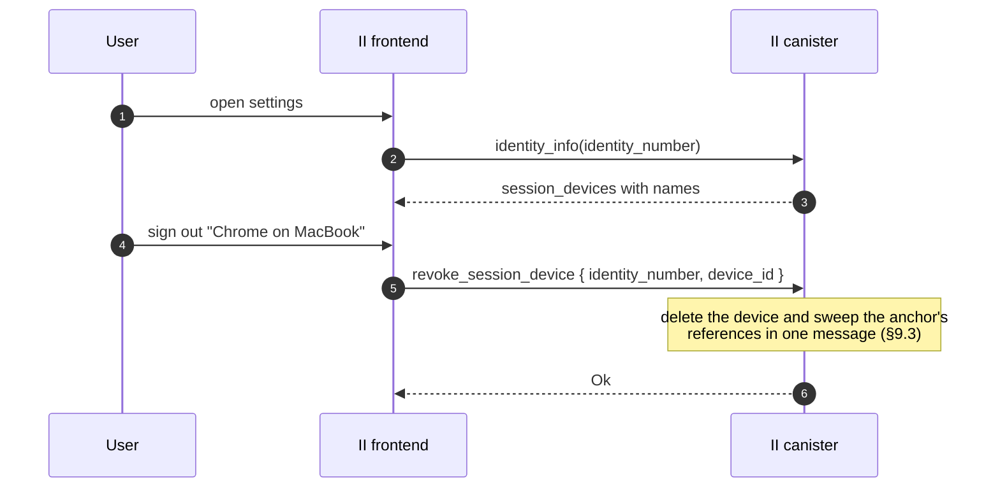

# Revocable app sessions

**Status:** Draft, RFC for review. No code yet.
**Depends on:** `tracked-default-accounts.md`, whose account reference stores a session and whose principal index is on the refresh path.
**Last updated:** 2026-08-18
**Scope:** Canister storage and API, plus the II frontend and its RPC surface. Breaks no existing app: the current RPC methods keep behaving exactly as they do (§11).

An app delegation is unrevocable for as long as it is valid, which is up to 30 days. This makes app delegations short-lived and revocable: II stores a long-lived **session** on the account reference, hands the app a chain rooted at that session, and mints a fresh short-lived app delegation whenever the app asks. Removing the session ends the app's access within one delegation lifetime.

## Glossary

| Term | Meaning |
| ---- | ------- |
| **App delegation** | The short-lived delegation the app uses against dapp canisters. What is up to 30 days today. |
| **Session** | A canister-side record on an account reference, plus the canister-signed identity derived from it. Long-lived and revocable. |
| **Session chain** | The delegation chain rooted at the session identity. Held by the II frontend, extended to the app. |
| **Refresh** | The app calling the II canister with its session chain to mint a new app delegation. No browser involvement. |
| **Silent re-auth** | The app asking II for a delegation again, answered from II's stored session with no ceremony. |
| **Session device** | A per-anchor label for one browser, so a browser's sessions can be listed and revoked together. |
| **Locator** | The `(anchor, application, account)` triple that identifies one account. What a derived principal resolves to through the principal index of `tracked-default-accounts.md` §9. |

---

## 1. Background

### 1.1 Nothing revokes a delegation today

A delegation is self-contained: the client holds a canister-signed artifact valid until its `expiration`. `DEFAULT_EXPIRATION_PERIOD_NS` is 30 minutes and `MAX_EXPIRATION_PERIOD_NS` is 30 days, with the app choosing via `maxTimeToLive`.

There is no lever. The signature only has to exist in the signature map long enough to be fetched, verification never consults the canister again, and nothing II can do reaches an artifact it has already handed out. Rotating the salt would not help: it changes what future derivations produce without touching an already-signed delegation, so it would strand every existing principal while revoking nothing.

### 1.2 The shape already exists for MCP

`mcp.rs` implements this pattern, scoped to MCP servers:

| Piece | Where |
| ----- | ----- |
| Grant `session principal -> (anchor, expiry, read_only)` | `mcp_grant_memory`, keyed by `self_authenticating(session_key)` |
| Session lifetime 10 minutes to 30 days | `MCP_GRANT_MIN_TTL_NS`, `MCP_GRANT_MAX_TTL_NS` |
| Minted delegations capped at 5 minutes | `MCP_MAX_EXPIRATION_PERIOD_NS` (`mcp.rs:68`) |
| Absolute cap so a delegation cannot outlive its session | `prepare_account_delegation(max_expiration)` |
| Revocation | `remove_mcp_grant` |

So the minting half is already built and shipping. What MCP does not need, and apps do, is many sessions per anchor, somewhere to put them, and a way for a user to see and revoke them. MCP gets one session per anchor with a forward pointer from its config, which is why it needs neither an index nor a cap.

### 1.3 The signature map is not the constraint

`SIGNATURE_EXPIRATION_PERIOD_NS` in `ic-canister-sig-creation` is one minute, and `add_signature` prunes up to 50 expired entries per call. A signature is fetchable for a minute after `prepare`; the delegation the client keeps is the durable artifact. Shortening delegations therefore does not grow the signature map. The cost is call volume (§10).

---

## 2. Goals

1. App delegations short enough that a stolen one expires quickly.
2. A revocable session behind them, so access can be ended without waiting for a delegation to expire.
3. Sessions visible and revocable per browser, not only per app.
4. No new browser plumbing on the refresh path: no navigation, no popup, no iframe.

Non-goals: changing the initial ceremony, and changing anything for apps that have not upgraded their client (§11).

---

## 3. Interfaces

### 3.1 Actors



Three things deliberately never happen: the dapp canister never talks to II, the app never goes through the II frontend to refresh, and the II frontend never holds or uses the app's key.

### 3.2 One audience per method

| Method | Audience | Authenticated as | § |
| ------ | -------- | ---------------- | - |
| `ii_session_delegation` (JSON-RPC) | app frontend | the authorize transport | 5.2 |
| `app_prepare_delegation` / `app_get_delegation` | app frontend | its session chain | 6.1 |
| `app_revoke_session` | app frontend | its session chain | 7.1 |
| `prepare_account_delegation` / `get_account_delegation` | II frontend | an anchor access method | 5.3 |
| `revoke_session`, `revoke_session_device` | II frontend | an anchor access method | 8.2 |

**No method serves both frontends.** Each is authenticated exactly one way, so its authorization is unconditional and auditable rather than a branch. Where both frontends need the same outcome, as with revocation, they get separate methods. The audience is in the name: `app_` marks the app frontend, following the `mcp_` precedent, and unprefixed methods are the II frontend's.

That is not tidiness. Three things follow from it:

- **The two audiences cannot share an argument list.** `prepare_account_delegation` names the anchor with `identity_number`, which an app cannot supply and must never learn, so the app-facing calls name nothing at all and take their context from caller info instead. Producing the same artifact does not make them the same operation.
- **The `app_` set is public API.** Every dapp and every client library depends on it, so it has to stay small and stable, and any change to it is a compatibility event.
- **The unprefixed set is internal.** Only the II frontend calls it, and the frontend ships with the canister, so it can be changed freely and in the same release. That is where complexity belongs when there is a choice about where to put it.

What *is* shared is the II frontend's own flow. Minting a session rides on `prepare_account_delegation` rather than getting a parallel pair of its own (§7.1).

### 3.3 API changes

**External candid**, called by app frontends. Public API, so it stays small and every change to it is a compatibility event.

| Item | Change | Detail |
| ---- | ------ | ------ |
| `app_prepare_delegation` | new update | Mint an app delegation from a session (§7.1) |
| `app_get_delegation` | new query | Fetch it (§7.1) |
| `app_revoke_session` | new update | Sign out (§8.1) |
| `AppSessionError` | new type | Distinguishes no-such-session, expired, no-match (§7.1) |

Three methods, and none of them names an anchor.

**Internal candid**, called only by the II frontend, which ships with the canister. Changeable in the same release, so this is where complexity belongs.

| Item | Change | Detail |
| ---- | ------ | ------ |
| `prepare_account_delegation` | `session : opt SessionRequest` argument; `session_id : opt nat32` and `session_info_bundle : opt blob` in the response | Mints a session instead of an app delegation when present (§6.3) |
| `get_account_delegation` | `session : opt bool` argument; `session_info_bundle_signature : opt blob` in the response | Fetches the session delegation and witnesses the bundle signature when true (§6.3) |
| `IdentityInfo` | `session_devices` field | Devices live on the anchor, so they ride here (§9.1) |
| `revoke_session` | new update | Revoke one session (§8.2) |
| `revoke_session_device` | new update | Revoke a browser and sweep (§8.2, §9.3) |
| `SessionRequest` | new type | (§6.3) |

**JSON-RPC**, app frontend to II frontend.

| Item | Change | Detail |
| ---- | ------ | ------ |
| `ii_session_delegation` | new | Obtain a session (§6.2) |
| `icrc34_delegation` | unchanged | Legacy apps, and unconditional: its behaviour does not depend on anything else the app called |

Nothing existing is removed, and nothing existing changes behaviour, so no app has to do anything until it opts in (§11).

---

## 4. The session record

A session is an entry in a list on the account reference introduced by `tracked-default-accounts.md`:

```rust
SessionRecord {
    created_at: Timestamp,
    valid_till: Timestamp,
    last_refreshed: Option<Timestamp>,  // None until the first refresh
    device_id: u32,
    read_only: bool,                    // from the consent that created it
}
```

Nothing else. Every field except `last_refreshed` is fixed for the session's life, which is also why `last_refreshed` is the only one absent from the seed (§5).

`read_only` is here rather than being a per-call argument because it describes what the session authorizes, so it has to be part of what a user sees and revokes. Same as MCP's grant.

`last_refreshed` exists for the user rather than for the canister. "This browser used this app 3 minutes ago" against "5 weeks ago" is what makes a session list worth reading, and it is the signal that lets someone spot a session they do not recognise *still being used* rather than merely still existing. §7.3 covers what it costs.

Consequences of putting sessions on the reference rather than in their own map:

- Sessions inherit the per-anchor caps of `tracked-default-accounts.md` §7.3, so they are bounded without new accounting.
- Revoking, expiring and evicting all reuse machinery that already exists.
- The row is written on create, on remove, and on a coarsened refresh stamp (§7.3), and at no other time.

### 4.1 The cap evicts, it never blocks

Ten sessions per account reference. Creating an eleventh does not fail; it drops the oldest. On create:

0. If an unexpired session already exists for this `(anchor, application, account)` **and this device**, reuse it and stop. Its `created_at` is unchanged, so its seed and therefore its principal are stable across re-auths, which is what lets the II frontend keep a chain that stays valid.
1. Prune entries whose `valid_till` has passed.
2. If the list is still at the cap, remove the **least recently used** entry: the smallest `last_refreshed`, falling back to `created_at` for a session that has never refreshed.
3. Insert.

Blocking would be the wrong failure: the user is trying to sign in on a new browser and the reason it cannot work is internal bookkeeping. Dropping the stalest session costs that browser a ceremony next time, which is the mildest possible outcome.

Evicting on `last_refreshed` rather than `created_at` is what `last_refreshed` buys here beyond the UI. Ordering by creation would drop a months-old session still in daily use in favour of one created an hour ago and never touched again, which is exactly backwards.

The cap also bounds the per-refresh match in §7.2, which walks the row's records recomputing seeds, so it wants enforcing at creation rather than being treated as advisory.

### 4.2 Two further rules

- **A row holding an unexpired session is not evictable.** This extends the eviction predicate in `tracked-default-accounts.md` §6.1. Without it, evicting an account reference would silently destroy a working session.
- **Expired entries are pruned only when the list is written for another reason**, such as creating a session. Pruning on refresh would reintroduce a write on the hot path.

---

## 5. Session identity

```
session_seed = H(salt, "session", anchor, application, account, created_at, device_id)
```

with every field length-prefixed and the account tagged present or absent so `(anchor, app, None)` cannot collide with `(anchor, app, Some(n))`.

The construction needs no allocator: no counter cell, nothing to retire. Uniqueness across anchors is structural, since the locator is an input. Unguessability comes from the salt, exactly as it does for `account_seed`, which hashes the salt together with a plainly sequential `AccountNumber`.

The `device_id` is an input so a session's device attribution cannot be rewritten in storage without invalidating the session.

Only the record's **immutable** fields feed the seed, which is why `last_refreshed` is not one. A mutable input would change the session's principal every time it was stamped. `read_only` is immutable and could be an input, but is deliberately not one: it is a property of the authority, not of the identity, and binding it would mean a consent change had to mint a new principal.

### 5.1 A same-timestamp collision is an error

`time()` is the round time, so every message in one round sees the same value. Two sessions created for the same `(anchor, application, account)` in the same round would derive the same seed. That is reachable, not theoretical: two tabs, two devices, or a deliberately raced pair of authorize calls.

**It is a typed, retryable error rather than something to disambiguate.** The blast radius is small, since both would-be sessions belong to one account and carry identical authority, so the damage is bookkeeping rather than escalation. And a retry succeeds by construction, because IC time is non-decreasing, so the next round derives a different seed. It has to be a typed variant the client retries automatically, not a trap: the one time it fires it would otherwise look like a hard sign-in failure, indistinguishable from any other.

`EventKey` solves the same problem the other way, pairing a timestamp with a `u16` counter. That is the fallback if the error ever proves noisy in practice.

In practice it should be unreachable. Two records can only collide if they share a locator, a `device_id` and a round, and step 0 of §4.1 reuses rather than creates when all three match. It stays as a guard rather than an expected path.

---

## 6. Creating a session

### 6.1 Chain shape


- The canister signs the session identity to a **non-extractable** key the II frontend generates, and the frontend stores the pair keyed by `(anchor, account, origin)`.
- To give the app access, the frontend **extends the chain** to a public key the app supplies. No private key is shared and neither side loses non-extractability.
- `caller()` derives from the chain's root, the canister-signature key over `session_seed`, so it is the session principal at any chain depth. The canister-side lookup is depth-agnostic.
- The app's hop carries `targets: [ii_canister_id]`. II has never set `targets`, though `delegation_signature_msg_with_permissions` already accepts them. This is a guardrail rather than a defence: see §8.4.
- **Both hops expire with the session**, at `valid_till`. Giving the app's hop a shorter expiry was an earlier idea and it is a bad one: the app would have to return to the II frontend, and therefore navigate, every time its hop lapsed, which is the cadence this design exists to remove. It would also buy nothing, since a thief holding the hop can refresh for as long as it lasts either way, and revocation is the actual control (§8.4).

### 6.2 The JSON-RPC method

The app talks to the II frontend over the existing authorize transport. One new II-specific method, `ii_session_delegation`:

```
params:  { sessionPublicKey }
result:  { sessionDelegation, sessionInfoBundle, sessionInfoBundleSignature }
```

It is namespaced `ii_` rather than extending `icrc34_delegation`, for the same reason `prompt` and `hint` ride on the authorize URL instead of the ICRC request: it is not part of the standard, its response carries an artifact the standard has no field for, and apps that do not want a session should not be handed one.

**No account number.** Which account a session is for is decided during the ceremony, by the user, in II's own UI. The app has no way to enumerate an anchor's accounts and no business naming one, exactly as it cannot today with `icrc34_delegation`.

**It returns the session and nothing else.** `sessionDelegation` is the session chain extended to `sessionPublicKey`. The app then mints its own first app delegation through `app_prepare_delegation` (§7.1), the same call it will use for every subsequent one. So the new flow does not involve `icrc34_delegation` at all, and that method keeps behaving for legacy apps exactly as it does today (§11).

That is deliberately not the same as having `icrc34_delegation` return a shorter delegation when a session was requested. Making its TTL depend on whether some other method was called earlier is hidden coupling, and it fails in the worst direction: an app that asks for a session but has not implemented refresh would silently start receiving 5-minute delegations. With a session-only response, an app that cannot refresh simply never calls the method.

The cost is one canister round trip before the app's first call, once per sign-in. It buys one artifact per method and no conditional behaviour anywhere.

**One keypair, two chains.** The app delegation targets the same `sessionPublicKey` the session chain terminates at, so the app holds one key with two chains over it: the session chain, which `targets` restricts to the II canister, and the app delegation, which works against dapp canisters. A second keypair would protect nothing, since anything that reaches one reaches the other, and the guardrail against confusing the two is `targets`, not key separation.

`sessionInfoBundle` and its signature are what the app's agent attaches as caller info to every app-facing call (§7.1). The app stores them beside the session keypair and never parses them.

The app's own principal is not returned, and is not needed: once it has minted an app delegation it reads its principal off that chain, which is what `DelegationIdentity.getPrincipal()` already does.

The session's expiry needs no field. It is the `expiration` on the session chain's own hops (§6.1), so the app already has it.

### 6.3 First sign-in

Session creation rides on the II frontend's existing pair rather than getting one of its own. `prepare_account_delegation` and `get_account_delegation` each gain one optional field:

```candid
// Added to prepare_account_delegation, which stays access-method authenticated.
session : opt SessionRequest;

type SessionRequest = record {
    name : text;                    // labels the browser, e.g. "Chrome on MacBook"
    id : opt nat32;                 // the frontend's cached session-device id
    permissions : opt Permissions;  // the consented access level, fixed for the session
};

// Added to its response.
session_id : opt nat32;            // present when `session` was
session_info_bundle : opt blob;    // bundle bytes, signed under the session seed

// Added to get_account_delegation's response.
session_info_bundle_signature : opt blob;   // witnesses the bundle (§7.1)

// Added to get_account_delegation.
session : opt bool;       // true fetches the session delegation
```

With `session` present the call signs the *session* identity for that locator instead of the account identity, creating or reusing the record. Registering a device is therefore not a call of its own either: the frontend passes the name it would have registered with plus whatever id it has cached, and the canister resolves the rest (§9.2).

Both fields are additive and optional, so today's callers are unaffected. And because this pair is internal (see the method index), extending it costs nothing in compatibility.



### 6.4 Silent re-auth, when the session is still live



Extending the chain is an offline operation, so it is not what makes anything revocable. What does is that the app delegation itself can only come from the canister, which checks the session record on every mint.

**When this actually avoids a ceremony is narrower than it looks.** Signing out of an app revokes its session (§8.1), so returning to that app afterwards is a ceremony, correctly. The stored session helps when the user did not sign out: a closed tab, an expired app delegation, or a *sibling subdomain* asking for the first time. That last case is the main one, and it is why the frontend keeps the session at all.

The frontend cannot know that an app revoked a session behind its back, so it treats a failed mint as "no session" and falls through to the ceremony rather than surfacing an error.

## 7. Refresh



### 7.1 The app-facing pair

```candid
app_prepare_delegation : (record {
    session_key : SessionKey;        // the key the app delegation targets
}) -> (variant { Ok : record { user_key : PublicKey; expiration : Timestamp }; Err : AppSessionError });

app_get_delegation : (record {
    session_key : SessionKey;
    expiration : Timestamp;          // must match the prepared value
}) -> (variant { Ok : SignedDelegation; Err : AppSessionError }) query;
```

`session_key` is the one thing the app has to say, because a delegation names the public key it delegates to and the canister signs over those bytes. `caller()` is the chain's root, not its leaf, so the key cannot be recovered from the call. `expiration` on the `get` exists for the same reason it does on `get_account_delegation`: it selects which prepared signature to witness.

**No TTL argument.** The app-delegation lifetime is a property of this design, fixed at 5 minutes (§10), not something a caller asks for. Accepting a requested value would only invite an app to ask for longer and make revocation latency a per-app variable.

**No permissions argument either.** Whether a session mints queries-only delegations is decided once, by the user, at the consent that created it, and then holds for everything that session ever mints. Letting it vary per call would mean the record could not describe what it authorizes. That is what MCP already does with `read_only` on its grant, and an earlier draft of this design got it backwards by arguing for a per-request value.

**The locator is not an argument. It arrives as caller info on the ingress message.** II already does this for the gated-SSO session: `openid/sso_bundle.rs` reads a canister-signed bundle off the call with `ic0::msg_caller_info_signer` and `ic0::msg_caller_info_data`, and `prepare_icrc3_attributes` gates `sso:<domain>` attributes on it (`main.rs:2303`). Sessions use the same mechanism with their own bundle.

Reading it mirrors `read_certified_sso_bundle` (`openid/sso_bundle.rs:180`) step for step:

1. `msg_caller_info_signer()` must be `ic_cdk::id()`. Anything else, or nothing attached, is authorization failing.
2. Reject on size before allocating, as `MAX_SSO_BUNDLE_BYTES` does.
3. Decode with a domain-separator prefix and length-prefixed fields.
4. Check the bundle's own expiry.

Issuance mirrors `prepare_sso_attr_bundle` / `get_sso_attr_bundle_signature`, and rides on the session-creating call rather than adding methods: `prepare_account_delegation` with a `SessionRequest` returns the bundle bytes, and the matching `get_account_delegation` returns its signature alongside the session delegation. That is exactly the shape of `SsoPrepareDelegationResponse.sso_attr_bundle` and `SsoGetDelegationResponse.sso_attr_bundle_signature`. The app holds the pair and its agent attaches them to every app-facing call.

One caveat carried over verbatim from that code, because it is the easy mistake: a valid bundle only proves II signed it under the caller's seed. It does **not** by itself prove the bundle describes the caller. So the locator read out of it is still checked against `caller()` by the seed match in §7.2, the same way `main.rs:2303` re-checks `bundle.origin` against the serving origin instead of trusting it.

So nothing about sessions needs new storage either. `tracked-default-accounts.md` §9 already indexes app principals to their locator, and resolving one is what that index is for. Session principals are not indexed, not stored as keys anywhere, and never looked up.

This is a separate pair from `prepare_account_delegation`, not an option on it. Both mint an app delegation, but they are different operations: this one proves a live session and identifies the account by its principal, that one proves an access method and names the anchor outright. Merging them would mean one method with two authorizers and two argument shapes, and would drag the II frontend's internal surface into public API (§3.2).

Nothing here creates a session. A session comes only from `prepare_account_delegation` with a `SessionRequest`, which requires an access method (§6.3), so a stolen chain cannot extend its own lifetime or spawn siblings. The internal `max_expiration` parameter that `main.rs` currently passes `None` is what carries `valid_till` into the signature, so a minted delegation cannot outlive its session.

`AppSessionError` distinguishes its cases (no such session, expired, no match) rather than collapsing them. See §11 for why there is no oracle to hide from.

### 7.2 Matching

1. Read the bundle off the caller info and authenticate it (§7.1). Nothing attached, or a bundle II did not sign, is rejected here.
2. Read that reference row and recompute `session_seed` for each of its at most ten session records, until one derives to `caller()`.
3. Check the matched record's `valid_till`.

At ten records that is roughly twenty hashes, negligible beside the signature insert and root-hash update the call already performs.

Neither input needs to be trusted. The bundle is authenticated, and its contents are still checked rather than believed: a bundle naming another account resolves to a locator whose records cannot match `caller()`.

**Requiring the match is what stops an app delegation renewing itself.** `caller()` on this path could in principle be the account's own principal rather than a session's, since a holder of an app delegation can sign as it. That caller resolves to a locator perfectly well, but no session record's seed will ever equal it, because the two seed families are domain-separated by the `"session"` tag. Without that rejection an app delegation could mint its own replacement forever and revocation would mean nothing.

An expired record and a revoked one are the same outcome, since a revoked one is simply absent.

### 7.3 What refresh writes

Refresh stamps `last_refreshed`. Naively that is a stable write on every call, and since `with_account_mut` rewrites the entire `(anchor, app)` reference-list blob, it rewrites the whole row rather than one field.

**Coalesce it.** Persist only when the stamp would advance by more than a coarsening interval, proposed at one hour. A security signal needs hour resolution, not five-minute resolution: nobody distinguishes "used 4 minutes ago" from "used 9 minutes ago", while "an hour ago" against "five weeks ago" is the entire point. That turns twelve writes per hour per session into one.

It is also small next to what the call already does. Every refresh inserts a canister signature and calls `update_root_hash()`, which rehashes the certified tree. A BTreeMap overwrite of a few hundred bytes is minor beside that. So the reason to coalesce is not that one write is expensive, it is that twelve per hour per active session is pointless when one carries the same information.

**The same coalesced write should stamp the reference's `last_used` as well.** An earlier version of this design had refresh deliberately skip it, purely to avoid a write; once the write happens anyway, keeping `last_used` honest is free, and it keeps the account-level eviction in `tracked-default-accounts.md` accurate for accounts that are only ever reached through a session.

The two timestamps are different fields for different jobs and both are needed:

| Field | Lives on | Drives |
| ----- | -------- | ------ |
| `last_used` | the account reference | account eviction in `tracked-default-accounts.md` §6 |
| `last_refreshed` | the session record | the §4.1 cap eviction and the user-facing session list |

## 8. Revocation

### 8.1 Two entry points, with different authentication

| Caller | Authenticated as | May revoke | Names a session by |
| ------ | ---------------- | ---------- | ------------------ |
| The app | its own session chain, so `caller()` is the session principal | only its own session | nothing. The bundle rides as caller info (§7.1) |
| The II frontend | an anchor access method, via `check_authorization` | any session of that anchor | `(origin, account, created_at)`, or a whole `device_id` |

Two sets of methods, and the split falls out of what each caller can prove and what each one knows.

**The app's method is sign-out**, and it is what a user pressing "log out" triggers:

```candid
app_revoke_session : () -> ();
```



It needs no authorization check beyond the match refresh already performs, because a caller cannot produce another session's principal, so it can only ever remove its own. It **returns nothing and always succeeds**, which makes sign-out idempotent: a client that retries, or that signs out twice, gets the same answer without having to reason about whether its session was already gone.

The app deliberately cannot revoke anything else. "Sign out everywhere" is the II frontend's operation, not something a dapp can trigger.

### 8.2 The anchor-authenticated methods

```candid
revoke_session : (record {
    identity_number : IdentityNumber;
    origin : text;
    account_number : opt AccountNumber;
    created_at : Timestamp;
}) -> (variant { Ok; Err : SessionRevokeError });

revoke_session_device : (record {
    identity_number : IdentityNumber;
    device_id : nat32;
}) -> (variant { Ok; Err : SessionRevokeError });
```

They name sessions by locator, never by principal, so **they do not touch the principal index**. It is on the app-facing path only (§7.2).

**There is no session listing method, deliberately.** A flat "every session of this anchor" call is the wrong shape: it returns a list whose length is bounded only by the caps, mixing every origin together, and it is not what a settings UI wants to render. The right decomposition is to list the *applications* an anchor has, then list sessions within one application, and that wants designing alongside whatever surface lists applications. Neither exists yet, so neither is specified here.

What that leaves usable today:

| Operation | Drivable now? |
| --------- | ------------- |
| Revoke a whole browser | Yes. `identity_info` already carries `session_devices` with their names (§9.1), so the UI can offer them |
| Revoke one session | The method exists, but nothing enumerates sessions yet, so its UI arrives with the listing work |



### 8.3 Latency

**Latency is exactly the app-delegation TTL.** Revocation stops new delegations being minted; one already issued stays valid until it expires. `mcp.rs` documents the same residue for its grants. Nothing short of the relying party checking with II on every call improves on it, which is why the TTL is the dial (§10).

### 8.4 What an attacker gets

| Stolen | Today | After |
| ------ | ----- | ----- |
| App delegation | up to 30 days of dapp access, unrevocable | at most one TTL |
| Session chain | no equivalent exists | can mint app delegations until the user revokes it |

The honest reading of the second row: a thief holding the session chain can refresh, so `targets: [ii_canister_id]` is **not** what stops them. What changes their position is that the session is revocable at all, and that the user can see it in a list and end it.

`targets` earns its place as a **developer guardrail**: it makes an app that reaches for the session chain where it meant the app delegation fail immediately and visibly, instead of appearing to work while using a long-lived credential against dapp canisters.

---

## 9. Session devices

### 9.1 Registry

A new additive field on `StorableAnchor`, following the pattern every field there already uses:

```rust
#[n(7)]
pub session_devices: Option<Vec<StorableSessionDevice>>,
```

with `{ id, name, created_at }` per entry, **capped at 20** because the anchor blob is read on nearly every authenticated path, so an unbounded list taxes far more than sessions.

Reading needs no method: devices live on `StorableAnchor`, so they ride on `identity_info` alongside `mcp_config`, which is carried there for exactly this reason.

### 9.2 The canister allocates the id, during the auth flow

There is no registration method. `prepare_account_delegation`'s `SessionRequest` carries `{ name, id: opt nat32 }`, and the canister resolves it:

| Passed | Result |
| ------ | ------ |
| an id it knows | use that device, leave its name alone |
| an id it does not know, or none | register a device with `name` and return the new id in `session_id` |

The frontend caches the returned id per anchor and passes it back on every later auth flow, for every app. It does not choose the id, derive it, or influence it.

The id comes from an explicit per-anchor `next_id`, monotonic and never reused. Computing `max(ids) + 1` instead would technically be safe given the eager sweep in §9.3, since no session survives referencing a deleted device, but it silently couples id safety to sweep completeness: a later move to lazy revocation would reintroduce misattribution with nothing visibly changing. Four bytes decouples it, and it matches the monotonic-and-never-reissued rule already established for account and application numbers.

### 9.3 Device revocation is an eager sweep

`revoke_session_device` removes the device from the anchor and sweeps that anchor's references in the same message: the anchor-major range scan the eviction path already performs, bounded at 1000 rows by `tracked-default-accounts.md` §7.3, writing only rows that actually hold that device's sessions. Atomic, with no partially-revoked state.

Doing it eagerly is what keeps refresh cheap. The alternative, marking a device revoked and checking it during refresh, makes revocation O(1) but adds an anchor read to a call that otherwise never touches the anchor, since refresh authenticates by session chain and never runs `check_authorization`. Refresh happens every few minutes per active session; revocation is rare.

### 9.4 Where a device id may be supplied

Only on a `prepare_account_delegation` call carrying `session`, which requires an anchor access method (§6.3). The session-authenticated form of that call takes no `SessionRequest` at all, so no dapp-reachable surface accepts a device id. Otherwise a dapp could pass an arbitrary id to misattribute its own session into a user's device list, or probe which ids exist by observing which are accepted.

### 9.5 Per anchor, not per browser

The frontend caches one id per anchor, which is deliberate. One id shared across an anchor's apps is exactly the correlation the user wants in their own session list, and no dapp ever sees it. A browser-global id would instead tie two of the user's anchors to one browser, which is what per-anchor separation exists to prevent.

### 9.6 Two accepted limitations

Registration is archived with the name redacted, following `Operation::CreateAccount { name: Private }`. Once per browser per anchor is rare enough to archive, unlike the per-sign-in events that design keeps out of the archive.

The name is self-reported by the client, so it is a label for the user rather than evidence about where a session came from. And clearing browser storage produces a second entry for the same physical device, so the settings UI needs a way to delete stale ones.

---

## 10. Cost, and the TTL dial

Revocation latency, app-delegation TTL and refresh rate are one number. Refresh volume is `N / T`, where `N` counts sessions **actively making calls**, not sessions stored:

| Sessions actively refreshing | T = 5 min | T = 30 min |
| ---------------------------- | --------- | ---------- |
| 100k | 333 update calls/s | 55/s |
| 1M | 3,333/s | 555/s |

Each is a replicated update that inserts a signature and updates the root hash, against a single canister on one subnet.

Note the stable write from §7.3 does **not** scale with `1/T`, because the stamp is coalesced to a fixed interval. Lowering `T` multiplies the calls, not the writes.


**That table is a ceiling, not a steady state.** Nobody uses an app 24 hours a day. A session refreshes only while its app is open and doing something, so real load is far lower and spread out, driven either on demand when a call finds an expired delegation or by a timer in the client. A stored session that nobody is using costs nothing, since refresh is the only thing that generates load and an idle client does not refresh.

Signing several delegations ahead in one update looks like an escape and is not: revocation latency equals the maximum lifetime of any already-issued delegation, so pre-signing is the same thing as a longer TTL. Without the relying party checking with II per call, T is the only dial.

**T is 5 minutes**, matching what MCP already mints (`MCP_MAX_EXPIRATION_PERIOD_NS`). Measuring the current `prepare_delegation` rate is a validation step before rollout, not a precondition for the design: the ceiling above is the worst case, and if it ever binds, T is a constant to raise rather than a shape to change.

---

## 11. Rollout, and what this changes in the previous design

There is no flag day and no ecosystem coordination, because nothing existing changes:

| App | Gets |
| --- | ---- |
| Calls `icrc34_delegation`, as every app does today | Exactly what it gets now, a long-lived delegation, up to `MAX_EXPIRATION_PERIOD_NS`. Unconditionally: its behaviour does not depend on anything else the app called |
| Calls `ii_session_delegation` (§6.2), on a client version that supports it | A session plus short-lived delegations, and refreshes itself |

`MAX_EXPIRATION_PERIOD_NS` is untouched. An app opts in by upgrading its client and calling `ii_session_delegation`, which is also when it acquires the refresh logic it needs. Lowering the cap for everyone is a separate decision for later, once adoption is real. MCP could skip all of this because its client is II's own server implementation.

Two amendments to `tracked-default-accounts.md`:

- **§7.1's eviction predicate** gains "and holds no unexpired session" (§4.2).
- **D24** says resolution "never accepts a principal argument", and `app_prepare_delegation` does. The invariant that actually matters is narrower:

  > No method returns a locator, an anchor, or anything derived from one unless `caller()` proves possession of a session for it.

  The caller-info bundle is fine under that. On success the caller gets only a delegation it could already obtain, and the bundle is II's own signed artifact rather than a principal the app names (§7.1). What stays banned is a lookup that takes a principal and answers with its locator.

  There is no oracle to hide from either, so the failure cases stay distinguishable rather than collapsed. A canister-signature principal's public key encodes the issuing canister, so anyone holding a delegation chain already knows a principal is II-derived, and the failure modes reveal nothing further: not the anchor, not the origin, not the account. Distinguishable errors are the better trade, since they are what makes a client's own failures diagnosable.

Also out of scope: whether to fold MCP's grant into this mechanism. The value shapes are close, but MCP's grant is a principal-keyed row precisely because it has no account reference to hang off, and its one-session-per-anchor rule would become a special case of §4.1's cap. Unifying is cleaner and touches shipped behaviour.

---

## 12. Decisions

| # | Decision | § |
| - | -------- | - |
| S1 | A session is `(created_at, valid_till, last_refreshed, device_id, read_only)` on the account reference; only `last_refreshed` is mutable | 4 |
| S1a | `read_only` is a property of the session, set from the consent that created it, never a per-call argument. As with MCP's grant | 4, 7.1 |
| S2 | Ten sessions per account reference: reuse an unexpired session for the same locator and device, else prune expired and drop the least recently used. Creating a session never fails on the cap | 4.1 |
| S3 | A row holding an unexpired session is not evictable | 4.2 |
| S4 | Expired entries are pruned only when the list is written for another reason, so refresh never writes | 4.2 |
| S5 | `session_seed = H(salt, "session", anchor, application, account, created_at, device_id)`, no allocator state | 5 |
| S6 | A same-round collision for one account is a typed retryable error, not disambiguated | 5.1 |
| S6a | Only immutable record fields feed the seed, so `last_refreshed` is excluded | 5 |
| S7 | The canister signs the session to a non-extractable II key; II extends the chain to the app's key, sharing no private key | 6.1 |
| S7a | No method serves both frontends. Audience is in the name (`app_` for app frontends, unprefixed for II's), so the `app_` set is public API and the rest is internal | API changes |
| S7b | Refresh is its own pair, `app_prepare_delegation` / `app_get_delegation`, identifying the account by principal and never by `identity_number` | 7.1 |
| S7c | Session creation rides on the II frontend's existing pair as two optional fields, rather than a parallel pair. Minting a session requires an access method, so a session cannot spawn or extend itself | 6.3 |
| S8 | The app's hop carries `targets: [ii_canister_id]` as a developer guardrail, and expires with the session rather than sooner | 6.1, 8.4 |
| S9 | `ii_session_delegation` returns the session chain plus the caller-info bundle and its signature. The app mints its own app delegations, so `icrc34_delegation` is untouched and unconditional | 6.2 |
| S10 | No account number in the request: the user picks the account in II's UI | 6.2 |
| S10a | One app keypair, carrying both the session chain and the app delegation | 6.2 |
| S11 | The locator arrives as canister-signed caller info on the ingress message, read with `msg_caller_info_signer` / `msg_caller_info_data` as the gated-SSO bundle already is, never as a call argument | 7.1 |
| S12 | Resolve the principal through the existing index, then match `caller()` by seed over the at-most-ten records. The match is what stops an app delegation renewing itself | 7.2 |
| S13 | Refresh stamps `last_refreshed` and `last_used`, coalesced to at most one write per hour per session | 7.4 |
| S14 | Two revocation surfaces: the app revokes only its own session via its session chain, the II frontend revokes any via an access method | 8.1 |
| S15 | App-side sign-out returns nothing and always succeeds, so it is idempotent | 8.1 |
| S15a | Session errors are distinguishable, not collapsed: there is no oracle to hide from | 7.1, 11 |
| S16 | Anchor-authenticated methods name sessions by locator, so the principal index is on the app-facing path only | 8.2 |
| S16a | No session listing method. Application listing, then per-application sessions, is the right shape and is deferred | 8.2 |
| S17 | Revocation latency is exactly the app-delegation TTL, by construction | 8.3 |
| S17a | The app-delegation TTL is 5 minutes, matching MCP, and is not requestable by the app | 10, 7.1 |
| S18 | Device registry is `StorableAnchor` field 7, capped at 20, read through `identity_info` | 9.1 |
| S19 | Device registration is not a method. `SessionRequest { name, id }` on the existing prepare resolves or registers, and returns the id; the canister allocates from a monotonic per-anchor `next_id` | 9.2 |
| S20 | Device revocation is an eager atomic sweep, so refresh never reads the anchor | 9.3 |
| S21 | Only the access-method form of prepare accepts a `SessionRequest`, so no dapp-reachable surface takes a device id | 9.4 |
| S22 | The device id is per anchor, never browser-global | 9.5 |
| S23 | Nothing changes for apps on `icrc34_delegation`; opting in means upgrading the client | 11 |
