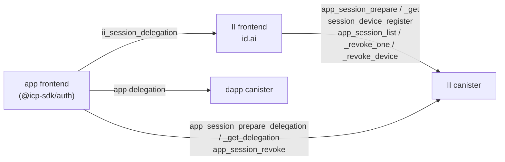
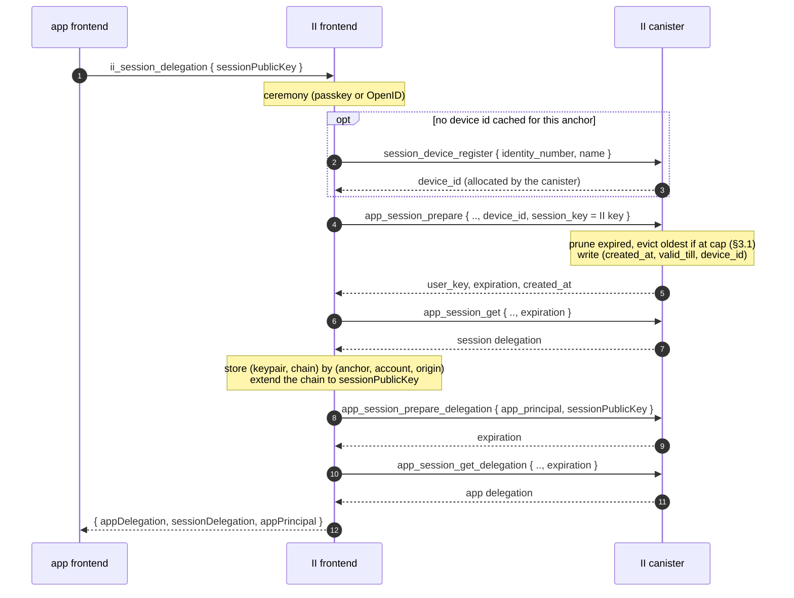
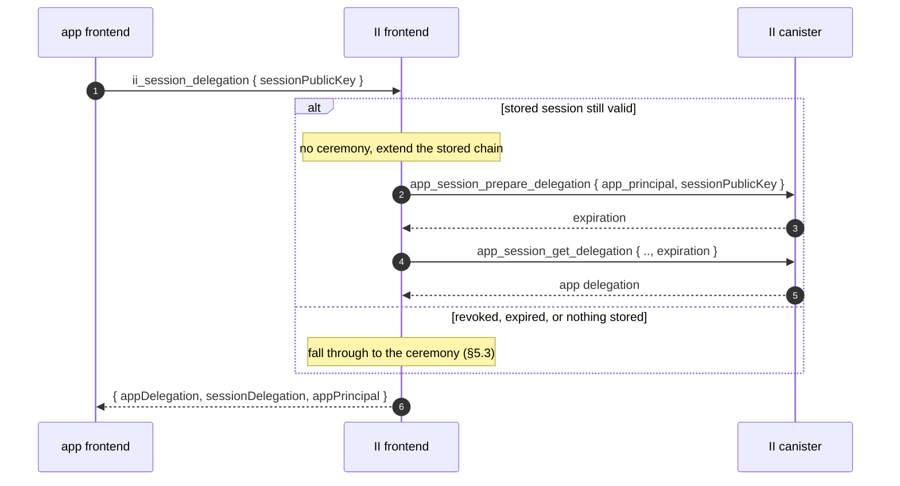
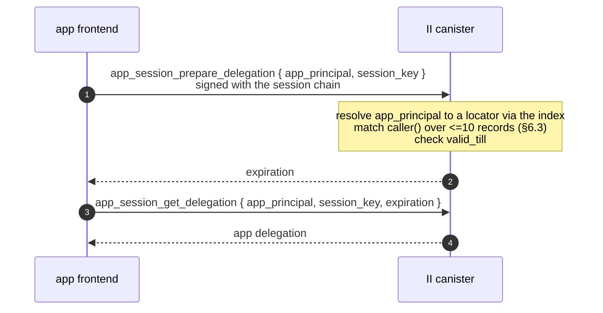
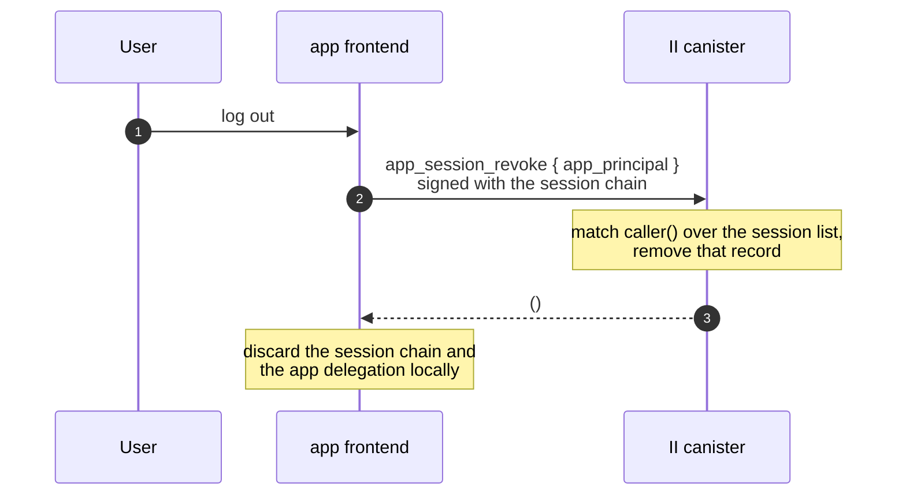
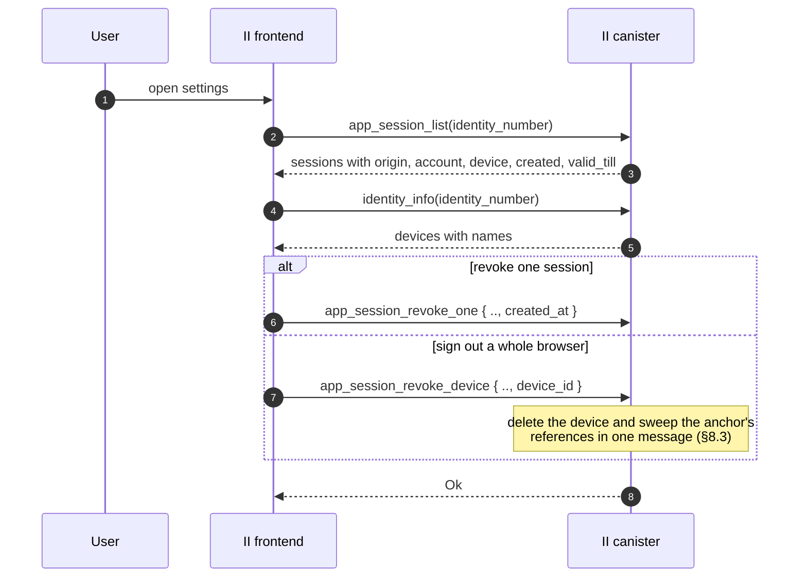

# Revocable app sessions

**Status:** Draft, RFC for review. No code yet.
**Depends on:** `tracked-default-accounts.md`, whose account reference stores a session and whose principal index is on the refresh path.
**Last updated:** 2026-08-18
**Scope:** Canister storage and API, plus the II frontend and its RPC surface. Breaks no existing app: the current RPC methods keep behaving exactly as they do (§10).

An app delegation is unrevocable for as long as it is valid, which is up to 30 days. This makes app delegations short-lived and revocable: II stores a long-lived **session** on the account reference, hands the app a chain rooted at that session, and mints a fresh short-lived app delegation whenever the app asks. Removing the session ends the app's access within one delegation lifetime.



Three things deliberately never happen: the dapp canister never talks to II, the app never goes through the II frontend to refresh, and the II frontend never holds or uses the app's key.

| Method | Called by | Authenticated as | § |
| ------ | --------- | ---------------- | - |
| `ii_session_delegation` (JSON-RPC) | app frontend | the authorize transport | 5.2 |
| `app_session_prepare` / `app_session_get` | II frontend | an anchor access method | 5.3 |
| `session_device_register` | II frontend | an anchor access method | 8.2 |
| `app_session_prepare_delegation` / `app_session_get_delegation` | app frontend | its session chain | 6.1 |
| `app_session_revoke` | app frontend | its session chain | 7.1 |
| `app_session_list` | II frontend | an anchor access method | 7.2 |
| `app_session_revoke_one` / `app_session_revoke_device` | II frontend | an anchor access method | 7.2 |

---

## Glossary

| Term | Meaning |
| ---- | ------- |
| **App delegation** | The short-lived delegation the app uses against dapp canisters. What is up to 30 days today. |
| **Session** | A canister-side record on an account reference, plus the canister-signed identity derived from it. Long-lived and revocable. |
| **Session chain** | The delegation chain rooted at the session identity. Held by the II frontend, extended to the app. |
| **Refresh** | The app calling the II canister with its session chain to mint a new app delegation. No browser involvement. |
| **Silent re-auth** | The app asking II for a delegation again, answered from II's stored session with no ceremony. |
| **Session device** | A per-anchor label for one browser, so a browser's sessions can be listed and revoked together. |

---

## 1. Background

### 1.1 Nothing revokes a delegation today

A delegation is self-contained: the client holds a canister-signed artifact valid until its `expiration`. `DEFAULT_EXPIRATION_PERIOD_NS` is 30 minutes and `MAX_EXPIRATION_PERIOD_NS` is 30 days, with the app choosing via `maxTimeToLive`.

There is no lever. The signature only has to exist in the signature map long enough to be fetched, verification never consults the canister again, and nothing II can do reaches an artifact it has already handed out. Rotating the salt would not help: it changes what future derivations produce without touching an already-signed delegation, so it would strand every existing principal while revoking nothing.

### 1.2 The shape already exists for MCP

`mcp.rs` implements this pattern, scoped to MCP servers:

| Piece | Where |
| ----- | ----- |
| Grant `session principal -> (anchor, expiry, read_only)` | `mcp_grant_memory`, keyed by `self_authenticating(session_key)` |
| Session lifetime 10 minutes to 30 days | `MCP_GRANT_MIN_TTL_NS`, `MCP_GRANT_MAX_TTL_NS` |
| Minted delegations capped at 5 minutes | `MCP_MAX_EXPIRATION_PERIOD_NS` (`mcp.rs:68`) |
| Absolute cap so a delegation cannot outlive its session | `prepare_account_delegation(max_expiration)` |
| Revocation | `remove_mcp_grant` |

So the minting half is already built and shipping. What MCP does not need, and apps do, is many sessions per anchor, somewhere to put them, and a way for a user to see and revoke them. MCP gets one session per anchor with a forward pointer from its config, which is why it needs neither an index nor a cap.

### 1.3 The signature map is not the constraint

`SIGNATURE_EXPIRATION_PERIOD_NS` in `ic-canister-sig-creation` is one minute, and `add_signature` prunes up to 50 expired entries per call. A signature is fetchable for a minute after `prepare`; the delegation the client keeps is the durable artifact. Shortening delegations therefore does not grow the signature map. The cost is call volume (§9).

---

## 2. Goals

1. App delegations short enough that a stolen one expires quickly.
2. A revocable session behind them, so access can be ended without waiting for a delegation to expire.
3. Sessions visible and revocable per browser, not only per app.
4. No new browser plumbing on the refresh path: no navigation, no popup, no iframe.

Non-goals: changing the initial ceremony, and changing anything for apps that have not upgraded their client (§10).

---

## 3. The session record

A session is an entry in a list on the account reference introduced by `tracked-default-accounts.md`:

```rust
SessionRecord {
    created_at: Timestamp,
    valid_till: Timestamp,
    last_refreshed: Option<Timestamp>,  // None until the first refresh
    device_id: u32,
}
```

Nothing else. `created_at`, `valid_till` and `device_id` are fixed for the session's life; `last_refreshed` is the only mutable field.

`last_refreshed` exists for the user rather than for the canister. "This browser used this app 3 minutes ago" against "5 weeks ago" is what makes a session list worth reading, and it is the signal that lets someone spot a session they do not recognise *still being used* rather than merely still existing. §6.4 covers what it costs.

Consequences of putting sessions on the reference rather than in their own map:

- Sessions inherit the per-anchor caps of `tracked-default-accounts.md` §7.3, so they are bounded without new accounting.
- Revoking, expiring and evicting all reuse machinery that already exists.
- The row is written on create, on remove, and on a coarsened refresh stamp (§6.4), and at no other time.

### 3.1 The cap evicts, it never blocks

Ten sessions per account reference. Creating an eleventh does not fail; it drops the oldest. On create:

1. Prune entries whose `valid_till` has passed.
2. If the list is still at the cap, remove the **least recently used** entry: the smallest `last_refreshed`, falling back to `created_at` for a session that has never refreshed.
3. Insert.

Blocking would be the wrong failure: the user is trying to sign in on a new browser and the reason it cannot work is internal bookkeeping. Dropping the stalest session costs that browser a ceremony next time, which is the mildest possible outcome.

Evicting on `last_refreshed` rather than `created_at` is what `last_refreshed` buys here beyond the UI. Ordering by creation would drop a months-old session still in daily use in favour of one created an hour ago and never touched again, which is exactly backwards.

The cap still bounds the refresh loop (§6.3), since the list is never longer than ten either way.

### 3.2 Two further rules

- **A row holding an unexpired session is not evictable.** This extends the eviction predicate in `tracked-default-accounts.md` §6.1. Without it, evicting an account reference would silently destroy a working session.
- **Expired entries are pruned only when the list is written for another reason**, such as creating a session. Pruning on refresh would reintroduce a write on the hot path.

---

## 4. Session identity

```
session_seed = H(salt, "session", anchor, application, account, created_at, device_id)
```

with every field length-prefixed and the account tagged present or absent so `(anchor, app, None)` cannot collide with `(anchor, app, Some(n))`.

The construction needs no allocator: no counter cell, nothing to retire. Uniqueness across anchors is structural, since the locator is an input. Unguessability comes from the salt, exactly as it does for `account_seed`, which hashes the salt together with a plainly sequential `AccountNumber`.

The `device_id` is an input so a session's device attribution cannot be rewritten in storage without invalidating the session.

Only the record's **immutable** fields feed the seed, which is why `last_refreshed` is not one. A mutable input would change the session's principal every time it was stamped.

### 4.1 A same-timestamp collision is an error

`time()` is the round time, so every message in one round sees the same value. Two sessions created for the same `(anchor, application, account)` in the same round would derive the same seed. That is reachable, not theoretical: two tabs, two devices, or a deliberately raced pair of authorize calls.

**It is a typed, retryable error rather than something to disambiguate.** The blast radius is small, since both would-be sessions belong to one account and carry identical authority, so the damage is bookkeeping rather than escalation. And a retry succeeds by construction, because IC time is non-decreasing, so the next round derives a different seed. It has to be a typed variant the client retries automatically, not a trap: the one time it fires it would otherwise look like a hard sign-in failure, indistinguishable from any other.

`EventKey` solves the same problem the other way, pairing a timestamp with a `u16` counter. That is the fallback if the error ever proves noisy in practice.

---

## 5. Creating a session

### 5.1 Chain shape


- The canister signs the session identity to a **non-extractable** key the II frontend generates, and the frontend stores the pair keyed by `(anchor, account, origin)`.
- To give the app access, the frontend **extends the chain** to a public key the app supplies. No private key is shared and neither side loses non-extractability.
- `caller()` derives from the chain's root, the canister-signature key over `session_seed`, so it is the session principal at any chain depth. The canister-side lookup is depth-agnostic.
- The app's hop carries its own shorter expiry and `targets: [ii_canister_id]`. II has never set `targets`, though `delegation_signature_msg_with_permissions` already accepts them. This is a guardrail rather than a defence: see §7.4.

### 5.2 The JSON-RPC method

The app talks to the II frontend over the existing authorize transport. One new II-specific method, `ii_session_delegation`:

```
params:  { sessionPublicKey, accountNumber? }
result:  { appDelegation, sessionDelegation, appPrincipal }
```

It is namespaced `ii_` rather than extending `icrc34_delegation`, for the same reason `prompt` and `hint` ride on the authorize URL instead of the ICRC request: it is not part of the standard, its response carries an artifact the standard has no field for, and apps that do not want a session should not be handed one.

`appDelegation` is the short-lived chain for dapp canisters. `sessionDelegation` is the session chain extended to `sessionPublicKey`. `appPrincipal` is what the app sends back on refresh; it is derivable as `self_authenticating(user_key)`, so the field is a convenience that removes a class of client bug. Both delegations come back together so the app can make its first call without a second round trip.

The session's `valid_till` is deliberately **not** returned. The app refreshes until a refresh fails and then re-authenticates, which is the correct fail-closed behaviour, and `valid_till` is read only by II's own check and by the settings UI.

### 5.3 First sign-in



The anchor-authenticated half of that flow, all checked with `check_authorization(identity_number)`:

```candid
app_session_prepare : (record {
    identity_number : IdentityNumber;
    origin : text;
    account_number : opt AccountNumber;
    device_id : nat32;
    session_key : SessionKey;
    valid_for : opt nat64;          // clamped to the session maximum
}) -> (variant {
    Ok : record { user_key : PublicKey; expiration : Timestamp; created_at : Timestamp };
    Err : SessionCreateError;       // includes the §4.1 retryable collision
});

app_session_get : (record {
    identity_number : IdentityNumber;
    origin : text;
    account_number : opt AccountNumber;
    session_key : SessionKey;
    expiration : Timestamp;
}) -> (variant { Ok : SignedDelegation; Err : SessionCreateError }) query;
```

The `prepare` update plus `get` query split is not a choice: a canister signature has to be added to certified state by an update before a query can fetch it. `mcp_prepare_delegation` and `mcp_get_delegation` are the same shape.

### 5.4 Silent re-auth, when the session is still live



Minting goes through the canister, which is what makes the result revocable. Extending the chain alone would be an offline operation nothing could revoke.

**When this actually avoids a ceremony is narrower than it looks.** Signing out of an app revokes its session (§7.1), so returning to that app afterwards is a ceremony, correctly. The stored session helps when the user did not sign out: a closed tab, an expired app delegation, or a *sibling subdomain* asking for the first time. That last case is the main one, and it is why the frontend keeps the session at all.

The frontend cannot know that an app revoked a session behind its back, so it treats a failed mint as "no session" and falls through to the ceremony rather than surfacing an error.

---

## 6. Refresh



### 6.1 The methods

`caller()` is the session principal. There is no `check_authorization`, so neither method reads the anchor.

```candid
app_session_prepare_delegation : (record {
    app_principal : principal;      // the account's principal at this origin
    session_key : SessionKey;       // the key the app delegation targets
    max_ttl : opt nat64;            // clamped to the app-delegation TTL
    permissions : opt Permissions;  // per request, see below
}) -> (variant { Ok : record { user_key : PublicKey; expiration : Timestamp }; Err : SessionError });

app_session_get_delegation : (record {
    app_principal : principal;
    session_key : SessionKey;
    expiration : Timestamp;         // must match the prepared value
}) -> (variant { Ok : SignedDelegation; Err : SessionError }) query;
```

`SessionError` can and should distinguish its cases (no such session, expired, no match) rather than collapsing them. See §10 for why there is no oracle to hide from.

One asymmetry with MCP: its `read_only` is a property of the grant, applied to everything the session mints. A session record here is `(created_at, valid_till, device_id)` with no access field, so `permissions` is per request instead.

### 6.2 Why `app_principal` and nothing else

The app principal is what the app already knows itself as, and is also `self_authenticating(user_key)` from the original response. `created_at` is deliberately not an argument: the session keypair alone is then sufficient to refresh, so a client holding a usable key can never be blocked because some companion value went missing.

### 6.3 Matching

Resolve `app_principal` to a locator through the principal index of `tracked-default-accounts.md` §9, then walk the session list recomputing `session_seed` until one derives to `caller()`. At ten entries that is roughly twenty hashes, negligible beside the signature insert and root-hash update the call already performs. A wrong `app_principal` simply fails to match, so nothing needs to be trusted.

Expired entries do not match, so an expired session and a revoked one produce one failure with no extra logic.

### 6.4 What refresh writes

Refresh stamps `last_refreshed`. Naively that is a stable write on every call, and since `with_account_mut` rewrites the entire `(anchor, app)` reference-list blob, it rewrites the whole row rather than one field.

**Coalesce it.** Persist only when the stamp would advance by more than a coarsening interval, proposed at one hour. A security signal needs hour resolution, not five-minute resolution: nobody distinguishes "used 4 minutes ago" from "used 9 minutes ago", while "an hour ago" against "five weeks ago" is the entire point. That turns twelve writes per hour per session into one.

It is also small next to what the call already does. Every refresh inserts a canister signature and calls `update_root_hash()`, which rehashes the certified tree. A BTreeMap overwrite of a few hundred bytes is minor beside that. So the reason to coalesce is not that one write is expensive, it is that twelve per hour per active session is pointless when one carries the same information.

**The same coalesced write should stamp the reference's `last_used` as well.** An earlier version of this design had refresh deliberately skip it, purely to avoid a write; once the write happens anyway, keeping `last_used` honest is free, and it keeps the account-level eviction in `tracked-default-accounts.md` accurate for accounts that are only ever reached through a session.

The two timestamps are different fields for different jobs and both are needed:

| Field | Lives on | Drives |
| ----- | -------- | ------ |
| `last_used` | the account reference | account eviction in `tracked-default-accounts.md` §6 |
| `last_refreshed` | the session record | the §3.1 cap eviction and the user-facing session list |

## 7. Revocation

### 7.1 Two entry points, with different authentication

| Caller | Authenticated as | May revoke | Names a session by |
| ------ | ---------------- | ---------- | ------------------ |
| The app | its own session chain, so `caller()` is the session principal | only its own session | the app principal, as in §6 |
| The II frontend | an anchor access method, via `check_authorization` | any session of that anchor | `(origin, account, created_at)`, or a whole `device_id` |

Two sets of methods, and the split falls out of what each caller can prove and what each one knows.

**The app's method is sign-out**, and it is what a user pressing "log out" triggers:

```candid
app_session_revoke : (record { app_principal : principal }) -> ();
```



It needs no authorization check beyond the match refresh already performs, because a caller cannot produce another session's principal, so it can only ever remove its own. It **returns nothing and always succeeds**, which makes sign-out idempotent: a client that retries, or that signs out twice, gets the same answer without having to reason about whether its session was already gone.

The app deliberately cannot revoke anything else. "Sign out everywhere" is the II frontend's operation, not something a dapp can trigger.

### 7.2 The anchor-authenticated methods

```candid
app_session_list : (IdentityNumber) -> (variant { Ok : vec SessionInfo; Err : SessionListError });

type SessionInfo = record {
    origin : text;
    account_number : opt AccountNumber;
    device_id : nat32;
    created_at : Timestamp;
    valid_till : Timestamp;
    last_refreshed : opt Timestamp;   // absent until first used, coarsened to the hour (§6.4)
};

app_session_revoke_one : (record {
    identity_number : IdentityNumber;
    origin : text;
    account_number : opt AccountNumber;
    created_at : Timestamp;
}) -> (variant { Ok; Err : SessionRevokeError });

app_session_revoke_device : (record {
    identity_number : IdentityNumber;
    device_id : nat32;
}) -> (variant { Ok; Err : SessionRevokeError });
```

`app_session_list` is an update rather than a query for the same reason `identity_info` is: a query reply that a single malicious node could forge is not certified, and this one drives a security UI.

These paths name sessions by locator, never by principal, so **they do not touch the principal index**. It is on the refresh path only.



### 7.3 Latency

**Latency is exactly the app-delegation TTL.** Revocation stops new delegations being minted; one already issued stays valid until it expires. `mcp.rs` documents the same residue for its grants. Nothing short of the relying party checking with II on every call improves on it, which is why the TTL is the dial (§9).

### 7.4 What an attacker gets

| Stolen | Today | After |
| ------ | ----- | ----- |
| App delegation | up to 30 days of dapp access, unrevocable | at most one TTL |
| Session chain | no equivalent exists | can mint app delegations until the user revokes it |

The honest reading of the second row: a thief holding the session chain can refresh, so `targets: [ii_canister_id]` is **not** what stops them. What changes their position is that the session is revocable at all, and that the user can see it in a list and end it.

`targets` earns its place as a **developer guardrail**: it makes an app that reaches for the session chain where it meant the app delegation fail immediately and visibly, instead of appearing to work while using a long-lived credential against dapp canisters.

---

## 8. Session devices

### 8.1 Registry

A new additive field on `StorableAnchor`, following the pattern every field there already uses:

```rust
#[n(7)]
pub session_devices: Option<Vec<StorableSessionDevice>>,
```

with `{ id, name, created_at }` per entry, **capped at 20** because the anchor blob is read on nearly every authenticated path, so an unbounded list taxes far more than sessions.

Reading needs no method: devices live on `StorableAnchor`, so they ride on `identity_info` alongside `mcp_config`, which is carried there for exactly this reason.

### 8.2 The canister allocates the id

```candid
session_device_register : (record {
    identity_number : IdentityNumber;
    name : text;
}) -> (variant { Ok : nat32; Err : SessionDeviceError });
```

The id comes from an explicit per-anchor `next_id` in the canister, monotonic and never reused. The frontend does not choose it, does not derive it, and cannot influence it. All it does is cache the value it was given and pass it back on `app_session_prepare`.

Computing `max(ids) + 1` instead would technically be safe given the eager sweep in §8.3, since no session survives referencing a deleted device, but it silently couples id safety to sweep completeness: a later move to lazy revocation would reintroduce misattribution with nothing visibly changing. Four bytes decouples it, and it matches the monotonic-and-never-reissued rule already established for account and application numbers.

### 8.3 Device revocation is an eager sweep

`app_session_revoke_device` removes the device from the anchor and sweeps that anchor's references in the same message: the anchor-major range scan the eviction path already performs, bounded at 1000 rows by `tracked-default-accounts.md` §7.3, writing only rows that actually hold that device's sessions. Atomic, with no partially-revoked state.

Doing it eagerly is what keeps refresh cheap. The alternative, marking a device revoked and checking it during refresh, makes revocation O(1) but adds an anchor read to a call that otherwise never touches the anchor, since refresh authenticates by session chain and never runs `check_authorization`. Refresh happens every few minutes per active session; revocation is rare.

### 8.4 Where a device id may be supplied

`app_session_prepare` accepts a `device_id` only because it is `check_authorization`-gated. No session-authenticated method takes one, and no dapp-reachable surface takes one. Otherwise a dapp could pass an arbitrary id to misattribute its own session into a user's device list, or probe which ids exist by observing which are accepted.

### 8.5 Per anchor, not per browser

The frontend caches one id per anchor, which is deliberate. One id shared across an anchor's apps is exactly the correlation the user wants in their own session list, and no dapp ever sees it. A browser-global id would instead tie two of the user's anchors to one browser, which is what per-anchor separation exists to prevent.

### 8.6 Two accepted limitations

Registration is archived with the name redacted, following `Operation::CreateAccount { name: Private }`. Once per browser per anchor is rare enough to archive, unlike the per-sign-in events that design keeps out of the archive.

The name is self-reported by the client, so it is a label for the user rather than evidence about where a session came from. And clearing browser storage produces a second entry for the same physical device, so the settings UI needs a way to delete stale ones.

---

## 9. Cost, and the TTL dial

Revocation latency, app-delegation TTL and refresh rate are one number. Refresh volume is `N / T`, where `N` counts sessions **actively making calls**, not sessions stored:

| Sessions actively refreshing | T = 5 min | T = 30 min |
| ---------------------------- | --------- | ---------- |
| 100k | 333 update calls/s | 55/s |
| 1M | 3,333/s | 555/s |

Each is a replicated update that inserts a signature and updates the root hash, against a single canister on one subnet. Worth measuring the current `prepare_delegation` rate before fixing T.

Note the stable write from §6.4 does **not** scale with `1/T`, because the stamp is coalesced to a fixed interval. Lowering `T` multiplies the calls, not the writes.


**That table is a ceiling, not a steady state.** Nobody uses an app 24 hours a day. A session refreshes only while its app is open and doing something, so real load is far lower and spread out, driven either on demand when a call finds an expired delegation or by a timer in the client. A stored session that nobody is using costs nothing, since refresh is the only thing that generates load and an idle client does not refresh.

Signing several delegations ahead in one update looks like an escape and is not: revocation latency equals the maximum lifetime of any already-issued delegation, so pre-signing is the same thing as a longer TTL. Without the relying party checking with II per call, T is the only dial.

**T is the open number in this design.** 5 minutes matches what MCP already mints.

---

## 10. Rollout, and what this changes in the previous design

There is no flag day and no ecosystem coordination, because nothing existing changes:

| App | Gets |
| --- | ---- |
| Calls `icrc34_delegation`, as every app does today | Exactly what it gets now, a long-lived delegation, up to `MAX_EXPIRATION_PERIOD_NS` |
| Calls `ii_session_delegation` (§5.2), on a client version that supports it | A session plus short-lived delegations, and refreshes itself |

`MAX_EXPIRATION_PERIOD_NS` is untouched. An app opts in by upgrading its client and calling `ii_session_delegation`, which is also when it acquires the refresh logic it needs. Lowering the cap for everyone is a separate decision for later, once adoption is real. MCP could skip all of this because its client is II's own server implementation.

Two amendments to `tracked-default-accounts.md`:

- **§6.1's eviction predicate** gains "and holds no unexpired session" (§3.2).
- **D24** currently says resolution "never accepts a principal argument", and refresh necessarily does. The invariant that actually matters is narrower:

  > No method returns a locator, an anchor, or anything derived from one unless `caller()` proves possession of a session for it.

  A caller-supplied `app_principal` is fine under that. Success returns only a delegation the caller could already obtain, and the argument needs no trust because the seed recomputation verifies it: a wrong principal simply fails to match (§6.3). What stays banned is a lookup that takes a principal and answers with its locator.

  An earlier version of this section also required unknown-principal and no-session-for-this-caller to be one indistinguishable failure. That is not needed. A canister-signature principal's public key encodes the issuing canister, so anyone holding a delegation chain already knows a principal is II-derived, and the failure modes reveal nothing further: not the anchor, not the origin, not the account. Distinguishable errors are the better trade, since they are what makes a client's own failures diagnosable.

Also out of scope: whether to fold MCP's grant into this mechanism. The value shapes are close, but MCP's grant is a principal-keyed row precisely because it has no account reference to hang off, and its one-session-per-anchor rule would become a special case of §3.1's cap. Unifying is cleaner and touches shipped behaviour.

---

## 11. Decisions

| # | Decision | § |
| - | -------- | - |
| S1 | A session is `(created_at, valid_till, last_refreshed, device_id)` on the account reference; only `last_refreshed` is mutable | 3 |
| S2 | Ten sessions per account reference, enforced by pruning expired then dropping the least recently used. Creating a session never fails on the cap | 3.1 |
| S3 | A row holding an unexpired session is not evictable | 3.2 |
| S4 | Expired entries are pruned only when the list is written for another reason, so refresh never writes | 3.2 |
| S5 | `session_seed = H(salt, "session", anchor, application, account, created_at, device_id)`, no allocator state | 4 |
| S6 | A same-round collision for one account is a typed retryable error, not disambiguated | 4.1 |
| S6a | Only immutable record fields feed the seed, so `last_refreshed` is excluded | 4 |
| S7 | The canister signs the session to a non-extractable II key; II extends the chain to the app's key, sharing no private key | 5.1 |
| S8 | The app's hop carries a shorter expiry and `targets: [ii_canister_id]`, as a developer guardrail rather than a defence | 5.1, 7.4 |
| S9 | `ii_session_delegation` returns both delegations and the app principal; `icrc34_delegation` is untouched | 5.2 |
| S10 | The session's `valid_till` is not returned to the app | 5.2 |
| S11 | Refresh takes `app_principal` only; `created_at` is not an argument, so the keypair alone suffices | 6.2 |
| S12 | Refresh resolves through the principal index and iterates the capped session list | 6.3 |
| S13 | Refresh stamps `last_refreshed` and `last_used`, coalesced to at most one write per hour per session | 6.4 |
| S14 | Two revocation surfaces: the app revokes only its own session via its session chain, the II frontend revokes any via an access method | 7.1 |
| S15 | App-side sign-out returns nothing and always succeeds, so it is idempotent | 7.1 |
| S15a | Session errors are distinguishable, not collapsed: there is no oracle to hide from | 6.1, 10 |
| S16 | Anchor-authenticated methods name sessions by locator, so the principal index is on the refresh path only | 7.2 |
| S17 | Revocation latency is exactly the app-delegation TTL, by construction | 7.3 |
| S18 | Device registry is `StorableAnchor` field 7, capped at 20, read through `identity_info` | 8.1 |
| S19 | The canister allocates device ids from a monotonic per-anchor `next_id`; the frontend only caches and echoes them | 8.2 |
| S20 | Device revocation is an eager atomic sweep, so refresh never reads the anchor | 8.3 |
| S21 | Only `check_authorization`-gated methods accept a `device_id` | 8.4 |
| S22 | The device id is per anchor, never browser-global | 8.5 |
| S23 | Nothing changes for apps on `icrc34_delegation`; opting in means upgrading the client | 10 |
