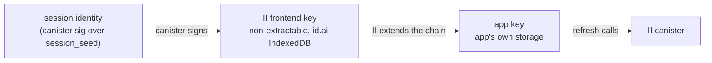
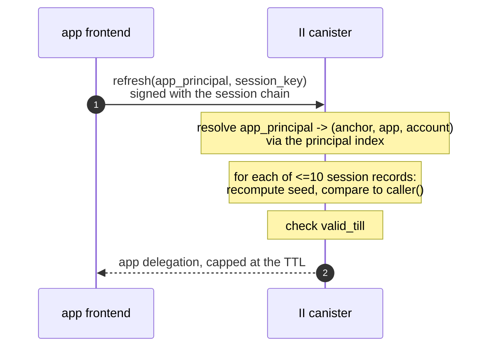
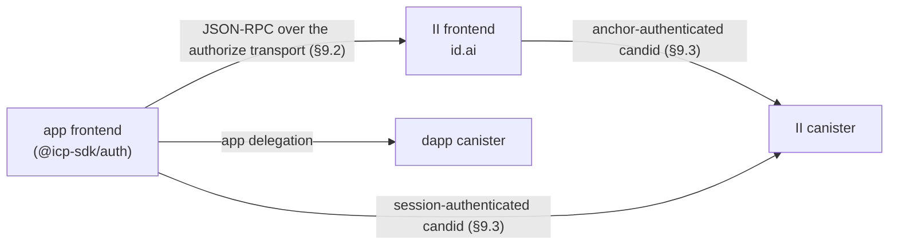
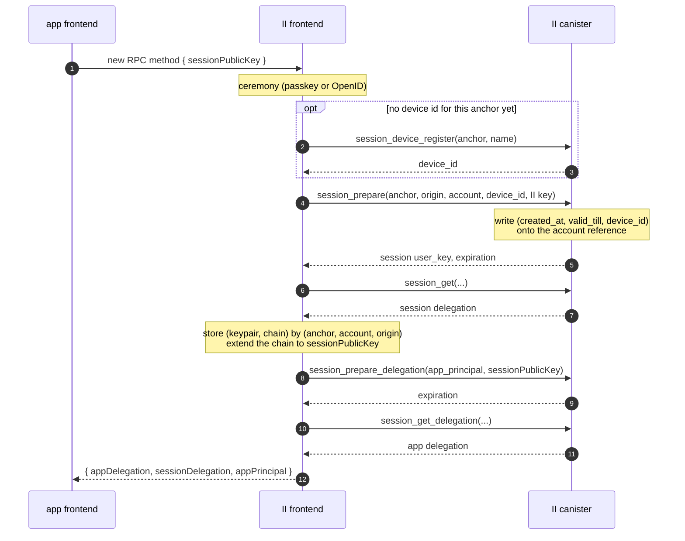
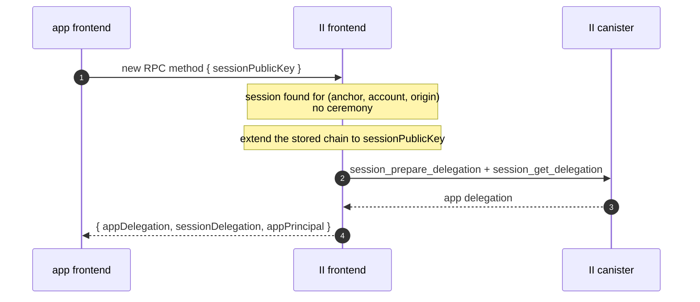
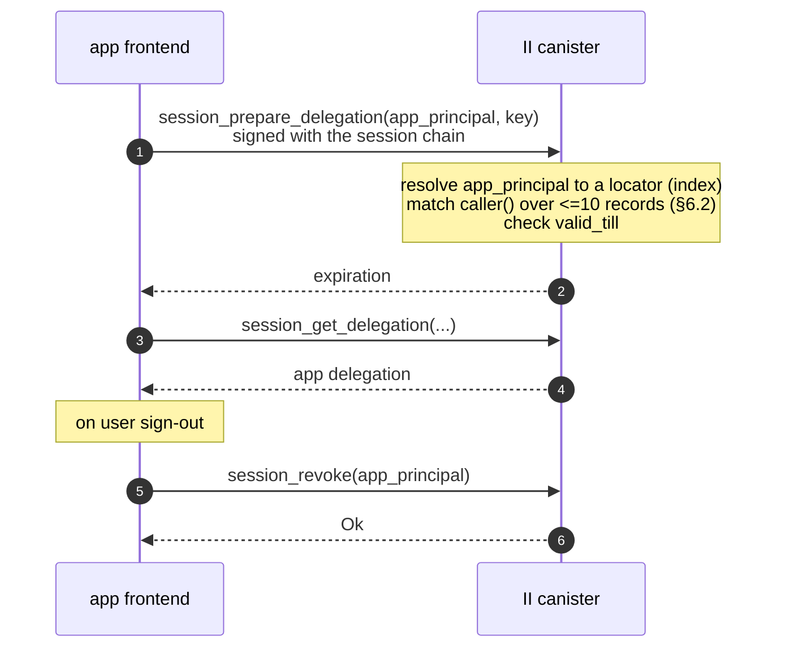
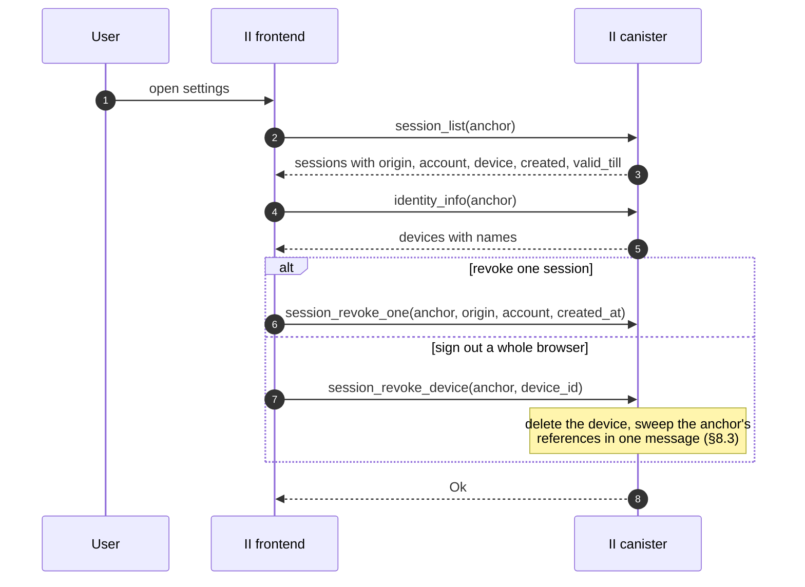

# Revocable app sessions

**Status:** Draft, RFC for review. No code yet.
**Depends on:** `tracked-default-accounts.md`, whose account reference is where a session is stored and whose principal index is on the refresh path.
**Last updated:** 2026-08-18
**Scope:** Canister storage and API, plus the II frontend and RPC surface. Breaking for no existing app: short delegations are opt-in (§11).

An app delegation is unrevocable for as long as it is valid, which is up to 30 days. This makes app delegations short-lived and revocable: II stores a long-lived **session** on the account reference, hands the app a chain rooted at that session, and mints a fresh short-lived app delegation whenever the app asks. Deleting the session ends the app's access within one delegation lifetime.

---

## Glossary

| Term | Meaning |
| ---- | ------- |
| **App delegation** | The short-lived delegation the app uses against dapp canisters. What is 30 days today. |
| **Session** | A canister-side record on an account reference, plus the canister-signed identity derived from it. Long-lived and revocable. |
| **Session delegation** | The chain rooted at the session identity. Held by the II frontend, extended to the app. |
| **Refresh** | The app calling the II canister with its session chain to mint a new app delegation. No browser involvement. |
| **Silent re-auth** | The app asking II for a delegation again, answered from II's stored session with no ceremony. |
| **Session device** | A per-anchor label for one browser, so a browser's sessions can be listed and revoked together. |

---

## 1. Background

### 1.1 Nothing revokes a delegation today

A delegation is self-contained: the client holds a canister-signed artifact valid until its `expiration`. `DEFAULT_EXPIRATION_PERIOD_NS` is 30 minutes and `MAX_EXPIRATION_PERIOD_NS` is 30 days, with the app choosing via `maxTimeToLive`. The signature only has to exist in the signature map long enough to be fetched, so there is nothing left in the canister to remove afterwards, and verification does not consult the canister again. There is no lever at all: nothing II can do reaches a delegation it has already handed out. Rotating the salt would not help either, since it changes what future derivations produce without touching an already-signed artifact, and it would strand every existing principal in the canister while revoking nothing.

### 1.2 The shape already exists for MCP

`mcp.rs` implements exactly this pattern, scoped to MCP servers:

| Piece | Where |
| ----- | ----- |
| Grant `session principal -> (anchor, expiry, read_only)` | `mcp_grant_memory`, keyed by `self_authenticating(session_key)` |
| Session lifetime 10 minutes to 30 days | `MCP_GRANT_MIN_TTL_NS`, `MCP_GRANT_MAX_TTL_NS` |
| Minted delegations capped at 5 minutes | `MCP_MAX_EXPIRATION_PERIOD_NS` (`mcp.rs:68`) |
| Absolute cap so a delegation cannot outlive its session | `prepare_account_delegation(max_expiration)` |
| Revocation | `remove_mcp_grant` |

So the minting half of this design is already built and shipping. What MCP does not need, and this does, is many sessions per anchor, a place to put them, and a way for a user to see and revoke them. MCP gets one session per anchor and points at it from its config, which is why it needs no index and no cap.

### 1.3 The signature map is not the constraint

`SIGNATURE_EXPIRATION_PERIOD_NS` in `ic-canister-sig-creation` is one minute, and `add_signature` prunes up to 50 expired entries per call. A signature is fetchable for a minute after `prepare`; the delegation the client keeps is the durable artifact. Shortening delegations therefore does not grow the signature map. The cost is call volume (§10).

---

## 2. Goals

1. App delegations short enough that a stolen one expires quickly.
2. A revocable session behind them, so access can be ended without waiting for a delegation to expire.
3. Sessions visible and revocable per browser, not only per app.
4. No new browser plumbing on the refresh path: no navigation, no popup, no iframe.

Non-goals: changing how the initial ceremony works, and reducing `MAX_EXPIRATION_PERIOD_NS` for apps that have not opted in (§11).

---

## 3. The session record

A session is an entry in a list on the account reference introduced by `tracked-default-accounts.md`:

```rust
SessionRecord { created_at: Timestamp, valid_till: Timestamp, device_id: u32 }
```

Nothing else. Everything needed to authorize a refresh is either derivable from these three fields or already on the reference.

Consequences of putting it there rather than in its own map:

- Sessions inherit the per-anchor caps of `tracked-default-accounts.md` §7.3, so they are bounded without new accounting.
- Revoking, expiring and evicting all reuse machinery that already exists.
- Because `valid_till` is absolute and there is no per-session `last_used`, **refresh writes nothing to stable memory**. The reference row changes only when a session is created or removed.

Three rules:

- **A hard cap of 10 sessions per account reference.** This is not only storage hygiene: it bounds the refresh loop (§6.2), so it must be enforced at creation rather than treated as a soft limit.
- **A row holding an unexpired session is not evictable.** This extends the eviction predicate in `tracked-default-accounts.md` §6.1. Without it, eviction would silently destroy a working session.
- **Expired entries are pruned only when the list is written for another reason**, such as creating a session. Pruning on refresh would reintroduce a write on the hot path.

---

## 4. Session identity

```
session_seed = H(salt, "session", anchor, application, account, created_at, device_id)
```

domain-separated the way `session_delegation_seed` already is, with every field length-prefixed and the account tagged present or absent so `(anchor, app, None)` cannot collide with `(anchor, app, Some(n))`.

The construction needs no allocator: no counter cell, nothing to retire. Uniqueness across anchors is structural, since the locator is an input. Unguessability comes from the salt, exactly as it does for `account_seed`, which hashes the salt with a plainly sequential `AccountNumber`.

### 4.1 A same-timestamp collision is an error

`time()` is the round time, so every message in one round sees the same value. Two sessions created for the same `(anchor, application, account)` in the same round would derive the same seed. That is reachable, not theoretical: two tabs, two devices, or a deliberately raced pair of authorize calls.

**It is a typed, retryable error rather than something to disambiguate.** The blast radius is small, since both would-be sessions belong to one account and carry identical authority, so the damage is bookkeeping rather than escalation. And a retry succeeds by construction, because IC time is non-decreasing, so the next round derives a different seed. It must be a typed variant the client retries automatically, not a trap: the one time it fires it would otherwise look like a hard sign-in failure and be indistinguishable from any other.

`EventKey` solves the same problem the other way, pairing a timestamp with a `u16` from `get_and_inc_event_data_counter()`. That is the alternative if the error ever proves noisy in practice.

---

## 5. Chain shape, and who holds what



- The canister mints the session delegation to a **non-extractable** key the II frontend generates, and the frontend stores the pair keyed by `(anchor, account, origin)`.
- To give the app access, the frontend **extends the chain** to a public key the app supplies. No private key is shared, and neither side loses non-extractability.
- `caller()` is derived from the chain's root, the canister-signature key over `session_seed`, so it is the session principal at any chain depth. The canister-side lookup is depth-agnostic.
- The app's hop carries **its own, shorter expiry** and `targets: [ii_canister_id]`. II has never set `targets` (every call site passes `None`), but `delegation_signature_msg_with_permissions` already accepts them. This is what makes handing the chain to the app materially different from today's app delegation: a stolen copy can only ask II for a new delegation, never act against a dapp canister.

Two properties fall out:

- **Next auth needs no ceremony.** The frontend still holds the session, so it re-extends a hop instead of running a passkey flow.
- **If the app loses its hop, nothing accumulates.** II extends a fresh one from the same session, rather than creating a second record.

---

## 6. Refresh



### 6.1 Arguments

Only the app principal, plus the session key the new delegation should target. The app principal is what it already knows itself as, and is also `self_authenticating(user_key)` from the original response. `created_at` is deliberately not an argument: the session keypair alone is then sufficient to refresh, so a client holding a usable key can never be blocked by some companion value having gone missing.

### 6.2 Matching

Resolve the app principal to a locator through the principal index of `tracked-default-accounts.md` §9, then walk the session list recomputing `session_seed` until one derives to `caller()`. At ten entries that is roughly twenty hashes, negligible beside the signature insert and root-hash update the call already performs. A wrong app principal simply fails to match, so nothing needs to be trusted.

Expired entries do not match, so an expired session and a revoked one produce one failure with no extra logic.

### 6.3 Refresh must not stamp `last_used`

`prepare_account_delegation` calls `set_account_last_used`, which goes through `with_account_mut` and rewrites the whole reference-list blob. At a five-minute cadence that is twelve full-blob rewrites per hour per session. Refresh needs a variant that skips the stamp. `last_used` then means "last sign-in or ordinary delegation issuance", and session-backed activity is represented by `valid_till` plus the eviction guard in §3, which is also why that guard is a presence check rather than a recency comparison.

---

## 7. Revocation

### 7.1 Two entry points, with different authentication

| Caller | Authenticated as | May revoke | Names a session by |
| ------ | ---------------- | ---------- | ------------------ |
| The app | its own session chain, so `caller()` is the session principal | only its own session | the app principal, as in §6 |
| The II frontend | an anchor access method, via `check_authorization` | any session of that anchor | `(application, account, created_at)`, or a whole `device_id` |

Two candid methods, and the split falls out of what each caller can prove and what each one knows.

**The app's method is sign-out.** It needs no authorization check beyond the seed match refresh already performs: a caller cannot produce another session's principal, so it can only ever remove its own. It **returns Ok unconditionally**, which makes sign-out idempotent and removes the oracle §11 is concerned with, since the response then carries no information about whether a session existed at all.

The app deliberately cannot revoke anything else. "Sign out everywhere" is the II frontend's operation, not something a dapp can trigger.

**The anchor-authenticated methods are session management**: list, revoke one, revoke a device, revoke all. Listing is the anchor-major range scan over the anchor's references, which yields every session together with its locator, so the settings UI renders origin, account, device, created and expiry without a second index.

Note that these paths never touch the principal index. Only the app knows its session by principal; the anchor knows its sessions by locator. So the index is on the refresh path only.

### 7.2 Scopes

| Scope | Mechanism |
| ----- | --------- |
| One session | Remove its entry from the reference's list |
| One device, across every app | Delete the device and sweep the anchor's references (§8.3) |
| Everything for an account | Clear the list |

### 7.3 Latency

**Latency is exactly the app-delegation TTL.** Revocation stops new delegations being minted; one already issued stays valid until it expires. `mcp.rs` documents the same residue for its grants. Nothing short of the relying party checking with II on every call improves on this, which is why the TTL is the dial (§10).

What an attacker gets, before and after:

| Stolen | Today | After |
| ------ | ----- | ----- |
| App delegation | Up to 30 days of dapp access, unrevocable | At most one TTL |
| Session chain | n/a | Revocable, and `targets` prevents it acting against dapp canisters at all |

---

## 8. Session devices

### 8.1 Registry

A new additive field on `StorableAnchor`, following the pattern every field there already uses:

```rust
#[n(7)]
pub session_devices: Option<Vec<StorableSessionDevice>>,
```

with `{ id, name, created_at }` per entry. **Capped at 20**, because the anchor blob is read on nearly every authenticated path, so an unbounded list taxes far more than sessions.

### 8.2 Ids

Monotonic per anchor, from an explicit `next_id`, never reused. Computing `max(ids) + 1` would technically be safe given the eager sweep in §8.3, since no session survives referencing a deleted device, but that silently couples id safety to sweep completeness: a later move to lazy revocation would reintroduce misattribution with nothing visibly changing. Four bytes decouples it, and it matches the monotonic-and-never-reissued rule already established for account and application numbers.

The id is bound into `session_seed` (§4), so a session's device attribution cannot be rewritten in storage without invalidating the session.

### 8.3 Device revocation is an eager sweep

Deleting a device removes it from the anchor and sweeps that anchor's references in the same message: the anchor-major range scan the eviction path already performs, bounded at 1000 rows by `tracked-default-accounts.md` §7.3, writing only rows that actually hold that device's sessions. Atomic, with no partially-revoked state.

Doing it eagerly is what keeps refresh cheap. The alternative, marking a device revoked and checking it during refresh, makes revocation O(1) but adds an anchor read to a call that otherwise never touches the anchor, since refresh authenticates by session chain and never runs `check_authorization`. Refresh happens every few minutes per session; revocation is rare.

### 8.4 Where a device id may be supplied

**Only on the anchor-authenticated authorize path, by the II frontend.** Never by the app, and never on the refresh path. Otherwise a dapp could pass an arbitrary id to misattribute its own session into a user's device list, or probe which ids exist by observing which are accepted.

### 8.5 Per anchor, not per browser

The id is stored per anchor in the II frontend's storage, which is deliberate. One id shared across an anchor's apps is exactly the correlation the user wants in their own session list, and no dapp ever sees it. A browser-global id would instead tie two of the user's anchors to one browser, which is what per-anchor separation exists to prevent.

### 8.6 Two accepted limitations

Registration is archived with the name redacted, following `Operation::CreateAccount { name: Private }`. Once per browser per anchor is rare enough to archive, unlike the per-sign-in events that design keeps out of the archive.

The name is self-reported by the client, so it is a label for the user rather than evidence about where a session came from. And clearing browser storage produces a second entry for the same physical device, so the settings UI needs a way to delete stale ones.

---

## 9. Interfaces

### 9.1 Actors



Three things deliberately do not happen: the dapp canister never talks to II, the app never goes through the II frontend to refresh, and the II frontend never holds or uses the app's key.

### 9.2 JSON-RPC, app to II frontend

| Method | Status | Purpose |
| ------ | ------ | ------- |
| `icrc34_delegation` | unchanged | Today's flow, for apps that have not opted in (§11) |
| `icrc25_*`, `icrc29_status`, `icrc3_attributes` | unchanged | Permissions, transport handshake, attributes |
| **new, II-specific** | added | Returns a short-lived app delegation *and* the session chain in one round trip |

The new method is II-specific rather than an extension of `icrc34_delegation`, for the same reason `prompt` and `hint` ride on the authorize URL instead of the ICRC request: it is not part of the standard, its response carries an artifact the standard has no field for, and apps that do not want a session should not be handed one. Its exact name is open.

```
params:  { sessionPublicKey, accountNumber? }
result:  { appDelegation, sessionDelegation, appPrincipal }
```

`appDelegation` is the short-lived chain for calling dapp canisters. `sessionDelegation` is the session chain extended to `sessionPublicKey`, carrying its own shorter expiry and `targets: [ii_canister_id]`. `appPrincipal` is what the app sends back on refresh; it is derivable as `self_authenticating(user_key)`, so it is a convenience that removes a class of client bug. The session's `valid_till` is deliberately absent (§9.7).

Both are returned together so the app can make its first call without a second round trip.

### 9.3 Candid, grouped by what the caller can prove

Each pair follows the existing `prepare` update plus `get` query split, because a canister signature has to be added to certified state by an update before a query can fetch it. `mcp_prepare_delegation` and `mcp_get_delegation` are the same shape.

**Session-authenticated.** `caller()` is the session principal, matched as in §6.2. No `check_authorization`, so these paths never read the anchor.

| Method | Kind | Purpose |
| ------ | ---- | ------- |
| `session_prepare_delegation(app_principal, session_key, max_ttl?, permissions?)` | update | Mint an app delegation, capped at the TTL and at `valid_till` |
| `session_get_delegation(app_principal, session_key, expiration)` | query | Fetch the signed delegation |
| `session_revoke(app_principal)` | update | Sign-out. Returns Ok unconditionally (§7.1) |

**Anchor-authenticated.** `caller()` is an access method, checked with `check_authorization(anchor)`. These name sessions by locator, never by principal, so they do not touch the principal index.

| Method | Kind | Purpose |
| ------ | ---- | ------- |
| `session_prepare(anchor, origin, account_number?, device_id, session_key)` | update | Create the record and sign the session identity to the II frontend's key |
| `session_get(anchor, origin, account_number?, session_key, expiration)` | query | Fetch the session delegation |
| `session_list(anchor)` | update | Every session of the anchor with its locator, for the settings UI |
| `session_revoke_one(anchor, origin, account_number?, created_at)` | update | Revoke one session |
| `session_revoke_device(anchor, device_id)` | update | Revoke a device and sweep (§8.3) |
| `session_device_register(anchor, name)` | update | Register a browser, returns `device_id` |

`session_list` is an update rather than a query for the same reason `identity_info` is: a query reply a single malicious node could forge is not certified, and this one drives a security UI.

Device *reading* needs no method. Devices live on `StorableAnchor`, so they ride on `identity_info` alongside `mcp_config`, which is already carried there for exactly this reason.

One asymmetry with MCP: its `read_only` is a property of the grant, applied to everything the session mints. A session record here is `(created_at, valid_till, device_id)` with no access field, so `permissions` is per request instead.

### 9.4 First sign-in



### 9.5 Silent re-auth, no ceremony



The difference from today is that minting goes through the canister, which is what makes the result revocable. Extending the chain alone would be an offline operation nothing could revoke.

### 9.6 Refresh and sign-out, with no browser involvement



### 9.7 Session management from the II frontend



### 9.8 Frontend storage

The II frontend keeps `(keypair, chain)` keyed by `(anchor, account, origin)` and reuses it on the next auth for that app. All tabs of an app share the app's own storage, so tabs need nothing extra; the device id is what correlates sessions across different apps in one browser.

## 10. Cost, and the TTL dial

Revocation latency, app-delegation TTL and refresh rate are one number. Refresh volume is `N / T`:

| Concurrent sessions | T = 5 min | T = 30 min |
| ------------------- | --------- | ---------- |
| 100k | 333 update calls/s | 55/s |
| 1M | 3,333/s | 555/s |

Each is a replicated update that inserts a signature and updates the root hash, against a single canister on one subnet. Worth measuring the current `prepare_delegation` rate before fixing T.

Signing several delegations ahead in one update looks like an escape and is not: revocation latency equals the maximum lifetime of any already-issued delegation, so pre-signing is the same thing as a longer TTL. Without the relying party checking with II per call, T is the only dial.

**T is the open number in this design.** 5 minutes matches what MCP already mints.

---

## 11. Rollout, and what this changes in the previous design

`agent-js` does not refresh, so lowering `MAX_EXPIRATION_PERIOD_NS` would log every existing dapp's users out at the new TTL. This ships as an opt-in capability alongside today's long TTLs, and the cap comes down only once client adoption is real. MCP could skip this because its client is II's own server implementation.

Two amendments to `tracked-default-accounts.md`:

- **§6.1's eviction predicate** gains "and holds no unexpired session" (§3).
- **D24** currently says resolution "never accepts a principal argument", and refresh necessarily does. The invariant that actually matters is narrower:

  > No method returns a locator, an anchor, or anything derived from one unless `caller()` proves possession of a session for it. Unknown-principal and no-session-for-this-caller must be one indistinguishable failure.

  A caller-supplied app principal is fine under that, because success returns only a delegation the caller could already obtain. What stays banned is a lookup that takes a principal and answers with its locator. Since the app principal is now attacker-suppliable, both failure paths returning the identical variant is worth a test.

Also out of scope: whether to fold MCP's grant into this mechanism. The value shapes are close, but MCP's grant is a principal-keyed row precisely because it has no account reference to hang off, and its one-session-per-anchor rule would become a special case of §3's cap. Unifying is cleaner and touches shipped behaviour.

---

## 12. Decisions

| # | Decision | § |
| - | -------- | - |
| S1 | A session is `(created_at, valid_till, device_id)` on the account reference, nothing more | 3 |
| S2 | Hard cap of 10 sessions per account reference, because it bounds the refresh loop | 3, 6.2 |
| S3 | A row holding an unexpired session is not evictable | 3 |
| S4 | Expired entries are pruned only when the list is written for another reason, so refresh never writes | 3 |
| S5 | `session_seed = H(salt, "session", anchor, application, account, created_at, device_id)`, no allocator state | 4 |
| S6 | A same-round collision for one account is a typed retryable error, not disambiguated | 4.1 |
| S7 | The canister signs the session to a non-extractable II key; II extends the chain to the app's key, sharing no private key | 5 |
| S8 | The app's hop carries a shorter expiry and `targets: [ii_canister_id]` | 5 |
| S9 | Refresh takes the app principal only; `created_at` is not an argument, so the keypair alone suffices | 6.1 |
| S10 | Refresh resolves through the principal index and iterates the capped session list | 6.2 |
| S11 | Refresh does not stamp `last_used`, so it performs no stable-memory write | 6.3 |
| S12 | Revocation latency is exactly the app-delegation TTL, by construction | 7 |
| S13 | Device registry is `StorableAnchor` field 7, capped at 20 | 8.1 |
| S14 | Device ids come from an explicit monotonic `next_id` and are never reused | 8.2 |
| S15 | Device revocation is an eager atomic sweep, so refresh never reads the anchor | 8.3 |
| S16 | A device id is accepted only on the anchor-authenticated authorize path | 8.4 |
| S17 | The device id is per anchor, never browser-global | 8.5 |
| S18 | A new II-specific RPC method returns both delegations; `icrc34_delegation` is untouched | 9 |
| S19 | The session's `valid_till` is not returned to the app | 9 |
| S20 | Short delegations are opt-in; `MAX_EXPIRATION_PERIOD_NS` is unchanged until adoption | 11 |
| S21 | Two revocation methods: the app revokes only its own session via its session chain, the II frontend revokes any via an anchor access method | 7.1 |
| S22 | App-side sign-out returns Ok unconditionally, so it is idempotent and carries no oracle | 7.1 |
