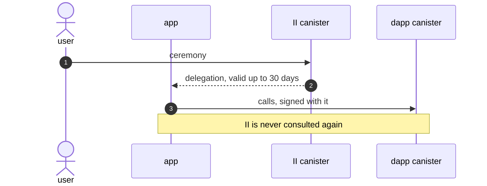

# Revocable app sessions

**Authors:** sea-snake — **Date:** Aug 20, 2026

**Target audience:** Engineers, Security Reviewers, Community Developers

**Status:** Implementation

**Depends on:** `tracked-default-accounts.md`, which supplies the account reference a session is stored on and the principal index the refresh path resolves through.

## Summary

We propose replacing the long-lived delegation an app receives at sign-in with a short-lived one it re-mints from a revocable **session** held by the II canister. Today a delegation is valid for up to 30 days and nothing II or the user does can reach it once it has been issued; signing out clears the app's own storage and invalidates nothing. After this change, ending a session stops new delegations from being minted, so access ends within one delegation lifetime.

Revocable app sessions work as follows. First, the user signs in as they do today, and the II canister records a session on the account the user signed in with. Second, the II frontend hands the app a delegation chain rooted at that session, restricted so it can only call the II canister. Third, the app mints a 5-minute delegation from it whenever it needs one, calling the canister directly with no browser involvement. Finally, the user can end a session — one app, or every app a browser is signed into — from II, and the app's access stops at the next mint.

This also gives the user something they have never had: a list of the browsers they are signed in from, and a way to sign one of them out.

Apps do not implement any of this. `AuthClient` holds the session and re-mints on its own schedule, so an app author still sees a sign-in call and an identity.

## Problem

Internet Identity gives an app a **delegation** at sign-in: a canister-signed artifact naming the app's key and an expiry. The app chooses the lifetime through `maxTimeToLive`, up to `MAX_EXPIRATION_PERIOD_NS`, which is 30 days.

Verification is self-contained. The signature only has to exist in the signature map long enough to be fetched; after that the delegation stands on its own and nothing consults II again.

There is no lever to pull. Rotating the salt changes what future derivations produce without touching an artifact already signed, so it would strand every existing principal while revoking nothing.

Three consequences follow:

| | Today |
| --- | --- |
| A stolen delegation | Works at that dapp until it expires — up to 30 days |
| Signing out | Clears local state. Invalidates nothing already issued |
| Visibility | Neither the user nor II can list or end an active sign-in |

The same gap is why a user cannot sign one browser out. II has no record that a given browser is signed in anywhere, so there is nothing to revoke and nothing to show.

## Out of scope

- **Changing the initial ceremony.** Sign-in is unchanged.
- **Changing anything for apps that have not upgraded their client.** No existing method changes shape or behaviour. An app that does nothing keeps what it has today.
- **Listing an identity's individual sessions.** A flat per-anchor list mixes every origin together and is the wrong shape for a settings screen. Signing a whole browser out is in scope; per-session listing waits for a surface that lists applications.
- **Deleting a device record.** Signing a browser out is in scope. Forgetting the browser is a separate operation, not designed here.
- **Long-lived offline access.** An app that cannot reach II cannot re-mint. That is the trade this design makes.

## Approach

1. **Store a session.** Signing in records a session on the account reference `tracked-default-accounts.md` already keeps: when it was created, when it expires, when it was last used, which browser it came from, and the access level the user consented to.
2. **Hand the app a chain, not a credential.** The canister signs the session to a non-extractable key held by the II frontend, which extends the chain to a key the app supplies. The app's hop carries `targets: [ii_canister_id]`, so it can ask II for delegations and nothing else.
3. **Mint short delegations on demand.** The app calls `app_prepare_delegation` / `app_get_delegation` with that chain and gets a 5-minute delegation for its account principal. This is a direct canister call: no popup, no iframe, no navigation.
4. **Revoke by deleting the record.** No new delegation can be minted, and the one already out expires within five minutes.
5. **Group sessions by browser.** Each session records which browser created it, so the settings UI can list browsers and end all of one browser's sessions at once.

### Core principles

**A session cannot renew or clone itself.** Creating one requires an anchor access method — a passkey, or an OpenID sign-in — which a session does not have. A stolen chain can mint short delegations until it is revoked, and can never extend its own life or spawn a second session.

**An app is never told anything about the identity behind it.** Not the anchor number, not the account number. The only identifier that crosses the boundary is the account's principal, which the app already has. This is the property per-origin derivation exists to protect, and it is why the caller-info bundle names the account by principal.

**Revocation is not best-effort.** A revoked session leaves no record behind to be ignored later, and every failure to resolve one is a single outcome, so a client has one branch to handle rather than a taxonomy.

**The mechanism already ships, scoped to MCP.** `mcp.rs` stores a grant, mints 5-minute delegations against it, and revokes by deleting it:

| Piece | Where |
| ----- | ----- |
| Grant `session principal -> (anchor, expiry, read_only)` | `mcp_grant_memory`, keyed by `self_authenticating(session_key)` |
| Session lifetime 10 minutes to 30 days | `MCP_GRANT_MIN_TTL_NS`, `MCP_GRANT_MAX_TTL_NS` |
| Minted delegations capped at 5 minutes | `MCP_MAX_EXPIRATION_PERIOD_NS` (`mcp.rs:68`) |
| Revocation | `remove_mcp_grant` |

What MCP does not need, and apps do, is many sessions per identity, somewhere to store them, and a way for a user to see and revoke them. MCP has one session per anchor with a forward pointer from its config, which is why it needs neither an index nor a cap.

## System overview

| Layer | Trust | Role |
| ----- | ----- | ---- |
| App frontend | Untrusted (user device) | Requests a session over JSON-RPC, holds the session chain and the caller-info bundle, mints its own app delegations. All of this is `AuthClient`, not app code |
| II frontend | Untrusted (user device) | Runs the ceremony, creates the session, holds the non-extractable key the chain is rooted at, extends the chain to the app's key |
| II canister | Trusted (IC replicas) | Stores sessions on account references, signs session identities and caller-info bundles, mints app delegations, enforces caps and revocation |
| IC protocol (ingress) | Trusted (IC replicas) | Verifies the canister signature on `sender_info` before the message is delivered |
| Dapp canister | Trusted (IC replicas) | Sees an ordinary delegation for the account's principal. Unchanged by this design |

Two properties worth stating explicitly:

- A compromised app or II frontend cannot forge a session. Sessions exist only in canister state, and creating one requires an access method.
- The II canister never trusts what a caller says about itself. The caller-info bundle is authenticated, and the account it names is still checked against `caller()` by recomputing seeds.

### The flow, end to end

Bob signs in to `chat.example.com`, which needs to call its own canister on his behalf.

1. Bob taps sign in. The app's `AuthClient` sends an `ii_session_delegation` request with a freshly generated key.
2. II takes Bob through the regular sign-in flow, and Bob picks which account to use.
3. The II canister records a session on that account, noting the browser Bob is using, and signs the session's identity to the II frontend's own key.
4. The II frontend extends the chain to the app's key, restricted to the II canister, and returns it with a canister-signed bundle naming the account's principal.
5. Whenever the app needs a delegation, it calls II with that chain and the bundle attached, and gets one valid for 5 minutes.
6. Months later Bob opens II settings, sees "Chrome on MacBook", and signs it out. Every session that browser holds is deleted in one message.
7. The app's next mint fails. Bob is signed out of every app he used from that browser, within five minutes.

---

## Specification

The detail needed to build this — exact interfaces, storage shapes, algorithms, caps, and the requirement checklist — is in [revocable-app-sessions-spec.md](revocable-app-sessions-spec.md).

## Implementation stages

| PR | Stage |
| -- | ----- |
| #4241 | Store a session on the account reference |
| #4242 | Register the browser a session came from |
| #4243 | Create sessions and mint app delegations from them |
| #4244 | Record that a session is still in use |
| #4245 | Let an app sign its own session out |
| #4246 | Revoke from the user's own settings |
| #4247 | Hand apps a session over `ii_session_delegation` |
| #4249 | Sign a browser out from settings |

Storage lands first and is inert until something creates a session, so each stage is safe to merge on its own.
