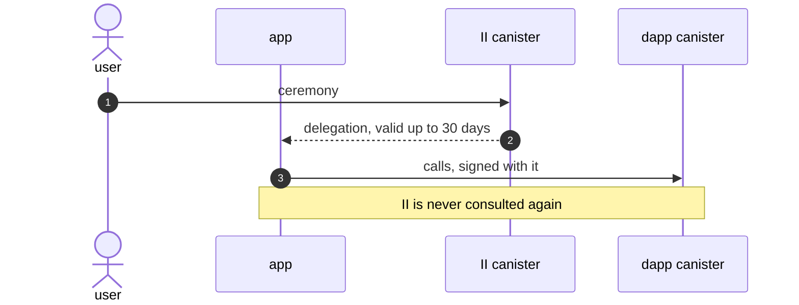

# Revocable app sessions

**Authors:** sea-snake — **Date:** Aug 20, 2026

**Target audience:** Engineers, Security Reviewers, Community Developers

**Status:** Implementation

**Depends on:** `tracked-default-accounts.md`, which supplies the account reference a session is stored on and the principal index the refresh path resolves through.

## Summary

An app delegation cannot be revoked. II signs one at sign-in, the app uses it for up to 30 days, and verification never consults II again, so nothing II or the user does can reach it. Signing out of an app clears that app's own storage and invalidates nothing.

This replaces it with two things. The canister keeps a **session** for the account the user signed in with. The app holds a delegation chain rooted at that session, restricted so it can only call II, and mints itself a 5-minute delegation whenever it needs one. Deleting the session stops further mints, so access ends within five minutes.

Because the canister now knows which browser each session came from, it can also group them: a user can see the browsers they are signed in from and sign one out of every app at once.

A narrower version of this already runs for one internal client, with 5-minute mints and delete-to-revoke. What apps additionally need is many sessions per identity, somewhere to keep them, and a way for the user to see and end them.

Apps do not implement any of it. `AuthClient` holds the session and re-mints on its own schedule, so an app author still writes a sign-in call and gets an identity.

## Problem

Internet Identity gives an app a **delegation** at sign-in: a canister-signed artifact naming the app's key and an expiry. The app chooses the lifetime through `maxTimeToLive`, up to `MAX_EXPIRATION_PERIOD_NS`, which is 30 days.

Verification is self-contained. The signature only has to exist in the signature map long enough to be fetched; after that the delegation stands on its own and nothing consults II again.

Nor is there an indirect way to invalidate one. II derives an account's principal by hashing a secret salt together with the identity and the origin; rotating that salt would change every future derivation without touching an artifact already signed, so it would break every existing principal and revoke nothing.

So:

|                     | Today                                                     |
| ------------------- | --------------------------------------------------------- |
| A stolen delegation | Works at that dapp until it expires — up to 30 days       |
| Signing out         | Clears local state. Invalidates nothing already issued    |
| Visibility          | Neither the user nor II can list or end an active sign-in |

The same gap prevents signing one browser out. II holds no record that a given browser is signed in anywhere, so there is nothing to list and nothing to delete.

## Out of scope

- **Changing the initial ceremony.** Sign-in is unchanged.
- **Changing anything for apps that have not upgraded their client.** No existing method changes shape or behaviour. An app that does nothing keeps what it has today.
- **Listing an identity's individual sessions.** The browser list ships, and signing a browser out with it. Listing the individual sessions behind a browser does not: a flat per-identity list mixes every origin together and wants a surface that lists applications first.
- **Deleting a device record.** Signing a browser out is in scope. Forgetting the browser is a separate operation, not designed here.
- **Long-lived offline access.** An app that cannot reach II cannot re-mint, so an app needing weeks of offline authority is not served by this.

## Approach

1. **Store a session.** Signing in records a session against the account the user chose, on the per-account row that `tracked-default-accounts.md` introduces: when it was created, when it expires, when it was last used, which browser it came from, and the access level the user consented to.
2. **Hand the app a chain, not a credential.** The canister signs the session to a key the II frontend generates and cannot export, and the frontend extends that chain to a key the app supplies. The app's hop is restricted to the II canister, so the chain can be used to ask II for delegations and for nothing else.
3. **Give the app a way to say which account it means.** II signs a small blob naming that account's principal, and the app attaches it to every call. The protocol verifies the signature before the message reaches the canister, so II can read the account off the call without the app being able to name one it was not given. The blob holds the principal and nothing else — none of the numbers II uses internally.
4. **Mint short delegations on demand.** The app calls `app_prepare_delegation` / `app_get_delegation` with that chain and gets a 5-minute delegation for its account principal. This is a direct canister call: no popup, no iframe, no navigation.
5. **Revoke by deleting the record.** No new delegation can be minted, and the one already out expires within five minutes.
6. **Group sessions by browser.** Each session records which browser created it, so the settings UI can list browsers and end all of one browser's sessions at once.

### Core principles

Creating a session requires an access method: a passkey, or an OpenID sign-in. A session is not an access method, so a session cannot create another one or extend its own life. A stolen chain mints 5-minute delegations until it is revoked, and nothing more.

An app is told nothing about the identity behind the account. Not the identity number, not the account number. The only identifier that crosses the boundary is the account's principal, which the app already holds. Two apps comparing notes must not be able to tell they are talking to the same user, which is why the bundle described below names the account by principal rather than by the numbers II uses internally.

Revoking deletes the record rather than marking it, so there is nothing left for a later call to overlook. A call that cannot resolve a usable session gets one error, whatever the cause, so a client has a single failure to handle.

**The mechanism is not new.** A narrower version already runs for MCP servers — II's own server integration — storing a grant, minting 5-minute delegations against it, and revoking by deleting it. That covers minting and revocation. What it does not cover, because one internal client does not need it, is many sessions per identity, a place to keep them, and a user-facing way to see and end them.

## System overview

| Layer                 | Trust                   | Role                                                                                                                             |
| --------------------- | ----------------------- | -------------------------------------------------------------------------------------------------------------------------------- |
| App frontend          | Untrusted (user device) | Requests a session, holds the chain and the account bundle, mints its own delegations. All of this is `AuthClient`, not app code |
| II frontend           | Untrusted (user device) | Runs the ceremony, creates the session, holds the non-extractable key the chain is rooted at, extends the chain to the app's key |
| II canister           | Trusted (IC replicas)   | Stores sessions, signs session identities and account bundles, mints app delegations, enforces caps and revocation               |
| IC protocol (ingress) | Trusted (IC replicas)   | Verifies the signature on the attached bundle before the message reaches the canister                                            |
| Dapp canister         | Trusted (IC replicas)   | Sees an ordinary delegation for the account's principal. Unchanged by this design                                                |

A compromised app or II frontend cannot forge a session, because sessions exist only in canister state and creating one requires an access method.

The canister does not take a caller's word for which account it is calling about. The bundle is signed by II, so it cannot be fabricated, and the account it names is checked against the calling key before anything is minted.

### Security properties

A reviewer will ask these first, so they are stated here rather than left to the specification.

**A browser cannot claim to be another browser.** The client caches an id and presents it on the next sign-in, but it does not get to choose one. An id the identity does not already hold resolves to a fresh registration rather than to somebody else's entry, so a hostile page can neither attach its session to a browser the user recognises nor hide its own from the list.

**The 5-minute ceiling is enforced by the canister, not requested by the app.** Both halves of the mint re-derive it, so an app cannot ask for longer and cannot have a delegation witnessed that outlives its session. Without that, revocation would be advisory.

**A stolen chain is bounded but not harmless.** It mints 5-minute delegations until the session is revoked, and the user's lever is the browser list. This is why the leaf key `AuthClient` generates should be non-extractable, and why the browser list carries a last-used time: a session the user does not recognise is the signal to act.

**The chain cannot be used against a dapp canister.** The app's hop is restricted to the II canister when the II frontend constructs it, and the restriction is part of what the canister signs over, so an app that reaches for the session chain where it meant its app delegation fails visibly rather than appearing to work.

**Eviction cannot destroy a live session.** `tracked-default-accounts.md` reclaims idle rows, and a session lives on such a row. A row holding an unexpired session is excluded from eviction, so driving a user through many dapps cannot be used to knock out their sessions elsewhere.

**Attaching the bundle relies on an IC extension.** Carrying canister-signed caller information on an ingress message is a protocol feature currently being specified, and the same one the identity-attributes work uses. Until it is available on mainnet, this design cannot ship.

### The flow, end to end

Bob signs in to `chat.example.com`, which needs to call its own canister on his behalf.

1. Bob taps sign in. The app's `AuthClient` sends an `ii_session_delegation` request with a freshly generated key.
2. II takes Bob through the regular sign-in flow, and Bob picks which account to use.
3. The II canister records a session on that account, noting the browser Bob is using, and signs the session's identity to the II frontend's own key.
4. The II frontend extends the chain to the app's key, restricted to the II canister, and returns it with a canister-signed bundle naming the account's principal.
5. Whenever the app needs a delegation, it calls II with that chain and the bundle attached, and gets one valid for 5 minutes.
6. Months later Bob opens II settings, sees "Chrome on MacBook", and signs it out. Every session that browser holds is deleted in one message.
7. The app's next mint fails. Bob is signed out of every app he used from that browser, within five minutes.

---

## Specification

The detail needed to build this — exact interfaces, storage shapes, algorithms, caps, and the requirement checklist — is in [revocable-app-sessions-spec.md](revocable-app-sessions-spec.md).

## Implementation stages

| PR    | Stage                                                                                   |
| ----- | --------------------------------------------------------------------------------------- |
| #4241 | Store a session on the account reference                                                |
| #4242 | Register the browser a session came from                                                |
| #4243 | Create sessions and mint app delegations from them                                      |
| #4244 | Record that a session is still in use                                                   |
| #4245 | Let an app sign its own session out                                                     |
| #4246 | Revoke from the user's own settings                                                     |
| #4247 | Hand apps a session over `ii_session_delegation`                                        |
| #4248 | Answer a silent re-auth without rendering, including the liveness check `check_session` |
| #4249 | Sign a browser out from settings                                                        |

Storage lands first and is inert until something creates a session, so each stage is safe to merge on its own.
