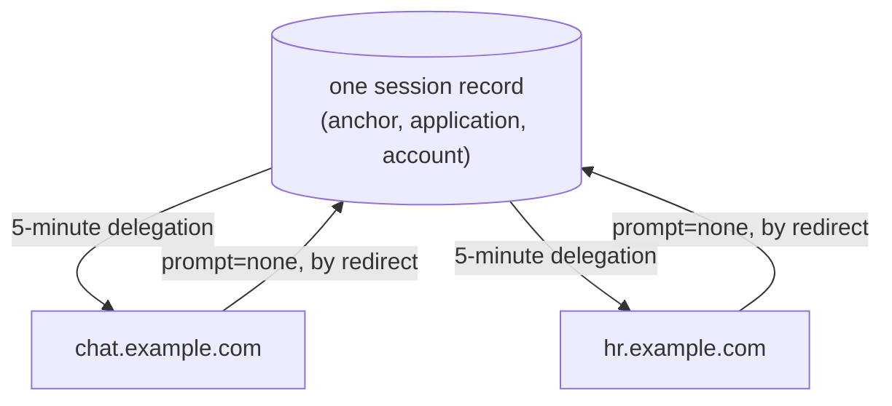
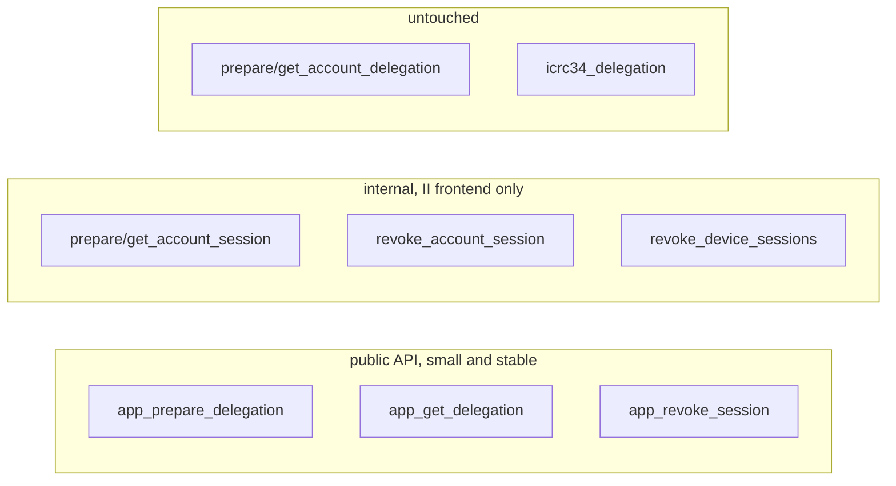

# Shared revocable sessions

**Status:** Overview. The designs are the three docs in [§5](#5-read-further); this page is the shape of them.
**Last updated:** 2026-08-18

Today a sign-in is a bearer token that nobody can take back for up to 30 days. This replaces it with a short-lived delegation over a revocable session, which also lets sibling subdomains share one sign-in.

---

## 1. Today

The delegation is a self-contained signed artifact. Once II hands it over, II is out of the loop.

| Property | Today |
| -------- | ----- |
| Lifetime | Up to 30 days, chosen by the app |
| Revocation | **None at all.** Verification never calls back into II, so nothing II can do reaches an issued delegation |
| Stolen delegation | Full access at that dapp for whatever remains of its 30 days |
| Signing out | Local only. Clearing browser state invalidates nothing already issued |
| Visibility | Neither the user nor II can see, list, or end an active sign-in |

---

## 2. After

The long-lived thing becomes a **session**: a canister record the user can see and end. The thing the app carries becomes short-lived, and getting a new one means asking II, which is what gives II a say again.

| Property | After | Why |
| -------- | ----- | --- |
| Lifetime | 5 minutes | Matches what MCP already mints |
| Revocation | Latency is exactly the delegation lifetime | Revoking stops new mints; one already issued runs out |
| Stolen delegation | At most 5 minutes | |
| Stolen session chain | Revocable, and `targets` stops it reaching dapp canisters directly | The real protection is that it can be revoked at all |
| Signing out | Actually revokes, canister-side | The app's own sign-out removes its session record |
| Visibility | Per browser, with a last-used timestamp | "This device used this app 3 minutes ago" against "5 weeks ago" |
| Cost | One update call per active session per 5 minutes | No browser round trip. The app calls the canister directly |

Two properties worth noting because they are not obvious:

- **A session cannot renew or clone itself.** Creating one needs an anchor access method, which a session does not have, so a stolen chain can only mint short delegations until revoked.
- **Refresh needs no browser.** The app talks to the canister directly, so there is no popup, no iframe, and no navigation on the five-minute cadence.

---

## 3. Sibling subdomains

Apps sharing a `derivationOrigin` resolve to the same principal, so they resolve to one application, so they share **one** session record. Sign in on one and the others re-issue from it silently. Sign out of one and the others have nothing left to re-issue from.

That is not a copy between apps and not a cookie trick. There is one record and the siblings take turns.

---

## 4. What changes where

No existing method changes shape or behaviour, so nothing breaks and nothing has to move at once. An app opts in by upgrading its client; until it does, it gets exactly what it gets today.

---

## 5. Read further

| Doc | Covers |
| --- | ------ |
| [Account tracking, reaping, and principal lookup](tracked-default-accounts.md) | The storage this is built on: tracking every account, reaping dead applications, and the index that resolves a principal to an account |
| [Revocable app sessions](revocable-app-sessions.md) | The session record, its identity and chain, refresh, revocation, and session devices |
| [Silent re-auth over the redirect transport](silent-reauth-redirect.md) | `prompt=none`, `hint`, and what II supplies for the sibling flow |
| [Shared sessions, client side](https://github.com/dfinity/icp-js-auth/blob/5aa78d5f64714d6e8e7781e256562035c09018c6/docs/src/content/docs/shared-sessions.md) | What an app does: `derivationOrigin`, the cookie, and the `/reauth` page |
