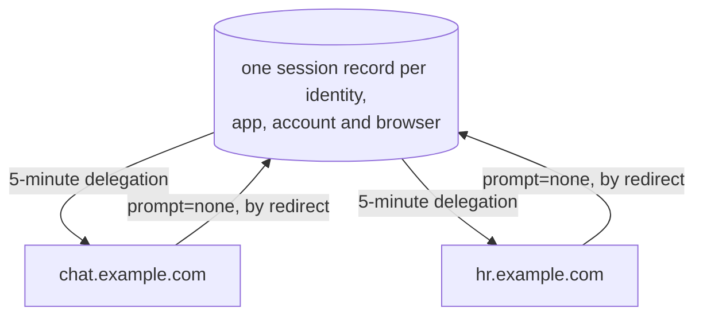

# Shared revocable sessions

## Summary

When a user signs in to an app, II gives it a signed statement that a key may act for the user until a stated expiry, for up to 30 days. Anything on the network can check that statement without asking II, which is what makes it cheap, and also means II cannot take it back. Signing out of the app clears the app's own storage and invalidates nothing. Separately, an app running as several subdomains cannot share one sign-in, so the user signs in on each and signing out of one leaves the others signed in.

Four designs together replace that. The II canister keeps a session for the account the user signed in with, and the app holds a chain rooted at it that can only be used to ask II for delegations. The app mints itself a 5-minute delegation whenever it needs one. Deleting the session stops further mints, so access ends within five minutes. Because the II canister now records which browser each session came from, a user can see the browsers they are signed in from and sign one out of every app at once. And because subdomains that share a derivation origin resolve to the same account, they share one session, so signing in on one lets the others get delegations without another sign-in. The fourth design is the client library's half: `AuthClient` holds the session, mints the delegations, and revokes at sign-out, so an app calls `signIn()` and `getIdentity()` as it does today and never handles a session itself.

Read this page first. The four designs are linked at the end, each with a separate specification for implementers.

## Context

A few terms, because the rest of this page and the four designs use them.

An **identity** is what a user signs in with. An **account** is what one identity looks like
at one app: the same user appears as a different **principal** at every app they visit, so
two apps cannot tell they are talking to the same person. A **delegation** is a short signed
statement that a particular key may act for a particular principal until a stated expiry;
it is what an app receives at sign-in and signs its calls with. A **delegation chain** is
one or more of those in sequence, each authorising the next key.

When a user signs in to an app with Internet Identity, the app receives a **delegation**: a signed artifact naming a key, valid for up to 30 days, chosen by the app.

Verifying it never calls back into II. That is what makes it fast and cheap, and it is also why, once II hands it over, II is out of the loop entirely.

## Problem

A sign-in hands over a bearer token nobody can take back.

|                     | Today                                                                         |
| ------------------- | ----------------------------------------------------------------------------- |
| Revocation          | **None at all.** Nothing II can do reaches a delegation it has already issued |
| A stolen delegation | Full access at that app for whatever remains of its 30 days                   |
| Signing out         | Local only. Clearing browser state invalidates nothing already issued         |
| Visibility          | Neither the user nor II can see, list, or end an active sign-in               |

There is a second, related gap: sibling subdomains cannot share a sign-in.

A user signs in separately on each, and signing out of one leaves the others signed in.

## Out of scope

Across all four designs:

- Nothing an app calls changes shape or behaviour, so an app that does not upgrade its client keeps exactly what it has today.
- The ceremony a user sees does not change. What changes behind it is that a sign-in records which app it was for.
- Listing the individual sessions behind a browser is not built. The browser list is.
- Removing a browser from the list, as opposed to signing it out, is not built.
- An app that needs authority while it cannot reach II is not served by this.

## Approach

Split the one long-lived artifact into two: a **session** the II canister holds and the user can end, and a **short-lived delegation** the app carries.

Getting a fresh delegation means asking II, and that is what gives II a say again.

|                        | After                                                                     | Why                                                                                                                                                                                                 |
| ---------------------- | ------------------------------------------------------------------------- | --------------------------------------------------------------------------------------------------------------------------------------------------------------------------------------------------- |
| Delegation lifetime    | 5 minutes                                                                 | Matches what II already mints for MCP servers                                                                                                                                                       |
| Session lifetime       | Up to 30 days, and revocable at any point in it                           | Thirty days still bounds a sign-in. What changes is where that bound lives, and that it can be ended                                                                                                |
| Revocation             | Takes effect within one delegation lifetime                               | Revoking stops new mints; one already issued runs out                                                                                                                                               |
| A stolen delegation    | At most 5 minutes of access                                               | Its lifetime is the ceiling on how long a theft is useful, and refreshing again means asking II, which can refuse                                                                                   |
| A stolen session chain | Mints five-minute delegations until the user revokes it, and nothing more | Revocability is the whole protection. Restricting the chain's final hop to the II canister is a developer guardrail, not a defence against a thief, who can refresh with it either way              |
| Signing out            | Actually revokes, in the II canister                                      | The app's own sign-out removes its session record                                                                                                                                                   |
| Visibility             | Per browser, with a last-used timestamp                                   | "This browser used this app 3 minutes ago" against "5 weeks ago"                                                                                                                                    |
| Cost                   | One update call per active origin per 5 minutes                           | The app calls the canister directly, no browser round trip. Sibling subdomains share a session but each signs with its own key, so each is its own origin here; the tabs of one share a single call |

Two properties that are easy to miss:

- **A session cannot renew or clone itself.**  
  Creating one requires a passkey or an OpenID sign-in, which a session does not have. A stolen chain can only mint short delegations until it is revoked.
- Refresh needs no browser: The app talks to the II canister directly, so there is no popup, iframe, or navigation on the five-minute cadence.

---

## How siblings share one sign-in

Subdomains sharing a derivation origin resolve to the same account, so a session created by one is a session the others can be given a delegation from. Signing in on one lets the others get their own delegation without another sign-in, and ending it leaves none of them anything to ask for.

No credential is copied between the subdomains. Each asks II for a delegation to its own key, and II answers from the session it already holds for that account.

---

## What changes where

| Method                                                  | Who calls it                   | New?      | What it does                                         |
| ------------------------------------------------------- | ------------------------------ | --------- | ---------------------------------------------------- |
| `app_prepare_delegation` / `app_get_delegation`         | app frontend, via `AuthClient` | New       | Mints a 5-minute delegation from a live session      |
| `app_revoke_session`                                    | app frontend, via `AuthClient` | New       | The app's own sign-out. Deletes its session record   |
| `check_session`                                         | II frontend                    | New       | Whether a session is still live, for the silent path |
| `prepare_account_session` / `get_account_session`       | II frontend                    | New       | Creates a session and signs its identity             |
| `revoke_account_session` / `revoke_device_sessions`     | II frontend                    | New       | Ends one session, or every session a browser holds   |
| `prepare_account_delegation` / `get_account_delegation` | II frontend                    | Untouched | The delegation flow as it works today                |
| `icrc34_delegation`                                     | app frontend                   | Untouched | Unchanged, and unaware of any of this                |

Of the new methods, the three `app_`-prefixed ones are callable by anything holding a session chain, and none of them names an identity. `check_session` is chain-authenticated too, because the silent path has no access method to offer; all it reveals is whether a session the caller already holds is still live. The remaining unprefixed methods require an access method an app has no way to present.

No existing method changes shape or behaviour, so nothing breaks and nothing has to move at once. An app opts in by upgrading its client; until it does, it gets exactly what it gets today.

---

## Order of work

The four designs are not independent. Account tracking has to land first: it supplies the
row a session is stored on and the index that resolves an app's principal back to an
account. Sessions come next, ending with the settings screen that lists browsers. Silent
re-auth is last and smallest, and only becomes reachable once sessions exist.

None of it reaches an app until the client library holds a session, which is the fourth
design and lands in [`icp-js-auth`](https://github.com/dfinity/icp-js-auth) rather than
here. It can be built as soon as sessions exist, and it is what turns the canister work into
something an app can use.

Each design's own stages are listed in its doc.

## Read further

Each feature has a design doc for what and why, and a specification for how. The last two rows are neither. One is what has to be observably true once they are built; the other is the dashboard that would watch them, panel by panel.

| Design                                                                  | Specification                            | Covers                                                                                                                                                    |
| ----------------------------------------------------------------------- | ---------------------------------------- | --------------------------------------------------------------------------------------------------------------------------------------------------------- |
| [Account tracking](tracked-default-accounts.md)                         | [spec](tracked-default-accounts-spec.md) | The storage this is built on: recording which apps an identity uses, reclaiming unused app records, and the index that resolves a principal to an account |
| [Revocable app sessions](revocable-app-sessions.md)                     | [spec](revocable-app-sessions-spec.md)   | The session record, its identity and chain, refresh, revocation, and session devices                                                                      |
| [Silent re-auth over the redirect transport](silent-reauth-redirect.md) | [spec](silent-reauth-redirect-spec.md)   | `prompt=none`, `hint`, and what II supplies for the sibling flow                                                                                          |
| [App sessions in the client library](client-app-sessions.md)            | [spec](client-app-sessions-spec.md)      | What `@icp-sdk/auth` does: acquires the session, mints five-minute delegations from it, and revokes at sign-out, with none of it in its public API        |
| [Session test scenarios](session-test-scenarios.md)                     |                                          | The states to start from, what to do, and what must then hold, each cited against the requirements it exercises                                           |
| [Metrics dashboards](metrics-dashboards/README.md)                      |                                          | The five proposed dashboards, each panel with the one it replaces, its sources and its query folded underneath                                            |
