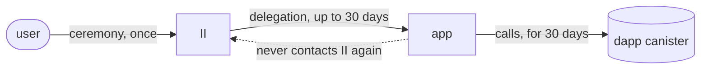
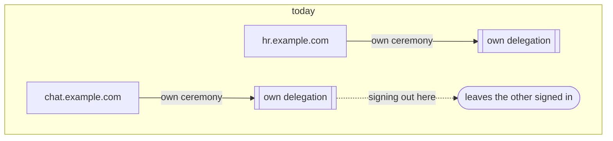
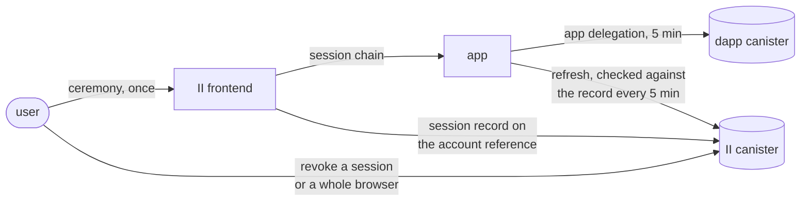
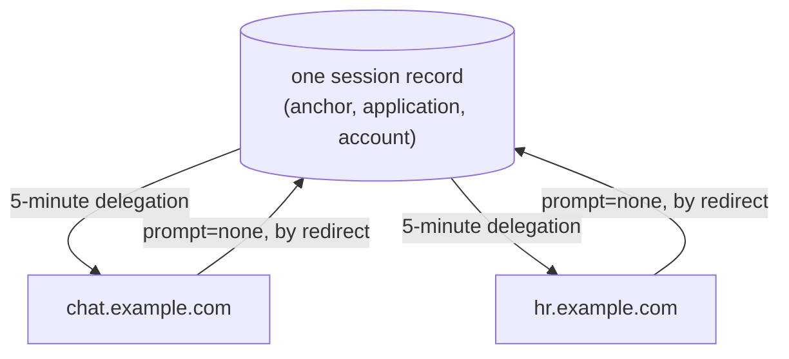
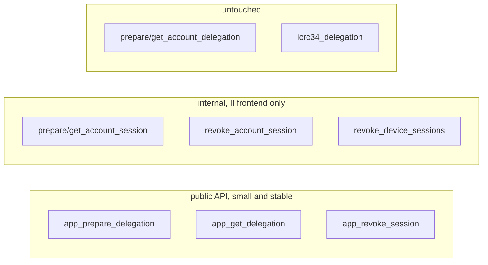

# Shared revocable sessions

**Author:** sea-snake — **Date:** 2026-08-19 — **Status:** Overview, RFC for review

This page is the shape of three designs, linked at the end. Read it first; read those for detail.

## Context

When a user signs in to a dapp with Internet Identity, the dapp receives a **delegation**: a signed artifact naming a key, valid for up to 30 days, chosen by the dapp.

Verifying it never calls back into II. That is what makes it fast and cheap, and it is also why, once II hands it over, II is out of the loop entirely.

## Problem

A sign-in is a bearer token nobody can take back.

| | Today |
| -------- | ----- |
| Revocation | **None at all.** Nothing II can do reaches a delegation it has already issued |
| A stolen delegation | Full access at that dapp for whatever remains of its 30 days |
| Signing out | Local only. Clearing browser state invalidates nothing already issued |
| Visibility | Neither the user nor II can see, list, or end an active sign-in |

There is a second, related gap: sibling subdomains cannot share a sign-in.

A user signs in separately on each, and signing out of one leaves the others signed in.

## Solution

Split the one long-lived artifact into two: a **session** the canister holds and the user can end, and a **short-lived delegation** the app carries.

Getting a fresh delegation means asking II, and that is what gives II a say again.

| | After | Why |
| -------- | ----- | --- |
| Delegation lifetime | 5 minutes | Matches what MCP already mints |
| Revocation | Takes effect within one delegation lifetime | Revoking stops new mints; one already issued runs out |
| A stolen delegation | At most 5 minutes of access | |
| A stolen session chain | Revocable, and `targets` stops it reaching dapp canisters directly | The real protection is that it can be revoked at all |
| Signing out | Actually revokes, canister-side | The app's own sign-out removes its session record |
| Visibility | Per browser, with a last-used timestamp | "This browser used this app 3 minutes ago" against "5 weeks ago" |
| Cost | One update call per active session per 5 minutes | The app calls the canister directly — no browser round trip |

Two properties that are easy to miss:

- **A session cannot renew or clone itself.** Creating one requires an anchor access method, which a session does not have. A stolen chain can only mint short delegations until it is revoked.
- **Refresh needs no browser.** The app talks to the canister directly, so there is no popup, iframe, or navigation on the five-minute cadence.

---

## How siblings share one sign-in

Apps sharing a `derivationOrigin` resolve to the same principal, so they resolve to one application, so they share **one** session record. Sign in on one and the others re-issue from it silently. Sign out of one and the others have nothing left to re-issue from.

That is not a copy between apps and not a cookie trick. There is one record and the siblings take turns.

---

## What changes where

No existing method changes shape or behaviour, so nothing breaks and nothing has to move at once. An app opts in by upgrading its client; until it does, it gets exactly what it gets today.

---

## Read further

| Doc | Covers |
| --- | ------ |
| [Account tracking, reaping, and principal lookup](tracked-default-accounts.md) | The storage this is built on: tracking every account, reaping dead applications, and the index that resolves a principal to an account |
| [Revocable app sessions](revocable-app-sessions.md) | The session record, its identity and chain, refresh, revocation, and session devices |
| [Silent re-auth over the redirect transport](silent-reauth-redirect.md) | `prompt=none`, `hint`, and what II supplies for the sibling flow |
| [Shared sessions, client side](https://github.com/dfinity/icp-js-auth/blob/5aa78d5f64714d6e8e7781e256562035c09018c6/docs/src/content/docs/shared-sessions.md) | What an app does: `derivationOrigin`, the cookie, and the `/reauth` page |
