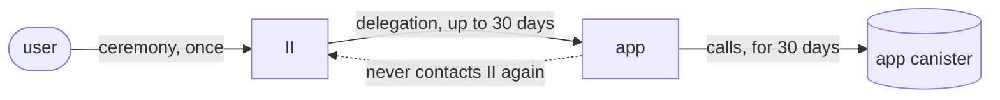
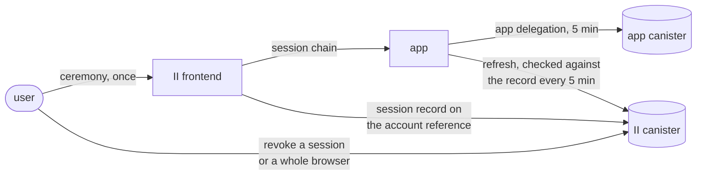
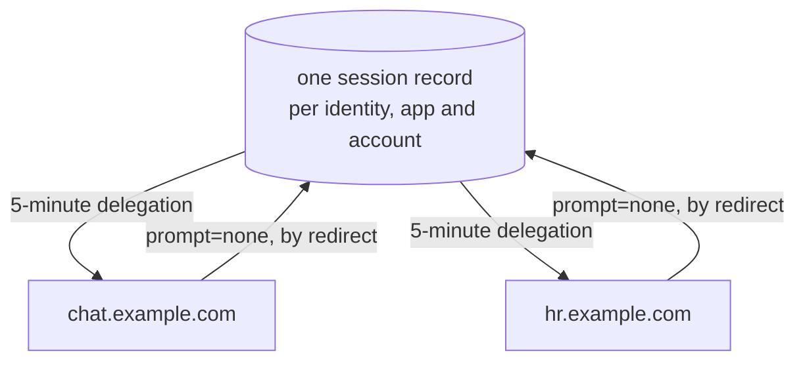

# Shared revocable sessions

## Summary

When a user signs in to an app, II gives it a signed statement that a key may act for the user until a stated expiry, for up to 30 days. Anything on the network can check that statement without asking II, which is what makes it cheap, and also means II cannot take it back. Signing out of the app clears the app's own storage and invalidates nothing. Separately, an app running as several subdomains cannot share one sign-in, so the user signs in on each and signing out of one leaves the others signed in.

Three designs together replace that. The canister keeps a session for the account the user signed in with, and the app holds a chain rooted at it that can only be used to ask II for delegations. The app mints itself a 5-minute delegation whenever it needs one. Deleting the session stops further mints, so access ends within five minutes. Because the canister now records which browser each session came from, a user can see the browsers they are signed in from and sign one out of every app at once. And because subdomains that share a derivation origin resolve to the same account, they share one session, so signing in on one lets the others get delegations without another sign-in.

Read this page first. The three designs are linked at the end, each with a separate specification for implementers.

## Context

When a user signs in to an app with Internet Identity, the app receives a **delegation**: a signed artifact naming a key, valid for up to 30 days, chosen by the app.

Verifying it never calls back into II. That is what makes it fast and cheap, and it is also why, once II hands it over, II is out of the loop entirely.

## Problem

A sign-in is a bearer token nobody can take back.

|                     | Today                                                                         |
| ------------------- | ----------------------------------------------------------------------------- |
| Revocation          | **None at all.** Nothing II can do reaches a delegation it has already issued |
| A stolen delegation | Full access at that app for whatever remains of its 30 days                   |
| Signing out         | Local only. Clearing browser state invalidates nothing already issued         |
| Visibility          | Neither the user nor II can see, list, or end an active sign-in               |

There is a second, related gap: sibling subdomains cannot share a sign-in.

A user signs in separately on each, and signing out of one leaves the others signed in.

## Approach

Split the one long-lived artifact into two: a **session** the canister holds and the user can end, and a **short-lived delegation** the app carries.

Getting a fresh delegation means asking II, and that is what gives II a say again.

|                        | After                                                             | Why                                                              |
| ---------------------- | ----------------------------------------------------------------- | ---------------------------------------------------------------- |
| Delegation lifetime    | 5 minutes                                                         | Matches what MCP already mints                                   |
| Session lifetime       | Up to 30 days, and revocable at any point in it                   | The lifetime is unchanged. What changes is that it can be ended  |
| Revocation             | Takes effect within one delegation lifetime                       | Revoking stops new mints; one already issued runs out            |
| A stolen delegation    | At most 5 minutes of access                                       |                                                                  |
| A stolen session chain | Revocable, and `targets` stops it reaching app canisters directly | Being able to revoke it is the protection that matters           |
| Signing out            | Actually revokes, canister-side                                   | The app's own sign-out removes its session record                |
| Visibility             | Per browser, with a last-used timestamp                           | "This browser used this app 3 minutes ago" against "5 weeks ago" |
| Cost                   | One update call per active session per 5 minutes                  | The app calls the canister directly, no browser round trip       |

Two properties that are easy to miss:

- A session cannot renew or clone itself: Creating one requires an identity access method, which a session does not have. A stolen chain can only mint short delegations until it is revoked.
- Refresh needs no browser: The app talks to the canister directly, so there is no popup, iframe, or navigation on the five-minute cadence.

---

## How siblings share one sign-in

Apps sharing a `derivationOrigin` resolve to the same principal, so they resolve to one application, so they share **one** session record. Sign in on one and the others re-issue from it silently. Sign out of one and the others have nothing left to re-issue from.

No credential is copied between the subdomains. There is one session record, and each subdomain asks II for its own delegation from it.

---

## What changes where

| Method                                                  | Who calls it                   | New?      | What it does                                         |
| ------------------------------------------------------- | ------------------------------ | --------- | ---------------------------------------------------- |
| `app_prepare_delegation` / `app_get_delegation`         | app frontend, via `AuthClient` | New       | Mints a 5-minute delegation from a live session      |
| `app_revoke_session`                                    | app frontend, via `AuthClient` | New       | The app's own sign-out. Deletes its session record   |
| `check_session`                                         | II frontend                    | New       | Whether a session is still live, for the silent path |
| `prepare_account_session` / `get_account_session`       | II frontend                    | New       | Creates a session and signs its identity             |
| `revoke_account_session` / `revoke_device_sessions`     | II frontend                    | New       | Ends one session, or every session a browser holds   |
| `prepare_account_delegation` / `get_account_delegation` | app frontend                   | Untouched | The delegation flow as it works today                |
| `icrc34_delegation`                                     | app frontend                   | Untouched | Unchanged, and unaware of any of this                |

The three `app_`-prefixed methods are the whole public surface, and none of them names an identity. Everything unprefixed is the II frontend's, which ships with the canister.

No existing method changes shape or behaviour, so nothing breaks and nothing has to move at once. An app opts in by upgrading its client; until it does, it gets exactly what it gets today.

---

## Read further

Each feature has a design doc for what and why, and a specification for how.

| Design                                                                                                                                                        | Specification                            | Covers                                                                                                                                                    |
| ------------------------------------------------------------------------------------------------------------------------------------------------------------- | ---------------------------------------- | --------------------------------------------------------------------------------------------------------------------------------------------------------- |
| [Account tracking](tracked-default-accounts.md)                                                                                                               | [spec](tracked-default-accounts-spec.md) | The storage this is built on: recording which apps an identity uses, reclaiming unused app records, and the index that resolves a principal to an account |
| [Revocable app sessions](revocable-app-sessions.md)                                                                                                           | [spec](revocable-app-sessions-spec.md)   | The session record, its identity and chain, refresh, revocation, and session devices                                                                      |
| [Silent re-auth over the redirect transport](silent-reauth-redirect.md)                                                                                       | [spec](silent-reauth-redirect-spec.md)   | `prompt=none`, `hint`, and what II supplies for the sibling flow                                                                                          |
| [Shared sessions, client side](https://github.com/dfinity/icp-js-auth/blob/5aa78d5f64714d6e8e7781e256562035c09018c6/docs/src/content/docs/shared-sessions.md) | ,                                        | What an app does: `derivationOrigin`, the cookie, and the `/reauth` page                                                                                  |

Apps do not implement any of the above. `AuthClient` holds the session, attaches the caller-info bundle and re-mints on its own schedule, so an app author sees a sign-in call and an identity, as today.

## Out of scope

Across all three designs:

- The sign-in itself does not change.
- An app that does not upgrade its client keeps exactly what it has today. No existing method changes shape or behaviour.
- Listing the individual sessions behind a browser is not built. The browser list is.
- Removing a browser from the list, as opposed to signing it out, is not built.
- An app that needs authority while it cannot reach II is not served by this.
