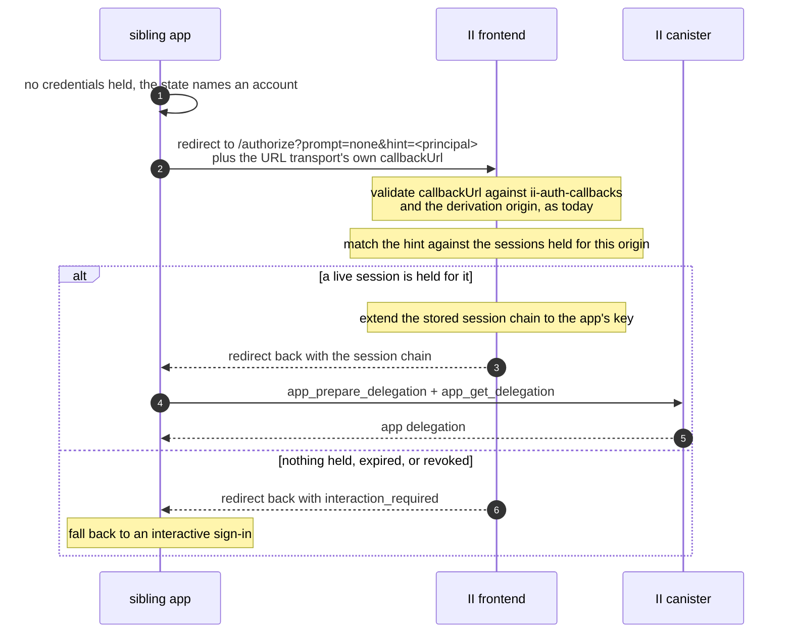

# Silent re-auth over the redirect transport: specification

**Design:** [silent-reauth-redirect.md](silent-reauth-redirect.md) covers what this builds and why. This document assumes it and does not repeat it.

**Depends on:** [revocable-app-sessions-spec.md](revocable-app-sessions-spec.md) for the session, its chain, the session handle that authenticates a chain-signed call, and the account principal `prepare_account_session` returns.

## The flow



The II frontend does not mint the app delegation here. It hands back the session chain and the app mints its own, exactly as on a first sign-in, so there is one path for that and not two.

### What actually reaches II, and what does not

| Value                   | Where it lives                                                                                                        | Does II see it                                                                                                               |
| ----------------------- | --------------------------------------------------------------------------------------------------------------------- | ---------------------------------------------------------------------------------------------------------------------------- |
| `prompt=none`           | Query param on the authorize URL, set by the client as an II extension                                                | Yes, below                                                                                                                   |
| `hint=<principal text>` | Query param on the authorize URL, likewise                                                                            | Yes, below                                                                                                                   |
| `resumable=true`        | Query param on the authorize URL, likewise, on the ceremony that **creates** a session                                | Yes. It decides whether a later `prompt=none` can resolve to what this ceremony creates                                      |
| `callbackUrl`           | The ICRC-167 URL transport's own return address: a full, query-less URL of the form `https://chat.example.com/reauth` | Yes, and it is validated against that origin's `ii-auth-callbacks`. Unchanged by this design                                 |
| `next=/some/path`       | A query param the app puts on **its own** `/reauth` URL                                                               | No. Never sent to II                                                                                                         |
| `returnTo`              | An `AuthClient` option, which `/reauth` sets from `next`                                                              | No. The client journals it so it survives the round trip, then does `location.replace(returnTo)` once the flow has completed |

So the return address II is given is a whole URL and an allow-listed one, not a path. Where the user lands _within_ the app afterwards is the app's business, handled entirely on its side, and II has no part in it. That separation is what keeps the callback allow-list meaningful: it enumerates a small fixed set of pages, and it would be worthless if II accepted an arbitrary path or URL alongside it.

---

## `prompt=none` rules

#### Renders nothing, ever

No consent screen, no account picker, no error page. Either the redirect carries a session chain or it carries `interaction_required`.

#### Never creates a session

A session comes only from `prepare_account_session`, which requires an anchor access method. `prompt=none` has no ceremony and therefore no access method, so it can only ever re-issue from a session that already exists. This is the same rule that stops a stolen session chain spawning siblings, and it is what keeps `prompt=none` from being a way to obtain authority rather than exercise it.

#### Resolves only sessions belonging to the requesting origin

The `hint` selects _among_ the sessions II holds for the origin being authorized. It never names an origin. Without this, any page could redirect to II with someone else's principal as the hint and collect a delegation.

This is the same shape as the caveat carried through from `read_certified_sso_bundle`: a value that resolves to something valid is not thereby a value that describes the caller, so the origin is checked separately rather than inferred. Here the origin comes from the authorize request, which the callback allowlist and `ii-alternative-origins` have already validated.

#### No new consent

Silently re-issuing to a sibling is inside consent already given: the user signed in for this derivation origin, and the siblings are the ones that origin's `ii-alternative-origins` authorizes. The set of apps that can be silently signed in is exactly the set the user's own domain declared.

---

## `resumable` rules

`prompt=none` asks to resume. `resumable` decides whether there will be anything to resume, and it is set on the ceremony that creates the session rather than on the one that resumes it.

Absent means no. A session Internet Identity has not been asked to keep is one a silent re-auth passes over as though it were not there — the record still exists, still mints for the browser holding its chain, and is still bounded by its lifetime and its idle bound, but nothing can find it again.

That default is a change from what came before, where every session was resumable because nothing could say otherwise. It is the safer direction: a sign-in that comes back without a ceremony is the surprising behaviour, not the expected one, and the flow that wants it is the one already setting `prompt` and `hint` deliberately.

**A client does not usually type it.** The condition it serves is the same condition that makes a silent re-auth reachable at all — a record one origin can read while holding no credential for it — and that is a property of where the client keeps its record. So the client's state store declares it and the client forwards the answer, per STATE-10 of [client-app-sessions-spec.md](client-app-sessions-spec.md). An application overrides it where it is doing something the store cannot know about.

**A resolved session's answer is inherited, not re-asked.** A silent re-auth that resolves to a session takes that session's resumability rather than the request's. Otherwise a domain whose siblings each acquire their own would have to carry the flag on every origin, and missing it on one would end resumption a hop later for reasons nobody could see.

**What the frontend keeps is split.** Internet Identity's frontend holds the account mapping — principal to anchor, account and origin — separately from the session key and its delegation. `resumable=false` drops the second and keeps the first, so a `hint` still resolves after the session has gone: the application gets an interactive sign-in aimed at the right account instead of an account picker. _This sign-in may return_ and _we still know who you were_ are different claims, and only the first is being refused.

## `hint` rules

`hint` is a principal: the one an app resolves to for the account behind a session. That is `Principal.selfAuthenticating(user_key)`, where `user_key` is what `app_prepare_delegation` hands the app, and it is the same value `prepare_account_session` returns as `account_principal`. That is how it reaches the state record a sibling reads it from.

The name belongs to this parameter and not to what the client stores. A sibling reads its state — the record of who is signed in on the domain and until when — and sends the principal from it as a `hint`; the record is not itself a hint, and calling it one made the two look like one thing when only the parameter is a suggestion II is free to refuse.

It exists because one origin can hold more than one session: the user has signed in there under more than one identity, or under more than one account of one identity. Without a hint II would have to guess, and guessing wrong signs the user in as the wrong persona.

#### Matching happens in the frontend, against the principal stored with each session

The keypairs the re-issue needs are the frontend's, so the candidates are the records it holds for the origin, and `prepare_account_session` returns `account_principal` for exactly this.

#### A held record is not proof the session still exists

Revoking from II settings or from another app deletes the canister record and leaves this browser's copy in place. Answering from the record alone would hand the app a chain that cannot mint, and the failure would surface at the app's first refresh as something the client cannot tell apart from a real error.

So the frontend checks first:

```candid
// Whether the calling session is still usable.
check_session : () -> (bool) query;
```

The call is signed by the session chain and carries nothing else, so it authenticates exactly as a refresh does and names no identity. A `false` answer discards the local record and denies with `interaction_required`.

It is a query, so a single node could forge the reply. That is acceptable here because the answer is advisory: every mint enforces the same conditions regardless, so a forged `true` costs one failed refresh and a forged `false` costs one unnecessary ceremony.

| Case                                                | Outcome                                                           |
| --------------------------------------------------- | ----------------------------------------------------------------- |
| Absent, exactly one session held for the origin     | Use it                                                            |
| Absent, several held                                | `interaction_required`. Picking for the user is worse than asking |
| Present, resolves to a session held for this origin | Use it                                                            |
| Present, resolves elsewhere or nowhere              | `interaction_required`                                            |

A hint is a preference, not a credential. It is safe for it to come from a cookie the app can read and write, because it can only select from what II already holds for that origin, and holding the session is what confers anything.

---

## Why siblings share one session

This falls out of the previous designs rather than needing anything:

- A shared `derivationOrigin` means every sibling derives the same principal, so they resolve to one **application** in the reference list.
- Sessions live on the account reference at `(anchor, application)`, so all siblings of one derivation origin share the same session records.
- The device id is per browser, so one browser has one session across the whole set.

So "sign in on one and the others are signed in" is not a copy between apps. There is one session and the siblings take turns re-issuing from it.

The same fact makes sign-out propagate. "Sign out of one and the others follow" holds because `app_revoke_session` removes the record they all share, not merely because the cookie was cleared. A sibling that ignored the cookie would still find nothing to re-issue from.

---

## Failure modes

| Situation                                                        | Outcome                                                                                      |
| ---------------------------------------------------------------- | -------------------------------------------------------------------------------------------- |
| No session held                                                  | `interaction_required`                                                                       |
| Session expired, or revoked from another app or from II settings | `interaction_required`                                                                       |
| Hint resolves to another origin's session                        | `interaction_required`                                                                       |
| Several sessions and no hint                                     | `interaction_required`                                                                       |
| Callback or derivation origin fails validation                   | `interaction_required` for a silent request, the existing redirect-transport error otherwise |

One outcome for every session-related case, so a client's fallback is a single branch. The `prompt=none` rules above already bound what a client can learn from it, since it only ever answers for the requesting origin.

`prompt=login`, and an absent `prompt`, run the interactive flow exactly as today.

---

## Constants

| Constant                    | Value                                          | Note                                                                                                                                                                                                                        |
| --------------------------- | ---------------------------------------------- | --------------------------------------------------------------------------------------------------------------------------------------------------------------------------------------------------------------------------- |
| `interaction_required` code | 3002                                           | In ICRC-25's 3xxx user-action range, so a client can tell a request needing a ceremony from a transport or protocol error                                                                                                   |
| Reason values               | `login_required`, `account_selection_required` | Carried in the error payload. A client may use them to word its prompt; it does not have to branch on them                                                                                                                  |
| Local record expiry margin  | 5 minutes                                      | A record within this of its expiry is not treated as usable, so a chain is never handed over that dies mid-request. Half the shortest session a caller can request, so a session near that floor is never answered silently |

Two pieces of browser state this relies on:

| State                            | Where                                        | Why                                                                                                                                                                                                                                                         |
| -------------------------------- | -------------------------------------------- | ----------------------------------------------------------------------------------------------------------------------------------------------------------------------------------------------------------------------------------------------------------- |
| The two authorize-URL parameters | `sessionStorage`, under one fixed key        | They must survive a round trip through an external identity provider, which navigates away and back. One key per tab is enough because a tab drives one authorize request at a time, and a fresh `/authorize` load that carries neither parameter clears it |
| The browser keypair              | IndexedDB, one per identity, non-extractable | A returning browser proves which browser it is, and rotates the key at each sign-in                                                                                                                                                                         |

## Requirements

Normative statements the implementation must satisfy, grouped by what they constrain.

### What reaches II

| #    | Requirement                                                                                                                                                                                                       |
| ---- | ----------------------------------------------------------------------------------------------------------------------------------------------------------------------------------------------------------------- |
| IN-1 | The three new values MUST travel as authorize-URL parameters, matching how the client already sends them, and MUST NOT be added to the ICRC request.                                                              |
| IN-2 | They MUST be the only new values II receives. The app's own return address MUST stay app-side and MUST NOT reach II.                                                                                              |
| IN-6 | `resumable` MUST be read on the ceremony that creates a session, and stored on the record it creates. A ceremony that resumes one MUST take the answer from that session rather than from its own request.        |
| IN-7 | An absent `resumable` MUST mean not resumable. A session Internet Identity was not asked to keep MUST be passed over by a silent request as though it did not exist, and MUST NOT be reported by any other route. |
| IN-3 | The redirect destination MUST remain the allow-listed callback the URL transport already uses.                                                                                                                    |
| IN-4 | Both values MUST survive a round trip through an external identity provider, so a silent request that needs one is still answered silently.                                                                       |
| IN-5 | An unreadable value MUST degrade to an interactive sign-in rather than fail the request, because both are preferences and neither is a credential.                                                                |

### Answering silently

| #      | Requirement                                                                                                                                                                                                                                                      |
| ------ | ---------------------------------------------------------------------------------------------------------------------------------------------------------------------------------------------------------------------------------------------------------------- |
| SIL-1  | A silent request that reaches the handler MUST render nothing: no consent screen, no account picker, no error page. A malformed one MUST still answer with a protocol error rather than a denial, and still render nothing.                                      |
| SIL-1a | A failure that leaves II with no validated address to answer on — a rejected callback, or a transport that never establishes — MAY render, because the alternative is to answer nobody at all. Every failure reached with a channel in hand is covered by SIL-1. |
| SIL-2  | A silent request MUST NOT create a session, having no access method with which to authorise one.                                                                                                                                                                 |
| SIL-3  | A silent request MUST be answered only from sessions held for the origin being authorised.                                                                                                                                                                       |
| SIL-4  | The frontend MUST confirm with the canister that a session it holds a record for still exists, and MUST discard the record and deny if it does not.                                                                                                              |
| SIL-5  | The frontend MUST return the session chain and let the app mint its own delegation, exactly as on first sign-in.                                                                                                                                                 |

### Choosing between sessions

| #     | Requirement                                                                                                                                                                |
| ----- | -------------------------------------------------------------------------------------------------------------------------------------------------------------------------- |
| SEL-1 | The selector MUST be the account principal an app resolves to, so it can only name a session the origin already holds.                                                     |
| SEL-2 | Selection MUST happen in the frontend, against the principal stored with each session.                                                                                     |
| SEL-3 | A selector resolving to another origin's session MUST be refused.                                                                                                          |
| SEL-4 | More than one candidate, with nothing to choose between them, MUST be refused rather than guessed.                                                                         |
| SEL-5 | A held session MUST be answered only when the request asks for silence. Everything else runs the ceremony, so silence is something an app opts into rather than a default. |
| SEL-6 | `prompt=login` MUST behave exactly as an absent `prompt`. It is accepted so a client can state its intent, and it selects no separate path: both run the ceremony.         |

### Failing

| #      | Requirement                                                                                                          |
| ------ | -------------------------------------------------------------------------------------------------------------------- |
| FAIL-1 | Every session-related failure MUST report one outcome, so a client needs a single fallback branch.                   |
| FAIL-2 | That outcome MUST be distinguishable from a transport or protocol error.                                             |
| FAIL-3 | The outcome MAY carry a reason a client can use to word its prompt, but MUST NOT require the client to branch on it. |

### Scope

| #       | Requirement                                                                                                                                                                                               |
| ------- | --------------------------------------------------------------------------------------------------------------------------------------------------------------------------------------------------------- |
| SCOPE-1 | The only canister change this design requires is the liveness query. Sharing between subdomains and sign-out propagation MUST follow from subdomains resolving to one account, and therefore one session. |
